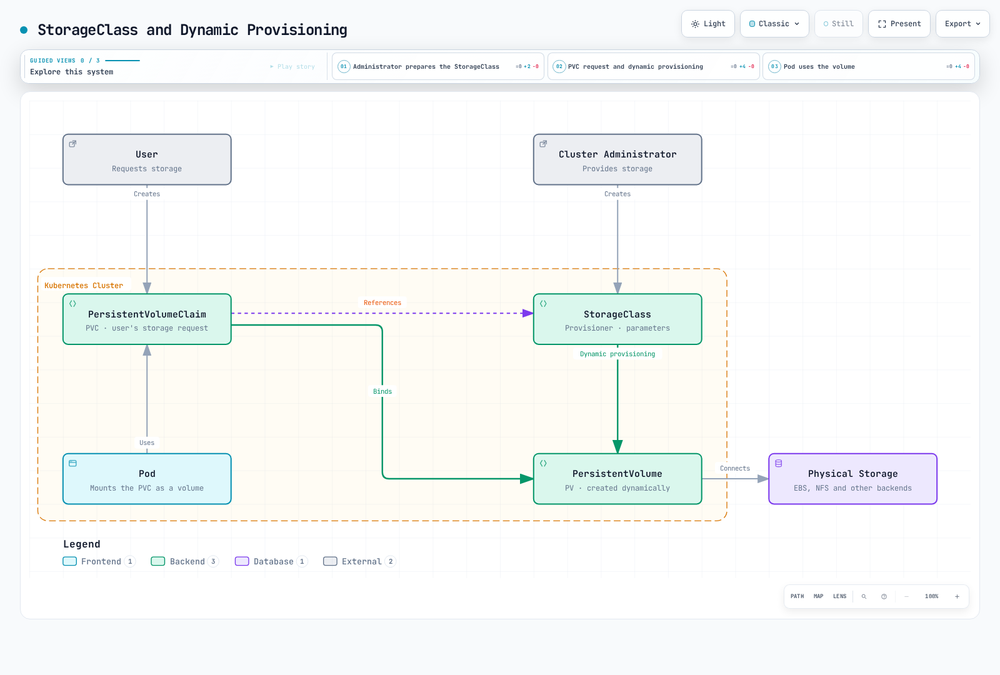

# Almacenamiento

> **Versiones compatibles**: Kubernetes 1.32, 1.33, 1.34
> **Última actualización**: February 19, 2026

En Kubernetes, el almacenamiento es una parte importante para guardar y administrar datos de aplicaciones en contenedores. En este capítulo, exploraremos en detalle los conceptos de almacenamiento de Kubernetes, incluidos Volumes, Persistent Volumes, Persistent Volume Claims y Storage Classes.

## Configuración del entorno de laboratorio

Para seguir los ejemplos de este documento, necesitarás las siguientes herramientas y entorno:

### Herramientas requeridas
- kubectl v1.34 o superior
- Un clúster de Kubernetes en funcionamiento (EKS, minikube, kind, etc.)
- Proveedor de almacenamiento (controlador EBS CSI para EKS)

### Configuración del ejemplo de almacenamiento

```bash
# Create namespace
kubectl create namespace storage-demo

# Create a simple PVC and Pod
kubectl -n storage-demo apply -f - <<EOF
apiVersion: v1
kind: PersistentVolumeClaim
metadata:
  name: data-pvc
spec:
  accessModes:
    - ReadWriteOnce
  resources:
    requests:
      storage: 1Gi
---
apiVersion: v1
kind: Pod
metadata:
  name: data-pod
spec:
  containers:
  - name: data-container
    image: busybox
    command: ["sh", "-c", "while true; do echo \$(date) >> /data/output.txt; sleep 5; done"]
    volumeMounts:
    - name: data-volume
      mountPath: /data
  volumes:
  - name: data-volume
    persistentVolumeClaim:
      claimName: data-pvc
EOF

# Check storage resources
kubectl -n storage-demo get pvc,pod
```

## Tabla de contenido

1. [Volumes](#volumes)
2. [Persistent Volumes](#persistent-volumes)
3. [Persistent Volume Claims](#persistent-volume-claims)
4. [Storage Classes](#storage-classes)
5. [Aprovisionamiento dinámico](#dynamic-provisioning)
6. [Snapshots de Volume](#volume-snapshots)
7. [Expansión de Volume](#volume-expansion)
8. [Projected Volumes](#projected-volumes)
9. [Generic Ephemeral Volumes](#generic-ephemeral-volumes)
10. [Modo Block Volume](#block-volume-mode)
11. [Clonación de Volume](#volume-cloning)
12. [ResourceQuota de almacenamiento](#storage-resourcequota)
13. [Opciones de almacenamiento en EKS](#storage-options-in-eks)

## Volumes

> **Concepto clave**: Los Volumes de Kubernetes son directorios donde los contenedores dentro de un Pod pueden almacenar y compartir datos, manteniendo los datos independientemente de los reinicios del contenedor.

Los Volumes de Kubernetes son directorios donde los contenedores dentro de un Pod pueden almacenar y compartir datos. Los Volumes están vinculados al ciclo de vida del Pod y, cuando se elimina el Pod, el Volume también se elimina (excepto para algunos tipos de Volume).

### Arquitectura de almacenamiento de Kubernetes


[🔍 Ver diagrama interactivo](https://www.atomai.click/kubernetes-docs/archmaps/en-core-04-storage-0.html)

### Por qué se necesitan los Volumes

1. **Persistencia de datos tras el reinicio del contenedor**: Cuando un contenedor se reinicia, su sistema de archivos se restablece, pero el uso de Volumes permite que los datos persistan.
2. **Compartición de datos entre contenedores**: Varios contenedores en el mismo Pod pueden compartir datos mediante Volumes.

### Comparación de los principales tipos de Volume

| Tipo de Volume | Ciclo de vida | Persistencia de datos | Caso de uso | Características |
|------------|----------|-----------------|----------|----------|
| **emptyDir** | Pod | Temporal | Datos temporales, caché, puntos de control | Los datos se eliminan cuando se elimina el Pod |
| **hostPath** | Node | Nivel de Node | Acceso al sistema de archivos del Node, monitoreo | Riesgo de seguridad: úselo con precaución |
| **configMap** | Configuración | Datos de configuración | Configuración de aplicaciones | Monta datos de configuración como Volume |
| **secret** | Configuración | Datos confidenciales | Certificados, contraseñas | Monta datos confidenciales como Volume |
| **persistentVolumeClaim** | Clúster | Permanente | Bases de datos, almacenamiento de archivos | Los datos persisten después del reinicio y la reprogramación del Pod |

### emptyDir

Un Volume `emptyDir` se crea cuando se asigna un Pod a un Node y persiste mientras el Pod se ejecuta en ese Node. Cuando el Pod se elimina del Node, los datos de `emptyDir` se eliminan permanentemente.

```yaml
apiVersion: v1
kind: Pod
metadata:
  name: test-pd
spec:
  containers:
  - image: nginx
    name: test-container
    volumeMounts:
    - mountPath: /cache
      name: cache-volume
  volumes:
  - name: cache-volume
    emptyDir: {}
```

### hostPath

Un Volume `hostPath` monta un archivo o directorio del sistema de archivos del Node en el Pod. Esto es útil para los Pods que necesitan acceso al sistema de archivos del Node, pero debe usarse con precaución debido a los riesgos de seguridad.

```yaml
apiVersion: v1
kind: Pod
metadata:
  name: test-hostpath
spec:
  containers:
  - image: nginx
    name: test-container
    volumeMounts:
    - mountPath: /test-pd
      name: test-volume
  volumes:
  - name: test-volume
    hostPath:
      path: /data
      type: Directory  # DirectoryOrCreate, Directory, FileOrCreate, File, Socket, CharDevice, BlockDevice
```

```yaml
apiVersion: v1
kind: Pod
metadata:
  name: test-pd
spec:
  containers:
  - image: nginx
    name: test-container
    volumeMounts:
    - mountPath: /test-pd
      name: test-volume
  volumes:
  - name: test-volume
    hostPath:
      path: /data
      type: Directory
```

#### configMap

Un Volume `configMap` monta datos de ConfigMap en un Pod. Los ConfigMaps se utilizan para almacenar datos de configuración en pares clave-valor.

```yaml
apiVersion: v1
kind: Pod
metadata:
  name: configmap-pod
spec:
  containers:
  - name: test
    image: busybox
    volumeMounts:
    - name: config-vol
      mountPath: /etc/config
  volumes:
  - name: config-vol
    configMap:
      name: log-config
      items:
      - key: log_level
        path: log_level
```

#### secret

Un Volume `secret` monta datos de Secret en un Pod. Los Secrets se utilizan para almacenar información confidencial como contraseñas, tokens y claves.

```yaml
apiVersion: v1
kind: Pod
metadata:
  name: secret-pod
spec:
  containers:
  - name: test
    image: busybox
    volumeMounts:
    - name: secret-vol
      mountPath: /etc/secret
      readOnly: true
  volumes:
  - name: secret-vol
    secret:
      secretName: mysecret
      items:
      - key: username
        path: my-username
```

#### nfs

Un Volume `nfs` monta un recurso compartido de NFS (Network File System) existente en un Pod.

```yaml
apiVersion: v1
kind: Pod
metadata:
  name: nfs-pod
spec:
  containers:
  - name: test
    image: busybox
    volumeMounts:
    - name: nfs-vol
      mountPath: /mnt/nfs
  volumes:
  - name: nfs-vol
    nfs:
      server: nfs-server.example.com
      path: /share
```

#### persistentVolumeClaim

Un Volume `persistentVolumeClaim` monta un PersistentVolumeClaim en un Pod. Este es uno de los tipos de Volume más utilizados.

```yaml
apiVersion: v1
kind: Pod
metadata:
  name: pvc-pod
spec:
  containers:
  - name: test
    image: busybox
    volumeMounts:
    - name: pvc-vol
      mountPath: /mnt/pvc
  volumes:
  - name: pvc-vol
    persistentVolumeClaim:
      claimName: my-pvc
```

#### CSI (Container Storage Interface)

Los Volumes CSI proporcionan una interfaz estándar entre Kubernetes y los sistemas de almacenamiento externos. Con CSI, los proveedores de almacenamiento pueden desarrollar sus propios controladores de almacenamiento sin modificar el código de Kubernetes.

```yaml
apiVersion: v1
kind: Pod
metadata:
  name: csi-pod
spec:
  containers:
  - name: test
    image: busybox
    volumeMounts:
    - name: csi-vol
      mountPath: /mnt/csi
  volumes:
  - name: csi-vol
    csi:
      driver: csi-driver.example.com
      volumeAttributes:
        foo: bar
      nodePublishSecretRef:
        name: csi-secret
```

## Persistent Volumes

Un Persistent Volume (PV) es almacenamiento del clúster aprovisionado por un administrador o aprovisionado dinámicamente mediante una Storage Class. Los PV tienen un ciclo de vida independiente de los Pods y se conservan incluso cuando se eliminan los Pods.


[🔍 Ver diagrama interactivo](https://www.atomai.click/kubernetes-docs/archmaps/en-core-04-storage-1.html)

### Creación de PV

```yaml
apiVersion: v1
kind: PersistentVolume
metadata:
  name: pv0001
spec:
  capacity:
    storage: 5Gi
  volumeMode: Filesystem
  accessModes:
    - ReadWriteOnce
  persistentVolumeReclaimPolicy: Recycle
  storageClassName: slow
  mountOptions:
    - hard
    - nfsvers=4.1
  nfs:
    path: /tmp
    server: 172.17.0.2
```

### Modos de acceso de PV

Los PV admiten los siguientes modos de acceso:

- **ReadWriteOnce (RWO)**: El Volume puede montarse como lectura-escritura por un solo Node.
- **ReadOnlyMany (ROX)**: El Volume puede montarse como solo lectura por varios Nodes.
- **ReadWriteMany (RWX)**: El Volume puede montarse como lectura-escritura por varios Nodes.
- **ReadWriteOncePod (RWOP)**: El Volume puede montarse como lectura-escritura por un solo Pod (Kubernetes 1.22+).

### Políticas de recuperación de PV

Los PV pueden tener las siguientes políticas de recuperación:

- **Retain**: Cuando se elimina el PVC, se conservan el PV y los datos. El administrador debe limpiarlos manualmente.
- **Delete**: Cuando se elimina el PVC, el PV y los recursos de almacenamiento externos se eliminan automáticamente.
- **Recycle**: Cuando se elimina el PVC, se eliminan los datos del PV y el PV vuelve a estar disponible (en desuso).

### Estado de PV

Los PV pueden tener los siguientes estados:

- **Available**: Recurso disponible que todavía no está vinculado a una reclamación.
- **Bound**: Vinculado a una reclamación.
- **Released**: La reclamación se ha eliminado, pero el clúster aún no ha recuperado el recurso.
- **Failed**: La recuperación automática falló.

## Persistent Volume Claims

Un Persistent Volume Claim (PVC) es una solicitud de almacenamiento de un usuario. Los PVC son similares a los PV, pero los PVC son la forma en que los usuarios solicitan almacenamiento, mientras que los PV son la forma en que los administradores proporcionan almacenamiento.

### Creación de PVC

```yaml
apiVersion: v1
kind: PersistentVolumeClaim
metadata:
  name: myclaim
spec:
  accessModes:
    - ReadWriteOnce
  volumeMode: Filesystem
  resources:
    requests:
      storage: 8Gi
  storageClassName: slow
  selector:
    matchLabels:
      release: "stable"
    matchExpressions:
      - {key: environment, operator: In, values: [dev]}
```

### Vinculación de PVC y PV

Cuando se crea un PVC, Kubernetes encuentra y vincula un PV que cumple los requisitos del PVC (tamaño de almacenamiento, modos de acceso, Storage Class, selector, etc.). Si no existe un PV adecuado, el PVC permanece en estado Pending.

### Uso de PVC

Los PVC pueden utilizarse como Volumes en Pods:

```yaml
apiVersion: v1
kind: Pod
metadata:
  name: mypod
spec:
  containers:
    - name: myfrontend
      image: nginx
      volumeMounts:
      - mountPath: "/var/www/html"
        name: mypd
  volumes:
    - name: mypd
      persistentVolumeClaim:
        claimName: myclaim
```

## Storage Classes

Las Storage Classes describen las "clases" de almacenamiento proporcionadas por los administradores. Las Storage Classes se utilizan para aprovisionar PV de forma dinámica.



[🔍 Ver diagrama interactivo](https://www.atomai.click/kubernetes-docs/archmaps/en-core-04-storage-2.html)

### Creación de Storage Class

```yaml
apiVersion: storage.k8s.io/v1
kind: StorageClass
metadata:
  name: standard
provisioner: kubernetes.io/aws-ebs
parameters:
  type: gp3
  fsType: ext4
reclaimPolicy: Delete
allowVolumeExpansion: true
volumeBindingMode: WaitForFirstConsumer
```

Este ejemplo crea una clase de almacenamiento que aprovisiona Volumes gp3 de AWS EBS.

### Provisioners

Las Storage Classes especifican un provisioner utilizado para aprovisionar Volumes. Los provisioners comunes incluyen:

- `kubernetes.io/aws-ebs`: Volumes de AWS EBS
- `kubernetes.io/gce-pd`: Persistent Disks de GCE
- `kubernetes.io/azure-disk`: Disks de Azure
- `kubernetes.io/azure-file`: File de Azure
- `kubernetes.io/cinder`: Volumes Cinder de OpenStack
- `kubernetes.io/glusterfs`: Volumes GlusterFS
- `kubernetes.io/rbd`: Volumes Ceph RBD
- `kubernetes.io/nfs`: Volumes NFS

### Modos de vinculación de Volume

Las Storage Classes admiten los siguientes modos de vinculación de Volume:

- **Immediate**: Valor predeterminado; los Volumes se aprovisionan de inmediato cuando se crea el PVC.
- **WaitForFirstConsumer**: Retrasa el aprovisionamiento del Volume hasta que un Pod intenta usar el PVC. Esto es útil para garantizar que los Volumes se aprovisionen en la misma zona que los Pods.

### Storage Class predeterminada

Se puede establecer una Storage Class predeterminada para el clúster. Si no se especifica ninguna Storage Class en un PVC, se utiliza la Storage Class predeterminada.

```yaml
apiVersion: storage.k8s.io/v1
kind: StorageClass
metadata:
  name: standard
  annotations:
    storageclass.kubernetes.io/is-default-class: "true"
provisioner: kubernetes.io/aws-ebs
parameters:
  type: gp3
```

## Aprovisionamiento dinámico

El aprovisionamiento dinámico es una función que crea automáticamente PV cuando se crean PVC. Esto permite a los usuarios solicitar almacenamiento cuando lo necesitan sin que los administradores creen previamente los PV.

### Ejemplo de aprovisionamiento dinámico

1. Crear Storage Class:

```yaml
apiVersion: storage.k8s.io/v1
kind: StorageClass
metadata:
  name: fast
provisioner: kubernetes.io/aws-ebs
parameters:
  type: gp3
  iopsPerGB: "10"
```

2. Crear PVC:

```yaml
apiVersion: v1
kind: PersistentVolumeClaim
metadata:
  name: myclaim
spec:
  accessModes:
    - ReadWriteOnce
  resources:
    requests:
      storage: 100Gi
  storageClassName: fast
```

3. Usar PVC en Pod:

```yaml
apiVersion: v1
kind: Pod
metadata:
  name: mypod
spec:
  containers:
    - name: myfrontend
      image: nginx
      volumeMounts:
      - mountPath: "/var/www/html"
        name: mypd
  volumes:
    - name: mypd
      persistentVolumeClaim:
        claimName: myclaim
```

## Snapshots de Volume

Kubernetes admite snapshots de Volume para crear copias de PV en un momento dado. Esto es útil para escenarios de respaldo y restauración.


[🔍 Ver diagrama interactivo](https://www.atomai.click/kubernetes-docs/archmaps/en-core-04-storage-3.html)

### Volume Snapshot Class

```yaml
apiVersion: snapshot.storage.k8s.io/v1
kind: VolumeSnapshotClass
metadata:
  name: csi-hostpath-snapclass
driver: hostpath.csi.k8s.io
deletionPolicy: Delete
```

### Crear Volume Snapshot

```yaml
apiVersion: snapshot.storage.k8s.io/v1
kind: VolumeSnapshot
metadata:
  name: new-snapshot
spec:
  volumeSnapshotClassName: csi-hostpath-snapclass
  source:
    persistentVolumeClaimName: myclaim
```

### Crear PVC a partir de Snapshot

```yaml
apiVersion: v1
kind: PersistentVolumeClaim
metadata:
  name: restore-pvc
spec:
  storageClassName: csi-hostpath-sc
  dataSource:
    name: new-snapshot
    kind: VolumeSnapshot
    apiGroup: snapshot.storage.k8s.io
  accessModes:
    - ReadWriteOnce
  resources:
    requests:
      storage: 10Gi
```

## Expansión de Volume

Kubernetes admite la capacidad de expandir el tamaño de los PVC. Para ello, debe establecerse `allowVolumeExpansion: true` en la Storage Class.


[🔍 Ver diagrama interactivo](https://www.atomai.click/kubernetes-docs/archmaps/en-core-04-storage-4.html)

### Expansión de PVC

```yaml
apiVersion: v1
kind: PersistentVolumeClaim
metadata:
  name: myclaim
spec:
  accessModes:
    - ReadWriteOnce
  resources:
    requests:
      storage: 16Gi  # Expanded from original 8Gi to 16Gi
  storageClassName: standard
```

## Projected Volumes

Los Projected Volumes permiten combinar varias fuentes de Volume en un único montaje de Volume. Esto es útil cuando necesitas exponer secrets, configMaps, downwardAPI y serviceAccountToken juntos en un único directorio.

### Fuentes compatibles

- **secret**: Monta datos de Secret
- **configMap**: Monta datos de configuración
- **downwardAPI**: Expone metadatos de Pod y contenedor
- **serviceAccountToken**: Monta tokens de cuenta de servicio con expiración configurable

### Ejemplo de Projected Volume

```yaml
apiVersion: v1
kind: Pod
metadata:
  name: projected-volume-pod
spec:
  containers:
  - name: app
    image: busybox
    command: ["sh", "-c", "ls -la /etc/projected && sleep 3600"]
    volumeMounts:
    - name: all-in-one
      mountPath: /etc/projected
      readOnly: true
  volumes:
  - name: all-in-one
    projected:
      sources:
      - secret:
          name: db-credentials
          items:
          - key: username
            path: db/username
          - key: password
            path: db/password
      - configMap:
          name: app-config
          items:
          - key: config.yaml
            path: config/app.yaml
      - downwardAPI:
          items:
          - path: labels
            fieldRef:
              fieldPath: metadata.labels
          - path: cpu-request
            resourceFieldRef:
              containerName: app
              resource: requests.cpu
      - serviceAccountToken:
          path: token
          expirationSeconds: 3600
          audience: api
```

Esta configuración crea un único Volume en `/etc/projected` que contiene:
- `/etc/projected/db/username` y `/etc/projected/db/password` del secret
- `/etc/projected/config/app.yaml` del configMap
- `/etc/projected/labels` y `/etc/projected/cpu-request` de downwardAPI
- `/etc/projected/token` con un token de cuenta de servicio de rotación automática

### Proyección de token de cuenta de servicio

La proyección de token de cuenta de servicio proporciona tokens con una duración y una audiencia limitadas:

```yaml
apiVersion: v1
kind: Pod
metadata:
  name: token-projected-pod
spec:
  serviceAccountName: my-service-account
  containers:
  - name: app
    image: myapp:latest
    volumeMounts:
    - name: token
      mountPath: /var/run/secrets/tokens
  volumes:
  - name: token
    projected:
      sources:
      - serviceAccountToken:
          path: api-token
          expirationSeconds: 7200  # 2 hours
          audience: my-api-service
```

## Generic Ephemeral Volumes

Los Generic Ephemeral Volumes proporcionan almacenamiento similar a PVC vinculado al ciclo de vida del Pod. A diferencia de emptyDir, utilizan toda la capacidad de los PVC y las StorageClasses, incluido el aprovisionamiento dinámico.

### Diferencias con emptyDir

| Característica | emptyDir | Generic Ephemeral Volume |
|---------|----------|--------------------------|
| **Backend de almacenamiento** | Almacenamiento local del Node o memoria | Cualquier controlador CSI |
| **Aprovisionamiento** | Automático, sencillo | Usa StorageClass, aprovisionamiento dinámico |
| **Límites de tamaño** | sizeLimit (flexible) | Administración completa de capacidad de PVC |
| **Snapshots** | No compatibles | Compatibles (si el controlador CSI lo admite) |
| **Características de almacenamiento** | Básicas | Funciones CSI completas (cifrado, IOPS, etc.) |
| **Persistencia** | Se pierde cuando se elimina el Pod | Se pierde cuando se elimina el Pod |

### Ejemplo de Generic Ephemeral Volume

```yaml
apiVersion: v1
kind: Pod
metadata:
  name: ephemeral-volume-pod
spec:
  containers:
  - name: app
    image: busybox
    command: ["sh", "-c", "dd if=/dev/zero of=/scratch/data bs=1M count=100 && sleep 3600"]
    volumeMounts:
    - name: scratch
      mountPath: /scratch
  volumes:
  - name: scratch
    ephemeral:
      volumeClaimTemplate:
        metadata:
          labels:
            type: scratch-storage
        spec:
          accessModes:
          - ReadWriteOnce
          storageClassName: fast-ssd
          resources:
            requests:
              storage: 10Gi
```

### Casos de uso

1. **Canalizaciones de CI/CD**: Artefactos de compilación temporales con capacidad de almacenamiento garantizada
2. **Procesamiento de datos**: Espacio de trabajo temporal con requisitos específicos de rendimiento
3. **Pruebas**: Bases de datos temporales o cachés con características CSI
4. **Machine learning**: Puntos de control temporales de modelos con almacenamiento de alto rendimiento

### Deployment con Generic Ephemeral Volumes

```yaml
apiVersion: apps/v1
kind: Deployment
metadata:
  name: ml-training
spec:
  replicas: 3
  selector:
    matchLabels:
      app: ml-training
  template:
    metadata:
      labels:
        app: ml-training
    spec:
      containers:
      - name: trainer
        image: ml-trainer:latest
        volumeMounts:
        - name: checkpoint-storage
          mountPath: /checkpoints
      volumes:
      - name: checkpoint-storage
        ephemeral:
          volumeClaimTemplate:
            spec:
              accessModes:
              - ReadWriteOnce
              storageClassName: high-iops
              resources:
                requests:
                  storage: 50Gi
```

## Modo Block Volume

Kubernetes admite Volumes de bloques sin procesar además de Volumes de sistema de archivos. Los Volumes de bloques presentan el almacenamiento como un dispositivo de bloques sin procesar sin sistema de archivos, lo cual es útil para las aplicaciones que administran su propia disposición de datos.

### Modo Filesystem frente a Block

| Aspecto | Filesystem (predeterminado) | Block |
|--------|---------------------|-------|
| **volumeMode** | `Filesystem` | `Block` |
| **Tipo de montaje** | Montado como directorio | Expuesto como archivo de dispositivo |
| **Sistema de archivos** | ext4, xfs, etc. | Ninguno (sin procesar) |
| **Acceso en el Pod** | `/mnt/data/` | `/dev/xvda` |
| **Caso de uso** | Aplicaciones generales | Bases de datos, aplicaciones especializadas |

### PV y PVC de Block Volume

```yaml
# PersistentVolume with Block mode
apiVersion: v1
kind: PersistentVolume
metadata:
  name: block-pv
spec:
  capacity:
    storage: 100Gi
  volumeMode: Block
  accessModes:
  - ReadWriteOnce
  persistentVolumeReclaimPolicy: Retain
  storageClassName: block-storage
  csi:
    driver: ebs.csi.aws.com
    volumeHandle: vol-0123456789abcdef0
---
# PersistentVolumeClaim for Block volume
apiVersion: v1
kind: PersistentVolumeClaim
metadata:
  name: block-pvc
spec:
  volumeMode: Block
  accessModes:
  - ReadWriteOnce
  storageClassName: block-storage
  resources:
    requests:
      storage: 100Gi
```

### Uso de Block Volumes en Pods

```yaml
apiVersion: v1
kind: Pod
metadata:
  name: block-volume-pod
spec:
  containers:
  - name: database
    image: custom-database:latest
    volumeDevices:
    - name: data
      devicePath: /dev/xvda
  volumes:
  - name: data
    persistentVolumeClaim:
      claimName: block-pvc
```

Nota: Los Block Volumes utilizan `volumeDevices` y `devicePath` en lugar de `volumeMounts` y `mountPath`.

### Casos de uso de Block Volumes

1. **Bases de datos**: MySQL, PostgreSQL o MongoDB que se benefician del acceso directo al disco
2. **Sistemas de archivos personalizados**: Aplicaciones que usan sistemas de archivos especializados como ZFS o LVM
3. **Almacenamiento de alto rendimiento**: Aplicaciones que requieren I/O directo sin sobrecarga del sistema de archivos
4. **Virtualización de almacenamiento**: Soluciones de almacenamiento definidas por software

## Clonación de Volume

La clonación de Volume crea un nuevo PVC con el contenido de un PVC existente. Esto es útil para crear entornos de prueba, duplicar datos o migrar cargas de trabajo.

### Requisitos previos

- El controlador CSI debe admitir la clonación de Volume
- Los PVC de origen y destino deben estar en el mismo namespace
- El origen y el destino deben usar la misma StorageClass
- El origen y el destino deben tener el mismo volumeMode

### Ejemplo de clonación de PVC

```yaml
# Source PVC (existing)
apiVersion: v1
kind: PersistentVolumeClaim
metadata:
  name: source-pvc
  namespace: production
spec:
  accessModes:
  - ReadWriteOnce
  storageClassName: ebs-sc
  resources:
    requests:
      storage: 100Gi
---
# Clone PVC using dataSource
apiVersion: v1
kind: PersistentVolumeClaim
metadata:
  name: cloned-pvc
  namespace: production
spec:
  accessModes:
  - ReadWriteOnce
  storageClassName: ebs-sc
  resources:
    requests:
      storage: 100Gi  # Must be >= source size
  dataSource:
    kind: PersistentVolumeClaim
    name: source-pvc
```

### Clonación frente a Snapshots

| Característica | Clonación de Volume | Snapshots de Volume |
|---------|---------------|------------------|
| **Resultado** | Nuevo PVC con datos | Objeto Snapshot |
| **Caso de uso** | Duplicar Volume activo | Respaldo de un momento dado |
| **Rendimiento** | Puede ser más lenta (copia completa) | Normalmente más rápido (copy-on-write) |
| **Entre namespaces** | No | No |
| **Sobrecarga de almacenamiento** | Copia completa | Incremental |

### Clon para pruebas

```yaml
apiVersion: v1
kind: PersistentVolumeClaim
metadata:
  name: test-db-clone
  namespace: staging
spec:
  accessModes:
  - ReadWriteOnce
  storageClassName: ebs-sc
  resources:
    requests:
      storage: 100Gi
  dataSource:
    kind: PersistentVolumeClaim
    name: production-db-pvc
---
apiVersion: v1
kind: Pod
metadata:
  name: test-database
  namespace: staging
spec:
  containers:
  - name: postgres
    image: postgres:15
    volumeMounts:
    - name: data
      mountPath: /var/lib/postgresql/data
  volumes:
  - name: data
    persistentVolumeClaim:
      claimName: test-db-clone
```

## ResourceQuota de almacenamiento

ResourceQuota puede limitar el consumo de almacenamiento dentro de un namespace, incluido el número de PVC y la capacidad total de almacenamiento.

### Campos de cuota relacionados con el almacenamiento

| Campo | Descripción |
|-------|-------------|
| **persistentvolumeclaims** | Número total de PVC permitidos |
| **requests.storage** | Capacidad total de almacenamiento de todos los PVC |
| **\<storage-class\>.storageclass.storage.k8s.io/requests.storage** | Capacidad de almacenamiento para StorageClass específica |
| **\<storage-class\>.storageclass.storage.k8s.io/persistentvolumeclaims** | Recuento de PVC para StorageClass específica |

### Ejemplo de ResourceQuota

```yaml
apiVersion: v1
kind: ResourceQuota
metadata:
  name: storage-quota
  namespace: team-a
spec:
  hard:
    # Total limits
    persistentvolumeclaims: "10"
    requests.storage: "500Gi"

    # Per-StorageClass limits
    ebs-sc.storageclass.storage.k8s.io/requests.storage: "200Gi"
    ebs-sc.storageclass.storage.k8s.io/persistentvolumeclaims: "5"

    efs-sc.storageclass.storage.k8s.io/requests.storage: "300Gi"
    efs-sc.storageclass.storage.k8s.io/persistentvolumeclaims: "5"
```

### Comprobación del estado de ResourceQuota

```bash
# View quota status
kubectl get resourcequota storage-quota -n team-a -o yaml

# Example output
status:
  hard:
    persistentvolumeclaims: "10"
    requests.storage: "500Gi"
  used:
    persistentvolumeclaims: "3"
    requests.storage: "150Gi"
```

### LimitRange para almacenamiento

LimitRange puede establecer valores predeterminados y límites para las solicitudes de almacenamiento de PVC:

```yaml
apiVersion: v1
kind: LimitRange
metadata:
  name: storage-limits
  namespace: team-a
spec:
  limits:
  - type: PersistentVolumeClaim
    min:
      storage: 1Gi
    max:
      storage: 100Gi
    default:
      storage: 10Gi
```

Esto garantiza lo siguiente:
- El tamaño mínimo de PVC es 1Gi
- El tamaño máximo de PVC es 100Gi
- El tamaño predeterminado (si no se especifica) es 10Gi

## Opciones de almacenamiento en EKS

Hay diversas opciones de almacenamiento disponibles en Amazon EKS. Cada opción tiene distintos casos de uso y características de rendimiento, por lo que es importante elegir el almacenamiento adecuado para los requisitos de tu aplicación.


[🔍 Ver diagrama interactivo](https://www.atomai.click/kubernetes-docs/archmaps/en-core-04-storage-5.html)

### Amazon EBS

Amazon EBS (Elastic Block Store) proporciona Volumes de almacenamiento en bloques que se pueden conectar a instancias EC2. En EKS, puedes usar el controlador EBS CSI para montar Volumes EBS en Pods de Kubernetes.

#### Instalación del controlador EBS CSI

```bash
kubectl apply -k "github.com/kubernetes-sigs/aws-ebs-csi-driver/deploy/kubernetes/overlays/stable/?ref=master"
```

#### EBS Storage Class

```yaml
apiVersion: storage.k8s.io/v1
kind: StorageClass
metadata:
  name: ebs-sc
provisioner: ebs.csi.aws.com
parameters:
  type: gp3
  fsType: ext4
  encrypted: "true"
volumeBindingMode: WaitForFirstConsumer
```

#### Tipos de Volume EBS

Amazon EBS ofrece varios tipos de Volume:

1. **gp3**: Volumes SSD de uso general adecuados para la mayoría de las cargas de trabajo. Proporciona 3.000 IOPS y un rendimiento de 125 MB/s de base, ampliables hasta 16.000 IOPS y 1.000 MB/s con un costo adicional.

2. **io2**: Volumes SSD de alto rendimiento adecuados para cargas de trabajo que requieren IOPS altos. Proporciona hasta 500 IOPS por GiB, ampliables hasta 64.000 IOPS.

3. **st1**: Volumes HDD optimizados para rendimiento adecuados para cargas de trabajo intensivas en rendimiento, como big data, almacenes de datos y procesamiento de logs.

4. **sc1**: Volumes HDD fríos adecuados para datos a los que se accede con poca frecuencia.

#### Ejemplo de EBS Storage Class (gp3)

```yaml
apiVersion: storage.k8s.io/v1
kind: StorageClass
metadata:
  name: ebs-gp3
provisioner: ebs.csi.aws.com
parameters:
  type: gp3
  iops: "3000"
  throughput: "125"
  encrypted: "true"
  kmsKeyId: "arn:aws:kms:us-west-2:111122223333:key/1234abcd-12ab-34cd-56ef-1234567890ab"
volumeBindingMode: WaitForFirstConsumer
```

#### Ejemplo de EBS Storage Class (io2)

```yaml
apiVersion: storage.k8s.io/v1
kind: StorageClass
metadata:
  name: ebs-io2
provisioner: ebs.csi.aws.com
parameters:
  type: io2
  iops: "10000"
  encrypted: "true"
volumeBindingMode: WaitForFirstConsumer
```

### Amazon EFS

Amazon EFS (Elastic File System) proporciona almacenamiento de archivos escalable al que pueden acceder simultáneamente varias instancias EC2. EFS admite el modo de acceso ReadWriteMany, lo que lo hace útil cuando varios Pods necesitan compartir el mismo Volume.

#### Instalación del controlador EFS CSI

```bash
kubectl apply -k "github.com/kubernetes-sigs/aws-efs-csi-driver/deploy/kubernetes/overlays/stable/?ref=master"
```

#### Crear un sistema de archivos EFS

Para crear un sistema de archivos EFS, puedes usar AWS Management Console, AWS CLI o AWS CloudFormation.

Ejemplo de AWS CLI:

```bash
# Create EFS file system
aws efs create-file-system \
  --creation-token eks-efs \
  --performance-mode generalPurpose \
  --throughput-mode bursting \
  --tags Key=Name,Value=EKS-EFS

# Store file system ID
FS_ID=$(aws efs describe-file-systems \
  --creation-token eks-efs \
  --query "FileSystems[0].FileSystemId" \
  --output text)

# Create mount target (for each subnet)
aws efs create-mount-target \
  --file-system-id $FS_ID \
  --subnet-id subnet-0eabfaa81fb22bcaf \
  --security-groups sg-068000ccf82dfba88
```

#### EFS Storage Class

```yaml
apiVersion: storage.k8s.io/v1
kind: StorageClass
metadata:
  name: efs-sc
provisioner: efs.csi.aws.com
parameters:
  provisioningMode: efs-ap
  fileSystemId: fs-1234abcd
  directoryPerms: "700"
```

#### EFS Access Point con PV y PVC

```yaml
# Persistent Volume
apiVersion: v1
kind: PersistentVolume
metadata:
  name: efs-pv
spec:
  capacity:
    storage: 5Gi
  volumeMode: Filesystem
  accessModes:
    - ReadWriteMany
  persistentVolumeReclaimPolicy: Retain
  storageClassName: efs-sc
  csi:
    driver: efs.csi.aws.com
    volumeHandle: fs-1234abcd::fsap-0123456789abcdef

# Persistent Volume Claim
apiVersion: v1
kind: PersistentVolumeClaim
metadata:
  name: efs-pvc
spec:
  accessModes:
    - ReadWriteMany
  storageClassName: efs-sc
  resources:
    requests:
      storage: 5Gi
```

#### Modos de rendimiento de EFS

EFS ofrece dos modos de rendimiento:

1. **General Purpose**: Modo predeterminado recomendado para la mayoría de las cargas de trabajo de sistemas de archivos. Proporciona baja latencia.

2. **Max I/O**: Adecuado para cargas de trabajo que requieren alto rendimiento y procesamiento paralelo. Tiene una latencia ligeramente mayor, pero proporciona mayor rendimiento.

#### Modos de throughput de EFS

EFS ofrece tres modos de throughput:

1. **Bursting**: El throughput base se asigna según el tamaño del sistema de archivos, y los créditos de ráfaga proporcionan temporalmente un throughput mayor.

2. **Provisioned**: Proporciona el throughput especificado independientemente del tamaño del sistema de archivos.

3. **Elastic**: Escala automáticamente el throughput hacia arriba y hacia abajo según la carga de trabajo.

### Amazon FSx for Lustre

Amazon FSx for Lustre proporciona sistemas de archivos de alto rendimiento para cargas de trabajo de computación de alto rendimiento. FSx for Lustre es adecuado para el procesamiento de datos a gran escala, machine learning y cargas de trabajo de análisis.

#### Instalación del controlador FSx for Lustre CSI

```bash
kubectl apply -k "github.com/kubernetes-sigs/aws-fsx-csi-driver/deploy/kubernetes/overlays/stable/?ref=master"
```

#### Crear un sistema de archivos FSx for Lustre

Ejemplo de AWS CLI:

```bash
aws fsx create-file-system \
  --file-system-type LUSTRE \
  --storage-capacity 1200 \
  --subnet-ids subnet-0eabfaa81fb22bcaf \
  --lustre-configuration DeploymentType=SCRATCH_2,PerUnitStorageThroughput=200
```

#### FSx for Lustre Storage Class

```yaml
apiVersion: storage.k8s.io/v1
kind: StorageClass
metadata:
  name: fsx-sc
provisioner: fsx.csi.aws.com
parameters:
  subnetId: subnet-0eabfaa81fb22bcaf
  securityGroupIds: sg-068000ccf82dfba88
  deploymentType: SCRATCH_2
  automaticBackupRetentionDays: "0"
  dailyAutomaticBackupStartTime: "00:00"
  copyTagsToBackups: "false"
  perUnitStorageThroughput: "200"
  dataCompressionType: "NONE"
  weeklyMaintenanceStartTime: "7:09:00"
```

#### Tipos de Deployment de FSx for Lustre

FSx for Lustre ofrece tres tipos de Deployment:

1. **SCRATCH_1**: Opción más económica para almacenamiento temporal y procesamiento a corto plazo. No hay replicación de datos, por lo que la durabilidad es baja.

2. **SCRATCH_2**: Proporciona mayor throughput en ráfaga que SCRATCH_1 y recupera automáticamente los datos cuando falla el servidor.

3. **PERSISTENT**: Adecuado para cargas de trabajo que requieren almacenamiento y throughput a largo plazo. Proporciona replicación de datos y recuperación automática.

#### Capacidad de almacenamiento y throughput de FSx for Lustre

La capacidad de almacenamiento y el throughput de FSx for Lustre se configuran de la siguiente manera:

- **Capacidad de almacenamiento**: Comienza en un mínimo de 1,2 TiB y aumenta en incrementos de 2,4 TiB.
- **Throughput**: Se determina mediante el tipo de Deployment y la capacidad de almacenamiento.
  - SCRATCH_2: 200 MB/s o 1.000 MB/s por TiB de almacenamiento
  - PERSISTENT: 50 MB/s, 100 MB/s o 200 MB/s por TiB de almacenamiento

### Configuración de FSx for Lustre para cargas de trabajo vLLM

Las cargas de trabajo de modelos de AI a gran escala, como vLLM (Vector Language Model), requieren almacenamiento con alto throughput y baja latencia. FSx for Lustre es una solución ideal que cumple estos requisitos.

#### FSx for Lustre Storage Class para vLLM

```yaml
apiVersion: storage.k8s.io/v1
kind: StorageClass
metadata:
  name: fsx-lustre-vllm
provisioner: fsx.csi.aws.com
parameters:
  subnetId: subnet-0eabfaa81fb22bcaf
  securityGroupIds: sg-068000ccf82dfba88
  deploymentType: PERSISTENT_1
  perUnitStorageThroughput: "200"
  dataCompressionType: "NONE"
  storageCapacity: "4800"  # 4.8 TiB
reclaimPolicy: Retain
volumeBindingMode: Immediate
```

#### PVC para cargas de trabajo vLLM

```yaml
apiVersion: v1
kind: PersistentVolumeClaim
metadata:
  name: vllm-model-storage
spec:
  accessModes:
    - ReadWriteMany
  resources:
    requests:
      storage: 4800Gi
  storageClassName: fsx-lustre-vllm
```

#### Ejemplo de Deployment de vLLM

```yaml
apiVersion: apps/v1
kind: Deployment
metadata:
  name: vllm-inference
spec:
  replicas: 1
  selector:
    matchLabels:
      app: vllm-inference
  template:
    metadata:
      labels:
        app: vllm-inference
    spec:
      nodeSelector:
        node.kubernetes.io/instance-type: g5.12xlarge
      containers:
      - name: vllm
        image: vllm-inference:latest
        resources:
          limits:
            nvidia.com/gpu: 4
          requests:
            nvidia.com/gpu: 4
            memory: "64Gi"
            cpu: "32"
        volumeMounts:
        - name: model-storage
          mountPath: /models
      volumes:
      - name: model-storage
        persistentVolumeClaim:
          claimName: vllm-model-storage
```

#### Consejos de optimización del rendimiento de vLLM

1. **Seleccionar el throughput adecuado**: Para cargas de trabajo vLLM, se recomienda elegir al menos 200 MB/s por TiB de throughput.

2. **Optimizar la capacidad de almacenamiento**: Asigna suficiente capacidad de almacenamiento teniendo en cuenta el tamaño del modelo y del conjunto de datos.

3. **Optimización de red**: Asegúrate de que el sistema de archivos FSx for Lustre y los Nodes de EKS estén en la misma zona de disponibilidad.

4. **Selección de tipo de instancia**: Usa instancias de GPU (por ejemplo, g5.12xlarge) para optimizar el rendimiento de las cargas de trabajo vLLM.

5. **Configuración de memoria**: Asigna memoria suficiente según el tamaño del modelo.

6. **Opciones de montaje del sistema de archivos**: Usa opciones de montaje adecuadas para un rendimiento óptimo.

   ```bash
   mount -t lustre -o noatime,flock fs-1234abcd.fsx.us-west-2.amazonaws.com@tcp:/fsx /mnt/fsx
   ```

### Comparación de opciones de almacenamiento

| Opción de almacenamiento | Modo de acceso | Caso de uso | Rendimiento | Costo | Escalabilidad |
|---------------|-------------|----------|-------------|------|-------------|
| Amazon EBS | ReadWriteOnce | Almacenamiento en bloques para un solo Pod | Medio-alto | Medio | Limitada (un solo Node) |
| Amazon EFS | ReadWriteMany | Almacenamiento de archivos compartido por varios Pods | Medio | Medio-alto | Alta (varios Nodes) |
| Amazon FSx for Lustre | ReadWriteMany | HPC, ML, análisis | Muy alto | Alto | Muy alta (acceso paralelo) |

### Guía de selección de almacenamiento de EKS

1. **Cuando se necesita almacenamiento en bloques para un solo Pod**: Amazon EBS
   - Bases de datos
   - Aplicaciones con estado
   - Cargas de trabajo que se ejecutan en un solo Node

2. **Cuando se necesita almacenamiento de archivos compartido por varios Pods**: Amazon EFS
   - Contenido de servidores web
   - Archivos de configuración compartidos
   - Procesamiento de datos a escala media

3. **Cuando se necesita almacenamiento de archivos de alto rendimiento**: Amazon FSx for Lustre
   - Procesamiento de datos a gran escala
   - Cargas de trabajo de machine learning y AI (vLLM, etc.)
   - Computación de alto rendimiento (HPC)
   - Análisis de big data

## Conclusión

En este capítulo, aprendimos sobre los conceptos de almacenamiento de Kubernetes. Los Volumes proporcionan una forma para que los contenedores dentro de un Pod almacenen y compartan datos, y Persistent Volumes y Persistent Volume Claims proporcionan almacenamiento con un ciclo de vida independiente de los Pods. Las Storage Classes permiten a los usuarios solicitar almacenamiento cuando lo necesitan mediante el aprovisionamiento dinámico.

En EKS, hay diversas opciones de almacenamiento disponibles, entre ellas Amazon EBS, Amazon EFS y Amazon FSx for Lustre, cada una con distintos casos de uso y características de rendimiento. Para las cargas de trabajo de modelos de AI a gran escala como vLLM, FSx for Lustre, con su alto throughput y baja latencia, es una opción ideal. FSx for Lustre es un sistema de archivos paralelo que permite el acceso a los datos desde varios Nodes simultáneamente, lo que lo hace adecuado para tareas de entrenamiento e inferencia de modelos a gran escala.

Es importante elegir la opción de almacenamiento adecuada para los requisitos de tu aplicación. Elige Amazon EBS cuando se necesite almacenamiento en bloques para un solo Pod, Amazon EFS cuando se necesite almacenamiento de archivos compartido por varios Pods y Amazon FSx for Lustre cuando se necesite almacenamiento de archivos de alto rendimiento.

En el próximo capítulo, aprenderemos sobre la configuración y los secrets de Kubernetes.

## Cuestionario

Para comprobar lo que aprendiste en este capítulo, prueba el [Cuestionario de almacenamiento](../quizzes/core/04-storage-quiz.md).

## Referencias

- [Documentación oficial de Kubernetes - Volumes](https://kubernetes.io/docs/concepts/storage/volumes/)
- [Documentación oficial de Kubernetes - Persistent Volumes](https://kubernetes.io/docs/concepts/storage/persistent-volumes/)
- [Documentación oficial de Kubernetes - Storage Classes](https://kubernetes.io/docs/concepts/storage/storage-classes/)
- [Documentación oficial de Kubernetes - Volume Snapshots](https://kubernetes.io/docs/concepts/storage/volume-snapshots/)
- [Controlador AWS EBS CSI](https://github.com/kubernetes-sigs/aws-ebs-csi-driver)
- [Controlador AWS EFS CSI](https://github.com/kubernetes-sigs/aws-efs-csi-driver)
- [Controlador AWS FSx for Lustre CSI](https://github.com/kubernetes-sigs/aws-fsx-csi-driver)
- [Blog de AWS - Escalado de tus cargas de trabajo de inferencia de LLM: implementación multinodo con TensorRT-LLM y Triton en Amazon EKS](https://aws.amazon.com/ko/blogs/hpc/scaling-your-llm-inference-workloads-multi-node-deployment-with-tensorrt-llm-and-triton-on-amazon-eks/)
- [Taller de AWS - GenAI FSx EKS](https://catalog.workshops.aws/genaifsxeks/en-US/200-module2-genai/210-deploy)
