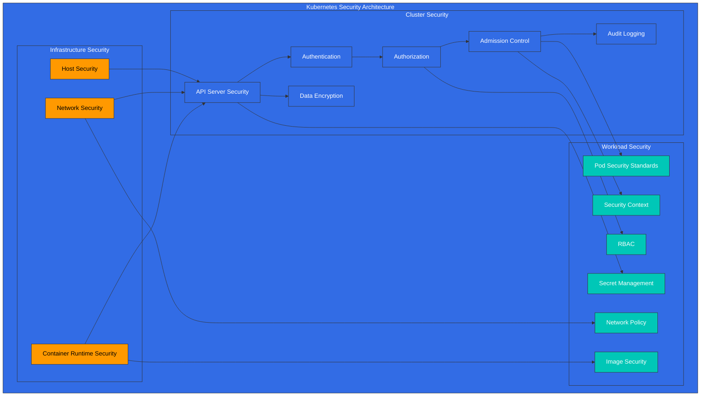
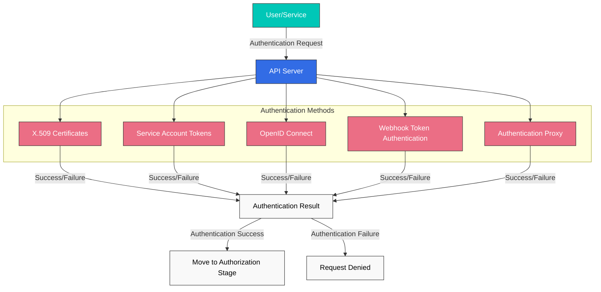
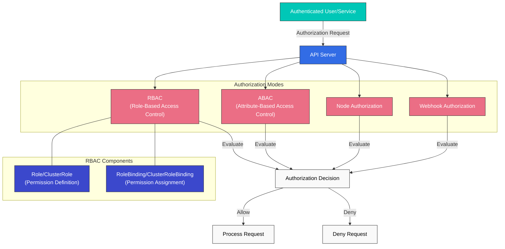
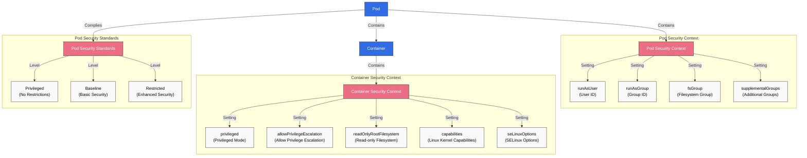
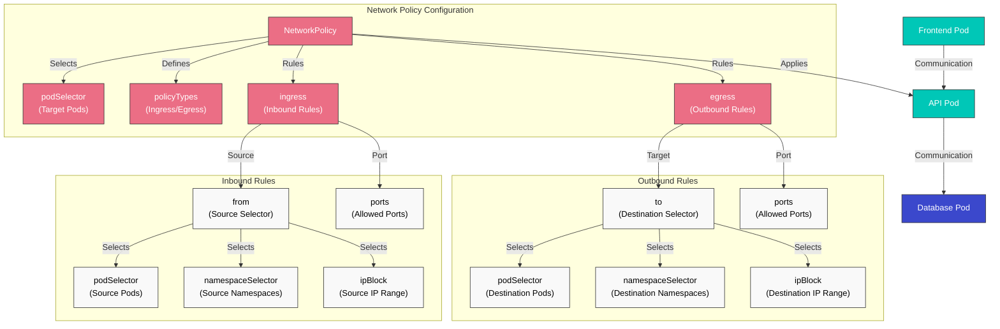
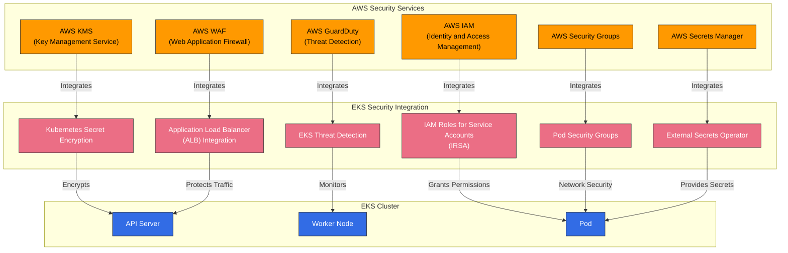

# Kubernetes Security

> **Versiones compatibles**: Kubernetes 1.32, 1.33, 1.34
> **Última actualización**: February 23, 2026

En Kubernetes, la seguridad es un elemento clave para proteger clusters (clústeres) y aplicaciones. En este capítulo, exploraremos los conceptos de seguridad de Kubernetes, los mecanismos de autenticación y autorización, las Network Policies, los Security Contexts y cómo mejorar la seguridad en Amazon EKS.

## Lab Environment Setup

Para seguir los ejemplos de este documento, necesitarás las siguientes herramientas y entorno:

### Required Tools
- kubectl v1.34 o superior
- Un cluster de Kubernetes funcional (EKS, minikube, kind, etc.)
- OpenSSL (para la creación de certificados)

### Security Example Setup

```bash
# Create namespace
kubectl create namespace security-demo

# Create service account
kubectl -n security-demo create serviceaccount demo-sa

# Create role
kubectl -n security-demo apply -f - <<EOF
apiVersion: rbac.authorization.k8s.io/v1
kind: Role
metadata:
  name: pod-reader
rules:
- apiGroups: [""]
  resources: ["pods"]
  verbs: ["get", "watch", "list"]
EOF

# Create role binding
kubectl -n security-demo apply -f - <<EOF
apiVersion: rbac.authorization.k8s.io/v1
kind: RoleBinding
metadata:
  name: read-pods
subjects:
- kind: ServiceAccount
  name: demo-sa
  namespace: security-demo
roleRef:
  kind: Role
  name: pod-reader
  apiGroup: rbac.authorization.k8s.io
EOF

# Create Pod with security context
kubectl -n security-demo apply -f - <<EOF
apiVersion: v1
kind: Pod
metadata:
  name: security-context-demo
spec:
  serviceAccountName: demo-sa
  securityContext:
    runAsUser: 1000
    runAsGroup: 3000
    fsGroup: 2000
  containers:
  - name: sec-ctx-demo
    image: busybox
    command: ["sh", "-c", "sleep 3600"]
    securityContext:
      allowPrivilegeEscalation: false
      readOnlyRootFilesystem: true
EOF
```

## Kubernetes Security Architecture



## Table of Contents
1. [Security Overview](#security-overview)
2. [Authentication](#authentication)
3. [Authorization](#authorization)
4. [Security Context](#security-context)
5. [Network Policy](#network-policy)
6. [Secret Management](#secret-management)
7. [Image Security](#image-security)
8. [Pod Security Standards](#pod-security-standards)
9. [Audit Logging](#audit-logging)
10. [EKS Security Best Practices](#eks-security-best-practices)

## Security Overview

> **Concepto clave**: La seguridad de Kubernetes sigue un enfoque de defensa en profundidad, que proporciona múltiples mecanismos de seguridad en los niveles de infraestructura, cluster y workload.

La seguridad de Kubernetes consta de las siguientes áreas principales:

### Security Area Comparison

| Security Area | Main Components | Responsible Party | Security Mechanisms |
|--------------|-----------------|-------------------|---------------------|
| **Infrastructure Security** | Host OS, Container Runtime, Network | Cluster Administrator | Firewall, OS hardening, Container runtime security |
| **Cluster Security** | API Server, etcd, kubelet | Cluster Administrator | Authentication, Authorization, Admission Control, Encryption |
| **Workload Security** | Pods, Containers, Services | Application Developer | Security Context, Network Policy, RBAC |

### Security Principles

1. **Principio de privilegio mínimo**: Concede solo los permisos mínimos necesarios
2. **Defensa en profundidad**: Defensa mediante múltiples capas de seguridad
3. **Denegación por defecto**: Deniega todo lo que no esté permitido explícitamente
4. **Endurecimiento de seguridad**: Aplica configuraciones de seguridad más estrictas que los valores predeterminados
5. **Monitoreo continuo**: Detecta y responde a eventos de seguridad

## Authentication

La autenticación es el proceso de verificar quién es un usuario o una service account. Kubernetes admite varios métodos de autenticación:

### Authentication Methods

1. **Certificados X.509**: Autenticación mediante certificados de cliente TLS
2. **Tokens de Service Account**: Autenticación de service accounts mediante tokens JWT
3. **OpenID Connect (OIDC)**: Autenticación mediante proveedores de identidad externos
4. **Webhook Token Authentication**: Autenticación mediante servicios de autenticación externos
5. **Authentication Proxy**: Autenticación mediante un proxy

### Service Account Example

```yaml
apiVersion: v1
kind: ServiceAccount
metadata:
  name: my-service-account
  namespace: default
---
apiVersion: v1
kind: Secret
metadata:
  name: my-service-account-token
  annotations:
    kubernetes.io/service-account.name: my-service-account
type: kubernetes.io/service-account-token
```

## Authentication

Para acceder al API server de Kubernetes, debes pasar por un proceso de autenticación. Kubernetes admite varios métodos de autenticación:



### X.509 Certificates

Kubernetes usa certificados TLS para autenticar clientes. Esto se usa principalmente para la comunicación interna del cluster y la autenticación de administradores.

```bash
# Example kubeconfig setup for certificate-based authentication
kubectl config set-credentials admin --client-certificate=admin.crt --client-key=admin.key
```

### Service Account Tokens

Las service accounts son cuentas usadas por procesos que se ejecutan en Pods para comunicarse con el API server. Cada service account tiene un token generado automáticamente que se monta automáticamente en los Pods.

```yaml
apiVersion: v1
kind: ServiceAccount
metadata:
  name: my-service-account
  namespace: default
```

```yaml
apiVersion: v1
kind: Pod
metadata:
  name: my-pod
spec:
  serviceAccountName: my-service-account
  containers:
  - name: my-container
    image: nginx:1.19
```

### OpenID Connect (OIDC)

Admite autenticación mediante proveedores de identidad externos (por ejemplo, AWS IAM, Google, Azure AD). Esto es útil para implementar Single Sign-On (SSO) en entornos empresariales.

```bash
# Example kubeconfig setup using OIDC
kubectl config set-credentials oidc-user \
  --auth-provider=oidc \
  --auth-provider-arg=idp-issuer-url=https://accounts.google.com \
  --auth-provider-arg=client-id=<CLIENT_ID> \
  --auth-provider-arg=client-secret=<CLIENT_SECRET>
```

### Webhook Token Authentication

Un método que valida tokens mediante un servicio de autenticación externo. El API server reenvía los tokens a un servicio externo, que valida el token y devuelve información del usuario.

### Authentication Proxy

Un método en el que se coloca un proxy de autenticación delante del API server para gestionar la autenticación de usuarios. El proxy incluye la información del usuario autenticado en headers HTTP y la reenvía al API server.

## Authorization

Si la autenticación es el proceso de verificar "quién eres", la autorización es el proceso de determinar "qué puedes hacer". Kubernetes admite varios modos de autorización:



### RBAC (Role-Based Access Control)

RBAC es el mecanismo de autorización más usado en Kubernetes. Mediante Roles y RoleBindings, concedes permisos específicos a usuarios o service accounts para determinados recursos.

#### Role and ClusterRole

Los Roles definen permisos dentro de un namespace, y los ClusterRoles definen permisos que se aplican a todo el cluster.

```yaml
# Namespace Role example
apiVersion: rbac.authorization.k8s.io/v1
kind: Role
metadata:
  namespace: default
  name: pod-reader
rules:
- apiGroups: [""]
  resources: ["pods"]
  verbs: ["get", "watch", "list"]
```

```yaml
# Cluster-wide ClusterRole example
apiVersion: rbac.authorization.k8s.io/v1
kind: ClusterRole
metadata:
  name: secret-reader
rules:
- apiGroups: [""]
  resources: ["secrets"]
  verbs: ["get", "watch", "list"]
```

#### RoleBinding and ClusterRoleBinding

RoleBinding vincula un Role o ClusterRole a usuarios, grupos o service accounts en un namespace específico. ClusterRoleBinding vincula un ClusterRole a usuarios, grupos o service accounts en todo el cluster.

```yaml
# RoleBinding example
apiVersion: rbac.authorization.k8s.io/v1
kind: RoleBinding
metadata:
  name: read-pods
  namespace: default
subjects:
- kind: User
  name: jane
  apiGroup: rbac.authorization.k8s.io
roleRef:
  kind: Role
  name: pod-reader
  apiGroup: rbac.authorization.k8s.io
```

```yaml
# ClusterRoleBinding example
apiVersion: rbac.authorization.k8s.io/v1
kind: ClusterRoleBinding
metadata:
  name: read-secrets-global
subjects:
- kind: Group
  name: manager
  apiGroup: rbac.authorization.k8s.io
roleRef:
  kind: ClusterRole
  name: secret-reader
  apiGroup: rbac.authorization.k8s.io
```

### ABAC (Attribute-Based Access Control)

ABAC es un método para conceder permisos basado en atributos del usuario, atributos del recurso, atributos del entorno, etc. En Kubernetes, las políticas se definen mediante archivos JSON. Se usa con menos frecuencia que RBAC debido a su complejidad de gestión, aunque es más flexible.

### Node Authorization

La autorización de Node es un modo de autorización especial que se usa cuando los kubelets acceden al API server. Los kubelets solo pueden acceder a recursos relacionados con los nodes en los que se ejecutan (Pods, estado del node, etc.).

### Webhook Authorization

Un método en el que las decisiones de autorización se toman mediante un servicio externo. El API server reenvía las solicitudes de autorización a un servicio externo, que decide si permite o deniega la solicitud.

## Security Context

Security context define configuraciones de seguridad a nivel de Pod o container. Esto permite un control detallado sobre privilegios, control de acceso, capabilities y más.



### Pod Security Context

```yaml
apiVersion: v1
kind: Pod
metadata:
  name: security-context-pod
spec:
  securityContext:
    runAsUser: 1000
    runAsGroup: 3000
    fsGroup: 2000
  containers:
  - name: security-context-container
    image: nginx:1.19
    securityContext:
      allowPrivilegeEscalation: false
      capabilities:
        drop:
        - ALL
      readOnlyRootFilesystem: true
```

En el ejemplo anterior:
- `runAsUser`: ID de usuario bajo el cual se ejecuta el proceso del container
- `runAsGroup`: ID de grupo bajo el cual se ejecuta el proceso del container
- `fsGroup`: ID de grupo usado al acceder a volúmenes
- `allowPrivilegeEscalation`: Si un proceso puede obtener más privilegios que su proceso padre
- `capabilities`: Agrega o elimina capabilities del kernel de Linux
- `readOnlyRootFilesystem`: Monta el filesystem raíz como de solo lectura

### Pod Security Standards

A partir de Kubernetes 1.25, Pod Security Policy fue reemplazado por Pod Security Standards. Pod Security Standards define tres niveles de política:

1. **Privileged**: Sin restricciones, todos los privilegios permitidos
2. **Baseline**: Bloquea rutas conocidas de escalamiento de privilegios
3. **Restricted**: Política de seguridad fuertemente endurecida

```yaml
# Example applying Pod Security Standards to namespace
apiVersion: v1
kind: Namespace
metadata:
  name: my-namespace
  labels:
    pod-security.kubernetes.io/enforce: restricted
    pod-security.kubernetes.io/audit: restricted
    pod-security.kubernetes.io/warn: restricted
```

## Network Policy

Las Network Policies proporcionan una forma de controlar la comunicación entre Pods. De forma predeterminada, todos los Pods de un cluster de Kubernetes pueden comunicarse entre sí, pero esto puede restringirse usando Network Policies.



```yaml
apiVersion: networking.k8s.io/v1
kind: NetworkPolicy
metadata:
  name: api-allow
  namespace: default
spec:
  podSelector:
    matchLabels:
      app: api
  policyTypes:
  - Ingress
  - Egress
  ingress:
  - from:
    - podSelector:
        matchLabels:
          app: frontend
    ports:
    - protocol: TCP
      port: 8080
  egress:
  - to:
    - podSelector:
        matchLabels:
          app: database
    ports:
    - protocol: TCP
      port: 5432
```

En el ejemplo anterior:
- Define una Network Policy para Pods con la etiqueta `api`
- Permite solo tráfico entrante en el puerto 8080 desde Pods con la etiqueta `frontend`
- Permite solo tráfico saliente al puerto 5432 hacia Pods con la etiqueta `database`

Para usar Network Policies, el plugin de red del cluster debe admitir Network Policies. Plugins CNI como Calico, Cilium y Antrea admiten Network Policies.

## Secret Management

Los Kubernetes Secrets se usan para almacenar y gestionar información sensible, como contraseñas, API keys y certificados. Sin embargo, de forma predeterminada, los secrets solo están codificados en base64, no cifrados. Por lo tanto, se necesitan medidas de seguridad adicionales.

### Secret Encryption

Para cifrar secrets almacenados en etcd, debes configurar la configuración de cifrado del API server:

```yaml
apiVersion: apiserver.config.k8s.io/v1
kind: EncryptionConfiguration
resources:
  - resources:
      - secrets
    providers:
      - aescbc:
          keys:
            - name: key1
              secret: <base64-encoded-key>
      - identity: {}
```

### External Secret Management

Para una gestión de secrets más segura, puedes usar sistemas externos de gestión de secrets:

- HashiCorp Vault
- AWS Secrets Manager
- Azure Key Vault
- Google Secret Manager
- External Secrets Operator

## Image Security

La seguridad de imágenes de container es una parte importante de la seguridad de Kubernetes.

### Image Vulnerability Scanning

Escanea imágenes de container en busca de vulnerabilidades para identificar y resolver problemas de seguridad conocidos:

- Trivy
- Clair
- Anchore
- AWS ECR Scan
- Docker Hub Scan

### Image Signing and Verification

Verifica el origen y la integridad de las imágenes mediante firma de imágenes:

- Notary
- Cosign
- Portieris
- AWS Signer
- Connaisseur

### Image Policies

Restringe la descarga de imágenes solo desde registries de confianza mediante políticas de imágenes:

```yaml
apiVersion: admission.k8s.io/v1
kind: AdmissionConfiguration
plugins:
- name: ImagePolicyWebhook
  configuration:
    imagePolicy:
      kubeConfigFile: /path/to/kubeconfig
      allowTTL: 50
      denyTTL: 50
      retryBackoff: 500
      defaultAllow: false
```

## Audit

La auditoría de Kubernetes proporciona un mecanismo para registrar y analizar eventos que ocurren en el cluster.

### Audit Policy

Las políticas de auditoría definen qué eventos registrar:

```yaml
apiVersion: audit.k8s.io/v1
kind: Policy
rules:
- level: Metadata
  resources:
  - group: ""
    resources: ["pods"]
- level: Request
  resources:
  - group: ""
    resources: ["secrets"]
- level: None
  users: ["system:kube-proxy"]
  resources:
  - group: ""
    resources: ["endpoints", "services"]
```

Niveles de auditoría:
- `None`: No registrar eventos
- `Metadata`: Registrar solo metadatos de la solicitud (usuario, hora, recurso, etc.)
- `Request`: Registrar metadatos de la solicitud y cuerpo de la solicitud
- `RequestResponse`: Registrar metadatos de la solicitud, cuerpo de la solicitud y cuerpo de la respuesta

### Audit Log Backends

Los audit logs pueden almacenarse en varios backends:
- File
- Webhook
- Backends dinámicos (por ejemplo, Elasticsearch, Loki)

## Amazon EKS Security Enhancement

Amazon EKS puede mejorar la seguridad integrándose con servicios de seguridad de AWS además de las características básicas de seguridad de Kubernetes.



### IAM Roles and Service Accounts (IRSA)

Usando IRSA (IAM Roles for Service Accounts), puedes asociar roles de IAM con service accounts de Kubernetes para acceder de forma segura a servicios de AWS.

```bash
# Create OIDC provider
eksctl utils associate-iam-oidc-provider --cluster my-cluster --approve

# Create IAM role and associate with service account
eksctl create iamserviceaccount \
  --name my-service-account \
  --namespace default \
  --cluster my-cluster \
  --attach-policy-arn arn:aws:iam::aws:policy/AmazonS3ReadOnlyAccess \
  --approve
```

### Secret Encryption with AWS KMS

Puedes usar AWS KMS para cifrar secrets de Kubernetes en tu cluster de EKS.

```bash
# Create KMS key
aws kms create-key --description "EKS Secret Encryption Key"

# Specify KMS key when creating EKS cluster
eksctl create cluster --name my-cluster --encryption-provider-key-arn arn:aws:kms:region:account-id:key/key-id
```

### AWS Security Groups

Aplica AWS Security Groups a los nodes y Pods del cluster de EKS para controlar el tráfico de red.

```bash
# Create security group
aws ec2 create-security-group --group-name eks-cluster-sg --description "EKS Cluster Security Group"

# Add inbound rule
aws ec2 authorize-security-group-ingress \
  --group-id sg-12345 \
  --protocol tcp \
  --port 443 \
  --cidr 10.0.0.0/16
```

### AWS WAF

Coloca AWS WAF (Web Application Firewall) delante de los clusters de EKS para proteger aplicaciones web.

```bash
# Create WAF Web ACL
aws wafv2 create-web-acl \
  --name eks-web-acl \
  --scope REGIONAL \
  --default-action Allow={} \
  --visibility-config SampledRequestsEnabled=true,CloudWatchMetricsEnabled=true,MetricName=eks-web-acl
```

### AWS GuardDuty

Usa AWS GuardDuty para detectar y responder a amenazas de seguridad en clusters de EKS.

```bash
# Enable GuardDuty
aws guardduty create-detector --enable

# Enable EKS protection
aws guardduty update-detector \
  --detector-id 12abc34d567e8fa901bc2d34e56789f0 \
  --features '[{"Name": "EKS_RUNTIME_MONITORING", "Status": "ENABLED"}]'
```

## Security Best Practices

Estas son mejores prácticas para mejorar la seguridad de clusters y workloads de Kubernetes.

### Cluster Security

1. **Mantener versiones actualizadas**: Mantén Kubernetes y todos los componentes actualizados para corregir vulnerabilidades conocidas.
2. **Restringir el acceso al API Server**: Restringe el acceso al API server y permite acceso público solo cuando sea necesario.
3. **Cifrado de etcd**: Cifra los datos almacenados en etcd para proteger información sensible.
4. **Habilitar Audit Logging**: Habilita audit logging para monitorear y analizar la actividad del cluster.
5. **Implementar Network Policies**: Implementa Network Policies para restringir la comunicación de Pod a Pod.

### Workload Security

1. **Principio de privilegio mínimo**: Concede solo los permisos mínimos necesarios a Pods y containers.
2. **Usuario no root**: Ejecuta containers como usuarios no root.
3. **Filesystem de solo lectura**: Monta los filesystems raíz de los containers como de solo lectura cuando sea posible.
4. **Límites de recursos**: Establece límites de recursos de CPU y memoria para evitar ataques DoS.
5. **Configurar Security Context**: Configura correctamente los Security Contexts de Pod y container.

### Image Security

1. **Imágenes base mínimas**: Usa imágenes base con paquetes mínimos.
2. **Escaneo de vulnerabilidades de imágenes**: Escanea regularmente las imágenes de container en busca de vulnerabilidades.
3. **Firma y verificación de imágenes**: Verifica el origen y la integridad de las imágenes mediante firma de imágenes.
4. **Registries de confianza**: Descarga imágenes solo desde registries de confianza.
5. **Usar imágenes recientes**: Actualiza regularmente las imágenes para corregir vulnerabilidades conocidas.

### Secret Management

1. **Gestión externa de secrets**: Usa sistemas externos de gestión de secrets para gestionar secrets de forma segura.
2. **Cifrado de secrets**: Cifra los secrets almacenados en etcd.
3. **Rotación de secrets**: Rota los secrets regularmente para mejorar la seguridad.
4. **Acceso con privilegios mínimos**: Restringe el acceso a secrets solo a los Pods necesarios.
5. **Usar volúmenes en lugar de variables de entorno**: Monta secrets mediante volúmenes en lugar de variables de entorno.

## Conclusion

La seguridad de Kubernetes debe implementarse en múltiples capas, considerando la seguridad en todas las áreas, incluidas la infraestructura del cluster, los componentes de Kubernetes y los workloads de aplicación. Junto con las características básicas de seguridad de Kubernetes, como autenticación, autorización, Network Policies y Security Contexts, puedes mejorar la seguridad del cluster y de los workloads mediante medidas de seguridad adicionales como seguridad de imágenes, gestión de secrets y audit logging.

Al usar Amazon EKS, puedes mejorar aún más la seguridad integrándote con diversos servicios de seguridad de AWS. Servicios como IAM Roles and Service Accounts (IRSA), cifrado de secrets con AWS KMS, AWS Security Groups, AWS WAF y AWS GuardDuty pueden usarse para mejorar la seguridad del cluster de EKS.

La seguridad es un proceso continuo, por lo que es importante mantener la postura de seguridad de clusters y workloads mediante evaluaciones y actualizaciones de seguridad regulares.

## Quiz

Para comprobar lo que aprendiste en este capítulo, intenta resolver el [cuestionario de seguridad](../quizzes/core/06-security-quiz.md).

## References

- [Documentación oficial de Kubernetes - Seguridad](https://kubernetes.io/docs/concepts/security/)
- [Documentación oficial de Kubernetes - Autenticación](https://kubernetes.io/docs/reference/access-authn-authz/authentication/)
- [Documentación oficial de Kubernetes - Autorización](https://kubernetes.io/docs/reference/access-authn-authz/authorization/)
- [Documentación oficial de Kubernetes - RBAC](https://kubernetes.io/docs/reference/access-authn-authz/rbac/)
- [Documentación oficial de Kubernetes - Network Policies](https://kubernetes.io/docs/concepts/services-networking/network-policies/)
- [Documentación oficial de Kubernetes - Security Context](https://kubernetes.io/docs/tasks/configure-pod-container/security-context/)
- [Documentación oficial de Kubernetes - Pod Security Standards](https://kubernetes.io/docs/concepts/security/pod-security-standards/)
- [Documentación oficial de Kubernetes - Secrets](https://kubernetes.io/docs/concepts/configuration/secret/)
- [Documentación oficial de Kubernetes - Audit](https://kubernetes.io/docs/tasks/debug-application-cluster/audit/)
- [Documentación oficial de Amazon EKS - Seguridad](https://docs.aws.amazon.com/eks/latest/userguide/security.html)
- [Documentación oficial de Amazon EKS - IAM Roles for Service Accounts](https://docs.aws.amazon.com/eks/latest/userguide/iam-roles-for-service-accounts.html)
- [Documentación oficial de Amazon EKS - Cifrado de Secrets](https://docs.aws.amazon.com/eks/latest/userguide/enable-kms.html)
- [Blog de seguridad de AWS - Mejores prácticas de seguridad de EKS](https://aws.amazon.com/blogs/containers/amazon-eks-security-best-practices/)
