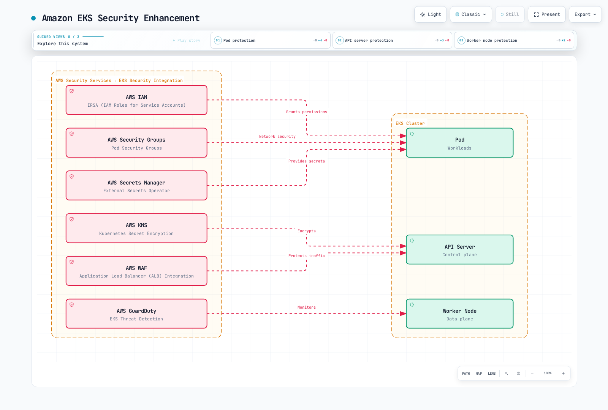

# Seguridad de Kubernetes

> **Versiones compatibles**: Kubernetes 1.32, 1.33, 1.34
> **Última actualización**: February 23, 2026

En Kubernetes, la seguridad es un elemento clave para proteger los clústeres y las aplicaciones. En este capítulo, exploraremos conceptos de seguridad de Kubernetes, mecanismos de autenticación y autorización, políticas de red, contextos de seguridad y cómo mejorar la seguridad en Amazon EKS.

## Configuración del entorno de laboratorio

Para seguir los ejemplos de este documento, necesitarás las siguientes herramientas y el siguiente entorno:

### Herramientas necesarias
- kubectl v1.34 o superior
- Un clúster de Kubernetes funcional (EKS, minikube, kind, etc.)
- OpenSSL (para crear certificados)

### Configuración del ejemplo de seguridad

```bash
# Create namespace
kubectl create namespace security-demo

# Create service account
kubectl -n security-demo create serviceaccount demo-sa

# Create role
kubectl -n security-demo apply -f - <<EOF
apiVersion: rbac.authorization.k8s.io/v1
kind: Role
metadata:
  name: pod-reader
rules:
- apiGroups: [""]
  resources: ["pods"]
  verbs: ["get", "watch", "list"]
EOF

# Create role binding
kubectl -n security-demo apply -f - <<EOF
apiVersion: rbac.authorization.k8s.io/v1
kind: RoleBinding
metadata:
  name: read-pods
subjects:
- kind: ServiceAccount
  name: demo-sa
  namespace: security-demo
roleRef:
  kind: Role
  name: pod-reader
  apiGroup: rbac.authorization.k8s.io
EOF

# Create Pod with security context
kubectl -n security-demo apply -f - <<EOF
apiVersion: v1
kind: Pod
metadata:
  name: security-context-demo
spec:
  serviceAccountName: demo-sa
  securityContext:
    runAsUser: 1000
    runAsGroup: 3000
    fsGroup: 2000
  containers:
  - name: sec-ctx-demo
    image: busybox
    command: ["sh", "-c", "sleep 3600"]
    securityContext:
      allowPrivilegeEscalation: false
      readOnlyRootFilesystem: true
EOF
```

## Arquitectura de seguridad de Kubernetes


[🔍 Ver diagrama interactivo](https://www.atomai.click/kubernetes-docs/archmaps/en-core-06-security-0.html)

## Tabla de contenido
1. [Descripción general de seguridad](#security-overview)
2. [Autenticación](#authentication)
3. [Autorización](#authorization)
4. [Contexto de seguridad](#security-context)
5. [Política de red](#network-policy)
6. [Gestión de secretos](#secret-management)
7. [Seguridad de imágenes](#image-security)
8. [Pod Security Standards](#pod-security-standards)
9. [Registro de auditoría](#audit-logging)
10. [Prácticas recomendadas de seguridad de EKS](#eks-security-best-practices)

## Descripción general de seguridad

> **Concepto clave**: La seguridad de Kubernetes sigue un enfoque de Defense in Depth (defensa en profundidad), que proporciona múltiples mecanismos de seguridad en los niveles de infraestructura, clúster y carga de trabajo.

La seguridad de Kubernetes consta de las siguientes áreas principales:

### Comparación de áreas de seguridad

| Área de seguridad | Componentes principales | Parte responsable | Mecanismos de seguridad |
|--------------|-----------------|-------------------|---------------------|
| **Seguridad de infraestructura** | Host OS, Container Runtime, red | Administrador del clúster | Firewall, endurecimiento del OS, seguridad del runtime de contenedores |
| **Seguridad del clúster** | Servidor API, etcd, kubelet | Administrador del clúster | Autenticación, autorización, control de admisión, cifrado |
| **Seguridad de cargas de trabajo** | Pods, Containers, Services | Desarrollador de aplicaciones | Contexto de seguridad, política de red, RBAC |

### Principios de seguridad

1. **Principio de mínimo privilegio**: Conceder únicamente los permisos mínimos necesarios
2. **Defensa en profundidad**: Defensa mediante múltiples capas de seguridad
3. **Denegar de forma predeterminada**: Denegar todo lo que no esté permitido explícitamente
4. **Endurecimiento de seguridad**: Aplicar configuraciones de seguridad más estrictas que las predeterminadas
5. **Monitorización continua**: Detectar y responder a eventos de seguridad

## Autenticación

La autenticación es el proceso de verificar quién es un usuario o una cuenta de servicio. Kubernetes admite varios métodos de autenticación:

### Métodos de autenticación

1. **Certificados X.509**: Autenticación mediante certificados de cliente TLS
2. **Tokens de Service Account**: Autenticación de cuentas de servicio mediante tokens JWT
3. **OpenID Connect (OIDC)**: Autenticación a través de proveedores de identidad externos
4. **Autenticación de tokens mediante Webhook**: Autenticación a través de servicios de autenticación externos
5. **Proxy de autenticación**: Autenticación a través de un proxy

### Ejemplo de Service Account

```yaml
apiVersion: v1
kind: ServiceAccount
metadata:
  name: my-service-account
  namespace: default
---
apiVersion: v1
kind: Secret
metadata:
  name: my-service-account-token
  annotations:
    kubernetes.io/service-account.name: my-service-account
type: kubernetes.io/service-account-token
```

## Autenticación

Para acceder al servidor API de Kubernetes, debes pasar por un proceso de autenticación. Kubernetes admite varios métodos de autenticación:


[🔍 Ver diagrama interactivo](https://www.atomai.click/kubernetes-docs/archmaps/en-core-06-security-1.html)

### Certificados X.509

Kubernetes utiliza certificados TLS para autenticar clientes. Esto se usa principalmente para la comunicación interna del clúster y la autenticación de administradores.

```bash
# Example kubeconfig setup for certificate-based authentication
kubectl config set-credentials admin --client-certificate=admin.crt --client-key=admin.key
```

### Tokens de Service Account

Las cuentas de servicio son cuentas utilizadas por procesos que se ejecutan en Pods para comunicarse con el servidor API. Cada cuenta de servicio tiene un token generado automáticamente que se monta automáticamente en los Pods.

```yaml
apiVersion: v1
kind: ServiceAccount
metadata:
  name: my-service-account
  namespace: default
```

```yaml
apiVersion: v1
kind: Pod
metadata:
  name: my-pod
spec:
  serviceAccountName: my-service-account
  containers:
  - name: my-container
    image: nginx:1.19
```

### OpenID Connect (OIDC)

Admite autenticación a través de proveedores de identidad externos (por ejemplo, AWS IAM, Google, Azure AD). Esto es útil para implementar Single Sign-On (SSO) en entornos empresariales.

```bash
# Example kubeconfig setup using OIDC
kubectl config set-credentials oidc-user \
  --auth-provider=oidc \
  --auth-provider-arg=idp-issuer-url=https://accounts.google.com \
  --auth-provider-arg=client-id=<CLIENT_ID> \
  --auth-provider-arg=client-secret=<CLIENT_SECRET>
```

### Autenticación de tokens mediante Webhook

Un método que valida tokens a través de un servicio de autenticación externo. El servidor API reenvía tokens a un servicio externo, que valida el token y devuelve información del usuario.

### Proxy de autenticación

Un método en el que se coloca un proxy de autenticación delante del servidor API para gestionar la autenticación de usuarios. El proxy incluye información del usuario autenticado en encabezados HTTP y la reenvía al servidor API.

## Autorización

Si la autenticación es el proceso de verificar «quién eres», la autorización es el proceso de determinar «qué puedes hacer». Kubernetes admite varios modos de autorización:


[🔍 Ver diagrama interactivo](https://www.atomai.click/kubernetes-docs/archmaps/en-core-06-security-2.html)

### RBAC (Role-Based Access Control)

RBAC es el mecanismo de autorización más utilizado en Kubernetes. Mediante Roles y RoleBindings, se conceden permisos específicos a usuarios o cuentas de servicio para determinados recursos.

#### Role y ClusterRole

Los Roles definen permisos dentro de un namespace, y los ClusterRoles definen permisos que se aplican a todo el clúster.

```yaml
# Namespace Role example
apiVersion: rbac.authorization.k8s.io/v1
kind: Role
metadata:
  namespace: default
  name: pod-reader
rules:
- apiGroups: [""]
  resources: ["pods"]
  verbs: ["get", "watch", "list"]
```

```yaml
# Cluster-wide ClusterRole example
apiVersion: rbac.authorization.k8s.io/v1
kind: ClusterRole
metadata:
  name: secret-reader
rules:
- apiGroups: [""]
  resources: ["secrets"]
  verbs: ["get", "watch", "list"]
```

#### RoleBinding y ClusterRoleBinding

RoleBinding vincula un Role o ClusterRole a usuarios, grupos o cuentas de servicio en un namespace específico. ClusterRoleBinding vincula un ClusterRole a usuarios, grupos o cuentas de servicio en todo el clúster.

```yaml
# RoleBinding example
apiVersion: rbac.authorization.k8s.io/v1
kind: RoleBinding
metadata:
  name: read-pods
  namespace: default
subjects:
- kind: User
  name: jane
  apiGroup: rbac.authorization.k8s.io
roleRef:
  kind: Role
  name: pod-reader
  apiGroup: rbac.authorization.k8s.io
```

```yaml
# ClusterRoleBinding example
apiVersion: rbac.authorization.k8s.io/v1
kind: ClusterRoleBinding
metadata:
  name: read-secrets-global
subjects:
- kind: Group
  name: manager
  apiGroup: rbac.authorization.k8s.io
roleRef:
  kind: ClusterRole
  name: secret-reader
  apiGroup: rbac.authorization.k8s.io
```

### ABAC (Attribute-Based Access Control)

ABAC es un método para conceder permisos basándose en atributos de usuario, atributos de recursos, atributos del entorno, etc. En Kubernetes, las políticas se definen mediante archivos JSON. Se utiliza con menos frecuencia que RBAC debido a su complejidad de gestión, a pesar de ser más flexible.

### Autorización de Node

La autorización de Node es un modo de autorización especial utilizado cuando los kubelets acceden al servidor API. Los kubelets solo pueden acceder a recursos relacionados con los nodos en los que se ejecutan (Pods, estado del nodo, etc.).

### Autorización mediante Webhook

Un método en el que las decisiones de autorización se toman a través de un servicio externo. El servidor API reenvía solicitudes de autorización a un servicio externo, que decide si permite o deniega la solicitud.

## Contexto de seguridad

El contexto de seguridad define configuraciones de seguridad en el nivel de Pod o contenedor. Esto permite un control detallado de privilegios, control de acceso, capacidades y más.


[🔍 Ver diagrama interactivo](https://www.atomai.click/kubernetes-docs/archmaps/en-core-06-security-3.html)

### Contexto de seguridad de Pod

```yaml
apiVersion: v1
kind: Pod
metadata:
  name: security-context-pod
spec:
  securityContext:
    runAsUser: 1000
    runAsGroup: 3000
    fsGroup: 2000
  containers:
  - name: security-context-container
    image: nginx:1.19
    securityContext:
      allowPrivilegeEscalation: false
      capabilities:
        drop:
        - ALL
      readOnlyRootFilesystem: true
```

En el ejemplo anterior:
- `runAsUser`: ID de usuario con el que se ejecuta el proceso del contenedor
- `runAsGroup`: ID de grupo con el que se ejecuta el proceso del contenedor
- `fsGroup`: ID de grupo utilizado al acceder a volúmenes
- `allowPrivilegeEscalation`: Indica si un proceso puede obtener más privilegios que su proceso padre
- `capabilities`: Añade o elimina capacidades del kernel de Linux
- `readOnlyRootFilesystem`: Monta el sistema de archivos raíz como de solo lectura

### Pod Security Standards

A partir de Kubernetes 1.25, Pod Security Policy fue reemplazada por Pod Security Standards. Pod Security Standards definen tres niveles de política:

1. **Privileged**: Sin restricciones, se permiten todos los privilegios
2. **Baseline**: Bloquea rutas conocidas de escalamiento de privilegios
3. **Restricted**: Política de seguridad fuertemente endurecida

```yaml
# Example applying Pod Security Standards to namespace
apiVersion: v1
kind: Namespace
metadata:
  name: my-namespace
  labels:
    pod-security.kubernetes.io/enforce: restricted
    pod-security.kubernetes.io/audit: restricted
    pod-security.kubernetes.io/warn: restricted
```

## Política de red

Las políticas de red proporcionan una forma de controlar la comunicación entre Pods. De forma predeterminada, todos los Pods de un clúster de Kubernetes pueden comunicarse entre sí, pero esto puede restringirse mediante políticas de red.


[🔍 Ver diagrama interactivo](https://www.atomai.click/kubernetes-docs/archmaps/en-core-06-security-4.html)

```yaml
apiVersion: networking.k8s.io/v1
kind: NetworkPolicy
metadata:
  name: api-allow
  namespace: default
spec:
  podSelector:
    matchLabels:
      app: api
  policyTypes:
  - Ingress
  - Egress
  ingress:
  - from:
    - podSelector:
        matchLabels:
          app: frontend
    ports:
    - protocol: TCP
      port: 8080
  egress:
  - to:
    - podSelector:
        matchLabels:
          app: database
    ports:
    - protocol: TCP
      port: 5432
```

En el ejemplo anterior:
- Define una política de red para Pods con la etiqueta `api`
- Permite únicamente tráfico entrante en el puerto 8080 desde Pods con la etiqueta `frontend`
- Permite únicamente tráfico saliente hacia el puerto 5432 en Pods con la etiqueta `database`

Para utilizar políticas de red, el complemento de red del clúster debe admitirlas. Los complementos CNI como Calico, Cilium y Antrea admiten políticas de red.

## Gestión de secretos

Los Secrets de Kubernetes se utilizan para almacenar y gestionar información confidencial, como contraseñas, claves de API y certificados. Sin embargo, de forma predeterminada, los secretos solo están codificados en base64, no cifrados. Por lo tanto, se necesitan medidas de seguridad adicionales.

### Cifrado de Secrets

Para cifrar secretos almacenados en etcd, debes configurar la configuración de cifrado del servidor API:

```yaml
apiVersion: apiserver.config.k8s.io/v1
kind: EncryptionConfiguration
resources:
  - resources:
      - secrets
    providers:
      - aescbc:
          keys:
            - name: key1
              secret: <base64-encoded-key>
      - identity: {}
```

### Gestión externa de secretos

Para una gestión de secretos más segura, puedes utilizar sistemas externos de gestión de secretos:

- HashiCorp Vault
- AWS Secrets Manager
- Azure Key Vault
- Google Secret Manager
- External Secrets Operator

## Seguridad de imágenes

La seguridad de las imágenes de contenedor es una parte importante de la seguridad de Kubernetes.

### Escaneo de vulnerabilidades de imágenes

Escanea las imágenes de contenedor en busca de vulnerabilidades para identificar y resolver problemas de seguridad conocidos:

- Trivy
- Clair
- Anchore
- AWS ECR Scan
- Docker Hub Scan

### Firma y verificación de imágenes

Verifica el origen y la integridad de las imágenes mediante la firma de imágenes:

- Notary
- Cosign
- Portieris
- AWS Signer
- Connaisseur

### Políticas de imágenes

Restringe la obtención de imágenes únicamente desde registros de confianza mediante políticas de imágenes:

```yaml
apiVersion: admission.k8s.io/v1
kind: AdmissionConfiguration
plugins:
- name: ImagePolicyWebhook
  configuration:
    imagePolicy:
      kubeConfigFile: /path/to/kubeconfig
      allowTTL: 50
      denyTTL: 50
      retryBackoff: 500
      defaultAllow: false
```

## Auditoría

La auditoría de Kubernetes proporciona un mecanismo para registrar y analizar los eventos que ocurren en el clúster.

### Política de auditoría

Las políticas de auditoría definen qué eventos registrar:

```yaml
apiVersion: audit.k8s.io/v1
kind: Policy
rules:
- level: Metadata
  resources:
  - group: ""
    resources: ["pods"]
- level: Request
  resources:
  - group: ""
    resources: ["secrets"]
- level: None
  users: ["system:kube-proxy"]
  resources:
  - group: ""
    resources: ["endpoints", "services"]
```

Niveles de auditoría:
- `None`: No registrar eventos
- `Metadata`: Registrar únicamente metadatos de la solicitud (usuario, hora, recurso, etc.)
- `Request`: Registrar metadatos de la solicitud y el cuerpo de la solicitud
- `RequestResponse`: Registrar metadatos de la solicitud, cuerpo de la solicitud y cuerpo de la respuesta

### Backends de registros de auditoría

Los registros de auditoría pueden almacenarse en varios backends:
- Archivo
- Webhook
- Backends dinámicos (por ejemplo, Elasticsearch, Loki)

## Mejora de la seguridad de Amazon EKS

Amazon EKS puede mejorar la seguridad integrándose con los servicios de seguridad de AWS, además de las características básicas de seguridad de Kubernetes.



[🔍 Ver diagrama interactivo](https://www.atomai.click/kubernetes-docs/archmaps/en-core-06-security-5.html)

### IAM Roles and Service Accounts (IRSA)

Con IRSA (IAM Roles for Service Accounts), puedes asociar roles de IAM con cuentas de servicio de Kubernetes para acceder de forma segura a los servicios de AWS.

```bash
# Create OIDC provider
eksctl utils associate-iam-oidc-provider --cluster my-cluster --approve

# Create IAM role and associate with service account
eksctl create iamserviceaccount \
  --name my-service-account \
  --namespace default \
  --cluster my-cluster \
  --attach-policy-arn arn:aws:iam::aws:policy/AmazonS3ReadOnlyAccess \
  --approve
```

### Cifrado de secretos con AWS KMS

Puedes utilizar AWS KMS para cifrar secretos de Kubernetes en tu clúster de EKS.

```bash
# Create KMS key
aws kms create-key --description "EKS Secret Encryption Key"

# Specify KMS key when creating EKS cluster
eksctl create cluster --name my-cluster --encryption-provider-key-arn arn:aws:kms:region:account-id:key/key-id
```

### AWS Security Groups

Aplica AWS security groups a los nodos y Pods del clúster de EKS para controlar el tráfico de red.

```bash
# Create security group
aws ec2 create-security-group --group-name eks-cluster-sg --description "EKS Cluster Security Group"

# Add inbound rule
aws ec2 authorize-security-group-ingress \
  --group-id sg-12345 \
  --protocol tcp \
  --port 443 \
  --cidr 10.0.0.0/16
```

### AWS WAF

Coloca AWS WAF (Web Application Firewall) delante de los clústeres de EKS para proteger las aplicaciones web.

```bash
# Create WAF Web ACL
aws wafv2 create-web-acl \
  --name eks-web-acl \
  --scope REGIONAL \
  --default-action Allow={} \
  --visibility-config SampledRequestsEnabled=true,CloudWatchMetricsEnabled=true,MetricName=eks-web-acl
```

### AWS GuardDuty

Utiliza AWS GuardDuty para detectar y responder a amenazas de seguridad en los clústeres de EKS.

```bash
# Enable GuardDuty
aws guardduty create-detector --enable

# Enable EKS protection
aws guardduty update-detector \
  --detector-id 12abc34d567e8fa901bc2d34e56789f0 \
  --features '[{"Name": "EKS_RUNTIME_MONITORING", "Status": "ENABLED"}]'
```

## Prácticas recomendadas de seguridad

Estas son prácticas recomendadas para mejorar la seguridad de los clústeres y las cargas de trabajo de Kubernetes.

### Seguridad del clúster

1. **Mantener las versiones actualizadas**: Mantén Kubernetes y todos los componentes actualizados para corregir vulnerabilidades conocidas.
2. **Restringir el acceso al servidor API**: Restringe el acceso al servidor API y permite el acceso público solo cuando sea necesario.
3. **Cifrado de etcd**: Cifra los datos almacenados en etcd para proteger la información confidencial.
4. **Habilitar el registro de auditoría**: Habilita el registro de auditoría para monitorizar y analizar la actividad del clúster.
5. **Implementar políticas de red**: Implementa políticas de red para restringir la comunicación de Pod a Pod.

### Seguridad de cargas de trabajo

1. **Principio de mínimo privilegio**: Concede únicamente los permisos mínimos necesarios a Pods y contenedores.
2. **Usuario no root**: Ejecuta los contenedores como usuarios no root.
3. **Sistema de archivos de solo lectura**: Monta los sistemas de archivos raíz de los contenedores como de solo lectura cuando sea posible.
4. **Límites de recursos**: Establece límites de recursos de CPU y memoria para prevenir ataques DoS.
5. **Configurar el contexto de seguridad**: Configura correctamente los contextos de seguridad de Pod y contenedor.

### Seguridad de imágenes

1. **Imágenes base mínimas**: Utiliza imágenes base con paquetes mínimos.
2. **Escaneo de vulnerabilidades de imágenes**: Escanea regularmente las imágenes de contenedor en busca de vulnerabilidades.
3. **Firma y verificación de imágenes**: Verifica el origen y la integridad de las imágenes mediante la firma de imágenes.
4. **Registros de confianza**: Obtén imágenes únicamente desde registros de confianza.
5. **Usar las imágenes más recientes**: Actualiza regularmente las imágenes para corregir vulnerabilidades conocidas.

### Gestión de secretos

1. **Gestión externa de secretos**: Utiliza sistemas externos de gestión de secretos para administrarlos de forma segura.
2. **Cifrado de secretos**: Cifra los secretos almacenados en etcd.
3. **Rotación de secretos**: Rota regularmente los secretos para mejorar la seguridad.
4. **Acceso con privilegios mínimos**: Restringe el acceso a los secretos únicamente a los Pods necesarios.
5. **Usar volúmenes en lugar de variables de entorno**: Monta los secretos mediante volúmenes en lugar de variables de entorno.

## Conclusión

La seguridad de Kubernetes debe implementarse en múltiples capas, considerando la seguridad en todas las áreas, incluida la infraestructura del clúster, los componentes de Kubernetes y las cargas de trabajo de las aplicaciones. Junto con las características básicas de seguridad de Kubernetes, como la autenticación, la autorización, las políticas de red y los contextos de seguridad, puedes mejorar la seguridad del clúster y de las cargas de trabajo mediante medidas adicionales como la seguridad de imágenes, la gestión de secretos y el registro de auditoría.

Al utilizar Amazon EKS, puedes mejorar aún más la seguridad integrándote con diversos servicios de seguridad de AWS. Servicios como IAM Roles and Service Accounts (IRSA), el cifrado de secretos con AWS KMS, AWS Security Groups, AWS WAF y AWS GuardDuty pueden utilizarse para mejorar la seguridad del clúster de EKS.

La seguridad es un proceso continuo, por lo que es importante mantener la postura de seguridad de los clústeres y las cargas de trabajo mediante evaluaciones y actualizaciones de seguridad periódicas.

## Cuestionario

Para comprobar lo que aprendiste en este capítulo, prueba el [Cuestionario de seguridad](../quizzes/core/06-security-quiz.md).

## Referencias

- [Documentación oficial de Kubernetes - Seguridad](https://kubernetes.io/docs/concepts/security/)
- [Documentación oficial de Kubernetes - Autenticación](https://kubernetes.io/docs/reference/access-authn-authz/authentication/)
- [Documentación oficial de Kubernetes - Autorización](https://kubernetes.io/docs/reference/access-authn-authz/authorization/)
- [Documentación oficial de Kubernetes - RBAC](https://kubernetes.io/docs/reference/access-authn-authz/rbac/)
- [Documentación oficial de Kubernetes - Políticas de red](https://kubernetes.io/docs/concepts/services-networking/network-policies/)
- [Documentación oficial de Kubernetes - Contexto de seguridad](https://kubernetes.io/docs/tasks/configure-pod-container/security-context/)
- [Documentación oficial de Kubernetes - Pod Security Standards](https://kubernetes.io/docs/concepts/security/pod-security-standards/)
- [Documentación oficial de Kubernetes - Secrets](https://kubernetes.io/docs/concepts/configuration/secret/)
- [Documentación oficial de Kubernetes - Auditoría](https://kubernetes.io/docs/tasks/debug-application-cluster/audit/)
- [Documentación oficial de Amazon EKS - Seguridad](https://docs.aws.amazon.com/eks/latest/userguide/security.html)
- [Documentación oficial de Amazon EKS - IAM Roles for Service Accounts](https://docs.aws.amazon.com/eks/latest/userguide/iam-roles-for-service-accounts.html)
- [Documentación oficial de Amazon EKS - Cifrado de secretos](https://docs.aws.amazon.com/eks/latest/userguide/enable-kms.html)
- [Blog de seguridad de AWS - Prácticas recomendadas de seguridad de EKS](https://aws.amazon.com/blogs/containers/amazon-eks-security-best-practices/)
