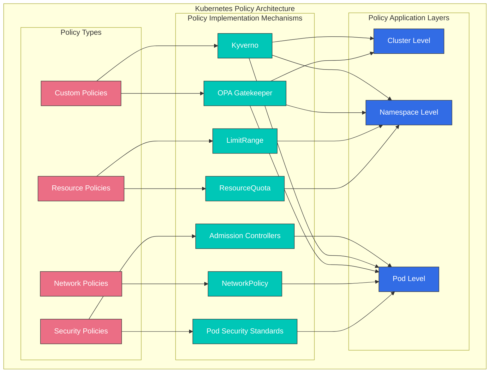
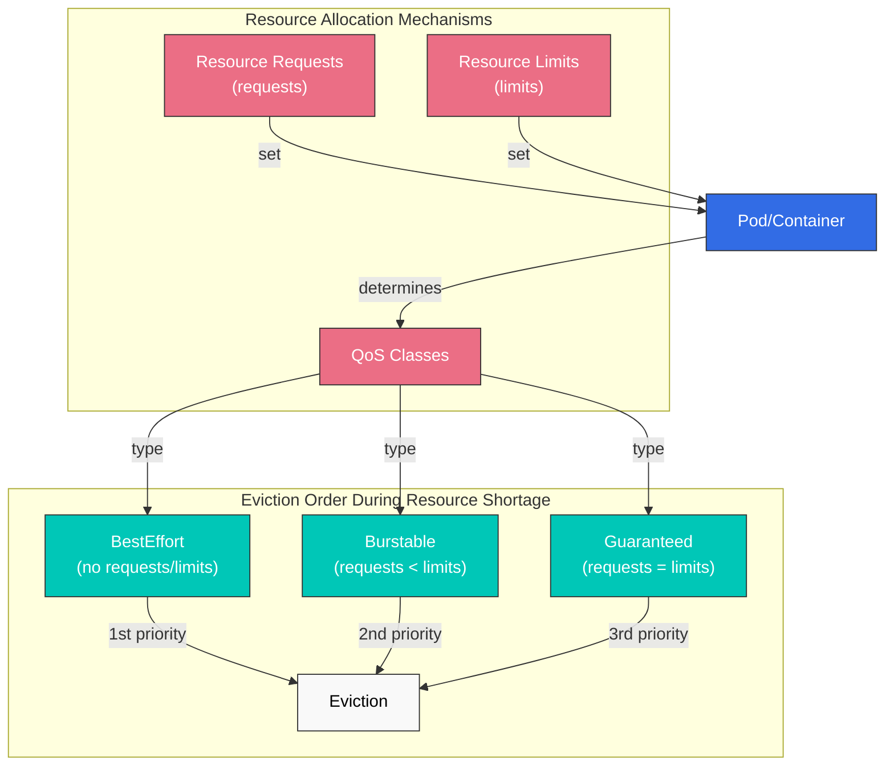
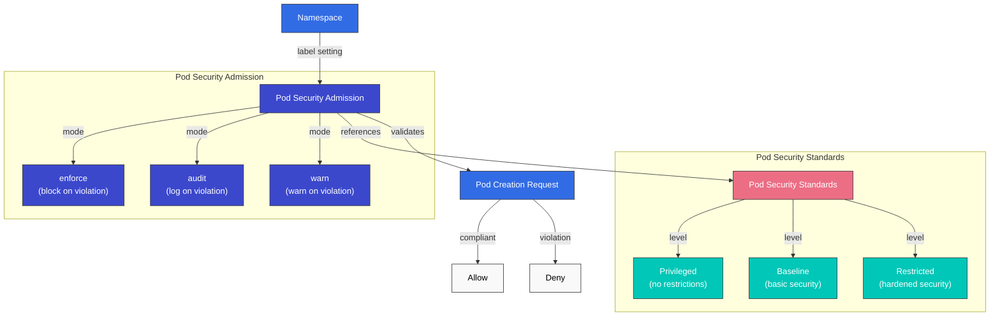
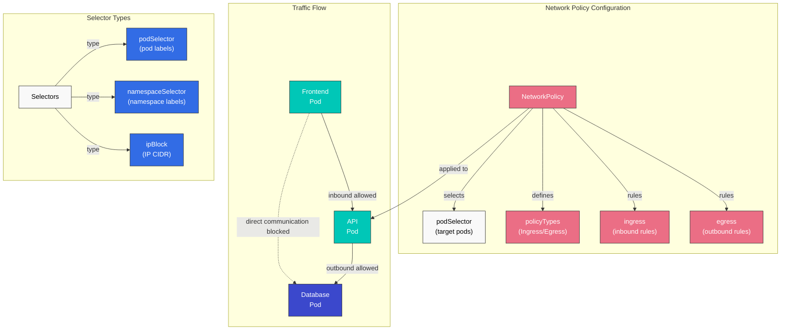
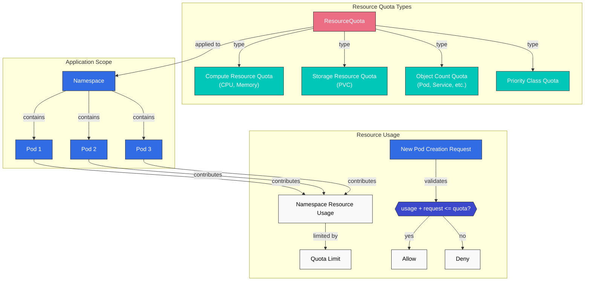
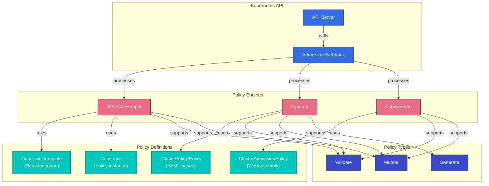
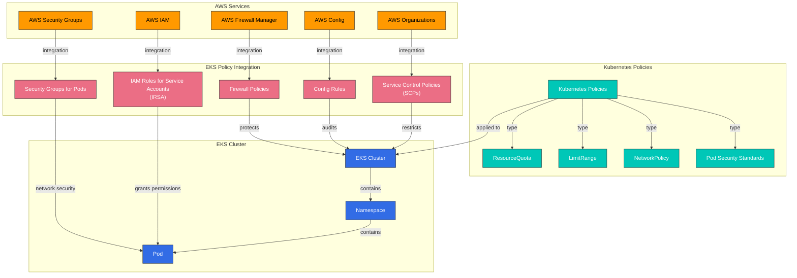

# Kubernetes Policies

> **Versiones compatibles**: Kubernetes 1.32 - 1.34
> **Última actualización**: February 22, 2026

En Kubernetes, las policies (políticas) son conjuntos de reglas que controlan y regulan el comportamiento de los clusters y workloads. Mediante policies, puedes gestionar diversos aspectos como la seguridad, el uso de recursos y la comunicación de red. En este capítulo, aprenderemos sobre los diferentes tipos de policies en Kubernetes, cómo implementarlas y la gestión de policies en Amazon EKS.

## Lab Environment Setup

Para seguir los ejemplos de este documento, necesitas las siguientes herramientas y entorno:

### Required Tools
- kubectl v1.34 o superior
- Un cluster Kubernetes funcional (EKS, minikube, kind, etc.)
- Kyverno CLI (opcional)
- OPA Gatekeeper (opcional)

### Policy Example Setup

```bash
# Create namespace
kubectl create namespace policy-demo

# Create resource quota
kubectl -n policy-demo apply -f - <<EOF
apiVersion: v1
kind: ResourceQuota
metadata:
  name: demo-quota
spec:
  hard:
    requests.cpu: "1"
    requests.memory: 1Gi
    limits.cpu: "2"
    limits.memory: 2Gi
    pods: "10"
EOF

# Create network policy
kubectl -n policy-demo apply -f - <<EOF
apiVersion: networking.k8s.io/v1
kind: NetworkPolicy
metadata:
  name: default-deny
spec:
  podSelector: {}
  policyTypes:
  - Ingress
  - Egress
EOF

# Verify policies
kubectl -n policy-demo get resourcequota,networkpolicy
```

## Kubernetes Policy Architecture



## Policy Type Comparison

| Policy Type | Implementation Mechanism | Application Level | Primary Purpose | Kubernetes Version Support |
|------------|--------------------------|-------------------|-----------------|---------------------------|
| **Resource Policies** | ResourceQuota, LimitRange | Namespace | Resource usage limitation and management | All versions |
| **Security Policies** | Pod Security Standards, PodSecurityPolicy(deprecated) | Pod, Namespace | Security context restrictions | PSP: ~1.24, PSS: 1.22+ |
| **Network Policies** | NetworkPolicy | Pod | Network traffic control | 1.8+ |
| **Custom Policies** | OPA Gatekeeper, Kyverno | Cluster, Namespace, Pod | User-defined policy enforcement | All versions (add-ons) |

## Resource Policies

Las resource policies son mecanismos para limitar y gestionar los recursos de cómputo (CPU, memoria, etc.) y el recuento de objetos (pods, services, etc.) dentro de un cluster Kubernetes.

### ResourceQuota

ResourceQuota limita la cantidad total de recursos que se pueden usar dentro de un namespace.

```yaml
apiVersion: v1
kind: ResourceQuota
metadata:
  name: compute-resources
  namespace: dev
spec:
  hard:
    requests.cpu: "1"
    requests.memory: 1Gi
    limits.cpu: "2"
    limits.memory: 2Gi
    pods: "10"
    services: "5"
    persistentvolumeclaims: "5"
    secrets: "10"
    configmaps: "10"
```

### LimitRange

LimitRange establece límites y requests de recursos predeterminados para containers o pods individuales dentro de un namespace.

```yaml
apiVersion: v1
kind: LimitRange
metadata:
  name: limit-mem-cpu-per-container
  namespace: dev
spec:
  limits:
  - default:
      cpu: 500m
      memory: 512Mi
    defaultRequest:
      cpu: 100m
      memory: 256Mi
    max:
      cpu: "1"
      memory: 1Gi
    min:
      cpu: 50m
      memory: 128Mi
    type: Container
```

## Table of Contents
1. [Policy Overview](#policy-overview)
2. [Resource Allocation Policies](#resource-allocation-policies)
3. [Pod Security Policies](#pod-security-policies)
4. [Network Policies](#network-policies)
5. [Resource Quotas](#resource-quotas)
6. [LimitRange](#limitrange)
7. [Policy Engines](#policy-engines)
8. [Policy Management in Amazon EKS](#policy-management-in-amazon-eks)
9. [Policy Best Practices](#policy-best-practices)
10. [Conclusion](#conclusion)

## Policy Overview

Las policies de Kubernetes proporcionan una forma para que los administradores de clusters definan restricciones sobre recursos y workloads dentro del cluster. Las policies se usan para los siguientes propósitos:

1. **Mejora de la seguridad**: Evitar operaciones no autorizadas y aplicar mejores prácticas de seguridad
2. **Gestión de recursos**: Limitar el uso de recursos y garantizar una distribución justa de recursos
3. **Cumplimiento**: Garantizar el cumplimiento de las policies y regulaciones de la organización
4. **Estandarización**: Aplicar prácticas coherentes de configuración y deployment

Kubernetes puede implementar varios tipos de policies mediante recursos integrados (por ejemplo, NetworkPolicy, ResourceQuota, LimitRange) o policy engines de terceros (por ejemplo, OPA Gatekeeper, Kyverno).

## Resource Allocation Policies

Las resource allocation policies controlan la cantidad de recursos, como CPU y memoria, que pueden usar los pods y containers.



### Resource Requests and Limits

Puedes gestionar el uso de recursos estableciendo resource requests y limits para pods y containers:

```yaml
apiVersion: v1
kind: Pod
metadata:
  name: resource-demo
spec:
  containers:
  - name: resource-demo-container
    image: nginx
    resources:
      requests:
        memory: "64Mi"
        cpu: "250m"
      limits:
        memory: "128Mi"
        cpu: "500m"
```

- **requests**: La cantidad mínima de recursos garantizada para el container
- **limits**: La cantidad máxima de recursos que puede usar el container

Establecer resource requests y limits proporciona los siguientes beneficios:

1. **Garantía de recursos**: Los pods tienen garantizados los recursos mínimos que necesitan
2. **Aislamiento de recursos**: Evita que un pod monopolice los recursos de otro pod
3. **Scheduling eficiente**: El scheduler considera la capacidad de recursos del node al colocar pods

### QoS (Quality of Service) Classes

Kubernetes asigna automáticamente clases QoS según la configuración de resource requests y limits del pod:

1. **Guaranteed**: Todos los containers tienen resource requests y limits configurados, y los requests son iguales a los limits
2. **Burstable**: Al menos un container tiene resource requests configurados, pero no cumple las condiciones de Guaranteed
3. **BestEffort**: Ningún container tiene resource requests ni limits configurados

Las clases QoS determinan el orden de evicción de pods durante una escasez de recursos:
1. Los pods BestEffort se expulsan primero
2. Los pods Burstable se expulsan a continuación
3. Los pods Guaranteed se expulsan al final

## Pod Security Policies

Pod Security Policy (PSP) quedó obsoleto a partir de Kubernetes 1.21 y se eliminó por completo en la versión 1.25. En su lugar, se introdujeron Pod Security Standards y Pod Security Admission.



### Pod Security Standards

Pod Security Standards define tres niveles de policy:

1. **Privileged**: Sin restricciones, todos los permisos permitidos
2. **Baseline**: Bloquea rutas conocidas de escalación de privilegios
3. **Restricted**: Policy de seguridad fuertemente endurecida

### Pod Security Admission

Pod Security Admission aplica Pod Security Standards mediante labels de namespace:

```yaml
apiVersion: v1
kind: Namespace
metadata:
  name: my-namespace
  labels:
    pod-security.kubernetes.io/enforce: restricted
    pod-security.kubernetes.io/audit: restricted
    pod-security.kubernetes.io/warn: restricted
```

Significado de cada label:
- **enforce**: Bloquea la creación de pods que infringen la policy
- **audit**: Registra las infracciones en audit logs
- **warn**: Muestra mensajes de advertencia para las infracciones

## Network Policies

Network Policy proporciona una forma de controlar la comunicación entre pods. De forma predeterminada, todos los pods de un cluster Kubernetes pueden comunicarse entre sí, pero las network policies pueden restringir esto.



```yaml
apiVersion: networking.k8s.io/v1
kind: NetworkPolicy
metadata:
  name: api-allow
  namespace: default
spec:
  podSelector:
    matchLabels:
      app: api
  policyTypes:
  - Ingress
  - Egress
  ingress:
  - from:
    - podSelector:
        matchLabels:
          app: frontend
    ports:
    - protocol: TCP
      port: 8080
  egress:
  - to:
    - podSelector:
        matchLabels:
          app: database
    ports:
    - protocol: TCP
      port: 5432
```

En el ejemplo anterior:
- Define una network policy para pods con el label `api`
- Solo permite tráfico entrante desde pods con el label `frontend` en el puerto 8080
- Solo permite tráfico saliente hacia pods con el label `database` en el puerto 5432

Para usar network policies, el plugin de red del cluster debe admitir network policies. Los plugins CNI como Calico, Cilium y Antrea admiten network policies.

### Network Policy Types

1. **Ingress Policy**: Controla el tráfico que entra al pod
2. **Egress Policy**: Controla el tráfico que sale del pod
3. **Ingress and Egress Policy**: Controla ambas direcciones del tráfico

### Network Policy Selectors

Las network policies pueden filtrar tráfico mediante varios selectors:

1. **podSelector**: Selecciona según labels de pods
2. **namespaceSelector**: Selecciona según labels de namespaces
3. **ipBlock**: Selecciona según rangos CIDR de IP

```yaml
# Example combining multiple selectors
ingress:
- from:
  - podSelector:
      matchLabels:
        app: frontend
    namespaceSelector:
      matchLabels:
        env: prod
  - ipBlock:
      cidr: 172.17.0.0/16
      except:
      - 172.17.1.0/24
```

## Resource Quotas

ResourceQuota limita la cantidad total de recursos que se pueden usar dentro de un namespace. Esto evita que un equipo monopolice todos los recursos cuando varios equipos o proyectos comparten recursos del cluster.



```yaml
apiVersion: v1
kind: ResourceQuota
metadata:
  name: compute-resources
  namespace: team-a
spec:
  hard:
    pods: "10"
    requests.cpu: "4"
    requests.memory: 8Gi
    limits.cpu: "8"
    limits.memory: 16Gi
```

En el ejemplo anterior:
- El namespace `team-a` puede crear un máximo de 10 pods
- La suma de todos los CPU requests de pods no puede superar 4 cores
- La suma de todos los memory requests de pods no puede superar 8Gi
- La suma de todos los CPU limits de pods no puede superar 8 cores
- La suma de todos los memory limits de pods no puede superar 16Gi

### Object Count Quota

Resource quotas también puede limitar la cantidad de objetos que se pueden crear dentro de un namespace más allá de CPU y memoria:

```yaml
apiVersion: v1
kind: ResourceQuota
metadata:
  name: object-counts
  namespace: team-b
spec:
  hard:
    configmaps: "10"
    persistentvolumeclaims: "5"
    replicationcontrollers: "20"
    secrets: "10"
    services: "10"
    services.loadbalancers: "2"
```

### Priority Class Quota

También puedes establecer quotas para pods de clases de prioridad específicas:

```yaml
apiVersion: v1
kind: ResourceQuota
metadata:
  name: priority-class-quota
  namespace: team-c
spec:
  hard:
    pods: "10"
    pods.high: "5"
    pods.medium: "3"
    pods.low: "2"
  scopeSelector:
    matchExpressions:
    - operator: In
      scopeName: PriorityClass
      values: ["high", "medium", "low"]
```

## LimitRange

LimitRange establece límites y requests de recursos predeterminados para recursos individuales (pods, containers, etc.) creados dentro de un namespace. Esto se aplica cuando los desarrolladores no establecen explícitamente resource requests y limits.

```yaml
apiVersion: v1
kind: LimitRange
metadata:
  name: cpu-limit-range
  namespace: default
spec:
  limits:
  - default:
      cpu: 1
      memory: 512Mi
    defaultRequest:
      cpu: 500m
      memory: 256Mi
    max:
      cpu: 2
      memory: 1Gi
    min:
      cpu: 100m
      memory: 128Mi
    type: Container
```

En el ejemplo anterior:
- **default**: Limit predeterminado aplicado cuando un container no tiene un limit explícito
- **defaultRequest**: Request predeterminado aplicado cuando un container no tiene un request explícito
- **max**: Limit máximo que puede establecer un container
- **min**: Request mínimo que puede establecer un container

LimitRange se puede aplicar a los siguientes tipos de recursos:
- Container
- Pod
- PersistentVolumeClaim

## Policy Engines

El ecosistema de Kubernetes tiene varios policy engines que pueden implementar policies más complejas y flexibles.



### OPA Gatekeeper

OPA (Open Policy Agent) Gatekeeper es un proyecto de código abierto para definir y aplicar policies en clusters Kubernetes. Gatekeeper funciona como un admission controller de Kubernetes que intercepta las requests enviadas al API server y aplica policies.

Gatekeeper consta de los siguientes componentes:

1. **ConstraintTemplate**: Una plantilla que define la lógica de la policy
2. **Constraint**: Una instancia de ConstraintTemplate que aplica la policy a recursos específicos

```yaml
# ConstraintTemplate example
apiVersion: templates.gatekeeper.sh/v1beta1
kind: ConstraintTemplate
metadata:
  name: k8srequiredlabels
spec:
  crd:
    spec:
      names:
        kind: K8sRequiredLabels
      validation:
        openAPIV3Schema:
          properties:
            labels:
              type: array
              items: string
  targets:
    - target: admission.k8s.gatekeeper.sh
      rego: |
        package k8srequiredlabels
        violation[{"msg": msg, "details": {"missing_labels": missing}}] {
          provided := {label | input.review.object.metadata.labels[label]}
          required := {label | label := input.parameters.labels[_]}
          missing := required - provided
          count(missing) > 0
          msg := sprintf("missing required labels: %v", [missing])
        }
```

```yaml
# Constraint example
apiVersion: constraints.gatekeeper.sh/v1beta1
kind: K8sRequiredLabels
metadata:
  name: require-app-label
spec:
  match:
    kinds:
      - apiGroups: [""]
        kinds: ["Pod"]
  parameters:
    labels: ["app", "owner"]
```

### Kyverno

Kyverno es un policy engine nativo de Kubernetes que puede validar, mutar y generar recursos Kubernetes usando policies basadas en YAML. Puedes escribir policies con una sintaxis similar a los recursos Kubernetes sin necesidad de aprender el lenguaje Rego.

```yaml
# Kyverno policy example
apiVersion: kyverno.io/v1
kind: ClusterPolicy
metadata:
  name: require-labels
spec:
  validationFailureAction: enforce
  rules:
  - name: check-for-labels
    match:
      resources:
        kinds:
        - Pod
    validate:
      message: "The labels 'app' and 'owner' are required."
      pattern:
        metadata:
          labels:
            app: "?*"
            owner: "?*"
```

Kyverno admite los siguientes tipos de policy:

1. **Validate**: Valida que los recursos cumplan condiciones específicas
2. **Mutate**: Modifica recursos automáticamente
3. **Generate**: Crea otros recursos automáticamente cuando se crea un recurso
4. **Verify Images**: Valida firmas de imágenes
5. **Clean Up**: Limpia automáticamente recursos relacionados cuando se elimina un recurso

### Kubewarden

Kubewarden es un policy engine basado en WebAssembly que permite escribir policies en varios lenguajes de programación. Las policies se compilan en módulos WebAssembly y se ejecutan en el servidor de policies de Kubewarden.

```yaml
# Kubewarden policy example
apiVersion: policies.kubewarden.io/v1alpha2
kind: ClusterAdmissionPolicy
metadata:
  name: require-labels
spec:
  module: registry://ghcr.io/kubewarden/policies/require-labels:v0.1.0
  rules:
  - apiGroups: [""]
    apiVersions: ["v1"]
    resources: ["pods"]
    operations:
    - CREATE
    - UPDATE
  settings:
    required_labels:
      - app
      - owner
```

## Policy Management in Amazon EKS

En Amazon EKS, puedes gestionar policies usando los mecanismos de policy predeterminados de Kubernetes junto con varios servicios de AWS.



### Integration with AWS IAM

Amazon EKS puede conceder permisos a pods para servicios de AWS mediante IAM Roles for Service Accounts (IRSA). Esto permite aplicar el principio de privilegio mínimo.

```bash
# Create OIDC provider
eksctl utils associate-iam-oidc-provider --cluster my-cluster --approve

# Create IAM role and link to service account
eksctl create iamserviceaccount \
  --name my-service-account \
  --namespace default \
  --cluster my-cluster \
  --attach-policy-arn arn:aws:iam::aws:policy/AmazonS3ReadOnlyAccess \
  --approve
```

### AWS Security Groups for Pods

Amazon EKS proporciona la capacidad de aplicar AWS security groups a nivel de pod. Esto permite un control más detallado de la comunicación entre pods.

```yaml
apiVersion: vpcresources.k8s.aws/v1beta1
kind: SecurityGroupPolicy
metadata:
  name: allow-db-access
  namespace: default
spec:
  podSelector:
    matchLabels:
      app: web
  securityGroups:
    groupIds:
      - sg-12345
```

### AWS Config and AWS Organizations

Puedes aplicar policies a nivel de organización a clusters EKS usando AWS Config y AWS Organizations. Por ejemplo, puedes restringir la creación de clusters EKS sin tags específicos.

```json
{
  "Version": "2012-10-17",
  "Statement": [
    {
      "Effect": "Deny",
      "Action": "eks:CreateCluster",
      "Resource": "*",
      "Condition": {
        "Null": {
          "aws:RequestTag/Environment": "true"
        }
      }
    }
  ]
}
```

### AWS Firewall Manager

Puedes usar AWS Firewall Manager para gestionar centralmente network policies para varios clusters EKS. Esto permite aplicar policies de seguridad coherentes en toda la organización.

## Policy Best Practices

Estas son mejores prácticas para gestionar policies de forma eficaz en clusters Kubernetes.

### Policy Design

1. **Principio de privilegio mínimo**: Diseña policies que concedan solo los permisos mínimos necesarios.
2. **Aplicación gradual**: No apliques todas las policies a la vez; aplícalas gradualmente para minimizar el impacto.
3. **Modo audit**: Ejecuta policies en modo audit antes de hacerlas cumplir para evaluar el impacto.
4. **Documentación clara**: Documenta claramente el propósito y el impacto de cada policy.

### Resource Management

1. **Aislamiento de namespaces**: Separa namespaces por equipo o proyecto y establece resource quotas apropiadas para cada namespace.
2. **Límites predeterminados**: Usa LimitRange para establecer límites de recursos predeterminados para todos los containers.
3. **Consideración de clases QoS**: Establece clases QoS apropiadas según la importancia del workload.

### Network Security

1. **Default Deny Policy**: Establece policies que denieguen todo el tráfico de forma predeterminada y permitan explícitamente solo la comunicación necesaria.
2. **Policies granulares**: Establece network policies que controlen finamente la comunicación entre pods.
3. **Revisión regular**: Revisa y actualiza regularmente las network policies.

### Policy Automation

1. **Integración CI/CD**: Integra la validación de policies en pipelines CI/CD para detectar infracciones de policies antes del deployment.
2. **Pruebas de policies**: Prueba las policies primero en un entorno de pruebas y luego aplícalas a producción cuando no haya problemas.
3. **Control de versiones de policies**: Gestiona policies como código y usa sistemas de control de versiones para rastrear cambios.

## Conclusion

Las policies de Kubernetes son herramientas potentes para controlar la seguridad, el uso de recursos y la comunicación de red de clusters y workloads. Puedes crear un marco de policies adaptado a los requisitos de tu organización combinando mecanismos de policy integrados (ResourceQuota, LimitRange, NetworkPolicy, etc.) con policy engines de terceros (OPA Gatekeeper, Kyverno, etc.).

Al usar Amazon EKS, puedes reforzar aún más la gestión de policies aprovechando varios servicios de AWS (IAM, Security Groups, AWS Config, AWS Organizations, AWS Firewall Manager, etc.). Mediante la integración de estos servicios, puedes gestionar eficazmente la seguridad, el cumplimiento y la gestión de recursos de clusters y workloads.

Las policies son un área en continua evolución, por lo que es importante revisar y actualizar regularmente las policies para responder a nuevas amenazas y requisitos. Además, se recomienda gestionar policies como código y automatizarlas para mejorar la coherencia y la eficiencia.

## Quiz

Para comprobar lo que aprendiste en este capítulo, intenta el [Policies Quiz](../quizzes/core/07-policies-quiz.md).

## References

- [Kubernetes Official Documentation - Resource Quotas](https://kubernetes.io/docs/concepts/policy/resource-quotas/)
- [Kubernetes Official Documentation - LimitRange](https://kubernetes.io/docs/concepts/policy/limit-range/)
- [Kubernetes Official Documentation - Network Policies](https://kubernetes.io/docs/concepts/services-networking/network-policies/)
- [Kubernetes Official Documentation - Pod Security Standards](https://kubernetes.io/docs/concepts/security/pod-security-standards/)
- [Kubernetes Official Documentation - Pod Security Admission](https://kubernetes.io/docs/concepts/security/pod-security-admission/)
- [OPA Gatekeeper Official Documentation](https://open-policy-agent.github.io/gatekeeper/website/docs/)
- [Kyverno Official Documentation](https://kyverno.io/docs/)
- [Kubewarden Official Documentation](https://docs.kubewarden.io/)
- [Amazon EKS Official Documentation - IAM Roles for Service Accounts](https://docs.aws.amazon.com/eks/latest/userguide/iam-roles-for-service-accounts.html)
- [Amazon EKS Official Documentation - Security Groups for Pods](https://docs.aws.amazon.com/eks/latest/userguide/security-groups-for-pods.html)
- [AWS Config Official Documentation](https://docs.aws.amazon.com/config/latest/developerguide/WhatIsConfig.html)
- [AWS Organizations Official Documentation](https://docs.aws.amazon.com/organizations/latest/userguide/orgs_introduction.html)
- [AWS Firewall Manager Official Documentation](https://docs.aws.amazon.com/waf/latest/developerguide/fms-chapter.html)
