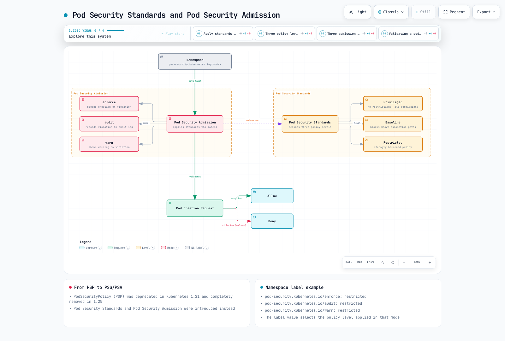

# Políticas de Kubernetes

> **Versiones compatibles**: Kubernetes 1.32 - 1.34
> **Última actualización**: February 22, 2026

En Kubernetes, las políticas son conjuntos de reglas que controlan y regulan el comportamiento de los clusters y las cargas de trabajo. Mediante las políticas, puedes gestionar diversos aspectos, como la seguridad, el uso de recursos y la comunicación de red. En este capítulo, aprenderemos sobre los distintos tipos de políticas en Kubernetes, cómo implementarlas y la gestión de políticas en Amazon EKS.

## Configuración del entorno de laboratorio

Para seguir los ejemplos de este documento, necesitas las siguientes herramientas y entorno:

### Herramientas necesarias
- kubectl v1.34 o superior
- Un cluster de Kubernetes operativo (EKS, minikube, kind, etc.)
- CLI de Kyverno (opcional)
- OPA Gatekeeper (opcional)

### Configuración de ejemplo de políticas

```bash
# Create namespace
kubectl create namespace policy-demo

# Create resource quota
kubectl -n policy-demo apply -f - <<EOF
apiVersion: v1
kind: ResourceQuota
metadata:
  name: demo-quota
spec:
  hard:
    requests.cpu: "1"
    requests.memory: 1Gi
    limits.cpu: "2"
    limits.memory: 2Gi
    pods: "10"
EOF

# Create network policy
kubectl -n policy-demo apply -f - <<EOF
apiVersion: networking.k8s.io/v1
kind: NetworkPolicy
metadata:
  name: default-deny
spec:
  podSelector: {}
  policyTypes:
  - Ingress
  - Egress
EOF

# Verify policies
kubectl -n policy-demo get resourcequota,networkpolicy
```

## Arquitectura de políticas de Kubernetes


[🔍 Ver diagrama interactivo](https://www.atomai.click/kubernetes-docs/archmaps/en-core-07-policies-0.html)

## Comparación de tipos de políticas

| Tipo de política | Mecanismo de implementación | Nivel de aplicación | Propósito principal | Compatibilidad de versión de Kubernetes |
|------------|--------------------------|-------------------|-----------------|---------------------------|
| **Políticas de recursos** | ResourceQuota, LimitRange | Namespace | Limitación y gestión del uso de recursos | Todas las versiones |
| **Políticas de seguridad** | Pod Security Standards, PodSecurityPolicy(deprecated) | Pod, Namespace | Restricciones del contexto de seguridad | PSP: ~1.24, PSS: 1.22+ |
| **Políticas de red** | NetworkPolicy | Pod | Control del tráfico de red | 1.8+ |
| **Políticas personalizadas** | OPA Gatekeeper, Kyverno | Cluster, Namespace, Pod | Aplicación de políticas definidas por el usuario | Todas las versiones (add-ons) |

## Políticas de recursos

Las políticas de recursos son mecanismos para limitar y gestionar los recursos de computación (CPU, memoria, etc.) y los recuentos de objetos (pods, services, etc.) dentro de un cluster de Kubernetes.

### ResourceQuota

ResourceQuota limita la cantidad total de recursos que pueden utilizarse dentro de un namespace.

```yaml
apiVersion: v1
kind: ResourceQuota
metadata:
  name: compute-resources
  namespace: dev
spec:
  hard:
    requests.cpu: "1"
    requests.memory: 1Gi
    limits.cpu: "2"
    limits.memory: 2Gi
    pods: "10"
    services: "5"
    persistentvolumeclaims: "5"
    secrets: "10"
    configmaps: "10"
```

### LimitRange

LimitRange establece límites y solicitudes de recursos predeterminados para contenedores o pods individuales dentro de un namespace.

```yaml
apiVersion: v1
kind: LimitRange
metadata:
  name: limit-mem-cpu-per-container
  namespace: dev
spec:
  limits:
  - default:
      cpu: 500m
      memory: 512Mi
    defaultRequest:
      cpu: 100m
      memory: 256Mi
    max:
      cpu: "1"
      memory: 1Gi
    min:
      cpu: 50m
      memory: 128Mi
    type: Container
```

## Índice
1. [Descripción general de las políticas](#policy-overview)
2. [Políticas de asignación de recursos](#resource-allocation-policies)
3. [Políticas de seguridad de Pod](#pod-security-policies)
4. [Políticas de red](#network-policies)
5. [Cuotas de recursos](#resource-quotas)
6. [LimitRange](#limitrange)
7. [Motores de políticas](#policy-engines)
8. [Gestión de políticas en Amazon EKS](#policy-management-in-amazon-eks)
9. [Prácticas recomendadas de políticas](#policy-best-practices)
10. [Conclusión](#conclusion)

## Descripción general de las políticas

Las políticas de Kubernetes proporcionan una forma para que los administradores de clusters definan restricciones sobre los recursos y las cargas de trabajo dentro del cluster. Las políticas se utilizan para los siguientes propósitos:

1. **Mejora de la seguridad**: Evitar operaciones no autorizadas y aplicar prácticas recomendadas de seguridad
2. **Gestión de recursos**: Limitar el uso de recursos y garantizar una distribución justa de recursos
3. **Cumplimiento**: Garantizar el cumplimiento de las políticas y regulaciones de la organización
4. **Estandarización**: Aplicar prácticas coherentes de configuración y despliegue

Kubernetes puede implementar diversos tipos de políticas mediante recursos integrados (por ejemplo, NetworkPolicy, ResourceQuota, LimitRange) o motores de políticas de terceros (por ejemplo, OPA Gatekeeper, Kyverno).

## Políticas de asignación de recursos

Las políticas de asignación de recursos controlan la cantidad de recursos como CPU y memoria que pueden usar los pods y los contenedores.


[🔍 Ver diagrama interactivo](https://www.atomai.click/kubernetes-docs/archmaps/en-core-07-policies-1.html)

### Solicitudes y límites de recursos

Puedes gestionar el uso de recursos configurando solicitudes y límites de recursos para pods y contenedores:

```yaml
apiVersion: v1
kind: Pod
metadata:
  name: resource-demo
spec:
  containers:
  - name: resource-demo-container
    image: nginx
    resources:
      requests:
        memory: "64Mi"
        cpu: "250m"
      limits:
        memory: "128Mi"
        cpu: "500m"
```

- **requests**: La cantidad mínima de recursos garantizada para el contenedor
- **limits**: La cantidad máxima de recursos que puede usar el contenedor

Configurar solicitudes y límites de recursos proporciona los siguientes beneficios:

1. **Garantía de recursos**: Se garantiza a los pods los recursos mínimos que necesitan
2. **Aislamiento de recursos**: Evita que un pod monopolice los recursos de otro pod
3. **Planificación eficiente**: El scheduler considera la capacidad de recursos del nodo al ubicar pods

### Clases QoS (Quality of Service)

Kubernetes asigna automáticamente clases QoS según la configuración de solicitudes y límites de recursos del pod:

1. **Guaranteed**: Todos los contenedores tienen solicitudes y límites de recursos configurados, y las solicitudes son iguales a los límites
2. **Burstable**: Al menos un contenedor tiene solicitudes de recursos configuradas, pero no cumple las condiciones de Guaranteed
3. **BestEffort**: Ningún contenedor tiene solicitudes y límites de recursos configurados

Las clases QoS determinan el orden de expulsión de pods durante la escasez de recursos:
1. Los pods BestEffort se expulsan primero
2. Los pods Burstable se expulsan después
3. Los pods Guaranteed se expulsan al final

## Políticas de seguridad de Pod

Pod Security Policy (PSP) quedó obsoleta a partir de Kubernetes 1.21 y se eliminó por completo en la versión 1.25. En su lugar, se introdujeron Pod Security Standards y Pod Security Admission.



[🔍 Ver diagrama interactivo](https://www.atomai.click/kubernetes-docs/archmaps/en-core-07-policies-2.html)

### Pod Security Standards

Pod Security Standards define tres niveles de políticas:

1. **Privileged**: Sin restricciones, todos los permisos están permitidos
2. **Baseline**: Bloquea rutas conocidas de escalamiento de privilegios
3. **Restricted**: Política de seguridad fuertemente reforzada

### Pod Security Admission

Pod Security Admission aplica Pod Security Standards mediante etiquetas de namespace:

```yaml
apiVersion: v1
kind: Namespace
metadata:
  name: my-namespace
  labels:
    pod-security.kubernetes.io/enforce: restricted
    pod-security.kubernetes.io/audit: restricted
    pod-security.kubernetes.io/warn: restricted
```

Significado de cada etiqueta:
- **enforce**: Bloquea la creación de pods que infringen la política
- **audit**: Registra las infracciones en los registros de auditoría
- **warn**: Muestra mensajes de advertencia sobre las infracciones

## Políticas de red

Network Policy proporciona una forma de controlar la comunicación entre pods. De forma predeterminada, todos los pods de un cluster de Kubernetes pueden comunicarse entre sí, pero las políticas de red pueden restringirlo.


[🔍 Ver diagrama interactivo](https://www.atomai.click/kubernetes-docs/archmaps/en-core-07-policies-3.html)

```yaml
apiVersion: networking.k8s.io/v1
kind: NetworkPolicy
metadata:
  name: api-allow
  namespace: default
spec:
  podSelector:
    matchLabels:
      app: api
  policyTypes:
  - Ingress
  - Egress
  ingress:
  - from:
    - podSelector:
        matchLabels:
          app: frontend
    ports:
    - protocol: TCP
      port: 8080
  egress:
  - to:
    - podSelector:
        matchLabels:
          app: database
    ports:
    - protocol: TCP
      port: 5432
```

En el ejemplo anterior:
- Define una política de red para pods con la etiqueta `api`
- Solo permite tráfico entrante desde pods con la etiqueta `frontend` en el puerto 8080
- Solo permite tráfico saliente hacia pods con la etiqueta `database` en el puerto 5432

Para usar políticas de red, el plugin de red del cluster debe admitir políticas de red. Los plugins CNI como Calico, Cilium y Antrea admiten políticas de red.

### Tipos de políticas de red

1. **Política Ingress**: Controla el tráfico que entra al pod
2. **Política Egress**: Controla el tráfico que sale del pod
3. **Política Ingress y Egress**: Controla ambas direcciones del tráfico

### Selectores de políticas de red

Las políticas de red pueden filtrar el tráfico mediante varios selectores:

1. **podSelector**: Selecciona según las etiquetas de pod
2. **namespaceSelector**: Selecciona según las etiquetas de namespace
3. **ipBlock**: Selecciona según rangos IP CIDR

```yaml
# Example combining multiple selectors
ingress:
- from:
  - podSelector:
      matchLabels:
        app: frontend
    namespaceSelector:
      matchLabels:
        env: prod
  - ipBlock:
      cidr: 172.17.0.0/16
      except:
      - 172.17.1.0/24
```

## Cuotas de recursos

ResourceQuota limita la cantidad total de recursos que pueden utilizarse dentro de un namespace. Esto evita que un equipo monopolice todos los recursos cuando varios equipos o proyectos comparten los recursos del cluster.


[🔍 Ver diagrama interactivo](https://www.atomai.click/kubernetes-docs/archmaps/en-core-07-policies-4.html)

```yaml
apiVersion: v1
kind: ResourceQuota
metadata:
  name: compute-resources
  namespace: team-a
spec:
  hard:
    pods: "10"
    requests.cpu: "4"
    requests.memory: 8Gi
    limits.cpu: "8"
    limits.memory: 16Gi
```

En el ejemplo anterior:
- El namespace `team-a` puede crear un máximo de 10 pods
- La suma de todas las solicitudes de CPU de los pods no puede superar 4 núcleos
- La suma de todas las solicitudes de memoria de los pods no puede superar 8Gi
- La suma de todos los límites de CPU de los pods no puede superar 8 núcleos
- La suma de todos los límites de memoria de los pods no puede superar 16Gi

### Cuota de recuento de objetos

Las cuotas de recursos también pueden limitar la cantidad de objetos que se pueden crear dentro de un namespace, además de CPU y memoria:

```yaml
apiVersion: v1
kind: ResourceQuota
metadata:
  name: object-counts
  namespace: team-b
spec:
  hard:
    configmaps: "10"
    persistentvolumeclaims: "5"
    replicationcontrollers: "20"
    secrets: "10"
    services: "10"
    services.loadbalancers: "2"
```

### Cuota de clase de prioridad

También puedes establecer cuotas para pods de clases de prioridad específicas:

```yaml
apiVersion: v1
kind: ResourceQuota
metadata:
  name: priority-class-quota
  namespace: team-c
spec:
  hard:
    pods: "10"
    pods.high: "5"
    pods.medium: "3"
    pods.low: "2"
  scopeSelector:
    matchExpressions:
    - operator: In
      scopeName: PriorityClass
      values: ["high", "medium", "low"]
```

## LimitRange

LimitRange establece límites y solicitudes de recursos predeterminados para recursos individuales (pods, contenedores, etc.) creados dentro de un namespace. Esto se aplica cuando los desarrolladores no establecen explícitamente solicitudes y límites de recursos.

```yaml
apiVersion: v1
kind: LimitRange
metadata:
  name: cpu-limit-range
  namespace: default
spec:
  limits:
  - default:
      cpu: 1
      memory: 512Mi
    defaultRequest:
      cpu: 500m
      memory: 256Mi
    max:
      cpu: 2
      memory: 1Gi
    min:
      cpu: 100m
      memory: 128Mi
    type: Container
```

En el ejemplo anterior:
- **default**: Límite predeterminado que se aplica cuando un contenedor no tiene un límite explícito
- **defaultRequest**: Solicitud predeterminada que se aplica cuando un contenedor no tiene una solicitud explícita
- **max**: Límite máximo que puede establecer un contenedor
- **min**: Solicitud mínima que puede establecer un contenedor

LimitRange se puede aplicar a los siguientes tipos de recursos:
- Container
- Pod
- PersistentVolumeClaim

## Motores de políticas

El ecosistema de Kubernetes cuenta con varios motores de políticas que pueden implementar políticas más complejas y flexibles.


[🔍 Ver diagrama interactivo](https://www.atomai.click/kubernetes-docs/archmaps/en-core-07-policies-5.html)

### OPA Gatekeeper

OPA (Open Policy Agent) Gatekeeper es un proyecto de código abierto para definir y aplicar políticas en clusters de Kubernetes. Gatekeeper funciona como un controlador de admisión de Kubernetes que intercepta las solicitudes enviadas al servidor de API y aplica políticas.

Gatekeeper consta de los siguientes componentes:

1. **ConstraintTemplate**: Una plantilla que define la lógica de la política
2. **Constraint**: Una instancia de ConstraintTemplate que aplica la política a recursos específicos

```yaml
# ConstraintTemplate example
apiVersion: templates.gatekeeper.sh/v1beta1
kind: ConstraintTemplate
metadata:
  name: k8srequiredlabels
spec:
  crd:
    spec:
      names:
        kind: K8sRequiredLabels
      validation:
        openAPIV3Schema:
          properties:
            labels:
              type: array
              items: string
  targets:
    - target: admission.k8s.gatekeeper.sh
      rego: |
        package k8srequiredlabels
        violation[{"msg": msg, "details": {"missing_labels": missing}}] {
          provided := {label | input.review.object.metadata.labels[label]}
          required := {label | label := input.parameters.labels[_]}
          missing := required - provided
          count(missing) > 0
          msg := sprintf("missing required labels: %v", [missing])
        }
```

```yaml
# Constraint example
apiVersion: constraints.gatekeeper.sh/v1beta1
kind: K8sRequiredLabels
metadata:
  name: require-app-label
spec:
  match:
    kinds:
      - apiGroups: [""]
        kinds: ["Pod"]
  parameters:
    labels: ["app", "owner"]
```

### Kyverno

Kyverno es un motor de políticas nativo de Kubernetes que puede validar, modificar y generar recursos de Kubernetes mediante políticas basadas en YAML. Puedes escribir políticas con una sintaxis similar a los recursos de Kubernetes sin necesidad de aprender el lenguaje Rego.

```yaml
# Kyverno policy example
apiVersion: kyverno.io/v1
kind: ClusterPolicy
metadata:
  name: require-labels
spec:
  validationFailureAction: enforce
  rules:
  - name: check-for-labels
    match:
      resources:
        kinds:
        - Pod
    validate:
      message: "The labels 'app' and 'owner' are required."
      pattern:
        metadata:
          labels:
            app: "?*"
            owner: "?*"
```

Kyverno admite los siguientes tipos de políticas:

1. **Validate**: Valida que los recursos cumplan condiciones específicas
2. **Mutate**: Modifica automáticamente los recursos
3. **Generate**: Crea automáticamente otros recursos cuando se crea un recurso
4. **Verify Images**: Valida firmas de imágenes
5. **Clean Up**: Limpia automáticamente los recursos relacionados cuando se elimina un recurso

### Kubewarden

Kubewarden es un motor de políticas basado en WebAssembly que permite escribir políticas en diversos lenguajes de programación. Las políticas se compilan en módulos WebAssembly y se ejecutan en el servidor de políticas de Kubewarden.

```yaml
# Kubewarden policy example
apiVersion: policies.kubewarden.io/v1alpha2
kind: ClusterAdmissionPolicy
metadata:
  name: require-labels
spec:
  module: registry://ghcr.io/kubewarden/policies/require-labels:v0.1.0
  rules:
  - apiGroups: [""]
    apiVersions: ["v1"]
    resources: ["pods"]
    operations:
    - CREATE
    - UPDATE
  settings:
    required_labels:
      - app
      - owner
```

## Gestión de políticas en Amazon EKS

En Amazon EKS, puedes gestionar políticas mediante los mecanismos de políticas predeterminados de Kubernetes junto con diversos servicios de AWS.


[🔍 Ver diagrama interactivo](https://www.atomai.click/kubernetes-docs/archmaps/en-core-07-policies-6.html)

### Integración con AWS IAM

Amazon EKS puede conceder permisos a pods para servicios de AWS mediante IAM Roles for Service Accounts (IRSA). Esto permite aplicar el principio de mínimo privilegio.

```bash
# Create OIDC provider
eksctl utils associate-iam-oidc-provider --cluster my-cluster --approve

# Create IAM role and link to service account
eksctl create iamserviceaccount \
  --name my-service-account \
  --namespace default \
  --cluster my-cluster \
  --attach-policy-arn arn:aws:iam::aws:policy/AmazonS3ReadOnlyAccess \
  --approve
```

### AWS Security Groups for Pods

Amazon EKS proporciona la capacidad de aplicar AWS security groups en el nivel de pod. Esto permite un control más detallado de la comunicación entre pods.

```yaml
apiVersion: vpcresources.k8s.aws/v1beta1
kind: SecurityGroupPolicy
metadata:
  name: allow-db-access
  namespace: default
spec:
  podSelector:
    matchLabels:
      app: web
  securityGroups:
    groupIds:
      - sg-12345
```

### AWS Config y AWS Organizations

Puedes aplicar políticas a nivel de organización a clusters de EKS mediante AWS Config y AWS Organizations. Por ejemplo, puedes restringir la creación de clusters de EKS sin etiquetas específicas.

```json
{
  "Version": "2012-10-17",
  "Statement": [
    {
      "Effect": "Deny",
      "Action": "eks:CreateCluster",
      "Resource": "*",
      "Condition": {
        "Null": {
          "aws:RequestTag/Environment": "true"
        }
      }
    }
  ]
}
```

### AWS Firewall Manager

Puedes usar AWS Firewall Manager para gestionar de forma centralizada las políticas de red de varios clusters de EKS. Esto permite aplicar políticas de seguridad coherentes en toda la organización.

## Prácticas recomendadas de políticas

Estas son prácticas recomendadas para gestionar eficazmente las políticas en clusters de Kubernetes.

### Diseño de políticas

1. **Principio de mínimo privilegio**: Diseña políticas que concedan solo los permisos mínimos necesarios.
2. **Aplicación gradual**: No apliques todas las políticas a la vez; aplícalas gradualmente para minimizar el impacto.
3. **Modo de auditoría**: Ejecuta las políticas en modo de auditoría antes de aplicarlas para evaluar el impacto.
4. **Documentación clara**: Documenta claramente el propósito y el impacto de cada política.

### Gestión de recursos

1. **Aislamiento de namespace**: Separa los namespaces por equipo o proyecto y establece cuotas de recursos apropiadas para cada namespace.
2. **Límites predeterminados**: Usa LimitRange para establecer límites de recursos predeterminados para todos los contenedores.
3. **Consideración de la clase QoS**: Establece clases QoS apropiadas según la importancia de la carga de trabajo.

### Seguridad de red

1. **Política de denegación predeterminada**: Establece políticas que denieguen todo el tráfico de forma predeterminada y permitan explícitamente solo la comunicación necesaria.
2. **Políticas granulares**: Establece políticas de red que controlen con precisión la comunicación entre pods.
3. **Revisión regular**: Revisa y actualiza regularmente las políticas de red.

### Automatización de políticas

1. **Integración de CI/CD**: Integra la validación de políticas en los pipelines de CI/CD para detectar infracciones de políticas antes del despliegue.
2. **Pruebas de políticas**: Prueba primero las políticas en un entorno de prueba y, cuando no haya problemas, aplícalas a producción.
3. **Control de versiones de políticas**: Gestiona las políticas como código y usa sistemas de control de versiones para realizar un seguimiento de los cambios.

## Conclusión

Las políticas de Kubernetes son herramientas potentes para controlar la seguridad, el uso de recursos y la comunicación de red de clusters y cargas de trabajo. Puedes crear un marco de políticas adaptado a los requisitos de tu organización combinando mecanismos de políticas integrados (ResourceQuota, LimitRange, NetworkPolicy, etc.) con motores de políticas de terceros (OPA Gatekeeper, Kyverno, etc.).

Al usar Amazon EKS, puedes fortalecer aún más la gestión de políticas aprovechando diversos servicios de AWS (IAM, Security Groups, AWS Config, AWS Organizations, AWS Firewall Manager, etc.). Al integrar estos servicios, puedes gestionar eficazmente la seguridad, el cumplimiento y la gestión de recursos de los clusters y las cargas de trabajo.

Las políticas son un área en continua evolución, por lo que es importante revisarlas y actualizarlas regularmente para responder a nuevas amenazas y requisitos. Además, se recomienda gestionar las políticas como código y automatizarlas para mejorar la coherencia y la eficiencia.

## Cuestionario

Para poner a prueba lo que aprendiste en este capítulo, intenta el [Cuestionario de políticas](../quizzes/core/07-policies-quiz.md).

## Referencias

- [Documentación oficial de Kubernetes - Cuotas de recursos](https://kubernetes.io/docs/concepts/policy/resource-quotas/)
- [Documentación oficial de Kubernetes - LimitRange](https://kubernetes.io/docs/concepts/policy/limit-range/)
- [Documentación oficial de Kubernetes - Políticas de red](https://kubernetes.io/docs/concepts/services-networking/network-policies/)
- [Documentación oficial de Kubernetes - Pod Security Standards](https://kubernetes.io/docs/concepts/security/pod-security-standards/)
- [Documentación oficial de Kubernetes - Pod Security Admission](https://kubernetes.io/docs/concepts/security/pod-security-admission/)
- [Documentación oficial de OPA Gatekeeper](https://open-policy-agent.github.io/gatekeeper/website/docs/)
- [Documentación oficial de Kyverno](https://kyverno.io/docs/)
- [Documentación oficial de Kubewarden](https://docs.kubewarden.io/)
- [Documentación oficial de Amazon EKS - IAM Roles for Service Accounts](https://docs.aws.amazon.com/eks/latest/userguide/iam-roles-for-service-accounts.html)
- [Documentación oficial de Amazon EKS - Security Groups for Pods](https://docs.aws.amazon.com/eks/latest/userguide/security-groups-for-pods.html)
- [Documentación oficial de AWS Config](https://docs.aws.amazon.com/config/latest/developerguide/WhatIsConfig.html)
- [Documentación oficial de AWS Organizations](https://docs.aws.amazon.com/organizations/latest/userguide/orgs_introduction.html)
- [Documentación oficial de AWS Firewall Manager](https://docs.aws.amazon.com/waf/latest/developerguide/fms-chapter.html)
