# Kubernetes Scheduling, Preemption, and Eviction

> **Versiones compatibles**: Kubernetes 1.32 - 1.34
> **Última actualización**: February 22, 2026

En Kubernetes, scheduling es el proceso de colocar pods en nodes adecuados. Preemption es el proceso de eliminar pods de menor prioridad para hacer espacio para pods de mayor prioridad, y eviction es el proceso de mover pods de forma segura cuando ocurren problemas en los nodes. En este capítulo, aprenderemos sobre los mecanismos de scheduling de Kubernetes, la selección de nodes, preemption, eviction y métodos de optimización de scheduling en Amazon EKS.

## Lab Environment Setup

Para seguir los ejemplos de este documento, necesitas las siguientes herramientas y entorno:

### Required Tools
- kubectl v1.34 o superior
- Un cluster Kubernetes funcional (EKS, minikube, kind, etc.)
- Un cluster con múltiples nodes (para pruebas de scheduling)

### Scheduling Example Setup

```bash
# Create namespace
kubectl create namespace scheduling-demo

# Add labels to nodes (if you have multiple nodes)
kubectl label nodes <node-name> disktype=ssd
kubectl label nodes <node-name> gpu=true

# Create a pod using node affinity
kubectl -n scheduling-demo apply -f - <<EOF
apiVersion: v1
kind: Pod
metadata:
  name: nginx-ssd
spec:
  affinity:
    nodeAffinity:
      requiredDuringSchedulingIgnoredDuringExecution:
        nodeSelectorTerms:
        - matchExpressions:
          - key: disktype
            operator: In
            values:
            - ssd
  containers:
  - name: nginx
    image: nginx
EOF

# Create priority class
kubectl apply -f - <<EOF
apiVersion: scheduling.k8s.io/v1
kind: PriorityClass
metadata:
  name: high-priority
value: 1000000
globalDefault: false
description: "This priority class should be used for critical service pods only."
EOF

# Create Pod Disruption Budget (PDB)
kubectl -n scheduling-demo apply -f - <<EOF
apiVersion: policy/v1
kind: PodDisruptionBudget
metadata:
  name: nginx-pdb
spec:
  minAvailable: 1
  selector:
    matchLabels:
      app: nginx
EOF
```

## Kubernetes Scheduling Architecture

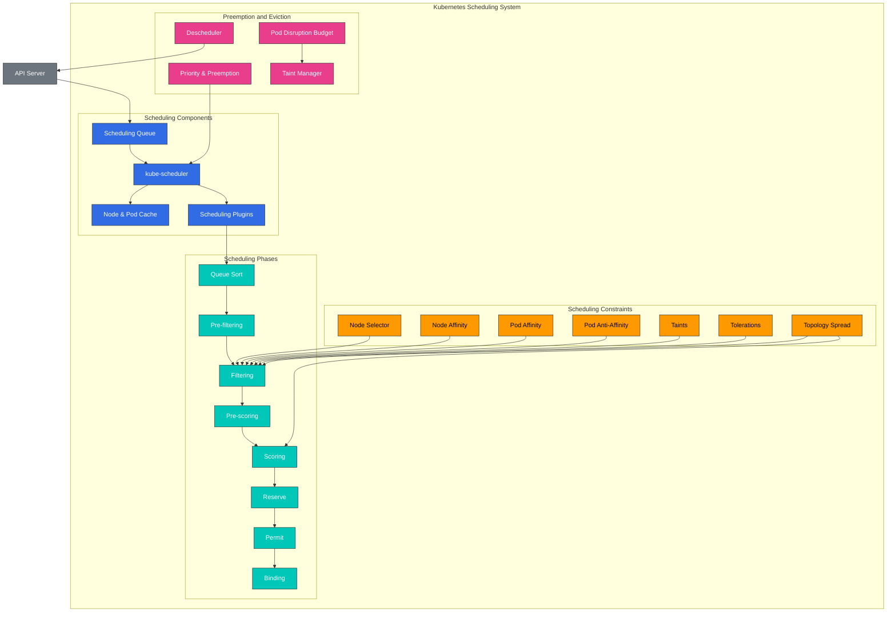

## Scheduling Concept Comparison

| Concept | Purpose | Use Cases | Kubernetes Version |
|---------|---------|-----------|-------------------|
| **Node Selector** | Place pods on nodes with specific labels | Simple node selection | All versions |
| **Node Affinity** | Define complex node selection rules | Advanced node selection | 1.6+ |
| **Pod Affinity** | Place pods close to other pods | Co-locating related services | 1.6+ |
| **Pod Anti-Affinity** | Place pods away from other pods | Ensuring high availability | 1.6+ |
| **Taints and Tolerations** | Allow only specific pods on nodes | Dedicated nodes, node isolation | 1.6+ |
| **Topology Spread Constraints** | Spread pods across topology domains | Distribution across availability zones | 1.16+ (GA in 1.19) |
| **Priority and Preemption** | Prioritize important workloads | Critical service guarantees | 1.8+ (GA in 1.11) |
| **Pod Disruption Budget** | Limit simultaneously disrupted pods | Ensuring high availability | 1.4+ (GA in 1.21) |

## Basic Scheduling Concepts

> **Concepto clave**: El scheduler de Kubernetes es un componente del control plane que selecciona el node óptimo para ejecutar pods, operando en dos fases: filtering y scoring.

### Scheduling Process

1. **Filtering Phase (Predicates)**
   - Identifica un conjunto adecuado de nodes que pueden ejecutar el pod
   - Considera los requisitos de recursos, node selectors, reglas de affinity, taints/tolerations, etc.
   - Excluye un node si no se cumple alguna condición

2. **Scoring Phase (Priorities)**
   - Asigna puntuaciones a los nodes que pasaron el filtering
   - Considera la utilización de recursos, distribución de pods, preferencias de affinity, etc.
   - Selecciona el node con la puntuación más alta

3. **Binding Phase**
   - Asigna el pod al node seleccionado
   - Actualiza la información de binding en el API server

## Table of Contents
1. [Scheduling Overview](#scheduling-overview)
2. [How the Scheduler Works](#how-the-scheduler-works)
3. [Node Selection](#node-selection)
4. [Pod Affinity and Anti-Affinity](#pod-affinity-and-anti-affinity)
5. [Taints and Tolerations](#taints-and-tolerations)
6. [Node Affinity](#node-affinity)
7. [Pod Priority and Preemption](#pod-priority-and-preemption)
8. [Pod Eviction](#pod-eviction)
9. [Pod Disruption Budget (PDB)](#pod-disruption-budget-pdb)
10. [Node Pressure Eviction](#node-pressure-eviction)
11. [TopologySpreadConstraints](#topologyspreadconstraints)
12. [Pod Deletion Cost](#pod-deletion-cost)
13. [Descheduler](#descheduler)
14. [Scheduling Optimization in Amazon EKS](#scheduling-optimization-in-amazon-eks)
15. [Scheduling Best Practices](#scheduling-best-practices)
16. [Conclusion](#conclusion)

## Scheduling Overview

El scheduler de Kubernetes es un componente del control plane que coloca pods en nodes adecuados. El scheduler considera varios factores para determinar el node óptimo donde colocar los pods:

1. **Resource Requirements**: CPU, memoria y otros recursos solicitados por el pod
2. **Hardware/Software/Policy Constraints**: Node selectors, node affinity, taints, etc.
3. **Affinity/Anti-Affinity Specifications**: Relaciones de placement con otros pods
4. **Data Locality**: Colocar pods cerca de los datos
5. **Inter-Workload Interference**: Minimizar la interferencia entre diferentes workloads
6. **Deadlines**: Considerar workloads con restricciones de tiempo

### Scheduling Process

El proceso de scheduling se divide ampliamente en dos fases:

1. **Filtering**: Identifica un conjunto de nodes que pueden ejecutar el pod
   - Comprueba si se cumplen los requisitos de recursos
   - Comprueba constraints como node selectors, affinity, taints

2. **Scoring**: Puntúa los nodes filtrados para seleccionar el node óptimo
   - Balance de utilización de recursos
   - Inter-pod affinity/anti-affinity
   - Data locality
   - Taints/tolerations

## How the Scheduler Works

El scheduler de Kubernetes opera mediante el siguiente proceso:

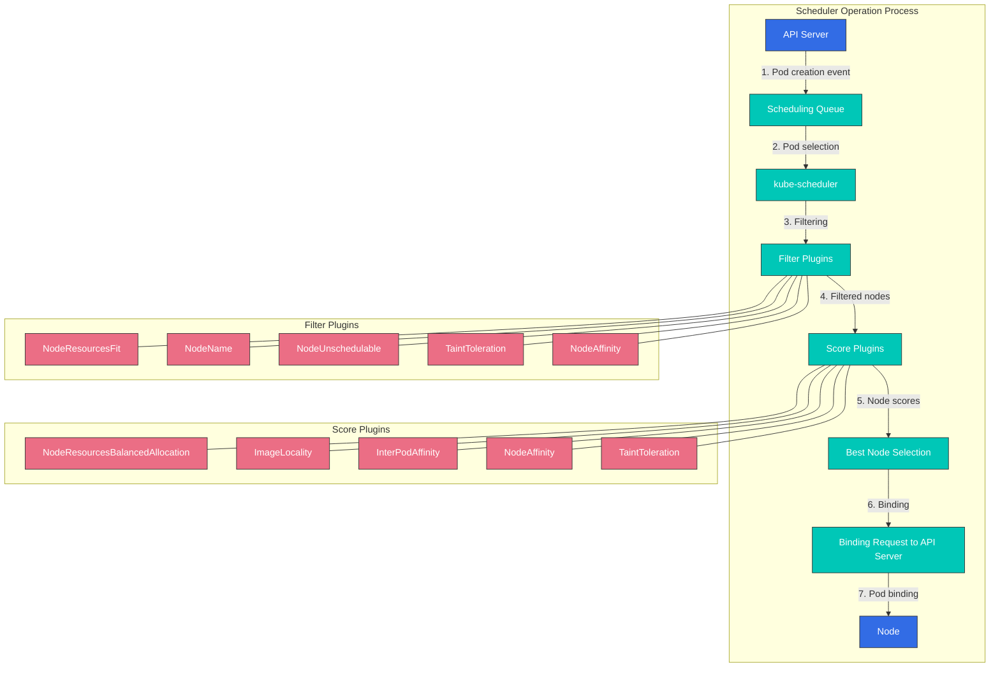

1. **Pod Queue Watching**: El scheduler observa el API server en busca de pods no programados.
2. **Node Filtering**: Identifica un conjunto de nodes que pueden ejecutar el pod.
3. **Node Scoring**: Puntúa los nodes filtrados.
4. **Node Selection**: Selecciona el node con la puntuación más alta.
5. **Binding**: Vincula el pod al node seleccionado.

### Scheduling Plugins

El scheduler de Kubernetes está diseñado para ser extensible mediante una arquitectura de plugins. Varios plugins operan en diferentes etapas del proceso de scheduling:

1. **Filter Plugins**: Filtran los nodes donde el pod no puede ejecutarse
   - NodeResourcesFit: Comprueba la capacidad de recursos del node
   - NodeName: Comprueba el campo nodeName del pod
   - NodeUnschedulable: Comprueba la capacidad de scheduling del node
   - TaintToleration: Comprueba taints y tolerations

2. **Score Plugins**: Asignan puntuaciones a los nodes
   - NodeResourcesBalancedAllocation: Considera el balance del uso de recursos
   - ImageLocality: Considera la localidad de la imagen
   - InterPodAffinity: Considera inter-pod affinity
   - NodeAffinity: Considera node affinity

### Multiple Schedulers

Kubernetes puede ejecutar múltiples schedulers simultáneamente. Esto permite implementar lógica de scheduling personalizada para workloads específicos.

```yaml
apiVersion: v1
kind: Pod
metadata:
  name: custom-scheduled-pod
spec:
  schedulerName: my-custom-scheduler
  containers:
  - name: container
    image: nginx
```

En el ejemplo anterior, el campo `schedulerName` especifica el scheduler que debe programar el pod.

## Node Selection

Kubernetes proporciona varios mecanismos para colocar pods en nodes específicos.

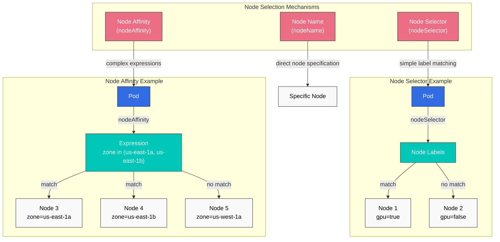

### Node Selector

Node selector es la forma más simple de restringir pods para que solo se coloquen en nodes con labels específicos.

```yaml
apiVersion: v1
kind: Pod
metadata:
  name: gpu-pod
spec:
  nodeSelector:
    gpu: "true"
  containers:
  - name: gpu-container
    image: nvidia/cuda
```

En el ejemplo anterior, el pod solo se coloca en nodes con el label `gpu=true`.

### nodeName

Puedes usar el campo `nodeName` para colocar directamente un pod en un node específico. Este método omite el scheduler y, en general, no se recomienda.

```yaml
apiVersion: v1
kind: Pod
metadata:
  name: specific-node-pod
spec:
  nodeName: worker-node-1
  containers:
  - name: container
    image: nginx
```

En el ejemplo anterior, el pod se coloca directamente en el node llamado `worker-node-1`.

## Pod Affinity and Anti-Affinity

Pod affinity y anti-affinity proporcionan formas de colocar pods basándose en relaciones entre pods.

```mermaid
graph TD
    subgraph "Pod Affinity"
        PA["podAffinity"]
        PA -->|place on same node/topology| Together["Co-location"]

        subgraph "Affinity Example"
            WebPod["Web Pod<br>app=web"]
            CachePod["Cache Pod<br>app=cache"]
            WebPod -->|co-locate| CachePod
            Node1["Node 1"] -->|contains| WebPod
            Node1 -->|contains| CachePod
        end
    end

    subgraph "Pod Anti-Affinity"
        PAA["podAntiAffinity"]
        PAA -->|place on different node/topology| Apart["Separation"]

        subgraph "Anti-Affinity Example"
            WebPod1["Web Pod 1<br>app=web"]
            WebPod2["Web Pod 2<br>app=web"]
            WebPod1 -->|separate| WebPod2
            Node2["Node 2"] -->|contains| WebPod1
            Node3["Node 3"] -->|contains| WebPod2
        end
    end

    subgraph "Affinity Types"
        Required["requiredDuringSchedulingIgnoredDuringExecution<br>(hard requirement)"]
        Preferred["preferredDuringSchedulingIgnoredDuringExecution<br>(soft requirement)"]
    end

    PA -->|type| Required
    PA -->|type| Preferred
    PAA -->|type| Required
    PAA -->|type| Preferred

    %% Style definitions
    classDef affinityType fill:#EB6E85,stroke:#333,stroke-width:1px,color:white;
    classDef affinityResult fill:#00C7B7,stroke:#333,stroke-width:1px,color:white;
    classDef k8sComponent fill:#326CE5,stroke:#333,stroke-width:1px,color:white;
    classDef nodeComponent fill:#f9f9f9,stroke:#333,stroke-width:1px,color:black;
    classDef affinityKind fill:#3B48CC,stroke:#333,stroke-width:1px,color:white;

    %% Apply classes
    class PA,PAA affinityType;
    class Together,Apart affinityResult;
    class WebPod,CachePod,WebPod1,WebPod2 k8sComponent;
    class Node1,Node2,Node3 nodeComponent;
    class Required,Preferred affinityKind;
```

### Pod Affinity

Pod affinity hace que los pods se coloquen en el mismo node o dominio de topology que los pods con labels específicos.

```yaml
apiVersion: v1
kind: Pod
metadata:
  name: frontend
spec:
  affinity:
    podAffinity:
      requiredDuringSchedulingIgnoredDuringExecution:
      - labelSelector:
          matchExpressions:
          - key: app
            operator: In
            values:
            - cache
        topologyKey: kubernetes.io/hostname
  containers:
  - name: frontend
    image: nginx
```

En el ejemplo anterior, el pod `frontend` se coloca en el mismo host que los pods con el label `app=cache`.

### Pod Anti-Affinity

Pod anti-affinity hace que los pods se coloquen en un node o dominio de topology diferente al de los pods con labels específicos.

```yaml
apiVersion: v1
kind: Pod
metadata:
  name: frontend
  labels:
    app: frontend
spec:
  affinity:
    podAntiAffinity:
      requiredDuringSchedulingIgnoredDuringExecution:
      - labelSelector:
          matchExpressions:
          - key: app
            operator: In
            values:
            - frontend
        topologyKey: kubernetes.io/hostname
  containers:
  - name: frontend
    image: nginx
```

En el ejemplo anterior, el pod `frontend` se coloca en un host diferente al de otros pods con el label `app=frontend`. Esto es útil para distribuir instancias de la misma aplicación en múltiples nodes para alta disponibilidad.

### Affinity Types

Pod affinity y anti-affinity tienen dos tipos:

1. **requiredDuringSchedulingIgnoredDuringExecution**: Requisito estricto que debe cumplirse durante scheduling
2. **preferredDuringSchedulingIgnoredDuringExecution**: Requisito flexible que se prefiere, pero no es obligatorio

```yaml
# preferredDuringSchedulingIgnoredDuringExecution example
affinity:
  podAffinity:
    preferredDuringSchedulingIgnoredDuringExecution:
    - weight: 100
      podAffinityTerm:
        labelSelector:
          matchExpressions:
          - key: app
            operator: In
            values:
            - cache
        topologyKey: kubernetes.io/hostname
```

En el ejemplo anterior, el campo `weight` indica el peso de esta preferencia. Cuando hay múltiples preferencias, las de mayor peso se consideran más importantes.

## Taints and Tolerations

Taints y tolerations son mecanismos que permiten que los nodes rechacen pods específicos.

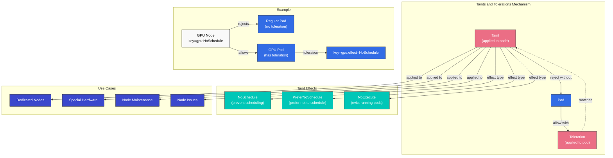

### Taints

Los taints se aplican a los nodes para restringir que se programen pods en ellos.

```bash
# Add taint to node
kubectl taint nodes node1 key=value:NoSchedule
```

Hay tres efectos de taint:

1. **NoSchedule**: Los pods sin tolerations no se programan en el node
2. **PreferNoSchedule**: Se prefiere no programar pods sin tolerations en el node
3. **NoExecute**: Los pods sin tolerations se evictan del node

### Tolerations

Las tolerations se aplican a los pods para permitir que se programen en nodes con taints.

```yaml
apiVersion: v1
kind: Pod
metadata:
  name: nginx
spec:
  tolerations:
  - key: "key"
    operator: "Equal"
    value: "value"
    effect: "NoSchedule"
  containers:
  - name: nginx
    image: nginx
```

En el ejemplo anterior, el pod puede programarse en nodes con el taint `key=value:NoSchedule`.

### Use Cases

Casos de uso comunes para taints y tolerations:

1. **Dedicated Nodes**: Designar nodes para ejecutar solo workloads específicos
2. **Special Hardware**: Gestionar nodes con hardware especial como GPUs
3. **Node Maintenance**: Evitar el scheduling de nuevos pods en nodes bajo mantenimiento
4. **Node Issues**: Evictar pods de nodes con problemas

### Default Taints

Kubernetes aplica taints predeterminados a algunos nodes:

- **node.kubernetes.io/not-ready**: El node no está listo
- **node.kubernetes.io/unreachable**: No se puede acceder al node
- **node.kubernetes.io/memory-pressure**: El node tiene presión de memoria
- **node.kubernetes.io/disk-pressure**: El node tiene presión de disco
- **node.kubernetes.io/pid-pressure**: El node tiene presión de PID
- **node.kubernetes.io/network-unavailable**: La red del node no está disponible
- **node.kubernetes.io/unschedulable**: El node no es schedulable

## Node Affinity

Node affinity proporciona una forma más expresiva de colocar pods en conjuntos específicos de nodes. Permite especificar condiciones más complejas que node selector.

### Node Affinity Types

Node affinity tiene dos tipos:

1. **requiredDuringSchedulingIgnoredDuringExecution**: Requisito estricto que debe cumplirse durante scheduling
2. **preferredDuringSchedulingIgnoredDuringExecution**: Requisito flexible que se prefiere, pero no es obligatorio

```yaml
apiVersion: v1
kind: Pod
metadata:
  name: with-node-affinity
spec:
  affinity:
    nodeAffinity:
      requiredDuringSchedulingIgnoredDuringExecution:
        nodeSelectorTerms:
        - matchExpressions:
          - key: kubernetes.io/e2e-az-name
            operator: In
            values:
            - e2e-az1
            - e2e-az2
      preferredDuringSchedulingIgnoredDuringExecution:
      - weight: 1
        preference:
          matchExpressions:
          - key: another-node-label-key
            operator: In
            values:
            - another-node-label-value
  containers:
  - name: with-node-affinity
    image: nginx
```

En el ejemplo anterior, el pod solo se coloca en nodes donde el label `kubernetes.io/e2e-az-name` es `e2e-az1` o `e2e-az2`. Además, se coloca preferentemente en nodes con el label `another-node-label-key=another-node-label-value`.

### Operators

Node affinity admite varios operadores:

- **In**: El valor del label coincide con uno de los valores especificados
- **NotIn**: El valor del label no coincide con los valores especificados
- **Exists**: Existe un label con la clave especificada
- **DoesNotExist**: No existe un label con la clave especificada
- **Gt**: El valor del label es mayor que el valor especificado
- **Lt**: El valor del label es menor que el valor especificado

## Pod Priority and Preemption

Kubernetes proporciona funciones de pod priority y preemption para garantizar que los workloads importantes puedan asegurar recursos del cluster.

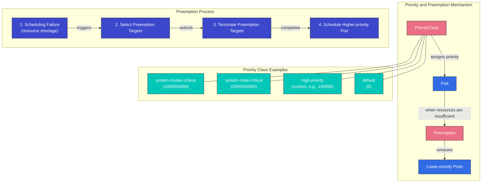

### PriorityClass

PriorityClass define la importancia relativa de los pods. Cuanto mayor sea el valor de priority, más importante es el pod.

```yaml
apiVersion: scheduling.k8s.io/v1
kind: PriorityClass
metadata:
  name: high-priority
value: 1000000
globalDefault: false
description: "This priority class should be used for critical workloads."
```

En el ejemplo anterior, el campo `value` indica el valor de priority. Cuanto mayor sea el valor, mayor será la priority. Si el campo `globalDefault` se establece en `true`, esta priority class se aplica a pods sin una priority class especificada.

### Applying PriorityClass to Pods

Para aplicar una priority class a un pod, usa el campo `priorityClassName`.

```yaml
apiVersion: v1
kind: Pod
metadata:
  name: high-priority-pod
spec:
  priorityClassName: high-priority
  containers:
  - name: container
    image: nginx
```

### Preemption

Preemption es el proceso de eliminar pods de menor prioridad para programar pods de mayor prioridad. Cuando el scheduler no puede encontrar un node donde programar un pod de mayor prioridad, preempta pods de menor prioridad para asegurar recursos.

Proceso de preemption:
1. El scheduler no puede encontrar un node donde programar un pod de mayor prioridad
2. El scheduler selecciona un node para eliminar pods de menor prioridad mediante preemption
3. Envía una señal de termination a los pods de menor prioridad en el node seleccionado
4. Cuando los pods terminan de forma graceful, programa el pod de mayor prioridad en ese node

### Preemption Considerations

Aspectos que debes considerar al usar preemption:

1. **Graceful Termination Period**: Los pods preempted pasan por el proceso de graceful termination durante el tiempo especificado en `terminationGracePeriodSeconds`
2. **PodDisruptionBudget**: Preemption no respeta PodDisruptionBudget
3. **System Priority Classes**: Kubernetes proporciona priority classes para componentes del sistema
   - `system-cluster-critical`: Pods críticos para la operación del cluster
   - `system-node-critical`: Pods críticos para la operación del node

## Pod Eviction

Pod eviction es el proceso de mover pods de forma segura cuando ocurren problemas en un node. Eviction puede ocurrir por varias razones.

```mermaid
graph TD
    subgraph "Eviction Types"
        ControllerEviction["kube-controller-manager<br>Eviction"]
        KubeletEviction["kubelet Eviction"]
        UserEviction["User Eviction"]
    end

    subgraph "Eviction Causes"
        NodeNotReady["Node NotReady"]
        NodeUnreachable["Node Unreachable"]
        ResourcePressure["Resource Shortage<br>(memory, disk, etc.)"]
        HardwareIssue["Hardware Issues"]
        Maintenance["Maintenance"]
    end

    subgraph "kubelet Eviction Signals"
        MemoryAvailable["memory.available"]
        NodefsAvailable["nodefs.available"]
        NodefsInodesFree["nodefs.inodesFree"]
        ImagefsAvailable["imagefs.available"]
        ImagefsInodesFree["imagefs.inodesFree"]
        PidAvailable["pid.available"]
    end

    ControllerEviction -->|cause| NodeNotReady
    ControllerEviction -->|cause| NodeUnreachable
    KubeletEviction -->|cause| ResourcePressure
    KubeletEviction -->|cause| HardwareIssue
    UserEviction -->|cause| Maintenance

    KubeletEviction -->|monitors| MemoryAvailable
    KubeletEviction -->|monitors| NodefsAvailable
    KubeletEviction -->|monitors| NodefsInodesFree
    KubeletEviction -->|monitors| ImagefsAvailable
    KubeletEviction -->|monitors| ImagefsInodesFree
    KubeletEviction -->|monitors| PidAvailable

    %% Style definitions
    classDef evictionType fill:#EB6E85,stroke:#333,stroke-width:1px,color:white;
    classDef evictionCause fill:#00C7B7,stroke:#333,stroke-width:1px,color:white;
    classDef evictionSignal fill:#3B48CC,stroke:#333,stroke-width:1px,color:white;

    %% Apply classes
    class ControllerEviction,KubeletEviction,UserEviction evictionType;
    class NodeNotReady,NodeUnreachable,ResourcePressure,HardwareIssue,Maintenance evictionCause;
    class MemoryAvailable,NodefsAvailable,NodefsInodesFree,ImagefsAvailable,ImagefsInodesFree,PidAvailable evictionSignal;
```

### Eviction Types

1. **Eviction by kube-controller-manager**:
   - Cuando un node permanece en estado NotReady durante el período `pod-eviction-timeout` (5 minutos de forma predeterminada)
   - Cuando un node está en estado Unreachable

2. **Eviction by kubelet**:
   - Escasez de recursos del node (memoria, disco, etc.)
   - Problemas de hardware

3. **Eviction by user**:
   - Ejecución del comando `kubectl drain`
   - Tareas de mantenimiento de node

### kubelet Eviction Signals

kubelet monitorea las siguientes señales de eviction:

1. **memory.available**: Memoria disponible
2. **nodefs.available**: Espacio disponible en el sistema de archivos del node
3. **nodefs.inodesFree**: Inodes disponibles en el sistema de archivos del node
4. **imagefs.available**: Espacio disponible en el sistema de archivos de imágenes
5. **imagefs.inodesFree**: Inodes disponibles en el sistema de archivos de imágenes
6. **pid.available**: IDs de proceso disponibles

Se pueden establecer umbrales soft y hard para cada señal:

- **Soft Threshold**: Evicta pods después de `grace-period` cuando se supera el umbral
- **Hard Threshold**: Evicta pods inmediatamente cuando se supera el umbral

```yaml
# kubelet configuration example
evictionHard:
  memory.available: "100Mi"
  nodefs.available: "10%"
  nodefs.inodesFree: "5%"
  imagefs.available: "15%"
evictionSoft:
  memory.available: "200Mi"
  nodefs.available: "15%"
evictionSoftGracePeriod:
  memory.available: "1m"
  nodefs.available: "2m"
evictionPressureTransitionPeriod: "30s"
```

### Eviction Priority

kubelet evicta pods en el siguiente orden:

1. Pods con clase QoS BestEffort
2. Pods con clase QoS Burstable (comenzando por pods cuyo uso de recursos supera los requests)
3. Pods con clase QoS Guaranteed (pods con requests y limits iguales)

## Pod Disruption Budget (PDB)

Pod Disruption Budget (PDB) es una forma de mantener la disponibilidad de la aplicación durante disruptions voluntarias. PDB limita la cantidad de pods que pueden ser disrupted simultáneamente.

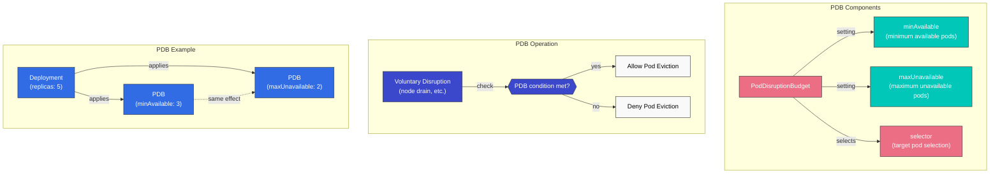

### PDB Definition

```yaml
apiVersion: policy/v1
kind: PodDisruptionBudget
metadata:
  name: frontend-pdb
spec:
  minAvailable: 2
  selector:
    matchLabels:
      app: frontend
```

o

```yaml
apiVersion: policy/v1
kind: PodDisruptionBudget
metadata:
  name: frontend-pdb
spec:
  maxUnavailable: 1
  selector:
    matchLabels:
      app: frontend
```

En los ejemplos anteriores:
- `minAvailable`: Número mínimo de pods que siempre deben estar disponibles
- `maxUnavailable`: Número máximo de pods que pueden no estar disponibles al mismo tiempo
- `selector`: Label selector que selecciona pods a los que se aplica el PDB

### PDB Operation

1. Cuando ocurren disruptions voluntarias como node drain, Kubernetes comprueba el PDB
2. Si se cumplen las condiciones del PDB, continúa con pod eviction
3. Si no se cumplen las condiciones del PDB, deniega pod eviction

### PDB Best Practices

1. **Set PDB for all critical workloads**: Configura PDB para todos los workloads que requieren alta disponibilidad
2. **Choose appropriate values**: Selecciona valores de `minAvailable` o `maxUnavailable` adecuados para las características del workload
3. **Consider replica count**: El valor de PDB debe ser menor que el recuento de réplicas
4. **Regular testing**: Prueba el funcionamiento del PDB mediante node drain y tareas similares

## Node Pressure Eviction

Node pressure eviction es un mecanismo en el que los pods se evictan debido a escasez de recursos del node.

### Node Condition Status

kubelet informa los siguientes estados de condición del node:

1. **MemoryPressure**: El node tiene poca memoria
2. **DiskPressure**: El node tiene poco espacio en disco
3. **PIDPressure**: El node tiene pocos process IDs

Cuando ocurren estas condiciones, kubelet evicta pods para asegurar recursos.

### Eviction Policy Configuration

Las eviction policies se pueden establecer en la configuración de kubelet:

```yaml
# kubelet configuration example
evictionHard:
  memory.available: "100Mi"
  nodefs.available: "10%"
  nodefs.inodesFree: "5%"
  imagefs.available: "15%"
evictionSoft:
  memory.available: "200Mi"
  nodefs.available: "15%"
evictionSoftGracePeriod:
  memory.available: "1m"
  nodefs.available: "2m"
evictionMinimumReclaim:
  memory.available: "50Mi"
  nodefs.available: "5%"
evictionPressureTransitionPeriod: "30s"
```

En el ejemplo anterior:
- `evictionMinimumReclaim`: Recursos mínimos que deben recuperarse después de eviction
- `evictionPressureTransitionPeriod`: Tiempo de espera entre transiciones de estado de pressure

## TopologySpreadConstraints

TopologySpreadConstraints proporciona control detallado sobre cómo se distribuyen los pods entre dominios de topology como availability zones, nodes o regions. Esta función ofrece más flexibilidad que Pod anti-affinity para lograr alta disponibilidad y utilización eficiente de recursos.

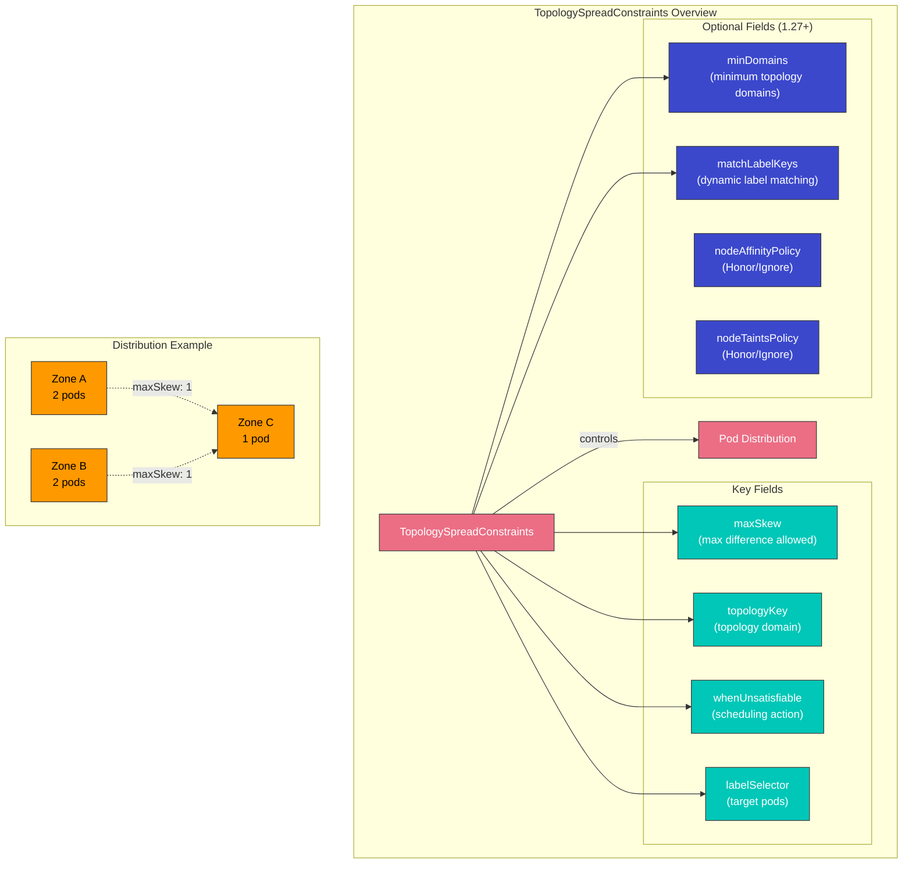

### Key Fields

| Field | Description | Required |
|-------|-------------|----------|
| **maxSkew** | Maximum allowed difference in pod count between any two topology domains | Yes |
| **topologyKey** | Node label key that defines topology domains | Yes |
| **whenUnsatisfiable** | Action when constraints cannot be satisfied: `DoNotSchedule` or `ScheduleAnyway` | Yes |
| **labelSelector** | Selects which pods to count for spread calculation | Yes |
| **minDomains** | Minimum number of topology domains required (1.27+) | No |
| **matchLabelKeys** | Pod label keys to match for spread calculation (1.27+) | No |

### whenUnsatisfiable Options

- **DoNotSchedule**: El scheduler no programará el pod si la constraint no puede satisfacerse (hard constraint)
- **ScheduleAnyway**: El scheduler sigue programando el pod, dando mayor prioridad a los nodes que minimizan el skew (soft constraint)

### EKS Availability Zone Spread Example

```yaml
apiVersion: apps/v1
kind: Deployment
metadata:
  name: web-app
spec:
  replicas: 6
  selector:
    matchLabels:
      app: web
  template:
    metadata:
      labels:
        app: web
    spec:
      topologySpreadConstraints:
      - maxSkew: 1
        topologyKey: topology.kubernetes.io/zone
        whenUnsatisfiable: DoNotSchedule
        labelSelector:
          matchLabels:
            app: web
      - maxSkew: 1
        topologyKey: kubernetes.io/hostname
        whenUnsatisfiable: ScheduleAnyway
        labelSelector:
          matchLabels:
            app: web
      containers:
      - name: web
        image: nginx:1.25
        resources:
          requests:
            cpu: 100m
            memory: 128Mi
```

Esta configuración garantiza que:
1. Los pods se distribuyan uniformemente entre availability zones (hard constraint)
2. Los pods se distribuyan preferentemente entre nodes dentro de cada zone (soft constraint)

### minDomains and matchLabelKeys (Kubernetes 1.27+)

```yaml
apiVersion: apps/v1
kind: Deployment
metadata:
  name: app-with-min-domains
spec:
  replicas: 4
  selector:
    matchLabels:
      app: distributed-app
  template:
    metadata:
      labels:
        app: distributed-app
        version: v1
    spec:
      topologySpreadConstraints:
      - maxSkew: 1
        topologyKey: topology.kubernetes.io/zone
        whenUnsatisfiable: DoNotSchedule
        labelSelector:
          matchLabels:
            app: distributed-app
        minDomains: 3
        matchLabelKeys:
        - version
      containers:
      - name: app
        image: myapp:v1
```

- **minDomains**: Garantiza que los pods se distribuyan entre al menos 3 zones. Si hay menos zones disponibles, el scheduling se bloquea.
- **matchLabelKeys**: Usa automáticamente el valor del label `version` del pod en el selector, lo que permite spread por revisión sin modificar el selector.

### Advantages Over Pod Anti-Affinity

| Aspect | TopologySpreadConstraints | Pod Anti-Affinity |
|--------|---------------------------|-------------------|
| **Flexibility** | Allows controlled skew (maxSkew > 1) | Binary: either same or different domain |
| **Soft constraints** | `ScheduleAnyway` for best-effort | `preferredDuringScheduling` but less control |
| **Multi-level** | Multiple constraints with different topologyKeys | Requires complex nested rules |
| **Performance** | Better scheduler performance at scale | Can slow scheduling with many pods |
| **Use case** | Even distribution with tolerance | Strict separation |

## Pod Deletion Cost

Pod Deletion Cost es una función que permite controlar qué pods se eliminan primero durante operaciones de scale-down. Al establecer la annotation `controller.kubernetes.io/pod-deletion-cost`, puedes influir en el orden en que se terminan los pods.

### How It Works

Cuando un controller (como HPA o scale-down manual) necesita reducir réplicas, considera:
1. Los pods con menor deletion cost se eliminan primero
2. El deletion cost predeterminado es 0
3. Rango válido: -2147483648 a 2147483647

### Basic Example

```yaml
apiVersion: v1
kind: Pod
metadata:
  name: worker-pod
  annotations:
    controller.kubernetes.io/pod-deletion-cost: "100"
spec:
  containers:
  - name: worker
    image: worker:latest
```

### HPA Scale-Down Priority Control

Usa deletion cost para proteger pods importantes durante el scale-down de HPA:

```yaml
apiVersion: apps/v1
kind: Deployment
metadata:
  name: web-service
spec:
  replicas: 5
  selector:
    matchLabels:
      app: web
  template:
    metadata:
      labels:
        app: web
      # Lower cost pods are deleted first during scale-down
      annotations:
        controller.kubernetes.io/pod-deletion-cost: "0"
    spec:
      containers:
      - name: web
        image: nginx:1.25
```

### Cache Protection Pattern

Protege pods con cachés calientes ajustando dinámicamente deletion cost:

```yaml
apiVersion: apps/v1
kind: Deployment
metadata:
  name: cache-service
spec:
  replicas: 3
  selector:
    matchLabels:
      app: cache
  template:
    metadata:
      labels:
        app: cache
    spec:
      containers:
      - name: cache
        image: redis:7
      - name: cost-updater
        image: bitnami/kubectl:latest
        command:
        - /bin/sh
        - -c
        - |
          # Update deletion cost based on cache warmth
          while true; do
            CACHE_SIZE=$(redis-cli DBSIZE | awk '{print $2}')
            # Higher cache size = higher cost = less likely to be deleted
            kubectl annotate pod $POD_NAME \
              controller.kubernetes.io/pod-deletion-cost="$CACHE_SIZE" \
              --overwrite
            sleep 60
          done
        env:
        - name: POD_NAME
          valueFrom:
            fieldRef:
              fieldPath: metadata.name
```

### Practical Use Cases

1. **Stateful workloads**: Protege pods con estado acumulado
2. **Leader election**: Mantén leader pods ejecutándose más tiempo
3. **Connection draining**: Da tiempo para conexiones de larga duración
4. **Cache warming**: Conserva pods con cachés calientes
5. **Batch processing**: Mantén pods que procesan trabajos grandes

## Descheduler

El Descheduler es un componente de Kubernetes que evicta pods de nodes para permitir que el scheduler los reprograme en nodes más apropiados. A diferencia del scheduler, que solo coloca pods nuevos, el descheduler ayuda a mantener una colocación óptima de pods a lo largo del tiempo.

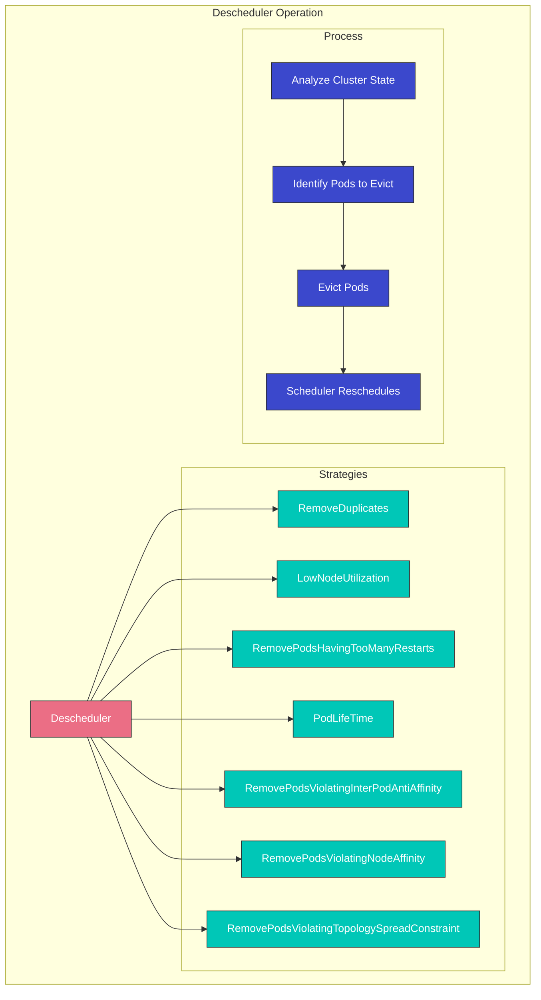

### Why Descheduling Is Needed

1. **Cluster changes**: Se agregan nuevos nodes, cambian los labels de nodes
2. **Pod drift**: La colocación inicial se vuelve subóptima con el tiempo
3. **Affinity violations**: Las reglas se infringen después de cambios en el cluster
4. **Resource imbalance**: Algunos nodes están sobreutilizados, otros subutilizados
5. **Failed pods**: Pods atascados en ciclos de restart

### Key Strategies

| Strategy | Description | Use Case |
|----------|-------------|----------|
| **RemoveDuplicates** | Removes duplicate pods from the same node | Ensure HA after node failures |
| **LowNodeUtilization** | Moves pods from overutilized to underutilized nodes | Balance cluster resources |
| **RemovePodsHavingTooManyRestarts** | Evicts pods with excessive restarts | Clean up problematic pods |
| **PodLifeTime** | Evicts pods older than specified age | Force fresh scheduling |
| **RemovePodsViolatingInterPodAntiAffinity** | Evicts pods violating anti-affinity rules | Restore affinity compliance |
| **RemovePodsViolatingNodeAffinity** | Evicts pods violating node affinity | Restore affinity compliance |
| **RemovePodsViolatingTopologySpreadConstraint** | Evicts pods violating spread constraints | Restore even distribution |

### Helm Installation

```bash
# Add the descheduler Helm repository
helm repo add descheduler https://kubernetes-sigs.github.io/descheduler/

# Install descheduler
helm install descheduler descheduler/descheduler \
  --namespace kube-system \
  --set schedule="*/5 * * * *" \
  --set deschedulerPolicy.strategies.RemoveDuplicates.enabled=true \
  --set deschedulerPolicy.strategies.LowNodeUtilization.enabled=true
```

### DeschedulerPolicy Configuration

```yaml
apiVersion: "descheduler/v1alpha2"
kind: "DeschedulerPolicy"
profiles:
- name: default
  pluginConfig:
  - name: RemoveDuplicates
    args:
      excludeOwnerKinds:
      - DaemonSet
  - name: LowNodeUtilization
    args:
      thresholds:
        cpu: 20
        memory: 20
        pods: 20
      targetThresholds:
        cpu: 50
        memory: 50
        pods: 50
      useDeviationThresholds: false
  - name: RemovePodsHavingTooManyRestarts
    args:
      podRestartThreshold: 10
      includingInitContainers: true
  - name: PodLifeTime
    args:
      maxPodLifeTimeSeconds: 86400  # 24 hours
      podStatusPhases:
      - Running
  - name: RemovePodsViolatingTopologySpreadConstraint
    args:
      constraints:
      - DoNotSchedule
  plugins:
    deschedule:
      enabled:
      - RemoveDuplicates
      - LowNodeUtilization
      - RemovePodsHavingTooManyRestarts
      - PodLifeTime
      - RemovePodsViolatingTopologySpreadConstraint
```

### PDB Respect

El descheduler respeta los Pod Disruption Budgets (PDBs). Si evictar un pod violaría un PDB, el descheduler no evictará ese pod:

```yaml
apiVersion: policy/v1
kind: PodDisruptionBudget
metadata:
  name: web-pdb
spec:
  minAvailable: 2
  selector:
    matchLabels:
      app: web
```

Con este PDB en vigor, el descheduler garantizará que al menos 2 pods con el label `app: web` permanezcan disponibles durante operaciones de descheduling.

### Descheduler CronJob Example

```yaml
apiVersion: batch/v1
kind: CronJob
metadata:
  name: descheduler
  namespace: kube-system
spec:
  schedule: "*/30 * * * *"
  jobTemplate:
    spec:
      template:
        spec:
          serviceAccountName: descheduler
          containers:
          - name: descheduler
            image: registry.k8s.io/descheduler/descheduler:v0.28.0
            args:
            - --policy-config-file=/policy/policy.yaml
            - --v=3
            volumeMounts:
            - name: policy
              mountPath: /policy
          volumes:
          - name: policy
            configMap:
              name: descheduler-policy
          restartPolicy: OnFailure
```

> **Deep Dive**: Para información detallada sobre custom schedulers, consulta:
> - [Custom Scheduler Part 1: Basic Concepts](../scheduling/01-custom-scheduler-part1.md)
> - [Custom Scheduler Part 2: Implementation](../scheduling/02-custom-scheduler-part2.md)
> - [Custom Scheduler Part 3: Advanced Features](../scheduling/03-custom-scheduler-part3.md)

## Scheduling Optimization in Amazon EKS

En Amazon EKS, puedes optimizar workloads usando funciones de scheduling de Kubernetes.

```mermaid
graph TD
    subgraph "EKS Scheduling Optimization"
        NodeGroups["Node Groups &<br>Instance Types"]
        AZSpread["Availability Zone Distribution"]
        Karpenter["Karpenter<br>Auto Scaling"]
        ResourceOpt["Resource Request &<br>Limit Optimization"]
    end

    subgraph "Node Group Strategies"
        ComputeOpt["Compute Optimized<br>Instances"]
        MemoryOpt["Memory Optimized<br>Instances"]
        SpotInst["Spot Instances"]
        GPUInst["GPU Instances"]
    end

    subgraph "Availability Strategies"
        PodAntiAffinity["Pod Anti-Affinity"]
        TopologySpread["Topology Spread<br>Constraints"]
        MultiAZ["Multi-AZ<br>Deployment"]
    end

    subgraph "Automation Tools"
        VPA["Vertical Pod<br>Autoscaler"]
        HPA["Horizontal Pod<br>Autoscaler"]
        CA["Cluster<br>Autoscaler"]
        KarpenterProv["Karpenter<br>Provisioner"]
    end

    NodeGroups -->|type| ComputeOpt
    NodeGroups -->|type| MemoryOpt
    NodeGroups -->|type| SpotInst
    NodeGroups -->|type| GPUInst

    AZSpread -->|method| PodAntiAffinity
    AZSpread -->|method| TopologySpread
    AZSpread -->|result| MultiAZ

    Karpenter -->|uses| KarpenterProv
    ResourceOpt -->|tool| VPA
    ResourceOpt -->|tool| HPA
    NodeGroups -->|tool| CA

    %% Style definitions
    classDef eksComponent fill:#FF9900,stroke:#333,stroke-width:1px,color:black;
    classDef strategyComponent fill:#EB6E85,stroke:#333,stroke-width:1px,color:white;
    classDef instanceType fill:#00C7B7,stroke:#333,stroke-width:1px,color:white;
    classDef availabilityStrategy fill:#326CE5,stroke:#333,stroke-width:1px,color:white;
    classDef autoTool fill:#3B48CC,stroke:#333,stroke-width:1px,color:white;

    %% Apply classes
    class NodeGroups,AZSpread,Karpenter,ResourceOpt eksComponent;
    class ComputeOpt,MemoryOpt,SpotInst,GPUInst strategyComponent;
    class PodAntiAffinity,TopologySpread,MultiAZ availabilityStrategy;
    class VPA,HPA,CA,KarpenterProv autoTool;
```

### Node Groups and Instance Types

En EKS, puedes proporcionar recursos adecuados para workloads utilizando varios node groups e instance types:

1. **Various Instance Types**: Compute optimized, memory optimized, storage optimized, etc.
2. **Spot Instances**: Spot instances para workloads rentables
3. **GPU Instances**: GPU instances para workloads de AI/ML

Puedes usar node labels y taints para colocar workloads específicos en node groups específicos:

```bash
# Set labels and taints when creating node group
eksctl create nodegroup \
  --cluster my-cluster \
  --name gpu-nodes \
  --node-labels="workload-type=gpu" \
  --node-type=p3.2xlarge \
  --taints="gpu=true:NoSchedule"
```

### Availability Zone Distribution

En EKS, puedes distribuir workloads entre múltiples availability zones usando pod anti-affinity y topology spread constraints:

```yaml
apiVersion: apps/v1
kind: Deployment
metadata:
  name: web-server
spec:
  replicas: 3
  selector:
    matchLabels:
      app: web
  template:
    metadata:
      labels:
        app: web
    spec:
      topologySpreadConstraints:
      - maxSkew: 1
        topologyKey: topology.kubernetes.io/zone
        whenUnsatisfiable: DoNotSchedule
        labelSelector:
          matchLabels:
            app: web
      containers:
      - name: web
        image: nginx
```

En el ejemplo anterior, `topologySpreadConstraints` distribuye los pods uniformemente entre múltiples availability zones.

### Auto Scaling with Karpenter

En Amazon EKS, puedes usar Karpenter para aprovisionar automáticamente nodes adecuados para workloads:

```yaml
apiVersion: karpenter.sh/v1
kind: NodePool
metadata:
  name: default
spec:
  template:
    spec:
      requirements:
        - key: karpenter.sh/capacity-type
          operator: In
          values: ["spot", "on-demand"]
        - key: kubernetes.io/arch
          operator: In
          values: ["amd64", "arm64"]
      nodeClassRef:
        name: default-class
  limits:
    cpu: 1000
    memory: 1000Gi
  disruption:
    consolidationPolicy: WhenEmpty
    consolidateAfter: 30s
---
apiVersion: karpenter.k8s.aws/v1
kind: EC2NodeClass
metadata:
  name: default-class
spec:
  subnetSelector:
    karpenter.sh/discovery: my-cluster
  securityGroupSelector:
    karpenter.sh/discovery: my-cluster
```

Karpenter optimiza los costos seleccionando el instance type óptimo para los requisitos de recursos del pod.

### Resource Request and Limit Optimization

Optimizar los resource requests y limits de workloads en EKS es importante:

1. **Vertical Pod Autoscaler (VPA)**: Optimiza resource requests basándose en el uso real de recursos del workload
2. **Goldilocks**: Visualiza recomendaciones de VPA para apoyar la optimización de resource requests
3. **Resource Quotas**: Limita el uso de recursos por namespace

```yaml
# VPA example
apiVersion: autoscaling.k8s.io/v1
kind: VerticalPodAutoscaler
metadata:
  name: frontend-vpa
spec:
  targetRef:
    apiVersion: apps/v1
    kind: Deployment
    name: frontend
  updatePolicy:
    updateMode: "Auto"
```

## Scheduling Best Practices

Mejores prácticas para optimizar scheduling en Kubernetes y EKS:

1. **Set appropriate resource requests and limits**:
   - Establece resource requests basándote en el uso real de recursos del workload
   - Establece resource limits adecuados para workloads importantes
   - Usa VPA para optimizar automáticamente resource requests

2. **Workload distribution**:
   - Usa pod anti-affinity para distribuir workloads importantes entre múltiples nodes
   - Usa topology spread constraints para distribuir workloads entre múltiples availability zones
   - Usa node affinity para colocar workloads específicos en nodes específicos

3. **Node resource optimization**:
   - Usa varios instance types para proporcionar recursos adecuados para workloads
   - Usa spot instances para optimización de costos
   - Usa Karpenter para aprovisionamiento automático de nodes adecuado para workloads

4. **PDB configuration**:
   - Configura PDB para workloads importantes
   - Selecciona valores de `minAvailable` o `maxUnavailable` adecuados para las características del workload
   - Prueba regularmente el funcionamiento de PDB

5. **Priority and preemption configuration**:
   - Configura priority classes altas para workloads importantes
   - Usa priority classes `system-cluster-critical` o `system-node-critical` para componentes del sistema
   - Comprende y prueba el impacto de preemption

6. **Node taints and tolerations**:
   - Configura nodes dedicados para workloads especializados
   - Aplica taints a nodes bajo mantenimiento
   - Configura tolerations adecuadas

## Conclusion

Los mecanismos de scheduling, preemption y eviction de Kubernetes desempeñan roles importantes para gestionar eficientemente los recursos del cluster y mantener la disponibilidad de workloads. Al comprender y utilizar estas funciones, puedes optimizar y operar workloads de forma confiable en clusters de Amazon EKS.

La optimización de scheduling es un proceso continuo, y se deben realizar ajustes de forma continua según las características del workload y el estado del cluster. Es importante realizar seguimiento del uso de recursos del cluster usando herramientas de monitoreo y ajustar las policies de scheduling según sea necesario.

## Quiz

Para comprobar lo que aprendiste en este capítulo, intenta el [Scheduling, Preemption, and Eviction Quiz](../quizzes/core/08-scheduling-preemption-eviction-quiz.md).
