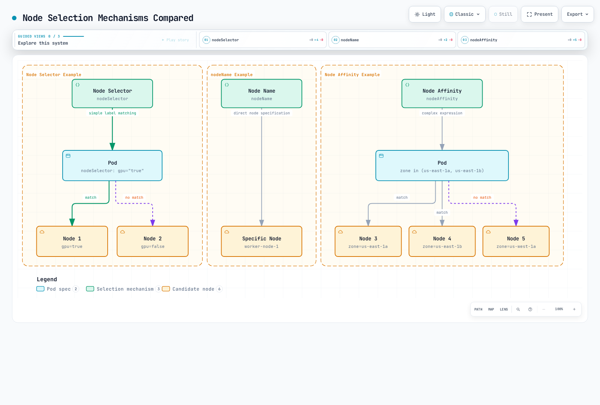
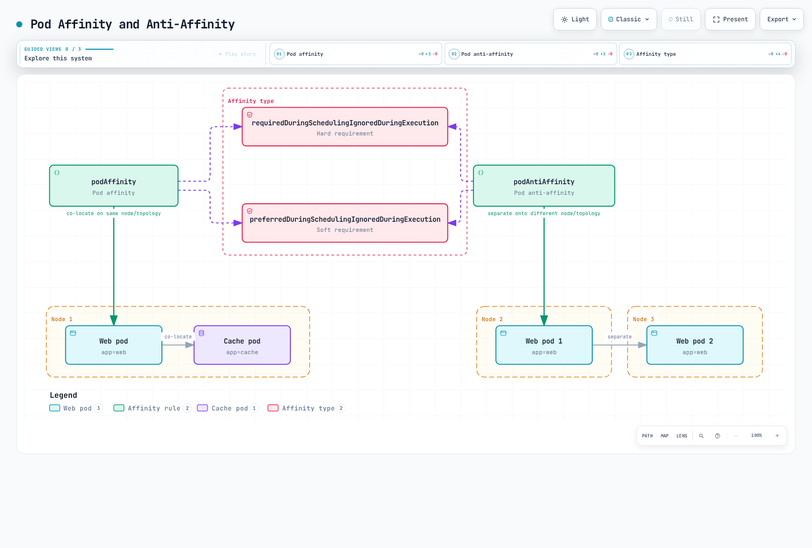

# Planificación, Preemption y Eviction de Kubernetes

> **Versiones compatibles**: Kubernetes 1.32 - 1.34
> **Última actualización**: February 22, 2026

En Kubernetes, scheduling (planificación) es el proceso de colocar Pods en nodes adecuados. Preemption es el proceso de eliminar Pods de menor prioridad para dejar espacio a Pods de mayor prioridad, y eviction es el proceso de mover Pods de forma segura cuando se producen problemas en los nodes. En este capítulo, aprenderemos sobre los mecanismos de scheduling de Kubernetes, la selección de nodes, preemption, eviction y los métodos de optimización de scheduling en Amazon EKS.

## Configuración del entorno de laboratorio

Para seguir los ejemplos de este documento, necesita las siguientes herramientas y entorno:

### Herramientas necesarias
- kubectl v1.34 o posterior
- Un clúster de Kubernetes funcional (EKS, minikube, kind, etc.)
- Un clúster con varios nodes (para pruebas de scheduling)

### Configuración del ejemplo de scheduling

```bash
# Create namespace
kubectl create namespace scheduling-demo

# Add labels to nodes (if you have multiple nodes)
kubectl label nodes <node-name> disktype=ssd
kubectl label nodes <node-name> gpu=true

# Create a pod using node affinity
kubectl -n scheduling-demo apply -f - <<EOF
apiVersion: v1
kind: Pod
metadata:
  name: nginx-ssd
spec:
  affinity:
    nodeAffinity:
      requiredDuringSchedulingIgnoredDuringExecution:
        nodeSelectorTerms:
        - matchExpressions:
          - key: disktype
            operator: In
            values:
            - ssd
  containers:
  - name: nginx
    image: nginx
EOF

# Create priority class
kubectl apply -f - <<EOF
apiVersion: scheduling.k8s.io/v1
kind: PriorityClass
metadata:
  name: high-priority
value: 1000000
globalDefault: false
description: "This priority class should be used for critical service pods only."
EOF

# Create Pod Disruption Budget (PDB)
kubectl -n scheduling-demo apply -f - <<EOF
apiVersion: policy/v1
kind: PodDisruptionBudget
metadata:
  name: nginx-pdb
spec:
  minAvailable: 1
  selector:
    matchLabels:
      app: nginx
EOF
```

## Arquitectura de scheduling de Kubernetes


[🔍 Ver diagrama interactivo](https://www.atomai.click/kubernetes-docs/archmaps/en-core-08-scheduling-preemption-eviction-0.html)

## Comparación de conceptos de scheduling

| Concepto | Propósito | Casos de uso | Versión de Kubernetes |
|---------|---------|-----------|-------------------|
| **Node Selector** | Colocar Pods en nodes con labels específicos | Selección simple de nodes | Todas las versiones |
| **Node Affinity** | Definir reglas complejas de selección de nodes | Selección avanzada de nodes | 1.6+ |
| **Pod Affinity** | Colocar Pods cerca de otros Pods | Ubicar conjuntamente Services relacionados | 1.6+ |
| **Pod Anti-Affinity** | Colocar Pods lejos de otros Pods | Garantizar alta disponibilidad | 1.6+ |
| **Taints and Tolerations** | Permitir solo Pods específicos en nodes | Nodes dedicados, aislamiento de nodes | 1.6+ |
| **Topology Spread Constraints** | Distribuir Pods entre dominios de topología | Distribución entre zonas de disponibilidad | 1.16+ (GA en 1.19) |
| **Priority and Preemption** | Priorizar workloads importantes | Garantías para Services críticos | 1.8+ (GA en 1.11) |
| **Pod Disruption Budget** | Limitar los Pods interrumpidos simultáneamente | Garantizar alta disponibilidad | 1.4+ (GA en 1.21) |

## Conceptos básicos de scheduling

> **Concepto clave**: El scheduler de Kubernetes es un componente del control plane que selecciona el node óptimo para ejecutar Pods y opera en dos fases: filtrado y puntuación.

### Proceso de scheduling

1. **Fase de filtrado (Predicates)**
   - Identifica un conjunto adecuado de nodes que pueden ejecutar el Pod
   - Considera requisitos de recursos, node selectors, reglas de affinity, taints/tolerations, etc.
   - Excluye un node si no se cumple alguna condición

2. **Fase de puntuación (Priorities)**
   - Asigna puntuaciones a los nodes que superaron el filtrado
   - Considera utilización de recursos, distribución de Pods, preferencias de affinity, etc.
   - Selecciona el node con la puntuación más alta

3. **Fase de binding**
   - Asigna el Pod al node seleccionado
   - Actualiza la información de binding en el servidor de API

## Tabla de contenido
1. [Descripción general de scheduling](#scheduling-overview)
2. [Cómo funciona el scheduler](#how-the-scheduler-works)
3. [Selección de nodes](#node-selection)
4. [Pod Affinity y Anti-Affinity](#pod-affinity-and-anti-affinity)
5. [Taints and Tolerations](#taints-and-tolerations)
6. [Node Affinity](#node-affinity)
7. [Prioridad y Preemption de Pods](#pod-priority-and-preemption)
8. [Pod Eviction](#pod-eviction)
9. [Pod Disruption Budget (PDB)](#pod-disruption-budget-pdb)
10. [Node Pressure Eviction](#node-pressure-eviction)
11. [TopologySpreadConstraints](#topologyspreadconstraints)
12. [Pod Deletion Cost](#pod-deletion-cost)
13. [Descheduler](#descheduler)
14. [Optimización de scheduling en Amazon EKS](#scheduling-optimization-in-amazon-eks)
15. [Prácticas recomendadas de scheduling](#scheduling-best-practices)
16. [Conclusión](#conclusion)

## Descripción general de scheduling

El scheduler de Kubernetes es un componente del control plane que coloca Pods en nodes adecuados. El scheduler considera varios factores para determinar el node óptimo donde colocar los Pods:

1. **Requisitos de recursos**: CPU, memoria y otros recursos solicitados por el Pod
2. **Restricciones de hardware/software/políticas**: Node selectors, node affinity, taints, etc.
3. **Especificaciones de affinity/anti-affinity**: Relaciones de colocación con otros Pods
4. **Localidad de los datos**: Colocar Pods cerca de los datos
5. **Interferencia entre workloads**: Minimizar la interferencia entre distintos workloads
6. **Fechas límite**: Considerar workloads con restricciones temporales

### Proceso de scheduling

El proceso de scheduling se divide, en términos generales, en dos fases:

1. **Filtrado**: Identifica un conjunto de nodes que pueden ejecutar el Pod
   - Comprueba si se cumplen los requisitos de recursos
   - Comprueba restricciones como node selectors, affinity y taints

2. **Puntuación**: Puntúa los nodes filtrados para seleccionar el node óptimo
   - Equilibrio de utilización de recursos
   - Affinity/anti-affinity entre Pods
   - Localidad de los datos
   - Taints/tolerations

## Cómo funciona el scheduler

El scheduler de Kubernetes opera mediante el siguiente proceso:


[🔍 Ver diagrama interactivo](https://www.atomai.click/kubernetes-docs/archmaps/en-core-08-scheduling-preemption-eviction-1.html)

1. **Observación de la cola de Pods**: El scheduler observa el servidor de API en busca de Pods sin programar.
2. **Filtrado de nodes**: Identifica un conjunto de nodes que pueden ejecutar el Pod.
3. **Puntuación de nodes**: Puntúa los nodes filtrados.
4. **Selección de node**: Selecciona el node con la puntuación más alta.
5. **Binding**: Vincula el Pod al node seleccionado.

### Plugins de scheduling

El scheduler de Kubernetes está diseñado para ser extensible mediante una arquitectura de plugins. Varios plugins operan en distintas etapas del proceso de scheduling:

1. **Plugins de filtrado**: Excluyen los nodes donde el Pod no puede ejecutarse
   - NodeResourcesFit: Comprueba la capacidad de recursos del node
   - NodeName: Comprueba el campo nodeName del Pod
   - NodeUnschedulable: Comprueba la capacidad de scheduling del node
   - TaintToleration: Comprueba taints y tolerations

2. **Plugins de puntuación**: Asignan puntuaciones a los nodes
   - NodeResourcesBalancedAllocation: Considera el equilibrio de uso de recursos
   - ImageLocality: Considera la localidad de las imágenes
   - InterPodAffinity: Considera la affinity entre Pods
   - NodeAffinity: Considera la node affinity

### Varios schedulers

Kubernetes puede ejecutar varios schedulers simultáneamente. Esto permite implementar lógica de scheduling personalizada para workloads específicos.

```yaml
apiVersion: v1
kind: Pod
metadata:
  name: custom-scheduled-pod
spec:
  schedulerName: my-custom-scheduler
  containers:
  - name: container
    image: nginx
```

En el ejemplo anterior, el campo `schedulerName` especifica el scheduler que programará el Pod.

## Selección de nodes

Kubernetes proporciona varios mecanismos para colocar Pods en nodes específicos.



[🔍 Ver diagrama interactivo](https://www.atomai.click/kubernetes-docs/archmaps/en-core-08-scheduling-preemption-eviction-2.html)

### Node Selector

Node selector es la forma más sencilla de restringir los Pods para que solo se coloquen en nodes con labels específicos.

```yaml
apiVersion: v1
kind: Pod
metadata:
  name: gpu-pod
spec:
  nodeSelector:
    gpu: "true"
  containers:
  - name: gpu-container
    image: nvidia/cuda
```

En el ejemplo anterior, el Pod solo se coloca en nodes con el label `gpu=true`.

### nodeName

Puede usar el campo `nodeName` para colocar directamente un Pod en un node específico. Este método omite el scheduler y, por lo general, no se recomienda.

```yaml
apiVersion: v1
kind: Pod
metadata:
  name: specific-node-pod
spec:
  nodeName: worker-node-1
  containers:
  - name: container
    image: nginx
```

En el ejemplo anterior, el Pod se coloca directamente en el node llamado `worker-node-1`.

## Pod Affinity y Anti-Affinity

Pod affinity y anti-affinity proporcionan formas de colocar Pods según las relaciones entre ellos.



[🔍 Ver diagrama interactivo](https://www.atomai.click/kubernetes-docs/archmaps/en-core-08-scheduling-preemption-eviction-3.html)

### Pod Affinity

Pod affinity hace que los Pods se coloquen en el mismo node o dominio de topología que los Pods con labels específicos.

```yaml
apiVersion: v1
kind: Pod
metadata:
  name: frontend
spec:
  affinity:
    podAffinity:
      requiredDuringSchedulingIgnoredDuringExecution:
      - labelSelector:
          matchExpressions:
          - key: app
            operator: In
            values:
            - cache
        topologyKey: kubernetes.io/hostname
  containers:
  - name: frontend
    image: nginx
```

En el ejemplo anterior, el Pod `frontend` se coloca en el mismo host que los Pods con el label `app=cache`.

### Pod Anti-Affinity

Pod anti-affinity hace que los Pods se coloquen en un node o dominio de topología diferente de los Pods con labels específicos.

```yaml
apiVersion: v1
kind: Pod
metadata:
  name: frontend
  labels:
    app: frontend
spec:
  affinity:
    podAntiAffinity:
      requiredDuringSchedulingIgnoredDuringExecution:
      - labelSelector:
          matchExpressions:
          - key: app
            operator: In
            values:
            - frontend
        topologyKey: kubernetes.io/hostname
  containers:
  - name: frontend
    image: nginx
```

En el ejemplo anterior, el Pod `frontend` se coloca en un host diferente de otros Pods con el label `app=frontend`. Esto es útil para distribuir instancias de la misma aplicación entre varios nodes para lograr alta disponibilidad.

### Tipos de affinity

Pod affinity y anti-affinity tienen dos tipos:

1. **requiredDuringSchedulingIgnoredDuringExecution**: Requisito estricto que debe cumplirse durante el scheduling
2. **preferredDuringSchedulingIgnoredDuringExecution**: Requisito flexible que se prefiere, pero no es obligatorio

```yaml
# preferredDuringSchedulingIgnoredDuringExecution example
affinity:
  podAffinity:
    preferredDuringSchedulingIgnoredDuringExecution:
    - weight: 100
      podAffinityTerm:
        labelSelector:
          matchExpressions:
          - key: app
            operator: In
            values:
            - cache
        topologyKey: kubernetes.io/hostname
```

En el ejemplo anterior, el campo `weight` indica el peso de esta preferencia. Cuando hay varias preferencias, las que tienen mayor peso se consideran más importantes.

## Taints and Tolerations

Taints y tolerations son mecanismos que permiten a los nodes rechazar Pods específicos.


[🔍 Ver diagrama interactivo](https://www.atomai.click/kubernetes-docs/archmaps/en-core-08-scheduling-preemption-eviction-4.html)

### Taints

Los taints se aplican a los nodes para restringir que los Pods se programen en ellos.

```bash
# Add taint to node
kubectl taint nodes node1 key=value:NoSchedule
```

Hay tres efectos de taint:

1. **NoSchedule**: Los Pods sin tolerations no se programan en el node
2. **PreferNoSchedule**: Se prefiere no programar Pods sin tolerations en el node
3. **NoExecute**: Los Pods sin tolerations se expulsan del node

### Tolerations

Las tolerations se aplican a los Pods para permitir que se programen en nodes con taints.

```yaml
apiVersion: v1
kind: Pod
metadata:
  name: nginx
spec:
  tolerations:
  - key: "key"
    operator: "Equal"
    value: "value"
    effect: "NoSchedule"
  containers:
  - name: nginx
    image: nginx
```

En el ejemplo anterior, el Pod puede programarse en nodes con el taint `key=value:NoSchedule`.

### Casos de uso

Casos de uso comunes de taints y tolerations:

1. **Nodes dedicados**: Designar nodes para ejecutar solo workloads específicos
2. **Hardware especial**: Gestionar nodes con hardware especial, como GPU
3. **Mantenimiento de nodes**: Evitar el scheduling de nuevos Pods en nodes en mantenimiento
4. **Problemas de nodes**: Expulsar Pods de nodes con problemas

### Taints predeterminados

Kubernetes aplica taints predeterminados a algunos nodes:

- **node.kubernetes.io/not-ready**: El node no está listo
- **node.kubernetes.io/unreachable**: No se puede acceder al node
- **node.kubernetes.io/memory-pressure**: El node tiene presión de memoria
- **node.kubernetes.io/disk-pressure**: El node tiene presión de disco
- **node.kubernetes.io/pid-pressure**: El node tiene presión de PID
- **node.kubernetes.io/network-unavailable**: La red del node no está disponible
- **node.kubernetes.io/unschedulable**: El node no se puede programar

## Node Affinity

Node affinity proporciona una forma más expresiva de colocar Pods en conjuntos específicos de nodes. Permite especificar condiciones más complejas que node selector.

### Tipos de Node Affinity

Node affinity tiene dos tipos:

1. **requiredDuringSchedulingIgnoredDuringExecution**: Requisito estricto que debe cumplirse durante el scheduling
2. **preferredDuringSchedulingIgnoredDuringExecution**: Requisito flexible que se prefiere, pero no es obligatorio

```yaml
apiVersion: v1
kind: Pod
metadata:
  name: with-node-affinity
spec:
  affinity:
    nodeAffinity:
      requiredDuringSchedulingIgnoredDuringExecution:
        nodeSelectorTerms:
        - matchExpressions:
          - key: kubernetes.io/e2e-az-name
            operator: In
            values:
            - e2e-az1
            - e2e-az2
      preferredDuringSchedulingIgnoredDuringExecution:
      - weight: 1
        preference:
          matchExpressions:
          - key: another-node-label-key
            operator: In
            values:
            - another-node-label-value
  containers:
  - name: with-node-affinity
    image: nginx
```

En el ejemplo anterior, el Pod solo se coloca en nodes cuyo label `kubernetes.io/e2e-az-name` es `e2e-az1` o `e2e-az2`. Además, se coloca preferiblemente en nodes con el label `another-node-label-key=another-node-label-value`.

### Operadores

Node affinity admite varios operadores:

- **In**: El valor del label coincide con uno de los valores especificados
- **NotIn**: El valor del label no coincide con los valores especificados
- **Exists**: Existe un label con la clave especificada
- **DoesNotExist**: No existe un label con la clave especificada
- **Gt**: El valor del label es mayor que el valor especificado
- **Lt**: El valor del label es menor que el valor especificado

## Prioridad y Preemption de Pods

Kubernetes proporciona funciones de prioridad y preemption de Pods para garantizar que los workloads importantes puedan obtener recursos del clúster.


[🔍 Ver diagrama interactivo](https://www.atomai.click/kubernetes-docs/archmaps/en-core-08-scheduling-preemption-eviction-5.html)

### PriorityClass

PriorityClass define la importancia relativa de los Pods. Cuanto mayor sea el valor de prioridad, más importante será el Pod.

```yaml
apiVersion: scheduling.k8s.io/v1
kind: PriorityClass
metadata:
  name: high-priority
value: 1000000
globalDefault: false
description: "This priority class should be used for critical workloads."
```

En el ejemplo anterior, el campo `value` indica el valor de prioridad. Cuanto mayor sea el valor, mayor será la prioridad. Si el campo `globalDefault` se establece en `true`, esta PriorityClass se aplica a los Pods sin una clase de prioridad especificada.

### Aplicación de PriorityClass a Pods

Para aplicar una clase de prioridad a un Pod, use el campo `priorityClassName`.

```yaml
apiVersion: v1
kind: Pod
metadata:
  name: high-priority-pod
spec:
  priorityClassName: high-priority
  containers:
  - name: container
    image: nginx
```

### Preemption

Preemption es el proceso de eliminar Pods de menor prioridad para programar Pods de mayor prioridad. Cuando el scheduler no puede encontrar un node donde programar un Pod de mayor prioridad, realiza preemption de Pods de menor prioridad para obtener recursos.

Proceso de preemption:
1. El scheduler no puede encontrar un node donde programar un Pod de mayor prioridad
2. El scheduler selecciona un node del que eliminará Pods de menor prioridad mediante preemption
3. Envía una señal de terminación a los Pods de menor prioridad en el node seleccionado
4. Cuando los Pods terminan correctamente, programa el Pod de mayor prioridad en ese node

### Consideraciones sobre preemption

Aspectos que deben considerarse al usar preemption:

1. **Período de terminación correcta**: Los Pods sujetos a preemption pasan por el proceso de terminación correcta durante el tiempo especificado en `terminationGracePeriodSeconds`
2. **PodDisruptionBudget**: Preemption no respeta PodDisruptionBudget
3. **Clases de prioridad del sistema**: Kubernetes proporciona clases de prioridad para componentes del sistema
   - `system-cluster-critical`: Pods críticos para el funcionamiento del clúster
   - `system-node-critical`: Pods críticos para el funcionamiento del node

## Pod Eviction

Pod eviction es el proceso de mover Pods de forma segura cuando se producen problemas en los nodes. La eviction puede producirse por diversos motivos.


[🔍 Ver diagrama interactivo](https://www.atomai.click/kubernetes-docs/archmaps/en-core-08-scheduling-preemption-eviction-6.html)

### Tipos de eviction

1. **Eviction por kube-controller-manager**:
   - Cuando un node permanece en estado NotReady durante el período `pod-eviction-timeout` (5 minutos de forma predeterminada)
   - Cuando un node está en estado Unreachable

2. **Eviction por kubelet**:
   - Escasez de recursos del node (memoria, disco, etc.)
   - Problemas de hardware

3. **Eviction por el usuario**:
   - Ejecución del comando `kubectl drain`
   - Tareas de mantenimiento de nodes

### Señales de eviction de kubelet

kubelet supervisa las siguientes señales de eviction:

1. **memory.available**: Memoria disponible
2. **nodefs.available**: Espacio disponible en el sistema de archivos del node
3. **nodefs.inodesFree**: Inodes disponibles en el sistema de archivos del node
4. **imagefs.available**: Espacio disponible en el sistema de archivos de imágenes
5. **imagefs.inodesFree**: Inodes disponibles en el sistema de archivos de imágenes
6. **pid.available**: IDs de proceso disponibles

Se pueden establecer umbrales flexibles y estrictos para cada señal:

- **Umbral flexible**: Expulsa Pods después de `grace-period` cuando se supera el umbral
- **Umbral estricto**: Expulsa Pods inmediatamente cuando se supera el umbral

```yaml
# kubelet configuration example
evictionHard:
  memory.available: "100Mi"
  nodefs.available: "10%"
  nodefs.inodesFree: "5%"
  imagefs.available: "15%"
evictionSoft:
  memory.available: "200Mi"
  nodefs.available: "15%"
evictionSoftGracePeriod:
  memory.available: "1m"
  nodefs.available: "2m"
evictionPressureTransitionPeriod: "30s"
```

### Prioridad de eviction

kubelet expulsa Pods en el siguiente orden:

1. Pods con clase QoS BestEffort
2. Pods con clase QoS Burstable (comenzando por los Pods cuyo uso de recursos excede las solicitudes)
3. Pods con clase QoS Guaranteed (Pods con solicitudes y límites iguales)

## Pod Disruption Budget (PDB)

Pod Disruption Budget (PDB) es una forma de mantener la disponibilidad de las aplicaciones durante interrupciones voluntarias. PDB limita la cantidad de Pods que pueden interrumpirse simultáneamente.


[🔍 Ver diagrama interactivo](https://www.atomai.click/kubernetes-docs/archmaps/en-core-08-scheduling-preemption-eviction-7.html)

### Definición de PDB

```yaml
apiVersion: policy/v1
kind: PodDisruptionBudget
metadata:
  name: frontend-pdb
spec:
  minAvailable: 2
  selector:
    matchLabels:
      app: frontend
```

o

```yaml
apiVersion: policy/v1
kind: PodDisruptionBudget
metadata:
  name: frontend-pdb
spec:
  maxUnavailable: 1
  selector:
    matchLabels:
      app: frontend
```

En los ejemplos anteriores:
- `minAvailable`: Número mínimo de Pods que siempre debe estar disponible
- `maxUnavailable`: Número máximo de Pods que pueden no estar disponibles al mismo tiempo
- `selector`: Selector de labels que selecciona los Pods a los que se aplica el PDB

### Operación de PDB

1. Cuando se producen interrupciones voluntarias como el drain de un node, Kubernetes comprueba el PDB
2. Si se cumplen las condiciones del PDB, se procede con la eviction del Pod
3. Si no se cumplen las condiciones del PDB, se deniega la eviction del Pod

### Prácticas recomendadas de PDB

1. **Establezca PDB para todos los workloads críticos**: Establezca PDB para todos los workloads que requieran alta disponibilidad
2. **Elija valores adecuados**: Seleccione valores de `minAvailable` o `maxUnavailable` adecuados para las características del workload
3. **Considere el número de réplicas**: El valor del PDB debe ser menor que el número de réplicas
4. **Pruebas periódicas**: Pruebe la operación de PDB mediante el drain de nodes y tareas similares

## Node Pressure Eviction

Node pressure eviction es un mecanismo mediante el cual los Pods se expulsan debido a la escasez de recursos del node.

### Estado de condiciones del node

kubelet informa los siguientes estados de condiciones del node:

1. **MemoryPressure**: El node tiene poca memoria
2. **DiskPressure**: El node tiene poco espacio en disco
3. **PIDPressure**: El node tiene pocos IDs de proceso

Cuando se producen estas condiciones, kubelet expulsa Pods para obtener recursos.

### Configuración de la política de eviction

Las políticas de eviction se pueden establecer en la configuración de kubelet:

```yaml
# kubelet configuration example
evictionHard:
  memory.available: "100Mi"
  nodefs.available: "10%"
  nodefs.inodesFree: "5%"
  imagefs.available: "15%"
evictionSoft:
  memory.available: "200Mi"
  nodefs.available: "15%"
evictionSoftGracePeriod:
  memory.available: "1m"
  nodefs.available: "2m"
evictionMinimumReclaim:
  memory.available: "50Mi"
  nodefs.available: "5%"
evictionPressureTransitionPeriod: "30s"
```

En el ejemplo anterior:
- `evictionMinimumReclaim`: Recursos mínimos que deben recuperarse después de la eviction
- `evictionPressureTransitionPeriod`: Tiempo de espera entre transiciones de estado de presión

## TopologySpreadConstraints

TopologySpreadConstraints proporciona un control detallado sobre cómo se distribuyen los Pods entre dominios de topología, como zonas de disponibilidad, nodes o regiones. Esta función ofrece más flexibilidad que Pod anti-affinity para lograr alta disponibilidad y una utilización eficiente de los recursos.


[🔍 Ver diagrama interactivo](https://www.atomai.click/kubernetes-docs/archmaps/en-core-08-scheduling-preemption-eviction-8.html)

### Campos clave

| Campo | Descripción | Obligatorio |
|-------|-------------|----------|
| **maxSkew** | Diferencia máxima permitida en el número de Pods entre dos dominios de topología cualesquiera | Sí |
| **topologyKey** | Clave de label de node que define los dominios de topología | Sí |
| **whenUnsatisfiable** | Acción cuando no se pueden satisfacer las restricciones: `DoNotSchedule` o `ScheduleAnyway` | Sí |
| **labelSelector** | Selecciona qué Pods se contarán para el cálculo de distribución | Sí |
| **minDomains** | Número mínimo de dominios de topología necesarios (1.27+) | No |
| **matchLabelKeys** | Claves de labels de Pod que deben coincidir para el cálculo de distribución (1.27+) | No |

### Opciones de whenUnsatisfiable

- **DoNotSchedule**: El scheduler no programará el Pod si no se puede satisfacer la restricción (restricción estricta)
- **ScheduleAnyway**: El scheduler aún programa el Pod y da mayor prioridad a los nodes que minimizan la desviación (restricción flexible)

### Ejemplo de distribución entre zonas de disponibilidad de EKS

```yaml
apiVersion: apps/v1
kind: Deployment
metadata:
  name: web-app
spec:
  replicas: 6
  selector:
    matchLabels:
      app: web
  template:
    metadata:
      labels:
        app: web
    spec:
      topologySpreadConstraints:
      - maxSkew: 1
        topologyKey: topology.kubernetes.io/zone
        whenUnsatisfiable: DoNotSchedule
        labelSelector:
          matchLabels:
            app: web
      - maxSkew: 1
        topologyKey: kubernetes.io/hostname
        whenUnsatisfiable: ScheduleAnyway
        labelSelector:
          matchLabels:
            app: web
      containers:
      - name: web
        image: nginx:1.25
        resources:
          requests:
            cpu: 100m
            memory: 128Mi
```

Esta configuración garantiza:
1. Los Pods se distribuyen uniformemente entre las zonas de disponibilidad (restricción estricta)
2. Los Pods se distribuyen preferiblemente entre los nodes de cada zona (restricción flexible)

### minDomains y matchLabelKeys (Kubernetes 1.27+)

```yaml
apiVersion: apps/v1
kind: Deployment
metadata:
  name: app-with-min-domains
spec:
  replicas: 4
  selector:
    matchLabels:
      app: distributed-app
  template:
    metadata:
      labels:
        app: distributed-app
        version: v1
    spec:
      topologySpreadConstraints:
      - maxSkew: 1
        topologyKey: topology.kubernetes.io/zone
        whenUnsatisfiable: DoNotSchedule
        labelSelector:
          matchLabels:
            app: distributed-app
        minDomains: 3
        matchLabelKeys:
        - version
      containers:
      - name: app
        image: myapp:v1
```

- **minDomains**: Garantiza que los Pods se distribuyan entre al menos 3 zonas. Si hay menos zonas disponibles, se bloquea el scheduling.
- **matchLabelKeys**: Usa automáticamente el valor del label `version` del Pod en el selector, lo que permite una distribución por revisión sin modificar el selector.

### Ventajas sobre Pod Anti-Affinity

| Aspecto | TopologySpreadConstraints | Pod Anti-Affinity |
|--------|---------------------------|-------------------|
| **Flexibilidad** | Permite una desviación controlada (maxSkew > 1) | Binario: dominio igual o diferente |
| **Restricciones flexibles** | `ScheduleAnyway` para el mejor esfuerzo | `preferredDuringScheduling`, pero con menos control |
| **Varios niveles** | Varias restricciones con topologyKeys diferentes | Requiere reglas anidadas complejas |
| **Rendimiento** | Mejor rendimiento del scheduler a escala | Puede ralentizar el scheduling con muchos Pods |
| **Caso de uso** | Distribución uniforme con tolerancia | Separación estricta |

## Pod Deletion Cost

Pod Deletion Cost es una función que permite controlar qué Pods se eliminan primero durante operaciones de scale-down. Al establecer la anotación `controller.kubernetes.io/pod-deletion-cost`, puede influir en el orden en que se terminan los Pods.

### Cómo funciona

Cuando un controlador (como HPA o un scale-down manual) necesita reducir las réplicas, considera lo siguiente:
1. Los Pods con menor coste de eliminación se eliminan primero
2. El coste de eliminación predeterminado es 0
3. Intervalo válido: -2147483648 a 2147483647

### Ejemplo básico

```yaml
apiVersion: v1
kind: Pod
metadata:
  name: worker-pod
  annotations:
    controller.kubernetes.io/pod-deletion-cost: "100"
spec:
  containers:
  - name: worker
    image: worker:latest
```

### Control de prioridad de scale-down de HPA

Use el coste de eliminación para proteger Pods importantes durante el scale-down de HPA:

```yaml
apiVersion: apps/v1
kind: Deployment
metadata:
  name: web-service
spec:
  replicas: 5
  selector:
    matchLabels:
      app: web
  template:
    metadata:
      labels:
        app: web
      # Lower cost pods are deleted first during scale-down
      annotations:
        controller.kubernetes.io/pod-deletion-cost: "0"
    spec:
      containers:
      - name: web
        image: nginx:1.25
```

### Patrón de protección de caché

Proteja Pods con cachés activas ajustando dinámicamente el coste de eliminación:

```yaml
apiVersion: apps/v1
kind: Deployment
metadata:
  name: cache-service
spec:
  replicas: 3
  selector:
    matchLabels:
      app: cache
  template:
    metadata:
      labels:
        app: cache
    spec:
      containers:
      - name: cache
        image: redis:7
      - name: cost-updater
        image: bitnami/kubectl:latest
        command:
        - /bin/sh
        - -c
        - |
          # Update deletion cost based on cache warmth
          while true; do
            CACHE_SIZE=$(redis-cli DBSIZE | awk '{print $2}')
            # Higher cache size = higher cost = less likely to be deleted
            kubectl annotate pod $POD_NAME \
              controller.kubernetes.io/pod-deletion-cost="$CACHE_SIZE" \
              --overwrite
            sleep 60
          done
        env:
        - name: POD_NAME
          valueFrom:
            fieldRef:
              fieldPath: metadata.name
```

### Casos de uso prácticos

1. **Workloads con estado**: Proteger Pods con estado acumulado
2. **Elección de líder**: Mantener los Pods líderes ejecutándose durante más tiempo
3. **Drenaje de conexiones**: Dar tiempo a las conexiones de larga duración
4. **Calentamiento de caché**: Conservar Pods con cachés activas
5. **Procesamiento por lotes**: Mantener Pods que procesan trabajos grandes

## Descheduler

El Descheduler es un componente de Kubernetes que expulsa Pods de los nodes para permitir que el scheduler los reprograme en nodes más adecuados. A diferencia del scheduler, que solo coloca Pods nuevos, el descheduler ayuda a mantener una colocación óptima de Pods con el tiempo.


[🔍 Ver diagrama interactivo](https://www.atomai.click/kubernetes-docs/archmaps/en-core-08-scheduling-preemption-eviction-9.html)

### Por qué se necesita descheduling

1. **Cambios en el clúster**: Se agregan nuevos nodes o cambian los labels de los nodes
2. **Deriva de Pods**: La colocación inicial se vuelve subóptima con el tiempo
3. **Infracciones de affinity**: Se infringen reglas después de cambios en el clúster
4. **Desequilibrio de recursos**: Algunos nodes están sobreutilizados y otros infrautilizados
5. **Pods con errores**: Pods atascados en bucles de reinicio

### Estrategias clave

| Estrategia | Descripción | Caso de uso |
|----------|-------------|----------|
| **RemoveDuplicates** | Elimina Pods duplicados del mismo node | Garantizar HA después de fallos de nodes |
| **LowNodeUtilization** | Mueve Pods de nodes sobreutilizados a nodes infrautilizados | Equilibrar los recursos del clúster |
| **RemovePodsHavingTooManyRestarts** | Expulsa Pods con reinicios excesivos | Limpiar Pods problemáticos |
| **PodLifeTime** | Expulsa Pods más antiguos que la edad especificada | Forzar un scheduling nuevo |
| **RemovePodsViolatingInterPodAntiAffinity** | Expulsa Pods que infringen reglas de anti-affinity | Restaurar la conformidad con affinity |
| **RemovePodsViolatingNodeAffinity** | Expulsa Pods que infringen node affinity | Restaurar la conformidad con affinity |
| **RemovePodsViolatingTopologySpreadConstraint** | Expulsa Pods que infringen restricciones de distribución | Restaurar una distribución uniforme |

### Instalación con Helm

```bash
# Add the descheduler Helm repository
helm repo add descheduler https://kubernetes-sigs.github.io/descheduler/

# Install descheduler
helm install descheduler descheduler/descheduler \
  --namespace kube-system \
  --set schedule="*/5 * * * *" \
  --set deschedulerPolicy.strategies.RemoveDuplicates.enabled=true \
  --set deschedulerPolicy.strategies.LowNodeUtilization.enabled=true
```

### Configuración de DeschedulerPolicy

```yaml
apiVersion: "descheduler/v1alpha2"
kind: "DeschedulerPolicy"
profiles:
- name: default
  pluginConfig:
  - name: RemoveDuplicates
    args:
      excludeOwnerKinds:
      - DaemonSet
  - name: LowNodeUtilization
    args:
      thresholds:
        cpu: 20
        memory: 20
        pods: 20
      targetThresholds:
        cpu: 50
        memory: 50
        pods: 50
      useDeviationThresholds: false
  - name: RemovePodsHavingTooManyRestarts
    args:
      podRestartThreshold: 10
      includingInitContainers: true
  - name: PodLifeTime
    args:
      maxPodLifeTimeSeconds: 86400  # 24 hours
      podStatusPhases:
      - Running
  - name: RemovePodsViolatingTopologySpreadConstraint
    args:
      constraints:
      - DoNotSchedule
  plugins:
    deschedule:
      enabled:
      - RemoveDuplicates
      - LowNodeUtilization
      - RemovePodsHavingTooManyRestarts
      - PodLifeTime
      - RemovePodsViolatingTopologySpreadConstraint
```

### Respeto de PDB

El descheduler respeta los Pod Disruption Budgets (PDB). Si expulsar un Pod infringe un PDB, el descheduler no expulsará ese Pod:

```yaml
apiVersion: policy/v1
kind: PodDisruptionBudget
metadata:
  name: web-pdb
spec:
  minAvailable: 2
  selector:
    matchLabels:
      app: web
```

Con este PDB, el descheduler garantizará que al menos 2 Pods con el label `app: web` sigan disponibles durante las operaciones de descheduling.

### Ejemplo de CronJob de Descheduler

```yaml
apiVersion: batch/v1
kind: CronJob
metadata:
  name: descheduler
  namespace: kube-system
spec:
  schedule: "*/30 * * * *"
  jobTemplate:
    spec:
      template:
        spec:
          serviceAccountName: descheduler
          containers:
          - name: descheduler
            image: registry.k8s.io/descheduler/descheduler:v0.28.0
            args:
            - --policy-config-file=/policy/policy.yaml
            - --v=3
            volumeMounts:
            - name: policy
              mountPath: /policy
          volumes:
          - name: policy
            configMap:
              name: descheduler-policy
          restartPolicy: OnFailure
```

> **Información detallada**: Para obtener información detallada sobre schedulers personalizados, consulte:
> - [Custom Scheduler Parte 1: Conceptos básicos](../scheduling/01-custom-scheduler-part1.md)
> - [Custom Scheduler Parte 2: Implementación](../scheduling/02-custom-scheduler-part2.md)
> - [Custom Scheduler Parte 3: Funciones avanzadas](../scheduling/03-custom-scheduler-part3.md)

## Optimización de scheduling en Amazon EKS

En Amazon EKS, puede optimizar workloads mediante las funciones de scheduling de Kubernetes.


[🔍 Ver diagrama interactivo](https://www.atomai.click/kubernetes-docs/archmaps/en-core-08-scheduling-preemption-eviction-11.html)

### Node Groups y tipos de instancia

En EKS, puede proporcionar recursos adecuados para los workloads utilizando diversos node groups y tipos de instancia:

1. **Varios tipos de instancia**: Optimizados para cómputo, memoria, almacenamiento, etc.
2. **Spot Instances**: Spot Instances para workloads rentables
3. **GPU Instances**: GPU Instances para workloads de AI/ML

Puede usar labels de node y taints para colocar workloads específicos en node groups específicos:

```bash
# Set labels and taints when creating node group
eksctl create nodegroup \
  --cluster my-cluster \
  --name gpu-nodes \
  --node-labels="workload-type=gpu" \
  --node-type=p3.2xlarge \
  --taints="gpu=true:NoSchedule"
```

### Distribución entre zonas de disponibilidad

En EKS, puede distribuir workloads entre varias zonas de disponibilidad mediante Pod anti-affinity y topology spread constraints:

```yaml
apiVersion: apps/v1
kind: Deployment
metadata:
  name: web-server
spec:
  replicas: 3
  selector:
    matchLabels:
      app: web
  template:
    metadata:
      labels:
        app: web
    spec:
      topologySpreadConstraints:
      - maxSkew: 1
        topologyKey: topology.kubernetes.io/zone
        whenUnsatisfiable: DoNotSchedule
        labelSelector:
          matchLabels:
            app: web
      containers:
      - name: web
        image: nginx
```

En el ejemplo anterior, `topologySpreadConstraints` distribuye los Pods uniformemente entre varias zonas de disponibilidad.

### Auto Scaling con Karpenter

En Amazon EKS, puede usar Karpenter para aprovisionar automáticamente nodes adecuados para los workloads:

```yaml
apiVersion: karpenter.sh/v1
kind: NodePool
metadata:
  name: default
spec:
  template:
    spec:
      requirements:
        - key: karpenter.sh/capacity-type
          operator: In
          values: ["spot", "on-demand"]
        - key: kubernetes.io/arch
          operator: In
          values: ["amd64", "arm64"]
      nodeClassRef:
        name: default-class
  limits:
    cpu: 1000
    memory: 1000Gi
  disruption:
    consolidationPolicy: WhenEmpty
    consolidateAfter: 30s
---
apiVersion: karpenter.k8s.aws/v1
kind: EC2NodeClass
metadata:
  name: default-class
spec:
  subnetSelector:
    karpenter.sh/discovery: my-cluster
  securityGroupSelector:
    karpenter.sh/discovery: my-cluster
```

Karpenter optimiza los costes seleccionando el tipo de instancia óptimo para los requisitos de recursos de los Pods.

### Optimización de solicitudes y límites de recursos

Es importante optimizar las solicitudes y límites de recursos de los workloads en EKS:

1. **Vertical Pod Autoscaler (VPA)**: Optimiza las solicitudes de recursos según el uso real de recursos del workload
2. **Goldilocks**: Visualiza las recomendaciones de VPA para respaldar la optimización de solicitudes de recursos
3. **Resource Quotas**: Limita el uso de recursos por namespace

```yaml
# VPA example
apiVersion: autoscaling.k8s.io/v1
kind: VerticalPodAutoscaler
metadata:
  name: frontend-vpa
spec:
  targetRef:
    apiVersion: apps/v1
    kind: Deployment
    name: frontend
  updatePolicy:
    updateMode: "Auto"
```

## Prácticas recomendadas de scheduling

Prácticas recomendadas para optimizar el scheduling en Kubernetes y EKS:

1. **Establezca solicitudes y límites de recursos adecuados**:
   - Establezca solicitudes de recursos según el uso real de recursos del workload
   - Establezca límites de recursos adecuados para workloads importantes
   - Use VPA para optimizar automáticamente las solicitudes de recursos

2. **Distribución de workloads**:
   - Use Pod anti-affinity para distribuir workloads importantes entre varios nodes
   - Use topology spread constraints para distribuir workloads entre varias zonas de disponibilidad
   - Use node affinity para colocar workloads específicos en nodes específicos

3. **Optimización de recursos de nodes**:
   - Use diversos tipos de instancia para proporcionar recursos adecuados a los workloads
   - Use Spot Instances para optimizar los costes
   - Use Karpenter para el aprovisionamiento automático de nodes adecuados para los workloads

4. **Configuración de PDB**:
   - Establezca PDB para workloads importantes
   - Seleccione valores de `minAvailable` o `maxUnavailable` adecuados para las características del workload
   - Pruebe periódicamente la operación de PDB

5. **Configuración de prioridad y preemption**:
   - Establezca clases de prioridad altas para workloads importantes
   - Use las clases de prioridad `system-cluster-critical` o `system-node-critical` para componentes del sistema
   - Comprenda y pruebe el impacto de preemption

6. **Taints y tolerations de nodes**:
   - Establezca nodes dedicados para workloads especializados
   - Aplique taints a nodes en mantenimiento
   - Establezca tolerations adecuadas

## Conclusión

Los mecanismos de scheduling, preemption y eviction de Kubernetes desempeñan funciones importantes para gestionar eficientemente los recursos del clúster y mantener la disponibilidad de los workloads. Al comprender y utilizar estas funciones, puede optimizar y operar de forma fiable los workloads en clústeres de Amazon EKS.

La optimización de scheduling es un proceso continuo, y deben realizarse ajustes de forma constante según las características de los workloads y el estado del clúster. Es importante realizar un seguimiento del uso de recursos del clúster mediante herramientas de monitorización y ajustar las políticas de scheduling según sea necesario.

## Cuestionario

Para probar lo aprendido en este capítulo, intente el [Cuestionario de Scheduling, Preemption y Eviction](../quizzes/core/08-scheduling-preemption-eviction-quiz.md).
