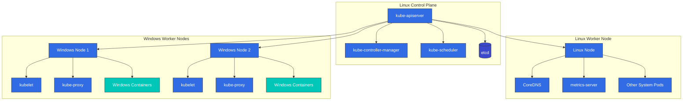
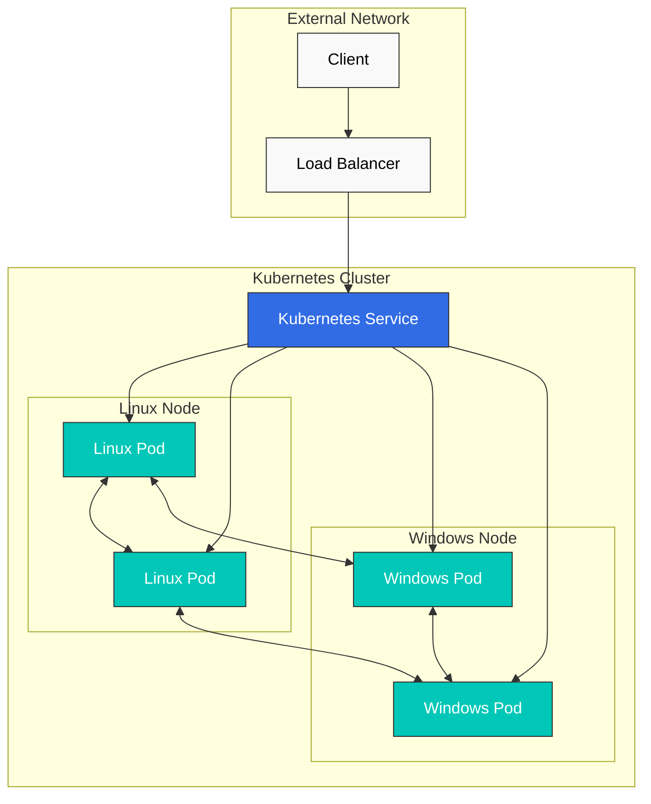
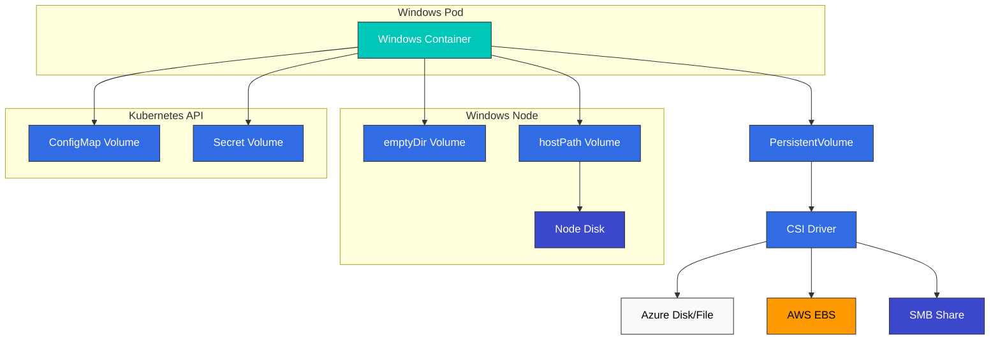
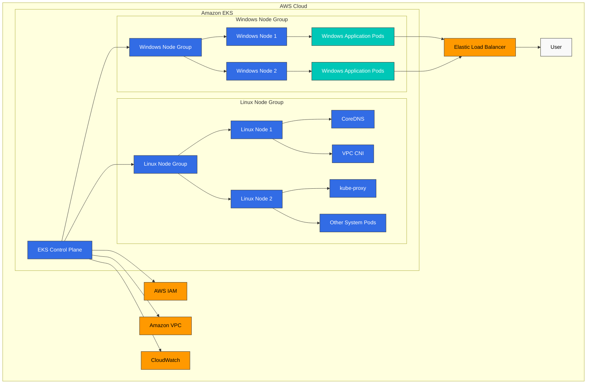

# Windows in Kubernetes

> **Versiones compatibles**: Kubernetes 1.32, 1.33, 1.34
> **Última actualización**: February 11, 2026

Kubernetes se diseñó originalmente para Linux containers, pero el soporte de producción para Windows containers (contenedores Windows) se agregó a partir de la versión 1.14. En este capítulo, exploraremos cómo ejecutar Windows workloads en Kubernetes, la arquitectura, las limitaciones y el soporte de Windows en Amazon EKS.

## Table of Contents
1. [Windows Container Overview](#windows-container-overview)
2. [Kubernetes Windows Support Architecture](#kubernetes-windows-support-architecture)
3. [Windows Node Limitations](#windows-node-limitations)
4. [Windows Node Setup](#windows-node-setup)
5. [Deploying Windows Containers](#deploying-windows-containers)
6. [Networking](#networking)
7. [Storage](#storage)
8. [Monitoring and Logging](#monitoring-and-logging)
9. [Security](#security)
10. [Windows Support in Amazon EKS](#windows-support-in-amazon-eks)
11. [Best Practices](#best-practices)
12. [Conclusion](#conclusion)

## Windows Container Overview

Windows containers son containers que se ejecutan en el sistema operativo Windows, lo que permite containerizar y desplegar aplicaciones Windows.

### Windows Container Types

Hay dos tipos de Windows containers:

1. **Windows Server Containers**: Al igual que Linux containers, comparten el kernel del OS del host. Son ligeros y se inician rápidamente, pero requieren la misma versión de Windows que el host.

2. **Hyper-V Isolation Containers**: Cada container se ejecuta en una VM ligera, lo que proporciona un mayor nivel de aislamiento. Pueden ejecutar versiones de Windows distintas a la del host, pero usan más recursos.

El siguiente diagrama muestra las diferencias arquitectónicas entre los dos tipos de Windows containers:

```mermaid
flowchart TD
    subgraph "Windows Server Containers"
        WSC1[Windows App 1] --- WSC2[Windows App 2] --- WSC3[Windows App 3]
        WSC1 --- WSCR[Container Runtime]
        WSC2 --- WSCR
        WSC3 --- WSCR
        WSCR --- WSOS[Windows Server OS]
        WSOS --- WSHW[Physical Hardware]
    end

    subgraph "Hyper-V Isolation Containers"
        HVC1[Windows App 1] --- HVCR1[Container Runtime]
        HVCR1 --- HVOS1[Windows OS Kernel]

        HVC2[Windows App 2] --- HVCR2[Container Runtime]
        HVCR2 --- HVOS2[Windows OS Kernel]

        HVOS1 --- HV[Hyper-V Hypervisor]
        HVOS2 --- HV
        HV --- HVHOS[Windows Server OS]
        HVHOS --- HVHW[Physical Hardware]
    end

    classDef userApp fill:#00C7B7,stroke:#333,stroke-width:1px,color:white;
    classDef k8sComponent fill:#326CE5,stroke:#333,stroke-width:1px,color:white;
    classDef default fill:#f9f9f9,stroke:#333,stroke-width:1px,color:black;

    class WSC1,WSC2,WSC3,HVC1,HVC2 userApp;
    class WSCR,HVCR1,HVCR2,HVOS1,HVOS2,HV k8sComponent;
    class WSOS,WSHW,HVHOS,HVHW default;
```



### Windows Container Images

Las Windows container images se basan en base images proporcionadas por Microsoft:

1. **Windows Server Core**: Una image ligera que proporciona un entorno mínimo de Windows Server
2. **Nano Server**: Una image ultraligera con una huella menor
3. **Windows**: Una image que proporciona un entorno completo de Windows Server

Dockerfile de ejemplo:

```dockerfile
FROM mcr.microsoft.com/windows/servercore:ltsc2019
WORKDIR /app
COPY . .
RUN powershell -Command "Install-WindowsFeature Web-Server"
EXPOSE 80
CMD ["powershell", "-Command", "Start-Service W3SVC; Get-Content -Path 'C:\\inetpub\\logs\\LogFiles\\W3SVC1\\u_ex*' -Wait"]
```

## Kubernetes Windows Support Architecture

El soporte de Windows en Kubernetes se basa en un entorno mixto. Los componentes del control plane siempre se ejecutan en Linux, mientras que los worker nodes pueden ser Linux o Windows.

### Architecture Overview

La arquitectura de soporte de Windows en Kubernetes es la siguiente:

1. **Linux Control Plane**: kube-apiserver, kube-controller-manager, kube-scheduler y etcd siempre se ejecutan en Linux.
2. **Linux Worker Nodes**: Ejecutan componentes del sistema (CoreDNS, metrics-server, etc.).
3. **Windows Worker Nodes**: Ejecutan Windows application workloads.



### Windows Node Components

Componentes de Kubernetes que se ejecutan en Windows nodes:

1. **kubelet**: Administra Pods y containers en el node
2. **kube-proxy**: Administra reglas de red
3. **CNI Plugin**: Configuración de red
4. **CSI Plugin**: Administración de storage

## Windows Node Limitations

Hay varias limitaciones que debes conocer al usar Windows nodes en Kubernetes.

### Feature Limitations

1. **Privileged Containers**: Windows no admite privileged containers.
2. **Host Network Mode**: Los Windows Pods no pueden usar host network mode.
3. **Pod Security Context**: Algunas funciones de security context (runAsUser, fsGroup, etc.) no son compatibles.
4. **DaemonSet**: Los DaemonSets que se ejecutan en Windows nodes requieren consideraciones especiales.
5. **emptyDir Volumes**: Los volumes emptyDir basados en memoria no son compatibles en Windows.
6. **Resource Limits**: Los límites de CPU se aplican de forma diferente en Windows.

### Networking Limitations

1. **Network Mode**: Windows solo admite networking L3.
2. **Service Types**: Los Windows nodes tienen limitaciones en algunos tipos de Service.
3. **Load Balancing**: Algunas funciones de load balancing pueden estar limitadas.

### Operating System Version Compatibility

Windows containers tienen consideraciones importantes de compatibilidad con la versión del OS del host:

| Container Base Image | Compatible Host OS Versions |
|---------------------|---------------------------|
| Windows Server 2019 | Windows Server 2019 |
| Windows Server 2022 | Windows Server 2022 |

Hyper-V isolation puede flexibilizar estas limitaciones, pero requiere recursos adicionales.
## Windows Node Setup

Exploremos el proceso de agregar Windows nodes a un Kubernetes cluster.

### Prerequisites

Antes de configurar Windows nodes, verifica lo siguiente:

1. **Kubernetes Version**: 1.14 o posterior
2. **Windows Version**: Windows Server 2019 o posterior
3. **Network Plugin**: CNI plugin compatible con Windows (Calico, Flannel, etc.)
4. **Container Runtime**: Docker, containerd, etc.

### Preparing Windows Nodes

Pasos para preparar un Windows node:

1. **Install Windows Server**: Instala Windows Server 2019 o posterior
2. **Enable Container Feature**:

```powershell
Install-WindowsFeature -Name Containers
Restart-Computer -Force
```

3. **Install Docker**:

```powershell
Install-Module -Name DockerMsftProvider -Repository PSGallery -Force
Install-Package -Name Docker -ProviderName DockerMsftProvider -Force
Restart-Computer -Force
```

4. **Install Kubernetes Components**:

```powershell
# Create directory
mkdir -p c:\k

# Download kubelet, kubeadm, kubectl
curl.exe -LO https://dl.k8s.io/v1.22.0/bin/windows/amd64/kubelet.exe
curl.exe -LO https://dl.k8s.io/v1.22.0/bin/windows/amd64/kubectl.exe
curl.exe -LO https://dl.k8s.io/v1.22.0/bin/windows/amd64/kube-proxy.exe
curl.exe -LO https://github.com/kubernetes-sigs/sig-windows-tools/releases/latest/download/wins.exe

# Move files to C:\k
mv kubelet.exe C:\k
mv kubectl.exe C:\k
mv kube-proxy.exe C:\k
mv wins.exe C:\k
```

5. **Configure Network**:

```powershell
# Set firewall rules
New-NetFirewallRule -Name kubelet -DisplayName 'kubelet' -Enabled True -Direction Inbound -Protocol TCP -Action Allow -LocalPort 10250
New-NetFirewallRule -Name https -DisplayName 'https' -Enabled True -Direction Inbound -Protocol TCP -Action Allow -LocalPort 443
New-NetFirewallRule -Name http -DisplayName 'http' -Enabled True -Direction Inbound -Protocol TCP -Action Allow -LocalPort 80
```

### Joining Windows Node Using kubeadm

Genera el join token en el Linux control plane:

```bash
kubeadm token create --print-join-command
```

Ejecuta el join command en el Windows node:

```powershell
# Run kubeadm join command
kubeadm join <control-plane-host>:<control-plane-port> --token <token> --discovery-token-ca-cert-hash sha256:<hash>

# Register and start kubelet service
sc.exe create kubelet binPath= "C:\k\kubelet.exe --windows-service --kubeconfig=C:\k\config"
Start-Service kubelet
```

### Setting Windows Node Labels

Configura labels adecuados en Windows nodes para controlar la programación de workloads:

```bash
kubectl label node <windows-node-name> kubernetes.io/os=windows
kubectl label node <windows-node-name> kubernetes.io/arch=amd64
```

## Deploying Windows Containers

Exploremos cómo desplegar Windows containers en Kubernetes.

### Using Node Selector

Al desplegar Windows workloads, usa un node selector para asegurar que se programen en Windows nodes:

```yaml
apiVersion: apps/v1
kind: Deployment
metadata:
  name: iis-deployment
spec:
  replicas: 2
  selector:
    matchLabels:
      app: iis
  template:
    metadata:
      labels:
        app: iis
    spec:
      nodeSelector:
        kubernetes.io/os: windows
      containers:
      - name: iis
        image: mcr.microsoft.com/windows/servercore/iis:windowsservercore-ltsc2019
        resources:
          limits:
            cpu: 1
            memory: 800Mi
          requests:
            cpu: .1
            memory: 300Mi
        ports:
        - containerPort: 80
```

### Resource Requests and Limits

Los resource requests y limits para Windows containers se gestionan de forma diferente que para Linux containers:

1. **CPU Limits**: Los límites de CPU se aplican de forma diferente en Windows. Por ejemplo, un límite de CPU de 1 significa que se puede usar el 100% de un único core de CPU.
2. **Memory Limits**: Windows containers respetan los límites de memoria, pero algunos procesos del sistema pueden causar overhead adicional.

### Container Customization

Ejecución de scripts personalizados en Windows containers:

```yaml
apiVersion: v1
kind: Pod
metadata:
  name: windows-custom-script
spec:
  nodeSelector:
    kubernetes.io/os: windows
  containers:
  - name: windows-container
    image: mcr.microsoft.com/windows/servercore:ltsc2019
    command:
    - powershell.exe
    - -Command
    - |
      while ($true) {
        Write-Host "Hello from Windows container"
        Start-Sleep -Seconds 10
      }
```

### Multi-Container Pods

Windows también admite multi-container Pods, pero con algunas limitaciones:

```yaml
apiVersion: v1
kind: Pod
metadata:
  name: windows-multi-container
spec:
  nodeSelector:
    kubernetes.io/os: windows
  containers:
  - name: web
    image: mcr.microsoft.com/windows/servercore/iis:windowsservercore-ltsc2019
    ports:
    - containerPort: 80
  - name: logger
    image: mcr.microsoft.com/windows/servercore:ltsc2019
    command:
    - powershell.exe
    - -Command
    - |
      while ($true) {
        Get-Content -Path 'C:\inetpub\logs\LogFiles\W3SVC1\u_ex*' -Wait
      }
```

## Networking

Networking en Windows nodes tiene características diferentes a las de Linux nodes.

El siguiente diagrama muestra la arquitectura de networking de un Kubernetes cluster con Windows y Linux nodes mixtos:



### Supported Network Plugins

Network plugins compatibles con Windows nodes:

1. **Flannel**: Modo VXLAN o host-gw
2. **Calico**: Modo VXLAN
3. **Antrea**: Networking basado en OVS
4. **Azure CNI**: Usado en entornos Azure
5. **AWS VPC CNI**: Usado en entornos AWS

### Flannel Setup Example

Configuración de Windows networking usando Flannel:

```yaml
apiVersion: apps/v1
kind: DaemonSet
metadata:
  name: kube-flannel-ds-windows
  namespace: kube-system
  labels:
    tier: node
    app: flannel
spec:
  selector:
    matchLabels:
      app: flannel
  template:
    metadata:
      labels:
        tier: node
        app: flannel
    spec:
      affinity:
        nodeAffinity:
          requiredDuringSchedulingIgnoredDuringExecution:
            nodeSelectorTerms:
            - matchExpressions:
              - key: kubernetes.io/os
                operator: In
                values:
                - windows
      hostNetwork: true
      containers:
      - name: kube-flannel
        image: sigwindowstools/flannel:v0.13.0
        command:
        - powershell
        args:
        - -file
        - /opt/bin/flannel-host.ps1
        env:
        - name: POD_NAME
          valueFrom:
            fieldRef:
              fieldPath: metadata.name
        - name: POD_NAMESPACE
          valueFrom:
            fieldRef:
              fieldPath: metadata.namespace
        volumeMounts:
        - name: host-run
          mountPath: /run
        - name: cni
          mountPath: /etc/cni/net.d
        - name: flannel-cfg
          mountPath: /etc/kube-flannel/
      volumes:
      - name: host-run
        hostPath:
          path: /run
      - name: cni
        hostPath:
          path: /etc/cni/net.d
      - name: flannel-cfg
        configMap:
          name: kube-flannel-cfg
```

### Exposing Services

Cómo exponer Services en Windows nodes:

```yaml
apiVersion: v1
kind: Service
metadata:
  name: iis-service
spec:
  selector:
    app: iis
  ports:
  - port: 80
    targetPort: 80
  type: LoadBalancer
```

### Network Policies

Para usar network policies en Windows nodes, necesitas un CNI plugin que admita network policies (por ejemplo, Calico):

```yaml
apiVersion: networking.k8s.io/v1
kind: NetworkPolicy
metadata:
  name: allow-frontend-to-backend
  namespace: default
spec:
  podSelector:
    matchLabels:
      app: backend
      os: windows
  ingress:
  - from:
    - podSelector:
        matchLabels:
          app: frontend
    ports:
    - protocol: TCP
      port: 80
```

## Storage

Exploremos las opciones de storage disponibles en Windows nodes.

El siguiente diagrama muestra varias opciones de storage disponibles en Windows nodes:



### Supported Volume Types

Tipos de Volume compatibles en Windows nodes:

1. **emptyDir**: Storage temporal (emptyDir basado en memoria no compatible)
2. **hostPath**: Filesystem del host node
3. **configMap**: Datos de configuración
4. **secret**: Datos sensibles
5. **azureFile**: Azure File storage
6. **awsElasticBlockStore**: AWS EBS volumes
7. **azureDisk**: Azure Disk storage
8. **CSI**: Drivers de Container Storage Interface

### emptyDir Volume Example

```yaml
apiVersion: v1
kind: Pod
metadata:
  name: windows-emptydir
spec:
  nodeSelector:
    kubernetes.io/os: windows
  containers:
  - name: windows-container
    image: mcr.microsoft.com/windows/servercore:ltsc2019
    volumeMounts:
    - name: temp-volume
      mountPath: C:\temp
    command:
    - powershell.exe
    - -Command
    - |
      Set-Content -Path C:\temp\test.txt -Value "Hello from Windows"
      while ($true) {
        Get-Content -Path C:\temp\test.txt
        Start-Sleep -Seconds 10
      }
  volumes:
  - name: temp-volume
    emptyDir: {}
```

### hostPath Volume Example

```yaml
apiVersion: v1
kind: Pod
metadata:
  name: windows-hostpath
spec:
  nodeSelector:
    kubernetes.io/os: windows
  containers:
  - name: windows-container
    image: mcr.microsoft.com/windows/servercore:ltsc2019
    volumeMounts:
    - name: logs-volume
      mountPath: C:\logs
    command:
    - powershell.exe
    - -Command
    - |
      Set-Content -Path C:\logs\app.log -Value "Application log"
      while ($true) {
        Add-Content -Path C:\logs\app.log -Value "Log entry at $(Get-Date)"
        Start-Sleep -Seconds 10
      }
  volumes:
  - name: logs-volume
    hostPath:
      path: C:\k\logs
      type: DirectoryOrCreate
```

### ConfigMap and Secret Volume Example

```yaml
apiVersion: v1
kind: ConfigMap
metadata:
  name: windows-config
data:
  config.json: |
    {
      "setting1": "value1",
      "setting2": "value2"
    }
---
apiVersion: v1
kind: Secret
metadata:
  name: windows-secret
type: Opaque
data:
  username: YWRtaW4=  # admin
  password: cGFzc3dvcmQ=  # password
---
apiVersion: v1
kind: Pod
metadata:
  name: windows-config-secret
spec:
  nodeSelector:
    kubernetes.io/os: windows
  containers:
  - name: windows-container
    image: mcr.microsoft.com/windows/servercore:ltsc2019
    volumeMounts:
    - name: config-volume
      mountPath: C:\config
    - name: secret-volume
      mountPath: C:\secret
    command:
    - powershell.exe
    - -Command
    - |
      Get-Content -Path C:\config\config.json
      Get-Content -Path C:\secret\username
      Get-Content -Path C:\secret\password
      while ($true) { Start-Sleep -Seconds 10 }
  volumes:
  - name: config-volume
    configMap:
      name: windows-config
  - name: secret-volume
    secret:
      secretName: windows-secret
```

### Using CSI Drivers

Ejemplo de uso de CSI drivers en Windows:

```yaml
apiVersion: v1
kind: PersistentVolumeClaim
metadata:
  name: windows-pvc
spec:
  accessModes:
  - ReadWriteOnce
  resources:
    requests:
      storage: 10Gi
  storageClassName: windows-csi
---
apiVersion: v1
kind: Pod
metadata:
  name: windows-csi-pod
spec:
  nodeSelector:
    kubernetes.io/os: windows
  containers:
  - name: windows-container
    image: mcr.microsoft.com/windows/servercore:ltsc2019
    volumeMounts:
    - name: data-volume
      mountPath: C:\data
    command:
    - powershell.exe
    - -Command
    - |
      Set-Content -Path C:\data\file.txt -Value "Persistent data"
      while ($true) { Start-Sleep -Seconds 10 }
  volumes:
  - name: data-volume
    persistentVolumeClaim:
      claimName: windows-pvc
```
## Monitoring and Logging

Exploremos métodos de monitoring y logging para Windows nodes y containers.

### Monitoring

Herramientas para monitorizar Windows nodes:

1. **Prometheus Windows Exporter**: Recopila métricas de Windows nodes
2. **metrics-server**: Proporciona métricas básicas de uso de recursos
3. **Datadog, Dynatrace, New Relic**: Soluciones comerciales de monitoring

Instalación de Prometheus Windows Exporter en Windows nodes:

```powershell
# Download Windows Exporter
Invoke-WebRequest -Uri https://github.com/prometheus-community/windows_exporter/releases/download/v0.16.0/windows_exporter-0.16.0-amd64.msi -OutFile windows_exporter.msi

# Install Windows Exporter
Start-Process msiexec.exe -ArgumentList '/i', 'windows_exporter.msi', 'ENABLED_COLLECTORS=cpu,memory,disk,net,service,os,system', '/quiet' -Wait
```

Configuración de Prometheus:

```yaml
scrape_configs:
  - job_name: 'windows-nodes'
    static_configs:
      - targets: ['windows-node-1:9182', 'windows-node-2:9182']
```

### Logging

Herramientas para recopilar logs de Windows containers:

1. **Fluent Bit**: Recolector de logs ligero
2. **Fluentd**: Recopilación y reenvío de logs
3. **Elasticsearch**: Storage y búsqueda de logs
4. **Azure Monitor**: Usado en entornos Azure
5. **CloudWatch Logs**: Usado en entornos AWS

Instalación de Fluent Bit en Windows nodes:

```powershell
# Download Fluent Bit
Invoke-WebRequest -Uri https://fluentbit.io/releases/1.8/fluent-bit-1.8.11-win64.zip -OutFile fluent-bit.zip

# Extract
Expand-Archive -Path fluent-bit.zip -DestinationPath C:\fluent-bit

# Create configuration file
@"
[SERVICE]
    Flush        5
    Daemon       Off
    Log_Level    info

[INPUT]
    Name         winlog
    Channels     Application,System,Security

[OUTPUT]
    Name         es
    Match        *
    Host         elasticsearch-host
    Port         9200
    Index        windows_logs
"@ | Out-File -FilePath C:\fluent-bit\conf\fluent-bit.conf -Encoding ascii

# Register service
sc.exe create fluent-bit binPath= "C:\fluent-bit\bin\fluent-bit.exe -c C:\fluent-bit\conf\fluent-bit.conf"
Start-Service fluent-bit
```

### Application Log Collection

Recopilación de application logs de Windows containers:

```yaml
apiVersion: v1
kind: Pod
metadata:
  name: windows-logging
spec:
  nodeSelector:
    kubernetes.io/os: windows
  containers:
  - name: iis
    image: mcr.microsoft.com/windows/servercore/iis:windowsservercore-ltsc2019
    volumeMounts:
    - name: logs
      mountPath: C:\inetpub\logs\LogFiles
  - name: log-collector
    image: mcr.microsoft.com/windows/servercore:ltsc2019
    command:
    - powershell.exe
    - -Command
    - |
      while ($true) {
        Get-Content -Path 'C:\inetpub\logs\LogFiles\W3SVC1\u_ex*' -Wait
      }
    volumeMounts:
    - name: logs
      mountPath: C:\inetpub\logs\LogFiles
  volumes:
  - name: logs
    emptyDir: {}
```

## Security

Exploremos consideraciones de security para Windows nodes y containers.

### Windows Node Security

Recomendaciones de security para Windows nodes:

1. **Apply Latest Updates**: Aplica regularmente las actualizaciones de security de Windows
2. **Firewall Configuration**: Configura correctamente Windows Defender Firewall
3. **Least Privilege Principle**: Concede solo los permisos mínimos necesarios
4. **Antivirus Software**: Instala software antivirus adecuado
5. **Group Policy**: Aplica group policies para el endurecimiento de security

### Windows Container Security

Recomendaciones de security para Windows containers:

1. **Minimal Base Image**: Usa la base image más pequeña posible (Nano Server, etc.)
2. **Image Scanning**: Escanea container images en busca de vulnerabilidades
3. **ReadOnlyRootFilesystem**: Usa un root filesystem de solo lectura cuando sea posible
4. **Non-Privileged User**: Ejecuta aplicaciones como usuarios sin privilegios
5. **Network Policies**: Aplica network policies adecuadas

### RunAsUsername

En Windows containers, puedes usar `runAsUsername` en lugar de `runAsUser` para especificar el usuario con el que se ejecutará dentro del container:

```yaml
apiVersion: v1
kind: Pod
metadata:
  name: windows-runasusername
spec:
  nodeSelector:
    kubernetes.io/os: windows
  securityContext:
    windowsOptions:
      runAsUserName: "ContainerUser"
  containers:
  - name: windows-container
    image: mcr.microsoft.com/windows/servercore:ltsc2019
    command:
    - powershell.exe
    - -Command
    - |
      whoami
      while ($true) { Start-Sleep -Seconds 10 }
```

### Group Managed Service Accounts (gMSA)

Configuración de gMSA para autenticación de Active Directory en Windows containers:

1. **Create gMSA in Active Directory**:

```powershell
# Create gMSA
New-ADServiceAccount -Name WebApp1 -DNSHostName WebApp1.contoso.com -ServicePrincipalNames http/WebApp1.contoso.com -PrincipalsAllowedToRetrieveManagedPassword "Domain Controllers", "Domain Computers"
```

2. **Store gMSA Credentials in Kubernetes**:

```yaml
apiVersion: v1
kind: Secret
metadata:
  name: gmsa-cred-spec
type: microsoft.com/gmsa-credential-spec
data:
  credspec.json: <base64-encoded-credential-spec>
```

3. **Apply gMSA Configuration to Pod**:

```yaml
apiVersion: v1
kind: Pod
metadata:
  name: windows-gmsa
spec:
  nodeSelector:
    kubernetes.io/os: windows
  securityContext:
    windowsOptions:
      gmsaCredentialSpecName: gmsa-cred-spec
  containers:
  - name: windows-container
    image: mcr.microsoft.com/windows/servercore:ltsc2019
    command:
    - powershell.exe
    - -Command
    - |
      whoami
      while ($true) { Start-Sleep -Seconds 10 }
```

## Windows Support in Amazon EKS

Exploremos cómo ejecutar Windows workloads en Amazon EKS.

El siguiente diagrama muestra la arquitectura de soporte de Windows en Amazon EKS:



### Enabling Windows Support in EKS

Pasos para habilitar el soporte de Windows en Amazon EKS:

1. **Update VPC CNI Plugin**:

```bash
kubectl apply -f https://raw.githubusercontent.com/aws/amazon-vpc-cni-k8s/release-1.11/config/master/vpc-resource-controller.yaml
```

2. **Install Windows VPC Admission Webhook**:

```bash
kubectl apply -f https://raw.githubusercontent.com/aws/amazon-vpc-cni-k8s/release-1.11/config/master/vpc-admission-webhook.yaml
```

### Creating Windows Node Groups

Crea un Windows node group usando eksctl:

```bash
eksctl create nodegroup \
  --cluster my-cluster \
  --region us-west-2 \
  --name windows-ng \
  --node-type t3.large \
  --nodes 2 \
  --nodes-min 1 \
  --nodes-max 4 \
  --managed \
  --node-ami-family WindowsServer2019FullContainer
```

Creación de Windows node group usando AWS Management Console:

1. Selecciona el cluster en la consola de EKS
2. Selecciona la pestaña "Compute"
3. Haz clic en "Add node group"
4. Ingresa los detalles del node group
5. Selecciona "Windows" como tipo de AMI
6. Configura los ajustes restantes y crea

### Deploying Windows Applications in EKS

Ejemplo de despliegue de aplicaciones Windows en EKS:

```yaml
apiVersion: apps/v1
kind: Deployment
metadata:
  name: windows-server-iis
spec:
  selector:
    matchLabels:
      app: windows-server-iis
      tier: backend
      track: stable
  replicas: 2
  template:
    metadata:
      labels:
        app: windows-server-iis
        tier: backend
        track: stable
    spec:
      nodeSelector:
        kubernetes.io/os: windows
      containers:
      - name: windows-server-iis
        image: mcr.microsoft.com/windows/servercore/iis:windowsservercore-ltsc2019
        ports:
        - name: http
          containerPort: 80
        resources:
          limits:
            cpu: 1
            memory: 800Mi
          requests:
            cpu: .1
            memory: 300Mi
---
apiVersion: v1
kind: Service
metadata:
  name: windows-server-iis-service
  labels:
    app: windows-server-iis
spec:
  ports:
  - port: 80
    protocol: TCP
  selector:
    app: windows-server-iis
  type: LoadBalancer
```

### Windows Container Logging in EKS

Recopilación de logs de Windows containers usando CloudWatch Logs:

```yaml
apiVersion: v1
kind: ConfigMap
metadata:
  name: fluent-bit-config
  namespace: amazon-cloudwatch
data:
  fluent-bit.conf: |
    [SERVICE]
        Flush         5
        Log_Level     info
        Daemon        off

    [INPUT]
        Name          tail
        Tag           kube.*
        Path          /var/log/containers/*.log
        Parser        docker
        DB            /var/fluent-bit/state/flb_container.db
        Mem_Buf_Limit 50MB

    [FILTER]
        Name          kubernetes
        Match         kube.*
        Kube_URL      https://kubernetes.default.svc:443
        Merge_Log     On

    [OUTPUT]
        Name          cloudwatch_logs
        Match         kube.*
        region        us-west-2
        log_group_name /aws/eks/my-cluster/windows-logs
        log_stream_prefix windows-
        auto_create_group true
```

## Best Practices

Exploremos las best practices para ejecutar Windows workloads en Kubernetes.

### Cluster Design Best Practices

1. **Mixed Node Pools**: Usa una combinación adecuada de Linux y Windows nodes
2. **Node Labels and Taints**: Usa node labels y taints adecuados para separar workloads
3. **Version Compatibility**: Verifica la compatibilidad entre la versión de Kubernetes y la versión de Windows
4. **Network Plugin Selection**: Selecciona un network plugin adecuado compatible con Windows
5. **High Availability**: Configura high availability para workloads críticos

### Application Design Best Practices

1. **Container Image Optimization**: Usa container images pequeñas y eficientes
2. **Resource Requests and Limits**: Define resource requests y limits adecuados
3. **Stateless Design**: Diseña aplicaciones stateless cuando sea posible
4. **Logging and Monitoring**: Configura logging y monitoring efectivos
5. **Security Hardening**: Aplica security contexts y network policies adecuados

### Operations Best Practices

1. **Regular Updates**: Actualiza regularmente Windows nodes y container images
2. **Automation**: Automatiza las tareas de despliegue y administración
3. **Backup and Recovery**: Realiza backups regulares de los datos importantes
4. **Troubleshooting Tools**: Crea herramientas y procesos de troubleshooting adecuados
5. **Documentation**: Documenta configuraciones y procedimientos

### EKS-Specific Best Practices

1. **Managed Node Groups**: Usa managed node groups cuando sea posible
2. **IAM Roles for Service Accounts (IRSA)**: Administra permisos de IAM por Pod
3. **VPC CNI Configuration**: Configura VPC CNI según los requisitos de networking
4. **Security Groups**: Configura security groups adecuados
5. **Cost Optimization**: Selecciona tipos y tamaños de instancia adecuados

## Conclusion

El soporte de Windows en Kubernetes continúa evolucionando, y ahora puedes ejecutar Windows workloads en entornos de producción. Windows nodes pueden ejecutarse junto con Linux nodes en el mismo cluster, lo que permite administrar workloads diversos en un único Kubernetes cluster.

Windows containers permiten containerizar aplicaciones .NET Framework, servicios Windows y otros workloads específicos de Windows para aprovechar las capacidades de orquestación de Kubernetes. Sin embargo, existen algunas limitaciones en comparación con Linux containers, por lo que es importante comprender y abordar estas limitaciones adecuadamente.

Amazon EKS proporciona servicios administrados para Windows nodes, lo que facilita desplegar y administrar Windows workloads. Aprovechar el soporte de Windows de EKS puede simplificar el proceso de migración de aplicaciones Windows a entornos modernos de containers.

Para implementar Windows en Kubernetes con éxito, es importante seguir best practices adecuadas de planificación, diseño y operaciones. Esto permite administrar de forma eficiente workloads Windows y Linux, y aprovechar todos los beneficios de Kubernetes.

## Quiz

Para comprobar lo que aprendiste en este capítulo, prueba el [Windows in Kubernetes Quiz](../quizzes/core/10-windows-in-kubernetes-quiz.md).
