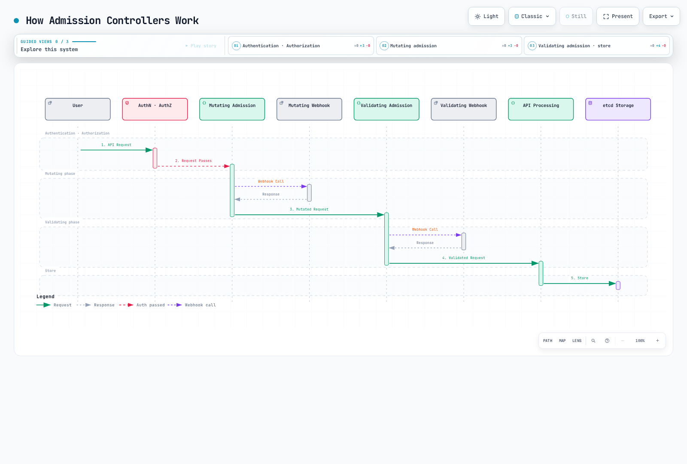

# Extensión de Kubernetes

> **Versiones compatibles**: Kubernetes 1.32, 1.33, 1.34
> **Última actualización**: February 19, 2026

Kubernetes es una plataforma diseñada pensando en la extensibilidad, lo que permite ampliar su funcionalidad de diversas maneras. En este capítulo, exploraremos los distintos métodos para extender Kubernetes y cómo aprovechar las características de extensión en Amazon EKS.

## Tabla de contenido
1. [Descripción general de las extensiones de Kubernetes](#kubernetes-extension-overview)
2. [Recursos personalizados](#custom-resources)
3. [Patrón Operator](#operator-pattern)
4. [Controladores de admisión](#admission-controllers)
5. [Extensiones de API Server](#api-server-extensions)
6. [Extensiones del programador](#scheduler-extensions)
7. [Cloud Controller Manager](#cloud-controller-manager)
8. [CSI (Container Storage Interface)](#csi-container-storage-interface)
9. [CNI (Container Network Interface)](#cni-container-network-interface)
10. [Plugins de dispositivo](#device-plugins)
11. [Características de extensión en Amazon EKS](#extension-features-in-amazon-eks)
12. [Prácticas recomendadas](#best-practices)
13. [Conclusión](#conclusion)

## Descripción general de las extensiones de Kubernetes

Kubernetes ofrece diversos puntos de extensión para ampliar y personalizar su funcionalidad base. Los principales puntos de extensión son:

1. **Recursos personalizados**: Definen nuevos tipos de objetos de API
2. **Operators**: Combinan recursos personalizados y controladores para administrar aplicaciones complejas
3. **Controladores de admisión**: Interceptan, modifican o validan solicitudes de API
4. **Extensiones de API Server**: Añaden nuevos endpoints al API server
5. **Extensiones del programador**: Personalizan la lógica de programación de pods
6. **Cloud Controller Manager**: Integra características específicas de proveedores de nube
7. **CSI (Container Storage Interface)**: Integra sistemas de almacenamiento
8. **CNI (Container Network Interface)**: Integra soluciones de red
9. **Plugins de dispositivo**: Integran hardware especial

El siguiente diagrama muestra los principales puntos de extensión en Kubernetes:


[🔍 Ver diagrama interactivo](https://www.atomai.click/kubernetes-docs/archmaps/en-core-11-extending-kubernetes-0.html)

### Elección de un método de extensión

Consideraciones al elegir un método de extensión apropiado:

1. **Caso de uso**: El tipo de funcionalidad que desea extender
2. **Complejidad**: Complejidad de la implementación y el mantenimiento
3. **Impacto en el rendimiento**: Impacto de la extensión en el rendimiento del clúster
4. **Compatibilidad de actualización**: Compatibilidad con las actualizaciones de versión de Kubernetes
5. **Soporte de la comunidad**: Nivel de soporte de la comunidad para el método de extensión

## Recursos personalizados

Los recursos personalizados son una forma de extender la API de Kubernetes para definir nuevos tipos de objetos.

El siguiente diagrama muestra cómo funcionan los recursos personalizados:


[🔍 Ver diagrama interactivo](https://www.atomai.click/kubernetes-docs/archmaps/en-core-11-extending-kubernetes-1.html)

### Definiciones de recursos personalizados (CRD)

CRD es la forma más sencilla de definir nuevos tipos de recursos:

```yaml
apiVersion: apiextensions.k8s.io/v1
kind: CustomResourceDefinition
metadata:
  name: backups.example.com
spec:
  group: example.com
  names:
    kind: Backup
    listKind: BackupList
    plural: backups
    singular: backup
    shortNames:
    - bk
  scope: Namespaced
  versions:
  - name: v1
    served: true
    storage: true
    schema:
      openAPIV3Schema:
        type: object
        properties:
          spec:
            type: object
            properties:
              source:
                type: string
              destination:
                type: string
              schedule:
                type: string
            required:
            - source
            - destination
          status:
            type: object
            properties:
              phase:
                type: string
              lastBackupTime:
                type: string
                format: date-time
    subresources:
      status: {}
    additionalPrinterColumns:
    - name: Status
      type: string
      jsonPath: .status.phase
    - name: Age
      type: date
      jsonPath: .metadata.creationTimestamp
```

En el ejemplo anterior, definimos un nuevo tipo de recurso llamado `Backup` y especificamos el esquema del recurso y columnas de impresión adicionales.

### Creación de instancias de recursos personalizados

Después de definir una CRD, puede crear instancias de recursos de ese tipo:

```yaml
apiVersion: example.com/v1
kind: Backup
metadata:
  name: daily-backup
spec:
  source: /data
  destination: s3://my-bucket/backups
  schedule: "0 0 * * *"
```

### Validación de recursos personalizados

Puede validar recursos personalizados mediante esquemas OpenAPI v3 en las CRD:

```yaml
openAPIV3Schema:
  type: object
  properties:
    spec:
      type: object
      properties:
        replicas:
          type: integer
          minimum: 1
          maximum: 10
        image:
          type: string
          pattern: '^[a-zA-Z0-9./:_-]+$'
      required:
      - replicas
      - image
```

En el ejemplo anterior, el campo `replicas` debe ser un entero entre 1 y 10, y el campo `image` debe coincidir con el patrón especificado.

### Administración de versiones

Las CRD admiten varias versiones para permitir la evolución de la API:

```yaml
versions:
- name: v1alpha1
  served: true
  storage: false
- name: v1beta1
  served: true
  storage: false
- name: v1
  served: true
  storage: true
```

En el ejemplo anterior, se sirven tres versiones, `v1alpha1`, `v1beta1` y `v1`, pero los datos se almacenan en formato `v1`.

### Webhooks de conversión

Puede usar webhooks de conversión para manejar conversiones entre diferentes versiones:

```yaml
apiVersion: apiextensions.k8s.io/v1
kind: CustomResourceDefinition
metadata:
  name: backups.example.com
spec:
  # ... other fields omitted ...
  conversion:
    strategy: Webhook
    webhook:
      clientConfig:
        service:
          namespace: default
          name: example-conversion-webhook
          path: /convert
      conversionReviewVersions:
      - v1
```

## Patrón Operator

El patrón Operator es una forma de automatizar el conocimiento operativo de aplicaciones complejas mediante la combinación de recursos personalizados y controladores.

El siguiente diagrama muestra cómo funciona el patrón Operator:


[🔍 Ver diagrama interactivo](https://www.atomai.click/kubernetes-docs/archmaps/en-core-11-extending-kubernetes-2.html)

### Conceptos de Operator

Un Operator consta de los siguientes componentes:

1. **Custom Resource Definition (CRD)**: Define el esquema de los recursos que se administrarán
2. **Controlador**: Lógica que supervisa los recursos personalizados y los reconcilia con el estado deseado
3. **Cliente de la API de Kubernetes**: Cliente para interactuar con la API de Kubernetes

### Ejemplo de Operator

Ejemplo de Operator de base de datos:

```yaml
# Custom Resource Definition
apiVersion: apiextensions.k8s.io/v1
kind: CustomResourceDefinition
metadata:
  name: databases.example.com
spec:
  group: example.com
  names:
    kind: Database
    listKind: DatabaseList
    plural: databases
    singular: database
    shortNames:
    - db
  scope: Namespaced
  versions:
  - name: v1
    served: true
    storage: true
    schema:
      openAPIV3Schema:
        type: object
        properties:
          spec:
            type: object
            properties:
              engine:
                type: string
                enum:
                - mysql
                - postgresql
              version:
                type: string
              storageSize:
                type: string
              replicas:
                type: integer
                minimum: 1
            required:
            - engine
            - version
            - storageSize
          status:
            type: object
            properties:
              phase:
                type: string
              endpoint:
                type: string
    subresources:
      status: {}
```

```yaml
# Database Instance
apiVersion: example.com/v1
kind: Database
metadata:
  name: my-db
spec:
  engine: postgresql
  version: "13.4"
  storageSize: 10Gi
  replicas: 3
```

### Herramientas de desarrollo de Operators

Herramientas para desarrollar Operators:

1. **Operator SDK**: Desarrolla Operators con Go, Ansible o Helm
2. **KUDO (Kubernetes Universal Declarative Operator)**: Desarrolla Operators de forma declarativa
3. **Kubebuilder**: Framework de desarrollo de Operators basado en Go
4. **Metacontroller**: Desarrollo de Operators basado en webhook

#### Ejemplo de Operator SDK

Creación de un Operator mediante Operator SDK:

```bash
# Install Operator SDK
curl -LO https://github.com/operator-framework/operator-sdk/releases/download/v1.16.0/operator-sdk_linux_amd64
chmod +x operator-sdk_linux_amd64
mv operator-sdk_linux_amd64 /usr/local/bin/operator-sdk

# Create new operator project
operator-sdk init --domain example.com --repo github.com/example/database-operator

# Create API
operator-sdk create api --group database --version v1 --kind Database --resource --controller

# Implement controller (main.go, controllers/database_controller.go, etc.)

# Build and deploy operator
make docker-build docker-push
make deploy
```

### Operators populares

Operators populares de código abierto:

1. **Prometheus Operator**: Administra la pila de monitoreo de Prometheus
2. **Elasticsearch Operator**: Administra clústeres de Elasticsearch
3. **etcd Operator**: Administra clústeres de etcd
4. **PostgreSQL Operator**: Administra bases de datos PostgreSQL
5. **Jaeger Operator**: Administra el sistema de rastreo distribuido Jaeger
6. **Strimzi Kafka Operator**: Administra clústeres de Apache Kafka
7. **Istio Operator**: Administra la malla de servicios Istio
## Controladores de admisión

Los controladores de admisión son plugins que interceptan las solicitudes al API server de Kubernetes y las modifican o validan.

El siguiente diagrama muestra cómo funcionan los controladores de admisión:



[🔍 Ver diagrama interactivo](https://www.atomai.click/kubernetes-docs/archmaps/en-core-11-extending-kubernetes-3.html)

### Tipos de controladores de admisión

Kubernetes tiene dos tipos de controladores de admisión:

1. **Controladores de admisión mutantes**: Pueden modificar recursos
2. **Controladores de admisión de validación**: Solo pueden validar recursos

### Controladores de admisión integrados

Kubernetes tiene varios controladores de admisión integrados:

1. **NamespaceLifecycle**: Impide la creación de recursos en namespaces que se están eliminando
2. **LimitRanger**: Establece límites de recursos predeterminados para pods y contenedores
3. **ServiceAccount**: Crea automáticamente cuentas de servicio y agrega tokens
4. **DefaultStorageClass**: Asigna la clase de almacenamiento predeterminada a los PVC
5. **ResourceQuota**: Limita el uso de recursos por namespace
6. **PodSecurityPolicy**: Aplica políticas de seguridad de pods
7. **NodeRestriction**: Limita los recursos que los nodos pueden modificar

### Controladores de admisión de webhook

Puede usar controladores de admisión de webhook para implementar lógica personalizada:

```yaml
# Mutating Webhook Configuration
apiVersion: admissionregistration.k8s.io/v1
kind: MutatingWebhookConfiguration
metadata:
  name: pod-mutating-webhook
webhooks:
- name: pod-mutator.example.com
  clientConfig:
    service:
      namespace: default
      name: pod-mutating-webhook
      path: "/mutate"
    caBundle: <base64-encoded-ca-cert>
  rules:
  - apiGroups: [""]
    apiVersions: ["v1"]
    resources: ["pods"]
    operations: ["CREATE"]
    scope: "Namespaced"
  admissionReviewVersions: ["v1", "v1beta1"]
  sideEffects: None
  timeoutSeconds: 5
```

```yaml
# Validating Webhook Configuration
apiVersion: admissionregistration.k8s.io/v1
kind: ValidatingWebhookConfiguration
metadata:
  name: pod-validating-webhook
webhooks:
- name: pod-validator.example.com
  clientConfig:
    service:
      namespace: default
      name: pod-validating-webhook
      path: "/validate"
    caBundle: <base64-encoded-ca-cert>
  rules:
  - apiGroups: [""]
    apiVersions: ["v1"]
    resources: ["pods"]
    operations: ["CREATE", "UPDATE"]
    scope: "Namespaced"
  admissionReviewVersions: ["v1", "v1beta1"]
  sideEffects: None
  timeoutSeconds: 5
```

### Implementación de servidor webhook

Un servidor webhook debe implementar endpoints como los siguientes:

```go
// Mutating webhook example
func mutateHandler(w http.ResponseWriter, r *http.Request) {
    var body []byte
    if r.Body != nil {
        if data, err := ioutil.ReadAll(r.Body); err == nil {
            body = data
        }
    }

    // Convert to AdmissionReview object
    admissionReview := v1.AdmissionReview{}
    if err := json.Unmarshal(body, &admissionReview); err != nil {
        http.Error(w, "Could not parse admission review request", http.StatusBadRequest)
        return
    }

    // Extract Pod object
    pod := corev1.Pod{}
    if err := json.Unmarshal(admissionReview.Request.Object.Raw, &pod); err != nil {
        http.Error(w, "Could not parse pod object", http.StatusBadRequest)
        return
    }

    // Create patch
    patches := []map[string]interface{}{
        {
            "op":    "add",
            "path":  "/metadata/labels/injected-by",
            "value": "mutating-webhook",
        },
    }

    patchBytes, _ := json.Marshal(patches)

    // Create response
    admissionResponse := v1.AdmissionResponse{
        UID:     admissionReview.Request.UID,
        Allowed: true,
        Patch:   patchBytes,
        PatchType: func() *v1.PatchType {
            pt := v1.PatchTypeJSONPatch
            return &pt
        }(),
    }

    admissionReview.Response = &admissionResponse
    resp, _ := json.Marshal(admissionReview)
    w.Header().Set("Content-Type", "application/json")
    w.Write(resp)
}
```

```go
// Validating webhook example
func validateHandler(w http.ResponseWriter, r *http.Request) {
    var body []byte
    if r.Body != nil {
        if data, err := ioutil.ReadAll(r.Body); err == nil {
            body = data
        }
    }

    // Convert to AdmissionReview object
    admissionReview := v1.AdmissionReview{}
    if err := json.Unmarshal(body, &admissionReview); err != nil {
        http.Error(w, "Could not parse admission review request", http.StatusBadRequest)
        return
    }

    // Extract Pod object
    pod := corev1.Pod{}
    if err := json.Unmarshal(admissionReview.Request.Object.Raw, &pod); err != nil {
        http.Error(w, "Could not parse pod object", http.StatusBadRequest)
        return
    }

    // Validation logic
    allowed := true
    var message string
    for _, container := range pod.Spec.Containers {
        if container.Image == "nginx:latest" {
            allowed = false
            message = "Using 'latest' tag is not allowed. Please specify a version."
            break
        }
    }

    // Create response
    admissionResponse := v1.AdmissionResponse{
        UID:     admissionReview.Request.UID,
        Allowed: allowed,
    }

    if !allowed {
        admissionResponse.Result = &metav1.Status{
            Message: message,
        }
    }

    admissionReview.Response = &admissionResponse
    resp, _ := json.Marshal(admissionReview)
    w.Header().Set("Content-Type", "application/json")
    w.Write(resp)
}
```

### Proyectos populares de controladores de admisión

1. **OPA Gatekeeper**: Aplicación de políticas mediante Open Policy Agent
2. **Kyverno**: Motor de políticas basado en YAML
3. **Istio**: Inyección de sidecar de malla de servicios
4. **cert-manager**: Administración de certificados TLS

## Extensiones de API Server

Las extensiones de API server son una forma de añadir nuevos endpoints al API server de Kubernetes.

### Servidores de API de extensión

Los servidores de API de extensión son servidores que se ejecutan por separado del API server de Kubernetes y proporcionan API personalizadas:

```yaml
# APIService Definition
apiVersion: apiregistration.k8s.io/v1
kind: APIService
metadata:
  name: v1.example.com
spec:
  group: example.com
  version: v1
  groupPriorityMinimum: 1000
  versionPriority: 15
  service:
    name: example-api
    namespace: default
  caBundle: <base64-encoded-ca-cert>
```

### Implementación de API Server de extensión

Un API server de extensión consta de los siguientes componentes:

1. **API Server**: Proporciona una interfaz similar al API server de Kubernetes
2. **Manejadores de recursos**: Gestionan solicitudes para tipos de recursos específicos
3. **Backend de almacenamiento**: Almacena datos de recursos

```go
// Extension API Server Example
func main() {
    // Server configuration
    config := genericapiserver.NewRecommendedConfig(apiserver.Codecs)
    config.OpenAPIConfig = genericapiserver.DefaultOpenAPIConfig(
        sampleopenapi.GetOpenAPIDefinitions,
        openapi.NewDefinitionNamer(apiserver.Scheme),
    )
    config.EnableIndex = true
    config.EnableDiscovery = true

    // Create server
    server, err := config.Complete().New("sample-apiserver", genericapiserver.NewEmptyDelegate())
    if err != nil {
        log.Fatalf("Error creating server: %v", err)
    }

    // Set API group info
    apiGroupInfo := genericapiserver.NewDefaultAPIGroupInfo(
        samplev1alpha1.GroupName,
        apiserver.Scheme,
        metav1.ParameterCodec,
        apiserver.Codecs,
    )

    // Set storage
    apiGroupInfo.VersionedResourcesStorageMap["v1alpha1"] = map[string]rest.Storage{
        "widgets": NewWidgetStorage(),
    }

    // Install API group
    if err := server.InstallAPIGroup(&apiGroupInfo); err != nil {
        log.Fatalf("Error installing API group: %v", err)
    }

    // Run server
    if err := server.PrepareRun().Run(stopCh); err != nil {
        log.Fatalf("Error running server: %v", err)
    }
}
```

### Capa de agregación

La capa de agregación hace que varios servidores de API aparezcan como un único API server:

```
                                   +-----------------+
                                   |                 |
                                   |  kube-apiserver |
                                   |                 |
                                   +-------+---------+
                                           |
                                           v
                      +--------------------+--------------------+
                      |                                         |
                      |                                         |
          +-----------v-----------+               +------------v------------+
          |                       |               |                         |
          |  metrics-server       |               |  example-apiserver      |
          |                       |               |                         |
          +-----------------------+               +-------------------------+
```

## Extensiones del programador

Las extensiones del programador son una forma de personalizar el comportamiento del programador de Kubernetes.

### Framework del programador

El framework del programador introducido en Kubernetes 1.15 permite ampliar varias etapas del flujo de programación mediante plugins:

1. **Queue Sort**: Ordena los pods en la cola de programación
2. **Pre-filter**: Comprueba el estado del pod y del clúster antes del filtrado
3. **Filter**: Filtra los nodos que no pueden ejecutar el pod
4. **Post-filter**: Realiza acciones después del filtrado
5. **Pre-score**: Realiza acciones antes del cálculo de puntuación
6. **Score**: Asigna puntuaciones a los nodos
7. **Normalize Score**: Normaliza las puntuaciones
8. **Reserve**: Reserva recursos para el pod
9. **Permit**: Permite, deniega o retrasa la programación del pod
10. **Pre-bind**: Realiza acciones antes de la vinculación
11. **Bind**: Vincula el pod a un nodo
12. **Post-bind**: Realiza acciones después de la vinculación

### Configuración del programador

Ejemplo de configuración del programador:

```yaml
apiVersion: kubescheduler.config.k8s.io/v1beta1
kind: KubeSchedulerConfiguration
leaderElection:
  leaderElect: true
clientConnection:
  kubeconfig: /etc/kubernetes/scheduler.conf
profiles:
- schedulerName: default-scheduler
  plugins:
    queueSort:
      enabled:
      - name: PrioritySort
    preFilter:
      enabled:
      - name: NodeResourcesFit
      - name: NodePorts
      - name: PodTopologySpread
      - name: InterPodAffinity
      - name: VolumeBinding
      - name: NodeAffinity
    filter:
      enabled:
      - name: NodeUnschedulable
      - name: NodeName
      - name: TaintToleration
      - name: NodeAffinity
      - name: NodePorts
      - name: NodeResourcesFit
      - name: VolumeRestrictions
      - name: EBSLimits
      - name: GCEPDLimits
      - name: NodeVolumeLimits
      - name: AzureDiskLimits
      - name: VolumeBinding
      - name: VolumeZone
      - name: PodTopologySpread
      - name: InterPodAffinity
    postFilter:
      enabled:
      - name: DefaultPreemption
    preScore:
      enabled:
      - name: InterPodAffinity
      - name: PodTopologySpread
      - name: TaintToleration
      - name: NodeAffinity
    score:
      enabled:
      - name: NodeResourcesBalancedAllocation
        weight: 1
      - name: ImageLocality
        weight: 1
      - name: InterPodAffinity
        weight: 1
      - name: NodeResourcesFit
        weight: 1
      - name: NodeAffinity
        weight: 1
      - name: PodTopologySpread
        weight: 2
      - name: TaintToleration
        weight: 1
    reserve:
      enabled:
      - name: VolumeBinding
    permit:
      enabled: []
    preBind:
      enabled:
      - name: VolumeBinding
    bind:
      enabled:
      - name: DefaultBinder
    postBind:
      enabled: []
```

### Programador personalizado

También puede implementar su propio programador para que se ejecute junto con Kubernetes:

```yaml
apiVersion: apps/v1
kind: Deployment
metadata:
  name: custom-scheduler
  namespace: kube-system
spec:
  replicas: 1
  selector:
    matchLabels:
      app: custom-scheduler
  template:
    metadata:
      labels:
        app: custom-scheduler
    spec:
      serviceAccountName: custom-scheduler
      containers:
      - name: custom-scheduler
        image: example/custom-scheduler:v1.0.0
        command:
        - /custom-scheduler
        - --kubeconfig=/etc/kubernetes/scheduler.conf
        volumeMounts:
        - name: kubeconfig
          mountPath: /etc/kubernetes/scheduler.conf
          readOnly: true
      volumes:
      - name: kubeconfig
        hostPath:
          path: /etc/kubernetes/scheduler.conf
          type: File
```

Especificación de un programador personalizado para un pod:

```yaml
apiVersion: v1
kind: Pod
metadata:
  name: custom-scheduled-pod
spec:
  schedulerName: custom-scheduler
  containers:
  - name: container
    image: nginx
```

## Cloud Controller Manager

El cloud controller manager proporciona una interfaz entre Kubernetes y los proveedores de nube.

### Componentes de Cloud Controller Manager

El cloud controller manager consta de los siguientes controladores:

1. **Node Controller**: Actualiza la información del nodo mediante las API del proveedor de nube
2. **Route Controller**: Configura rutas en las redes de nube
3. **Service Controller**: Crea, actualiza y elimina balanceadores de carga en la nube

### AWS Cloud Controller Manager

Ejemplo de configuración de AWS Cloud Controller Manager:

```yaml
apiVersion: v1
kind: ConfigMap
metadata:
  name: aws-cloud-controller-manager
  namespace: kube-system
data:
  cloud.conf: |
    [global]
    zone = us-east-1a
    vpc = vpc-xxx
    subnet-id = subnet-xxx
    role-arn = arn:aws:iam::xxx:role/xxx
    kubernetes.io/cluster/my-cluster = owned
---
apiVersion: apps/v1
kind: DaemonSet
metadata:
  name: aws-cloud-controller-manager
  namespace: kube-system
spec:
  selector:
    matchLabels:
      k8s-app: aws-cloud-controller-manager
  template:
    metadata:
      labels:
        k8s-app: aws-cloud-controller-manager
    spec:
      nodeSelector:
        node-role.kubernetes.io/master: ""
      tolerations:
      - key: node.cloudprovider.kubernetes.io/uninitialized
        value: "true"
        effect: NoSchedule
      - key: node-role.kubernetes.io/master
        effect: NoSchedule
      serviceAccountName: cloud-controller-manager
      containers:
      - name: aws-cloud-controller-manager
        image: k8s.gcr.io/cloud-controller-manager:v1.21.0
        command:
        - /usr/local/bin/cloud-controller-manager
        - --cloud-provider=aws
        - --cloud-config=/etc/kubernetes/cloud.conf
        - --use-service-account-credentials
        - --allocate-node-cidrs=false
        volumeMounts:
        - name: cloud-config
          mountPath: /etc/kubernetes/cloud.conf
          readOnly: true
      volumes:
      - name: cloud-config
        configMap:
          name: aws-cloud-controller-manager
```
## CSI (Container Storage Interface)

CSI proporciona una interfaz estándar entre Kubernetes y los sistemas de almacenamiento.

El siguiente diagrama muestra la arquitectura y el funcionamiento de CSI:


[🔍 Ver diagrama interactivo](https://www.atomai.click/kubernetes-docs/archmaps/en-core-11-extending-kubernetes-4.html)

### Arquitectura de CSI

CSI consta de los siguientes componentes:

1. **Plugin de controlador CSI**: Gestiona la creación, eliminación, instantáneas de volúmenes, etc.
2. **Plugin de nodo CSI**: Gestiona el montaje, desmontaje de volúmenes, etc.
3. **Controlador CSI**: Implementación que se integra con sistemas de almacenamiento específicos

```
+-------------------+
|                   |
|  Kubernetes       |
|  (External        |
|   Provisioner)    |
|                   |
+--------+----------+
         |
         | gRPC
         v
+--------+----------+
|                   |
|  CSI Driver       |
|                   |
+--------+----------+
         |
         | Storage Protocol
         v
+--------+----------+
|                   |
|  Storage System   |
|                   |
+-------------------+
```

### Implementación del controlador CSI

Ejemplo de implementación de controlador CSI:

```yaml
# CSI Controller Service
apiVersion: apps/v1
kind: Deployment
metadata:
  name: csi-controller
spec:
  replicas: 1
  selector:
    matchLabels:
      app: csi-controller
  template:
    metadata:
      labels:
        app: csi-controller
    spec:
      serviceAccountName: csi-controller
      containers:
      - name: csi-provisioner
        image: k8s.gcr.io/sig-storage/csi-provisioner:v2.1.0
        args:
        - "--csi-address=$(ADDRESS)"
        - "--v=5"
        env:
        - name: ADDRESS
          value: /var/lib/csi/sockets/pluginproxy/csi.sock
        volumeMounts:
        - name: socket-dir
          mountPath: /var/lib/csi/sockets/pluginproxy/
      - name: csi-attacher
        image: k8s.gcr.io/sig-storage/csi-attacher:v3.1.0
        args:
        - "--csi-address=$(ADDRESS)"
        - "--v=5"
        env:
        - name: ADDRESS
          value: /var/lib/csi/sockets/pluginproxy/csi.sock
        volumeMounts:
        - name: socket-dir
          mountPath: /var/lib/csi/sockets/pluginproxy/
      - name: csi-driver
        image: example/csi-driver:v1.0.0
        args:
        - "--endpoint=$(CSI_ENDPOINT)"
        - "--nodeid=$(NODE_ID)"
        env:
        - name: CSI_ENDPOINT
          value: unix:///var/lib/csi/sockets/pluginproxy/csi.sock
        - name: NODE_ID
          valueFrom:
            fieldRef:
              fieldPath: spec.nodeName
        volumeMounts:
        - name: socket-dir
          mountPath: /var/lib/csi/sockets/pluginproxy/
      volumes:
      - name: socket-dir
        emptyDir: {}

# CSI Node Service
apiVersion: apps/v1
kind: DaemonSet
metadata:
  name: csi-node
spec:
  selector:
    matchLabels:
      app: csi-node
  template:
    metadata:
      labels:
        app: csi-node
    spec:
      serviceAccountName: csi-node
      hostNetwork: true
      containers:
      - name: csi-node-driver-registrar
        image: k8s.gcr.io/sig-storage/csi-node-driver-registrar:v2.1.0
        args:
        - "--csi-address=$(ADDRESS)"
        - "--kubelet-registration-path=$(DRIVER_REG_SOCK_PATH)"
        - "--v=5"
        env:
        - name: ADDRESS
          value: /csi/csi.sock
        - name: DRIVER_REG_SOCK_PATH
          value: /var/lib/kubelet/plugins/example.csi.k8s.io/csi.sock
        volumeMounts:
        - name: plugin-dir
          mountPath: /csi
        - name: registration-dir
          mountPath: /registration
      - name: csi-driver
        image: example/csi-driver:v1.0.0
        args:
        - "--endpoint=$(CSI_ENDPOINT)"
        - "--nodeid=$(NODE_ID)"
        env:
        - name: CSI_ENDPOINT
          value: unix:///csi/csi.sock
        - name: NODE_ID
          valueFrom:
            fieldRef:
              fieldPath: spec.nodeName
        securityContext:
          privileged: true
        volumeMounts:
        - name: plugin-dir
          mountPath: /csi
        - name: pods-mount-dir
          mountPath: /var/lib/kubelet/pods
          mountPropagation: "Bidirectional"
      volumes:
      - name: plugin-dir
        hostPath:
          path: /var/lib/kubelet/plugins/example.csi.k8s.io
          type: DirectoryOrCreate
      - name: registration-dir
        hostPath:
          path: /var/lib/kubelet/plugins_registry
          type: Directory
      - name: pods-mount-dir
        hostPath:
          path: /var/lib/kubelet/pods
          type: Directory
```

### Clase de almacenamiento y PVC

Ejemplo de clase de almacenamiento y PVC mediante el controlador CSI:

```yaml
# Storage Class
apiVersion: storage.k8s.io/v1
kind: StorageClass
metadata:
  name: example-csi
provisioner: example.csi.k8s.io
parameters:
  type: ssd
  fsType: ext4
reclaimPolicy: Delete
allowVolumeExpansion: true
volumeBindingMode: Immediate

# PVC
apiVersion: v1
kind: PersistentVolumeClaim
metadata:
  name: example-pvc
spec:
  accessModes:
  - ReadWriteOnce
  resources:
    requests:
      storage: 10Gi
  storageClassName: example-csi
```

### Controladores CSI populares

1. **AWS EBS CSI Driver**: Administración de volúmenes AWS EBS
2. **AWS EFS CSI Driver**: Administración de sistemas de archivos AWS EFS
3. **GCE PD CSI Driver**: Administración de discos persistentes de Google Compute Engine
4. **Azure Disk CSI Driver**: Administración de discos Azure
5. **Ceph RBD CSI Driver**: Administración de volúmenes Ceph RBD
6. **NFS CSI Driver**: Administración de volúmenes NFS

## CNI (Container Network Interface)

CNI proporciona una interfaz estándar entre Kubernetes y las soluciones de red.

El siguiente diagrama muestra la arquitectura y el funcionamiento de CNI:


[🔍 Ver diagrama interactivo](https://www.atomai.click/kubernetes-docs/archmaps/en-core-11-extending-kubernetes-5.html)

### Arquitectura de CNI

CNI consta de los siguientes componentes:

1. **Plugin CNI**: Configura interfaces de red de contenedores
2. **Plugin IPAM**: Asignación y administración de direcciones IP
3. **Meta Plugin**: Combina varios plugins

```
+-------------------+
|                   |
|  Kubernetes       |
|  (kubelet)        |
|                   |
+--------+----------+
         |
         | CNI Spec
         v
+--------+----------+
|                   |
|  CNI Plugin       |
|                   |
+--------+----------+
         |
         | Network Configuration
         v
+--------+----------+
|                   |
|  Network          |
|                   |
+-------------------+
```

### Configuración de plugin CNI

Ejemplo de configuración de plugin CNI:

```json
{
  "cniVersion": "0.4.0",
  "name": "example-network",
  "type": "bridge",
  "bridge": "cni0",
  "isGateway": true,
  "ipMasq": true,
  "ipam": {
    "type": "host-local",
    "subnet": "10.244.0.0/24",
    "routes": [
      { "dst": "0.0.0.0/0" }
    ]
  }
}
```

### Plugins CNI populares

1. **Calico**: CNI con características mejoradas de política de red y seguridad
2. **Flannel**: Proporciona una red de superposición sencilla
3. **Cilium**: Solución de redes y seguridad basada en eBPF
4. **Weave Net**: Solución de redes de contenedores multi-host
5. **AWS VPC CNI**: CNI integrado con AWS VPC
6. **Azure CNI**: CNI integrado con redes virtuales de Azure
7. **Antrea**: Solución de redes basada en Open vSwitch

### Instalación de plugin CNI

Ejemplo de instalación del plugin CNI Calico:

```bash
kubectl apply -f https://docs.projectcalico.org/manifests/calico.yaml
```

## Plugins de dispositivo

Los plugins de dispositivo proporcionan una interfaz entre Kubernetes y hardware especial.

### Arquitectura de plugins de dispositivo

Los plugins de dispositivo constan de los siguientes componentes:

1. **Servidor de plugins de dispositivo**: Gestiona el descubrimiento, la asignación, la inicialización de dispositivos, etc.
2. **kubelet**: Se comunica con los plugins de dispositivo para asignar dispositivos a los pods

```
+-------------------+
|                   |
|  Kubernetes       |
|  (kubelet)        |
|                   |
+--------+----------+
         |
         | Device Plugin API
         v
+--------+----------+
|                   |
|  Device Plugin    |
|                   |
+--------+----------+
         |
         | Device Management
         v
+--------+----------+
|                   |
|  Hardware Device  |
|                   |
+-------------------+
```

### Plugin de dispositivo NVIDIA GPU

Ejemplo de implementación del plugin de dispositivo NVIDIA GPU:

```yaml
apiVersion: apps/v1
kind: DaemonSet
metadata:
  name: nvidia-device-plugin-daemonset
  namespace: kube-system
spec:
  selector:
    matchLabels:
      name: nvidia-device-plugin-ds
  template:
    metadata:
      labels:
        name: nvidia-device-plugin-ds
    spec:
      tolerations:
      - key: nvidia.com/gpu
        operator: Exists
        effect: NoSchedule
      containers:
      - name: nvidia-device-plugin-ctr
        image: nvidia/k8s-device-plugin:v0.9.0
        securityContext:
          allowPrivilegeEscalation: false
          capabilities:
            drop: ["ALL"]
        volumeMounts:
        - name: device-plugin
          mountPath: /var/lib/kubelet/device-plugins
      volumes:
      - name: device-plugin
        hostPath:
          path: /var/lib/kubelet/device-plugins
```

### Pod con solicitud de GPU

Ejemplo de Pod que solicita una GPU:

```yaml
apiVersion: v1
kind: Pod
metadata:
  name: gpu-pod
spec:
  containers:
  - name: cuda-container
    image: nvidia/cuda:11.0-base
    command: ["nvidia-smi"]
    resources:
      limits:
        nvidia.com/gpu: 1
```

### Plugins de dispositivo populares

1. **NVIDIA GPU Device Plugin**: Administración de GPU NVIDIA
2. **AMD GPU Device Plugin**: Administración de GPU AMD
3. **FPGA Device Plugin**: Administración de dispositivos FPGA
4. **InfiniBand Device Plugin**: Administración de dispositivos InfiniBand
5. **SR-IOV Network Device Plugin**: Administración de dispositivos de red SR-IOV

## Características de extensión en Amazon EKS

Amazon EKS admite diversas características de extensión para ampliar la funcionalidad de los clústeres de Kubernetes.

El siguiente diagrama muestra la arquitectura de características de extensión en Amazon EKS:


[🔍 Ver diagrama interactivo](https://www.atomai.click/kubernetes-docs/archmaps/en-core-11-extending-kubernetes-6.html)

### Complementos de EKS

Amazon EKS proporciona los siguientes complementos:

1. **Amazon VPC CNI**: Redes integradas con AWS VPC
2. **CoreDNS**: Servicio DNS dentro del clúster
3. **kube-proxy**: Proxy de red
4. **Amazon EBS CSI Driver**: Administración de volúmenes EBS
5. **AWS Load Balancer Controller**: Administración de balanceadores de carga AWS

```bash
# List EKS add-ons
aws eks list-addons --cluster-name my-cluster

# Install EKS add-on
aws eks create-addon \
  --cluster-name my-cluster \
  --addon-name amazon-ebs-csi-driver \
  --service-account-role-arn arn:aws:iam::123456789012:role/AmazonEKS_EBS_CSI_DriverRole

# Update EKS add-on
aws eks update-addon \
  --cluster-name my-cluster \
  --addon-name amazon-ebs-csi-driver \
  --addon-version v1.5.0-eksbuild.1

# Delete EKS add-on
aws eks delete-addon \
  --cluster-name my-cluster \
  --addon-name amazon-ebs-csi-driver
```

### AWS Controllers for Kubernetes (ACK)

ACK es una colección de Operators que permite administrar recursos de AWS desde Kubernetes:

```bash
# Install ACK controller
helm repo add ack-controller https://aws.github.io/aws-controllers-k8s
helm install ack-s3-controller ack-controller/s3-chart

# Create S3 bucket
cat <<EOF | kubectl apply -f -
apiVersion: s3.services.k8s.aws/v1alpha1
kind: Bucket
metadata:
  name: my-bucket
spec:
  name: my-bucket-123456
EOF
```

### AWS Load Balancer Controller

AWS Load Balancer Controller integra los servicios e Ingresses de Kubernetes con los balanceadores de carga AWS:

```yaml
# ALB Ingress example
apiVersion: networking.k8s.io/v1
kind: Ingress
metadata:
  name: example-ingress
  annotations:
    kubernetes.io/ingress.class: alb
    alb.ingress.kubernetes.io/scheme: internet-facing
    alb.ingress.kubernetes.io/target-type: ip
spec:
  rules:
  - host: example.com
    http:
      paths:
      - path: /
        pathType: Prefix
        backend:
          service:
            name: example-service
            port:
              number: 80
```

### IAM Roles for Service Accounts (IRSA)

IRSA permite que los pods accedan de forma segura a los servicios de AWS al asociar roles de AWS IAM con cuentas de servicio de Kubernetes:

```bash
# Create OIDC provider
eksctl utils associate-iam-oidc-provider \
  --cluster my-cluster \
  --approve

# Create IAM role and service account
eksctl create iamserviceaccount \
  --cluster my-cluster \
  --namespace default \
  --name my-service-account \
  --attach-policy-arn arn:aws:iam::aws:policy/AmazonS3ReadOnlyAccess \
  --approve

# Pod using service account
cat <<EOF | kubectl apply -f -
apiVersion: v1
kind: Pod
metadata:
  name: s3-reader
spec:
  serviceAccountName: my-service-account
  containers:
  - name: aws-cli
    image: amazon/aws-cli:latest
    command:
    - sleep
    - "3600"
EOF
```

## Prácticas recomendadas

Exploremos las prácticas recomendadas que se deben considerar al implementar características de extensión de Kubernetes.

### Prácticas recomendadas de diseño

1. **Usar interfaces estándar**: Use interfaces estándar como CSI y CNI cuando sea posible
2. **Diseño de API declarativa**: Diseñe API declarativas en lugar de imperativas
3. **Seguir los principios de diseño de Kubernetes**: Siga principios como el patrón de controlador y la activación por nivel
4. **Administración de versiones**: Administre versiones de API y mantenga la compatibilidad
5. **Principio de mínimo privilegio**: Otorgue solo los permisos mínimos necesarios

### Prácticas recomendadas de implementación

1. **Aprovechar bibliotecas reutilizables**: Aproveche bibliotecas como client-go y controller-runtime
2. **Manejo adecuado de errores**: Manejo y registro adecuados para situaciones de error
3. **Retroceso exponencial**: Use retroceso exponencial para los reintentos
4. **Establecer límites de recursos**: Establezca límites de memoria y CPU
5. **Informes de estado**: Informe con precisión el estado de los recursos

### Prácticas recomendadas de implementación

1. **Despliegue gradual**: Implemente cambios gradualmente en lugar de cambiar todo de una vez
2. **Administración de versiones**: Evite usar la etiqueta latest para las imágenes
3. **Comprobaciones de estado**: Configure sondas de liveness y readiness adecuadas
4. **Registro y monitoreo**: Configure un registro y monitoreo exhaustivos
5. **Documentación**: Documente las API y el uso

### Prácticas recomendadas de seguridad

1. **Principio de mínimo privilegio**: Otorgue solo los permisos mínimos necesarios
2. **Usar RBAC**: Configure políticas RBAC adecuadas
3. **Políticas de red**: Configure políticas de red adecuadas
4. **Escaneo de imágenes**: Analice las imágenes de contenedor en busca de vulnerabilidades
5. **Administración de secretos**: Administre los secretos de forma segura

### Prácticas recomendadas específicas de EKS

1. **Usar complementos administrados**: Use complementos administrados de EKS cuando sea posible
2. **Usar IRSA**: Use IRSA para la administración de permisos IAM por pod
3. **Configuración de VPC CNI**: Configure VPC CNI según los requisitos de red
4. **Grupos de seguridad**: Configure grupos de seguridad adecuados
5. **Optimización de costos**: Seleccione tipos y tamaños de instancia apropiados

## Conclusión

Kubernetes proporciona diversos puntos de extensión para ampliar y personalizar su funcionalidad base. Los recursos personalizados, Operators, controladores de admisión, extensiones de API server, extensiones del programador, CSI, CNI y plugins de dispositivo permiten adaptar Kubernetes a diversos entornos y requisitos.

Amazon EKS admite estas características de extensión y, además, proporciona características específicas de AWS como complementos de EKS, ACK, AWS Load Balancer Controller e IRSA para simplificar la integración entre Kubernetes y los servicios de AWS.

Al implementar características de extensión de Kubernetes, es importante seguir prácticas recomendadas como usar interfaces estándar, diseño de API declarativa y el principio de mínimo privilegio. Esto permite crear entornos de Kubernetes estables y escalables.

## Cuestionario

Para poner a prueba lo aprendido en este capítulo, intente el [Cuestionario de extensión de Kubernetes](../quizzes/core/11-extending-kubernetes-quiz.md).
