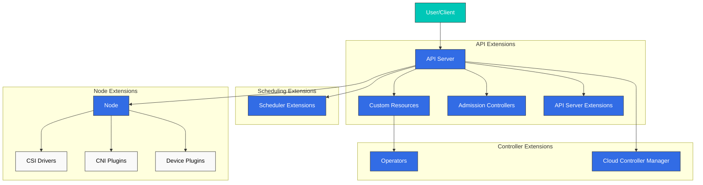
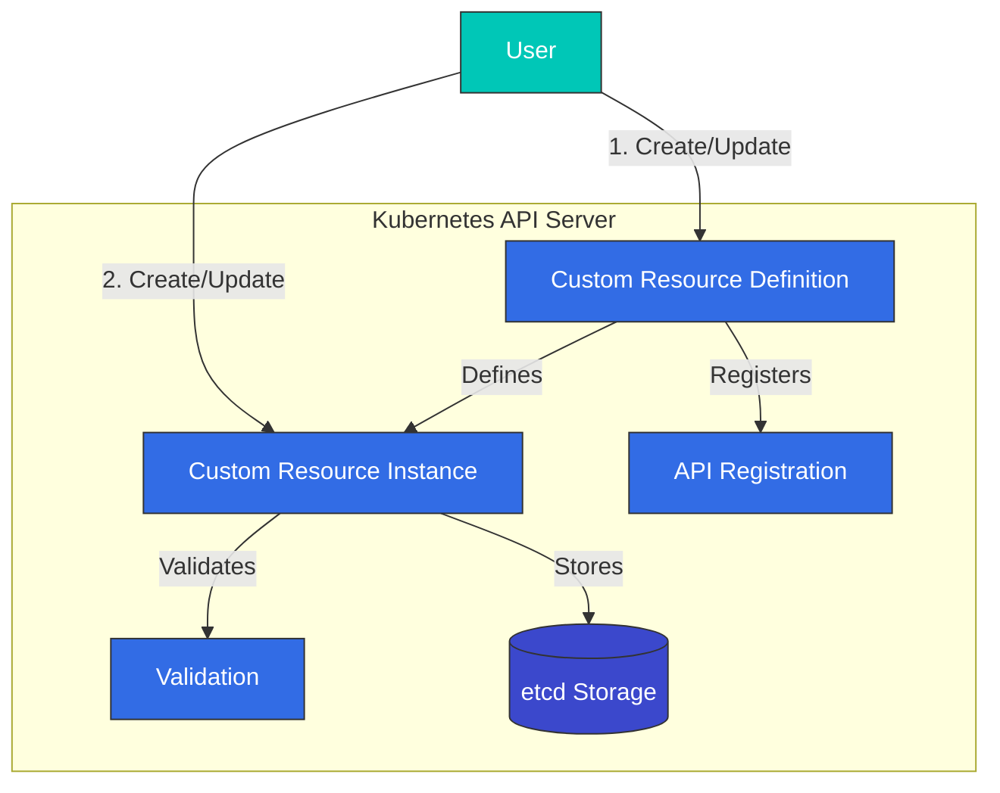
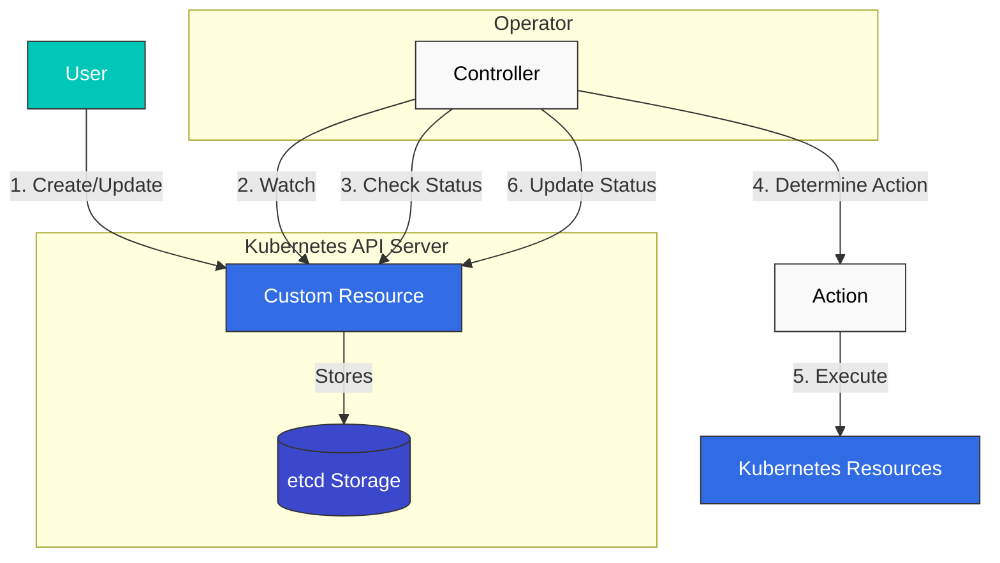
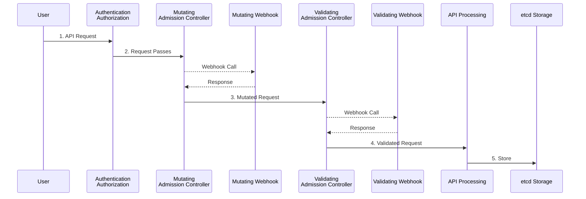
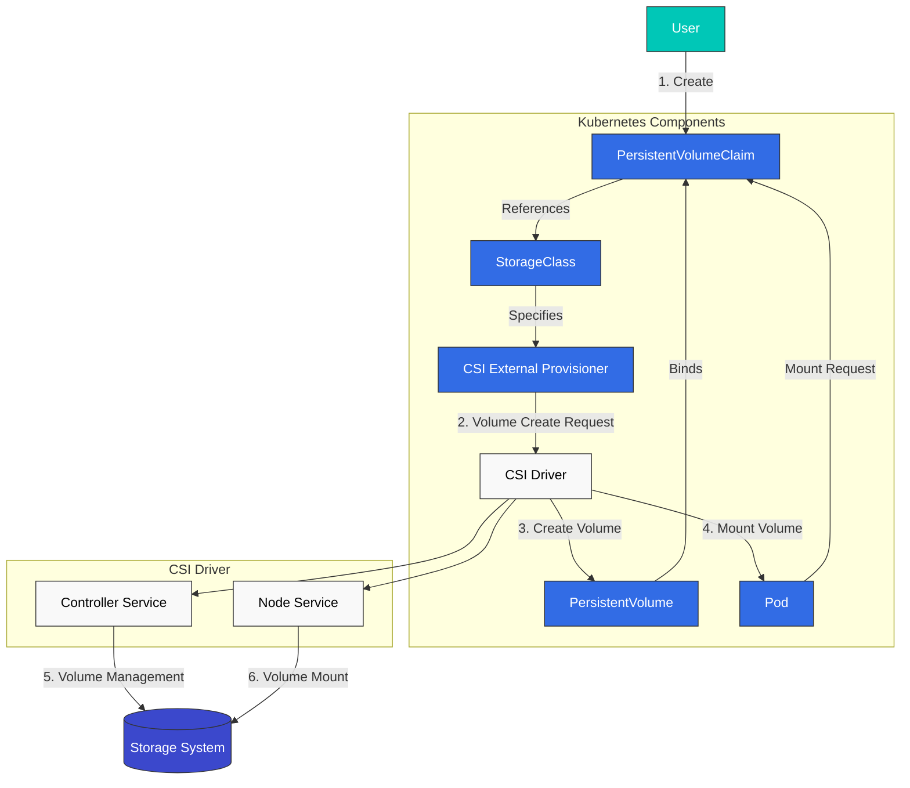
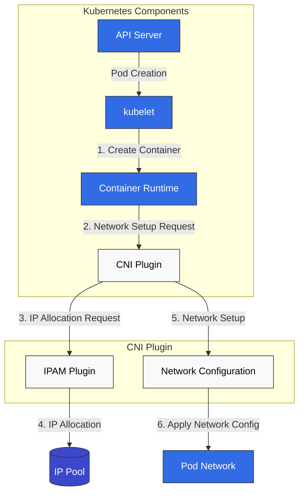
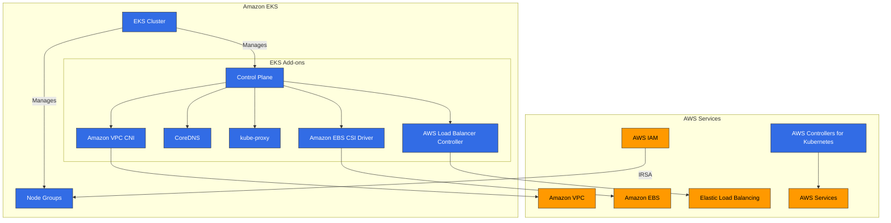

# Extending Kubernetes

> **Versiones compatibles**: Kubernetes 1.32, 1.33, 1.34
> **Última actualización**: February 19, 2026

Kubernetes es una plataforma diseñada con la extensibilidad en mente, lo que te permite ampliar su funcionalidad de diversas maneras. En este capítulo, exploraremos los distintos métodos para extender Kubernetes y cómo aprovechar las características de extensión en Amazon EKS.

## Table of Contents
1. [Kubernetes Extension Overview](#kubernetes-extension-overview)
2. [Custom Resources](#custom-resources)
3. [Operator Pattern](#operator-pattern)
4. [Admission Controllers](#admission-controllers)
5. [API Server Extensions](#api-server-extensions)
6. [Scheduler Extensions](#scheduler-extensions)
7. [Cloud Controller Manager](#cloud-controller-manager)
8. [CSI (Container Storage Interface)](#csi-container-storage-interface)
9. [CNI (Container Network Interface)](#cni-container-network-interface)
10. [Device Plugins](#device-plugins)
11. [Extension Features in Amazon EKS](#extension-features-in-amazon-eks)
12. [Best Practices](#best-practices)
13. [Conclusion](#conclusion)

## Kubernetes Extension Overview

Kubernetes proporciona varios puntos de extensión para ampliar y personalizar su funcionalidad base. Los principales puntos de extensión son:

1. **Custom Resources**: Definir nuevos tipos de objetos de API
2. **Operators**: Combinar custom resources y controllers para gestionar aplicaciones complejas
3. **Admission Controllers**: Interceptar, modificar o validar solicitudes de API
4. **API Server Extensions**: Agregar nuevos endpoints al API server
5. **Scheduler Extensions**: Personalizar la lógica de scheduling de pods
6. **Cloud Controller Manager**: Integrar características específicas del cloud provider
7. **CSI (Container Storage Interface)**: Integrar sistemas de storage
8. **CNI (Container Network Interface)**: Integrar soluciones de networking
9. **Device Plugins**: Integrar hardware especial

El siguiente diagrama muestra los principales puntos de extensión en Kubernetes:



### Choosing an Extension Method

Consideraciones al elegir un método de extensión adecuado:

1. **Use Case**: El tipo de funcionalidad que deseas extender
2. **Complexity**: Complejidad de la implementación y el mantenimiento
3. **Performance Impact**: Impacto de la extensión en el rendimiento del cluster
4. **Upgrade Compatibility**: Compatibilidad con actualizaciones de versión de Kubernetes
5. **Community Support**: Nivel de soporte de la comunidad para el método de extensión

## Custom Resources

Los custom resources (recursos personalizados) son una forma de extender la Kubernetes API para definir nuevos tipos de objetos.

El siguiente diagrama muestra cómo funcionan los custom resources:



### Custom Resource Definitions (CRD)

CRD es la forma más sencilla de definir nuevos tipos de recursos:

```yaml
apiVersion: apiextensions.k8s.io/v1
kind: CustomResourceDefinition
metadata:
  name: backups.example.com
spec:
  group: example.com
  names:
    kind: Backup
    listKind: BackupList
    plural: backups
    singular: backup
    shortNames:
    - bk
  scope: Namespaced
  versions:
  - name: v1
    served: true
    storage: true
    schema:
      openAPIV3Schema:
        type: object
        properties:
          spec:
            type: object
            properties:
              source:
                type: string
              destination:
                type: string
              schedule:
                type: string
            required:
            - source
            - destination
          status:
            type: object
            properties:
              phase:
                type: string
              lastBackupTime:
                type: string
                format: date-time
    subresources:
      status: {}
    additionalPrinterColumns:
    - name: Status
      type: string
      jsonPath: .status.phase
    - name: Age
      type: date
      jsonPath: .metadata.creationTimestamp
```

En el ejemplo anterior, definimos un nuevo tipo de recurso llamado `Backup` y especificamos el schema del recurso y las columnas de impresión adicionales.

### Creating Custom Resource Instances

Después de definir un CRD, puedes crear instancias de recurso de ese tipo:

```yaml
apiVersion: example.com/v1
kind: Backup
metadata:
  name: daily-backup
spec:
  source: /data
  destination: s3://my-bucket/backups
  schedule: "0 0 * * *"
```

### Custom Resource Validation

Puedes validar custom resources usando schemas OpenAPI v3 en CRDs:

```yaml
openAPIV3Schema:
  type: object
  properties:
    spec:
      type: object
      properties:
        replicas:
          type: integer
          minimum: 1
          maximum: 10
        image:
          type: string
          pattern: '^[a-zA-Z0-9./:_-]+$'
      required:
      - replicas
      - image
```

En el ejemplo anterior, el campo `replicas` debe ser un entero entre 1 y 10, y el campo `image` debe coincidir con el patrón especificado.

### Version Management

Los CRDs admiten múltiples versiones para permitir la evolución de la API:

```yaml
versions:
- name: v1alpha1
  served: true
  storage: false
- name: v1beta1
  served: true
  storage: false
- name: v1
  served: true
  storage: true
```

En el ejemplo anterior, se sirven tres versiones, `v1alpha1`, `v1beta1` y `v1`, pero los datos se almacenan en formato `v1`.

### Conversion Webhooks

Puedes usar conversion webhooks para manejar conversiones entre diferentes versiones:

```yaml
apiVersion: apiextensions.k8s.io/v1
kind: CustomResourceDefinition
metadata:
  name: backups.example.com
spec:
  # ... other fields omitted ...
  conversion:
    strategy: Webhook
    webhook:
      clientConfig:
        service:
          namespace: default
          name: example-conversion-webhook
          path: /convert
      conversionReviewVersions:
      - v1
```

## Operator Pattern

El operator pattern es una forma de automatizar el conocimiento operativo de aplicaciones complejas combinando custom resources y controllers.

El siguiente diagrama muestra cómo funciona el operator pattern:



### Operator Concepts

Un operator consta de los siguientes componentes:

1. **Custom Resource Definition (CRD)**: Define el schema de los recursos que se van a gestionar
2. **Controller**: Lógica que monitorea custom resources y los reconcilia con el estado deseado
3. **Kubernetes API Client**: Cliente para interactuar con la Kubernetes API

### Operator Example

Ejemplo de operator de base de datos:

```yaml
# Custom Resource Definition
apiVersion: apiextensions.k8s.io/v1
kind: CustomResourceDefinition
metadata:
  name: databases.example.com
spec:
  group: example.com
  names:
    kind: Database
    listKind: DatabaseList
    plural: databases
    singular: database
    shortNames:
    - db
  scope: Namespaced
  versions:
  - name: v1
    served: true
    storage: true
    schema:
      openAPIV3Schema:
        type: object
        properties:
          spec:
            type: object
            properties:
              engine:
                type: string
                enum:
                - mysql
                - postgresql
              version:
                type: string
              storageSize:
                type: string
              replicas:
                type: integer
                minimum: 1
            required:
            - engine
            - version
            - storageSize
          status:
            type: object
            properties:
              phase:
                type: string
              endpoint:
                type: string
    subresources:
      status: {}
```

```yaml
# Database Instance
apiVersion: example.com/v1
kind: Database
metadata:
  name: my-db
spec:
  engine: postgresql
  version: "13.4"
  storageSize: 10Gi
  replicas: 3
```

### Operator Development Tools

Herramientas para desarrollar operators:

1. **Operator SDK**: Desarrollar operators usando Go, Ansible o Helm
2. **KUDO (Kubernetes Universal Declarative Operator)**: Desarrollar operators de forma declarativa
3. **Kubebuilder**: Framework de desarrollo de operators basado en Go
4. **Metacontroller**: Desarrollo de operators basado en webhooks

#### Operator SDK Example

Crear un operator usando Operator SDK:

```bash
# Install Operator SDK
curl -LO https://github.com/operator-framework/operator-sdk/releases/download/v1.16.0/operator-sdk_linux_amd64
chmod +x operator-sdk_linux_amd64
mv operator-sdk_linux_amd64 /usr/local/bin/operator-sdk

# Create new operator project
operator-sdk init --domain example.com --repo github.com/example/database-operator

# Create API
operator-sdk create api --group database --version v1 --kind Database --resource --controller

# Implement controller (main.go, controllers/database_controller.go, etc.)

# Build and deploy operator
make docker-build docker-push
make deploy
```

### Popular Operators

Operators open source populares:

1. **Prometheus Operator**: Gestiona el stack de monitoreo de Prometheus
2. **Elasticsearch Operator**: Gestiona clusters de Elasticsearch
3. **etcd Operator**: Gestiona clusters de etcd
4. **PostgreSQL Operator**: Gestiona bases de datos PostgreSQL
5. **Jaeger Operator**: Gestiona el sistema de tracing distribuido Jaeger
6. **Strimzi Kafka Operator**: Gestiona clusters de Apache Kafka
7. **Istio Operator**: Gestiona Istio service mesh
## Admission Controllers

Los admission controllers son plugins que interceptan solicitudes al Kubernetes API server y las modifican o validan.

El siguiente diagrama muestra cómo funcionan los admission controllers:



### Admission Controller Types

Kubernetes tiene dos tipos de admission controllers:

1. **Mutating Admission Controllers**: Pueden modificar recursos
2. **Validating Admission Controllers**: Solo pueden validar recursos

### Built-in Admission Controllers

Kubernetes tiene varios admission controllers integrados:

1. **NamespaceLifecycle**: Evita la creación de recursos en namespaces que se están eliminando
2. **LimitRanger**: Establece límites de recursos predeterminados para pods y containers
3. **ServiceAccount**: Crea service accounts automáticamente y agrega tokens
4. **DefaultStorageClass**: Asigna la storage class predeterminada a PVCs
5. **ResourceQuota**: Limita el uso de recursos por namespace
6. **PodSecurityPolicy**: Aplica pod security policies
7. **NodeRestriction**: Limita los recursos que los nodes pueden modificar

### Webhook Admission Controllers

Puedes usar webhook admission controllers para implementar lógica personalizada:

```yaml
# Mutating Webhook Configuration
apiVersion: admissionregistration.k8s.io/v1
kind: MutatingWebhookConfiguration
metadata:
  name: pod-mutating-webhook
webhooks:
- name: pod-mutator.example.com
  clientConfig:
    service:
      namespace: default
      name: pod-mutating-webhook
      path: "/mutate"
    caBundle: <base64-encoded-ca-cert>
  rules:
  - apiGroups: [""]
    apiVersions: ["v1"]
    resources: ["pods"]
    operations: ["CREATE"]
    scope: "Namespaced"
  admissionReviewVersions: ["v1", "v1beta1"]
  sideEffects: None
  timeoutSeconds: 5
```

```yaml
# Validating Webhook Configuration
apiVersion: admissionregistration.k8s.io/v1
kind: ValidatingWebhookConfiguration
metadata:
  name: pod-validating-webhook
webhooks:
- name: pod-validator.example.com
  clientConfig:
    service:
      namespace: default
      name: pod-validating-webhook
      path: "/validate"
    caBundle: <base64-encoded-ca-cert>
  rules:
  - apiGroups: [""]
    apiVersions: ["v1"]
    resources: ["pods"]
    operations: ["CREATE", "UPDATE"]
    scope: "Namespaced"
  admissionReviewVersions: ["v1", "v1beta1"]
  sideEffects: None
  timeoutSeconds: 5
```

### Webhook Server Implementation

Un webhook server debe implementar endpoints como los siguientes:

```go
// Mutating webhook example
func mutateHandler(w http.ResponseWriter, r *http.Request) {
    var body []byte
    if r.Body != nil {
        if data, err := ioutil.ReadAll(r.Body); err == nil {
            body = data
        }
    }

    // Convert to AdmissionReview object
    admissionReview := v1.AdmissionReview{}
    if err := json.Unmarshal(body, &admissionReview); err != nil {
        http.Error(w, "Could not parse admission review request", http.StatusBadRequest)
        return
    }

    // Extract Pod object
    pod := corev1.Pod{}
    if err := json.Unmarshal(admissionReview.Request.Object.Raw, &pod); err != nil {
        http.Error(w, "Could not parse pod object", http.StatusBadRequest)
        return
    }

    // Create patch
    patches := []map[string]interface{}{
        {
            "op":    "add",
            "path":  "/metadata/labels/injected-by",
            "value": "mutating-webhook",
        },
    }

    patchBytes, _ := json.Marshal(patches)

    // Create response
    admissionResponse := v1.AdmissionResponse{
        UID:     admissionReview.Request.UID,
        Allowed: true,
        Patch:   patchBytes,
        PatchType: func() *v1.PatchType {
            pt := v1.PatchTypeJSONPatch
            return &pt
        }(),
    }

    admissionReview.Response = &admissionResponse
    resp, _ := json.Marshal(admissionReview)
    w.Header().Set("Content-Type", "application/json")
    w.Write(resp)
}
```

```go
// Validating webhook example
func validateHandler(w http.ResponseWriter, r *http.Request) {
    var body []byte
    if r.Body != nil {
        if data, err := ioutil.ReadAll(r.Body); err == nil {
            body = data
        }
    }

    // Convert to AdmissionReview object
    admissionReview := v1.AdmissionReview{}
    if err := json.Unmarshal(body, &admissionReview); err != nil {
        http.Error(w, "Could not parse admission review request", http.StatusBadRequest)
        return
    }

    // Extract Pod object
    pod := corev1.Pod{}
    if err := json.Unmarshal(admissionReview.Request.Object.Raw, &pod); err != nil {
        http.Error(w, "Could not parse pod object", http.StatusBadRequest)
        return
    }

    // Validation logic
    allowed := true
    var message string
    for _, container := range pod.Spec.Containers {
        if container.Image == "nginx:latest" {
            allowed = false
            message = "Using 'latest' tag is not allowed. Please specify a version."
            break
        }
    }

    // Create response
    admissionResponse := v1.AdmissionResponse{
        UID:     admissionReview.Request.UID,
        Allowed: allowed,
    }

    if !allowed {
        admissionResponse.Result = &metav1.Status{
            Message: message,
        }
    }

    admissionReview.Response = &admissionResponse
    resp, _ := json.Marshal(admissionReview)
    w.Header().Set("Content-Type", "application/json")
    w.Write(resp)
}
```

### Popular Admission Controller Projects

1. **OPA Gatekeeper**: Aplicación de políticas usando Open Policy Agent
2. **Kyverno**: Motor de políticas basado en YAML
3. **Istio**: Inyección de sidecar para service mesh
4. **cert-manager**: Gestión de certificados TLS

## API Server Extensions

Las API server extensions son una forma de agregar nuevos endpoints al Kubernetes API server.

### Extension API Servers

Los extension API servers son servers que se ejecutan por separado del Kubernetes API server y proporcionan APIs personalizadas:

```yaml
# APIService Definition
apiVersion: apiregistration.k8s.io/v1
kind: APIService
metadata:
  name: v1.example.com
spec:
  group: example.com
  version: v1
  groupPriorityMinimum: 1000
  versionPriority: 15
  service:
    name: example-api
    namespace: default
  caBundle: <base64-encoded-ca-cert>
```

### Extension API Server Implementation

Un extension API server consta de los siguientes componentes:

1. **API Server**: Proporciona una interfaz similar al Kubernetes API server
2. **Resource Handlers**: Maneja solicitudes para tipos de recursos específicos
3. **Storage Backend**: Almacena datos de recursos

```go
// Extension API Server Example
func main() {
    // Server configuration
    config := genericapiserver.NewRecommendedConfig(apiserver.Codecs)
    config.OpenAPIConfig = genericapiserver.DefaultOpenAPIConfig(
        sampleopenapi.GetOpenAPIDefinitions,
        openapi.NewDefinitionNamer(apiserver.Scheme),
    )
    config.EnableIndex = true
    config.EnableDiscovery = true

    // Create server
    server, err := config.Complete().New("sample-apiserver", genericapiserver.NewEmptyDelegate())
    if err != nil {
        log.Fatalf("Error creating server: %v", err)
    }

    // Set API group info
    apiGroupInfo := genericapiserver.NewDefaultAPIGroupInfo(
        samplev1alpha1.GroupName,
        apiserver.Scheme,
        metav1.ParameterCodec,
        apiserver.Codecs,
    )

    // Set storage
    apiGroupInfo.VersionedResourcesStorageMap["v1alpha1"] = map[string]rest.Storage{
        "widgets": NewWidgetStorage(),
    }

    // Install API group
    if err := server.InstallAPIGroup(&apiGroupInfo); err != nil {
        log.Fatalf("Error installing API group: %v", err)
    }

    // Run server
    if err := server.PrepareRun().Run(stopCh); err != nil {
        log.Fatalf("Error running server: %v", err)
    }
}
```

### Aggregation Layer

La aggregation layer hace que múltiples API servers aparezcan como un solo API server:

```
                                   +-----------------+
                                   |                 |
                                   |  kube-apiserver |
                                   |                 |
                                   +-------+---------+
                                           |
                                           v
                      +--------------------+--------------------+
                      |                                         |
                      |                                         |
          +-----------v-----------+               +------------v------------+
          |                       |               |                         |
          |  metrics-server       |               |  example-apiserver      |
          |                       |               |                         |
          +-----------------------+               +-------------------------+
```

## Scheduler Extensions

Las scheduler extensions son una forma de personalizar el comportamiento del Kubernetes scheduler.

### Scheduler Framework

El scheduler framework introducido en Kubernetes 1.15 permite extender varias etapas del pipeline de scheduling mediante plugins:

1. **Queue Sort**: Ordenar pods en la scheduling queue
2. **Pre-filter**: Comprobar el estado del pod y del cluster antes del filtrado
3. **Filter**: Filtrar nodes que no pueden ejecutar el pod
4. **Post-filter**: Realizar acciones después del filtrado
5. **Pre-score**: Realizar acciones antes del cálculo de score
6. **Score**: Asignar scores a los nodes
7. **Normalize Score**: Normalizar scores
8. **Reserve**: Reservar recursos para el pod
9. **Permit**: Permitir, denegar o retrasar el scheduling del pod
10. **Pre-bind**: Realizar acciones antes del binding
11. **Bind**: Vincular el pod a un node
12. **Post-bind**: Realizar acciones después del binding

### Scheduler Configuration

Ejemplo de configuración del scheduler:

```yaml
apiVersion: kubescheduler.config.k8s.io/v1beta1
kind: KubeSchedulerConfiguration
leaderElection:
  leaderElect: true
clientConnection:
  kubeconfig: /etc/kubernetes/scheduler.conf
profiles:
- schedulerName: default-scheduler
  plugins:
    queueSort:
      enabled:
      - name: PrioritySort
    preFilter:
      enabled:
      - name: NodeResourcesFit
      - name: NodePorts
      - name: PodTopologySpread
      - name: InterPodAffinity
      - name: VolumeBinding
      - name: NodeAffinity
    filter:
      enabled:
      - name: NodeUnschedulable
      - name: NodeName
      - name: TaintToleration
      - name: NodeAffinity
      - name: NodePorts
      - name: NodeResourcesFit
      - name: VolumeRestrictions
      - name: EBSLimits
      - name: GCEPDLimits
      - name: NodeVolumeLimits
      - name: AzureDiskLimits
      - name: VolumeBinding
      - name: VolumeZone
      - name: PodTopologySpread
      - name: InterPodAffinity
    postFilter:
      enabled:
      - name: DefaultPreemption
    preScore:
      enabled:
      - name: InterPodAffinity
      - name: PodTopologySpread
      - name: TaintToleration
      - name: NodeAffinity
    score:
      enabled:
      - name: NodeResourcesBalancedAllocation
        weight: 1
      - name: ImageLocality
        weight: 1
      - name: InterPodAffinity
        weight: 1
      - name: NodeResourcesFit
        weight: 1
      - name: NodeAffinity
        weight: 1
      - name: PodTopologySpread
        weight: 2
      - name: TaintToleration
        weight: 1
    reserve:
      enabled:
      - name: VolumeBinding
    permit:
      enabled: []
    preBind:
      enabled:
      - name: VolumeBinding
    bind:
      enabled:
      - name: DefaultBinder
    postBind:
      enabled: []
```

### Custom Scheduler

También puedes implementar tu propio scheduler para ejecutarlo junto con Kubernetes:

```yaml
apiVersion: apps/v1
kind: Deployment
metadata:
  name: custom-scheduler
  namespace: kube-system
spec:
  replicas: 1
  selector:
    matchLabels:
      app: custom-scheduler
  template:
    metadata:
      labels:
        app: custom-scheduler
    spec:
      serviceAccountName: custom-scheduler
      containers:
      - name: custom-scheduler
        image: example/custom-scheduler:v1.0.0
        command:
        - /custom-scheduler
        - --kubeconfig=/etc/kubernetes/scheduler.conf
        volumeMounts:
        - name: kubeconfig
          mountPath: /etc/kubernetes/scheduler.conf
          readOnly: true
      volumes:
      - name: kubeconfig
        hostPath:
          path: /etc/kubernetes/scheduler.conf
          type: File
```

Especificar un scheduler personalizado para un pod:

```yaml
apiVersion: v1
kind: Pod
metadata:
  name: custom-scheduled-pod
spec:
  schedulerName: custom-scheduler
  containers:
  - name: container
    image: nginx
```

## Cloud Controller Manager

El cloud controller manager proporciona una interfaz entre Kubernetes y los cloud providers.

### Cloud Controller Manager Components

El cloud controller manager consta de los siguientes controllers:

1. **Node Controller**: Actualiza información de nodes mediante APIs del cloud provider
2. **Route Controller**: Configura rutas en cloud networks
3. **Service Controller**: Crea, actualiza y elimina cloud load balancers

### AWS Cloud Controller Manager

Ejemplo de configuración de AWS Cloud Controller Manager:

```yaml
apiVersion: v1
kind: ConfigMap
metadata:
  name: aws-cloud-controller-manager
  namespace: kube-system
data:
  cloud.conf: |
    [global]
    zone = us-east-1a
    vpc = vpc-xxx
    subnet-id = subnet-xxx
    role-arn = arn:aws:iam::xxx:role/xxx
    kubernetes.io/cluster/my-cluster = owned
---
apiVersion: apps/v1
kind: DaemonSet
metadata:
  name: aws-cloud-controller-manager
  namespace: kube-system
spec:
  selector:
    matchLabels:
      k8s-app: aws-cloud-controller-manager
  template:
    metadata:
      labels:
        k8s-app: aws-cloud-controller-manager
    spec:
      nodeSelector:
        node-role.kubernetes.io/master: ""
      tolerations:
      - key: node.cloudprovider.kubernetes.io/uninitialized
        value: "true"
        effect: NoSchedule
      - key: node-role.kubernetes.io/master
        effect: NoSchedule
      serviceAccountName: cloud-controller-manager
      containers:
      - name: aws-cloud-controller-manager
        image: k8s.gcr.io/cloud-controller-manager:v1.21.0
        command:
        - /usr/local/bin/cloud-controller-manager
        - --cloud-provider=aws
        - --cloud-config=/etc/kubernetes/cloud.conf
        - --use-service-account-credentials
        - --allocate-node-cidrs=false
        volumeMounts:
        - name: cloud-config
          mountPath: /etc/kubernetes/cloud.conf
          readOnly: true
      volumes:
      - name: cloud-config
        configMap:
          name: aws-cloud-controller-manager
```
## CSI (Container Storage Interface)

CSI proporciona una interfaz estándar entre Kubernetes y los sistemas de storage.

El siguiente diagrama muestra la arquitectura y operación de CSI:



### CSI Architecture

CSI consta de los siguientes componentes:

1. **CSI Controller Plugin**: Maneja la creación, eliminación, snapshots, etc. de volumes
2. **CSI Node Plugin**: Maneja el montaje, desmontaje, etc. de volumes
3. **CSI Driver**: Implementación que se integra con sistemas de storage específicos

```
+-------------------+
|                   |
|  Kubernetes       |
|  (External        |
|   Provisioner)    |
|                   |
+--------+----------+
         |
         | gRPC
         v
+--------+----------+
|                   |
|  CSI Driver       |
|                   |
+--------+----------+
         |
         | Storage Protocol
         v
+--------+----------+
|                   |
|  Storage System   |
|                   |
+-------------------+
```

### CSI Driver Deployment

Ejemplo de deployment de CSI driver:

```yaml
# CSI Controller Service
apiVersion: apps/v1
kind: Deployment
metadata:
  name: csi-controller
spec:
  replicas: 1
  selector:
    matchLabels:
      app: csi-controller
  template:
    metadata:
      labels:
        app: csi-controller
    spec:
      serviceAccountName: csi-controller
      containers:
      - name: csi-provisioner
        image: k8s.gcr.io/sig-storage/csi-provisioner:v2.1.0
        args:
        - "--csi-address=$(ADDRESS)"
        - "--v=5"
        env:
        - name: ADDRESS
          value: /var/lib/csi/sockets/pluginproxy/csi.sock
        volumeMounts:
        - name: socket-dir
          mountPath: /var/lib/csi/sockets/pluginproxy/
      - name: csi-attacher
        image: k8s.gcr.io/sig-storage/csi-attacher:v3.1.0
        args:
        - "--csi-address=$(ADDRESS)"
        - "--v=5"
        env:
        - name: ADDRESS
          value: /var/lib/csi/sockets/pluginproxy/csi.sock
        volumeMounts:
        - name: socket-dir
          mountPath: /var/lib/csi/sockets/pluginproxy/
      - name: csi-driver
        image: example/csi-driver:v1.0.0
        args:
        - "--endpoint=$(CSI_ENDPOINT)"
        - "--nodeid=$(NODE_ID)"
        env:
        - name: CSI_ENDPOINT
          value: unix:///var/lib/csi/sockets/pluginproxy/csi.sock
        - name: NODE_ID
          valueFrom:
            fieldRef:
              fieldPath: spec.nodeName
        volumeMounts:
        - name: socket-dir
          mountPath: /var/lib/csi/sockets/pluginproxy/
      volumes:
      - name: socket-dir
        emptyDir: {}

# CSI Node Service
apiVersion: apps/v1
kind: DaemonSet
metadata:
  name: csi-node
spec:
  selector:
    matchLabels:
      app: csi-node
  template:
    metadata:
      labels:
        app: csi-node
    spec:
      serviceAccountName: csi-node
      hostNetwork: true
      containers:
      - name: csi-node-driver-registrar
        image: k8s.gcr.io/sig-storage/csi-node-driver-registrar:v2.1.0
        args:
        - "--csi-address=$(ADDRESS)"
        - "--kubelet-registration-path=$(DRIVER_REG_SOCK_PATH)"
        - "--v=5"
        env:
        - name: ADDRESS
          value: /csi/csi.sock
        - name: DRIVER_REG_SOCK_PATH
          value: /var/lib/kubelet/plugins/example.csi.k8s.io/csi.sock
        volumeMounts:
        - name: plugin-dir
          mountPath: /csi
        - name: registration-dir
          mountPath: /registration
      - name: csi-driver
        image: example/csi-driver:v1.0.0
        args:
        - "--endpoint=$(CSI_ENDPOINT)"
        - "--nodeid=$(NODE_ID)"
        env:
        - name: CSI_ENDPOINT
          value: unix:///csi/csi.sock
        - name: NODE_ID
          valueFrom:
            fieldRef:
              fieldPath: spec.nodeName
        securityContext:
          privileged: true
        volumeMounts:
        - name: plugin-dir
          mountPath: /csi
        - name: pods-mount-dir
          mountPath: /var/lib/kubelet/pods
          mountPropagation: "Bidirectional"
      volumes:
      - name: plugin-dir
        hostPath:
          path: /var/lib/kubelet/plugins/example.csi.k8s.io
          type: DirectoryOrCreate
      - name: registration-dir
        hostPath:
          path: /var/lib/kubelet/plugins_registry
          type: Directory
      - name: pods-mount-dir
        hostPath:
          path: /var/lib/kubelet/pods
          type: Directory
```

### Storage Class and PVC

Ejemplo de storage class y PVC usando CSI driver:

```yaml
# Storage Class
apiVersion: storage.k8s.io/v1
kind: StorageClass
metadata:
  name: example-csi
provisioner: example.csi.k8s.io
parameters:
  type: ssd
  fsType: ext4
reclaimPolicy: Delete
allowVolumeExpansion: true
volumeBindingMode: Immediate

# PVC
apiVersion: v1
kind: PersistentVolumeClaim
metadata:
  name: example-pvc
spec:
  accessModes:
  - ReadWriteOnce
  resources:
    requests:
      storage: 10Gi
  storageClassName: example-csi
```

### Popular CSI Drivers

1. **AWS EBS CSI Driver**: Gestión de volumes AWS EBS
2. **AWS EFS CSI Driver**: Gestión del file system AWS EFS
3. **GCE PD CSI Driver**: Gestión de persistent disks de Google Compute Engine
4. **Azure Disk CSI Driver**: Gestión de Azure disks
5. **Ceph RBD CSI Driver**: Gestión de volumes Ceph RBD
6. **NFS CSI Driver**: Gestión de volumes NFS

## CNI (Container Network Interface)

CNI proporciona una interfaz estándar entre Kubernetes y las soluciones de networking.

El siguiente diagrama muestra la arquitectura y operación de CNI:



### CNI Architecture

CNI consta de los siguientes componentes:

1. **CNI Plugin**: Configura interfaces de red de containers
2. **IPAM Plugin**: Asignación y gestión de direcciones IP
3. **Meta Plugin**: Combina múltiples plugins

```
+-------------------+
|                   |
|  Kubernetes       |
|  (kubelet)        |
|                   |
+--------+----------+
         |
         | CNI Spec
         v
+--------+----------+
|                   |
|  CNI Plugin       |
|                   |
+--------+----------+
         |
         | Network Configuration
         v
+--------+----------+
|                   |
|  Network          |
|                   |
+-------------------+
```

### CNI Plugin Configuration

Ejemplo de configuración de CNI plugin:

```json
{
  "cniVersion": "0.4.0",
  "name": "example-network",
  "type": "bridge",
  "bridge": "cni0",
  "isGateway": true,
  "ipMasq": true,
  "ipam": {
    "type": "host-local",
    "subnet": "10.244.0.0/24",
    "routes": [
      { "dst": "0.0.0.0/0" }
    ]
  }
}
```

### Popular CNI Plugins

1. **Calico**: CNI con network policy mejorada y características de seguridad
2. **Flannel**: Proporciona overlay networking simple
3. **Cilium**: Solución de networking y seguridad basada en eBPF
4. **Weave Net**: Solución de container networking multi-host
5. **AWS VPC CNI**: CNI integrado con AWS VPC
6. **Azure CNI**: CNI integrado con redes virtuales de Azure
7. **Antrea**: Solución de networking basada en Open vSwitch

### CNI Plugin Installation

Ejemplo de instalación de Calico CNI plugin:

```bash
kubectl apply -f https://docs.projectcalico.org/manifests/calico.yaml
```

## Device Plugins

Los device plugins proporcionan una interfaz entre Kubernetes y hardware especial.

### Device Plugin Architecture

Los device plugins constan de los siguientes componentes:

1. **Device Plugin Server**: Maneja descubrimiento, asignación, inicialización, etc. de devices
2. **kubelet**: Se comunica con device plugins para asignar devices a pods

```
+-------------------+
|                   |
|  Kubernetes       |
|  (kubelet)        |
|                   |
+--------+----------+
         |
         | Device Plugin API
         v
+--------+----------+
|                   |
|  Device Plugin    |
|                   |
+--------+----------+
         |
         | Device Management
         v
+--------+----------+
|                   |
|  Hardware Device  |
|                   |
+-------------------+
```

### NVIDIA GPU Device Plugin

Ejemplo de deployment de NVIDIA GPU device plugin:

```yaml
apiVersion: apps/v1
kind: DaemonSet
metadata:
  name: nvidia-device-plugin-daemonset
  namespace: kube-system
spec:
  selector:
    matchLabels:
      name: nvidia-device-plugin-ds
  template:
    metadata:
      labels:
        name: nvidia-device-plugin-ds
    spec:
      tolerations:
      - key: nvidia.com/gpu
        operator: Exists
        effect: NoSchedule
      containers:
      - name: nvidia-device-plugin-ctr
        image: nvidia/k8s-device-plugin:v0.9.0
        securityContext:
          allowPrivilegeEscalation: false
          capabilities:
            drop: ["ALL"]
        volumeMounts:
        - name: device-plugin
          mountPath: /var/lib/kubelet/device-plugins
      volumes:
      - name: device-plugin
        hostPath:
          path: /var/lib/kubelet/device-plugins
```

### GPU Request Pod

Ejemplo de Pod que solicita GPU:

```yaml
apiVersion: v1
kind: Pod
metadata:
  name: gpu-pod
spec:
  containers:
  - name: cuda-container
    image: nvidia/cuda:11.0-base
    command: ["nvidia-smi"]
    resources:
      limits:
        nvidia.com/gpu: 1
```

### Popular Device Plugins

1. **NVIDIA GPU Device Plugin**: Gestión de GPUs NVIDIA
2. **AMD GPU Device Plugin**: Gestión de GPUs AMD
3. **FPGA Device Plugin**: Gestión de devices FPGA
4. **InfiniBand Device Plugin**: Gestión de devices InfiniBand
5. **SR-IOV Network Device Plugin**: Gestión de devices de red SR-IOV

## Extension Features in Amazon EKS

Amazon EKS admite varias características de extensión para ampliar la funcionalidad del cluster Kubernetes.

El siguiente diagrama muestra la arquitectura de características de extensión en Amazon EKS:



### EKS Add-ons

Amazon EKS proporciona los siguientes add-ons:

1. **Amazon VPC CNI**: Networking integrado con AWS VPC
2. **CoreDNS**: Servicio DNS dentro del cluster
3. **kube-proxy**: Network proxy
4. **Amazon EBS CSI Driver**: Gestión de volumes EBS
5. **AWS Load Balancer Controller**: Gestión de AWS load balancers

```bash
# List EKS add-ons
aws eks list-addons --cluster-name my-cluster

# Install EKS add-on
aws eks create-addon \
  --cluster-name my-cluster \
  --addon-name amazon-ebs-csi-driver \
  --service-account-role-arn arn:aws:iam::123456789012:role/AmazonEKS_EBS_CSI_DriverRole

# Update EKS add-on
aws eks update-addon \
  --cluster-name my-cluster \
  --addon-name amazon-ebs-csi-driver \
  --addon-version v1.5.0-eksbuild.1

# Delete EKS add-on
aws eks delete-addon \
  --cluster-name my-cluster \
  --addon-name amazon-ebs-csi-driver
```

### AWS Controllers for Kubernetes (ACK)

ACK es una colección de operators que permite gestionar recursos AWS desde Kubernetes:

```bash
# Install ACK controller
helm repo add ack-controller https://aws.github.io/aws-controllers-k8s
helm install ack-s3-controller ack-controller/s3-chart

# Create S3 bucket
cat <<EOF | kubectl apply -f -
apiVersion: s3.services.k8s.aws/v1alpha1
kind: Bucket
metadata:
  name: my-bucket
spec:
  name: my-bucket-123456
EOF
```

### AWS Load Balancer Controller

El AWS Load Balancer Controller integra Kubernetes services e ingresses con AWS load balancers:

```yaml
# ALB Ingress example
apiVersion: networking.k8s.io/v1
kind: Ingress
metadata:
  name: example-ingress
  annotations:
    kubernetes.io/ingress.class: alb
    alb.ingress.kubernetes.io/scheme: internet-facing
    alb.ingress.kubernetes.io/target-type: ip
spec:
  rules:
  - host: example.com
    http:
      paths:
      - path: /
        pathType: Prefix
        backend:
          service:
            name: example-service
            port:
              number: 80
```

### IAM Roles for Service Accounts (IRSA)

IRSA permite que los pods accedan de forma segura a servicios AWS asociando roles de AWS IAM con Kubernetes service accounts:

```bash
# Create OIDC provider
eksctl utils associate-iam-oidc-provider \
  --cluster my-cluster \
  --approve

# Create IAM role and service account
eksctl create iamserviceaccount \
  --cluster my-cluster \
  --namespace default \
  --name my-service-account \
  --attach-policy-arn arn:aws:iam::aws:policy/AmazonS3ReadOnlyAccess \
  --approve

# Pod using service account
cat <<EOF | kubectl apply -f -
apiVersion: v1
kind: Pod
metadata:
  name: s3-reader
spec:
  serviceAccountName: my-service-account
  containers:
  - name: aws-cli
    image: amazon/aws-cli:latest
    command:
    - sleep
    - "3600"
EOF
```

## Best Practices

Exploremos las best practices que se deben considerar al implementar características de extensión de Kubernetes.

### Design Best Practices

1. **Use Standard Interfaces**: Usar interfaces estándar como CSI y CNI cuando sea posible
2. **Declarative API Design**: Diseñar APIs declarativas en lugar de imperativas
3. **Follow Kubernetes Design Principles**: Seguir principios como controller pattern y level-triggering
4. **Version Management**: Gestionar versiones de API y mantener compatibilidad
5. **Least Privilege Principle**: Conceder solo los permisos mínimos necesarios

### Implementation Best Practices

1. **Leverage Reusable Libraries**: Aprovechar librerías como client-go y controller-runtime
2. **Proper Error Handling**: Manejo y logging adecuados para situaciones de error
3. **Exponential Backoff**: Usar exponential backoff para reintentos
4. **Set Resource Limits**: Establecer límites de memoria y CPU
5. **Status Reporting**: Reportar el estado de los recursos con precisión

### Deployment Best Practices

1. **Gradual Rollout**: Implementar gradualmente en lugar de cambiar todo de una vez
2. **Version Management**: Evitar usar la etiqueta latest para images
3. **Health Checks**: Configurar probes de liveness y readiness adecuadas
4. **Logging and Monitoring**: Configurar logging y monitoreo integrales
5. **Documentation**: Documentar APIs y uso

### Security Best Practices

1. **Least Privilege Principle**: Conceder solo los permisos mínimos necesarios
2. **Use RBAC**: Configurar políticas RBAC adecuadas
3. **Network Policies**: Configurar network policies adecuadas
4. **Image Scanning**: Escanear container images en busca de vulnerabilidades
5. **Secret Management**: Gestionar secrets de forma segura

### EKS-Specific Best Practices

1. **Use Managed Add-ons**: Usar EKS managed add-ons cuando sea posible
2. **Use IRSA**: Usar IRSA para la gestión de permisos IAM por pod
3. **VPC CNI Configuration**: Configurar VPC CNI según los requisitos de networking
4. **Security Groups**: Configurar security groups adecuados
5. **Cost Optimization**: Seleccionar tipos y tamaños de instancias adecuados

## Conclusion

Kubernetes proporciona varios puntos de extensión para ampliar y personalizar su funcionalidad base. Custom resources, operators, admission controllers, API server extensions, scheduler extensions, CSI, CNI y device plugins te permiten adaptar Kubernetes a varios entornos y requisitos.

Amazon EKS admite estas características de extensión y además proporciona características específicas de AWS como EKS add-ons, ACK, AWS Load Balancer Controller e IRSA para simplificar la integración entre Kubernetes y los servicios AWS.

Al implementar características de extensión de Kubernetes, es importante seguir best practices como usar interfaces estándar, diseño de API declarativo y el least privilege principle. Esto te permite construir entornos Kubernetes estables y escalables.

## Quiz

Para comprobar lo que aprendiste en este capítulo, prueba el [Extending Kubernetes Quiz](../quizzes/core/11-extending-kubernetes-quiz.md).
