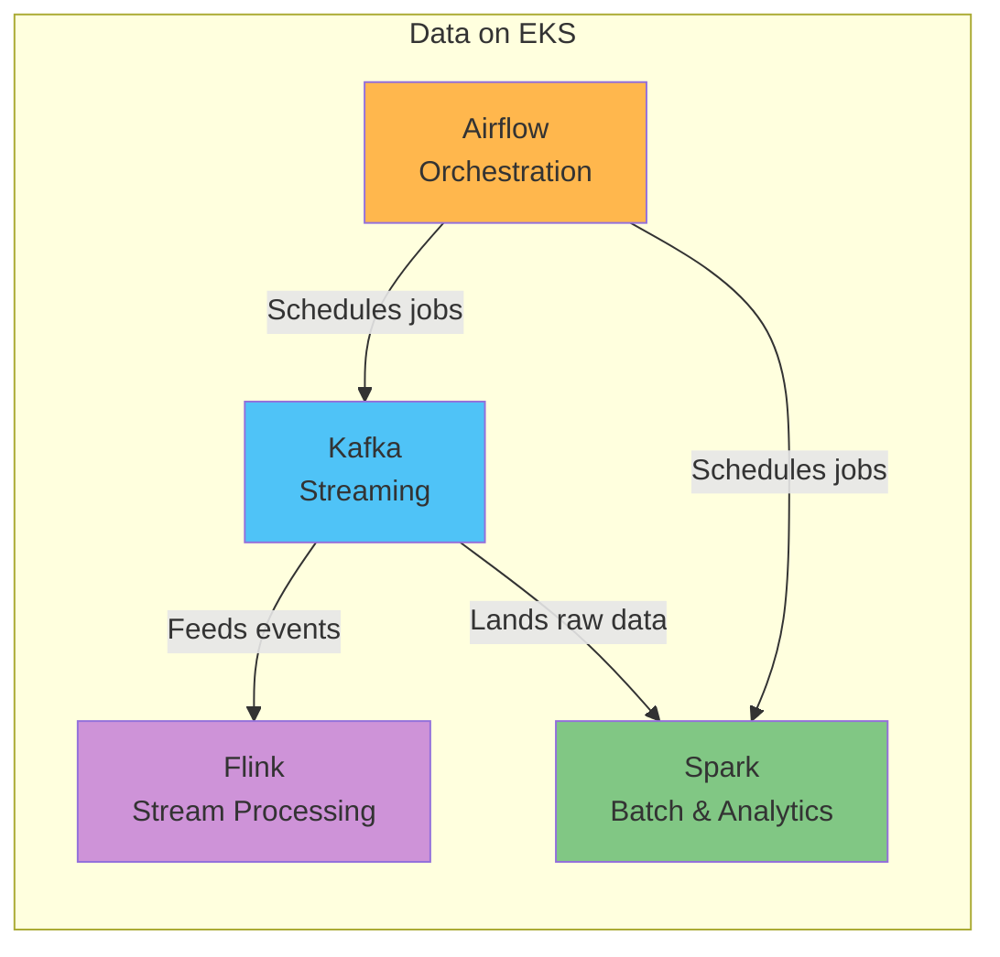

# Data on EKS

> **Última actualización**: July 9, 2026

## Descripción general

"Data on EKS" cubre la ejecución de las cargas de trabajo principales del ecosistema de datos de AWS — streaming, procesamiento batch y orquestación de workflows — como aplicaciones nativas de Kubernetes en Amazon EKS, en lugar de depender únicamente de servicios completamente administrados. Al desplegar herramientas como Kafka, Spark, Airflow y Flink mediante containers y el patrón Operator, puedes gestionar cargas de trabajo de datos con las mismas prácticas de despliegue, observabilidad y escalado que ya usas para el resto de tu plataforma en EKS.

Esta sección no pretende argumentar en contra de servicios completamente administrados como Amazon MSK, Amazon EMR o Amazon MWAA. Ambos enfoques implican trade-offs reales, y la mayoría de los equipos terminan eligiéndolos — o combinándolos — según la capacidad operativa, las necesidades de personalización y la estructura de costos. Esta sección se centra en lo que necesitas saber una vez que has decidido ejecutar estas herramientas directamente en EKS.

## Categorías de cargas de trabajo de datos

Las herramientas en el ámbito de las plataformas de datos generalmente se dividen en cuatro categorías, cada una de las cuales resuelve un problema diferente.

| Categoría | Problema que resuelve | Herramienta representativa | Cobertura de Data on EKS |
|----------|--------------------|----------------------|------------------------|
| **Streaming** | Publicar/suscribirse a eventos en tiempo real y conectar de forma confiable la comunicación asíncrona entre sistemas | Apache Kafka | Disponible — [Kafka on EKS](kafka/README.md) |
| **Batch & Analytics** | Procesamiento distribuido de grandes datasets para pipelines de ETL, agregación y ML | Apache Spark | Próximamente |
| **Orchestration** | Definir dependencias y schedules entre jobs de datos y gestionar su ejecución | Apache Airflow | Próximamente |
| **Stream Processing** | Realizar agregación, transformación y cómputo con estado en tiempo real sobre datos de streaming | Apache Flink | Próximamente |

## Por qué ejecutar estas herramientas en EKS

Los servicios completamente administrados reducen de forma significativa la carga operativa, pero cada vez más equipos eligen ejecutar estas herramientas de forma nativa en EKS por motivos como:

- **Operaciones y observabilidad unificadas**: Las cargas de trabajo de datos pueden gestionarse con los mismos workflows de `kubectl` y GitOps, y el mismo stack de Prometheus/Grafana utilizado en el resto de la plataforma, en lugar de mantener una toolchain separada.
- **Autoscaling**: El autoscaling de nodes impulsado por [Karpenter](../autoscaling/02-karpenter.md), combinado con HPA/KEDA, te permite escalar brokers, workers y executors con precisión para ajustarse a la demanda de la carga de trabajo.
- **Eficiencia de costos**: Técnicas de [optimización de costos de EKS](../eks/07-eks-cost-optimization.md) — Spot Instances, mayor densidad de bin-packing, etc. — se aplican igual de bien a las cargas de trabajo de datos que a cualquier otro servicio.
- **Multi-tenancy (multitenencia)**: Las primitivas de aislamiento de Kubernetes — namespaces, ResourceQuotas, NetworkPolicies — permiten que varios equipos y cargas de trabajo compartan de forma segura un único cluster.

Este enfoque sí conlleva trade-offs: tu equipo asume directamente la gestión de Operators, el diseño de storage y la estrategia de upgrade. Los análisis profundos que siguen abordan ese equilibrio en detalle para cada herramienta.

## Actualmente cubierto

- [Kafka on EKS](kafka/README.md) — Un análisis profundo de 8 partes sobre cómo desplegar y operar Apache Kafka en EKS usando el Strimzi Operator.

## Hoja de ruta

Los siguientes temas están planificados para futuras incorporaciones:

- **Apache Spark** — Procesamiento batch distribuido y pipelines de analytics en EKS
- **Apache Airflow** — Orquestación de workflows en EKS
- **Apache Flink** — Procesamiento de streams en tiempo real en EKS

## Siguientes pasos

1. [Kafka on EKS](kafka/README.md) — Análisis profundo de Kafka basado en Strimzi
