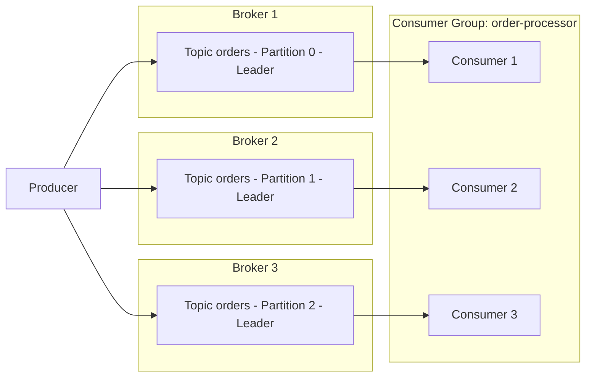

# Parte 1: Fundamentos de Kafka

> **Versiones compatibles**: Apache Kafka 3.9 (modo KRaft)\
> **Última actualización**: July 9, 2026

## ¿Qué es Apache Kafka?

Apache Kafka es una plataforma distribuida de event streaming diseñada para manejar flujos de datos en tiempo real y de alto volumen. Desarrollada originalmente en LinkedIn y posteriormente publicada como un proyecto de código abierto de Apache, se usa ampliamente para agregación de logs, pipelines de métricas, microservices basados en eventos y pipelines de change data capture (CDC).

Este documento cubre los conceptos principales que necesitas antes de ejecutar Kafka en EKS: brokers, topics, partitions, consumer groups, replication y KRaft. La Parte 2 muestra cómo desplegar estos conceptos en un cluster de EKS real usando el Strimzi Operator.

## 1. Conceptos básicos de la arquitectura de Kafka

### Terminología principal

* **Broker**: Un proceso de servidor Kafka que almacena mensajes y atiende solicitudes de clientes. Un cluster de Kafka normalmente está compuesto por varios brokers.
* **Topic**: Un canal lógico usado para categorizar mensajes, como `orders` o `payments`.
* **Partition**: La unidad física en la que se divide un topic. Cada partition es un log ordenado, de solo anexado e inmutable.
* **Offset**: Un número secuencial y único asignado a cada mensaje dentro de una partition. Los consumers rastrean "hasta dónde han leído" usando offsets.
* **Replication Factor**: La cantidad de brokers a los que se copian los datos de una partition, lo que protege contra la pérdida de datos cuando falla un broker.
* **Leader/Follower Replica**: Para cada partition, una replica se designa como leader y maneja todas las lecturas y escrituras; las demás follower replicas copian datos desde el leader.
* **ISR (In-Sync Replicas)**: El conjunto de replicas que están suficientemente actualizadas con respecto al leader. Cuando una escritura se envía con `acks=all`, solo se considera correcta una vez que cada replica del ISR ha recibido el mensaje.

### Flujo Producer -> Partitions -> Consumer Group



Los producers escriben mensajes en un topic, y Kafka distribuye esos mensajes entre varios brokers a nivel de partition. Los consumers que pertenecen al mismo consumer group se reparten las partitions entre ellos (aproximadamente uno a uno) y consumen mensajes en paralelo.

## 2. Partitions y garantías de orden

El número de partitions es el factor más importante que gobierna el throughput paralelo de un cluster. Más partitions permiten que más consumers trabajen concurrentemente, pero demasiadas partitions aumentan la sobrecarga de metadata y los file handles abiertos en los brokers.

> **Concepto clave**: Kafka **no** garantiza el orden en todo un topic. El orden solo se garantiza **dentro de una única partition**.

### Estrategias de selección de Partition Key

Cuando un producer envía un mensaje con una key, Kafka lo enruta a una partition según un hash de esa key. La misma key siempre se enruta a la misma partition, que es la forma en que se preserva el orden entre eventos que comparten una key.

| Estrategia | Descripción | Ejemplo de caso de uso |
| --- | --- | --- |
| Sin key (null) | Un partitioner round-robin o sticky distribuye mensajes entre partitions | Ingesta de logs donde el orden no importa |
| Entity ID como key | Fija los eventos de la misma entidad a la misma partition | Preservar el orden de eventos de estado para un order ID determinado |
| Partitioner personalizado | Enruta partitions según reglas de negocio | Aislar el tráfico de un cliente específico en una partition dedicada |

```bash
# Create a topic with 6 partitions and a replication factor of 3
kafka-topics.sh --create \
  --bootstrap-server localhost:9092 \
  --topic orders \
  --partitions 6 \
  --replication-factor 3 \
  --config min.insync.replicas=2
```

Una key mal elegida puede crear una "hot partition" donde el tráfico se concentra en una sola partition, así que asegúrate de que la key tenga suficiente cardinalidad (una cantidad suficientemente grande de valores distintos) para distribuir la carga de manera uniforme.

## 3. Consumer Groups y rebalanceo

### Cómo funcionan los Consumer Groups

Los consumers que comparten el mismo `group.id` forman un **consumer group**. Kafka asigna automáticamente las partitions de un topic entre las instancias de consumer del group, y cada partition es leída exactamente por un consumer dentro de ese group (si hay más consumers que partitions, algunos consumers permanecen inactivos).

### Qué desencadena un rebalanceo

* Un consumer nuevo se une al group
* Un consumer existente abandona el group (apagado ordenado) o se detecta como ausente mediante timeout de heartbeat
* Cambia el número de partitions del topic
* Un consumer no envía un heartbeat dentro de `session.timeout.ms`, o excede `max.poll.interval.ms` porque el procesamiento tarda demasiado

El consumo se pausa brevemente para el group afectado mientras hay un rebalanceo en curso, por lo que los rebalanceos demasiado frecuentes perjudican el throughput. Usar `CooperativeStickyAssignor` minimiza el movimiento de partitions durante un rebalanceo y reduce su costo.

### Estrategias de commit de offsets

| Estrategia | Configuración | Características |
| --- | --- | --- |
| Auto-commit | `enable.auto.commit=true` (default) | Commits periódicos convenientes, pero los offsets pueden confirmarse antes de que termine el procesamiento, con riesgo de pérdida de mensajes |
| Commit manual (sync) | `enable.auto.commit=false` + `commitSync()` | Hace commit solo después de que se completa el procesamiento — más seguro, pero con menor throughput |
| Commit manual (async) | `enable.auto.commit=false` + `commitAsync()` | Mayor throughput, pero la aplicación debe manejar por sí misma los fallos de commit |

### Semánticas de entrega

* **At-most-once**: El offset se confirma antes de que se procese el mensaje. Los mensajes pueden perderse ante un fallo.
* **At-least-once**: El offset se confirma después del procesamiento (el valor default comúnmente recomendado). Los mensajes pueden reprocesarse ante un fallo, por lo que la lógica del consumer debe diseñarse para ser idempotente.
* **Exactly-once**: Combinar la opción idempotent del producer con la transactional API (`transactional.id`) logra procesamiento exactly-once dentro de Kafka (de topic a topic). El procesamiento exactly-once que abarca sistemas externos requiere trabajo de diseño adicional (por ejemplo, un sink connector exactly-once en Kafka Connect).

## 4. KRaft: Kafka sin ZooKeeper

Históricamente, Kafka dependía de un ensemble de ZooKeeper separado para administrar la metadata del cluster: información de topic/partition, ACLs y elección de controller. A partir de Kafka 3.3, **KRaft (Kafka Raft metadata mode)** quedó listo para producción (GA), y **Kafka 4.0 (lanzado en marzo de 2025)** eliminó por completo el modo ZooKeeper, haciendo que KRaft sea el único mecanismo de administración de metadata compatible.

### Arquitectura de KRaft

En lugar de un cluster de ZooKeeper separado, KRaft designa un subconjunto de los procesos de Kafka broker para actuar como el **controller quorum**.

* **Controller Voter**: Un node que participa en el protocolo de consenso Raft y replica el metadata log (normalmente un número impar, como 3 o 5, para el quorum).
* **Active Controller**: El único voter elegido como leader que realmente procesa los cambios de metadata del cluster: elección del partition leader, creación de topics, etc.
* Los roles de controller y broker pueden combinarse en el mismo proceso (`process.roles=broker,controller`) para clusters pequeños, o separarse en nodes dedicados solo a controller (`process.roles=controller`) para deployments más grandes.

### Comparación antes/después

| Aspecto | Basado en ZooKeeper (default hasta Kafka 3.x) | Basado en KRaft (GA en 3.3+, único modo en 4.0+) |
| --- | --- | --- |
| Almacenamiento de metadata | Ensemble de ZooKeeper separado | Topic interno de metadata propio de Kafka (`__cluster_metadata`) |
| Clusters requeridos | Dos: el cluster de Kafka y el cluster de ZooKeeper | Uno: solo el cluster de Kafka |
| Elección de controller | Elección de leader mediante znodes efímeros de ZooKeeper | Active controller elegido mediante consenso Raft |
| Escalabilidad de metadata | La carga de ZooKeeper crece con el número de partitions | La replication basada en logs escala mejor para grandes cantidades de partitions |
| Sobrecarga operativa en Kubernetes | Requiere un ZooKeeper StatefulSet, PVCs separados y monitoreo separado | No hay un componente separado que administrar: solo Kafka broker/controller pods |

Esta diferencia importa mucho en entornos Kubernetes/EKS. Los deployments basados en ZooKeeper requerían ejecutar tanto un Kafka StatefulSet como un ZooKeeper StatefulSet, y duplicar network policies, PodDisruptionBudgets y monitoreo en ambos componentes. KRaft elimina esa carga operativa y reduce la cantidad de tipos de recursos que un operator como Strimzi necesita administrar. El deployment basado en Strimzi cubierto en la Parte 2 usa el modo KRaft por default.

### Configuración de ejemplo de node KRaft (server.properties)

```properties
# This node acts as both broker and controller (suitable for small clusters)
process.roles=broker,controller
node.id=1

# List of controller quorum voters (node.id@host:port)
controller.quorum.voters=1@kafka-0.kafka-headless:9093,2@kafka-1.kafka-headless:9093,3@kafka-2.kafka-headless:9093

listeners=BROKER://:9092,CONTROLLER://:9093
controller.listener.names=CONTROLLER
inter.broker.listener.name=BROKER

log.dirs=/var/lib/kafka/data
```

## 5. Configuraciones de replication y durabilidad

La confianza que puede tener un producer en que un mensaje fue "almacenado de forma segura" depende de la combinación de tres configuraciones.

* **`replication.factor`** (configuración a nivel de topic): Determina a cuántos brokers se copian los datos de una partition. Se recomienda un mínimo de 3, lo que tolera hasta dos fallos simultáneos de brokers sin perder datos.
* **`min.insync.replicas`** (configuración a nivel de topic): Cuando una escritura se envía con `acks=all`, esto especifica el número mínimo de miembros del ISR que deben tener el mensaje para que la escritura se considere correcta. Una combinación común es `replication.factor=3` con `min.insync.replicas=2`, lo que mantiene las escrituras disponibles incluso si falla un broker.
* **`acks`** (configuración a nivel de producer): Determina cuánta confirmación espera el producer antes de considerar completa una escritura.

| Valor de `acks` | Comportamiento | Durabilidad | Latencia/Throughput |
| --- | --- | --- | --- |
| `0` | El producer no espera ninguna respuesta | La más baja (los mensajes pueden perderse justo después del envío) | El más rápido |
| `1` | Se considera correcta una vez que el leader lo ha escrito | Media (los datos no replicados pueden perderse si falla el leader) | Rápida |
| `all` (`-1`) | Se considera correcta solo una vez que cada replica del ISR lo ha escrito | La más alta | Relativamente más lenta |

```bash
# Dynamically change min.insync.replicas on an existing topic
kafka-configs.sh --bootstrap-server localhost:9092 \
  --alter --entity-type topics --entity-name orders \
  --add-config min.insync.replicas=2
```

Una combinación común de grado producción es `replication.factor=3`, `min.insync.replicas=2`, `acks=all` en el producer y `enable.idempotence=true`. Esta combinación sobrevive a un fallo de un solo broker sin pérdida de datos, y la configuración idempotent producer evita escrituras duplicadas causadas por reintentos de red. Ten en cuenta que `acks=all` añade latencia en comparación con `acks=1`, por lo que las cargas de trabajo sensibles a la latencia que pueden tolerar cierta pérdida de datos (como la ingesta de métricas) a veces intercambian durabilidad por velocidad eligiendo `acks=1`.

## Siguientes pasos

Este documento cubrió los conceptos principales de Kafka: el modelo broker/topic/partition, el alcance de las garantías de orden, el rebalanceo de consumer groups, el cambio a KRaft y las configuraciones de replication/durabilidad. La Parte 2 cubre el deployment de todos estos conceptos como un cluster de Kafka basado en KRaft en Amazon EKS usando el **Strimzi Operator**.

[Volver a la página principal](./)

## Quiz

Para poner a prueba lo que aprendiste en este capítulo, intenta el [quiz del topic](../../quizzes/data-on-eks/kafka/01-kafka-fundamentals-quiz.md).
