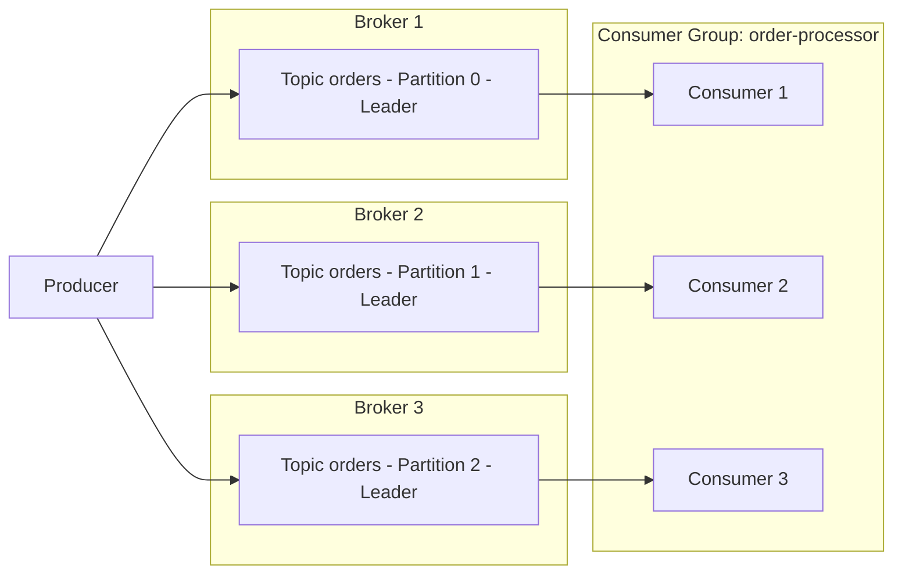

# Parte 1: Fundamentos de Kafka

> **Versiones compatibles**: Apache Kafka 3.9 (modo KRaft)\
> **Última actualización**: July 9, 2026

## ¿Qué es Apache Kafka?

Apache Kafka es una plataforma distribuida de streaming de eventos diseñada para gestionar flujos de datos en tiempo real y de gran volumen. Desarrollada originalmente en LinkedIn y posteriormente publicada como código abierto como un proyecto de Apache, se utiliza ampliamente para la agregación de logs, pipelines de métricas, microservicios orientados a eventos y pipelines de captura de datos de cambios (CDC).

Este documento abarca los conceptos esenciales que necesitas antes de ejecutar Kafka en EKS: brokers, topics, partitions, consumer groups, replicación y KRaft. La Parte 2 explica cómo implementar estos conceptos en un clúster real de EKS utilizando el Strimzi Operator.

## 1. Fundamentos de la arquitectura de Kafka

### Terminología principal

* **Broker**: Un proceso de servidor Kafka que almacena mensajes y atiende solicitudes de clientes. Un clúster de Kafka suele estar compuesto por varios brokers.
* **Topic**: Un canal lógico utilizado para categorizar mensajes, como `orders` o `payments`.
* **Partition**: La unidad física en la que se divide un topic. Cada partition es un log ordenado, de solo anexado e inmutable.
* **Offset**: Un número secuencial y único asignado a cada mensaje dentro de una partition. Los consumers rastrean «hasta dónde han leído» mediante offsets.
* **Factor de replicación**: El número de brokers en los que se copian los datos de una partition, lo que protege contra la pérdida de datos cuando falla un broker.
* **Réplica Leader/Follower**: Para cada partition, una réplica se designa como leader y gestiona todas las lecturas y escrituras; las réplicas follower restantes copian los datos del leader.
* **ISR (In-Sync Replicas)**: El conjunto de réplicas que están lo suficientemente sincronizadas con el leader. Cuando se envía una escritura con `acks=all`, solo se considera correcta una vez que cada réplica del ISR ha recibido el mensaje.

### Flujo Producer -> Partitions -> Consumer Group



Los producers escriben mensajes en un topic, y Kafka distribuye esos mensajes entre varios brokers en el nivel de partition. Los consumers que pertenecen al mismo consumer group dividen las partitions entre ellos (aproximadamente en una relación uno a uno) y consumen mensajes en paralelo.

## 2. Partitions y garantías de ordenamiento

La cantidad de partitions es el factor más importante que determina el rendimiento paralelo de un clúster. Más partitions permiten que más consumers trabajen simultáneamente, pero demasiadas partitions incrementan la sobrecarga de metadatos y los descriptores de archivos abiertos en los brokers.

> **Concepto clave**: Kafka **no** garantiza el orden en un topic completo. El orden solo está garantizado **dentro de una única partition**.

### Estrategias de selección de la clave de partition

Cuando un producer envía un mensaje con una clave, Kafka lo enruta a una partition según un hash de esa clave. La misma clave siempre se enruta a la misma partition, que es la forma de preservar el orden entre eventos que comparten una clave.

| Estrategia | Descripción | Caso de uso de ejemplo |
| --- | --- | --- |
| Sin clave (null) | Un particionador round-robin o sticky distribuye los mensajes entre las partitions | Ingestión de logs donde el orden no importa |
| ID de entidad como clave | Fija los eventos de la misma entidad en la misma partition | Preservar el orden de los eventos de estado para un ID de pedido determinado |
| Particionador personalizado | Enruta las partitions según reglas de negocio | Aislar el tráfico de un cliente específico en una partition dedicada |

```bash
# Create a topic with 6 partitions and a replication factor of 3
kafka-topics.sh --create \
  --bootstrap-server localhost:9092 \
  --topic orders \
  --partitions 6 \
  --replication-factor 3 \
  --config min.insync.replicas=2
```

Una clave mal elegida puede crear una «partition caliente», donde el tráfico se concentra en una única partition, así que asegúrate de que la clave tenga suficiente cardinalidad (una cantidad suficientemente grande de valores distintos) para distribuir la carga de forma uniforme.

## 3. Consumer Groups y reequilibrio

### Cómo funcionan los Consumer Groups

Los consumers que comparten el mismo `group.id` forman un **consumer group**. Kafka asigna automáticamente las partitions de un topic entre las instancias de consumer del grupo, y cada partition es leída por exactamente un consumer dentro de ese grupo (si hay más consumers que partitions, algunos consumers permanecen inactivos).

### Qué desencadena un reequilibrio

* Un nuevo consumer se une al grupo
* Un consumer existente abandona el grupo (apagado ordenado) o se detecta que se ha desconectado mediante el tiempo de espera del heartbeat
* Cambia el número de partitions del topic
* Un consumer no envía un heartbeat dentro de `session.timeout.ms`, o supera `max.poll.interval.ms` porque el procesamiento tarda demasiado

El consumo se pausa brevemente para el grupo afectado mientras hay un reequilibrio en curso, por lo que los reequilibrios demasiado frecuentes perjudican el rendimiento. El uso de `CooperativeStickyAssignor` minimiza el movimiento de partitions durante un reequilibrio y reduce su costo.

### Estrategias de confirmación de Offset

| Estrategia | Configuración | Características |
| --- | --- | --- |
| Confirmación automática | `enable.auto.commit=true` (predeterminado) | Confirmaciones periódicas prácticas, pero los offsets se pueden confirmar antes de que termine el procesamiento, lo que implica riesgo de pérdida de mensajes |
| Confirmación manual (sincrónica) | `enable.auto.commit=false` + `commitSync()` | Confirma solo después de que finaliza el procesamiento — más seguro, pero con menor rendimiento |
| Confirmación manual (asincrónica) | `enable.auto.commit=false` + `commitAsync()` | Mayor rendimiento, pero la aplicación debe gestionar por sí misma los errores de confirmación |

### Semántica de entrega

* **Como máximo una vez**: El offset se confirma antes de procesar el mensaje. Los mensajes pueden perderse ante un fallo.
* **Al menos una vez**: El offset se confirma después del procesamiento (la opción predeterminada recomendada habitualmente). Los mensajes pueden volver a procesarse ante un fallo, por lo que la lógica del consumer debe diseñarse para ser idempotente.
* **Exactamente una vez**: Combinar la opción idempotente del producer con la API transaccional (`transactional.id`) logra un procesamiento exactamente una vez dentro de Kafka (de topic a topic). El procesamiento exactamente una vez que abarca sistemas externos requiere trabajo de diseño adicional (por ejemplo, un sink connector exactamente una vez en Kafka Connect).

## 4. KRaft: Kafka sin ZooKeeper

Históricamente, Kafka dependía de un conjunto independiente de ZooKeeper para gestionar los metadatos del clúster — información de topics/partitions, ACL y elección del controller. A partir de Kafka 3.3, **KRaft (modo de metadatos Kafka Raft)** estuvo listo para producción (GA), y **Kafka 4.0 (lanzado en marzo de 2025)** eliminó por completo el modo ZooKeeper, convirtiendo a KRaft en el único mecanismo compatible para la gestión de metadatos.

### Arquitectura de KRaft

En lugar de un clúster independiente de ZooKeeper, KRaft designa un subconjunto de los procesos de broker de Kafka para actuar como el **quórum de controllers**.

* **Controller Voter**: Un nodo que participa en el protocolo de consenso Raft y replica el log de metadatos (normalmente un número impar, como 3 o 5, para el quórum).
* **Controller activo**: El único voter elegido como leader que procesa realmente los cambios de metadatos del clúster — elección del leader de la partition, creación de topics, etc.
* Los roles de controller y broker pueden combinarse en el mismo proceso (`process.roles=broker,controller`) para clústeres pequeños, o dividirse en nodos dedicados solo a controller (`process.roles=controller`) para implementaciones más grandes.

### Comparación antes/después

| Aspecto | Basado en ZooKeeper (predeterminado hasta Kafka 3.x) | Basado en KRaft (GA en 3.3+, único modo en 4.0+) |
| --- | --- | --- |
| Almacenamiento de metadatos | Conjunto independiente de ZooKeeper | El topic interno de metadatos propio de Kafka (`__cluster_metadata`) |
| Clústeres requeridos | Dos — el clúster de Kafka y el clúster de ZooKeeper | Uno — solo el clúster de Kafka |
| Elección del controller | Elección de leader mediante znodes efímeros de ZooKeeper | Controller activo elegido mediante consenso Raft |
| Escalabilidad de metadatos | La carga de ZooKeeper crece con el número de partitions | La replicación basada en logs escala mejor para grandes cantidades de partitions |
| Sobrecarga operativa de Kubernetes | Requiere un StatefulSet de ZooKeeper, PVC independientes y monitoreo independiente | No hay un componente independiente que gestionar — solo Pods de broker/controller de Kafka |

Esta diferencia es muy importante en entornos de Kubernetes/EKS. Las implementaciones basadas en ZooKeeper requerían ejecutar tanto un StatefulSet de Kafka como un StatefulSet de ZooKeeper, y duplicar las network policies, los PodDisruptionBudgets y el monitoreo en ambos componentes. KRaft elimina esa carga operativa y reduce el número de tipos de recursos que un operador como Strimzi necesita gestionar. La implementación basada en Strimzi que se explica en la Parte 2 utiliza el modo KRaft de forma predeterminada.

### Configuración de ejemplo de un nodo KRaft (server.properties)

```properties
# This node acts as both broker and controller (suitable for small clusters)
process.roles=broker,controller
node.id=1

# List of controller quorum voters (node.id@host:port)
controller.quorum.voters=1@kafka-0.kafka-headless:9093,2@kafka-1.kafka-headless:9093,3@kafka-2.kafka-headless:9093

listeners=BROKER://:9092,CONTROLLER://:9093
controller.listener.names=CONTROLLER
inter.broker.listener.name=BROKER

log.dirs=/var/lib/kafka/data
```

## 5. Configuración de replicación y durabilidad

El grado de confianza que puede tener un producer de que un mensaje se ha «almacenado de forma segura» depende de la combinación de tres configuraciones.

* **`replication.factor`** (configuración a nivel de topic): Determina en cuántos brokers se copian los datos de una partition. Se recomienda un mínimo de 3, que tolera hasta dos fallos simultáneos de broker sin perder datos.
* **`min.insync.replicas`** (configuración a nivel de topic): Cuando se envía una escritura con `acks=all`, especifica el número mínimo de miembros del ISR que deben tener el mensaje para que la escritura se considere correcta. Una combinación común es `replication.factor=3` con `min.insync.replicas=2`, que mantiene las escrituras disponibles incluso si falla un broker.
* **`acks`** (configuración a nivel de producer): Determina cuánto tiempo espera el producer la confirmación antes de considerar completa una escritura.

| Valor de `acks` | Comportamiento | Durabilidad | Latencia/rendimiento |
| --- | --- | --- | --- |
| `0` | El producer no espera ninguna respuesta | La más baja (los mensajes pueden perderse justo después del envío) | El más rápido |
| `1` | Se considera correcto cuando el leader lo ha escrito | Media (los datos no replicados pueden perderse si falla el leader) | Rápido |
| `all` (`-1`) | Se considera correcto solo una vez que cada réplica del ISR lo ha escrito | La más alta | Relativamente más lento |

```bash
# Dynamically change min.insync.replicas on an existing topic
kafka-configs.sh --bootstrap-server localhost:9092 \
  --alter --entity-type topics --entity-name orders \
  --add-config min.insync.replicas=2
```

Una combinación común de nivel de producción es `replication.factor=3`, `min.insync.replicas=2`, `acks=all` del producer y `enable.idempotence=true`. Esta combinación sobrevive a un único fallo de broker sin pérdida de datos, y la configuración de producer idempotente evita escrituras duplicadas provocadas por reintentos de red. Ten en cuenta que `acks=all` añade latencia en comparación con `acks=1`, por lo que las cargas de trabajo sensibles a la latencia que pueden tolerar cierta pérdida de datos (como la ingestión de métricas) a veces intercambian durabilidad por velocidad al elegir `acks=1`.

## Próximos pasos

Este documento abarcó los conceptos principales de Kafka — el modelo de broker/topic/partition, el alcance de las garantías de ordenamiento, el reequilibrio de consumer groups, el cambio a KRaft y las configuraciones de replicación/durabilidad. La Parte 2 abarca la implementación de todos estos conceptos como un clúster de Kafka basado en KRaft en Amazon EKS utilizando el **Strimzi Operator**.

[Volver a la página principal](./README.md)

## Cuestionario

Para comprobar lo que has aprendido en este capítulo, prueba el [Cuestionario de topics](../../quizzes/data-on-eks/kafka/01-kafka-fundamentals-quiz.md).
