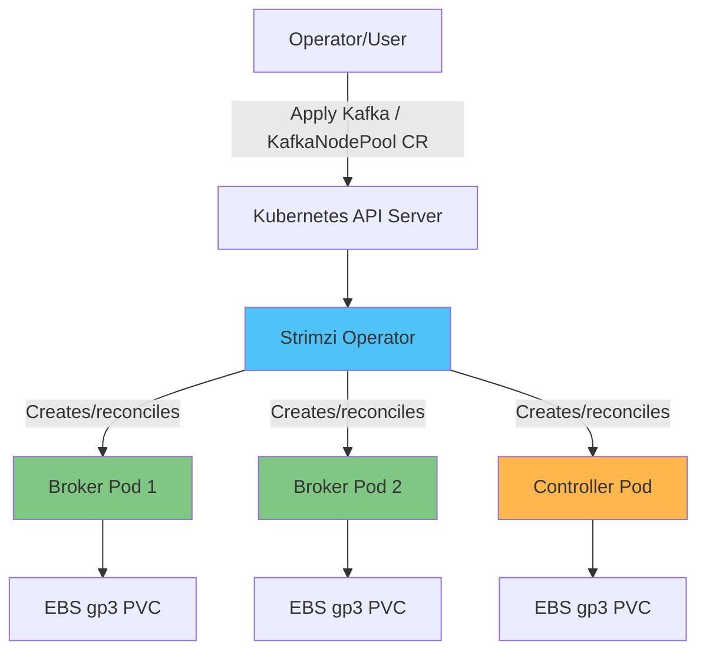

# Kafka on EKS Deep Dive

## Overview

Apache Kafka es la columna vertebral de las arquitecturas orientadas a eventos y de los pipelines de streaming en tiempo real; se usa para la comunicación asíncrona entre microservices, la agregación de logs/métricas y los pipelines de CDC (Change Data Capture), entre muchos otros casos de uso. En EKS, el enfoque estándar es ejecutar Kafka mediante el **Strimzi Kubernetes Operator** en lugar de administrar StatefulSets sin procesar directamente. Strimzi te permite administrar de forma declarativa todo el ciclo de vida operativo de un cluster de Kafka —creación, escalado, rolling upgrades, gestión de certificados y ubicación rack-aware— mediante CRDs (Custom Resource Definitions) nativas de Kubernetes.

> **Supported Versions**: Kafka 3.7-3.9 (KRaft mode), Strimzi Operator 0.45+
> **Última actualización**: July 9, 2026

## Core Architecture Concepts

Un cluster de Kafka está formado por un conjunto de procesos llamados **brokers**. Cada broker almacena uno o más **topics**, y cada topic se divide en múltiples **partitions** para paralelismo y escalabilidad. Cada partition mantiene réplicas en distintos brokers para mayor durabilidad. Los producers escriben mensajes en partitions, y los **consumer groups** reparten las partitions entre sus miembros para consumir mensajes en paralelo, haciendo seguimiento del progreso mediante offsets.

Históricamente, Kafka dependía de un ensemble de ZooKeeper separado para administrar los metadatos del cluster: topics, asignaciones de partitions, ACLs, etc. A partir de Kafka 3.x, el modo **KRaft (Kafka Raft)** permite que Kafka administre sus propios metadatos mediante un quórum de controllers basado en Raft, eliminando la necesidad de ZooKeeper, reduciendo la cantidad de componentes que operar y acelerando significativamente el failover del controller. Desde Kafka 4.0, el soporte para ZooKeeper se eliminó por completo, lo que convierte a KRaft en el único mecanismo de metadatos compatible; por lo tanto, cualquier nueva implementación de Kafka en EKS debe diseñarse alrededor de KRaft desde el inicio.

Strimzi encapsula todos estos componentes como recursos de Kubernetes. Declaras el estado deseado mediante CRDs como `Kafka` y `KafkaNodePool`, y el Strimzi Operator reconcilia ese estado creando y administrando Pods de broker/controller, PVCs, Services y Secrets.

## Deep Dive Table of Contents

**[1. Kafka Fundamentals](01-kafka-fundamentals.md)**
- Brokers y estructura de topics/partitions
- Replicación y garantías de durabilidad
- Consumer groups y gestión de offsets
- Arquitectura de quórum del controller de KRaft

**[2. Strimzi Operator](02-strimzi-operator.md)**
- Instalación y configuración de Strimzi
- CRDs `Kafka` y `KafkaNodePool` en detalle
- Implementación de un cluster de Kafka en EKS

**[3. Kafka Operations](03-kafka-operations.md)**
- Diseño de storage con EBS/gp3
- Estrategias de escalado de brokers
- Rebalanceo de partitions con Cruise Control
- Rolling upgrades sin tiempo de inactividad

**[4. Schema Registry](04-schema-registry.md)**
- Diseño de schemas Avro/Protobuf
- Karapace frente a Apicurio Registry
- Estrategias de compatibilidad: BACKWARD/FORWARD/FULL

**[5. Kafka Connect and MirrorMaker](05-kafka-connect-mirrormaker.md)**
- Implementación de Kafka Connect y configuración de connectors
- Operación de source y sink connectors
- Disaster recovery y replicación cross-region con MirrorMaker2

**[6. MSK Integration](06-msk-integration.md)**
- Amazon MSK frente a Strimzi autoadministrado
- Uso de MSK Connect
- Integración con Kinesis Data Streams y comparación con este servicio

**[7. Monitoring](07-monitoring.md)**
- Recopilación de métricas de brokers con Prometheus/Grafana
- Monitoreo del lag de consumers
- Autoscaling de consumers con KEDA

**[8. Best Practices](08-best-practices.md)**
- Estrategias de cantidad de partitions y diseño de keys
- Ajuste de rendimiento de producers/consumers
- Seguridad con mTLS/SASL
- Optimización de costos de storage e instancias

## References

- [Strimzi Documentation](https://strimzi.io/docs/operators/latest/overview)
- [Apache Kafka Documentation](https://kafka.apache.org/documentation/)
- [KIP-500: Replace ZooKeeper with a Self-Managed Metadata Quorum](https://cwiki.apache.org/confluence/display/KAFKA/KIP-500)
- [AWS Data on EKS Project](https://awslabs.github.io/data-on-eks/)

## Quiz

Para comprobar lo que has aprendido en esta sección, prueba el [cuestionario de fundamentos de Kafka](../../quizzes/data-on-eks/kafka/01-kafka-fundamentals-quiz.md).
