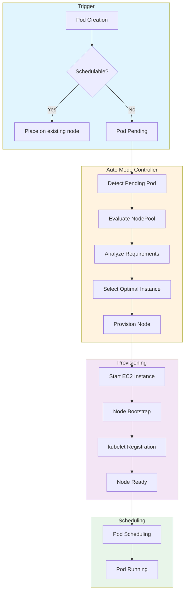
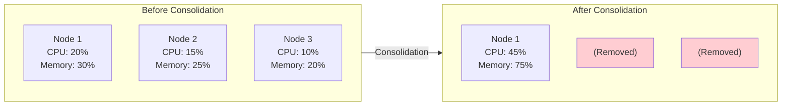

# Comprender el comportamiento de escalado

> **Versiones compatibles**: EKS 1.29+, EKS Auto Mode GA
> **Última actualización**: February 19, 2026

Esta guía explica cómo EKS Auto Mode maneja el aprovisionamiento de nodes, la consolidación, la detección de drift y la renovación basada en expiración.

---

## De Pod Pending al aprovisionamiento de Node

Comprender el flujo de escalado de EKS Auto Mode ayuda con la optimización.



### Línea de tiempo de escalado

La línea de tiempo típica de aprovisionamiento de Node:

| Fase | Duración | Descripción |
|-------|----------|-------------|
| Detección de Pod Pending | 1-5 seconds | El controller detecta pods no schedulables |
| Selección de instancia | 1-3 seconds | Determinación del tipo de instancia óptimo |
| Inicio de instancia EC2 | 10-30 seconds | Lanzamiento y arranque de la instancia |
| Arranque de AMI | 20-40 seconds | Inicialización del sistema operativo |
| Registro de kubelet | 5-10 seconds | El Node se une al cluster |
| Scheduling de Pod | 1-5 seconds | Pod colocado en el nuevo Node |
| **Total** | **40-90 seconds** | Tiempo de aprovisionamiento de extremo a extremo |

---

## Comportamiento de consolidación

Consolidation optimiza los costos al eliminar nodes ineficientes.

### Política WhenEmpty

Elimina solo nodes vacíos.

```yaml
apiVersion: karpenter.sh/v1
kind: NodePool
metadata:
  name: when-empty-example
spec:
  template:
    spec:
      requirements:
        - key: karpenter.k8s.aws/instance-category
          operator: In
          values: ["m", "c"]
      nodeClassRef:
        group: eks.amazonaws.com
        kind: NodeClass
        name: default
  disruption:
    consolidationPolicy: WhenEmpty
    consolidateAfter: 30s  # Remove after 30 seconds empty
```

### Política WhenEmptyOrUnderutilized

Consolida no solo nodes vacíos, sino también nodes infrautilizados.

```yaml
apiVersion: karpenter.sh/v1
kind: NodePool
metadata:
  name: when-underutilized-example
spec:
  template:
    spec:
      requirements:
        - key: karpenter.k8s.aws/instance-category
          operator: In
          values: ["m", "c"]
      nodeClassRef:
        group: eks.amazonaws.com
        kind: NodeClass
        name: default
  disruption:
    consolidationPolicy: WhenEmptyOrUnderutilized
    consolidateAfter: 1m
```

### Visualización de consolidación



### Factores de decisión de consolidación

Auto Mode considera estos factores al consolidar:

| Factor | Descripción |
|--------|-------------|
| Utilización de Node | Uso de CPU y memoria por debajo del umbral |
| Cantidad de Pods | Pocos pods ejecutándose en el Node |
| Eficiencia de costos | Si los workloads caben en menos nodes y más baratos |
| Cumplimiento de PDB | Respeta las restricciones de PodDisruptionBudget |
| Ventanas de presupuesto | Respeta los disruption budgets basados en tiempo |

---

## Detección y reemplazo de drift

Cuando cambian los ajustes de NodePool, los nodes existentes se reemplazan con los nuevos ajustes.

### Detectar drift

```bash
# Check node Drift
kubectl get nodes -o custom-columns=\
NAME:.metadata.name,\
NODEPOOL:.metadata.labels.karpenter\\.sh/nodepool,\
DRIFT:.metadata.annotations.karpenter\\.sh/drift-hash

# Check nodes with detected Drift
kubectl get nodeclaims -o wide
```

### Qué desencadena drift

| Tipo de cambio | Desencadena drift |
|-------------|----------------|
| Cambio en requirements de NodePool | Sí |
| Cambio de familia de AMI de NodeClass | Sí |
| Cambio de block device de NodeClass | Sí |
| Cambio de subnet de NodeClass | Sí |
| Cambio de weight de NodePool | No |
| Cambio de limits de NodePool | No |

### Proceso de reemplazo por drift

1. El controller detecta drift de configuración
2. Se aprovisiona un nuevo Node con los ajustes actualizados
3. Los Pods se migran gradualmente al nuevo Node
4. Al Node anterior se le aplica cordon y drain
5. El Node anterior se termina

---

## Renovación de Node basada en expiración

Reemplaza nodes periódicamente para parches de seguridad o actualizaciones de AMI.

```yaml
apiVersion: karpenter.sh/v1
kind: NodePool
metadata:
  name: with-expiration
spec:
  template:
    spec:
      requirements:
        - key: karpenter.k8s.aws/instance-category
          operator: In
          values: ["m", "c"]
      nodeClassRef:
        group: eks.amazonaws.com
        kind: NodeClass
        name: default
      # Set maximum node lifetime
      expireAfter: 168h  # Auto-replace after 7 days
  disruption:
    consolidationPolicy: WhenEmptyOrUnderutilized
    consolidateAfter: 1m
```

### Valores expireAfter recomendados

| Caso de uso | expireAfter | Justificación |
|----------|-------------|-----------|
| Crítico para seguridad | 24h - 72h | Parches frecuentes |
| Producción estándar | 168h (7 days) | Equilibrio entre actualización y estabilidad |
| Sensible a costos | 336h (14 days) | Minimizar la sobrecarga de reemplazo |
| Desarrollo | 720h (30 days) | Maximizar la reutilización de nodes |

---

## Optimización de la latencia de escalado

### Medir el tiempo de aprovisionamiento

```bash
# Measure node provisioning time
kubectl get events --sort-by='.lastTimestamp' | grep -E "Provisioned|Registered"

# Typical provisioning timeline
# - EC2 instance start: 10-30 seconds
# - AMI boot: 20-40 seconds
# - kubelet registration: 5-10 seconds
# - Pod scheduling: 1-5 seconds
# Total expected time: 40-90 seconds
```

### Configuración de arranque rápido

```yaml
# NodeClass settings for fast provisioning
apiVersion: eks.amazonaws.com/v1
kind: NodeClass
metadata:
  name: fast-boot
spec:
  amiFamily: Bottlerocket  # Faster boot time than AL2023

  # EBS optimization
  blockDeviceMappings:
    - deviceName: /dev/xvda
      ebs:
        volumeSize: 50Gi  # Only as much as needed
        volumeType: gp3
        iops: 3000
        throughput: 125
```

### Consejos de optimización de latencia

| Optimización | Impacto | Compensación |
|--------------|--------|-----------|
| Usar AMI Bottlerocket | Arranque 10-20s más rápido | Menos personalización |
| Volúmenes EBS más pequeños | Attach 5-10s más rápido | Menos storage local |
| Mayor IOPS/throughput | Arranque 5-10s más rápido | Mayor costo |
| Tipos de instancia diversos | Adquisición de capacidad más rápida | Puede obtener una instancia menos óptima |
| Precalentar con placeholder pods | Escalado casi instantáneo | Costo de recursos inactivos |

---

## Monitoreo del comportamiento de escalado

### Métricas clave a observar

```bash
# Check pending pods over time
kubectl get pods -A --field-selector=status.phase=Pending -w

# Monitor node provisioning events
kubectl get events --sort-by='.lastTimestamp' -w | grep -i karpenter

# Check NodeClaim status
kubectl get nodeclaims -w
```

### Métricas de CloudWatch

| Métrica | Descripción | Umbral de alerta |
|--------|-------------|-----------------|
| `karpenter_pods_pending` | Pods esperando nodes | > 10 durante > 5 min |
| `karpenter_nodeclaims_created` | Nuevos nodes solicitados | Picos inusuales |
| `karpenter_nodeclaims_startup_duration_seconds` | Tiempo de aprovisionamiento | p99 > 120s |
| `karpenter_nodes_total` | Total de nodes administrados | Cerca de los límites |

---

< [Anterior: Configuración de NodePool](./02-nodepool-configuration.md) | [Tabla de contenidos](./README.md) | [Siguiente: Estrategias Spot](./04-spot-strategies.md) >
