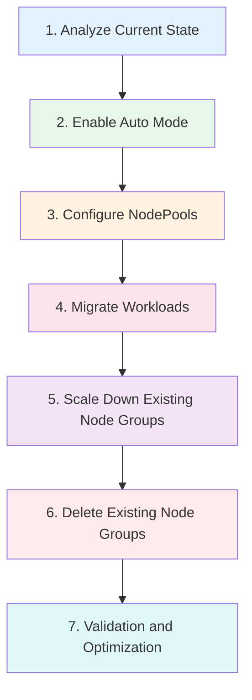

# Migración de Managed Node Groups a Auto Mode

> **Versiones compatibles**: EKS 1.29+, EKS Auto Mode GA
> **Última actualización**: July 3, 2026

Esta guía cubre cómo migrar desde EKS Managed Node Groups existentes a Auto Mode, incluidas instrucciones paso a paso, estrategias de coexistencia y precauciones importantes.

---

## Descripción general de la migración



---

## Paso 1: Analizar el estado actual

Antes de la migración, analice en detalle la configuración actual de su cluster.

```bash
# Check current node groups
eksctl get nodegroup --cluster my-cluster

# Analyze node resource usage
kubectl top nodes

# Check workload distribution
kubectl get pods -A -o wide | awk '{print $8}' | sort | uniq -c

# Nodes by current instance type
kubectl get nodes -o custom-columns=\
NAME:.metadata.name,\
TYPE:.metadata.labels.node\\.kubernetes\\.io/instance-type,\
ZONE:.metadata.labels.topology\\.kubernetes\\.io/zone

# Check for node selectors in deployments
kubectl get deployments -A -o jsonpath='{range .items[*]}{.metadata.namespace}/{.metadata.name}: {.spec.template.spec.nodeSelector}{"\n"}{end}'

# Check for node affinities
kubectl get deployments -A -o jsonpath='{range .items[*]}{.metadata.namespace}/{.metadata.name}: {.spec.template.spec.affinity.nodeAffinity}{"\n"}{end}'
```

### Lista de verificación previa a la migración

| Elemento | Verificación | Notas |
|------|-------|-------|
| Versión de EKS | >= 1.29 | Requerido para Auto Mode |
| Tipos de instancia de Node Group | Documentar todos | Mapear a requisitos de NodePool |
| AMIs personalizadas | Documentar | Puede requerir configuración de NodeClass |
| Scripts de user data | Revisar | Asegurar compatibilidad |
| IAM roles | Documentar | Auto Mode crea nuevos roles |
| Security groups | Documentar | Configurar en NodeClass |
| Tags | Documentar | Agregar a NodeClass |
| Node selectors en workloads | Identificar | Puede requerir actualizaciones |

---

## Paso 2: Habilitar Auto Mode

Habilite Auto Mode en su cluster existente.

```bash
# 1. Enable Auto Mode
aws eks update-cluster-config \
    --name my-cluster \
    --compute-config enabled=true,nodePools=general-purpose,nodePools=system

# 2. Check activation status
aws eks describe-cluster --name my-cluster \
    --query 'cluster.computeConfig'

# 3. Wait for update to complete
aws eks wait cluster-active --name my-cluster

# 4. Verify NodePools are created
kubectl get nodepools
```

---

## Paso 3: Configurar NodePools personalizados

Cree NodePools que coincidan con las configuraciones actuales de sus Node Groups.

```yaml
# custom-nodepools.yaml
apiVersion: karpenter.sh/v1
kind: NodePool
metadata:
  name: migrated-workloads
spec:
  template:
    metadata:
      labels:
        migration: auto-mode
    spec:
      requirements:
        # Instance types similar to existing node groups
        - key: karpenter.k8s.aws/instance-category
          operator: In
          values: ["m", "c", "r"]
        - key: karpenter.k8s.aws/instance-size
          operator: In
          values: ["large", "xlarge", "2xlarge"]
        - key: karpenter.sh/capacity-type
          operator: In
          values: ["on-demand"]
      nodeClassRef:
        group: eks.amazonaws.com
        kind: NodeClass
        name: default
```

### Mapeo de Node Groups a NodePools

| Configuración de Node Group | Equivalente en NodePool |
|-------------------|---------------------|
| Tipos de instancia | `karpenter.k8s.aws/instance-category`, `instance-size` |
| Tipo de capacidad | `karpenter.sh/capacity-type` |
| Labels | `template.metadata.labels` |
| Taints | `template.spec.taints` |
| Límites de escalado | `spec.limits` |
| Tags de subnet | NodeClass `subnetSelectorTerms` |
| Security groups | NodeClass `securityGroupSelectorTerms` |
| Tipo de AMI | NodeClass `amiFamily` |

---

## Paso 4: Migrar workloads

Mueva gradualmente los workloads desde los Node Groups existentes a nodes de Auto Mode.

```bash
# Apply cordon to existing nodes (prevent new Pod scheduling)
kubectl cordon -l eks.amazonaws.com/nodegroup=old-nodegroup

# Gradually drain Pods
for node in $(kubectl get nodes -l eks.amazonaws.com/nodegroup=old-nodegroup -o name); do
    kubectl drain $node --ignore-daemonsets --delete-emptydir-data
    sleep 60  # Wait time between each node
done
```

### Script de migración segura

```bash
#!/bin/bash
# migrate-workloads.sh

NODE_GROUP="old-nodegroup"
DRAIN_INTERVAL=60

# Get nodes in the old node group
NODES=$(kubectl get nodes -l eks.amazonaws.com/nodegroup=$NODE_GROUP -o name)

echo "Starting migration of node group: $NODE_GROUP"
echo "Found $(echo "$NODES" | wc -l) nodes to migrate"

# Cordon all nodes first
for node in $NODES; do
    echo "Cordoning $node..."
    kubectl cordon $node
done

echo "All nodes cordoned. Starting drain process..."

# Drain nodes one by one
for node in $NODES; do
    echo "Draining $node..."
    kubectl drain $node \
        --ignore-daemonsets \
        --delete-emptydir-data \
        --timeout=300s

    if [ $? -ne 0 ]; then
        echo "WARNING: Failed to drain $node, continuing..."
    fi

    echo "Waiting ${DRAIN_INTERVAL}s before next node..."
    sleep $DRAIN_INTERVAL
done

echo "Migration complete. Verify with: kubectl get pods -A -o wide"
```

---

## Paso 5: Reducir la escala de los Node Groups existentes

Después de migrar los workloads, reduzca la escala de los Node Groups antiguos.

```bash
# Scale down node group
eksctl scale nodegroup \
    --cluster my-cluster \
    --name old-nodegroup \
    --nodes 0 \
    --nodes-min 0

# Verify nodes are terminating
kubectl get nodes -l eks.amazonaws.com/nodegroup=old-nodegroup -w
```

---

## Paso 6: Eliminar los Node Groups existentes

Una vez confirmado que todos los workloads se ejecutan en nodes de Auto Mode, elimine los Node Groups antiguos.

```bash
# Delete node group
eksctl delete nodegroup \
    --cluster my-cluster \
    --name old-nodegroup

# Verify deletion
eksctl get nodegroup --cluster my-cluster
```

---

## Paso 7: Validación y optimización

Valide la migración y optimice las configuraciones.

```bash
# Verify all pods are running
kubectl get pods -A --field-selector=status.phase!=Running

# Check node distribution
kubectl get nodes -o wide -L karpenter.sh/nodepool,karpenter.sh/capacity-type

# Verify resource utilization
kubectl top nodes
kubectl top pods -A

# Check for any pending pods
kubectl get pods -A --field-selector=status.phase=Pending
```

---

## Operaciones durante el período de coexistencia

Durante la migración, los Node Groups existentes y Auto Mode pueden coexistir.

```yaml
# coexistence-config.yaml
# Existing node group workloads
apiVersion: apps/v1
kind: Deployment
metadata:
  name: legacy-app
spec:
  replicas: 3
  template:
    spec:
      # Pin to existing node group
      nodeSelector:
        eks.amazonaws.com/nodegroup: old-nodegroup
      containers:
        - name: app
          image: legacy-app:latest
---
# Auto Mode workloads
apiVersion: apps/v1
kind: Deployment
metadata:
  name: new-app
spec:
  replicas: 3
  template:
    spec:
      # Prefer Auto Mode nodes
      affinity:
        nodeAffinity:
          preferredDuringSchedulingIgnoredDuringExecution:
            - weight: 100
              preference:
                matchExpressions:
                  - key: karpenter.sh/nodepool
                    operator: Exists
      containers:
        - name: app
          image: new-app:latest
```

### Mejores prácticas de coexistencia

| Práctica | Descripción |
|----------|-------------|
| Usar node selectors | Fijar workloads a infraestructura específica |
| Migración gradual | Mover workloads por fases |
| Monitorear ambos | Hacer seguimiento de métricas de ambos tipos de node |
| Probar exhaustivamente | Validar el comportamiento antes de la migración completa |
| Plan de rollback | Mantener los Node Groups con escala reducida, no eliminados inicialmente |

---

## Migración desde Karpenter autogestionado (ruta oficial basada en kubectl)

Si ejecuta **Karpenter autogestionado directamente** en lugar de Managed Node Groups, AWS proporciona una ruta de migración oficialmente compatible basada en kubectl como alternativa al procedimiento de transición de Node Groups descrito anteriormente.

### Prerrequisitos

- Karpenter autogestionado **v1.1 o posterior** ya debe estar instalado en el cluster
- Documente su configuración existente de Karpenter NodePool/EC2NodeClass

### Pasos de migración

1. **Habilitar Auto Mode**: Habilite Auto Mode mientras deja el controller de Karpenter y los NodePools existentes en su lugar.

2. **Crear un NodePool de Auto Mode con taint**: Agregue un taint para que los workloads no se programen en nodes de Auto Mode involuntariamente.

   ```yaml
   apiVersion: karpenter.sh/v1
   kind: NodePool
   metadata:
     name: auto-mode-migration
   spec:
     template:
       spec:
         taints:
           - key: eks.amazonaws.com/auto-mode
             value: "true"
             effect: NoSchedule
         nodeClassRef:
           group: eks.amazonaws.com
           kind: NodeClass
           name: default
   ```

3. **Agregar tolerations/nodeSelector coincidentes a los workloads**: Agregue una toleration para el taint anterior y un `nodeSelector` dirigido al NodePool de Auto Mode a los workloads que desea migrar.

   ```yaml
   spec:
     template:
       spec:
         tolerations:
           - key: eks.amazonaws.com/auto-mode
             value: "true"
             effect: NoSchedule
         nodeSelector:
           karpenter.sh/nodepool: auto-mode-migration
   ```

4. **Migrar incrementalmente**: Agregue toleration/nodeSelector a un grupo de workloads a la vez, moviendo workloads a nodes de Auto Mode mientras los nodes gestionados por Karpenter y los nodes de Auto Mode se ejecutan en paralelo en el mismo cluster.

5. **Eliminar Karpenter autogestionado**: Una vez confirmado que todos los workloads se ejecutan en nodes de Auto Mode, elimine el controller de Karpenter autogestionado y sus recursos asociados (NodePools, EC2NodeClasses, IAM roles, Helm release, etc.).

Esta ruta está destinada a clusters que ya ejecutan Karpenter autogestionado. Si migra directamente desde Managed Node Groups, siga los Pasos 1-7 anteriores en su lugar.

---

## Precauciones de migración

| Elemento | Precaución | Mitigación |
|------|---------|------------|
| **Compatibilidad de AMI** | Auto Mode solo admite AL2023 o Bottlerocket | Probar workloads en la nueva AMI |
| **User Data** | Verificar la compatibilidad del script bootstrap existente | Revisar y probar userData |
| **IAM Role** | El IAM role de Auto Mode se crea automáticamente | Verificar permisos para workloads |
| **Security Groups** | Reconfigurar en NodeClass | Documentar y replicar reglas |
| **Tags** | Reflejar las políticas de tags existentes en NodeClass | Auditar y agregar tags |
| **Monitoring** | Se requiere una nueva configuración de recopilación de métricas | Actualizar dashboards y alertas |
| **Node Selectors** | Los workloads con `eks.amazonaws.com/nodegroup` no se programarán | Actualizar selectors |
| **Persistent Volumes** | Los EBS volumes son específicos de AZ | Planificar la migración de volumes |

### Problemas comunes de migración

| Problema | Síntoma | Solución |
|-------|---------|----------|
| Pods no se programan | Estado Pending | Actualizar node selectors, tolerations |
| Errores de aplicación | Fallos en runtime | Comprobar compatibilidad de AMI |
| Degradación del rendimiento | Aumento de latencia | Verificar que los tipos de instancia coincidan |
| Aumento de costos | Facturas de EC2 más altas | Revisar límites de NodePool, configuración de Spot |

---

## Procedimiento de rollback

Si ocurren problemas de migración, puede hacer rollback.

```bash
# 1. Scale up old node groups
eksctl scale nodegroup \
    --cluster my-cluster \
    --name old-nodegroup \
    --nodes 3 \
    --nodes-min 1 \
    --nodes-max 10

# 2. Uncordon old nodes (if cordoned)
kubectl uncordon -l eks.amazonaws.com/nodegroup=old-nodegroup

# 3. Cordon Auto Mode nodes
kubectl cordon -l karpenter.sh/nodepool

# 4. Drain Auto Mode nodes
for node in $(kubectl get nodes -l karpenter.sh/nodepool -o name); do
    kubectl drain $node --ignore-daemonsets --delete-emptydir-data
done

# 5. Verify workloads are back on old nodes
kubectl get pods -A -o wide

# 6. Optionally disable Auto Mode
aws eks update-cluster-config \
    --name my-cluster \
    --compute-config enabled=false
```

---

## Optimización posterior a la migración

Después de una migración exitosa:

1. **Revisar las configuraciones de NodePool**: Optimizar los requisitos según las necesidades reales de los workloads
2. **Habilitar instancias Spot**: Para workloads adecuados con el fin de reducir costos
3. **Configurar consolidación**: Habilitar la optimización de costos mediante consolidación de nodes
4. **Configurar monitoreo**: Crear dashboards para métricas de Auto Mode
5. **Documentar cambios**: Actualizar runbooks y documentación
6. **Capacitar al equipo**: Asegurarse de que el equipo de operaciones comprenda el nuevo modelo de gestión

---

< [Anterior: Optimización de workloads](./08-workload-optimization.md) | [Tabla de contenidos](./README.md) | [Volver a temas de EKS](../README.md) >
