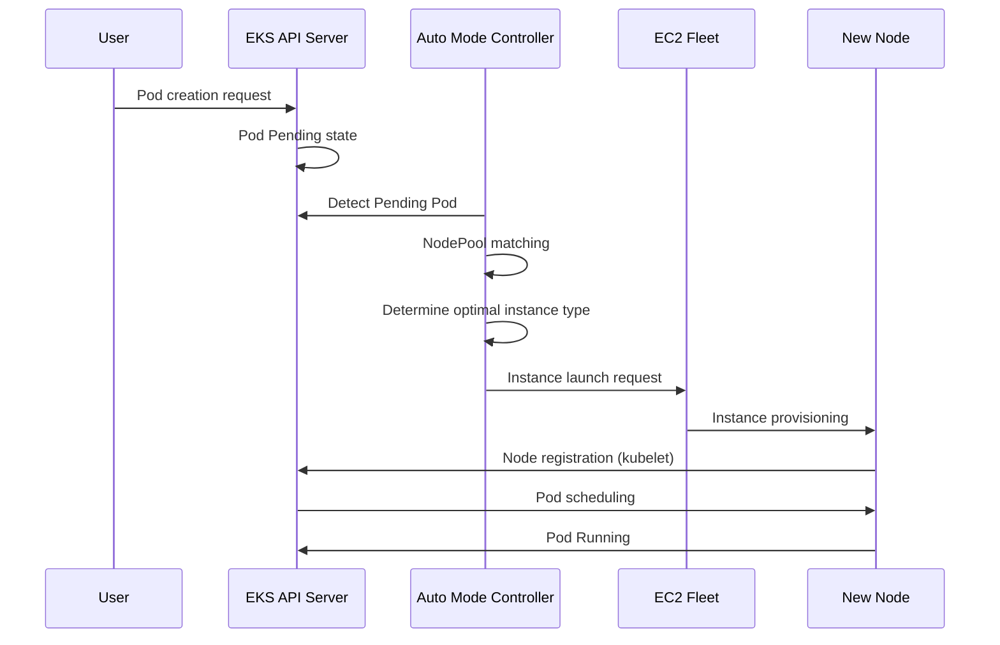

# Guía de operaciones de EKS Auto Mode

> **Versiones compatibles**: EKS 1.29+, EKS Auto Mode GA
> **Última actualización**: July 21, 2026

Amazon EKS Auto Mode es una característica que automatiza por completo la gestión de Nodes de Kubernetes, aprovisionando y optimizando automáticamente Nodes según los requisitos de las cargas de trabajo. Esta guía abarca los conceptos de EKS Auto Mode, los métodos de configuración y las prácticas recomendadas para entornos de producción.

### Actualización de julio de 2026: compatibilidad con ARC Zonal Shift

Desde el 10 de julio de 2026, los clústeres de EKS Auto Mode admiten zonal shift y autoshift de Amazon Application Recovery Controller (ARC). Dado que Auto Mode administra la capacidad de cómputo en su nombre, obtiene compatibilidad con zonal shift sin configurar indicadores ni administrar versiones de Karpenter; simplemente habilite ARC zonal shift en el clúster. Cuando se activa un zonal shift, Auto Mode deja de aprovisionar nueva capacidad en la AZ afectada y detiene las interrupciones voluntarias, como la consolidación y el drift, para los Nodes de esa zona. No hay costo adicional; consulte el [anuncio](https://aws.amazon.com/about-aws/whats-new/2026/07/eks-auto-mode-arc-zonal-shift) y la [documentación de ARC zonal shift](https://docs.aws.amazon.com/eks/latest/userguide/zone-shift.html) para obtener más detalles.

## Tabla de contenido

1. [Introducción a Auto Mode](./01-getting-started.md) - Creación de clústeres y habilitación de Auto Mode
2. [Configuración y optimización de NodePool](./02-nodepool-configuration.md) - NodePools predeterminados y personalizados
3. [Comprender el comportamiento de escalado](./03-scaling-behavior.md) - Aprovisionamiento, consolidación, detección de drift
4. [Estrategias de utilización de instancias Spot](./04-spot-strategies.md) - Capacidad mixta y gestión de interrupciones
5. [Operaciones y administración](./05-operations.md) - Presupuestos de interrupción, reemplazo gradual y monitoreo
6. [Administración y optimización de costos](./06-cost-management.md) - Análisis de costos, ahorro de Spot y dimensionamiento adecuado
7. [Administración del ciclo de vida de Node](./07-node-lifecycle.md) - Expiración, administración de AMI y políticas de actualización
8. [Optimización específica de cargas de trabajo](./08-workload-optimization.md) - Cargas de trabajo web, por lotes, GPU y AI/ML
9. [Migración desde Managed Node Groups](./09-migration-guide.md) - Pasos de migración y coexistencia

---

## Introducción a EKS Auto Mode

### ¿Qué es Auto Mode?

EKS Auto Mode es una solución de gestión de Nodes totalmente automatizada y administrada por AWS. Se basa internamente en Karpenter, y AWS administra todo sin que los usuarios necesiten instalar ni configurar componentes independientes de gestión de Nodes.

```
+-----------------------------------------------------------------------------+
|                           EKS Auto Mode Architecture                         |
+-----------------------------------------------------------------------------+
|                                                                              |
|  +---------------------------------------------------------------------+    |
|  |                    EKS Control Plane (AWS Managed)                   |    |
|  |  +------------+  +------------+  +------------+  +------------+    |    |
|  |  | API Server |  |   etcd     |  | Controller |  |  Karpenter |    |    |
|  |  |            |  |            |  |  Manager   |  | Controller |    |    |
|  |  +------------+  +------------+  +------------+  +------------+    |    |
|  +---------------------------------------------------------------------+    |
|                                    |                                         |
|                                    v                                         |
|  +---------------------------------------------------------------------+    |
|  |                        NodePool Resources                            |    |
|  |  +------------------+  +------------------+  +------------------+  |    |
|  |  |  general-purpose |  |      system      |  |   custom-pool    |  |    |
|  |  | (Default Provided)|  | (Default Provided)|  |  (User Defined)  |  |    |
|  |  +------------------+  +------------------+  +------------------+  |    |
|  +---------------------------------------------------------------------+    |
|                                    |                                         |
|                                    v                                         |
|  +---------------------------------------------------------------------+    |
|  |                     EC2 Instances (Auto Managed)                     |    |
|  |  +--------------+  +--------------+  +--------------+              |    |
|  |  |   m6i.2xl    |  |   c7g.xl     |  |   r6i.4xl    |   ...        |    |
|  |  |  (On-Demand) |  |   (Spot)     |  |  (On-Demand) |              |    |
|  |  +--------------+  +--------------+  +--------------+              |    |
|  +---------------------------------------------------------------------+    |
|                                                                              |
+-----------------------------------------------------------------------------+
```

### Comparación con los métodos de administración existentes

| Característica | Managed Node Groups | Fargate | Auto Mode |
|---------|---------------------|---------|-----------|
| Administración de Nodes | Usuario (basado en ASG) | Administrado íntegramente por AWS | Administrado íntegramente por AWS |
| Método de escalado | Cluster Autoscaler | Por Pod | Basado en Karpenter |
| Velocidad de escalado | Minutos | Inmediata (programación de Pod) | Decenas de segundos |
| Selección de tipo de instancia | Predefinida | Automática | Optimizada automáticamente |
| Compatibilidad con Spot | Configuración manual | No compatible | Administrada automáticamente |
| Cargas de trabajo de GPU | Compatible | Limitada | Totalmente compatible |
| Compatibilidad con DaemonSet | Compatible | No compatible | Compatible |
| Optimización de costos | Manual | Media | Automática |
| Complejidad | Alta | Baja | Baja |
| Personalización | Alta | Baja | Media |

### Arquitectura interna y principios de funcionamiento

EKS Auto Mode funciona basándose en Karpenter, pero se ejecuta dentro del control plane administrado por AWS.



### Regiones compatibles y limitaciones

#### Regiones compatibles (a febrero de 2025)

EKS Auto Mode está disponible en las siguientes regiones:

- **Américas**: us-east-1, us-east-2, us-west-1, us-west-2
- **Europa**: eu-west-1, eu-west-2, eu-central-1, eu-north-1
- **Asia Pacífico**: ap-northeast-1, ap-northeast-2, ap-southeast-1, ap-southeast-2, ap-south-1

#### Limitaciones

| Elemento | Límite |
|------|-------|
| Máximo de NodePools por clúster | 100 |
| Máximo de Nodes por NodePool | 1000 |
| Máximo de Nodes por clúster | 5000 |
| Versión mínima de EKS | 1.29 |
| Familias de AMI compatibles | AL2023, Bottlerocket |
| Nodes de Windows | No compatible |

---

## Próximos pasos

Después de configurar correctamente EKS Auto Mode, recomendamos conocer los siguientes temas:

1. **[Optimización de costos de EKS](../eks/07-eks-cost-optimization.md)**: Spot, Savings Plans, optimización de recursos
2. **[Monitoreo y registro de EKS](../eks/06-eks-monitoring-logging.md)**: CloudWatch, Prometheus, Grafana
3. **[Seguridad de EKS](../eks/05-eks-security.md)**: IAM, políticas de red, seguridad de Pod
4. **[Análisis en profundidad de Karpenter](../autoscaling/02-karpenter.md)**: Instalación directa de Karpenter y características avanzadas

## Cuestionario relacionado

Para poner a prueba sus conocimientos, pruebe el [Cuestionario de EKS Auto Mode](../quizzes/eks-auto-mode/01-getting-started-quiz.md).

---

## Referencias

- [Documentación oficial de AWS EKS Auto Mode](https://docs.aws.amazon.com/eks/latest/userguide/automode.html)
- [Documentación oficial de Karpenter](https://karpenter.sh/)
- [Guía de prácticas recomendadas de EKS](https://aws.github.io/aws-eks-best-practices/)
- [Guía de optimización de costos de AWS](https://aws.amazon.com/pricing/cost-optimization/)
- [Nuevas características de EKS Auto Mode para mejorar la seguridad, el control de red y el rendimiento (AWS Containers Blog, 2025-10-16)](https://aws.amazon.com/blogs/containers/new-amazon-eks-auto-mode-features-for-enhanced-security-network-control-and-performance/)
- [Migrar de Karpenter autoadministrado a EKS Auto Mode](https://docs.aws.amazon.com/eks/latest/userguide/auto-migrate-karpenter.html)

---

< [Volver a los temas de EKS](../README.md) | [Siguiente: Introducción](./01-getting-started.md) >
