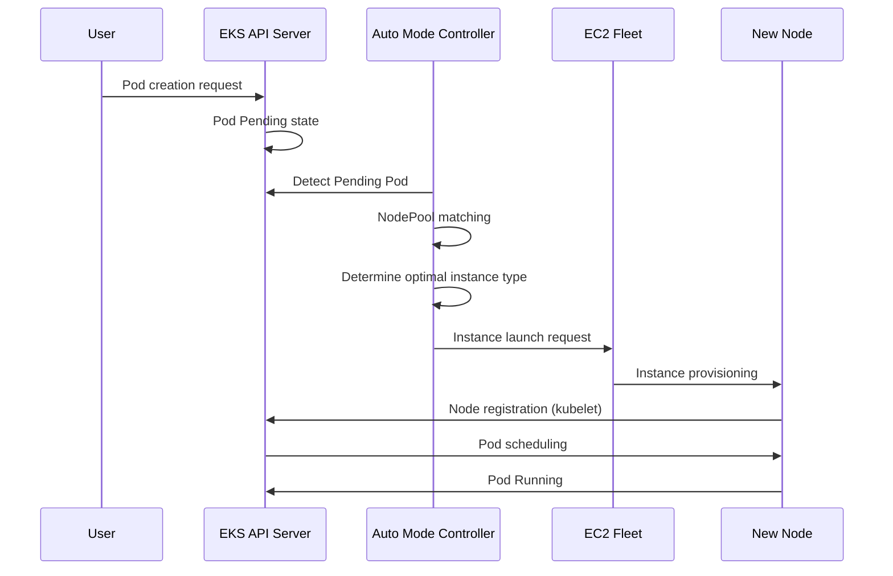

# Guía de operaciones de EKS Auto Mode

> **Versiones compatibles**: EKS 1.29+, EKS Auto Mode GA
> **Última actualización**: February 23, 2026

Amazon EKS Auto Mode es una característica que automatiza por completo la gestión de nodes de Kubernetes, aprovisionando y optimizando automáticamente los nodes según los requisitos de los workloads. Esta guía cubre los conceptos de EKS Auto Mode, los métodos de configuración y las mejores prácticas para entornos de producción.

## Tabla de contenidos

1. [Primeros pasos con Auto Mode](./01-getting-started.md) - Creación de clusters y habilitación de Auto Mode
2. [Configuración y optimización de NodePool](./02-nodepool-configuration.md) - NodePools predeterminados y personalizados
3. [Comprender el comportamiento de escalado](./03-scaling-behavior.md) - Aprovisionamiento, consolidación, detección de drift
4. [Estrategias de utilización de Spot Instance](./04-spot-strategies.md) - Capacidad mixta y manejo de interrupciones
5. [Operaciones y gestión](./05-operations.md) - Disruption budgets, reemplazo continuo, monitoreo
6. [Gestión y optimización de costos](./06-cost-management.md) - Análisis de costos, ahorros con Spot, right-sizing
7. [Gestión del ciclo de vida de los nodes](./07-node-lifecycle.md) - Expiración, gestión de AMI, políticas de actualización
8. [Optimización específica por workload](./08-workload-optimization.md) - Workloads web, batch, GPU, AI/ML
9. [Migración desde Managed Node Groups](./09-migration-guide.md) - Pasos de migración y coexistencia

---

## Introducción a EKS Auto Mode

### ¿Qué es Auto Mode?

EKS Auto Mode es una solución de gestión de nodes totalmente automatizada y administrada por AWS. Internamente se basa en Karpenter, y AWS gestiona todo sin que los usuarios tengan que instalar o configurar componentes separados de gestión de nodes.

```
+-----------------------------------------------------------------------------+
|                           EKS Auto Mode Architecture                         |
+-----------------------------------------------------------------------------+
|                                                                              |
|  +---------------------------------------------------------------------+    |
|  |                    EKS Control Plane (AWS Managed)                   |    |
|  |  +------------+  +------------+  +------------+  +------------+    |    |
|  |  | API Server |  |   etcd     |  | Controller |  |  Karpenter |    |    |
|  |  |            |  |            |  |  Manager   |  | Controller |    |    |
|  |  +------------+  +------------+  +------------+  +------------+    |    |
|  +---------------------------------------------------------------------+    |
|                                    |                                         |
|                                    v                                         |
|  +---------------------------------------------------------------------+    |
|  |                        NodePool Resources                            |    |
|  |  +------------------+  +------------------+  +------------------+  |    |
|  |  |  general-purpose |  |      system      |  |   custom-pool    |  |    |
|  |  | (Default Provided)|  | (Default Provided)|  |  (User Defined)  |  |    |
|  |  +------------------+  +------------------+  +------------------+  |    |
|  +---------------------------------------------------------------------+    |
|                                    |                                         |
|                                    v                                         |
|  +---------------------------------------------------------------------+    |
|  |                     EC2 Instances (Auto Managed)                     |    |
|  |  +--------------+  +--------------+  +--------------+              |    |
|  |  |   m6i.2xl    |  |   c7g.xl     |  |   r6i.4xl    |   ...        |    |
|  |  |  (On-Demand) |  |   (Spot)     |  |  (On-Demand) |              |    |
|  |  +--------------+  +--------------+  +--------------+              |    |
|  +---------------------------------------------------------------------+    |
|                                                                              |
+-----------------------------------------------------------------------------+
```

### Comparación con los métodos de gestión existentes

| Característica | Managed Node Groups | Fargate | Auto Mode |
|---------|---------------------|---------|-----------|
| Gestión de nodes | Usuario (basado en ASG) | Totalmente administrado por AWS | Totalmente administrado por AWS |
| Método de escalado | Cluster Autoscaler | Por Pod | Basado en Karpenter |
| Velocidad de escalado | Minutos | Inmediata (programación de Pod) | Decenas de segundos |
| Selección de tipo de instancia | Predefinida | Automática | Autooptimizada |
| Soporte de Spot | Configuración manual | No compatible | Autoadministrado |
| Workloads de GPU | Compatible | Limitado | Totalmente compatible |
| Soporte de DaemonSet | Compatible | No compatible | Compatible |
| Optimización de costos | Manual | Media | Automática |
| Complejidad | Alta | Baja | Baja |
| Personalización | Alta | Baja | Media |

### Arquitectura interna y principios operativos

EKS Auto Mode opera basado en Karpenter, pero se ejecuta dentro del control plane administrado por AWS.



### Regiones compatibles y limitaciones

#### Regiones compatibles (a febrero de 2025)

EKS Auto Mode está disponible en las siguientes regiones:

- **Américas**: us-east-1, us-east-2, us-west-1, us-west-2
- **Europa**: eu-west-1, eu-west-2, eu-central-1, eu-north-1
- **Asia Pacífico**: ap-northeast-1, ap-northeast-2, ap-southeast-1, ap-southeast-2, ap-south-1

#### Limitaciones

| Elemento | Límite |
|------|-------|
| Máximo de NodePools por cluster | 100 |
| Máximo de nodes por NodePool | 1000 |
| Máximo de nodes por cluster | 5000 |
| Versión mínima de EKS | 1.29 |
| Familias de AMI compatibles | AL2023, Bottlerocket |
| Nodes de Windows | No compatibles |

---

## Próximos pasos

Después de configurar correctamente EKS Auto Mode, recomendamos aprender los siguientes temas:

1. **[Optimización de costos de EKS](../eks/07-eks-cost-optimization.md)**: Spot, Savings Plans, optimización de recursos
2. **[Monitoreo y logging de EKS](../eks/06-eks-monitoring-logging.md)**: CloudWatch, Prometheus, Grafana
3. **[Seguridad de EKS](../eks/05-eks-security.md)**: IAM, políticas de red, seguridad de Pod
4. **[Análisis profundo de Karpenter](../autoscaling/02-karpenter.md)**: Instalación directa de Karpenter y características avanzadas

## Quiz relacionado

Para poner a prueba tu aprendizaje, prueba el [quiz de EKS Auto Mode](../quizzes/eks-auto-mode/01-getting-started-quiz.md).

---

## Referencias

- [Documentación oficial de AWS EKS Auto Mode](https://docs.aws.amazon.com/eks/latest/userguide/automode.html)
- [Documentación oficial de Karpenter](https://karpenter.sh/)
- [Guía de mejores prácticas de EKS](https://aws.github.io/aws-eks-best-practices/)
- [Guía de optimización de costos de AWS](https://aws.amazon.com/pricing/cost-optimization/)
- [Nuevas características de EKS Auto Mode para seguridad, control de red y rendimiento mejorados (AWS Containers Blog, 2025-10-16)](https://aws.amazon.com/blogs/containers/new-amazon-eks-auto-mode-features-for-enhanced-security-network-control-and-performance/)
- [Migrar de Karpenter autoadministrado a EKS Auto Mode](https://docs.aws.amazon.com/eks/latest/userguide/auto-migrate-karpenter.html)

---

< [Volver a temas de EKS](../README.md) | [Siguiente: Primeros pasos](./01-getting-started.md) >
