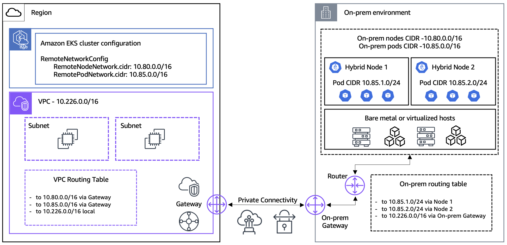

# Requisitos previos

< [Tabla de contenidos](./) | [Siguiente: Configuración de red](02-network-configuration.md) >

> **Versiones compatibles**: EKS 1.31+, nodeadm 0.1+ **Última actualización**: February 23, 2026

Este documento cubre los requisitos del sistema para nodos on-premises, servidores GPU e infraestructura de red necesarios para desplegar EKS Hybrid Nodes.

## Resumen de requisitos previos de red

El siguiente diagrama muestra los requisitos previos de red para conectar nodos on-premises a un cluster EKS, incluida la configuración de VPC, Transit Gateway/Virtual Private Gateway y los requisitos de CIDR.



## Requisitos de nodos on-premises

### Sistemas operativos compatibles

| Sistema operativo | Versión                                  | Arquitectura   |
| ----------------- | ---------------------------------------- | -------------- |
| Ubuntu LTS        | 20.04, 22.04, 24.04                      | x86\_64, arm64 |
| RHEL              | 8, 9                                     | x86\_64, arm64 |
| Amazon Linux      | 2023                                     | x86\_64, arm64 |
| Bottlerocket      | v1.37.0 y superior (solo variantes VMware) | solo x86\_64   |

> **Nota sobre Bottlerocket**: Solo las variantes VMware de Bottlerocket son compatibles con EKS Hybrid Nodes, y se requiere Kubernetes v1.28 o superior. Bottlerocket incluye automáticamente todas las dependencias necesarias, por lo que no se requiere la CLI `nodeadm`. La arquitectura ARM no es compatible con Bottlerocket.

> **Notas sobre la arquitectura ARM**:
>
> * Los nodos ARM requieren **ARMv8.2 o posterior con extensión Crypto** (para kube-proxy v1.31+)
> * **Raspberry Pi (anterior a Pi 5) no es compatible** — solo admite ARMv8.0, que no incluye la extensión Crypto
> * Pi 5 (ARMv8.2) y posteriores son compatibles

### Runtime de contenedores

```bash
# Check containerd version
containerd --version
# Required version: 1.6.x or higher

# Check Docker Engine version (includes containerd)
docker --version
# Required version: 20.10.10 or higher
```

> **Notas de containerd específicas del OS**:
>
> * **Ubuntu 24.04**: Requiere containerd v1.7.19 o posterior, o cambios en la configuración del perfil de AppArmor
> * **RHEL**: `--containerd-source distro` **no es válido**. Debe usar `--containerd-source docker`
> * **Ubuntu 20.04 / RHEL 8**: El kernel predeterminado es inferior a 5.10, que es requerido para Cilium v1.18.x

### Especificaciones mínimas de hardware

| Recurso | Mínimo (oficial de AWS) | Recomendado     |
| ------- | ----------------------- | --------------- |
| CPU     | 1 vCPU                  | 4 núcleos o más |
| RAM     | 1 GiB                   | 8 GB o más      |
| Disco   | SSD de 50 GB            | SSD NVMe de 100 GB |
| Red     | 100 Mbps                | 10 Gbps o más   |

> **Nota**: El mínimo oficial de AWS es 1 vCPU / 1 GiB, pero se recomiendan 2 núcleos / 4 GB o más para ejecutar cargas de trabajo reales.

### Comprobación de configuración del sistema

```bash
# Verify swap is disabled
free -h
# Swap should be 0

# Disable swap
sudo swapoff -a
sudo sed -i '/ swap / s/^\(.*\)$/#\1/g' /etc/fstab

# Load required kernel modules
cat <<EOF | sudo tee /etc/modules-load.d/k8s.conf
overlay
br_netfilter
EOF

sudo modprobe overlay
sudo modprobe br_netfilter

# Set kernel parameters
cat <<EOF | sudo tee /etc/sysctl.d/k8s.conf
net.bridge.bridge-nf-call-iptables  = 1
net.bridge.bridge-nf-call-ip6tables = 1
net.ipv4.ip_forward                 = 1
EOF

sudo sysctl --system
```

## Creación de imágenes de nodo con plantillas de AWS Packer

AWS proporciona plantillas de Packer de ejemplo para crear imágenes de nodo para EKS Hybrid Nodes. Estas plantillas admiten formatos de salida OVA (vSphere), Qcow2 y Raw.

### Requisitos previos de Packer

| Herramienta          | Versión mínima |
| -------------------- | -------------- |
| Packer               | v1.11.0+       |
| Plugin VMware vSphere | v1.4.0+        |
| Plugin QEMU          | Más reciente   |

### Variables de entorno

| Variable              | Descripción                                  | Predeterminado |
| --------------------- | -------------------------------------------- | -------------- |
| `PKR_SSH_PASSWORD`    | Contraseña SSH                               | -              |
| `ISO_URL`             | URL de la imagen ISO del OS                  | -              |
| `ISO_CHECKSUM`        | Suma de comprobación ISO                     | -              |
| `CREDENTIAL_PROVIDER` | Proveedor de credenciales (`ssm` o `iam`)    | `ssm`          |
| `K8S_VERSION`         | Versión de Kubernetes                        | -              |
| `NODEADM_ARCH`        | Arquitectura (`amd64` o `arm64`)             | `amd64`        |

**Variables específicas de RHEL:**

| Variable      | Descripción                               |
| ------------- | ----------------------------------------- |
| `RH_USERNAME` | Nombre de usuario de suscripción Red Hat  |
| `RH_PASSWORD` | Contraseña de suscripción Red Hat         |

**Variables específicas de vSphere:**

| Variable             | Descripción                  |
| -------------------- | ---------------------------- |
| `VSPHERE_SERVER`     | Dirección del servidor vCenter |
| `VSPHERE_USER`       | Nombre de usuario de vCenter |
| `VSPHERE_PASSWORD`   | Contraseña de vCenter        |
| `VSPHERE_DATACENTER` | Nombre del Datacenter        |
| `VSPHERE_CLUSTER`    | Nombre del Cluster           |
| `VSPHERE_DATASTORE`  | Nombre del Datastore         |
| `VSPHERE_NETWORK`    | Nombre de la red             |

### Comandos de compilación

```bash
# Build vSphere OVA (Ubuntu 22.04)
packer build -only=general-build.vsphere-iso.ubuntu22 template.pkr.hcl

# Build QEMU image (RHEL 9)
packer build -only=general-build.qemu.rhel9 template.pkr.hcl

# Build Amazon Linux 2023
packer build -only=general-build.qemu.al2023 template.pkr.hcl
```

> **Nota**: Establecer la variable de entorno `CREDENTIAL_PROVIDER` en `iam` crea una imagen para IAM Roles Anywhere. El valor predeterminado es `ssm`.

## Requisitos de servidores GPU (opcional)

### Driver NVIDIA

```bash
# Check NVIDIA driver version
nvidia-smi --query-gpu=driver_version --format=csv,noheader
# Required version: 550.x or higher

# Check CUDA version
nvcc --version
# Recommended version: CUDA 12.x
```

### Modelos GPU compatibles

| Modelo GPU  | VRAM     | Uso principal                       |
| ----------- | -------- | ----------------------------------- |
| NVIDIA H100 | 80 GB    | Entrenamiento/inferencia LLM a gran escala |
| NVIDIA H200 | 141 GB   | Modelos muy grandes                 |
| NVIDIA A100 | 40/80 GB | Propósito general AI/ML             |
| NVIDIA L40S | 48 GB    | Optimizado para inferencia          |

### Instalación del driver GPU

**Ubuntu 22.04 LTS (recomendado):**

```bash
# Install kernel headers
sudo apt-get install -y linux-headers-$(uname -r)

# Add NVIDIA driver repository
distribution=$(. /etc/os-release;echo $ID$VERSION_ID | sed -e 's/\.//g')
wget https://developer.download.nvidia.com/compute/cuda/repos/$distribution/x86_64/cuda-keyring_1.1-1_all.deb
sudo dpkg -i cuda-keyring_1.1-1_all.deb
sudo apt-get update

# Install driver
sudo apt-get install -y cuda-drivers-550

# Install NVIDIA Container Toolkit
curl -fsSL https://nvidia.github.io/libnvidia-container/gpgkey | sudo gpg --dearmor -o /usr/share/keyrings/nvidia-container-toolkit-keyring.gpg
curl -s -L https://nvidia.github.io/libnvidia-container/stable/deb/nvidia-container-toolkit.list | \
  sed 's#deb https://#deb [signed-by=/usr/share/keyrings/nvidia-container-toolkit-keyring.gpg] https://#g' | \
  sudo tee /etc/apt/sources.list.d/nvidia-container-toolkit.list
sudo apt-get update
sudo apt-get install -y nvidia-container-toolkit

# Update containerd configuration
sudo nvidia-ctk runtime configure --runtime=containerd
sudo systemctl restart containerd
```

**RHEL 9:**

```bash
# Install kernel development packages
sudo dnf install -y kernel-devel-$(uname -r) kernel-headers-$(uname -r)

# Add NVIDIA driver repository
sudo dnf config-manager --add-repo https://developer.download.nvidia.com/compute/cuda/repos/rhel9/x86_64/cuda-rhel9.repo

# Install driver
sudo dnf module install -y nvidia-driver:550-dkms

# Install NVIDIA Container Toolkit
curl -s -L https://nvidia.github.io/libnvidia-container/stable/rpm/nvidia-container-toolkit.repo | \
  sudo tee /etc/yum.repos.d/nvidia-container-toolkit.repo
sudo dnf install -y nvidia-container-toolkit

# Update containerd configuration
sudo nvidia-ctk runtime configure --runtime=containerd
sudo systemctl restart containerd
```

## Requisitos de red

### Ancho de banda y latencia

| Elemento    | Mínimo            | Recomendado        |
| ----------- | ----------------- | ------------------ |
| Ancho de banda | 100 Mbps        | 10 Gbps o más      |
| Latencia    | 200 ms RTT o menos | 5 ms o menos       |
| Pérdida de paquetes | 0.1% o menos | 0.01% o menos      |
| MTU         | 1500              | 9000 (Jumbo Frame) |

### Configuración de Jumbo Frame

```bash
# Check MTU setting
ip link show eth0 | grep mtu

# Set MTU to 9000 (temporary)
sudo ip link set dev eth0 mtu 9000

# Permanent configuration (Amazon Linux 2023 - NetworkManager)
sudo nmcli connection modify "System eth0" 802-3-ethernet.mtu 9000
sudo nmcli connection up "System eth0"

# Verify configuration
nmcli connection show "System eth0" | grep mtu
```

## Configuración del proveedor de credenciales IAM

EKS Hybrid Nodes requiere uno de dos proveedores de credenciales para autenticar nodos on-premises con AWS.

### Opción A: SSM Hybrid Activations

SSM Hybrid Activations es la opción más sencilla, ya que no requiere infraestructura PKI.

```bash
# Create IAM role for hybrid nodes
aws iam create-role \
  --role-name EKSHybridNodeRole \
  --assume-role-policy-document '{
    "Version": "2012-10-17",
    "Statement": [{
      "Effect": "Allow",
      "Principal": {"Service": "ssm.amazonaws.com"},
      "Action": "sts:AssumeRole"
    }]
  }'

# Attach required policies
aws iam attach-role-policy \
  --role-name EKSHybridNodeRole \
  --policy-arn arn:aws:iam::aws:policy/AmazonEKSWorkerNodeMinimalPolicy

aws iam attach-role-policy \
  --role-name EKSHybridNodeRole \
  --policy-arn arn:aws:iam::aws:policy/AmazonSSMManagedInstanceCore

# Create SSM Hybrid Activation
aws ssm create-activation \
  --default-instance-name "eks-hybrid-node" \
  --iam-role EKSHybridNodeRole \
  --registration-limit 100 \
  --region ap-northeast-2
```

### Opción B: IAM Roles Anywhere

IAM Roles Anywhere utiliza certificados X.509 de tu PKI existente, ideal para entornos air-gap.

```bash
# 1. Create Trust Anchor with your CA certificate
aws rolesanywhere create-trust-anchor \
  --name "eks-hybrid-trust-anchor" \
  --source "sourceType=CERTIFICATE_BUNDLE,sourceData={x509CertificateData=$(cat ca.pem)}" \
  --enabled

# 2. Create Profile that maps to an IAM Role
aws rolesanywhere create-profile \
  --name "eks-hybrid-profile" \
  --role-arns arn:aws:iam::123456789012:role/EKSHybridNodeRole \
  --enabled

# 3. Issue X.509 certificate for each node (using your CA)
openssl req -new -key node.key -out node.csr -subj "/CN=hybrid-node-001"
openssl x509 -req -in node.csr -CA ca.pem -CAkey ca.key -CAcreateserial -out node.crt -days 365

# 4. Distribute cert and key to node
sudo mkdir -p /etc/iam/pki
sudo cp node.crt /etc/iam/pki/server.pem
sudo cp node.key /etc/iam/pki/server.key
```

### Configuración de IAM basada en CloudFormation

En lugar de la CLI, puedes usar CloudFormation para configurar roles IAM y recursos relacionados.

**Plantilla de CloudFormation para SSM:**

```bash
# Download template
curl -OL 'https://raw.githubusercontent.com/aws/eks-hybrid/refs/heads/main/example/hybrid-ssm-cfn.yaml'

# Create parameter file
cat > cfn-ssm-parameters.json << 'EOF'
[
  {"ParameterKey": "RoleName", "ParameterValue": "EKSHybridNodeRole"},
  {"ParameterKey": "SSMDeregisterConditionTagKey", "ParameterValue": "EKSClusterARN"},
  {"ParameterKey": "SSMDeregisterConditionTagValue", "ParameterValue": "arn:aws:eks:ap-northeast-2:123456789012:cluster/my-hybrid-cluster"}
]
EOF

# Deploy stack
aws cloudformation create-stack \
  --stack-name eks-hybrid-ssm-role \
  --template-body file://hybrid-ssm-cfn.yaml \
  --parameters file://cfn-ssm-parameters.json \
  --capabilities CAPABILITY_NAMED_IAM
```

**Plantilla de CloudFormation para IAM Roles Anywhere:**

```bash
# Download template
curl -OL 'https://raw.githubusercontent.com/aws/eks-hybrid/refs/heads/main/example/hybrid-ira-cfn.yaml'

# Create parameter file
cat > cfn-iamra-parameters.json << 'EOF'
[
  {"ParameterKey": "RoleName", "ParameterValue": "EKSHybridNodeRole"},
  {"ParameterKey": "CertAttributeTrustPolicy", "ParameterValue": "CN"},
  {"ParameterKey": "CABundleCert", "ParameterValue": "-----BEGIN CERTIFICATE-----\n...\n-----END CERTIFICATE-----"}
]
EOF

# Deploy stack
aws cloudformation create-stack \
  --stack-name eks-hybrid-iamra-role \
  --template-body file://hybrid-ira-cfn.yaml \
  --parameters file://cfn-iamra-parameters.json \
  --capabilities CAPABILITY_NAMED_IAM
```

### Detalles de políticas IAM

Detalles de las políticas IAM requeridas para el rol de nodo híbrido.

**Políticas administradas requeridas:**

| Política                             | Propósito                                     |
| ------------------------------------ | --------------------------------------------- |
| `AmazonEC2ContainerRegistryPullOnly` | Extraer imágenes de contenedor desde ECR      |
| `AmazonSSMManagedInstanceCore`       | Funcionalidad principal del agente SSM (al usar SSM) |

**Políticas opcionales:**

| Política                            | Propósito                |
| ----------------------------------- | ------------------------ |
| `eks-auth:AssumeRoleForPodIdentity` | Compatibilidad con EKS Pod Identity |

**Política condicional de baja de registro de SSM:**

En entornos multi-cluster, usa la etiqueta de condición `EKSClusterARN` para garantizar que los nodos solo puedan darse de baja de clusters específicos:

```json
{
  "Version": "2012-10-17",
  "Statement": [
    {
      "Effect": "Allow",
      "Action": "ssm:DeregisterManagedInstance",
      "Resource": "*",
      "Condition": {
        "StringEquals": {
          "ssm:resourceTag/EKSClusterARN": "arn:aws:eks:ap-northeast-2:123456789012:cluster/my-hybrid-cluster"
        }
      }
    }
  ]
}
```

### Detalles de la política de confianza de IAM Roles Anywhere

La configuración de la política de confianza es crítica cuando se usa IAM Roles Anywhere.

**Mapeo x509Subject/CN:**

El CN (Common Name) del certificado debe coincidir con el nombre del nodo. Esto se usa para el seguimiento de auditoría y la identificación del nodo.

```json
{
  "Version": "2012-10-17",
  "Statement": [
    {
      "Effect": "Allow",
      "Principal": {
        "Service": "rolesanywhere.amazonaws.com"
      },
      "Action": [
        "sts:AssumeRole",
        "sts:TagSession",
        "sts:SetSourceIdentity"
      ],
      "Condition": {
        "StringEquals": {
          "aws:PrincipalTag/x509Subject/CN": "${aws:RequestTag/x509Subject/CN}"
        },
        "ArnEquals": {
          "aws:SourceArn": "arn:aws:rolesanywhere:ap-northeast-2:123456789012:trust-anchor/TRUST_ANCHOR_ID"
        }
      }
    }
  ]
}
```

**Componentes clave:**

| Componente              | Descripción                                      |
| ----------------------- | ------------------------------------------------ |
| `sts:SetSourceIdentity` | Establece la identidad de origen para seguimiento de auditoría |
| `sts:RoleSessionName`   | Nombre de sesión vinculado al CN del certificado |
| `x509Subject/CN`        | El CN del certificado debe coincidir con nodeName |

### Comparación de duración de credenciales

| Aspecto              | SSM                    | IAM Roles Anywhere                                     |
| -------------------- | ---------------------- | ------------------------------------------------------ |
| Duración predeterminada | 1 hora (fija)       | 1 hora (configurable)                                  |
| Duración máxima      | 1 hora                 | 12 horas                                               |
| Rotación             | Automática por AWS     | Automática, respeta `durationSeconds`                  |
| `MaxSessionDuration` | N/A                    | El valor del rol IAM debe superar el `durationSeconds` del perfil |
| Configuración        | No configurable        | Se establece mediante el parámetro `durationSeconds` del perfil |

> **Nota**: Al usar IAM Roles Anywhere, el `MaxSessionDuration` del rol IAM debe ser mayor que el valor `durationSeconds` del perfil. De lo contrario, la obtención de credenciales fallará.

## Preparación de acceso al cluster

Los nodos híbridos requieren entradas de acceso adecuadas para unirse al cluster EKS.

### Entrada de acceso HYBRID\_LINUX (recomendada)

El tipo de entrada de acceso `HYBRID_LINUX` está diseñado específicamente para nodos híbridos:

```bash
aws eks create-access-entry \
  --cluster-name my-hybrid-cluster \
  --principal-arn arn:aws:iam::123456789012:role/EKSHybridNodeRole \
  --type HYBRID_LINUX
```

Este comando establece automáticamente:

* Nombre de usuario: <code v-pre>system:node:{{SessionName}}</code>
* Grupos de Kubernetes: `system:bootstrappers`, `system:nodes`

### Alternativa con ConfigMap aws-auth

Cuando se usa el modo de autenticación `API_AND_CONFIG_MAP`, puedes usar el ConfigMap `aws-auth` como alternativa:

```yaml
apiVersion: v1
kind: ConfigMap
metadata:
  name: aws-auth
  namespace: kube-system
data:
  mapRoles: |
    - groups:
      - system:bootstrappers
      - system:nodes
      rolearn: arn:aws:iam::123456789012:role/EKSHybridNodeRole
      username: system:node:{{SessionName}}
```

```bash
kubectl apply -f aws-auth-cm.yaml
```

> **Nota**: El método ConfigMap `aws-auth` es un enfoque legacy. Para clusters nuevos, se recomienda usar la entrada de acceso `HYBRID_LINUX`.

## Requisitos de configuración de VPC

La VPC del cluster EKS debe estar configurada correctamente para admitir la conectividad de EKS Hybrid Nodes.

### Configuración de route table

Las route tables de VPC deben incluir rutas para CIDR on-premises:

| Destino                       | Target  | Propósito                    |
| ----------------------------- | ------- | ---------------------------- |
| 10.0.0.0/16 (VPC CIDR)        | local   | Tráfico interno de VPC       |
| 10.80.0.0/16 (Remote Node CIDR) | TGW/VGW | Ruta a nodos on-premises     |
| 10.85.0.0/16 (Remote Pod CIDR)  | TGW/VGW | Ruta a Pods on-premises      |

### Requisitos de Security Group

EKS crea automáticamente reglas inbound cuando se especifican `RemoteNodeNetwork` / `RemotePodNetwork`. Las reglas outbound adicionales deben configurarse manualmente:

| Dirección         | Protocolo | Puerto        | Origen/Destino  | Propósito             |
| ----------------- | --------- | ------------- | --------------- | --------------------- |
| Inbound (auto)    | TCP       | 443           | Remote Node CIDR | Kubelet → API Server  |
| Inbound (auto)    | TCP       | 443           | Remote Pod CIDR | Pod → API Server      |
| Inbound (auto)    | TCP       | 10250         | Remote Node CIDR | API Server → Kubelet  |
| Outbound (manual) | TCP       | 10250         | Remote Node CIDR | API Server → Kubelet  |
| Outbound (manual) | TCP       | Webhook ports | Remote Pod CIDR | API Server → Webhooks |

> **Nota**: Existe un límite de 60 reglas inbound por Security Group. Verifica el conteo de reglas al usar múltiples CIDR.

### Modos de acceso al endpoint de API Server

| Modo        | Ruta de Kubelet              | Caso de uso                                  |
| ----------- | ---------------------------- | -------------------------------------------- |
| **Public**  | Internet → endpoint EKS API  | Configuración simple, internet requerido desde on-prem |
| **Private** | VPN/DX → VPC ENI → API Server | Air-gap, máxima seguridad **(recomendado)** |

> **Advertencia**: **No uses el modo "Public and Private" con nodos híbridos.** En este modo, los nodos híbridos resuelven el endpoint EKS API solo a IP públicas, lo que hace que fallen las conexiones privadas VPN/Direct Connect. Esto provoca que **los nodos no puedan unirse al cluster**. Debes elegir Public o Private, no ambos.

> **Recomendación**: Usa acceso al endpoint **Private** para entornos híbridos de producción.

## Creación de un cluster EKS para EKS Hybrid Nodes

Al crear un cluster EKS con compatibilidad para EKS Hybrid Nodes, se aplican los siguientes requisitos:

* **Modo de autenticación**: Debe usar `API` o `API_AND_CONFIG_MAP`
* **Familia de direcciones IP**: Debe usar IPv4
* **Conectividad de endpoint**: Debe usar solo Public O Private ("Public and Private" **no compatible** — causa fallos de unión de nodos híbridos)
* **Redes remotas**: Especifica los CIDR `RemoteNodeNetwork` y `RemotePodNetwork`

### Uso de eksctl

```yaml
# cluster-config.yaml
apiVersion: eksctl.io/v1alpha5
kind: ClusterConfig

metadata:
  name: my-hybrid-cluster
  region: ap-northeast-2
  version: "1.31"

remoteNetworkConfig:
  iam:
    provider: ssm  # or 'ira' for IAM Roles Anywhere
  vpcGatewayID: tgw-0123456789abcdef0
  remoteNodeNetworks:
    - cidrs: ["10.80.0.0/16"]
  remotePodNetworks:
    - cidrs: ["10.85.0.0/16"]
```

```bash
eksctl create cluster -f cluster-config.yaml
```

### Uso de AWS CLI

```bash
aws eks create-cluster \
    --name my-hybrid-cluster \
    --region ap-northeast-2 \
    --kubernetes-version 1.31 \
    --role-arn arn:aws:iam::123456789012:role/myAmazonEKSClusterRole \
    --resources-vpc-config subnetIds=subnet-xxx,subnet-yyy,securityGroupIds=sg-zzz,endpointPrivateAccess=true,endpointPublicAccess=false \
    --access-config authenticationMode=API_AND_CONFIG_MAP \
    --remote-network-config '{"remoteNodeNetworks":[{"cidrs":["10.80.0.0/16"]}],"remotePodNetworks":[{"cidrs":["10.85.0.0/16"]}]}'
```

### Actualizar kubeconfig

```bash
aws eks update-kubeconfig --name my-hybrid-cluster --region ap-northeast-2

# Verify cluster access
kubectl get svc
```

## Add-ons compatibles para EKS Hybrid Nodes

No todos los add-ons de EKS son compatibles con nodos híbridos. Amazon VPC CNI **no** es compatible.

### Add-ons de AWS

| Add-on                   | Versión mínima compatible |
| ------------------------ | ------------------------- |
| kube-proxy               | v1.25.14-eksbuild.2+      |
| CoreDNS                  | v1.9.3-eksbuild.7+        |
| ADOT (OpenTelemetry)     | v0.102.1-eksbuild.2+      |
| CloudWatch Observability | v2.2.1-eksbuild.1+        |
| EKS Pod Identity Agent   | v1.3.3-eksbuild.1+        |
| Node monitoring agent    | v1.2.0-eksbuild.1+        |
| CSI snapshot controller  | v8.1.0-eksbuild.1+        |

### Add-ons de la comunidad

| Add-on                    | Versión mínima compatible |
| ------------------------- | ------------------------- |
| Kubernetes Metrics Server | v0.7.2-eksbuild.1+        |
| cert-manager              | v1.17.2-eksbuild.1+       |
| Prometheus Node Exporter  | v1.9.1-eksbuild.2+        |
| kube-state-metrics        | v2.15.0-eksbuild.4+       |
| External DNS              | v0.19.0-eksbuild.1+       |

***

< [Tabla de contenidos](./) | [Siguiente: Configuración de red](02-network-configuration.md) >
