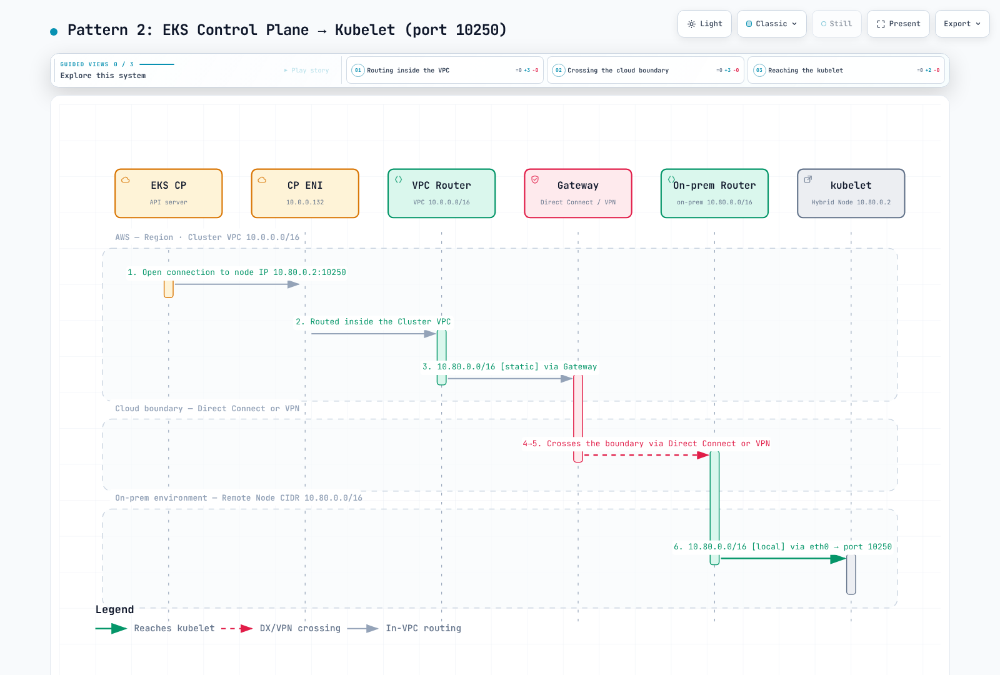
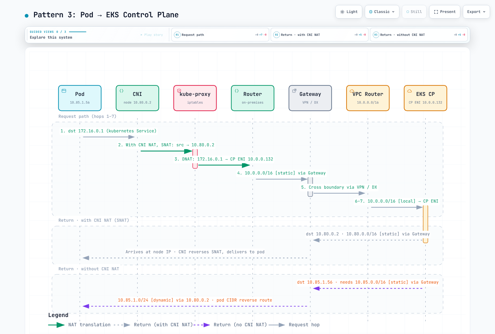
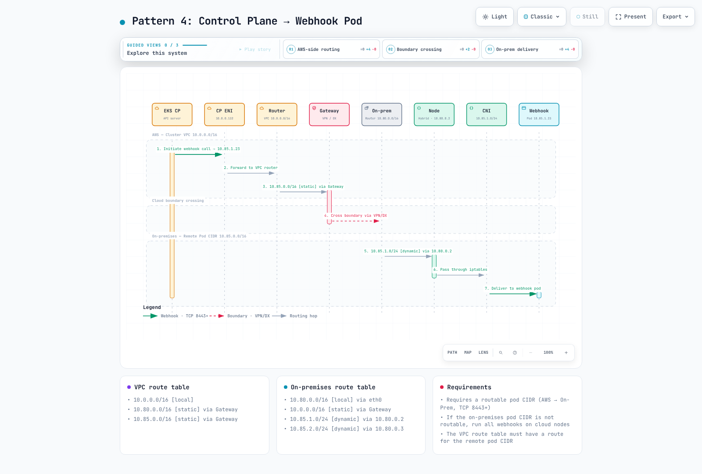
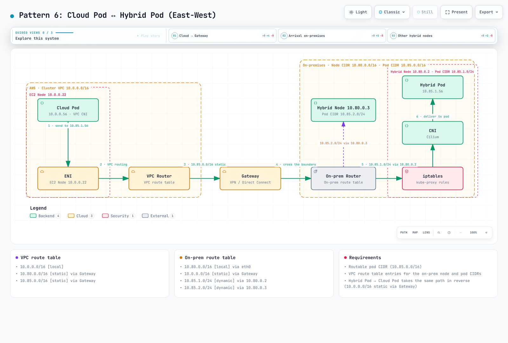

# Configuración de red

> **Versiones compatibles**: ejemplos de EKS 1.36; referencia de Cilium 1.18.3-0 mantenida por AWS; se requiere host/kernel compatible
> **Última actualización**: September 16, 2026

Valide por separado el enrutamiento, DNS, TLS, las credenciales y el tráfico de aplicaciones. Estos ejemplos se comprobaron con esquemas y fixtures locales, incluido un proveedor de Terraform simulado; no se modificaron recursos de AWS, routers, firewalls ni clusters activos. Los diagramas son ilustraciones del repositorio basadas en conceptos de AWS, no validación publicada por AWS de esta configuración.


[🔍 Ver diagrama interactivo](https://www.atomai.click/kubernetes-docs/archmaps/en-eks-hybrid-nodes-prereq-0.html)

**Documento complementario para el equipo de seguridad:** [Revisión de separación de red de Hybrid Nodes](11-network-separation-security.md) explica las nuevas conexiones del plano de control a las instalaciones locales, los tipos de endpoints, los límites de permisos y datos, y la evidencia de revisión. La conectividad privada por sí sola no establece el cumplimiento normativo.

## Resumen de la arquitectura de red

El tráfico del plano de control→nodo híbrido y el tráfico privado de la API de Kubernetes usan la ruta de red de la VPC del cluster. En su lugar, el tráfico de kubelet a un endpoint de API público usa su ruta pública configurada; decir que «todo el tráfico siempre atraviesa las ENI de la VPC» era demasiado amplio. Los VIF públicos de Direct Connect, la conectividad privada y las rutas de internet público son opciones distintas.

Las ENI/IP del plano de control de EKS pueden cambiar. Revise la propiedad real del cluster y los rangos de subred aprobados para el plano de control en lugar de tratar cada ENI `Amazon EKS*` en una VPC compartida como perteneciente a este cluster.

Vincule la cuenta y el contexto de Kubernetes antes de los diagnósticos de solo lectura:

```bash
set -euo pipefail
: "${EXPECTED_ACCOUNT_ID:?Set the intended account}"
: "${AWS_REGION:?Set the cluster Region}"
: "${CLUSTER_NAME:?Set the reviewed cluster name}"
: "${KUBECONFIG:?Set the reviewed kubeconfig}"
export KUBECONFIG KUBE_CONTEXT="${KUBE_CONTEXT:-$CLUSTER_NAME}"
check_account() {
  local account
  account=$(aws sts get-caller-identity --region "$AWS_REGION" --query Account --output text) || return
  test "$account" = "$EXPECTED_ACCOUNT_ID" || { printf 'Account mismatch.\n' >&2; return 1; }
}
check_account
umask 077
export WORK_DIR
WORK_DIR=$(mktemp -d "$PWD/hybrid-network.XXXXXXXX")
aws eks describe-cluster --region "$AWS_REGION" --name "$CLUSTER_NAME" --output json \
  > "$WORK_DIR/cluster.json"
endpoint=$(kubectl --context "$KUBE_CONTEXT" config view --minify \
  -o jsonpath='{.clusters[0].cluster.server}')
jq -e --arg endpoint "$endpoint" '
  .cluster.status=="ACTIVE" and .cluster.endpoint==$endpoint and
  (.cluster.remoteNetworkConfig.remoteNodeNetworks|length)>0
' "$WORK_DIR/cluster.json" >/dev/null
printf 'Private diagnostics: %s\n' "$WORK_DIR"
```

## Requisitos de rangos CIDR

Use redes remotas de nodos/Pod IPv4 **RFC1918 o CGNAT** sin solapamiento, separadas de los CIDR de VPC y Kubernetes Service. Se admiten hasta 15 CIDR de cada tipo remoto. El EKS actual admite la configuración de red remota en clusters existentes mediante su flujo de trabajo de API; no es solo para la creación.

| Comportamiento de red | Significado |
|------------------|---------|
| IP de Pod enrutable | Las rutas aprobadas permiten a clientes de cloud/plano de control iniciar conexiones a IP de Pod |
| Egreso enmascarado | SNAT puede proporcionar una ruta de retorno para conexiones iniciadas por Pods; no permite automáticamente nuevas conexiones entrantes |
| Red de Pod no enrutable | El tráfico directo cloud→Pod necesita otra ruta compatible; use webhooks/servicios de API alojados en cloud para el diseño convencional |

No enrutable no significa que un Pod no pueda iniciar ninguna llamada de API de AWS. Para la comunicación directa entre Pods híbridos/cloud y los webhooks alojados en entornos híbridos, proporcione las rutas reales de los Pod. Las alternativas de gateway/proxy tienen requisitos independientes.

## Puertos de firewall obligatorios

| Flujo | Protocolo / puerto |
|------|-----------------|
| Node/Pod → API de Kubernetes | TCP443 al endpoint real del cluster |
| ENI del plano de control → kubelet | TCP10250 con autenticación/autorización de kubelet |
| Plano de control → webhook o Pod de API agregada | Su puerto TCP configurado, no un rango genérico «8443+» |
| Clientes DNS ↔ resolvers reales | UDP/TCP53 y tráfico de retorno con estado |
| Cilium VXLAN entre nodos participantes | UDP8472 |
| Cilium Geneve, solo si se selecciona y es compatible con el diseño | UDP6081 |
| Comprobaciones de estado de Cilium | TCP4240 y la accesibilidad ICMP/endpoint de estado requerida |
| Nodo BGP↔router | TCP179 para los peers activo/pasivo configurados |
| Transporte de gateway VPN | UDP500/4500 y requisitos aplicables de transporte IPsec |
| Aplicaciones / servicios de credenciales y registro de AWS | Solo sus destinos y puertos reales |

Aplique cambios de firewall mediante el propietario de la red, preservando el seguimiento de conexiones y las reglas existentes. Las antiguas reglas INPUT amplias de `10.0.0.0/8`, los permisos DNS/VXLAN sin alcance y los guardados de conjuntos de reglas completos no eran una política de firewall reutilizable y segura. No abra kubelet 10255 sin autenticación como requisito moderno opcional.

## Acceso a endpoints de AWS

El **endpoint PrivateLink de la API de administración de EKS no es el endpoint del servidor API de Kubernetes**.

| Sufijo de servicio para `com.amazonaws.<region>.*` | Propósito / cuándo se necesita |
|------------------------------------------------|-----------------------|
| `eks` | Llamadas de administración de AWS EKS como DescribeCluster |
| `eks-auth` | EKS Pod Identity, cuando se usa |
| `ecr.api`, `ecr.dkr` | API/registro privado de ECR; las capas de imágenes también necesitan acceso a S3 |
| `s3` | Acceso privado a S3; las instalaciones locales no pueden usar directamente un endpoint de gateway de VPC |
| `ssm`, servicios de mensajería SSM aplicables | Funciones de credenciales/administración de SSM |
| `rolesanywhere` | Credenciales de IAM Roles Anywhere cuando se usa ese proveedor |
| `sts` | Llamadas reales de cliente STS/IRSA/AssumeRole; firmar localmente un token de EKS no es en sí una solicitud de red STS de cliente |
| `logs`, `monitoring`, otros servicios seleccionados | Solo si los agentes/workloads elegidos los llaman |
| `oidc-eks` | Servicio PrivateLink actual de descubrimiento OIDC/JWKS de EKS, donde esté disponible |
| `eks-proxy` | Vistas de recursos de la consola de AWS; no una API/SDK de aplicación pública |

Confirme la disponibilidad del servicio en la Region de destino. Los endpoints privados de ECR no hacen privados a **ECR público**, CloudFront ni repositorios de paquetes arbitrarios. Por ejemplo, el chart OCI de AWS Cilium en ECR público necesita una ruta de distribución aprobada que sea accesible o esté replicada.

El descubrimiento OIDC/JWKS es material de clave pública anónimo. `oidc-eks` solo acepta su política de endpoint predeterminada de acceso completo; use SG/enrutamiento para la accesibilidad y condiciones de confianza `aud`/`sub` de IAM para la autorización de roles. STS valida tokens IRSA dentro de AWS, independientemente de este endpoint de VPC.

Para una política de endpoint CreateSession de Roles Anywhere, el principal debe ser `*` porque la evaluación precede a la autenticación por certificado; restrinja el recurso trust-anchor aprobado y las condiciones de certificado compatibles como se documenta. No copie una política de endpoint genérica entre estos servicios diferentes. Las políticas de endpoint filtran el tráfico del endpoint; no sustituyen la confianza de IAM/rol ni deshabilitan globalmente los endpoints de servicio públicos.

```bash
check_account
vpc_id=$(jq -er '.cluster.resourcesVpcConfig.vpcId' "$WORK_DIR/cluster.json")
aws ec2 describe-vpc-endpoints --region "$AWS_REGION" \
  --filters "Name=vpc-id,Values=$vpc_id" --output json |
  jq '[.VpcEndpoints[]|{id:.VpcEndpointId,service:.ServiceName,type:.VpcEndpointType,
      state:.State,privateDNS:.PrivateDnsEnabled,dnsOptions:.DnsOptions,
      subnets:.SubnetIds,groups:.Groups,dnsEntries:.DnsEntries}]'
```

### DNS privado de S3 y distribución de artefactos

Los **endpoints de interfaz** de S3 admiten DNS privado. La opción solo de Resolver entrante dirige las consultas de instalaciones locales a través de endpoints de interfaz mientras que el tráfico dentro de la VPC usa un endpoint de gateway de S3 obligatorio. Mantenga ese gateway mientras la opción esté activada. Como alternativa, elimine la opción para usar el endpoint de interfaz para todo el tráfico S3 relevante.

El DNS privado no es una reescritura de TLS. Una asignación PHZ/CNAME de `hybrid-assets.eks.amazonaws.com` a un endpoint de S3 no da a S3 el certificado ni el comportamiento de enrutamiento de objeto/Host del nombre de host de CloudFront. No deshabilite la verificación de TLS para hacer funcionar ese mirror. Use una ruta compatible de preparación de artefactos/configuración de cliente, un mirror aprobado con su propio nombre de host/certificado o dependencias preinstaladas en una imagen validada.

## Endpoints privados de VPC (conectividad de internet restringida) {#vpc-private-endpoints-air-gap-private-connectivity}

Aquí «air-gap» significa acceso restringido a internet con la conectividad AWS requerida, no un cluster desconectado.

El siguiente ejemplo completo de Terraform usa una VPC existente, subredes de endpoint y TGW. No crea un circuito VPN/DX, adjuntos de TGW, rutas de instalaciones locales ni configuración de DNS privado de EKS. Verifique la compatibilidad/nombres de DNS de VPC y AZ reales distintas; dos ID de subred diferentes por sí solos no demuestran diversidad de AZ.

Use el propietario de infraestructura original e importe/adopte los recursos existentes antes de planificar reemplazos. El conjunto de endpoints predeterminado ilustra SSM; cámbielo para el proveedor/workloads elegidos. Los endpoints y las ENI de Resolver generan cargos. La protección de cuenta del proveedor y el ingreso con alcance definido son intencionados; el tráfico de respuesta usa el seguimiento con estado de SG.

```hcl
terraform {
  required_version = ">= 1.9, < 2.0"
  required_providers {
    aws = {
      source  = "hashicorp/aws"
      version = "= 6.64.0"
    }
  }
}

provider "aws" {
  region              = var.region
  allowed_account_ids = [var.expected_account_id]
}

variable "expected_account_id" {
  type = string
  validation {
    condition     = can(regex("^[0-9]{12}$", var.expected_account_id))
    error_message = "Set the reviewed 12-digit account ID."
  }
}

variable "region" {
  type = string
}

variable "name_prefix" {
  type    = string
  default = "hybrid-network"
}

variable "vpc_id" {
  type = string
}

variable "endpoint_subnet_ids" {
  type = set(string)
  validation {
    condition     = length(var.endpoint_subnet_ids) >= 2
    error_message = "Provide subnets in at least two verified Availability Zones."
  }
}

variable "s3_gateway_route_table_ids" {
  type = set(string)
  validation {
    condition     = length(var.s3_gateway_route_table_ids) > 0
    error_message = "Provide the reviewed VPC route tables for the S3 gateway endpoint."
  }
}

variable "client_ipv4_cidrs" {
  type = set(string)
  validation {
    condition = length(var.client_ipv4_cidrs) > 0 && alltrue([
      for c in var.client_ipv4_cidrs : can(cidrnetmask(c)) && c != "0.0.0.0/0"
    ])
    error_message = "Provide scoped IPv4 CIDRs for the actual VPC/on-premises clients."
  }
}

variable "onprem_dns_client_cidrs" {
  type = set(string)
  validation {
    condition = length(var.onprem_dns_client_cidrs) > 0 && alltrue([
      for c in var.onprem_dns_client_cidrs : can(cidrnetmask(c)) && c != "0.0.0.0/0"
    ])
    error_message = "Scope inbound DNS to the actual on-premises resolvers."
  }
}

variable "onprem_dns_servers" {
  type = set(string)
  validation {
    condition = length(var.onprem_dns_servers) > 0 && alltrue([
      for ip in var.onprem_dns_servers : can(cidrnetmask("${ip}/32"))
    ])
    error_message = "Provide actual IPv4 addresses of the on-premises DNS servers."
  }
}

variable "onprem_domain" {
  type    = string
  default = "corp.example.internal"
  validation {
    condition = length(var.onprem_domain) <= 253 && length(split(".", trimsuffix(var.onprem_domain, "."))) >= 2 && alltrue([
      for label in split(".", trimsuffix(var.onprem_domain, ".")) :
      length(label) <= 63 && can(regex("^[A-Za-z0-9]([A-Za-z0-9-]*[A-Za-z0-9])?$", label))
    ]) && !can(regex("(^|\\.)(amazonaws\\.com|api\\.aws|cluster\\.local)\\.?$", lower(var.onprem_domain)))
    error_message = "Use a specific owned DNS suffix; do not forward root, AWS or Kubernetes service zones back to on-premises."
  }
}

variable "interface_services" {
  type    = set(string)
  default = ["eks", "ecr.api", "ecr.dkr", "ssm", "ssmmessages"]
  validation {
    condition     = !contains(var.interface_services, "s3")
    error_message = "S3 has its own gateway/interface configuration below."
  }
}

variable "endpoint_policy_json" {
  type    = map(string)
  default = {}
  validation {
    condition = !contains(keys(var.endpoint_policy_json), "oidc-eks") && alltrue([
      for policy in values(var.endpoint_policy_json) : can(jsondecode(policy))
    ])
    error_message = "Use valid service-specific JSON policies; oidc-eks supports only its default full-access policy."
  }
}

variable "controlplane_route_table_ids" {
  type = set(string)
}

variable "remote_ipv4_cidrs" {
  type = set(string)
  validation {
    condition = alltrue([
      for c in var.remote_ipv4_cidrs : can(cidrnetmask(c)) && c != "0.0.0.0/0"
    ])
    error_message = "Use reviewed remote node, Pod and required DNS/service IPv4 CIDRs."
  }
}

variable "existing_transit_gateway_id" {
  type = string
}
```
```hcl
# Import/adopt existing resources through their owner before using this example.
# The existing VPC must have DNS support/hostnames and working hybrid routes.
resource "aws_security_group" "endpoints" {
  name_prefix = "${var.name_prefix}-vpce-"
  description = "HTTPS clients for interface endpoints"
  vpc_id      = var.vpc_id
}

resource "aws_vpc_security_group_ingress_rule" "endpoint_https" {
  for_each          = var.client_ipv4_cidrs
  security_group_id = aws_security_group.endpoints.id
  cidr_ipv4         = each.value
  ip_protocol       = "tcp"
  from_port         = 443
  to_port           = 443
}

resource "aws_vpc_endpoint" "service" {
  for_each            = var.interface_services
  vpc_id              = var.vpc_id
  service_name        = "com.amazonaws.${var.region}.${each.value}"
  vpc_endpoint_type   = "Interface"
  private_dns_enabled = true
  subnet_ids          = var.endpoint_subnet_ids
  security_group_ids  = [aws_security_group.endpoints.id]
  policy              = lookup(var.endpoint_policy_json, each.key, null)
  tags                = { Name = "${var.name_prefix}-${each.key}" }
}

# S3 inbound-Resolver-only private DNS requires this gateway endpoint.
resource "aws_vpc_endpoint" "s3_gateway" {
  vpc_id            = var.vpc_id
  service_name      = "com.amazonaws.${var.region}.s3"
  vpc_endpoint_type = "Gateway"
  route_table_ids   = var.s3_gateway_route_table_ids
  tags             = { Name = "${var.name_prefix}-s3-gateway" }
}

resource "aws_vpc_endpoint" "s3_interface" {
  vpc_id              = var.vpc_id
  service_name        = "com.amazonaws.${var.region}.s3"
  vpc_endpoint_type   = "Interface"
  private_dns_enabled = true
  subnet_ids          = var.endpoint_subnet_ids
  security_group_ids  = [aws_security_group.endpoints.id]
  dns_options {
    private_dns_only_for_inbound_resolver_endpoint = true
  }
  depends_on = [aws_vpc_endpoint.s3_gateway]
  tags       = { Name = "${var.name_prefix}-s3-interface" }
}

resource "aws_security_group" "dns_inbound" {
  name_prefix = "${var.name_prefix}-dns-in-"
  description = "DNS from on-premises resolvers"
  vpc_id      = var.vpc_id
}

resource "aws_security_group" "dns_outbound" {
  name_prefix = "${var.name_prefix}-dns-out-"
  description = "DNS to reviewed on-premises resolvers"
  vpc_id      = var.vpc_id
}

locals {
  inbound_dns_rules = {
    for pair in setproduct(var.onprem_dns_client_cidrs, toset(["tcp", "udp"])) :
    "${pair[0]}-${pair[1]}" => { cidr = pair[0], protocol = pair[1] }
  }
  outbound_dns_rules = {
    for pair in setproduct(var.onprem_dns_servers, toset(["tcp", "udp"])) :
    "${pair[0]}-${pair[1]}" => { ip = pair[0], protocol = pair[1] }
  }
}

resource "aws_vpc_security_group_ingress_rule" "dns" {
  for_each          = local.inbound_dns_rules
  security_group_id = aws_security_group.dns_inbound.id
  cidr_ipv4         = each.value.cidr
  ip_protocol       = each.value.protocol
  from_port         = 53
  to_port           = 53
}

resource "aws_vpc_security_group_egress_rule" "dns" {
  for_each          = local.outbound_dns_rules
  security_group_id = aws_security_group.dns_outbound.id
  cidr_ipv4         = "${each.value.ip}/32"
  ip_protocol       = each.value.protocol
  from_port         = 53
  to_port           = 53
}

resource "aws_route53_resolver_endpoint" "inbound" {
  name                   = "${var.name_prefix}-inbound"
  direction              = "INBOUND"
  resolver_endpoint_type = "IPV4"
  security_group_ids     = [aws_security_group.dns_inbound.id]
  dynamic "ip_address" {
    for_each = var.endpoint_subnet_ids
    content {
      subnet_id = ip_address.value
    }
  }
}

resource "aws_route53_resolver_endpoint" "outbound" {
  name                   = "${var.name_prefix}-outbound"
  direction              = "OUTBOUND"
  resolver_endpoint_type = "IPV4"
  security_group_ids     = [aws_security_group.dns_outbound.id]
  dynamic "ip_address" {
    for_each = var.endpoint_subnet_ids
    content {
      subnet_id = ip_address.value
    }
  }
}

resource "aws_route53_resolver_rule" "onprem" {
  domain_name          = var.onprem_domain
  name                 = "${var.name_prefix}-onprem"
  rule_type            = "FORWARD"
  resolver_endpoint_id = aws_route53_resolver_endpoint.outbound.id
  dynamic "target_ip" {
    for_each = var.onprem_dns_servers
    content {
      ip   = target_ip.value
      port = 53
    }
  }
}

resource "aws_route53_resolver_rule_association" "onprem" {
  resolver_rule_id = aws_route53_resolver_rule.onprem.id
  vpc_id           = var.vpc_id
}

output "inbound_resolver_ips" {
  value = [for address in aws_route53_resolver_endpoint.inbound.ip_address : address.ip]
}

# VPC return routes only. Existing TGW attachment routes/propagation and
# on-premises routing must be managed separately by their infrastructure owner.
locals {
  remote_routes = {
    for pair in setproduct(var.controlplane_route_table_ids, var.remote_ipv4_cidrs) :
    "${pair[0]}-${pair[1]}" => { table = pair[0], cidr = pair[1] }
  }
}

resource "aws_route" "hybrid" {
  for_each               = local.remote_routes
  route_table_id         = each.value.table
  destination_cidr_block = each.value.cidr
  transit_gateway_id     = var.existing_transit_gateway_id
  # A VGW topology uses gateway_id instead; do not set both target fields.
}
```

La dependencia del gateway de S3 es explícita. Incluya los rangos necesarios de DNS/servicio de instalaciones locales en `remote_ipv4_cidrs`, no solo las redes de nodo/Pod: los servidores DNS de ejemplo `192.168.1.10/11` necesitan una ruta aprobada `192.168.1.0/24` o rutas de host correspondientes. Para una ruta de retorno VGW, use `gateway_id` en vez de `transit_gateway_id`; no coloque un ID de TGW en un campo VGW/gateway ni configure ambos destinos. Las rutas de VPC por sí solas no establecen el enrutamiento TGW/VPN/instalaciones locales.

## Configuración DNS

Los resolvers de instalaciones locales pueden reenviar condicionalmente nombres de AWS/servicio seleccionados y del endpoint real del cluster a las IP de entrada de Route 53 Resolver. Use las direcciones devueltas para el endpoint real. Un reenvío amplio de `amazonaws.com` puede afectar servicios no relacionados; elija las zonas deliberadamente y evite bucles de reenvío.

```text
// Example service zones only. Replace these Resolver IPs with actual outputs.
zone "eks.ap-northeast-2.amazonaws.com" {
    type forward;
    forward only;
    forwarders { 10.0.1.10; 10.0.2.10; };
};
zone "s3.ap-northeast-2.amazonaws.com" {
    type forward;
    forward only;
    forwarders { 10.0.1.10; 10.0.2.10; };
};
```

Este fragmento de BIND cubre las zonas de servicio mostradas, no automáticamente el nombre de host de la API de Kubernetes. Añada el nombre/sufijo DNS del endpoint real del cluster y otros nombres requeridos del inventario de servicios verificado. Las reglas de salida de Resolver gestionan la zona de instalaciones locales; esa zona debe ser autoritativa/accesible en los servidores DNS seleccionados, no reenviarse de vuelta al mismo bucle.

### Configuración de dominio personalizado de CoreDNS

Si el diseño elegido reenvía directamente desde CoreDNS, combine un bloque de servidor revisado en el Corefile existente; no sobrescriba todo el ConfigMap administrado:

```text
# Fragment to merge through the CoreDNS configuration owner.
corp.example.internal:53 {
    errors
    cache 30
    forward . 192.168.1.10 192.168.1.11 {
        max_concurrent 1000
    }
}
```

Conserve las zonas Kubernetes existentes, el comportamiento de health/readiness y de recarga. Compruebe el archivo real de resolver y el diseño de systemd-resolved/stub; reenviar un servidor DNS a sí mismo puede formar un bucle. Elija la ruta de reenvío de VPC apropiada o el reenvío explícito de CoreDNS para una zona en vez de superponer rutas contradictorias.

Para el add-on administrado de EKS, obtenga el esquema de configuración de la **versión instalada** y valide todos los valores propuestos, conservando los ajustes existentes no relacionados:

```bash
check_account
aws eks describe-addon --region "$AWS_REGION" --cluster-name "$CLUSTER_NAME" \
  --addon-name coredns --output json > "$WORK_DIR/coredns-addon.json"
addon_version=$(jq -er '.addon.addonVersion' "$WORK_DIR/coredns-addon.json")
aws eks describe-addon-configuration --region "$AWS_REGION" --addon-name coredns \
  --addon-version "$addon_version" --output json > "$WORK_DIR/coredns-schema-response.json"
jq -r '.configurationSchema' "$WORK_DIR/coredns-schema-response.json" \
  > "$WORK_DIR/coredns-schema.json"
# Prepare the full intended values, preserving unrelated existing configuration.
: "${COREDNS_CANDIDATE_JSON:?Set the reviewed full configurationValues JSON file}"
export COREDNS_CANDIDATE_JSON
python3 - <<'PY'
import json, os
from pathlib import Path
import jsonschema
folder = Path(os.environ["WORK_DIR"])
schema = json.loads((folder / "coredns-schema.json").read_text())
candidate = json.loads(Path(os.environ["COREDNS_CANDIDATE_JSON"]).read_text())
validator = jsonschema.validators.validator_for(schema)
validator.check_schema(schema)
validator(schema).validate(candidate)
print("Configuration matches the fetched schema; rollout and DNS behavior are not yet verified")
PY
```

Esta es una comprobación de esquema local, no un despliegue. Coordine la propiedad del add-on administrado/GitOps, el autoescalado y la recuperación antes de aplicar la configuración.

### Ubicación y localidad de CoreDNS

AWS recomienda al menos una réplica de CoreDNS en nodos de cloud y una en nodos híbridos en clusters mixtos. Dos por ubicación pueden ser una opción de resiliencia; cuatro réplicas no son un mínimo universal ni una garantía.

Verifique etiquetas de zona reales en todos los nodos DNS previstos. Los nodos híbridos necesitan un valor `topology.kubernetes.io/zone` definido por el propietario, como `onprem-dc1`; una etiqueta de tipo de cómputo no es automáticamente esa zona ni un taint. Combine las preferencias de ubicación sin eliminar affinity/tolerations no relacionadas:

```json
{
  "affinity": {
    "podAntiAffinity": {
      "preferredDuringSchedulingIgnoredDuringExecution": [
        {
          "weight": 100,
          "podAffinityTerm": {
            "labelSelector": {
              "matchLabels": {
                "k8s-app": "kube-dns"
              }
            },
            "topologyKey": "kubernetes.io/hostname"
          }
        },
        {
          "weight": 50,
          "podAffinityTerm": {
            "labelSelector": {
              "matchLabels": {
                "k8s-app": "kube-dns"
              }
            },
            "topologyKey": "topology.kubernetes.io/zone"
          }
        }
      ]
    }
  }
}
```

La affinity/dispersión blanda es una preferencia, no una distribución 2+2 garantizada ni un arranque exitoso. La ubicación por sí sola tampoco garantiza que los clientes elijan una réplica DNS local.

El ejemplo documentado por AWS de Service Traffic Distribution usa `PreferClose`. Con Cilium, configure el ajuste compatible `loadBalancer.serviceTopology` y realice el rollout de los agentes afectados mediante el propietario antes de depender de él. Revise el dataplane/versión reales y los endpoints locales en buen estado.

```json
{
  "spec": {
    "trafficDistribution": "PreferClose"
  }
}
```
```bash
kubectl --context "$KUBE_CONTEXT" --request-timeout=15s -n kube-system \
  get service kube-dns -o json |
  jq '{name:.metadata.name,uid:.metadata.uid,clusterIP:.spec.clusterIP,
       clusterIPs:.spec.clusterIPs,ports:.spec.ports,trafficDistribution:.spec.trafficDistribution}'
kubectl --context "$KUBE_CONTEXT" --request-timeout=15s -n kube-system \
  get endpointslices -l kubernetes.io/service-name=kube-dns -o json |
  jq '[.items[]|{name:.metadata.name,addressType,ports,
       endpoints:[.endpoints[]?|{addresses,nodeName,zone,conditions,hints}]}]'
kubectl --context "$KUBE_CONTEXT" --request-timeout=15s -n kube-system \
  get pods -l k8s-app=kube-dns -o json |
  jq '[.items[]|{name:.metadata.name,node:.spec.nodeName,phase:.status.phase,
       ready:([.status.conditions[]?|select(.type=="Ready")|.status]|first // "NotReported")}]'
```

Inspeccione las IP de Service reales, las zonas/sugerencias de EndpointSlice y la preparación de los Pods. `10.100.0.10` es un ejemplo para un CIDR de Service concreto, no una dirección DNS de cluster universal. Las réplicas locales no convierten un cluster EKS desconectado en un plano DNS/control totalmente independiente.

## Patrones de flujo de tráfico

Los dibujos usan direcciones ilustrativas y etapas de procesamiento simplificadas. Compruebe si su dataplane de Service real es kube-proxy iptables, nftables/IPVS o el reemplazo eBPF de Cilium.

### Patrón 1: Kubelet → plano de control de EKS

El kubelet resuelve y se conecta al endpoint de API de Kubernetes configurado. El acceso privado y público tienen rutas distintas; ninguno debe confundirse con el endpoint PrivateLink de administración de EKS.


[🔍 Ver diagrama interactivo](https://www.atomai.click/kubernetes-docs/archmaps/en-eks-hybrid-nodes-02-network-configuration-10.html)

### Patrón 2: Plano de control de EKS → kubelet

El plano de control alcanza la dirección de nodo enrutable notificada mediante TCP10250. Esta ruta admite logs, exec y port-forward y necesita enrutamiento inverso, permiso de firewall y autenticación de kubelet.



[🔍 Ver diagrama interactivo](https://www.atomai.click/kubernetes-docs/archmaps/en-eks-hybrid-nodes-02-network-configuration-11.html)

### Patrón 3: Pod → plano de control de EKS

Un Pod que usa la IP de Kubernetes Service necesita traducción de Service al endpoint de API seleccionado. Si se aplica SNAT de salida, las respuestas se dirigen a la dirección de nodo y el seguimiento de conexiones invierte la traducción; sin SNAT, la dirección del Pod necesita una ruta de retorno.



[🔍 Ver diagrama interactivo](https://www.atomai.click/kubernetes-docs/archmaps/en-eks-hybrid-nodes-02-network-configuration-12.html)

La numeración SNAT-antes-de-DNAT del dibujo no es un orden de hooks universal. En una ruta iptables, normalmente el Service DNAT precede al enrutamiento y al SNAT POSTROUTING aplicable. Las rutas eBPF difieren. Capture el estado real de paquete/conexión antes de sacar conclusiones.

### Patrón 4: Plano de control de EKS → Pod (Webhooks)

El servidor API necesita que la IP/puerto del Pod de webhook seleccionado sea accesible. Use el puerto configurado; la antigua leyenda «8443+» no es un requisito válido de rango de puertos.



[🔍 Ver diagrama interactivo](https://www.atomai.click/kubernetes-docs/archmaps/en-eks-hybrid-nodes-02-network-configuration-13.html)

### Patrón 5: Pod ↔ Pod en nodos híbridos

Con la superposición VXLAN compatible, se alcanza al nodo de destino usando **IP de nodo externas**. La red subyacente no necesita una ruta para el CIDR de Pod de destino interno solo para transportar el paquete encapsulado.


[🔍 Ver diagrama interactivo](https://www.atomai.click/kubernetes-docs/archmaps/en-eks-hybrid-nodes-02-network-configuration-14.html)

Las etiquetas de reenvío del diagrama que usan `10.85.x.0/24` después de la encapsulación deben interpretarse como una simplificación anterior: el paquete externo se enruta a `10.80.0.x`. Los nodos en un segmento L2 pueden comunicarse directamente sin un salto de router.

VXLAN encapsula una trama Ethernet interna mediante UDP. En el ejemplo IPv4/sin encapsulación adicional, 50 bytes de sobrecarga explican un ajuste MTU de 1500→1450; el túnel adicional cambia ese cálculo. Cilium VXLAN usa UDP8472; VXLAN estándar normalmente usa 4789. Geneve usa UDP6081. La configuración actual de túnel de Cilium distingue VXLAN/Geneve; IP-in-IP no es una superposición predeterminada intercambiable seleccionada por el antiguo consejo `--tunnel`.

El campo VNI tiene 24 bits; Cilium puede transportar la identidad de seguridad en los metadatos de encapsulación. No es aislamiento criptográfico de tenants. Mantenga separadas las políticas de red y la propagación real de identidad.

### Patrón 6: Pod de cloud ↔ Pod híbrido

El tráfico directo de IP de Pod necesita las rutas de Pod pertinentes a través de VPC, WAN e instalaciones locales. La traducción de Service se necesita solo cuando la solicitud se dirige realmente a un VIP de Service.



[🔍 Ver diagrama interactivo](https://www.atomai.click/kubernetes-docs/archmaps/en-eks-hybrid-nodes-02-network-configuration-15.html)

El bloque kube-proxy/iptables de la imagen depende del dataplane; un paquete de IP de Pod directo no requiere inherentemente kube-proxy DNAT.

### Detalles de kube-proxy y kubelet

En el modo **iptables** de kube-proxy, una ruta de cadena común es:

```text
KUBE-SERVICES → KUBE-SVC-* → KUBE-SEP-* → endpoint DNAT
```

Con tres endpoints elegibles de peso igual y sin una política de affinity/localidad que la anule, las probabilidades condicionales de 1/3, después 1/2 de los paquetes restantes y finalmente el resto producen una selección aproximadamente igual. Esto es una ilustración, no una salida capturada ni la estructura de reglas de cada dataplane:

```text
# KUBE-SERVICES chain (nat table)
-A KUBE-SERVICES -d 172.20.0.10/32 -p tcp -m tcp --dport 80 -j KUBE-SVC-XXXXXX

# KUBE-SVC chain (load balancing)
-A KUBE-SVC-XXXXXX -m statistic --mode random --probability 0.33333 -j KUBE-SEP-AAAAAA
-A KUBE-SVC-XXXXXX -m statistic --mode random --probability 0.50000 -j KUBE-SEP-BBBBBB
-A KUBE-SVC-XXXXXX -j KUBE-SEP-CCCCCC

# KUBE-SEP chain (DNAT)
-A KUBE-SEP-AAAAAA -p tcp -j DNAT --to-destination 10.85.0.15:8080
-A KUBE-SEP-BBBBBB -p tcp -j DNAT --to-destination 10.85.0.16:8080
-A KUBE-SEP-CCCCCC -p tcp -j DNAT --to-destination 10.85.1.20:8080
```

| Endpoint seguro de kubelet | Propósito |
|------------------------|---------|
| `/pods` | Información de Pod |
| `/exec/{namespace}/{pod}/{container}` | Flujo exec de contenedor |
| `/containerLogs/{namespace}/{pod}/{container}` | Logs de contenedor; no la antigua ruta `/logs/...` |
| `/metrics`, `/healthz` | Endpoints de métricas/estado autorizados |

Use diagnósticos compatibles mediados por el servidor API y la autorización apropiada. Importa el `status.addresses` real del nodo; no sustituya un nombre de host ni la primera dirección de un objeto no relacionado.

## Configuración de CIDR de Pod enrutable


[🔍 Ver diagrama interactivo](https://www.atomai.click/kubernetes-docs/archmaps/en-eks-hybrid-nodes-02-network-configuration-0.html)

### Opción 1: BGP (recomendado)


[🔍 Ver diagrama interactivo](https://www.atomai.click/kubernetes-docs/archmaps/en-eks-hybrid-nodes-02-network-configuration-1.html)

La página de compatibilidad de CNI dedicada de AWS enumera compilaciones de Cilium 1.17/1.18 mantenidas por AWS. La referencia aquí es 1.18.3-0 en un kernel/SO compatible; no la reemplace ciegamente por 1.19 upstream. Otras páginas de AWS aún mencionan Calico BGP y sus ejemplos conservados. Eso no es evidencia de que el proyecto Calico esté obsoleto; confirme el alcance de soporte para una implementación existente.

Habilite BGP mediante el propietario de la **release existente y fijada de Cilium**, combinando valores y revisando el rollout de operator/agent:

```yaml
bgpControlPlane:
  enabled: true
operator:
  rollOutPods: true
```

Las API `v2alpha1` de estilo AWS siguen servidas en los CRD 1.18.3 revisados (que también sirven `v2`). No es necesario reemplazar los CRD solo para usar este ejemplo.

Lo siguiente selecciona nodos híbridos, vincula el selector de anuncios del peer a las etiquetas de anuncios y anuncia solo sus CIDR de Pod:

```yaml
apiVersion: cilium.io/v2alpha1
kind: CiliumBGPClusterConfig
metadata:
  name: hybrid-bgp-config
spec:
  nodeSelector:
    matchLabels:
      eks.amazonaws.com/compute-type: hybrid
  bgpInstances:
  - name: hybrid-instance
    localASN: 65001
    peers:
    - name: on-prem-router
      peerASN: 65000
      peerAddress: 10.80.1.1
      peerConfigRef:
        name: on-prem-peer
```
```yaml
apiVersion: cilium.io/v2alpha1
kind: CiliumBGPPeerConfig
metadata:
  name: on-prem-peer
spec:
  timers:
    holdTimeSeconds: 90
    keepAliveTimeSeconds: 30
  gracefulRestart:
    enabled: true
    restartTimeSeconds: 120
  families:
  - afi: ipv4
    safi: unicast
    advertisements:
      matchLabels:
        advertise: hybrid-pods
```
```yaml
apiVersion: cilium.io/v2alpha1
kind: CiliumBGPAdvertisement
metadata:
  name: hybrid-pod-cidrs
  labels:
    advertise: hybrid-pods
spec:
  advertisements:
  - advertisementType: PodCIDR
```

El ejemplo supone que los nodos seleccionados pueden alcanzar el router `10.80.1.1` con la topología de peering prevista. Racks/loopbacks diferentes pueden necesitar selectores distintos sin solapamiento y ajustes multihop revisados. TCP179, ASN, autenticación, filtros de ruta, temporizadores negociados y comportamiento de rutas obsoletas de graceful restart necesitan revisión del propietario de red.

El establecimiento de la sesión BGP por sí solo no prueba que los prefijos previstos se hayan anunciado, aceptado o instalado en la tabla de reenvío del router. El plano de control BGP de Cilium anuncia accesibilidad; no reemplaza todo el enrutamiento de kernel/subyacente.

```bash
cilium --context "$KUBE_CONTEXT" bgp peers
cilium --context "$KUBE_CONTEXT" bgp routes
kubectl --context "$KUBE_CONTEXT" --request-timeout=15s \
  get ciliumbgpclusterconfigs,ciliumbgppeerconfigs,ciliumbgpadvertisements -o json |
  jq '[.items[]|{kind,name:.metadata.name,status:.status}]'
```

#### Configuración de ASN y router

Los rangos privados RFC6996 son **64512–65534** y **4200000000–4294967294**. La anterior regla general de «solo el rango de 16 bits» era incorrecta. No describa cada valor 1–64511 como un ASN público libremente utilizable; las asignaciones públicas/reservadas/de documentación tienen sus propias reglas.

Use ASN de red coordinados existentes. `localASN=65001` representa los nodos Cilium y `peerASN=65000` su router de instalaciones locales en estos ejemplos. El ASN de un TGW es una relación upstream diferente: Cilium no establece automáticamente peering con un TGW solo porque exista. BGP de VPN Site-to-Site termina en la ruta configurada de VPN/customer gateway; TGW Connect es otro transporte/diseño independiente.

Los siguientes fragmentos de proveedor son puntos de partida ilustrativos, no configuraciones probadas en dispositivos. Combínelos mediante el propietario del router con filtros de prefijo de importación/exportación, límites y recuperación específicos de plataforma/versión. No cambie indiscriminadamente el ASN global de un router activo.

**Cisco IOS / IOS-XE**

```text
router bgp 65000
 neighbor 10.80.1.10 remote-as 65001
 neighbor 10.80.1.10 description "EKS Hybrid Node - Cilium BGP"
 !
 address-family ipv4 unicast
  neighbor 10.80.1.10 activate
  neighbor 10.80.1.10 soft-reconfiguration inbound
 exit-address-family
```

**Cisco NX-OS (Nexus)**

```text
router bgp 65000
  address-family ipv4 unicast
  neighbor 10.80.1.10
    remote-as 65001
    description EKS-Hybrid-Cilium
    address-family ipv4 unicast
      soft-reconfiguration inbound
```

**Juniper Junos (MX / QFX / SRX)**

```text
set protocols bgp group eks-hybrid type external
set protocols bgp group eks-hybrid peer-as 65001
set protocols bgp group eks-hybrid neighbor 10.80.1.10 description "EKS Hybrid Node"
set protocols bgp group eks-hybrid family inet unicast
set routing-options autonomous-system 65000
```

**Arista EOS**

```text
router bgp 65000
   neighbor 10.80.1.10 remote-as 65001
   neighbor 10.80.1.10 description EKS-Hybrid-Cilium
   !
   address-family ipv4
      neighbor 10.80.1.10 activate
```

**MikroTik RouterOS 7.20+**

```text
/routing/bgp/instance
add name=hybrid as=65000
/routing/bgp/connection
add name=hybrid-node-001 instance=hybrid remote.address=10.80.1.10 remote.as=65001 local.role=ebgp address-families=ip disabled=yes
# Review input/output filters and routing before enabling the connection.
```

**FRRouting (FRR), referencia 10.7.1**

```text
ip prefix-list HYBRID_PODS seq 10 permit 10.85.0.0/16 ge 25 le 25
route-map FROM_HYBRID permit 10
 match ip address prefix-list HYBRID_PODS
route-map TO_HYBRID deny 10
router bgp 65000
 bgp router-id 10.80.1.1
 bgp ebgp-requires-policy
 neighbor 10.80.1.10 remote-as 65001
 address-family ipv4 unicast
  neighbor 10.80.1.10 activate
  neighbor 10.80.1.10 route-map FROM_HYBRID in
  neighbor 10.80.1.10 route-map TO_HYBRID out
 exit-address-family
```

RouterOS 7.20+ define explícitamente la instancia BGP. Los valores predeterminados tradicionales de FRR requieren una política eBGP; una sesión establecida sin filtros puede mostrar `(Policy)` y no intercambiar rutas. El ejemplo de FRR acepta solo los bloques Pod `/25` revisados y no exporta rutas a Cilium; adapte los filtros al diseño IPAM real y al enrutamiento upstream.

### Opción 2: Rutas estáticas


[🔍 Ver diagrama interactivo](https://www.atomai.click/kubernetes-docs/archmaps/en-eks-hybrid-nodes-02-network-configuration-2.html)

En el IPAM **cluster-pool** de Cilium, lea todos los `CiliumNode.spec.ipam.podCIDRs` asignados. No se garantiza que la asignación siga el orden de registro de nodos. Un `/16` contiene geométricamente 512 bloques `/25`, y cada `/25` tiene 128 direcciones; esto no garantiza 512 nodos compatibles ni 128 IP de Pod de aplicación utilizables por nodo. También importan las direcciones reservadas, el uso de nodo/CNI y los límites de kubelet/recursos.

Este es un fragmento de valores Helm de Cilium para un nuevo pool revisado, no un ajuste `podCIDR` global de kubelet. No cambie los CIDR existentes asignados ni el tamaño del bloque como atajo para la migración:

```yaml
ipam:
  mode: cluster-pool
  operator:
    clusterPoolIPv4PodCIDRList:
    - 10.85.0.0/16
    clusterPoolIPv4MaskSize: 25
```

No use `.addresses[0]` como siguiente salto: puede ser una dirección interna de Cilium. Lo siguiente cruza InternalIP IPv4 con el Node de Kubernetes, valida todos los prefijos Pod contra rangos remotos aprobados, rechaza solapamiento/estado faltante y produce **candidatos JSON**, no shell ejecutable:

```bash
kubectl --context "$KUBE_CONTEXT" --request-timeout=15s get nodes \
  -l eks.amazonaws.com/compute-type=hybrid -o json |
  jq '{items:[.items[]|{metadata:{name:.metadata.name,uid:.metadata.uid},
       status:{addresses:.status.addresses}}]}' > "$WORK_DIR/hybrid-nodes.json"
kubectl --context "$KUBE_CONTEXT" --request-timeout=15s get ciliumnodes.cilium.io -o json |
  jq '{items:[.items[]|{metadata:{name:.metadata.name,uid:.metadata.uid},
       spec:{addresses:.spec.addresses,ipam:{podCIDRs:.spec.ipam.podCIDRs}}}]}' \
  > "$WORK_DIR/cilium-nodes.json"
```
```bash
python3 - <<'PY'
import ipaddress, json, os
from pathlib import Path
folder = Path(os.environ["WORK_DIR"])
network = json.loads((folder / "cluster.json").read_text())["cluster"]["remoteNetworkConfig"]
node_ranges = [ipaddress.ip_network(c, strict=True) for n in network["remoteNodeNetworks"] for c in n["cidrs"]]
pod_ranges = [ipaddress.ip_network(c, strict=True) for n in network.get("remotePodNetworks", []) for c in n["cidrs"]]
if not pod_ranges:
    raise SystemExit("A reviewed routable remote Pod range is required for this route plan")
nodes = {n["metadata"]["name"]: n for n in json.loads((folder / "hybrid-nodes.json").read_text())["items"]}
claims = json.loads((folder / "cilium-nodes.json").read_text())["items"]
rows, seen = [], []
for item in claims:
    name = item["metadata"]["name"]
    if name not in nodes:
        continue
    node = nodes[name]
    ips = [ipaddress.ip_address(a["address"]) for a in node["status"]["addresses"]
           if a["type"] == "InternalIP" and ":" not in a["address"]]
    if len(ips) != 1 or not any(ips[0] in n for n in node_ranges):
        raise SystemExit(f"Review the unique IPv4 InternalIP and remote-node range for {name}")
    cilium_ips = [ipaddress.ip_address(a["ip"]) for a in item["spec"].get("addresses", [])
                  if a["type"] == "InternalIP" and ":" not in a["ip"]]
    if cilium_ips != ips:
        raise SystemExit(f"Kubernetes/Cilium InternalIP mismatch for {name}")
    cidrs = item["spec"]["ipam"].get("podCIDRs") or []
    if not cidrs:
        raise SystemExit(f"No allocated cluster-pool Pod CIDRs for {name}; do not invent a route")
    for raw in cidrs:
        cidr = ipaddress.ip_network(raw, strict=True)
        if cidr.version != 4 or not any(cidr.subnet_of(p) for p in pod_ranges):
            raise SystemExit(f"Unapproved Pod CIDR for {name}: {cidr}")
        if any(cidr.overlaps(previous) for previous in seen):
            raise SystemExit("Overlapping or duplicate Pod routes require investigation")
        seen.append(cidr)
        rows.append({"node": name, "nodeUID": node["metadata"]["uid"],
                     "ciliumNodeUID": item["metadata"]["uid"], "destination": str(cidr), "nextHop": str(ips[0])})
if set(nodes) != {row["node"] for row in rows}:
    raise SystemExit("Some hybrid nodes have no matching Cilium allocation")
(folder / "reviewed-route-candidates.json").write_text(json.dumps(rows, indent=2) + "\n")
print(json.dumps(rows, indent=2))
PY
```

Este es un plan puntual para IPAM cluster-pool, no una concesión atómica sobre la identidad del nodo ni un controlador de enrutamiento. Vuelva a validar antes de realizar cambios. Calico BlockAffinity es un modelo diferente; inspeccione su estado, comportamiento de préstamo/pool y rutas reales en vez de reutilizar ciegamente este generador.

Tras la revisión del propietario, la sintaxis manual de router puede tener este aspecto:

```text
# Illustrative syntax after validating the route plan on the intended router:
# Linux
ip route add 10.85.0.0/25 via 10.80.1.10
# Cisco IOS / IOS-XE
ip route 10.85.0.0 255.255.255.128 10.80.1.10 name hybrid-node-001-pods
# FRR
ip route 10.85.0.0/25 10.80.1.10
```

Conserve los cambios mediante el administrador de red/configuración de dispositivo real. Una línea `up ip route ...` pertenece a una estrofa ifupdown, no a un script Bash independiente ni a todos los administradores de red Linux modernos. Las rutas estáticas necesitan seguimiento de desviaciones/fallos; el umbral original de «1–5 nodos» era una heurística de planificación, no un límite técnico.

### Opción 3: Proxy ARP

AWS describe ARP proxy como un posible enfoque L2. Necesita el comportamiento adecuado de descubrimiento de vecinos on-link y una implementación de CNI/host configurada específicamente; simplemente habilitar Cilium genérico no prueba que esta ruta esté lista.


[🔍 Ver diagrama interactivo](https://www.atomai.click/kubernetes-docs/archmaps/en-eks-hybrid-nodes-02-network-configuration-3.html)

Las difusiones ARP no atraviesan el enrutamiento de capa 3 TGW/VPN/DX. Esta opción no elimina los requisitos de rutas de retorno VPC/WAN. Valide el comportamiento L2 real y la conmutación por error antes de reemplazar un diseño BGP/estático.

## Políticas de red

Las políticas dependen de la selección, dirección y el dataplane que las aplica. Los permisos de Kubernetes NetworkPolicy son aditivos: otra política coincidente puede permitir el tráfico. La denegación explícita y el comportamiento L7 de Cilium necesitan su propia evaluación. Estos ejemplos son alternativas para probar en un namespace controlado, no una instrucción de superponer cada regla allow y esperar un comportamiento más estricto.

### Kubernetes NetworkPolicy

```yaml
apiVersion: networking.k8s.io/v1
kind: NetworkPolicy
metadata:
  name: allow-frontend-to-backend
  namespace: bookinfo
spec:
  podSelector:
    matchLabels:
      app: reviews
  policyTypes:
  - Ingress
  ingress:
  - from:
    - podSelector:
        matchLabels:
          app: productpage
    ports:
    - protocol: TCP
      port: 9080
```

Esto selecciona el ingreso de `reviews` y permite Pods `productpage` coincidentes en el mismo namespace en TCP9080. No aísla todos los Pod/direcciones ni anula ninguna otra política.

### CiliumNetworkPolicy y L7

```yaml
apiVersion: cilium.io/v2
kind: CiliumNetworkPolicy
metadata:
  name: allow-frontend-to-backend
  namespace: bookinfo
spec:
  endpointSelector:
    matchLabels:
      app: reviews
  ingress:
  - fromEndpoints:
    - matchLabels:
        app: productpage
        k8s:io.kubernetes.pod.namespace: bookinfo
    toPorts:
    - ports:
      - port: '9080'
        protocol: TCP
```
```yaml
apiVersion: cilium.io/v2
kind: CiliumNetworkPolicy
metadata:
  name: frontend-http-contract
  namespace: bookinfo
spec:
  endpointSelector:
    matchLabels:
      app: reviews
  ingress:
  - fromEndpoints:
    - matchLabels:
        app: productpage
        k8s:io.kubernetes.pod.namespace: bookinfo
    toPorts:
    - ports:
      - port: '9080'
        protocol: TCP
      rules:
        http:
        - method: GET
          path: /api/v1/.*
```

La regla HTTP es una alternativa al permiso L4 sin restricciones, no una restricción automática superpuesta sobre ella. Use la ruta de aplicación real. La inspección HTTP requiere la visibilidad adecuada; el tráfico de mesh/TLS cifrado no se puede inspeccionar automáticamente.

### Egreso basado en DNS

El ejemplo independiente `external-api-client` permite DNS a través de **Pods CoreDNS identificados por Cilium** y HTTPS a las direcciones de API observadas:

```yaml
apiVersion: cilium.io/v2
kind: CiliumNetworkPolicy
metadata:
  name: allow-external-api
  namespace: bookinfo
spec:
  endpointSelector:
    matchLabels:
      app: external-api-client
  egress:
  - toEndpoints:
    - matchLabels:
        k8s:io.kubernetes.pod.namespace: kube-system
        k8s:k8s-app: kube-dns
    toPorts:
    - ports:
      - port: '53'
        protocol: ANY
      rules:
        dns:
        - matchPattern: '*'
  - toFQDNs:
    - matchName: api.example.com
    toPorts:
    - ports:
      - port: '443'
        protocol: TCP
```

Verifique el diseño real de resolver/identidad. DNS NodeLocal, DNS de host o endpoints no gestionados por Cilium pueden necesitar una regla compatible diferente. La observación de IP FQDN no es autenticación de API remota; tenga en cuenta el almacenamiento en caché DNS y las direcciones compartidas. Las funciones L7/FQDN específicas de Cilium también van más allá del alcance de soporte predeterminado de Kubernetes NetworkPolicy enumerado por AWS.

## Configuración de webhook

El diseño convencional de enrutamiento directo requiere que el plano de control alcance las IP de Pod de webhook. Si no existe una ruta de retorno de Pod adecuada, use componentes alojados en cloud ubicados apropiadamente. Verifique por separado los diseños alternativos de gateway/proxy.

```yaml
affinity:
  nodeAffinity:
    requiredDuringSchedulingIgnoredDuringExecution:
      nodeSelectorTerms:
      - matchExpressions:
        - key: eks.amazonaws.com/compute-type
          operator: NotIn
          values:
          - hybrid
```

Este es un fragmento de affinity de plantilla Pod, no un Deployment completo. Una condición `NotIn hybrid` no prueba que exista capacidad de cloud saludable coincidente ni todas las demás restricciones de programación.

AWS Load Balancer Controller, los operadores CloudWatch/ADOT y cert-manager tienen requisitos de ubicación de webhook. Distinga sus operadores de los recopiladores de nodos. **Metrics Server es un servicio API agregado, no un webhook de admisión**, pero aún necesita accesibilidad del plano de control al Pod. Pruebe llamadas API y webhooks reales, no solo la fase Pod.

## Diagnósticos de conectividad de solo lectura

### TLS y temporización de API de Kubernetes

```bash
set -euo pipefail
endpoint=$(jq -er '.cluster.endpoint' "$WORK_DIR/cluster.json")
case "$endpoint" in https://*) ;; *) printf 'HTTPS endpoint required.\n' >&2; exit 1;; esac
jq -er '.cluster.certificateAuthority.data' "$WORK_DIR/cluster.json" |
  base64 --decode > "$WORK_DIR/cluster-ca.pem"
openssl x509 -in "$WORK_DIR/cluster-ca.pem" -noout >/dev/null
curl --silent --show-error --connect-timeout 5 --max-time 15 \
  --cacert "$WORK_DIR/cluster-ca.pem" --output "$WORK_DIR/api-response.txt" \
  --write-out '{"httpCode":%{http_code},"remoteIP":"%{remote_ip}","dnsTotalSeconds":%{time_namelookup},"connectTotalSeconds":%{time_connect},"tlsTotalSeconds":%{time_appconnect},"totalSeconds":%{time_total}}\n' \
  "$endpoint/readyz" > "$WORK_DIR/api-timing.json"
cat "$WORK_DIR/api-timing.json"
```

La CA y el nombre de host del cluster deben validar. Una respuesta HTTP401/403 puede demostrar un endpoint TLS accesible mientras falta autorización; no es una comprobación de estado de aplicación exitosa. Los campos de temporización de Curl son fases acumulativas, no una medición RTT pura. Un ping ICMP sin respuesta no prueba que la API de EKS esté caída.

### Estado y métricas de VPN

```bash
: "${VPN_ID:?Select the reviewed VPN connection}"
: "${TUNNEL_IP:?Select its actual AWS tunnel outside IP}"
check_account
# Select telemetry only: do not dump customer gateway configuration or pre-shared keys.
aws ec2 describe-vpn-connections --region "$AWS_REGION" --vpn-connection-ids "$VPN_ID" \
  --query 'VpnConnections[].{id:VpnConnectionId,state:State,telemetry:VgwTelemetry}' \
  --output json > "$WORK_DIR/vpn-state.json"
jq -e --arg ip "$TUNNEL_IP" 'length==1 and any(.[0].telemetry[]?; .OutsideIpAddress==$ip)' \
  "$WORK_DIR/vpn-state.json" >/dev/null
export VPN_ID TUNNEL_IP
python3 - <<'PY'
import ipaddress, json, os
from datetime import datetime, timedelta, timezone
from pathlib import Path
ipaddress.ip_address(os.environ["TUNNEL_IP"])
now = datetime.now(timezone.utc)
end = now.replace(minute=now.minute - now.minute % 5, second=0, microsecond=0)
body = {"Namespace": "AWS/VPN", "MetricName": "TunnelState",
        "Dimensions": [{"Name": "VpnId", "Value": os.environ["VPN_ID"]},
                       {"Name": "TunnelIpAddress", "Value": os.environ["TUNNEL_IP"]}],
        "StartTime": (end - timedelta(minutes=15)).isoformat(), "EndTime": end.isoformat(),
        "Period": 300, "Statistics": ["Minimum", "Maximum"]}
(Path(os.environ["WORK_DIR"]) / "vpn-metric-request.json").write_text(json.dumps(body, indent=2) + "\n")
PY
aws cloudwatch get-metric-statistics --region "$AWS_REGION" \
  --cli-input-json "file://$WORK_DIR/vpn-metric-request.json" --output json \
  > "$WORK_DIR/vpn-metric-result.json"
jq '{label:.Label,datapoints:(.Datapoints|sort_by(.Timestamp))}' "$WORK_DIR/vpn-metric-result.json"
```

`available` es un estado de recurso VPN, no el estado del túnel. TunnelState es 1 para UP/static o ESTABLISHED/BGP y 0 para otros estados; los agregados pueden ser fraccionarios. Mantenga los datos ausentes separados de DOWN y verifique ambos túneles, las rutas y el comportamiento real de los workloads. La consulta evita volcar configuraciones de customer gateway/clave precompartida.

La guía de AWS de RTT ≤200ms / 100Mbps es orientación general. Las antiguas bandas de 50/100ms y «Direct Connect siempre por debajo de 10ms» eran heurísticas sin verificar, no garantías.

## Referencias

- [Redes híbridas](https://docs.aws.amazon.com/eks/latest/userguide/hybrid-nodes-networking.html)
- [EKS PrivateLink: endpoints de administración, OIDC y consola](https://docs.aws.amazon.com/eks/latest/userguide/vpc-interface-endpoints.html)
- [Endpoints de interfaz S3 y DNS privado](https://docs.aws.amazon.com/AmazonS3/latest/userguide/privatelink-interface-endpoints.html)
- [Políticas de endpoint Roles Anywhere](https://docs.aws.amazon.com/rolesanywhere/latest/userguide/vpc-interface-endpoints.html)
- [Soporte CNI híbrido actual](https://docs.aws.amazon.com/eks/latest/userguide/hybrid-nodes-cni.html)
- [Procedimiento BGP híbrido de AWS](https://docs.aws.amazon.com/eks/latest/userguide/hybrid-nodes-cilium-bgp.html)
- [DNS y webhooks de modo mixto](https://docs.aws.amazon.com/eks/latest/userguide/hybrid-nodes-webhooks.html)
- [Conceptos de enrutamiento híbrido](https://docs.aws.amazon.com/eks/latest/userguide/hybrid-nodes-concepts-kubernetes.html)
- [Referencia de flujo de tráfico híbrido](https://docs.aws.amazon.com/eks/latest/userguide/hybrid-nodes-concepts-traffic-flows.html)
- [Fuente de enrutamiento Cilium 1.18.3](https://github.com/cilium/cilium/blob/v1.18.3/Documentation/network/concepts/routing.rst)
- [Fuente de política DNS Cilium 1.18.3](https://github.com/cilium/cilium/blob/v1.18.3/Documentation/security/dns.rst)
- [ASN privados RFC6996](https://www.rfc-editor.org/rfc/rfc6996.html)
- [Referencia BGP RouterOS](https://help.mikrotik.com/docs/spaces/ROS/pages/328220/BGP)
- [Fuente de referencia BGP FRR 10.7.1](https://github.com/FRRouting/frr/blob/frr-10.7.1/doc/user/bgp.rst)
- [Métricas VPN](https://docs.aws.amazon.com/vpn/latest/s2svpn/monitoring-cloudwatch-vpn.html)
- [Fuente de servidor kubelet Kubernetes 1.36.2](https://github.com/kubernetes/kubernetes/blob/v1.36.2/pkg/kubelet/server/server.go)
- [Semántica Kubernetes NetworkPolicy](https://kubernetes.io/docs/concepts/services-networking/network-policies/)


< [Anterior: Requisitos previos](01-prerequisites.md) | [Tabla de contenido](./README.md) | [Siguiente: Configuración de internet restringido](03-airgap-setup.md) >
