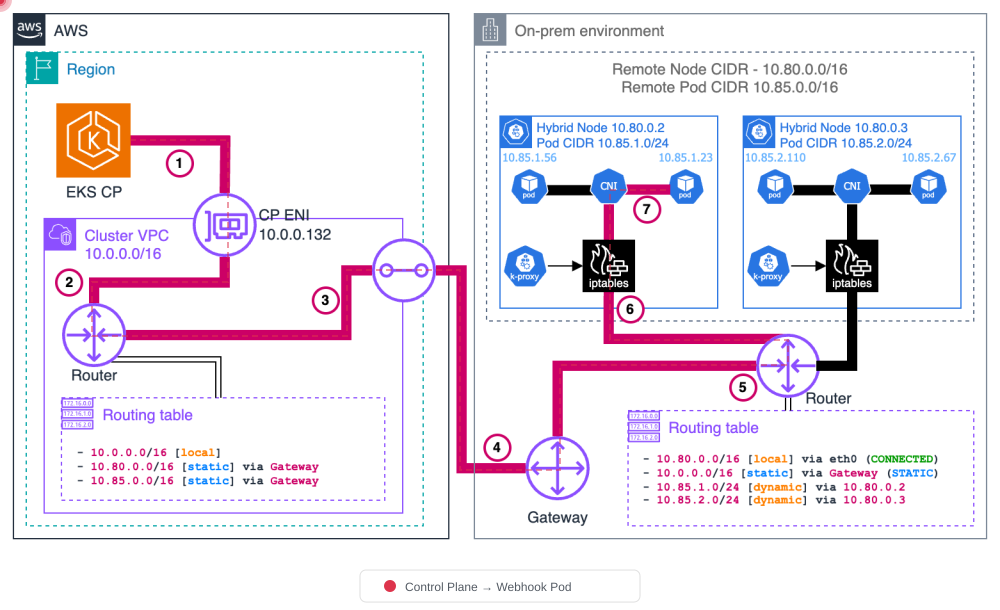
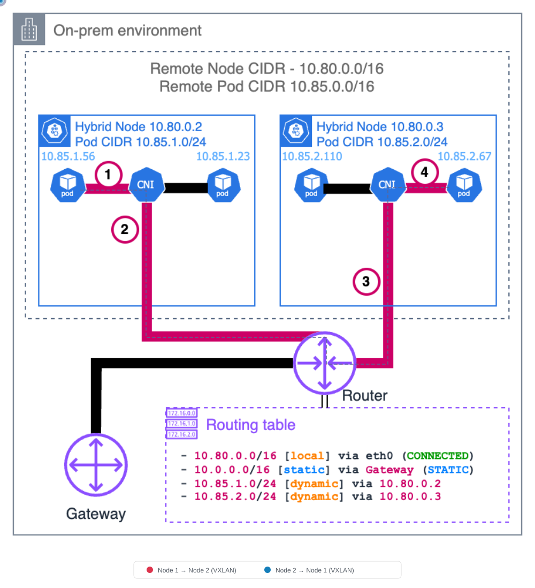
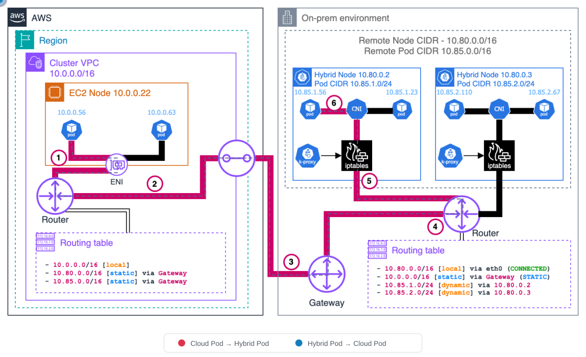
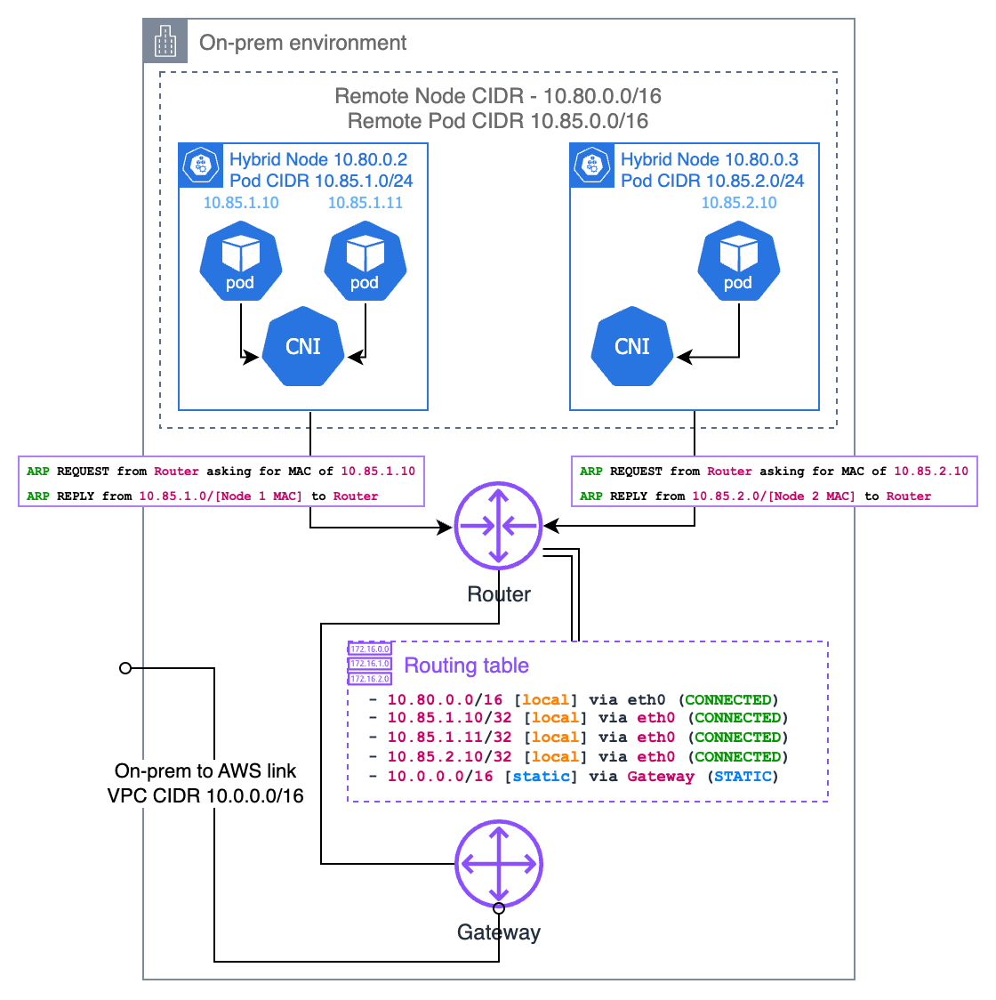

# Configuración de red

< [Anterior: Requisitos previos](01-prerequisites.md) | [Tabla de contenido](./README.md) | [Siguiente: Configuración sin conexión](03-airgap-setup.md) >

> **Versiones compatibles**: EKS 1.31+, nodeadm 0.1+ **Última actualización**: February 23, 2026

Este documento cubre la configuración de red requerida para EKS Hybrid Nodes, incluidos los requisitos de CIDR, las reglas de firewall, el acceso a endpoints de AWS, la configuración de security groups y la configuración de DNS.

## Descripción general de la arquitectura de red

El siguiente diagrama ilustra la topología de red completa para EKS Hybrid Nodes, incluida la configuración de VPC, el enrutamiento de Transit Gateway, los CIDR remotos y las reglas de firewall.


### VPC como centro de red

En un entorno de EKS Hybrid Nodes, la VPC funciona como el **centro de red** entre los nodos híbridos y el control plane.

* **Ubicación de ENI**: El control plane de EKS coloca ENI (Elastic Network Interfaces) en subnets de VPC. Estas ENI son los endpoints de comunicación entre el control plane y los nodos híbridos.
* **Ruta del tráfico**: Todo el tráfico entre el control plane y los nodos híbridos fluye a través de estas ENI. Las solicitudes al servidor de API, la comunicación de kubelet, las llamadas de webhook y todo el tráfico del control plane atraviesan las ENI de VPC.
* **Cambios de IP de ENI**: Durante las actualizaciones del clúster (por ejemplo, actualizaciones de versión), las ENI pueden eliminarse y recrearse, lo que puede cambiar sus direcciones IP. Usar rangos CIDR de subnet en lugar de IP individuales en las reglas de firewall proporciona flexibilidad para estos cambios.

```
┌─────────────────────────────────────────────────────────────────┐
│                         AWS Cloud                                │
│  ┌──────────────────┐    ┌──────────────────────────────────┐   │
│  │  EKS Control     │    │              VPC                  │   │
│  │     Plane        │◄──►│  ┌────────┐  ┌────────┐          │   │
│  │                  │    │  │  ENI   │  │  ENI   │          │   │
│  └──────────────────┘    │  │10.0.1.x│  │10.0.2.x│          │   │
│                          │  └────┬───┘  └────┬───┘          │   │
│                          └───────┼───────────┼──────────────┘   │
└──────────────────────────────────┼───────────┼──────────────────┘
                                   │           │
                           VPN / Direct Connect
                                   │           │
┌──────────────────────────────────┼───────────┼──────────────────┐
│                          On-Premises                             │
│                    ┌─────────────┴───────────┴─────────────┐    │
│                    │         Hybrid Nodes                   │    │
│                    │   ┌─────────┐    ┌─────────┐          │    │
│                    │   │  Node   │    │  Node   │          │    │
│                    │   │ kubelet │    │ kubelet │          │    │
│                    │   └─────────┘    └─────────┘          │    │
│                    └───────────────────────────────────────┘    │
└─────────────────────────────────────────────────────────────────┘
```

## Requisitos de rango CIDR

Los CIDR de nodos y Pods on-premises deben cumplir los siguientes requisitos:

* Deben estar dentro de los **rangos RFC-1918**: `10.0.0.0/8`, `172.16.0.0/12`, `192.168.0.0/16`
* **No deben solaparse** con:
  * Entre sí (CIDR de nodos y CIDR de Pods)
  * El CIDR de VPC para el clúster de EKS
  * El CIDR IPv4 de Service de Kubernetes

Los campos `RemoteNodeNetwork` y `RemotePodNetwork` se especifican al crear el clúster de EKS.

### Redes de Pods enrutable frente a no enrutable

| Configuración           | Enrutable (recomendado)                              | No enrutable                    |
| ----------------------- | --------------------------------------------------- | ----------------------------- |
| Configuración           | BGP (recomendado), rutas estáticas o enrutamiento personalizado | Enmascaramiento/NAT de salida de CNI     |
| Webhooks                | Pueden ejecutarse en nodos híbridos                             | Deben ejecutarse solo en nodos cloud  |
| Comunicación Pod↔Pod   | Comunicación directa cloud↔on-premises              | No es posible                  |
| Integración de servicios de AWS | ALB, Prometheus, etc. pueden alcanzar workloads híbridos    | No pueden alcanzar workloads híbridos |

> **Recomendación**: Use Cilium BGP Control Plane para hacer que los CIDR de Pods sean enrutable.

***

## Puertos de firewall requeridos

### Puertos de comunicación del clúster

Los siguientes puertos deben abrirse para la comunicación entre on-premises y AWS:

| Puerto          | Protocolo     | Dirección     | Propósito                                                                  |
| ------------- | ------------ | ------------- | ------------------------------------------------------------------------ |
| 443           | TCP          | On-Prem → AWS | Kubelet al servidor de API de Kubernetes                                         |
| 443           | TCP          | On-Prem → AWS | Pods al servidor de API de Kubernetes                                            |
| 10250         | TCP          | AWS → On-Prem | Servidor de API a kubelet                                                    |
| Puertos de webhook | TCP          | AWS → On-Prem | Servidor de API a webhooks (solo redes de Pods enrutable)                      |
| 53            | TCP/UDP      | Bidireccional | CoreDNS (CIDR de Pod ↔ CIDR de Pod; incluya el CIDR de VPC si CoreDNS se ejecuta en cloud) |
| Puertos de aplicaciones     | Definido por el usuario | Bidireccional | Comunicación de aplicación de Pod a Pod                                     |

### Puertos de VPN (al usar Site-to-Site VPN)

| Puerto | Protocolo | Dirección     | Propósito                     |
| ---- | -------- | ------------- | --------------------------- |
| 500  | UDP      | Bidireccional | IKE (Internet Key Exchange) |
| 4500 | UDP      | Bidireccional | IPSec NAT-T                 |

### Puertos de Cilium CNI

Puertos adicionales requeridos al usar Cilium como el CNI:

| Puerto | Protocolo | Dirección     | Propósito                             |
| ---- | -------- | ------------- | ----------------------------------- |
| 8472 | UDP      | Bidireccional | Overlay VXLAN (modo de túnel predeterminado) |
| 4240 | TCP      | Bidireccional | Comprobación de estado                        |

> **Nota**: Para conocer los requisitos detallados de firewall para Cilium y Calico, consulte la documentación oficial de cada proyecto.

### Ejemplo de reglas de iptables

```bash
# Allow Kubernetes API server communication
sudo iptables -A INPUT -p tcp --dport 443 -s 10.0.0.0/8 -j ACCEPT
sudo iptables -A OUTPUT -p tcp --dport 443 -d 10.0.0.0/8 -j ACCEPT

# Allow Kubelet API
sudo iptables -A INPUT -p tcp --dport 10250 -s 10.0.0.0/8 -j ACCEPT

# Allow Cilium VXLAN
sudo iptables -A INPUT -p udp --dport 8472 -j ACCEPT
sudo iptables -A OUTPUT -p udp --dport 8472 -j ACCEPT

# Allow Cilium health check
sudo iptables -A INPUT -p tcp --dport 4240 -j ACCEPT
sudo iptables -A OUTPUT -p tcp --dport 4240 -j ACCEPT

# Allow DNS
sudo iptables -A INPUT -p tcp --dport 53 -j ACCEPT
sudo iptables -A INPUT -p udp --dport 53 -j ACCEPT
sudo iptables -A OUTPUT -p tcp --dport 53 -j ACCEPT
sudo iptables -A OUTPUT -p udp --dport 53 -j ACCEPT

# Save rules
sudo iptables-save | sudo tee /etc/iptables/rules.v4
```

***

## Requisitos de acceso saliente on-premises

### Endpoints requeridos para la instalación y actualización

Los siguientes endpoints de AWS deben ser accesibles mediante HTTPS (443) desde los nodos on-premises durante la instalación y actualización de nodeadm:

| Componente               | URL                                                     | Notas                                 |
| ----------------------- | ------------------------------------------------------- | ------------------------------------- |
| Artefactos de nodo de EKS (S3) | `https://hybrid-assets.eks.amazonaws.com`               | Binario de nodeadm y dependencias       |
| Servicio de EKS             | `https://eks.<region>.amazonaws.com`                    | Consulta de información del clúster            |
| Servicio de ECR             | `https://api.ecr.<region>.amazonaws.com`                | Descargas de imágenes de contenedor                 |
| Binario de SSM              | `https://amazon-ssm-<region>.s3.<region>.amazonaws.com` | Al usar el proveedor de credenciales de SSM    |
| Servicio de SSM             | `https://ssm.<region>.amazonaws.com`                    | Al usar el proveedor de credenciales de SSM    |
| IAM Roles Anywhere      | `https://rolesanywhere.<region>.amazonaws.com`          | Al usar el proveedor de credenciales de IAM RA |
| Gestor de paquetes del SO      | Endpoints específicos de la región                             | Instalación de paquetes del sistema           |

### Endpoints requeridos para operaciones continuas

| Propósito                   | Origen    | Destino           | Notas                       |
| ------------------------- | --------- | --------------------- | --------------------------- |
| Kubelet → servidor de API      | CIDR de nodo | IP del clúster de EKS       | Puerto 443                    |
| Pod → servidor de API          | CIDR de Pod  | IP del clúster de EKS       | Puerto 443                    |
| Actualización de credenciales de SSM    | CIDR de nodo | Endpoint de SSM          | Intervalo de heartbeat de 5 minutos |
| Actualización de credenciales de IAM RA | CIDR de nodo | Endpoint de IAM Anywhere | Actualización periódica            |
| EKS Pod Identity          | CIDR de nodo | Endpoint de EKS Auth     | Al usar Pod Identity     |

### Descubrimiento de IP de interfaces de red del clúster de EKS

Cuando las reglas de firewall requieren IP del clúster de EKS, use el siguiente comando:

```bash
aws ec2 describe-network-interfaces \
  --filters "Name=vpc-id,Values=<VPC_ID>" "Name=description,Values=Amazon EKS*" \
  --query 'NetworkInterfaces[].PrivateIpAddress' \
  --output text
```

> **Nota**: Las interfaces de red de EKS pueden eliminarse y recrearse durante las actualizaciones del clúster (por ejemplo, actualizaciones de versión). Usar tamaños de subnet restringidos hace que el rango de IP sea predecible, lo que simplifica la configuración de firewall.

***

## Endpoints privados de VPC (Air-Gap / conectividad privada)

Cuando los nodos on-premises se conectan a AWS mediante VPN o Direct Connect sin acceso a Internet, debe configurar **VPC Interface Endpoints** (PrivateLink) para acceder a servicios de AWS de forma privada.

### Por qué se requieren endpoints de VPC

Las llamadas estándar a API de AWS atraviesan Internet público. En entornos aislados o solo privados, no hay una ruta a Internet, por lo que los servicios de AWS son inaccesibles. Los VPC Interface Endpoints crean ENI (Elastic Network Interfaces) dentro de su VPC con direcciones IP privadas, lo que permite a los nodos on-premises acceder directamente a las API de AWS mediante VPN/Direct Connect.

```
On-premises node
  → VPN / Direct Connect
    → VPC Interface Endpoint ENI (private IP)
      → AWS Service (EKS, ECR, STS, SSM, etc.)
```

> **Punto clave**: Los gateway endpoints (para S3 y DynamoDB) solo agregan rutas a las tablas de rutas de VPC y **no son accesibles desde redes on-premises** mediante VPN/Direct Connect. Para acceder a S3 desde on-premises, debe usar un endpoint de S3 de tipo **Interface**.

### VPC Interface Endpoints requeridos

| Servicio      | Nombre del servicio de endpoint                | DNS privado | Propósito                                              |
| ------------ | ------------------------------------ | ----------- | ---------------------------------------------------- |
| EKS          | `com.amazonaws.<region>.eks`         | Sí         | Comunicación con el servidor de API de Kubernetes                  |
| EKS Auth     | `com.amazonaws.<region>.eks-auth`    | Sí         | Autenticación de Pod Identity                          |
| ECR API      | `com.amazonaws.<region>.ecr.api`     | Sí         | Consultas de metadatos de imágenes                               |
| ECR DKR      | `com.amazonaws.<region>.ecr.dkr`     | Sí         | Descarga de imágenes (registro Docker)                         |
| S3           | `com.amazonaws.<region>.s3`          | —           | Capas de imagen, artefactos de nodeadm (**tipo Interface**) |
| STS          | `com.amazonaws.<region>.sts`         | Sí         | Intercambio de credenciales de IAM                              |
| SSM          | `com.amazonaws.<region>.ssm`         | Sí         | Al usar el proveedor de credenciales de SSM                   |
| SSM Messages | `com.amazonaws.<region>.ssmmessages` | Sí         | Comunicación de SSM Session Manager                    |

> **Nota**: Los endpoints de S3 Interface no admiten automáticamente `private_dns_enabled`. Si necesita resolución de DNS privado para dominios de S3, debe configurar una Private Hosted Zone (PHZ) independiente. Para el patrón de mirroring privado de `hybrid-assets.eks.amazonaws.com`, consulte [Configuración sin conexión - Mirroring privado de hybrid-assets](03-airgap-setup.md#hybrid-assets-private-mirroring-s3--phz-pattern).

### Creación de endpoints de VPC con Terraform

#### Security Group

```hcl
resource "aws_security_group" "vpc_endpoints" {
  name_prefix = "vpc-endpoints-"
  vpc_id      = var.vpc_id
  description = "Security group for VPC Interface Endpoints"

  ingress {
    description = "HTTPS from VPC and on-premises"
    from_port   = 443
    to_port     = 443
    protocol    = "tcp"
    cidr_blocks = [
      var.vpc_cidr,           # VPC internal traffic
      var.remote_node_cidr,   # On-premises node CIDR
      var.remote_pod_cidr     # On-premises pod CIDR
    ]
  }

  egress {
    from_port   = 0
    to_port     = 0
    protocol    = "-1"
    cidr_blocks = ["0.0.0.0/0"]
  }

  tags = {
    Name = "vpc-endpoints-sg"
  }
}
```

#### VPC Interface Endpoints

```hcl
# List of Interface endpoints to create
locals {
  interface_endpoints = {
    eks          = "com.amazonaws.${var.region}.eks"
    eks-auth     = "com.amazonaws.${var.region}.eks-auth"
    ecr-api      = "com.amazonaws.${var.region}.ecr.api"
    ecr-dkr      = "com.amazonaws.${var.region}.ecr.dkr"
    sts          = "com.amazonaws.${var.region}.sts"
    ssm          = "com.amazonaws.${var.region}.ssm"
    ssmmessages  = "com.amazonaws.${var.region}.ssmmessages"
  }
}

resource "aws_vpc_endpoint" "interface" {
  for_each = local.interface_endpoints

  vpc_id              = var.vpc_id
  service_name        = each.value
  vpc_endpoint_type   = "Interface"
  private_dns_enabled = true

  subnet_ids         = var.private_subnet_ids
  security_group_ids = [aws_security_group.vpc_endpoints.id]

  tags = {
    Name = "vpce-${each.key}"
  }
}

# S3 Interface endpoint (Interface type, not Gateway)
resource "aws_vpc_endpoint" "s3_interface" {
  vpc_id              = var.vpc_id
  service_name        = "com.amazonaws.${var.region}.s3"
  vpc_endpoint_type   = "Interface"
  private_dns_enabled = false  # S3 does not support auto Private DNS for Interface type

  subnet_ids         = var.private_subnet_ids
  security_group_ids = [aws_security_group.vpc_endpoints.id]

  tags = {
    Name = "vpce-s3-interface"
  }
}
```

### Creación de endpoints de VPC con AWS CLI

```bash
# 1. Create security group for VPC endpoints
SG_ID=$(aws ec2 create-security-group \
  --group-name vpc-endpoints-sg \
  --description "Security group for VPC Interface Endpoints" \
  --vpc-id <VPC_ID> \
  --query 'GroupId' --output text)

# Allow port 443 inbound
aws ec2 authorize-security-group-ingress \
  --group-id $SG_ID \
  --ip-permissions '[
    {"IpProtocol": "tcp", "FromPort": 443, "ToPort": 443,
     "IpRanges": [
       {"CidrIp": "<VPC_CIDR>", "Description": "VPC internal"},
       {"CidrIp": "<REMOTE_NODE_CIDR>", "Description": "On-prem nodes"},
       {"CidrIp": "<REMOTE_POD_CIDR>", "Description": "On-prem pods"}
     ]}
  ]'

# 2. Create Interface VPC endpoint (EKS example)
aws ec2 create-vpc-endpoint \
  --vpc-id <VPC_ID> \
  --vpc-endpoint-type Interface \
  --service-name com.amazonaws.<REGION>.eks \
  --subnet-ids <SUBNET_ID_1> <SUBNET_ID_2> \
  --security-group-ids $SG_ID \
  --private-dns-enabled

# 3. Create remaining service endpoints
for SERVICE in eks-auth ecr.api ecr.dkr sts ssm ssmmessages; do
  echo "Creating endpoint for: $SERVICE"
  aws ec2 create-vpc-endpoint \
    --vpc-id <VPC_ID> \
    --vpc-endpoint-type Interface \
    --service-name com.amazonaws.<REGION>.$SERVICE \
    --subnet-ids <SUBNET_ID_1> <SUBNET_ID_2> \
    --security-group-ids $SG_ID \
    --private-dns-enabled
done

# 4. S3 Interface endpoint (without private-dns-enabled)
aws ec2 create-vpc-endpoint \
  --vpc-id <VPC_ID> \
  --vpc-endpoint-type Interface \
  --service-name com.amazonaws.<REGION>.s3 \
  --subnet-ids <SUBNET_ID_1> <SUBNET_ID_2> \
  --security-group-ids $SG_ID

# 5. Verify created endpoints
aws ec2 describe-vpc-endpoints \
  --filters "Name=vpc-id,Values=<VPC_ID>" \
  --query 'VpcEndpoints[].{ID:VpcEndpointId, Service:ServiceName, State:State}' \
  --output table
```

### Flujo de resolución de DNS on-premises

La opción `private_dns_enabled` en los endpoints de VPC funciona solo dentro de la VPC. Para que los nodos on-premises resuelvan dominios de servicio de AWS (por ejemplo, `eks.ap-northeast-2.amazonaws.com`) a las IP privadas del endpoint de VPC, debe enrutar las consultas de DNS mediante un Route 53 Resolver Inbound Endpoint.

```
On-premises node
  → On-premises DNS server (conditional forwarding)
    → Route 53 Resolver Inbound Endpoint (in VPC)
      → Route 53 resolves via Private Hosted Zone / VPC DNS
        → Returns VPC Endpoint ENI private IP
          → On-premises node reaches ENI directly over VPN/DX
```

#### Configuración del reenvío condicional en DNS on-premises

Configure su servidor DNS on-premises (por ejemplo, BIND, Windows DNS, dnsmasq) para reenviar dominios de AWS al Route 53 Inbound Endpoint.

```
# BIND example (/etc/named.conf)
zone "amazonaws.com" {
    type forward;
    forward only;
    forwarders {
        10.0.1.10;    # Route 53 Inbound Endpoint IP #1
        10.0.2.10;    # Route 53 Inbound Endpoint IP #2
    };
};

zone "eks.amazonaws.com" {
    type forward;
    forward only;
    forwarders {
        10.0.1.10;
        10.0.2.10;
    };
};
```

> **Nota**: Para crear Route 53 Resolver Inbound Endpoint, consulte la sección [Configuración de DNS](02-network-configuration.md#dns-configuration) de este documento. Después de configurar los endpoints de VPC, verifique siempre con `nslookup eks.<region>.amazonaws.com` que se devuelvan IP privadas.

***

## Configuración de AWS Security Group

EKS configura automáticamente reglas de entrada de security group cuando se crea el clúster, pero las reglas de salida no se crean automáticamente (los security groups permiten toda la salida de forma predeterminada).

### Reglas de entrada creadas automáticamente

| Protocolo | Puerto | Origen              | Propósito                              |
| -------- | ---- | ------------------- | ------------------------------------ |
| TCP      | 443  | CIDR de nodo remoto | Kubelet a API de Kubernetes            |
| TCP      | 443  | CIDR de Pod remoto  | Pods a API de Kubernetes (CNI no NAT) |

### Reglas de salida que se deben agregar manualmente

| Protocolo | Puerto          | Destino         | Propósito                |
| -------- | ------------- | ------------------- | ---------------------- |
| TCP      | 10250         | CIDR de nodo remoto | Servidor de API a kubelet  |
| TCP      | Puertos de webhook | CIDR de Pod remoto  | Servidor de API a webhooks |

```bash
# Example: Create a custom security group
aws ec2 create-security-group \
  --group-name hybrid-nodes-sg \
  --description "Security group for EKS Hybrid Nodes" \
  --vpc-id <VPC_ID>

# Add inbound rules
aws ec2 authorize-security-group-ingress \
  --group-id <SG_ID> \
  --ip-permissions '[
    {"IpProtocol": "tcp", "FromPort": 443, "ToPort": 443,
     "IpRanges": [{"CidrIp": "<REMOTE_NODE_CIDR>"}, {"CidrIp": "<REMOTE_POD_CIDR>"}]}
  ]'
```

> **Precaución**: El límite predeterminado es de 60 reglas de entrada por security group. Además, EKS no elimina automáticamente las reglas cuando se eliminan redes remotas; se requiere una limpieza manual.

***

## Estrategia de firewall de CIDR de Pod

Debe registrar reglas de firewall para todo el rango CIDR de Pod para la comunicación Pod a Pod.

```bash
# Pod CIDR range example: 10.244.0.0/16
# Check cluster's Pod CIDR
kubectl cluster-info dump | grep -m 1 cluster-cidr

# Add firewall rules for Pod CIDR
sudo iptables -A INPUT -s 10.244.0.0/16 -j ACCEPT
sudo iptables -A OUTPUT -d 10.244.0.0/16 -j ACCEPT
sudo iptables -A FORWARD -s 10.244.0.0/16 -j ACCEPT
sudo iptables -A FORWARD -d 10.244.0.0/16 -j ACCEPT

# Add Service CIDR as well (e.g., 172.20.0.0/16)
sudo iptables -A INPUT -s 172.20.0.0/16 -j ACCEPT
sudo iptables -A OUTPUT -d 172.20.0.0/16 -j ACCEPT
```

***

## Configuración de DNS

### Route 53 Resolver Inbound Endpoint

Cree un Inbound Endpoint para permitir que on-premises consulte dominios de AWS.

```bash
# Create Inbound Endpoint
aws route53resolver create-resolver-endpoint \
  --creator-request-id "hybrid-inbound-$(date +%s)" \
  --name "hybrid-inbound-endpoint" \
  --security-group-ids sg-0123456789abcdef0 \
  --direction INBOUND \
  --ip-addresses SubnetId=subnet-111111111,Ip=10.0.1.10 SubnetId=subnet-222222222,Ip=10.0.2.10

# Check Endpoint IPs
aws route53resolver list-resolver-endpoint-ip-addresses \
  --resolver-endpoint-id rslvr-in-xxxxxxxxxxxxx
```

### Route 53 Resolver Outbound Endpoint

Cree un Outbound Endpoint y reglas de reenvío para permitir que AWS consulte dominios on-premises.

```bash
# Create Outbound Endpoint
aws route53resolver create-resolver-endpoint \
  --creator-request-id "hybrid-outbound-$(date +%s)" \
  --name "hybrid-outbound-endpoint" \
  --security-group-ids sg-0123456789abcdef0 \
  --direction OUTBOUND \
  --ip-addresses SubnetId=subnet-111111111 SubnetId=subnet-222222222

# Create forwarding rule (on-premises domain)
aws route53resolver create-resolver-rule \
  --creator-request-id "forward-onprem-$(date +%s)" \
  --name "forward-to-onprem" \
  --rule-type FORWARD \
  --domain-name "internal.company.io" \
  --resolver-endpoint-id rslvr-out-xxxxxxxxxxxxx \
  --target-ips "Ip=192.168.1.10,Port=53" "Ip=192.168.1.11,Port=53"

# Associate rule with VPC
aws route53resolver associate-resolver-rule \
  --resolver-rule-id rslvr-rr-xxxxxxxxxxxxx \
  --vpc-id vpc-0123456789abcdef0
```

### Configuración de dominio personalizado de CoreDNS

Reenvíe las consultas de DNS de dominios on-premises a servidores DNS on-premises.

```yaml
apiVersion: v1
kind: ConfigMap
metadata:
  name: coredns
  namespace: kube-system
data:
  Corefile: |
    .:53 {
        errors
        health {
            lameduck 5s
        }
        ready
        kubernetes cluster.local in-addr.arpa ip6.arpa {
            pods insecure
            fallthrough in-addr.arpa ip6.arpa
        }
        prometheus :9153
        forward . /etc/resolv.conf {
            max_concurrent 1000
        }
        cache 30
        loop
        reload
        loadbalance
    }
    internal.company.io:53 {
        errors
        cache 30
        forward . 192.168.1.10 192.168.1.11 {
            max_concurrent 1000
        }
    }
```

```bash
# Apply CoreDNS ConfigMap
kubectl apply -f coredns-configmap.yaml

# Restart CoreDNS
kubectl rollout restart deployment coredns -n kube-system

# Test DNS resolution
kubectl run dns-test --rm -it --image=busybox --restart=Never -- nslookup internal.company.io
```

### Deployment de CoreDNS de ubicación doble (on-premises + cloud)

#### ¿Por qué se requiere un Deployment de ubicación doble?

En un entorno de EKS Hybrid Nodes, si CoreDNS se ejecuta solo en nodos cloud, las consultas DNS de Pods on-premises deben atravesar el enlace VPN/Direct Connect hacia cloud y regresar. Por el contrario, si CoreDNS se ejecuta solo en nodos on-premises, las consultas DNS de Pods cloud deben realizar el viaje de ida y vuelta inverso.

**Los Pods de CoreDNS deben existir en ambos lados** para minimizar la latencia de DNS y mantener la disponibilidad del servicio DNS incluso cuando un lado experimenta una interrupción de red.

#### Cantidad de réplicas recomendada

Se recomienda un mínimo de **4 réplicas** (2 cloud + 2 on-premises). Colocar al menos 2 réplicas en cada ubicación garantiza alta disponibilidad.

#### Patch de Deployment de CoreDNS

Use `topologySpreadConstraints` y `tolerations` para distribuir uniformemente los Pods de CoreDNS entre los nodos cloud y on-premises.

```yaml
apiVersion: apps/v1
kind: Deployment
metadata:
  name: coredns
  namespace: kube-system
spec:
  replicas: 4
  template:
    spec:
      tolerations:
        - key: "eks.amazonaws.com/compute-type"
          value: "hybrid"
          effect: "NoSchedule"
      topologySpreadConstraints:
        - maxSkew: 1
          topologyKey: "eks.amazonaws.com/compute-type"
          whenUnsatisfiable: ScheduleAnyway
          labelSelector:
            matchLabels:
              k8s-app: kube-dns
```

#### Comando kubectl patch

```bash
kubectl patch deployment coredns -n kube-system --type=strategic -p '{
  "spec": {
    "replicas": 4,
    "template": {
      "spec": {
        "tolerations": [
          {
            "key": "eks.amazonaws.com/compute-type",
            "value": "hybrid",
            "effect": "NoSchedule"
          }
        ],
        "topologySpreadConstraints": [
          {
            "maxSkew": 1,
            "topologyKey": "eks.amazonaws.com/compute-type",
            "whenUnsatisfiable": "ScheduleAnyway",
            "labelSelector": {
              "matchLabels": {
                "k8s-app": "kube-dns"
              }
            }
          }
        ]
      }
    }
  }
}'
```

#### Verificar la ubicación

```bash
# Verify CoreDNS Pods are distributed across both node types
kubectl get pods -n kube-system -l k8s-app=kube-dns -o wide

# Check compute-type labels on nodes
kubectl get nodes -L eks.amazonaws.com/compute-type
```

> **Nota**:
>
> * Al usar el add-on administrado de CoreDNS de EKS, la misma configuración se puede aplicar mediante los `configurationValues` del add-on.
> * Usar `whenUnsatisfiable: ScheduleAnyway` garantiza que la programación no se bloquee incluso cuando haya nodos en un solo lado. Esto garantiza que CoreDNS se inicie normalmente durante el bootstrap inicial del clúster.

***

## Patrones de flujo de tráfico

Comprender los patrones de flujo de tráfico entre AWS y on-premises es fundamental para la configuración de firewall y la solución de problemas. Las siguientes secciones detallan cada patrón de tráfico con diagramas oficiales de arquitectura de AWS.

> **Fuente**: [Flujos de tráfico de AWS EKS Hybrid Nodes](https://docs.aws.amazon.com/eks/latest/userguide/hybrid-nodes-concepts-traffic-flows.html)

### Patrón 1: Kubelet → EKS Control Plane

Kubelet inicia solicitudes HTTPS al endpoint del servidor de API mediante una búsqueda de DNS. En el modo de acceso público, el tráfico atraviesa Internet público. En el modo privado, el tráfico fluye mediante VPN/DX hacia las ENI de VPC.


### Patrón 2: EKS Control Plane → Kubelet

El servidor de API recupera la IP del nodo del objeto de estado del nodo. El tráfico se enruta por la VPC y luego cruza el límite cloud mediante Direct Connect o VPN para llegar a kubelet en el puerto 10250. Esto se usa para `kubectl logs`, `kubectl exec`, `kubectl port-forward`, etc.


### Patrón 3: Pod → EKS Control Plane

Los Pods se comunican con la API de Kubernetes mediante el Service `kubernetes` (ClusterIP). kube-proxy aplica DNAT para convertir la IP del Service en la IP de ENI del control plane, y luego el paquete se enruta mediante VPN/DX hacia la VPC.

* **Sin CNI NAT**: El Pod envía a la IP del Service de Kubernetes (por ejemplo, 172.16.0.1), kube-proxy aplica DNAT a la IP de ENI del control plane. El tráfico de retorno requiere enrutamiento inverso mediante los CIDR de Pods.
* **Con CNI NAT**: CNI aplica SNAT antes del procesamiento del nodo, lo que simplifica el enrutamiento de retorno (no se requiere enrutamiento adicional del CIDR de Pod).


### Patrón 4: EKS Control Plane → Pod (Webhooks)

El servidor de API inicia conexiones directas a Pods de webhook que se ejecutan en nodos híbridos. El tráfico se enruta mediante VPC para el CIDR de Pod remoto y cruza el límite mediante el gateway. Esto **requiere CIDR de Pods enrutable**.



> **Importante**: Si su CIDR de Pod on-premises no es enrutable, **debe ejecutar todos los webhooks en nodos cloud**. Consulte [Configuración de webhook](02-network-configuration.md#webhook-configuration) a continuación.

### Patrón 5: Pod ↔ Pod en nodos híbridos

Los Pods en diferentes nodos híbridos se comunican mediante [encapsulación VXLAN](../networking/cilium/03-networking.md#vxlan-technology-deep-dive) (u otros protocolos de overlay similares, como Geneve, IP-in-IP). El CNI encapsula el paquete original de Pod a Pod con encabezados externos que usan IP de nodo de origen/destino. El CNI del nodo receptor desencapsula y entrega el paquete al Pod de destino.



#### Detalles de encapsulación VXLAN

VXLAN (Virtual Extensible LAN) encapsula tramas L2 en paquetes L3 para crear una red overlay. Así se transforma la estructura del paquete durante la comunicación de Pod entre nodos híbridos.

**Paquete original (antes de la encapsulación)**

```
┌────────────────────────────────────────────────┐
│  Pod-A IP (src) → Pod-B IP (dst) │   Payload   │
│    10.85.0.10       10.85.1.20   │   (data)    │
└────────────────────────────────────────────────┘
```

**Después de la encapsulación VXLAN**

```
┌──────────────────────────────────────────────────────────────────────────────┐
│ Outer IP Header │ UDP Header │ VXLAN Header │      Original Packet          │
│ Node-A → Node-B │ Port 8472  │    (VNI)     │ Pod-A IP → Pod-B IP │ Payload │
│ 10.80.1.10      │            │              │ 10.85.0.10  10.85.1.20        │
│   → 10.80.1.11  │            │              │                               │
└──────────────────────────────────────────────────────────────────────────────┘
```

**Proceso de encapsulación (nodo de origen)**

1. Pod-A envía un paquete a Pod-B
2. El CNI del nodo de origen (Cilium) busca la IP de Pod de destino e identifica el nodo objetivo
3. CNI envuelve el paquete original con un encabezado VXLAN y un encabezado IP externo
4. El encabezado externo usa IP de nodos como origen/destino
5. El paquete encapsulado se envía mediante el puerto UDP 8472

**Proceso de desencapsulación (nodo de destino)**

1. El nodo de destino recibe el paquete VXLAN en el puerto UDP 8472
2. CNI elimina el encabezado VXLAN y el encabezado IP externo
3. El paquete original se entrega al Pod de destino

**Componentes clave**

| Componente                      | Descripción                                                                  |
| ------------------------------ | ---------------------------------------------------------------------------- |
| VNI (VXLAN Network Identifier) | Identificador de 24 bits que aísla el tráfico de red de Pods (predeterminado: asignado automáticamente) |
| Puerto UDP                       | Predeterminado de Cilium: 8472, VXLAN estándar: 4789                                   |
| MTU                            | Debe tener en cuenta la sobrecarga de VXLAN (50 bytes), por ejemplo, 1500 → 1450                |

> **Nota**: Además de VXLAN, Cilium admite otros protocolos de túnel, como Geneve e IP-in-IP. Use la opción `--tunnel` para seleccionar el modo de túnel.

### Patrón 6: Pod cloud ↔ Pod híbrido (East-West)

Los Pods de VPC (que usan VPC CNI) envían directamente a Pods híbridos; el enrutamiento de VPC dirige el tráfico al gateway on-premises. El paquete cruza el límite y llega al nodo híbrido. Esto **requiere CIDR de Pods enrutable** y entradas adecuadas en la tabla de rutas de VPC.



### Resumen del flujo de tráfico

| # | Flujo                     | Dirección        | Puerto      | Requisitos                       |
| - | ------------------------ | ---------------- | --------- | ---------------------------------- |
| 1 | Kubelet → servidor de API     | On-Prem → AWS    | TCP 443   | VPN/DX o Internet                 |
| 2 | Servidor de API → Kubelet     | AWS → On-Prem    | TCP 10250 | Regla de salida de SG                   |
| 3 | Pod → servidor de API         | On-Prem → AWS    | TCP 443   | DNAT de kube-proxy                    |
| 4 | Servidor de API → Pod de webhook | AWS → On-Prem    | TCP 8443+ | **CIDR de Pod enrutable**              |
| 5 | Pod híbrido ↔ Pod híbrido  | Interno on-premises | UDP 8472  | Cilium VXLAN                       |
| 6 | Pod cloud ↔ Pod híbrido   | AWS ↔ On-Prem    | Ruta de VPC | **CIDR de Pod enrutable** + rutas de VPC |

### Estructura de cadena de iptables de kube-proxy

kube-proxy usa reglas de iptables para enrutar el tráfico de Service de Kubernetes a los Pods reales. La misma estructura de cadena de 3 capas se aplica en nodos híbridos.

```
KUBE-SERVICES (entry point)
  └─→ KUBE-SVC-xxxx (per-service chain, load balancing)
        └─→ KUBE-SEP-xxxx (per-endpoint chain, DNAT to pod IP)
```

**Funciones de las cadenas**

| Cadena             | Función                                                       | Ejemplo                              |
| ----------------- | ---------------------------------------------------------- | ------------------------------------ |
| **KUBE-SERVICES** | Hace coincidir IP:Port de destino con todos los Services ClusterIP | `172.20.0.1:443` → `KUBE-SVC-NPX...` |
| **KUBE-SVC-xxxx** | Selecciona el endpoint mediante balanceo de carga basado en probabilidad    | 3 Pods → 33% de probabilidad cada uno        |
| **KUBE-SEP-xxxx** | Realiza DNAT a una IP:Port de Pod específica                      | DNAT a `10.85.0.15:8080`            |

**Ejemplo de reglas reales de iptables**

```bash
# KUBE-SERVICES chain (nat table)
-A KUBE-SERVICES -d 172.20.0.10/32 -p tcp -m tcp --dport 80 -j KUBE-SVC-XXXXXX

# KUBE-SVC chain (load balancing)
-A KUBE-SVC-XXXXXX -m statistic --mode random --probability 0.33333 -j KUBE-SEP-AAAAAA
-A KUBE-SVC-XXXXXX -m statistic --mode random --probability 0.50000 -j KUBE-SEP-BBBBBB
-A KUBE-SVC-XXXXXX -j KUBE-SEP-CCCCCC

# KUBE-SEP chain (DNAT)
-A KUBE-SEP-AAAAAA -p tcp -j DNAT --to-destination 10.85.0.15:8080
-A KUBE-SEP-BBBBBB -p tcp -j DNAT --to-destination 10.85.0.16:8080
-A KUBE-SEP-CCCCCC -p tcp -j DNAT --to-destination 10.85.1.20:8080
```

> **Implicaciones de un entorno híbrido**: En el ejemplo anterior, si `10.85.1.20` es un Pod en un nodo híbrido diferente, el paquete después de DNAT se encapsulará con VXLAN y se enviará a ese nodo. kube-proxy traduce el tráfico de Service a IP de Pods y el CNI gestiona el enrutamiento de red real.

### Endpoints de kubelet

kubelet se ejecuta en cada nodo y expone endpoints REST para la comunicación con el servidor de API.

**Puertos y endpoints de la API de kubelet**

| Puerto  | Endpoint                              | Propósito                                          |
| ----- | ------------------------------------- | ------------------------------------------------ |
| 10250 | `/pods`                               | Lista los pods que se ejecutan en el nodo                    |
| 10250 | `/exec/{namespace}/{pod}/{container}` | Ejecuta comandos en contenedores (`kubectl exec`)  |
| 10250 | `/logs/{namespace}/{pod}/{container}` | Transmite logs de contenedores (`kubectl logs`)           |
| 10250 | `/metrics`                            | Expone métricas de kubelet (para scraping de Prometheus) |
| 10250 | `/healthz`                            | Comprobación de estado de kubelet                             |

**Registro de nodo e informe de direcciones**

Cuando kubelet registra un nodo en el clúster, informa la información de dirección en `Node.status.addresses`:

```yaml
status:
  addresses:
  - address: 10.80.1.10        # Actual on-premises IP
    type: InternalIP
  - address: hybrid-node-001   # Node hostname
    type: Hostname
```

* **InternalIP**: La dirección IP on-premises real del nodo. El servidor de API usa esta dirección para conectarse a kubelet.
* **Hostname**: El hostname del nodo.

> **Requisito de regla de firewall**: Dado que el servidor de API usa `InternalIP` para conectarse a kubelet, **el puerto TCP 10250 debe estar abierto de AWS → On-Prem**. Si esta conexión está bloqueada, los comandos como `kubectl exec`, `kubectl logs` y `kubectl port-forward` fallarán.

***

## Configuración de CIDR de Pod enrutable

Hacer que los CIDR de Pods on-premises sean enrutable es esencial para webhooks, tráfico East-West e integración de servicios de AWS (ALB, Prometheus, etc.).


### Opción 1: BGP (recomendado)

CNI actúa como un router virtual y propaga rutas CIDR de Pods por nodo al router on-premises local. Este es el enfoque más dinámico y fácil de mantener.


#### Configuración de Cilium BGP Control Plane

```yaml
apiVersion: cilium.io/v2alpha1
kind: CiliumBGPClusterConfig
metadata:
  name: hybrid-bgp-config
spec:
  bgpInstances:
  - name: hybrid-instance
    localASN: 65001
    peers:
    - name: on-prem-router
      peerASN: 65000
      peerAddress: 10.80.0.1
      peerConfigRef:
        name: on-prem-peer
---
apiVersion: cilium.io/v2alpha1
kind: CiliumBGPPeerConfig
metadata:
  name: on-prem-peer
spec:
  families:
  - afi: ipv4
    safi: unicast
  gracefulRestart:
    enabled: true
---
apiVersion: cilium.io/v2alpha1
kind: CiliumBGPAdvertisement
metadata:
  name: pod-cidr-advert
spec:
  advertisements:
  - advertisementType: PodCIDR
  - advertisementType: Service
    service:
      addresses:
      - ClusterIP
```

#### Comprender ASN (Autonomous System Number)

En la configuración de Cilium BGP anterior, `localASN` y `peerASN` son **Autonomous System Numbers**: identificadores únicos asignados a cada participante de BGP. Cada hablante de BGP (router, switch o, en este caso, Cilium en cada nodo) debe tener un ASN, y el peer al que se conecta también debe tener uno.

**Rangos de ASN privados frente a públicos**

| Rango                       | Tipo           | Caso de uso                                                                                    |
| --------------------------- | -------------- | ------------------------------------------------------------------------------------------- |
| **64512 – 65534**           | Privado de 16 bits | Redes internas, centros de datos, entornos de laboratorio. **Use este rango para EKS Hybrid Nodes.** |
| **4200000000 – 4294967294** | Privado de 32 bits | Implementaciones internas a gran escala que necesitan muchos ASN únicos                                   |
| 1 – 64511                   | Público de 16 bits  | Redes orientadas a Internet registradas con RIR (ARIN, RIPE, APNIC)                            |

> **Para EKS Hybrid Nodes**: Use siempre **rangos de ASN privados** (64512–65534). No necesita un ASN público: aquí BGP se usa solo dentro de su red interna entre nodos Cilium y routers on-premises.

**Cómo elegir valores de ASN**

* **`localASN`** (por ejemplo, `65001`): El ASN asignado a Cilium que se ejecuta en sus nodos híbridos. Todos los nodos Cilium del mismo clúster suelen compartir un ASN.
* **`peerASN`** (por ejemplo, `65000`): El ASN de su router on-premises con el que Cilium establece peering. Consulte la configuración BGP de su router para encontrar este valor.

Si actualmente no hay BGP configurado en su entorno, simplemente elija dos números diferentes del rango privado (por ejemplo, `65000` para el router, `65001` para Cilium). Si su equipo de red ya usa BGP internamente, coordine con ellos para evitar conflictos de ASN.

**Ejemplos de configuración BGP de router on-premises**

A continuación se muestran ejemplos de cómo configurar el **lado del router** del peering BGP para que coincida con la configuración de Cilium anterior. En cada ejemplo, el router usa ASN `65000` y establece peering con un nodo Cilium en `10.80.1.10` (ASN `65001`).

**Cisco IOS / IOS-XE**

```
router bgp 65000
 neighbor 10.80.1.10 remote-as 65001
 neighbor 10.80.1.10 description "EKS Hybrid Node - Cilium BGP"
 !
 address-family ipv4 unicast
  neighbor 10.80.1.10 activate
  neighbor 10.80.1.10 soft-reconfiguration inbound
 exit-address-family
```

**Cisco NX-OS (Nexus)**

```
router bgp 65000
  address-family ipv4 unicast
  neighbor 10.80.1.10
    remote-as 65001
    description EKS-Hybrid-Cilium
    address-family ipv4 unicast
      soft-reconfiguration inbound
```

**Juniper Junos (MX / QFX / SRX)**

```
set protocols bgp group eks-hybrid type external
set protocols bgp group eks-hybrid peer-as 65001
set protocols bgp group eks-hybrid neighbor 10.80.1.10 description "EKS Hybrid Node"
set protocols bgp group eks-hybrid family inet unicast
set routing-options autonomous-system 65000
```

**Arista EOS**

```
router bgp 65000
   neighbor 10.80.1.10 remote-as 65001
   neighbor 10.80.1.10 description EKS-Hybrid-Cilium
   !
   address-family ipv4
      neighbor 10.80.1.10 activate
```

**MikroTik RouterOS**

```
/routing bgp connection
add name=eks-hybrid remote.address=10.80.1.10 remote.as=65001 \
    local.role=ebgp as=65000 address-families=ip
```

**FRRouting (FRR) — Router de software (Linux)**

FRRouting se usa comúnmente como un router de software BGP en servidores y VM de Linux:

```
router bgp 65000
 neighbor 10.80.1.10 remote-as 65001
 neighbor 10.80.1.10 description EKS-Hybrid-Cilium
 !
 address-family ipv4 unicast
  neighbor 10.80.1.10 activate
 exit-address-family
```

**AWS Transit Gateway (TGW)**

Al usar AWS Transit Gateway con Site-to-Site VPN, el ASN del lado de TGW se configura durante la creación de TGW:

```bash
# TGW creation with custom ASN
aws ec2 create-transit-gateway \
  --options AmazonSideAsn=65000

# The VPN tunnel automatically establishes BGP with the TGW ASN
# On-premises router (or Cilium) uses its own ASN to peer with TGW
```

> **Nota**: El ASN predeterminado de AWS TGW es `64512`. Si sus nodos Cilium usan `65001`, el ASN de peer de TGW (o VGW) en su configuración de Cilium debe coincidir con el ASN de TGW.

**Varios nodos híbridos**

Cuando tiene varios nodos híbridos, cada nodo ejecuta su propio hablante Cilium BGP con el **mismo `localASN`**. El router on-premises establece peering con cada nodo individualmente:

```
# Router config — peer with each hybrid node
router bgp 65000
 neighbor 10.80.1.10 remote-as 65001   ! hybrid-node-001
 neighbor 10.80.1.11 remote-as 65001   ! hybrid-node-002
 neighbor 10.80.1.12 remote-as 65001   ! hybrid-node-003
```

Cada nodo anuncia su propio fragmento de CIDR de Pod (por ejemplo, node-001 anuncia `10.85.0.0/25`, node-002 anuncia `10.85.0.128/25`), por lo que el router crea una tabla de enrutamiento completa para todos los CIDR de Pods.

#### Verificar el peering BGP

```bash
cilium bgp peers
cilium bgp routes
```

Los nodos híbridos deben mostrar el estado de sesión `established`.

### Opción 2: Rutas estáticas

Configuración manual del router con CIDR de Pods. Es la más sencilla, pero propensa a errores y requiere actualizaciones manuales cuando cambian los nodos.


#### Comprender la asignación de Cluster-Pool IPAM

En el modo IPAM `cluster-pool` de Cilium, todo el pool CIDR de Pods se divide en bloques de tamaño fijo por nodo. Dos parámetros clave se configuran en los valores de Cilium de [04-node-bootstrap.md](04-node-bootstrap.md):

| Parámetro                    | Valor de ejemplo  | Descripción                                    |
| ---------------------------- | -------------- | ---------------------------------------------- |
| `clusterPoolIPv4PodCIDRList` | `10.85.0.0/16` | Todo el pool CIDR de Pods                       |
| `clusterPoolIPv4MaskSize`    | `25`           | Tamaño de subnet asignado por nodo (/25 = 128 IP) |

Por ejemplo, con un pool de `10.85.0.0/16` y un tamaño de máscara `/25`, se pueden asignar 128 IP de Pod a hasta **512 nodos**. Cilium Operator asigna bloques en el orden de registro de los nodos:

| Nodo            | PodCIDR asignado | IP de Pod disponibles             |
| --------------- | ----------------- | ----------------------------- |
| hybrid-node-001 | `10.85.0.0/25`    | `10.85.0.1` – `10.85.0.126`   |
| hybrid-node-002 | `10.85.0.128/25`  | `10.85.0.129` – `10.85.0.254` |
| hybrid-node-003 | `10.85.1.0/25`    | `10.85.1.1` – `10.85.1.126`   |

> **Importante**: Esta información de asignación se registra en el **CR CiliumNode**. Puede diferir de `spec.podCIDR` del objeto Node de Kubernetes, así que consulte siempre el CR CiliumNode al configurar rutas estáticas.

#### Consulta de PodCIDR por nodo

Para configurar rutas estáticas, debe identificar el PodCIDR asignado de cada nodo y su IP de nodo (siguiente salto). Los métodos de consulta difieren según el CNI:

**Cilium**: `spec.ipam.podCIDRs` del CR `CiliumNode` es la fuente autorizada:

```bash
kubectl get ciliumnodes -o custom-columns='\
NAME:.metadata.name,\
NODE_IP:.spec.addresses[0].ip,\
POD_CIDR:.spec.ipam.podCIDRs[0]'
```

```
NAME                NODE_IP       POD_CIDR
hybrid-node-001     10.80.1.10    10.85.0.0/25
hybrid-node-002     10.80.1.11    10.85.0.128/25
hybrid-node-003     10.80.1.12    10.85.1.0/25
```

> Para conocer la estructura del CR CiliumNode, uso de scripts y más detalles, consulte [Cilium IPAM — Consulta de PodCIDR por nodo mediante CR CiliumNode](../networking/cilium/04-ipam-policy.md#querying-per-node-podcidrs-via-ciliumnode-cr).

**Calico**: Los CR `BlockAffinity` rastrean bloques CIDR por nodo:

```bash
kubectl get blockaffinities -o custom-columns='\
NAME:.metadata.name,\
CIDR:.spec.cidr,\
NODE:.spec.node'
```

> **⚠ Obsolescencia**: Calico ya no es compatible oficialmente con EKS Hybrid Nodes. Use Cilium para implementaciones nuevas. Para conocer las consultas detalladas de BlockAffinity, consulte [Temas avanzados de Calico — Consulta de PodCIDR por nodo mediante BlockAffinity](../networking/calico/07-advanced-topics.md#querying-per-node-podcidrs-via-blockaffinity).

#### Configuración de rutas estáticas

Según la información de los CR CiliumNode (o Calico BlockAffinity), agregue rutas estáticas a su router. El patrón común es:

```
Destination = Node's PodCIDR
Next Hop    = Node's InternalIP
```

**Linux (ip route)**

```bash
# Add routes for each node's pod CIDR
ip route add 10.85.0.0/25 via 10.80.1.10    # hybrid-node-001
ip route add 10.85.0.128/25 via 10.80.1.11  # hybrid-node-002
ip route add 10.85.1.0/25 via 10.80.1.12    # hybrid-node-003
```

Para que persistan tras reinicios:

```bash
# /etc/network/interfaces.d/hybrid-routes (Debian/Ubuntu)
up ip route add 10.85.0.0/25 via 10.80.1.10
up ip route add 10.85.0.128/25 via 10.80.1.11
up ip route add 10.85.1.0/25 via 10.80.1.12

# Or for NetworkManager (RHEL/Rocky)
# /etc/NetworkManager/dispatcher.d/99-hybrid-routes
```

**Cisco IOS / IOS-XE**

```
ip route 10.85.0.0 255.255.255.128 10.80.1.10 name hybrid-node-001-pods
ip route 10.85.0.128 255.255.255.128 10.80.1.11 name hybrid-node-002-pods
ip route 10.85.1.0 255.255.255.128 10.80.1.12 name hybrid-node-003-pods
```

**FRRouting (FRR)**

```
ip route 10.85.0.0/25 10.80.1.10
ip route 10.85.0.128/25 10.80.1.11
ip route 10.85.1.0/25 10.80.1.12
```

**Tabla de rutas de AWS VPC**

Cuando los Pods deban ser accesibles desde una VPC de AWS conectada mediante VPN/Direct Connect, use un CIDR agregado:

```bash
# Add VPC route with aggregate CIDR (VPN Gateway or TGW as next hop)
aws ec2 create-route \
  --route-table-id rtb-0123456789abcdef0 \
  --destination-cidr-block 10.85.0.0/16 \
  --gateway-id vgw-0123456789abcdef0
```

```hcl
# Terraform
resource "aws_route" "hybrid_pod_cidr" {
  route_table_id         = aws_route_table.main.id
  destination_cidr_block = "10.85.0.0/16"
  gateway_id             = aws_vpn_gateway.main.id
}
```

#### Comparación de automatización y BGP

Ejemplo de script para generar automáticamente comandos `ip route` a partir de CR CiliumNode:

```bash
#!/bin/bash
# generate-static-routes.sh — Generate static route commands from CiliumNode CRs
kubectl get ciliumnodes -o json | jq -r \
  '.items[] | "ip route add \(.spec.ipam.podCIDRs[0]) via \(.spec.addresses[0].ip)"'
```

Salida de ejemplo:

```
ip route add 10.85.0.0/25 via 10.80.1.10
ip route add 10.85.0.128/25 via 10.80.1.11
ip route add 10.85.1.0/25 via 10.80.1.12
```

**Comparación entre rutas estáticas y BGP**

| Aspecto                   | Rutas estáticas                              | BGP (opción 1)                      |
| ------------------------ | ------------------------------------------ | ----------------------------------- |
| Adición de nodo            | Requiere agregar manualmente la ruta al router   | Rutas propagadas automáticamente     |
| Eliminación de nodo             | Requiere eliminar manualmente la ruta del router | Rutas retiradas automáticamente      |
| Cambio de IP de nodo           | Todas las rutas deben actualizarse manualmente        | Actualizaciones propagadas automáticamente    |
| Detección de fallos        | Ninguna (permanecen rutas obsoletas)                 | Detección automática mediante keepalives de BGP    |
| Complejidad de configuración | Baja                                        | Media (se requiere configuración de peering BGP) |
| Escalabilidad              | Adecuada para 1–5 nodos                     | Escala a decenas/cientos de nodos    |

> **Recomendaciones**:
>
> * **PoC / Entornos pequeños** (1–5 nodos): Las rutas estáticas ofrecen un inicio rápido
> * **Producción / más de 5 nodos**: Use [BGP (opción 1)](02-network-configuration.md#option-1-bgp-recommended). Responde automáticamente a los cambios de nodo y reduce significativamente la sobrecarga operativa
> * **Entornos donde BGP no está permitido por política**: Use rutas estáticas con el script de automatización anterior para administrar cambios de ruta

### Opción 3: Proxy ARP

Los nodos responden a las solicitudes ARP para las IP de Pod alojadas. Requiere proximidad de red de Layer 2 al router local. Cilium tiene compatibilidad integrada con proxy ARP. No se necesita configuración de BGP de router ni de rutas estáticas, pero el CIDR de Pod no debe solaparse con otras redes.



***

## Network Policies

Las Network Policies pueden usarse para controlar el tráfico de Pod a Pod en un entorno de nodos híbridos. Al usar Cilium CNI, se admiten tanto NetworkPolicy estándar de Kubernetes como CiliumNetworkPolicy extendida.

### Kubernetes NetworkPolicy

La NetworkPolicy estándar de Kubernetes proporciona filtrado básico de tráfico L3/L4.

```yaml
apiVersion: networking.k8s.io/v1
kind: NetworkPolicy
metadata:
  name: allow-frontend-to-backend
  namespace: bookinfo
spec:
  podSelector:
    matchLabels:
      app: reviews
  policyTypes:
  - Ingress
  ingress:
  - from:
    - podSelector:
        matchLabels:
          app: productpage
    ports:
    - protocol: TCP
      port: 9080
```

Esta policy permite que solo los Pods con la etiqueta `app: productpage` en el namespace `bookinfo` accedan al puerto 9080 de los Pods `app: reviews`.

### CiliumNetworkPolicy

CiliumNetworkPolicy extiende NetworkPolicy de Kubernetes con filtrado L7, policies compatibles con DNS y coincidencia basada en identidad.

```yaml
apiVersion: cilium.io/v2
kind: CiliumNetworkPolicy
metadata:
  name: allow-frontend-to-backend
  namespace: bookinfo
spec:
  endpointSelector:
    matchLabels:
      app: reviews
  ingress:
  - fromEndpoints:
    - matchLabels:
        app: productpage
    toPorts:
    - ports:
      - port: "9080"
        protocol: TCP
```

#### Funcionalidades avanzadas de CiliumNetworkPolicy

**Filtrado HTTP L7**

```yaml
apiVersion: cilium.io/v2
kind: CiliumNetworkPolicy
metadata:
  name: l7-rule
  namespace: bookinfo
spec:
  endpointSelector:
    matchLabels:
      app: reviews
  ingress:
  - fromEndpoints:
    - matchLabels:
        app: productpage
    toPorts:
    - ports:
      - port: "9080"
        protocol: TCP
      rules:
        http:
        - method: "GET"
          path: "/api/v1/.*"
```

**Policy de salida basada en DNS**

```yaml
apiVersion: cilium.io/v2
kind: CiliumNetworkPolicy
metadata:
  name: allow-external-api
  namespace: bookinfo
spec:
  endpointSelector:
    matchLabels:
      app: productpage
  egress:
  - toFQDNs:
    - matchName: "api.example.com"
    toPorts:
    - ports:
      - port: "443"
        protocol: TCP
```

### Consideraciones de Network Policy para entornos híbridos

| Consideración              | Descripción                                                                                                                        |
| -------------------------- | ---------------------------------------------------------------------------------------------------------------------------------- |
| **Comportamiento predeterminado**       | Sin network policies, se permite todo el tráfico. Una vez que se aplica una NetworkPolicy, solo pasa el tráfico permitido explícitamente. |
| **Tráfico entre límites** | Las policies deben tener en cuenta la comunicación entre Pods en nodos cloud y Pods en nodos híbridos.                                      |
| **Requisito de CNI**        | Ambos tipos de policy funcionan cuando Cilium está configurado como CNI.                                                                       |
| **Ámbito de policy**           | CiliumNetworkPolicy se aplica solo a su namespace. Use CiliumClusterwideNetworkPolicy para policies de todo el clúster.                   |

> **Recomendación**: En entornos híbridos, defina network policies explícitas para evitar tráfico no intencionado entre límites. Los workloads sensibles deben protegerse con policies estrictas de Ingress/Egress.

***

## Configuración de webhook

Los webhooks son utilizados por aplicaciones de Kubernetes y proyectos open source (AWS Load Balancer Controller, CloudWatch Observability Agent) para capacidades de mutación y validación.

### Con redes de Pods enrutable

Si su CIDR de Pod on-premises es enrutable (mediante BGP, rutas estáticas o proxy ARP), los webhooks pueden ejecutarse en nodos híbridos.

### Con redes de Pods no enrutable

Si su CIDR de Pod on-premises **no** es enrutable, **ejecute todos los webhooks en nodos cloud** mediante node affinity:

```yaml
affinity:
  nodeAffinity:
    requiredDuringSchedulingIgnoredDuringExecution:
      nodeSelectorTerms:
      - matchExpressions:
        - key: eks.amazonaws.com/compute-type
          operator: NotIn
          values:
          - hybrid
```

### Add-ons que usan webhooks

Los siguientes add-ons requieren considerar la ubicación de webhook:

| Add-on                         | Ubicación de webhook (CIDR de Pod no enrutable) |
| ------------------------------ | --------------------------------------- |
| AWS Load Balancer Controller   | Solo nodos cloud                        |
| CloudWatch Observability Agent | Solo nodos cloud                        |
| ADOT (OpenTelemetry)           | Solo nodos cloud                        |
| cert-manager                   | Solo nodos cloud                        |
| Kubernetes Metrics Server      | Requiere CIDR de Pod enrutable              |

***

< [Anterior: Requisitos previos](01-prerequisites.md) | [Tabla de contenido](./README.md) | [Siguiente: Configuración sin conexión](03-airgap-setup.md) >
