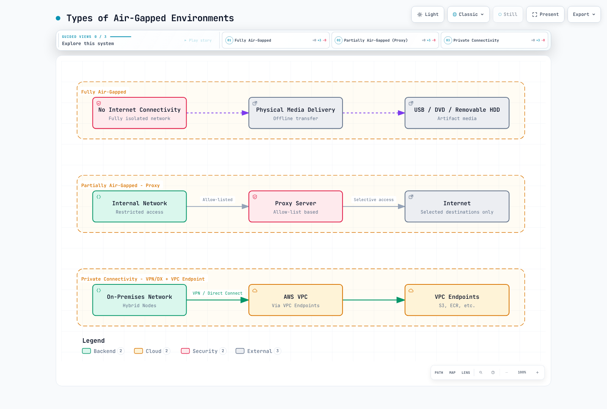
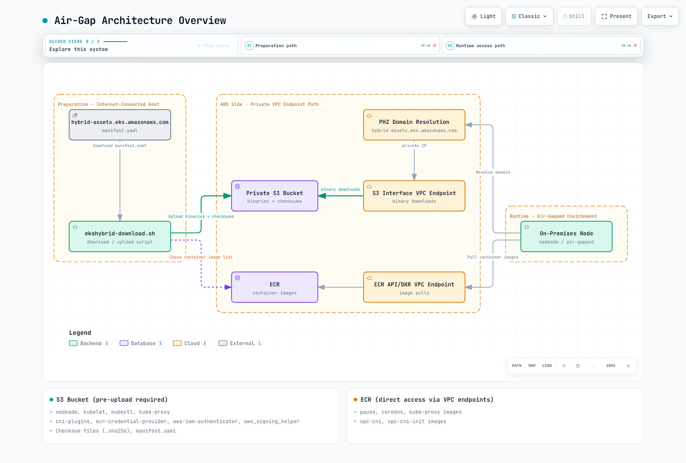

# Configuración con acceso a Internet restringido (S3, endpoints privados y proxy)

< [Anterior: Configuración de red](./02-network-configuration.md) | [Tabla de contenidos](./README.md) | [Siguiente: Bootstrap del nodo](./04-node-bootstrap.md) >

> **Versiones compatibles**: EKS Hybrid Nodes; se revisó el código fuente de nodeadm v1.0.20. Seleccione la cohorte de Kubernetes, OS, runtime y add-on para su clúster.
> **Última actualización**: September 16, 2026

Este capítulo prepara Hybrid Nodes cuyo acceso público a Internet está restringido. **Hybrid Nodes aún necesitan conectividad con el control plane de EKS alojado por AWS y los servicios de AWS utilizados para las credenciales.** La transferencia física de software no convierte a Hybrid Nodes en una distribución Kubernetes desconectada.

Los ejemplos son procedimientos de preparación y revisión, no un despliegue de producción probado. La auditoría verificó el código fuente, la configuración y casos de fallo locales; no creó una imagen de OS, publicó artefactos, registró un nodo ni validó una red privada real. El manifiesto de artefactos público no pudo recuperarse en el entorno de auditoría porque falló la verificación del nombre de host TLS. No se omitió ninguna comprobación de certificado ni se infiere de esa recuperación fallida ningún parche o digest de artefacto actual.

**Complemento para el equipo de seguridad:** la [revisión de separación de red de Hybrid Nodes](11-network-separation-security.md) explica las nuevas conexiones del control plane a las instalaciones locales, los tipos de endpoint, los límites de permisos y datos, y las evidencias de revisión. La conectividad privada por sí sola no establece el cumplimiento.

## Límites de conectividad y aislamiento

| Patrón | Lo que proporciona | Consideración para Hybrid Nodes |
|---|---|---|
| Red físicamente desconectada | Sin conexión activa con AWS | No puede proporcionar la conectividad requerida con el control plane de EKS y el servicio de credenciales |
| Proxy de salida controlado | Destinos HTTPS externos aprobados y registros | Configure por separado el instalador, los gestores de paquetes, los daemons del host y los Pods aplicables |
| VPN/Direct Connect con endpoints privados | Rutas privadas al clúster y a las API de AWS compatibles | Requiere rutas bidireccionales, DNS, security groups y autorización; los endpoints no cubren todos los hosts de descarga públicos |
| Transferencia de software sin conexión | Una forma controlada de importar artefactos revisados | Útil con conectividad privada de AWS; no sustituye dicha conectividad |

Las restricciones de red pueden reducir la exposición, pero no garantizan el cumplimiento normativo, eliminan la exfiltración de datos ni previenen todos los ataques a la cadena de suministro. La confianza en certificados, los publicadores aprobados, las firmas, el parcheo, el acceso de operadores y los flujos de datos de aplicaciones siguen siendo controles independientes. La conectividad privada también mantiene dependencias de los servicios de AWS y de la red local.



[🔍 Ver diagrama interactivo](https://www.atomai.click/kubernetes-docs/archmaps/en-eks-hybrid-nodes-03-airgap-setup-0.html)

> **Aclaración del diagrama:** la opción físicamente aislada es una comparación, no un modo de operación compatible con Hybrid Nodes.

## Arquitectura y responsabilidades de los artefactos



[🔍 Ver diagrama interactivo](https://www.atomai.click/kubernetes-docs/archmaps/en-eks-hybrid-nodes-03-airgap-setup-1.html)

> **Corrección del diagrama:** el atajo `hybrid-assets.eks.amazonaws.com → PHZ → S3` no es un mirror transparente funcional. Use las rutas de instalación indicadas a continuación. Los cambios de DNS por sí solos no proporcionan el certificado TLS del nombre de host original, el enrutamiento de objetos de S3 ni la autorización de solicitudes.

| Artefacto | Preparación y entrega |
|---|---|
| `nodeadm` de Hybrid | Apruebe una versión de `aws/eks-hybrid`; verifique la procedencia y la suma de comprobación antes de ejecutarla como root. Es distinto del nodeadm de `amazon-eks-ami` de EC2 |
| kubelet, kubectl, plugins CNI, proveedor de credenciales ECR, autenticador IAM | Seleccione una versión/build/OS/arquitectura exacta del manifiesto de artefactos aprobado |
| Ayudante de firma de IAM Roles Anywhere | Seleccione y verifique su propia versión; no elija una primera entrada arbitraria de un array |
| Instalador/agente SSM | Ruta de descarga, firma y registro Regional independiente; no se redirige completamente mediante un manifiesto de artefactos de EKS personalizado |
| containerd, runc, iptables y dependencias de OS | Cohorte de paquetes de OS/runtime aprobada, incluidas las dependencias transitivas y los metadatos de repositorio firmados |
| Imágenes CNI, CoreDNS, kube-proxy, sandbox y workload | Inventaríe los manifiestos reales, los init containers, los digests de imagen y las plataformas; el manifiesto binario no proporciona las etiquetas de imagen |

Amazon VPC CNI (`aws-node` / `vpc-cni-init`) no es el CNI para Hybrid Nodes. Use el procedimiento Hybrid CNI compatible en [Configuración de red](./02-network-configuration.md). Incluya kube-proxy solo cuando la ruta de datos del CNI elegido lo utilice. Un bundle binario de plugin CNI no es un controlador CNI desplegado.

## Elija una ruta de instalación

### Ruta A: imagen de OS preinstalada

En un builder controlado, instale el nodeadm Hybrid aprobado y ejecute `nodeadm install` con la versión de Kubernetes seleccionada para el clúster y el proveedor de credenciales. AWS documenta este uso para la creación de imágenes. Conserve los artefactos instalados y el rastreador de nodeadm en la imagen.

```bash
# Controlled image builder only; installs software on this host.
set -euo pipefail
: "${KUBERNETES_VERSION:?Approved cluster-compatible version}"
: "${REGION:?}" "${CREDENTIAL_PROVIDER:?ssm or iam-ra}"
case "$CREDENTIAL_PROVIDER" in ssm|iam-ra) ;; *) exit 1 ;; esac
sudo nodeadm install "$KUBERNETES_VERSION" \
  --credential-provider "$CREDENTIAL_PROVIDER" --region "$REGION"
```

La fuente de runtime predeterminada es la distro del OS; esa fuente no es compatible con RHEL. Para RHEL, seleccione la fuente de paquetes Docker documentada o preinstale un runtime compatible y use `--containerd-source none`. La fuente Docker no es compatible con AL2023. `none` no instala containerd por usted.

**No** inicialice/registre el builder ni clone su identidad. Entregue la activación SSM o el certificado/clave privada de IAM Roles Anywhere de cada nodo mediante el proceso aprobado por nodo. No incorpore códigos de activación, claves privadas, estado de registro SSM, certificados kubelet ni credenciales de operador en una imagen reutilizable. Bottlerocket tiene su propio flujo de trabajo de preparación/bootstrap y no usa este procedimiento nodeadm.

Las nuevas instalaciones/actualizaciones de SSM requieren nodeadm **1.0.19 o posterior** porque las versiones anteriores contienen una clave de firma SSM desactualizada. Este capítulo inspeccionó **v1.0.20**, no un binario `latest` sin límite.

### Ruta B: un manifiesto de artefactos personalizado

El **código fuente v1.0.20** publicado admite las siguientes flags aunque la tabla de flags de la guía de usuario no las enumera todas:

| Comando/configuración | Comportamiento real en la versión inspeccionada |
|---|---|
| `install --manifest-override file:///path/manifest.json` | Lee el manifiesto local; el decodificador YAML acepta JSON |
| `install --manifest-override https://mirror.example.com/manifest.json` | Descarga el manifiesto con un cliente HTTP ordinario |
| `install --private-mode` | Requiere `--manifest-override`; omite la instalación de paquetes de OS, pero aún instala artefactos de credenciales y EKS |
| `init --manifest-override ... --private-mode` | Requiere el argumento de manifiesto y obtiene de él los metadatos de Region; no elimina los requisitos de autenticación de AWS ni de conectividad con EKS |
| `uri` / `checksum_uri` de artefactos individuales | Se recuperan mediante HTTP(S), sin firma S3 SigV4. Un **manifiesto** `file://` no implica compatibilidad con URL de **artefactos** `file://` |
| `gzip_uri` | Tiene preferencia sobre `uri` cuando está presente; la verificación de la suma de comprobación ocurre después de la descompresión |

Compruebe el `install --help` e `init --help` del binario exacto desplegado antes de usar estas flags. El modo privado no es un instalador completo de paquetes sin conexión. Preinstale containerd con su unidad systemd, runc, iptables, certificados CA y todas las dependencias de OS requeridas.

Con `--credential-provider ssm`, v1.0.20 aún construye por separado las URL Regionales de `ssm-setup-cli` y de la firma. El campo `ssm_releases` de un manifiesto no redirige esta ruta de instalación. Planifique el acceso a esos objetos S3 y a las dependencias posteriores de instalación/registro del agente, o use un flujo de trabajo validado de imagen preinstalada.

### Revise un manifiesto y seleccione una cohorte

El manifiesto upstream tiene `supported_eks_releases`, `iam_roles_anywhere_releases` y `region_config`. Los registros de Kubernetes incluyen `major_minor_version`, `latest_patch_version`, `patch_releases[].version`, **`patch_version`**, **`release_date`** y URL por artefacto. Varios builds pueden compartir una versión de parche. El ejemplo anterior de `1.33.3` era una ilustración histórica del esquema, no evidencia de un parche actualmente aprobado.

Conserve el manifiesto upstream descargado, su fecha/hash de recuperación y el registro de aprobación. Verifique su origen HTTPS antes de seleccionarlo. El siguiente selector local requiere un parche exacto de Kubernetes, fecha de build, versión del ayudante de firma y arquitectura. Rechaza selecciones ambiguas, artefactos faltantes, claves YAML duplicadas y Regions desconocidas. Conserva los metadatos reales de Region en lugar de adivinar una cuenta ECR.

Guarde como `select-mirror.py` en el host de preparación; requiere Python 3 y PyYAML:

```python
#!/usr/bin/env python3
"""Build a local review plan, not an installer. Requires PyYAML."""
import copy
import datetime
import json
import re
import sys
from pathlib import Path
from urllib.parse import urlsplit

import yaml


class UniqueLoader(yaml.SafeLoader):
    pass


def mapping(loader, node, deep=False):
    result = {}
    for key_node, value_node in node.value:
        key = loader.construct_object(key_node, deep=deep)
        if key in result:
            raise ValueError("duplicate YAML key")
        result[key] = loader.construct_object(value_node, deep=deep)
    return result


UniqueLoader.add_constructor(
    yaml.resolver.BaseResolver.DEFAULT_MAPPING_TAG, mapping
)


def https_url(value):
    if not isinstance(value, str) or any(c.isspace() for c in value):
        raise ValueError("URL must be a nonempty HTTPS URL")
    parsed = urlsplit(value)
    if (parsed.scheme != "https" or not parsed.hostname or parsed.username
            or parsed.password or parsed.query or parsed.fragment):
        raise ValueError("HTTPS URL must not contain credentials, query or fragment")
    return value


def select(manifest, version, build_date, iam_version, arch, region, mirror):
    if not re.fullmatch(r"1\.\d+\.\d+", version):
        raise ValueError("an exact approved Kubernetes patch is required")
    datetime.date.fromisoformat(build_date)
    if arch not in ("amd64", "arm64"):
        raise ValueError("unsupported architecture")
    mirror = https_url(mirror).rstrip("/")
    region_info = manifest["region_config"][region]  # No account fallback.
    if (region_info.get("partition") != "aws"
            or region_info.get("dns_suffix") != "amazonaws.com"
            or not region_info.get("cred_providers", {}).get("iam-ra")
            or not re.fullmatch(r"\d{12}", str(region_info.get("ecr_account_id", "")))):
        raise ValueError("review a supported commercial Region with IAM Roles Anywhere")
    minor, patch = version.rsplit(".", 1)
    releases = [
        release
        for family in manifest["supported_eks_releases"]
        if family["major_minor_version"] == minor
        for release in family["patch_releases"]
        if release["version"] == version and release["patch_version"] == patch
        and release["release_date"] == build_date
    ]
    iam = [
        release for release in manifest["iam_roles_anywhere_releases"]
        if release["version"] == iam_version
    ]
    if len(releases) != 1 or len(iam) != 1:
        raise ValueError("release selection must be unique")
    eks_release, iam_release = copy.deepcopy(releases[0]), copy.deepcopy(iam[0])
    plan = []
    for release, names in [
        (eks_release, ["kubelet", "kubectl", "cni-plugins",
                       "ecr-credential-provider", "aws-iam-authenticator"]),
        (iam_release, ["aws_signing_helper"]),
    ]:
        chosen = []
        for name in names:
            matches = [a for a in release["artifacts"]
                       if a["name"] == name and a["arch"] == arch and a["os"] == "linux"]
            if len(matches) != 1:
                raise ValueError("missing or duplicate artifact: " + name)
            artifact = matches[0]
            item_id = "a%02d" % len(plan)
            plan.append({"id": item_id, "name": name,
                         "uri": https_url(artifact["uri"]),
                         "checksum_uri": https_url(artifact["checksum_uri"])})
            # Use the original, uncompressed URI; its checksum is not a gzip-file hash.
            artifact.pop("gzip_uri", None)
            artifact["uri"] = mirror + "/" + item_id + "/data"
            artifact["checksum_uri"] = mirror + "/" + item_id + "/data.sha256"
            chosen.append(artifact)
        release["artifacts"] = chosen
    selected = {
        "supported_eks_releases": [{
            "major_minor_version": minor, "latest_patch_version": patch,
            "patch_releases": [eks_release],
        }],
        "iam_roles_anywhere_releases": [iam_release],
        "region_config": {region: copy.deepcopy(region_info)},
    }
    return selected, {"artifacts": plan}


def main():
    if len(sys.argv) != 9:
        raise ValueError(
            "usage: select-mirror.py UPSTREAM VERSION BUILD_DATE IAM_VERSION "
            "ARCH REGION HTTPS_MIRROR_PREFIX NEW_OUTPUT_DIR"
        )
    source, version, date, iam, arch, region, mirror, output = sys.argv[1:]
    manifest = yaml.load(Path(source).read_text(), Loader=UniqueLoader)
    selected, plan = select(manifest, version, date, iam, arch, region, mirror)
    out = Path(output)
    out.mkdir(mode=0o700, parents=False, exist_ok=False)
    (out / "upstream.yaml").write_bytes(Path(source).read_bytes())
    (out / "manifest.json").write_text(json.dumps(selected, indent=2) + "\n")
    (out / "plan.json").write_text(json.dumps(plan, indent=2) + "\n")


if __name__ == "__main__":
    main()
```

El directorio de salida debe ser nuevo. El prefijo del mirror HTTPS debe asignarse al mismo prefijo de objetos inmutable usado para la publicación. Este script solo crea un plan; no descarga ni se autentica ante el mirror.

```bash
set -euo pipefail
: "${APPROVED_PATCH:?}" "${APPROVED_BUILD_DATE:?}" "${APPROVED_IAM_VERSION:?}"
: "${ARCH:?amd64 or arm64}" "${REGION:?}"
: "${MIRROR_PREFIX:?HTTPS URL for this reviewed candidate}"
: "${NEW_PLAN_DIR:?A new local directory}"
python3 select-mirror.py upstream.yaml "$APPROVED_PATCH" "$APPROVED_BUILD_DATE" \
  "$APPROVED_IAM_VERSION" "$ARCH" "$REGION" "$MIRROR_PREFIX" "$NEW_PLAN_DIR"
```

Revise todos los hosts de origen y los seis artefactos seleccionados antes de descargarlos. Este es un **ejemplo de artefactos de IAM Roles Anywhere**, no un mirror de instalador SSM. No incluye el propio nodeadm, paquetes de OS, imágenes, claves de firma ni certificados.

Guarde como `download-plan.sh`:

```bash
#!/usr/bin/env bash
# Download into a new plan directory. No AWS writes or host installation.
set -euo pipefail
umask 077
cd -- "${1:?Use the directory produced by select-mirror.py}"
test ! -e checksums.sha256
test ! -e queue.tsv
jq -er '.artifacts[] | [.id, .uri, .checksum_uri] | @tsv' plan.json > queue.tsv
test "$(wc -l < queue.tsv)" -eq 6
while IFS=$'\t' read -r item_id uri checksum_uri; do
  [[ "$item_id" =~ ^a[0-9]{2}$ ]]
  mkdir -- "$item_id"  # Refuse a partial run or existing directory.
  curl --fail --show-error --silent --location \
    --proto '=https' --proto-redir '=https' --connect-timeout 10 \
    --max-time 300 --max-filesize 268435456 \
    "$uri" -o "$item_id/data"
  curl --fail --show-error --silent --location \
    --proto '=https' --proto-redir '=https' --connect-timeout 10 \
    --max-time 30 --max-filesize 4096 \
    "$checksum_uri" -o "$item_id/upstream.sha256"
  expected=$(python3 - "$item_id/upstream.sha256" <<'CHECKSUM_PY'
import pathlib, re, sys
text = pathlib.Path(sys.argv[1]).read_text().strip()
match = re.fullmatch(r"([0-9a-fA-F]{64})(?:[ \t]+[^\r\n]+)?", text)
if not match:
    raise SystemExit("missing, malformed or multi-record upstream checksum")
print(match.group(1).lower())
CHECKSUM_PY
)
  actual=$(sha256sum "$item_id/data")
  [[ "${actual%% *}" == "$expected" ]]
  # nodeadm v1.0.20 requires GNU format: digest, space, filename.
  printf '%s  data\n' "$expected" > "$item_id/data.sha256"
done < queue.tsv
sha256sum manifest.json plan.json upstream.yaml a*/data a*/data.sha256 \
  > checksums.sha256
sha256sum --strict --check checksums.sha256
printf '%s\n' 'Six artifacts verified locally; publishing and node installation remain separate.'
```

El límite de tamaño es intencionalmente de 256 MiB por artefacto; revíselo si un artefacto aprobado lo supera. Una descarga, suma de comprobación malformada o falta de coincidencia de hash detiene el script. Se conserva un directorio parcial para inspección; inicie un nuevo candidato después de resolver la causa. No elimine un directorio `/tmp` compartido ni omita las sumas de comprobación faltantes.

Estos hashes vinculan los bytes seleccionados con las sumas de comprobación recuperadas. No son una firma independiente ni una prueba de que un publicador comprometido sea confiable. Proteja el registro de manifiesto/suma de comprobación revisado y use la verificación del publicador donde esté disponible.

## Publicación y autorización de S3 privado

Use un bucket **precreado y de su propiedad** con Block Public Access, cifrado aprobado, versionado/retención y permisos separados de publicador/lector. Los ejemplos siguientes no crean un bucket ni reemplazan su política. AccessDenied, las credenciales expiradas y los timeouts son fallos, no evidencia de que un bucket/objeto no exista.

Un ejemplo de *sentencia de política de lector* para un bucket existente es:

```json
{
  "Sid": "ReadApprovedHybridArtifacts",
  "Effect": "Allow",
  "Principal": {"AWS": "arn:aws:iam::111122223333:role/HybridArtifactReader"},
  "Action": "s3:GetObject",
  "Resource": "arn:aws:s3:::example-hybrid-artifacts/hybrid-candidates/*",
  "Condition": {"StringEquals": {"aws:SourceVpce": "vpce-0123456789abcdef0"}}
}
```

Sustituya la cuenta, el rol, el bucket, el prefijo y el endpoint por valores revisados. Esta sentencia concede una ruta; no revoca otras concesiones existentes. Un `Deny s3:*` para todo el bucket para cada solicitud fuera de un endpoint también puede bloquear al publicador conectado y la recuperación administrativa. Diseñe explícitamente esas rutas antes de aplicar tal límite.

La política de principal nombrado requiere una solicitud firmada. **El descargador HTTPS ordinario de nodeadm no se convierte en un cliente S3 autenticado con IAM porque el nodo tenga un rol IAM.** Dos diseños funcionales que se deben validar son:

1. Use un agente/CLI de preparación autenticado para recuperar los archivos aprobados y luego proporciónelos a través de un servicio de artefactos HTTPS controlado por la organización con controles de acceso de red apropiados y un certificado para su propio nombre de host.
2. Use la ruta de imagen preinstalada, sin dependencia de un mirror binario en tiempo de ejecución.

Una URL de objeto S3 privada que devuelve `403` no se corrige con una anulación DNS. No coloque URL prefirmadas de portador ni credenciales en manifiestos, argumentos de proceso o logs publicados. Si una organización elige lecturas no autenticadas de binarios no secretos restringidas a una red privada, esa es una política independiente y revisada explícitamente, no la política de principal nombrado anterior.

Guarde como `publish-plan.sh`. Ejecute solo después de que el propietario del bucket apruebe el candidato y los permisos; este script **escribe objetos S3**:

```bash
#!/usr/bin/env bash
# Owner-approved publication only; creates billable S3 objects, never a bucket.
set -euo pipefail
umask 077
cd -- "${1:?Use a verified plan directory}"
: "${REGION:?}" "${BUCKET:?}" "${EXPECTED_ACCOUNT_ID:?}" "${PREFIX:?}"
[[ "$EXPECTED_ACCOUNT_ID" =~ ^[0-9]{12}$ ]]
[[ "$PREFIX" =~ ^hybrid-candidates/[A-Za-z0-9-]+$ ]]
sha256sum --strict --check checksums.sha256
aws s3api head-bucket --region "$REGION" --bucket "$BUCKET" \
  --expected-bucket-owner "$EXPECTED_ACCOUNT_ID"
# Manifest is last. Any failed write stops; retain the partial prefix for review.
for file in a{00..05}/data a{00..05}/data.sha256 checksums.sha256 \
            upstream.yaml plan.json manifest.json; do
  test -f "$file"
  aws s3api put-object --region "$REGION" --bucket "$BUCKET" \
    --expected-bucket-owner "$EXPECTED_ACCOUNT_ID" \
    --key "$PREFIX/$file" --body "$file" --if-none-match '*' \
    --server-side-encryption AES256 --checksum-algorithm SHA256 \
    --output json > "${file//\//_}.upload.json"
done
printf '%s\n' 'Candidate uploaded. Verify readback, mirror URL mapping and hashes before promotion.'
```

Para un bucket que requiera SSE-KMS, use su clave aprobada y permisos KMS en lugar del ejemplo AES256. Las escrituras condicionales evitan sobrescribir una clave existente; no hacen atómica una carga de varios objetos. El manifiesto se carga al final, y un candidato fallido permanece sin publicar hasta que se verifiquen la lectura de vuelta y la asignación real del mirror HTTPS. Registre los VersionIds/sumas de comprobación y la retención de objetos devueltos; los ETags de S3 no son un digest SHA-256 universal.

## Requisitos de DNS y endpoint privado

`hybrid-assets.eks.amazonaws.com` es el host de descarga AWS CloudFront. Crear una PHZ con ese nombre y asignarle un alias a S3 no conserva:

- el certificado TLS/nombre de host SNI;
- el encabezado HTTP Host y la asignación bucket/clave de objeto de S3;
- las rutas originales, especialmente cuando un cargador aplanó todos los nombres;
- la autorización de solicitudes.

No corrija esto desactivando las comprobaciones TLS. Mantenga el origen aprobado accesible a través de un proxy controlado, use la imagen preinstalada o use anulaciones de manifiesto compatibles con URL de mirror reales.

Los endpoints **Interface** de S3 pueden atender clientes locales mediante VPN/Direct Connect. El DNS privado de S3 es compatible. La opción **private DNS only for inbound Resolver** requiere un endpoint gateway S3 mantenido para el lado VPC; como alternativa, enrute las solicitudes tanto de VPC como locales a través del endpoint interface. Un endpoint gateway por sí solo no es accesible directamente desde las instalaciones locales.

Seleccione los endpoints por sus ID de VPC y endpoint revisados, no el primer endpoint S3 de una Region. Use el procedimiento de DNS/enrutamiento en [Configuración de red](./02-network-configuration.md). Los endpoints de API de administración EKS no son el endpoint de API Kubernetes; los endpoints ECR privados no proporcionan acceso general a ECR público ni CloudFront.

## Instale e inicialice un nodo preparado

Para la ruta personalizada de IAM Roles Anywhere, el runtime, las dependencias de OS, el nodeadm aprobado y el servicio mirror ya deben estar preparados. El comando instala software en el nodo de destino:

```bash
set -euo pipefail
: "${APPROVED_PATCH:?}" "${REGION:?}" "${LOCAL_MANIFEST:?Absolute local path}"
[[ "$LOCAL_MANIFEST" = /* ]]
test -s "$LOCAL_MANIFEST"
sudo nodeadm install "$APPROVED_PATCH" --region "$REGION" \
  --credential-provider iam-ra --containerd-source none \
  --manifest-override "file://$LOCAL_MANIFEST" --private-mode
```

Prepare la configuración por nodo usando [Requisitos previos](./01-prerequisites.md) y [Bootstrap del nodo](./04-node-bootstrap.md). Por ejemplo, la **forma** de la configuración SSM es:

```yaml
apiVersion: node.eks.aws/v1alpha1
kind: NodeConfig
spec:
  cluster:
    name: my-hybrid-cluster
    region: ap-northeast-2
  hybrid:
    ssm:
      activationCode: REPLACE_WITH_NODE_ACTIVATION_CODE
      activationId: REPLACE_WITH_NODE_ACTIVATION_ID
```

Use exactamente el proveedor instalado en el nodo; esta forma SSM no es la configuración para el comando IAM Roles Anywhere anterior. Proteja el archivo completado (propiedad de root, modo `0600`), no lo haga commit nunca y no coloque secretos en el historial de shell. Proporcionar campos de endpoint API/CA escritos manualmente no elimina la necesidad de la ruta documentada de detección y autenticación del clúster.

```bash
# Local config validation; this is not a join or an end-to-end network test.
sudo nodeadm config check --config-source file:///etc/eks/nodeconfig.yaml
```

Después de que se cumplan los requisitos previos de red, identidad y CNI, el propietario puede ejecutar `nodeadm init`. En la ruta de manifiesto privado, pase de nuevo el manifiesto aprobado:

```bash
# Mutates the target node and registers it with EKS.
sudo nodeadm init --config-source file:///etc/eks/nodeconfig.yaml \
  --manifest-override file:///etc/eks/manifest.json --private-mode
```

No existe `nodeadm init --dry-run` en la versión inspeccionada. No omita la validación de inicialización solo para que una preparación incompleta parezca aprobada.

## Entrega de imágenes de contenedor

Las descargas de ECR privado requieren las rutas API y DKR de ECR, la ruta de descarga de capas S3, DNS y los permisos de descarga de imágenes apropiados. Una llamada `describe-repositories` correcta no demuestra que se puedan descargar capas de imagen. Precargue y pruebe cualquier caché pull-through; la documentación de endpoint ECR describe requisitos adicionales de Internet para una primera descarga sin caché.

Use referencias reales de cuenta/Region/imagen de registro de los manifiestos add-on desplegados. No construya etiquetas de imagen añadiendo `-eksbuild.1` a un parche Kubernetes ni copie versiones obsoletas de pause/CoreDNS de un clúster no relacionado.

nodeadm instala el ayudante ECR en `/etc/eks/image-credential-provider/ecr-credential-provider` e inicializa su configuración en `/etc/eks/image-credential-provider/config.json`. Compruebe la configuración kubelet generada en lugar de escribir un archivo sin usar bajo un directorio diferente. `ctr images pull` es un cliente independiente y no usa automáticamente el proveedor de credenciales exec de kubelet.

### Transferencia de imágenes sin conexión

Seleccione un digest aprobado y las plataformas requeridas. Para un archivo multi-plataforma, conserve el índice y los digests cuando los formatos de origen/destino lo permitan:

```bash
# Preparation host: downloads images; requires reviewed registry authentication.
set -euo pipefail
: "${SOURCE_DIGEST_REF:?registry/repository@sha256:approved-digest}"
: "${NEW_IMAGE_DIR:?New directory}"
[[ "$SOURCE_DIGEST_REF" =~ @sha256:[0-9a-f]{64}$ ]]
mkdir -m 700 -- "$NEW_IMAGE_DIR"
skopeo copy --all --preserve-digests "docker://$SOURCE_DIGEST_REF" \
  "oci-archive:$NEW_IMAGE_DIR/image.tar:approved"
(cd "$NEW_IMAGE_DIR" && sha256sum image.tar > image.tar.sha256)
```

Transfiera el archivo y su registro de aprobación/hash protegido de manera independiente. Antes de importar o cargar, ejecute `sha256sum --strict --check image.tar.sha256` en ese directorio y deténgase ante un fallo. Para un destino de registro interno:

```bash
# Internal staging host: writes an image to the reviewed destination registry.
set -euo pipefail
: "${DEST_DIGEST_REF:?approved-registry/repository@sha256:approved-digest}"
[[ "$DEST_DIGEST_REF" =~ @sha256:[0-9a-f]{64}$ ]]
sha256sum --strict --check image.tar.sha256
skopeo copy --all --preserve-digests oci-archive:image.tar:approved \
  "docker://$DEST_DIGEST_REF"
```

No desactive la verificación TLS del registro. Cambiar el formato de compresión/manifiesto puede impedir conservar un digest; deténgase y revise la identidad resultante en lugar de afirmar silenciosamente que no cambió.

La precarga directa de containerd es otra opción, pero debe probarse para el runtime desplegado: Kubernetes usa el namespace `k8s.io`, las referencias importadas deben coincidir con las referencias Pod/sandbox y deben existir todos los blobs de plataforma requeridos. Una anotación `approved` de un archivo no es automáticamente el nombre de registro que solicita un Pod. La recolección de basura de imágenes y `imagePullPolicy` también pueden provocar descargas posteriores. Una importación de tar correcta por sí sola no demuestra que se iniciará un Pod sin conexión.

## Repositorios de paquetes locales firmados

Refleje la versión de OS, arquitectura, dependencias transitivas y metadatos como una cohorte revisada. Conserve las firmas del proveedor o firme un repositorio mantenido por la organización con una clave de confianza independiente.

Ejemplo de configuración de cliente Ubuntu para un repositorio flat local **ya preparado y firmado**:

```text
deb [signed-by=/etc/apt/keyrings/hybrid-mirror.gpg] file:///srv/apt-repo ./
```

El repositorio necesita `Release` válido más `InRelease` o `Release.gpg`, no solo `Packages.gz`. Distribuya y verifique la huella de la clave mediante una ruta de confianza independiente. No use `trusted=yes` para suprimir la autenticación del repositorio.

Ejemplo de configuración de repositorio DNF/YUM:

```ini
[hybrid-local]
name=Reviewed hybrid packages
baseurl=file:///srv/yum-repo
enabled=1
gpgcheck=1
repo_gpgcheck=1
gpgkey=file:///etc/pki/rpm-gpg/RPM-GPG-KEY-hybrid-mirror
```

Esto requiere firmas de paquetes válidas y metadatos de repositorio firmados. Las claves de firma de metadatos y paquetes pueden diferir; configure el conjunto de claves aprobado. No establezca `gpgcheck=0` cuando falle la verificación. La instalación de paquetes y los reinicios de servicios pertenecen a una creación de imagen o a una operación de mantenimiento con drenaje, no a un script arbitrario de verificación de nodo activo.

## Configuración de proxy

Primero cree un mapa de destinos por cliente. Incluya loopback, los nombres reales de API/registro privados y los rangos de nodo/Pod/Service que deben omitir el proxy. La coincidencia de CIDR y sufijos varía según el cliente. No coloque ciegamente **`.eks.amazonaws.com`** en `NO_PROXY`: también coincide con el host de descarga público `hybrid-assets.eks.amazonaws.com`.

Un ejemplo de shell para configuración de proxy revisada y no secreta es:

```bash
export HTTP_PROXY=http://proxy.internal.example.com:3128
export HTTPS_PROXY=http://proxy.internal.example.com:3128
export NO_PROXY=localhost,127.0.0.1,::1,.svc,.cluster.local,registry.internal.example.com
export http_proxy="$HTTP_PROXY" https_proxy="$HTTPS_PROXY" no_proxy="$NO_PROXY"
```

Añada el nombre de host/IP real de la API privada y otros destinos de omisión; esta no es una configuración completa del sitio. El entorno de un shell de login no configura servicios systemd existentes. No cargue ni añada repetidamente contenido a `/etc/environment`.

Para `containerd.service` y `kubelet.service`, use un drop-in gestionado por el propietario en `/etc/systemd/system/UNIT.service.d/http-proxy.conf`:

```ini
[Service]
Environment="HTTP_PROXY=http://proxy.internal.example.com:3128"
Environment="HTTPS_PROXY=http://proxy.internal.example.com:3128"
Environment="NO_PROXY=localhost,127.0.0.1,::1,.svc,.cluster.local,registry.internal.example.com"
```

Revise los drop-ins existentes y reinicie las unidades afectadas solo en la fase aprobada de creación/mantenimiento. Una sección `[proxy.http]` en TOML de containerd no es la configuración de proxy HTTP.

| Componente | Configuración y condiciones |
|---|---|
| Proceso nodeadm | Pase solo el entorno de proxy revisado mediante `sudo`; no reenvíe todo el entorno del operador con `sudo -E` |
| containerd / kubelet | Entorno systemd separado; la configuración kubelet generada y el entorno del host son capas diferentes |
| SSM en Ubuntu con la instalación snap documentada | `snap.amazon-ssm-agent.amazon-ssm-agent.service.d/http-proxy.conf` |
| SSM en AL2023/RHEL | `amazon-ssm-agent.service.d/http-proxy.conf`; confirme la unidad realmente instalada |
| Proceso de credenciales IAM Roles Anywhere | nodeadm detecta variables de proxy al generar `--with-proxy`; el daemon que invoca también debe recibir el entorno correcto |
| IAM Roles Anywhere con `spec.hybrid.enableCredentialsFile: true` | `aws_signing_helper_update.service` **sí existe** en este modo; configure su drop-in antes de la inicialización. No suponga que el servicio está presente en todas las instalaciones de IAM Roles Anywhere |
| apt | Un archivo gestionado por el propietario en `/etc/apt/apt.conf.d/` con `Acquire::http::Proxy` y `Acquire::https::Proxy` |
| snap | `snap set system proxy.http=... proxy.https=...`, cuando realmente se use snap |
| dnf / yum | Revise y actualice el ajuste `proxy` de la configuración existente; no reemplace sus otros ajustes ni añada duplicados |
| kube-proxy / otros Pods | Configure su entorno Pod solo cuando su tráfico requiera el proxy |

Para la topología de proxy documentada, configure kube-proxy después de la creación del clúster y antes de unir los nodos hybrid. Conserve el entorno `NODE_NAME` existente y todos los argumentos de comando. Lo siguiente es un **fragmento de strategic merge patch**, no un DaemonSet independiente:

```yaml
spec:
  template:
    spec:
      containers:
        - name: kube-proxy
          env:
            - name: HTTP_PROXY
              value: http://proxy.internal.example.com:3128
            - name: HTTPS_PROXY
              value: http://proxy.internal.example.com:3128
            - name: NO_PROXY
              value: localhost,127.0.0.1,::1,.svc,.cluster.local
```

Revise/extienda los destinos de omisión y aplique mediante el propietario del add-on. Un strategic merge integrado de DaemonSet usa nombres de container/env; JSON Patch `add /containers/0/env` puede reemplazar todo el entorno existente y presupone el índice del container. No despliegue kube-proxy solo para este ejemplo si el CNI elegido lo reemplaza.

## Validación y actualizaciones controladas

| Comprobación | Evidencia requerida | Qué es insuficiente |
|---|---|---|
| Integridad de artefactos | Cada archivo seleccionado, suma de comprobación, manifiesto aprobado y cohorte coincide | Omitir archivos faltantes o aceptar cero archivos verificados |
| DNS/TLS | Destino correcto y validación de nombre de host/CA en la ruta prevista | Una dirección `10.*`, cualquier dirección `172.*` o `curl -k` |
| S3 | Lectura de vuelta autorizada real del bucket/clave/versión exactos, propietario esperado y hash | Listar un prefijo o tratar errores de API como ausencia |
| ECR | Digest/plataforma requeridos reales y descargas de capas mediante la ruta de credenciales del workload | `describe-repositories` o una llamada `ctr` independiente no autenticada |
| Configuración nodeadm | `nodeadm config check` tiene éxito con un archivo protegido y completado | Contar una configuración faltante como éxito o un `init --dry-run` inexistente |
| Operación del nodo | Actualización de credenciales, confianza/autenticación de API Kubernetes, CNI/DNS y una prueba de workload acotada | Una comprobación correcta de parser local o una respuesta `/healthz` |

Use `nodeadm debug --config-source file:///etc/eks/nodeconfig.yaml` para los diagnósticos documentados de conectividad/identidad cuando las lecturas AWS estén autorizadas. Contacta servicios y puede emitir contexto de diagnóstico confidencial; mantenga la salida privada y enmascare antes de compartirla. No convierta comprobaciones desconocidas/fallidas en «listo para producción».

La automatización de actualizaciones debe **descubrir candidatos** y, después, requerir verificación de origen, revisión de compatibilidad, escaneo de OS/imagen, validación local, un canary de nodo representativo y aprobación antes de la promoción. Publique bajo un nuevo prefijo inmutable de versión/build, conserve la cohorte aprobada anterior y registre los límites de rollback. No ejecute un trabajo cron que sobrescriba silenciosamente claves `latest` de producción; `nodeadm upgrade` es disruptivo y requiere evacuación de workloads.

Las estimaciones históricas de ancho de banda del cuestionario anterior —caché de capas **50–80%**, compresión **30–50%**, filtrado de plataformas **50%**— no tenían una medición atribuible. Consérvelas solo como ilustraciones históricas no verificadas, no como ahorros previstos. Mida los bytes reales para la reutilización de capas, el conjunto de plataformas y el formato de compresión; no recomprima contenido aprobado mientras afirma que su digest permanece sin cambios.

## Referencias principales

- [Referencia de AWS Hybrid nodeadm](https://docs.aws.amazon.com/eks/latest/userguide/hybrid-nodes-nodeadm.html)
- [Preparar sistemas operativos Hybrid](https://docs.aws.amazon.com/eks/latest/userguide/hybrid-nodes-os.html)
- [Configuración de proxy Hybrid](https://docs.aws.amazon.com/eks/latest/userguide/hybrid-nodes-proxy.html)
- [Flags de instalación de nodeadm v1.0.20](https://github.com/aws/eks-hybrid/blob/v1.0.20/cmd/nodeadm/install/install.go) y [flags de init](https://github.com/aws/eks-hybrid/blob/v1.0.20/cmd/nodeadm/init/init.go)
- [Implementación de selección/descarga de artefactos](https://github.com/aws/eks-hybrid/blob/v1.0.20/internal/aws/source.go) y [fuente SSM](https://github.com/aws/eks-hybrid/blob/v1.0.20/internal/ssm/source.go)
- [Endpoints interface/DNS privado de S3](https://docs.aws.amazon.com/AmazonS3/latest/userguide/privatelink-interface-endpoints.html)
- [Endpoints VPC de ECR](https://docs.aws.amazon.com/AmazonECR/latest/userguide/vpc-endpoints.html)
- [Copia de Skopeo](https://github.com/containers/skopeo/blob/main/docs/skopeo-copy.1.md)
- [Autenticación de repositorios APT](https://manpages.ubuntu.com/manpages/noble/man8/apt-secure.8.html)
- [Ajustes de firma de repositorios DNF](https://github.com/rpm-software-management/dnf/blob/master/doc/conf_ref.rst)
- [Condiciones, cifrado y sumas de comprobación de S3 PutObject](https://docs.aws.amazon.com/AmazonS3/latest/API/API_PutObject.html)
- [Nombres, digests y políticas de descarga de imágenes Kubernetes](https://kubernetes.io/docs/concepts/containers/images/)

< [Anterior: Configuración de red](./02-network-configuration.md) | [Tabla de contenidos](./README.md) | [Siguiente: Bootstrap del nodo](./04-node-bootstrap.md) >
