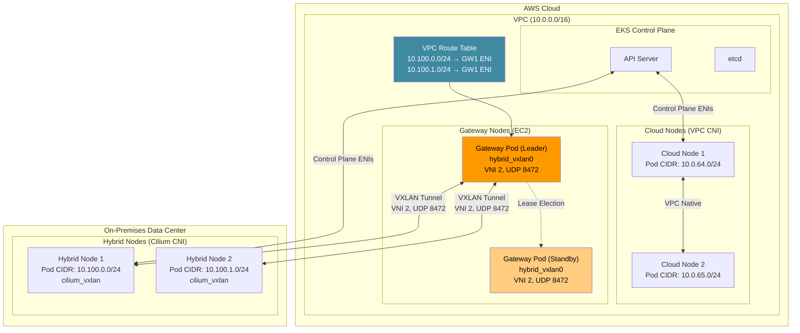
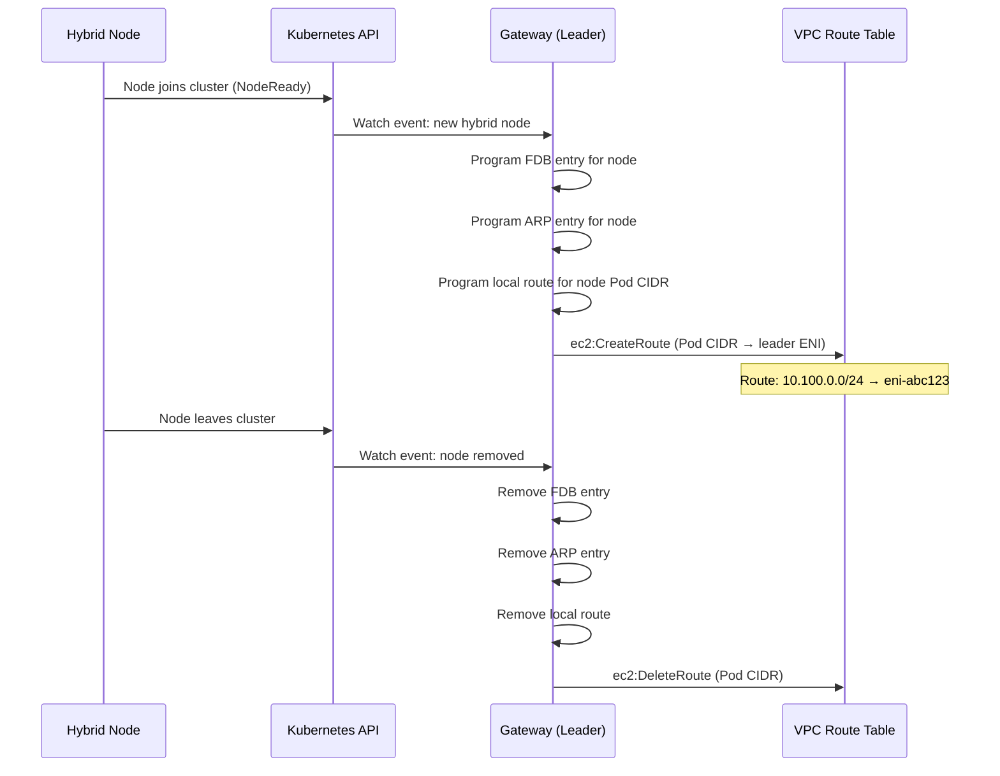
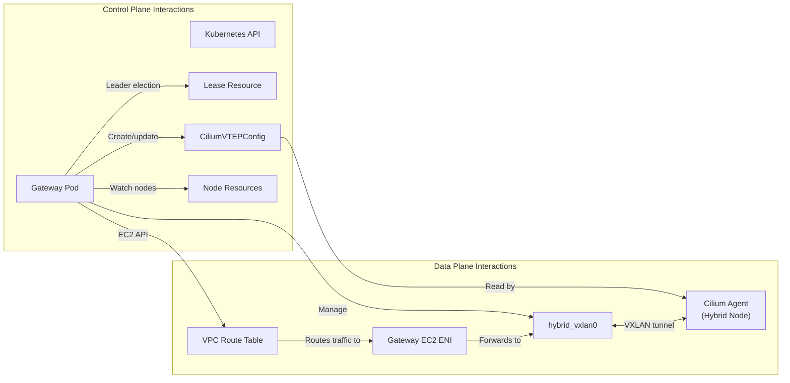
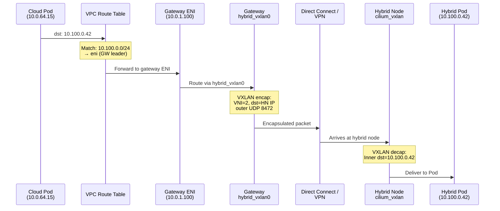
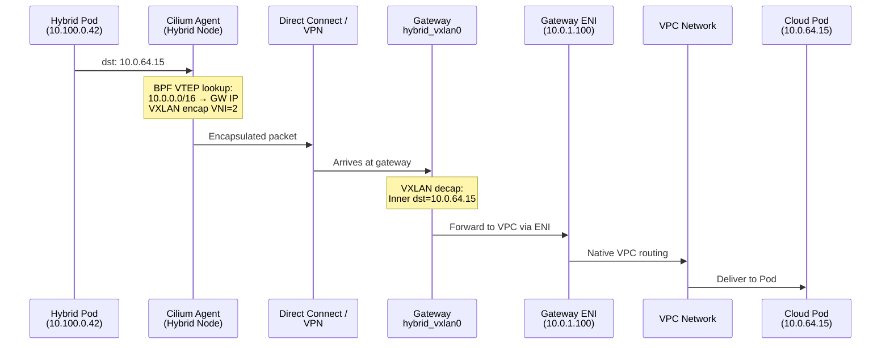
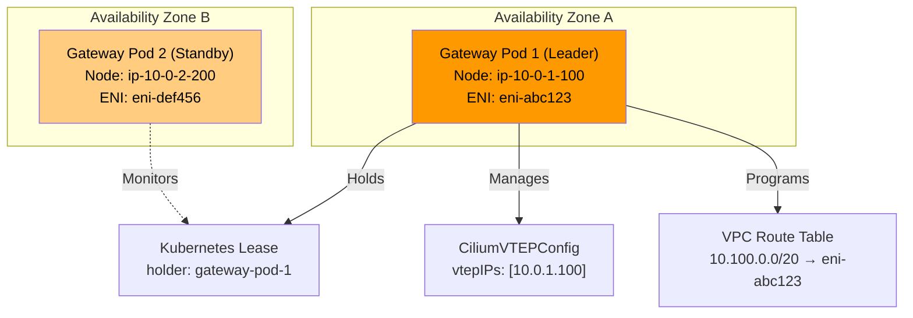
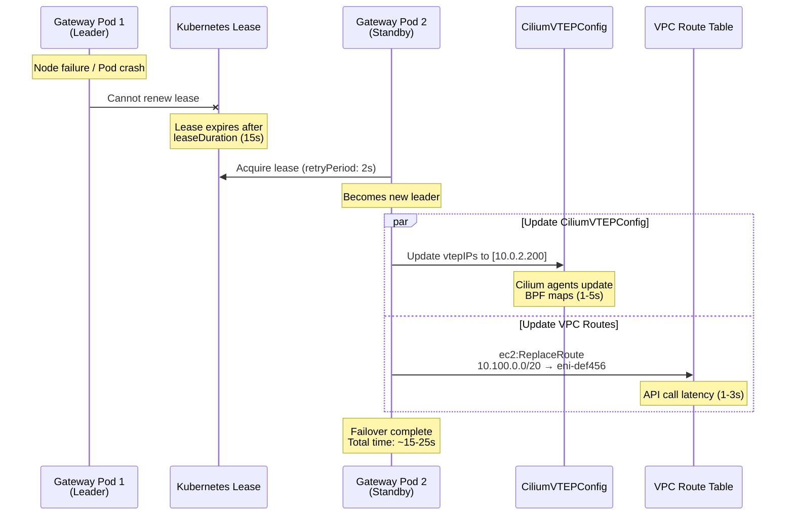

# Gateway de EKS Hybrid Nodes

< [Anterior: Configuración de Bare Metal OS](./09-bare-metal-os-setup.md) | [Tabla de contenido](./README.md) >

> **Versiones compatibles**: EKS 1.31+
> **Última actualización**: June 28, 2026

---

## Descripción general

EKS Hybrid Nodes Gateway es un componente de red open-source que automatiza la conectividad entre tu Amazon VPC y los Kubernetes Pods que se ejecutan en Hybrid Nodes en entornos on-premises o edge. Anunciado como disponible de forma general el 21 de abril de 2026, el gateway elimina la necesidad de administración manual de rutas, configuración de BGP o configuraciones complejas de redes overlay que antes se requerían para habilitar la comunicación bidireccional a nivel de Pod entre cargas de trabajo en la nube y on-premises.

El gateway funciona estableciendo túneles VXLAN entre instancias EC2 gateway dedicadas en tu VPC y Hybrid Nodes on-premises administrados por Cilium. Programa automáticamente las VPC route tables, administra entradas de forwarding database (FDB) y configura la integración de Cilium VTEP (VXLAN Tunnel Endpoint) para que los Pods en la VPC puedan comunicarse directamente con Pods en Hybrid Nodes --- y viceversa --- sin ninguna intervención manual.

**Características clave:**

- **Open source**: Disponible completamente en [github.com/aws/eks-hybrid-nodes-gateway](https://github.com/aws/eks-hybrid-nodes-gateway)
- **Sin cargo adicional**: El software del gateway en sí es gratuito; solo pagas por las instancias EC2 que ejecutan el gateway
- **Administración automatizada de rutas**: Las VPC route tables se programan automáticamente cuando los Hybrid Nodes se unen al cluster o lo abandonan
- **Alta disponibilidad**: Compatible con un Deployment de 2 réplicas con elección de líder basada en Lease para failover
- **Integración con Cilium**: Aprovecha la característica VTEP de Cilium para habilitar enrutamiento transparente Pod-to-Pod a través del túnel VXLAN

### Objetivos de aprendizaje

Después de completar este documento, podrás:

1. **Explicar la arquitectura** de EKS Hybrid Nodes Gateway, incluidos el túnel VXLAN, la elección de líder y la administración de VPC routes
2. **Desplegar y configurar** el gateway usando Helm, incluidos IAM roles, security groups e integración de Cilium VTEP
3. **Trazar flujos de tráfico** entre VPC Pods y Hybrid Node Pods en ambas direcciones
4. **Implementar alta disponibilidad** con deployments de gateway de múltiples réplicas y comprender el comportamiento de failover
5. **Operar y solucionar problemas** de deployments del gateway, incluidos monitoreo, escalado y escenarios de fallas comunes
6. **Comparar enfoques** para redes de Hybrid Nodes y decidir cuándo usar el gateway frente al enrutamiento manual
7. **Aplicar mejores prácticas** de seguridad, rendimiento y optimización de costos en deployments de gateway de producción

### El problema: enrutamiento manual de Pods en entornos híbridos

Antes de que el gateway estuviera disponible, habilitar la comunicación a nivel de Pod entre la VPC y los Hybrid Nodes requería un esfuerzo manual significativo:

```
Before Gateway (Manual Approach):
=================================

1. Configure BGP peering between on-prem routers and VPC (or use static routes)
2. Manually manage VPC route table entries for every hybrid Pod CIDR
3. Set up and maintain VPN tunnels or Direct Connect with proper route propagation
4. Handle route updates when nodes join/leave the cluster
5. Troubleshoot routing asymmetries and MTU issues across multiple hops
6. Maintain custom scripts or controllers to keep routes in sync

After Gateway (Automated Approach):
====================================

1. Deploy gateway via Helm chart
2. Gateway automatically:
   - Creates VXLAN tunnels to hybrid nodes
   - Programs VPC route table entries
   - Configures Cilium VTEP for transparent routing
   - Handles failover via leader election
   - Updates routes as nodes come and go
```

El gateway transforma lo que era un desafío de red complejo, propenso a errores y de múltiples equipos en una sola instalación de Helm con un pequeño conjunto de valores de configuración.

---

## Análisis profundo de la arquitectura

### Arquitectura de alto nivel

EKS Hybrid Nodes Gateway se ubica en el límite entre tu VPC y tu red on-premises, actuando como un puente basado en VXLAN para el tráfico de Pods. El siguiente diagrama ilustra la arquitectura general:



### Mecánica del túnel VXLAN

El gateway usa VXLAN (Virtual Extensible LAN) para encapsular el tráfico de Pods entre los entornos VPC y on-premises. Así es como se establece y mantiene el túnel:

#### Interfaz VXLAN del lado del gateway

Cuando el gateway pod se inicia en una instancia EC2, crea una interfaz de red `hybrid_vxlan0` con los siguientes parámetros:

| Parámetro | Valor | Descripción |
|-----------|-------|-------------|
| **Nombre de interfaz** | `hybrid_vxlan0` | Interfaz de túnel VXLAN en el gateway |
| **VNI (VXLAN Network Identifier)** | 2 | Debe coincidir con el VNI configurado en CiliumVTEPConfig |
| **Puerto UDP** | 8472 | Puerto VXLAN estándar de Linux (difiere de IANA 4789) |
| **IP local** | IP privada de la instancia EC2 gateway | IP de origen para paquetes encapsulados VXLAN |
| **Learning** | Deshabilitado | Las entradas FDB son programadas estáticamente por el gateway |

El gateway crea esta interfaz usando operaciones netlink equivalentes a:

```bash
# Conceptual equivalent of what the gateway does programmatically
ip link add hybrid_vxlan0 type vxlan \
    id 2 \
    local <gateway-private-ip> \
    dstport 8472 \
    nolearning

ip link set hybrid_vxlan0 up
```

#### Programación de FDB, ARP y rutas

Para cada Hybrid Node que se une al cluster, el gateway programa tres tipos de entradas:

```
Per Hybrid Node, the gateway programs:
=======================================

1. FDB (Forwarding Database) Entry:
   bridge fdb append <hybrid-node-vxlan-mac> dev hybrid_vxlan0 dst <hybrid-node-ip>
   → Tells the VXLAN interface where to send encapsulated frames for this node

2. ARP Entry:
   ip neigh add <hybrid-node-vxlan-ip> lladdr <hybrid-node-vxlan-mac> dev hybrid_vxlan0
   → Pre-populates ARP so the gateway can immediately forward packets without ARP discovery

3. Route Entry:
   ip route add <hybrid-node-pod-cidr> via <hybrid-node-vxlan-ip> dev hybrid_vxlan0
   → Directs Pod traffic for this node's CIDR through the VXLAN tunnel
```

Este enfoque de programación estática (a diferencia del aprendizaje dinámico de FDB) garantiza un comportamiento de reenvío determinista y evita tormentas de broadcast o inundación de unicast desconocido en el overlay VXLAN.

#### Lado del Hybrid Node (Cilium VTEP)

En el lado del Hybrid Node, la característica VTEP (VXLAN Tunnel Endpoint) de Cilium maneja la terminación del túnel. El gateway se registra como un VTEP remoto mediante el custom resource `CiliumVTEPConfig`. Esto indica a cada agente Cilium en los Hybrid Nodes:

1. El tráfico destinado a VPC CIDRs debe encapsularse con VXLAN
2. El tráfico encapsulado debe enviarse a la dirección IP del gateway
3. El túnel VXLAN usa VNI 2 en el puerto UDP 8472

```yaml
# CiliumVTEPConfig created and managed by the gateway
apiVersion: cilium.io/v1alpha1
kind: CiliumVTEPConfig
metadata:
  name: cilium-vtep-config
spec:
  vtepEndpoints:
    - externalCIDR: "10.0.0.0/16"      # VPC CIDR
      virtualRouterMAC: "ee:ee:ee:ee:ee:ee"
      vtepIPs:
        - "<active-gateway-ec2-private-ip>"
```

Cuando un Pod en un Hybrid Node envía tráfico a una dirección IP de la VPC (por ejemplo, un Pod del lado cloud o un AWS service endpoint), el agente Cilium:
1. Compara el destino con el `externalCIDR` en CiliumVTEPConfig
2. Encapsula el paquete con VXLAN usando VNI 2
3. Envía el paquete UDP externo a la IP del gateway en el puerto 8472
4. El gateway desencapsula y reenvía el paquete interno hacia la VPC

### Elección de líder y alta disponibilidad

El gateway se ejecuta como un Kubernetes Deployment con 2 réplicas. Solo un pod (el líder) administra activamente los recursos de red en un momento dado. El pod standby mantiene su túnel VXLAN pero no programa VPC routes.

#### Elección de líder basada en Lease

La elección de líder usa el recurso Kubernetes Lease estándar:

```yaml
apiVersion: coordination.k8s.io/v1
kind: Lease
metadata:
  name: eks-hybrid-nodes-gateway
  namespace: eks-hybrid-nodes-gateway
spec:
  holderIdentity: "gateway-pod-abc123"
  leaseDurationSeconds: 15
  acquireTime: "2026-06-28T10:00:00Z"
  renewTime: "2026-06-28T10:00:10Z"
  leaseTransitions: 3
```

Los parámetros de elección de líder controlan el tiempo de failover:

| Parámetro | Valor predeterminado | Descripción |
|-----------|----------------------|-------------|
| `leaseDuration` | 15s | Cuánto tiempo es válido un Lease |
| `renewDeadline` | 10s | Cuánto tiempo tiene el líder para renovar |
| `retryPeriod` | 2s | Con qué frecuencia los no líderes intentan adquirir el Lease |

#### Lo que hace el líder

El leader pod es responsable de:

1. **Administración de VPC route tables**: Crea y actualiza rutas en las VPC route tables especificadas, apuntando los hybrid Pod CIDRs a la ENI de la instancia EC2 del líder
2. **Administración de CiliumVTEPConfig**: Crea y actualiza el recurso CiliumVTEPConfig para apuntar el tráfico VTEP de los hybrid nodes a la IP de la instancia EC2 del líder
3. **Programación de FDB/ARP/rutas**: Programa la interfaz VXLAN local con entradas para todos los hybrid nodes
4. **Observación de Nodes**: Observa objetos Kubernetes Node para detectar hybrid nodes que se unen o salen, y actualiza todas las entradas de enrutamiento en consecuencia

#### Lo que hace el standby

El standby pod:

1. **Mantiene el túnel VXLAN**: Mantiene activa su interfaz `hybrid_vxlan0` y programada con entradas FDB/ARP/rutas
2. **NO programa VPC routes**: Solo el líder modifica las VPC route tables
3. **NO actualiza CiliumVTEPConfig**: Solo el líder actualiza la configuración VTEP
4. **Monitorea el Lease**: Intenta continuamente adquirir el Lease en caso de que el líder falle

### Administración automática de VPC route tables

Una de las características más valiosas del gateway es la administración automática de VPC route tables. El leader pod observa eventos de Hybrid Node y programa rutas según corresponda.



El gateway usa la EC2 API para administrar rutas:

| Llamada de API | Cuándo se usa | Propósito |
|----------------|---------------|-----------|
| `ec2:DescribeRouteTables` | Inicio, reconciliación periódica | Descubrir el estado actual de route tables |
| `ec2:CreateRoute` | Se une un nuevo hybrid node | Agregar ruta de Pod CIDR que apunta a la ENI del gateway |
| `ec2:ReplaceRoute` | Failover del líder | Actualizar rutas existentes para apuntar a la ENI del nuevo líder |
| `ec2:DeleteRoute` | Sale un hybrid node | Eliminar rutas obsoletas de Pod CIDR |
| `ec2:DescribeInstances` | Inicio, failover | Descubrir IDs de ENI de instancias EC2 gateway |

### Resumen de interacción de componentes

El siguiente diagrama muestra cómo interactúan todos los componentes:



---

## Prerrequisitos

Antes de desplegar EKS Hybrid Nodes Gateway, asegúrate de que se cumplan todos los siguientes prerrequisitos.

### Configuración del cluster EKS

| Requisito | Detalles |
|-----------|----------|
| **Versión de EKS** | 1.31 o posterior |
| **Hybrid Nodes** | Al menos un Hybrid Node configurado y unido al cluster |
| **Modo de autenticación** | `API` o `API_AND_CONFIG_MAP` |
| **Acceso al endpoint** | Solo público O solo privado (no "Public and Private") |
| **Remote Pod Network** | Pod CIDRs configurados para hybrid nodes en el cluster |

### Requisitos de CNI

El gateway requiere una configuración CNI específica:

| Ubicación | CNI | Versión | Soporte VTEP |
|-----------|-----|---------|--------------|
| **Cloud nodes** | Amazon VPC CNI | 1.18+ | No requerido |
| **Hybrid nodes** | Cilium (distribución EKS) | 1.16.x (EKS) | Requerido (VTEP debe estar habilitado) |

> **Importante**: El gateway solo funciona con Cilium en hybrid nodes. Calico no es compatible con el enfoque de gateway porque no soporta la característica VTEP. Si usas Calico en hybrid nodes, debes usar enfoques de enrutamiento manual (BGP, rutas estáticas) en su lugar.

### Conectividad de red

La conectividad privada entre tu VPC y el entorno on-premises ya debe estar establecida:

| Tipo de conectividad | Cuándo usarlo | Notas |
|----------------------|---------------|-------|
| **AWS Direct Connect** | Cargas de trabajo de producción que requieren latencia baja consistente | Conexión física dedicada; la más confiable |
| **AWS Site-to-Site VPN** | Conectividad híbrida estándar | Túneles IPsec sobre internet público; hasta 1.25 Gbps por túnel |
| **Transit Gateway + VPN** | Entornos multi-VPC | Terminación VPN centralizada; soporta ECMP para mayor throughput |
| **VPN personalizada (p. ej., WireGuard)** | Requisitos especializados | Túnel autoadministrado; útil cuando las limitaciones de AWS VPN son una preocupación |

> **Nota**: El gateway no establece la conectividad base entre la VPC y on-premises. Agrega un overlay VXLAN sobre la conectividad existente para enrutamiento a nivel de Pod.

### Instancias EC2 gateway

Necesitas al menos dos instancias EC2 en tu VPC para ejecutar los gateway pods:

```yaml
# Recommended EC2 instance configuration for gateway nodes
Instance type: c6i.large (2 vCPU, 4 GiB RAM) or larger
AMI: Amazon Linux 2023 (EKS optimized)
Placement: Spread across at least 2 Availability Zones
EBS: 20 GiB gp3 (minimal storage needed)
```

Las instancias gateway deben:
1. Estar registradas como Kubernetes nodes en el cluster EKS (cloud nodes estándar con VPC CNI)
2. Tener el IAM instance profile apropiado (consulta [Configuración de IAM](#iam-configuration))
3. Estar etiquetadas para la programación del gateway pod (consulta [Instalación](#installation-and-configuration))

### Configuración de Security Group

Las instancias EC2 gateway requieren reglas específicas de security group para el tráfico VXLAN:

```
Inbound Rules (Gateway Security Group):
========================================
| Protocol | Port  | Source                    | Purpose                    |
|----------|-------|---------------------------|----------------------------|
| UDP      | 8472  | On-premises CIDR(s)       | VXLAN tunnel from hybrid   |
|          |       |                           | nodes to gateway           |
| TCP      | 443   | VPC CIDR                  | Kubernetes API (kubelet)   |
| TCP      | 10250 | Control plane SG / VPC    | kubelet API                |

Outbound Rules (Gateway Security Group):
=========================================
| Protocol | Port  | Destination               | Purpose                    |
|----------|-------|---------------------------|----------------------------|
| UDP      | 8472  | On-premises node IPs      | VXLAN tunnel from gateway  |
|          |       |                           | to hybrid nodes            |
| TCP      | 443   | 0.0.0.0/0 or VPC endpoints| EKS API, EC2 API calls     |
| All      | All   | VPC CIDR                  | Forwarded pod traffic      |
```

#### Ejemplo de Terraform para Security Group

```hcl
resource "aws_security_group" "gateway" {
  name_prefix = "eks-hybrid-gateway-"
  vpc_id      = var.vpc_id

  # Inbound: VXLAN from on-premises hybrid nodes
  ingress {
    description = "VXLAN tunnel from hybrid nodes"
    from_port   = 8472
    to_port     = 8472
    protocol    = "udp"
    cidr_blocks = var.on_premises_cidrs  # e.g., ["192.168.0.0/16"]
  }

  # Inbound: kubelet API from control plane
  ingress {
    description     = "kubelet API"
    from_port       = 10250
    to_port         = 10250
    protocol        = "tcp"
    security_groups = [var.cluster_security_group_id]
  }

  # Outbound: VXLAN to on-premises hybrid nodes
  egress {
    description = "VXLAN tunnel to hybrid nodes"
    from_port   = 8472
    to_port     = 8472
    protocol    = "udp"
    cidr_blocks = var.on_premises_cidrs
  }

  # Outbound: API calls and forwarded traffic
  egress {
    description = "General outbound"
    from_port   = 0
    to_port     = 0
    protocol    = "-1"
    cidr_blocks = ["0.0.0.0/0"]
  }

  tags = {
    Name = "eks-hybrid-nodes-gateway"
  }
}
```

### Configuración del firewall on-premises

Tu firewall on-premises debe permitir el tráfico VXLAN entre hybrid nodes y el gateway:

```
On-Premises Firewall Rules:
============================
| Direction | Protocol | Port  | Source/Destination        | Purpose              |
|-----------|----------|-------|---------------------------|----------------------|
| Inbound   | UDP      | 8472  | Gateway EC2 private IPs   | VXLAN from gateway   |
| Outbound  | UDP      | 8472  | Gateway EC2 private IPs   | VXLAN to gateway     |
```

> **Consejo**: Usa las Elastic IPs o IPs privadas de las instancias EC2 gateway (accesibles mediante Direct Connect/VPN) en tus reglas de firewall. Si usas varias instancias gateway para HA, incluye todas las IPs de gateway.

### Consideraciones de MTU

La encapsulación VXLAN agrega una sobrecarga de 50 bytes a cada paquete. Asegúrate de que el MTU de la ruta de red tenga esto en cuenta:

| Componente | MTU recomendado | Notas |
|------------|-----------------|-------|
| Instancia EC2 gateway | 9001 (jumbo frames) | Predeterminado para la mayoría de los tipos de instancia EC2 en VPC |
| Hybrid nodes on-premises | 1500 o superior | Depende de tu infraestructura de red |
| Interfaz VXLAN (efectiva) | Path MTU - 50 | p. ej., 1450 si el path MTU es 1500 |
| Direct Connect | 9001 (jumbo frames) | Si lo soporta tu conexión DX |
| Túnel VPN | 1399-1500 | Varía según la configuración de VPN |

Si la ruta de red entre VPC y on-premises usa MTU estándar de 1500:

```
Effective Pod MTU calculation:
Physical MTU:        1500 bytes
VXLAN overhead:      - 50 bytes (outer IP + outer UDP + VXLAN header)
VPN overhead (IPsec): - 57-73 bytes (if applicable)
Effective Pod MTU:   ~1377-1450 bytes
```

Cilium en hybrid nodes se puede configurar con el MTU apropiado:

```yaml
# Cilium Helm values for hybrid nodes
mtu: 1400  # Conservative value accounting for VXLAN + potential VPN overhead
```

---

## Configuración de IAM

Los gateway pods se ejecutan en instancias EC2 y necesitan permisos para administrar VPC route tables y describir instancias EC2. Estos permisos se conceden mediante un IAM role adjunto al instance profile de las instancias EC2 gateway.

### Permisos IAM requeridos

El gateway requiere los siguientes permisos IAM mínimos:

```json
{
  "Version": "2012-10-17",
  "Statement": [
    {
      "Sid": "HybridNodesGatewayRouteManagement",
      "Effect": "Allow",
      "Action": [
        "ec2:DescribeRouteTables",
        "ec2:CreateRoute",
        "ec2:ReplaceRoute",
        "ec2:DeleteRoute"
      ],
      "Resource": "*",
      "Condition": {
        "StringEquals": {
          "aws:RequestedRegion": "${var.region}"
        }
      }
    },
    {
      "Sid": "HybridNodesGatewayInstanceDiscovery",
      "Effect": "Allow",
      "Action": [
        "ec2:DescribeInstances"
      ],
      "Resource": "*",
      "Condition": {
        "StringEquals": {
          "aws:RequestedRegion": "${var.region}"
        }
      }
    }
  ]
}
```

> **Nota de seguridad**: Las acciones `ec2:CreateRoute`, `ec2:ReplaceRoute` y `ec2:DeleteRoute` no se pueden limitar a ARNs específicos de route table mediante el campo `Resource` en todos los casos. Usa claves `Condition` para limitar el alcance tanto como sea posible.

### Política IAM acotada (recomendada para producción)

Para entornos de producción, acota los permisos de route table a IDs específicos de route table usando condiciones:

```json
{
  "Version": "2012-10-17",
  "Statement": [
    {
      "Sid": "HybridNodesGatewayRouteManagement",
      "Effect": "Allow",
      "Action": [
        "ec2:CreateRoute",
        "ec2:ReplaceRoute",
        "ec2:DeleteRoute"
      ],
      "Resource": [
        "arn:aws:ec2:us-west-2:111122223333:route-table/rtb-0abc1234def56789a",
        "arn:aws:ec2:us-west-2:111122223333:route-table/rtb-0abc1234def56789b"
      ]
    },
    {
      "Sid": "HybridNodesGatewayDescribe",
      "Effect": "Allow",
      "Action": [
        "ec2:DescribeRouteTables",
        "ec2:DescribeInstances"
      ],
      "Resource": "*"
    }
  ]
}
```

### Configuración IAM con Terraform

```hcl
# IAM Role for Gateway EC2 Instances
resource "aws_iam_role" "gateway" {
  name = "eks-hybrid-nodes-gateway-${var.cluster_name}"

  assume_role_policy = jsonencode({
    Version = "2012-10-17"
    Statement = [
      {
        Action = "sts:AssumeRole"
        Effect = "Allow"
        Principal = {
          Service = "ec2.amazonaws.com"
        }
      }
    ]
  })
}

# Gateway-specific policy
resource "aws_iam_role_policy" "gateway_route_management" {
  name = "route-management"
  role = aws_iam_role.gateway.id

  policy = jsonencode({
    Version = "2012-10-17"
    Statement = [
      {
        Sid    = "RouteManagement"
        Effect = "Allow"
        Action = [
          "ec2:CreateRoute",
          "ec2:ReplaceRoute",
          "ec2:DeleteRoute"
        ]
        Resource = [
          for rtb_id in var.route_table_ids :
          "arn:aws:ec2:${var.region}:${data.aws_caller_identity.current.account_id}:route-table/${rtb_id}"
        ]
      },
      {
        Sid    = "Describe"
        Effect = "Allow"
        Action = [
          "ec2:DescribeRouteTables",
          "ec2:DescribeInstances"
        ]
        Resource = "*"
      }
    ]
  })
}

# Attach EKS worker node policy (needed for kubelet)
resource "aws_iam_role_policy_attachment" "gateway_eks_worker" {
  policy_arn = "arn:aws:iam::aws:policy/AmazonEKSWorkerNodePolicy"
  role       = aws_iam_role.gateway.name
}

resource "aws_iam_role_policy_attachment" "gateway_ecr_read" {
  policy_arn = "arn:aws:iam::aws:policy/AmazonEC2ContainerRegistryReadOnly"
  role       = aws_iam_role.gateway.name
}

resource "aws_iam_role_policy_attachment" "gateway_cni" {
  policy_arn = "arn:aws:iam::aws:policy/AmazonEKS_CNI_Policy"
  role       = aws_iam_role.gateway.name
}

# Instance profile
resource "aws_iam_instance_profile" "gateway" {
  name = "eks-hybrid-nodes-gateway-${var.cluster_name}"
  role = aws_iam_role.gateway.name
}
```

### Configuración IAM con AWS CLI

Si prefieres crear los recursos IAM usando AWS CLI:

```bash
# Create the IAM role
aws iam create-role \
  --role-name eks-hybrid-nodes-gateway \
  --assume-role-policy-document '{
    "Version": "2012-10-17",
    "Statement": [
      {
        "Effect": "Allow",
        "Principal": {"Service": "ec2.amazonaws.com"},
        "Action": "sts:AssumeRole"
      }
    ]
  }'

# Create and attach the route management policy
cat > /tmp/gateway-policy.json << 'EOF'
{
  "Version": "2012-10-17",
  "Statement": [
    {
      "Sid": "RouteManagement",
      "Effect": "Allow",
      "Action": [
        "ec2:DescribeRouteTables",
        "ec2:CreateRoute",
        "ec2:ReplaceRoute",
        "ec2:DeleteRoute",
        "ec2:DescribeInstances"
      ],
      "Resource": "*"
    }
  ]
}
EOF

aws iam put-role-policy \
  --role-name eks-hybrid-nodes-gateway \
  --policy-name route-management \
  --policy-document file:///tmp/gateway-policy.json

# Attach EKS worker node policies
aws iam attach-role-policy \
  --role-name eks-hybrid-nodes-gateway \
  --policy-arn arn:aws:iam::aws:policy/AmazonEKSWorkerNodePolicy

aws iam attach-role-policy \
  --role-name eks-hybrid-nodes-gateway \
  --policy-arn arn:aws:iam::aws:policy/AmazonEC2ContainerRegistryReadOnly

aws iam attach-role-policy \
  --role-name eks-hybrid-nodes-gateway \
  --policy-arn arn:aws:iam::aws:policy/AmazonEKS_CNI_Policy

# Create instance profile
aws iam create-instance-profile \
  --instance-profile-name eks-hybrid-nodes-gateway

aws iam add-role-to-instance-profile \
  --instance-profile-name eks-hybrid-nodes-gateway \
  --role-name eks-hybrid-nodes-gateway
```

---

## Instalación y configuración

### Paso 1: Etiquetar los Gateway Nodes

Antes de instalar el gateway, etiqueta las instancias EC2 que alojarán los gateway pods. Estos nodes deben ser cloud nodes estándar en tu VPC que ejecutan el VPC CNI:

```bash
# Label two nodes across different AZs for high availability
kubectl label node ip-10-0-1-100.us-west-2.compute.internal \
  node-role.kubernetes.io/gateway=true

kubectl label node ip-10-0-2-200.us-west-2.compute.internal \
  node-role.kubernetes.io/gateway=true

# Verify labels
kubectl get nodes -l node-role.kubernetes.io/gateway=true
```

Salida esperada:

```
NAME                                        STATUS   ROLES    AGE   VERSION
ip-10-0-1-100.us-west-2.compute.internal   Ready    <none>   10d   v1.31.2-eks-abcdef0
ip-10-0-2-200.us-west-2.compute.internal   Ready    <none>   10d   v1.31.2-eks-abcdef0
```

### Paso 2: Reunir valores de configuración

Antes de instalar el Helm chart, recopila los valores requeridos:

```bash
# Get your VPC CIDR
VPC_CIDR=$(aws ec2 describe-vpcs \
  --vpc-ids $VPC_ID \
  --query 'Vpcs[0].CidrBlock' \
  --output text)
echo "VPC CIDR: $VPC_CIDR"

# Get route table IDs (all route tables that need hybrid Pod routes)
ROUTE_TABLE_IDS=$(aws ec2 describe-route-tables \
  --filters "Name=vpc-id,Values=$VPC_ID" \
  --query 'RouteTables[*].RouteTableId' \
  --output text)
echo "Route Table IDs: $ROUTE_TABLE_IDS"

# Get the hybrid Pod CIDRs from your EKS cluster configuration
POD_CIDRS=$(aws eks describe-cluster \
  --name $CLUSTER_NAME \
  --query 'cluster.kubernetesNetworkConfig.remoteNetworkConfig.remotePodNetworks[*].cidrs[*]' \
  --output text)
echo "Hybrid Pod CIDRs: $POD_CIDRS"
```

### Paso 3: Instalar mediante Helm

Instala el gateway usando el OCI Helm chart desde Amazon ECR Public:

```bash
helm install eks-hybrid-nodes-gateway \
  oci://public.ecr.aws/eks/eks-hybrid-nodes-gateway \
  --version 1.0.0 \
  --namespace eks-hybrid-nodes-gateway \
  --create-namespace \
  --set vpcCIDR=10.0.0.0/16 \
  --set "podCIDRs={10.100.0.0/20}" \
  --set "routeTableIDs={rtb-0abc1234def56789a,rtb-0abc1234def56789b}" \
  --set nodeSelector."node-role\.kubernetes\.io/gateway"=true
```

### Referencia completa de Helm Values

Para deployments de producción, usa un archivo `values.yaml` dedicado:

```yaml
# values.yaml - EKS Hybrid Nodes Gateway configuration

# --- Required settings ---

# VPC CIDR block. The gateway programs CiliumVTEPConfig with this
# so hybrid nodes know which traffic to route through the VXLAN tunnel.
vpcCIDR: "10.0.0.0/16"

# Pod CIDRs used by hybrid nodes. The gateway creates VPC route table
# entries for these CIDRs pointing to the active gateway's ENI.
podCIDRs:
  - "10.100.0.0/20"

# VPC route table IDs to manage. The gateway will create/update/delete
# routes in these tables. Include all route tables used by subnets
# that need to reach hybrid node Pods.
routeTableIDs:
  - "rtb-0abc1234def56789a"   # Private subnet route table AZ-a
  - "rtb-0abc1234def56789b"   # Private subnet route table AZ-b

# --- Deployment settings ---

# Number of replicas. 2 is recommended for high availability.
# Only the leader actively manages routes; standby is ready for failover.
replicaCount: 2

# Node selector to place gateway pods on labeled EC2 instances.
nodeSelector:
  node-role.kubernetes.io/gateway: "true"

# Topology spread to distribute gateway pods across AZs.
topologySpreadConstraints:
  - maxSkew: 1
    topologyKey: topology.kubernetes.io/zone
    whenUnsatisfiable: DoNotSchedule
    labelSelector:
      matchLabels:
        app.kubernetes.io/name: eks-hybrid-nodes-gateway

# Pod anti-affinity to ensure gateway pods run on different nodes.
affinity:
  podAntiAffinity:
    requiredDuringSchedulingIgnoredDuringExecution:
      - labelSelector:
          matchExpressions:
            - key: app.kubernetes.io/name
              operator: In
              values:
                - eks-hybrid-nodes-gateway
        topologyKey: kubernetes.io/hostname

# --- Resource configuration ---

resources:
  requests:
    cpu: 100m
    memory: 128Mi
  limits:
    cpu: 500m
    memory: 256Mi

# --- VXLAN settings (advanced, usually no need to change) ---

# VXLAN Network Identifier. Must match the VNI in CiliumVTEPConfig.
vxlanVNI: 2

# VXLAN destination port. Must match Cilium's tunnel port.
vxlanPort: 8472

# --- Leader election settings (advanced) ---

leaderElection:
  leaseDuration: 15s
  renewDeadline: 10s
  retryPeriod: 2s

# --- Logging ---

logLevel: info   # debug, info, warn, error

# --- Service account ---

serviceAccount:
  create: true
  name: eks-hybrid-nodes-gateway
  annotations: {}
```

Instala con el archivo de valores:

```bash
helm install eks-hybrid-nodes-gateway \
  oci://public.ecr.aws/eks/eks-hybrid-nodes-gateway \
  --version 1.0.0 \
  --namespace eks-hybrid-nodes-gateway \
  --create-namespace \
  -f values.yaml
```

### Paso 4: Verificar la instalación

Después de la instalación, verifica que todos los componentes se ejecuten correctamente:

```bash
# 1. Check gateway pods are running
kubectl get pods -n eks-hybrid-nodes-gateway -o wide
```

Salida esperada:

```
NAME                                          READY   STATUS    RESTARTS   AGE   IP           NODE
eks-hybrid-nodes-gateway-7b8f9c4d5-abc12     1/1     Running   0          2m    10.0.1.55    ip-10-0-1-100.us-west-2.compute.internal
eks-hybrid-nodes-gateway-7b8f9c4d5-def34     1/1     Running   0          2m    10.0.2.88    ip-10-0-2-200.us-west-2.compute.internal
```

```bash
# 2. Verify leader election - check which pod holds the lease
kubectl get lease -n eks-hybrid-nodes-gateway
```

Salida esperada:

```
NAME                        HOLDER                                     AGE
eks-hybrid-nodes-gateway    eks-hybrid-nodes-gateway-7b8f9c4d5-abc12   2m
```

```bash
# 3. Check the CiliumVTEPConfig was created
kubectl get ciliumvtepconfig
```

Salida esperada:

```
NAME                  AGE
cilium-vtep-config    2m
```

```bash
# 4. Verify CiliumVTEPConfig contents
kubectl get ciliumvtepconfig cilium-vtep-config -o yaml
```

Salida esperada:

```yaml
apiVersion: cilium.io/v1alpha1
kind: CiliumVTEPConfig
metadata:
  name: cilium-vtep-config
spec:
  vtepEndpoints:
    - externalCIDR: "10.0.0.0/16"
      virtualRouterMAC: "ee:ee:ee:ee:ee:ee"
      vtepIPs:
        - "10.0.1.100"    # Leader gateway EC2 instance IP
```

```bash
# 5. Verify VPC route table entries
aws ec2 describe-route-tables \
  --route-table-ids rtb-0abc1234def56789a \
  --query 'RouteTables[0].Routes[?DestinationCidrBlock==`10.100.0.0/20`]'
```

Salida esperada:

```json
[
  {
    "DestinationCidrBlock": "10.100.0.0/20",
    "InstanceId": "i-0abc123def456789a",
    "InstanceOwnerId": "111122223333",
    "NetworkInterfaceId": "eni-0abc123def456789a",
    "Origin": "CreateRoute",
    "State": "active"
  }
]
```

```bash
# 6. Check gateway logs for any errors
kubectl logs -n eks-hybrid-nodes-gateway -l app.kubernetes.io/name=eks-hybrid-nodes-gateway --tail=50
```

```bash
# 7. Test Pod connectivity from a cloud Pod to a hybrid Pod
kubectl run test-connectivity --image=busybox --rm -it --restart=Never -- \
  wget -qO- --timeout=5 http://<hybrid-pod-ip>:<port>
```

---

## Configuración de CNI

### Configuración de Cilium VTEP en Hybrid Nodes

El gateway administra el recurso `CiliumVTEPConfig` automáticamente, pero la instalación de Cilium en hybrid nodes debe tener soporte VTEP habilitado. Al instalar Cilium en hybrid nodes mediante el EKS Cilium add-on o Helm, asegúrate de establecer estos valores:

```yaml
# Cilium Helm values for hybrid nodes (VTEP-related settings)
vtep:
  enabled: true     # Enable VXLAN Tunnel Endpoint feature
  # The gateway will create the CiliumVTEPConfig resource;
  # Cilium just needs VTEP enabled to process it.

tunnel: vxlan       # Cilium must use VXLAN tunnel mode
tunnelPort: 8472    # Must match the gateway's vxlanPort

ipam:
  mode: cluster-pool
  operator:
    clusterPoolIPv4PodCIDRList:
      - "10.100.0.0/20"    # Hybrid pod CIDR

# MTU configuration accounting for VXLAN overhead
mtu: 1400

# Enable BPF masquerade for outbound traffic
bpf:
  masquerade: true

# Node-to-node encryption (optional but recommended)
encryption:
  enabled: false     # Set to true for WireGuard encryption on the tunnel
  type: wireguard
```

#### Verificar Cilium VTEP en Hybrid Nodes

Después de que el gateway crea el `CiliumVTEPConfig`, verifica que los agentes Cilium en hybrid nodes lo hayan procesado:

```bash
# SSH to a hybrid node or use kubectl exec on a Cilium agent pod
kubectl exec -n kube-system ds/cilium -- cilium bpf vtep list
```

Salida esperada:

```
VTEP CIDR            VTEP IP        VTEP MAC              VTEP TUNNEL ID
10.0.0.0/16          10.0.1.100     ee:ee:ee:ee:ee:ee     2
```

Esto confirma que el agente Cilium sabe reenviar el tráfico destinado a la VPC a través del túnel VXLAN hacia el gateway en `10.0.1.100`.

### Configuración de VPC CNI en Cloud Nodes

Los cloud nodes usan el Amazon VPC CNI estándar. No se requiere configuración especial para el gateway. Los Pods en cloud nodes reciben IPs de la subred VPC, y el tráfico hacia hybrid Pod CIDRs se enruta mediante las entradas de VPC route table que administra el gateway.

La configuración predeterminada de VPC CNI funciona:

```yaml
# VPC CNI (aws-node) - standard configuration
# No changes needed for gateway integration
env:
  - name: AWS_VPC_K8S_CNI_CUSTOM_NETWORK_CFG
    value: "false"
  - name: ENABLE_PREFIX_DELEGATION
    value: "true"    # Recommended for IP efficiency
  - name: WARM_PREFIX_TARGET
    value: "1"
```

### Detalles del CRD CiliumVTEPConfig

`CiliumVTEPConfig` es un custom resource con alcance de cluster que informa a los agentes Cilium sobre endpoints de túnel VXLAN externos. El gateway crea y mantiene una única instancia de este recurso.

```yaml
apiVersion: cilium.io/v1alpha1
kind: CiliumVTEPConfig
metadata:
  name: cilium-vtep-config
spec:
  # List of VTEP endpoints that Cilium should forward traffic to
  vtepEndpoints:
    - # The CIDR range accessible through this VTEP
      # Set to the VPC CIDR so all VPC traffic goes through the tunnel
      externalCIDR: "10.0.0.0/16"

      # Virtual MAC address used in the VXLAN inner Ethernet header
      # This is a well-known dummy MAC; actual forwarding is IP-based
      virtualRouterMAC: "ee:ee:ee:ee:ee:ee"

      # IP addresses of the VTEP endpoints (gateway EC2 instance IPs)
      # Only the active leader's IP is listed
      vtepIPs:
        - "10.0.1.100"
```

**Comportamientos clave:**

- **Instancia única**: Solo puede existir un recurso `CiliumVTEPConfig` en un cluster. El gateway lo administra de forma exclusiva.
- **Actualizaciones del líder**: Durante un failover, el nuevo líder actualiza `vtepIPs` a la IP de su propia instancia EC2.
- **Recarga de Cilium**: Cuando cambia `CiliumVTEPConfig`, los agentes Cilium actualizan sus BPF maps para reflejar el nuevo endpoint VTEP. Esto suele tardar entre 1 y 5 segundos.

---

## Patrones de flujo de tráfico

Comprender cómo fluye el tráfico a través del gateway es esencial para la solución de problemas y la planificación de capacidad. Esta sección traza paquetes a través del sistema para cada patrón de comunicación principal.

### Patrón 1: VPC Pod a Hybrid Pod

Este es el patrón más común --- un Pod que se ejecuta en un cloud node en la VPC necesita comunicarse con un Pod que se ejecuta en un hybrid node on-premises.



**Flujo de paquetes paso a paso:**

1. El Cloud Pod (`10.0.64.15`) envía un paquete al Hybrid Pod (`10.100.0.42`)
2. El paquete entra en la red VPC; la VPC route table coincide con `10.100.0.0/24 -> gateway ENI`
3. El paquete llega a la ENI primaria de la instancia EC2 gateway
4. La tabla de enrutamiento Linux del gateway coincide con la ruta: `10.100.0.0/24 via <hybrid-node-vxlan-ip> dev hybrid_vxlan0`
5. El gateway encapsula el paquete con VXLAN (origen externo: IP del gateway, destino externo: IP del hybrid node, VNI: 2, destino UDP externo: 8472)
6. El paquete encapsulado atraviesa Direct Connect / VPN hacia la red on-premises
7. El agente Cilium del hybrid node recibe el paquete UDP en el puerto 8472
8. Cilium desencapsula el paquete VXLAN y entrega el paquete interno al Pod de destino

### Patrón 2: Hybrid Pod a VPC Pod

Cuando un Pod en un hybrid node necesita llegar a un Pod (o cualquier IP) en la VPC.



**Flujo de paquetes paso a paso:**

1. El Hybrid Pod (`10.100.0.42`) envía un paquete al Cloud Pod (`10.0.64.15`)
2. El agente Cilium en el hybrid node realiza una búsqueda BPF y encuentra que `10.0.64.15` coincide con el `externalCIDR` VTEP de `10.0.0.0/16`
3. Cilium encapsula el paquete con VXLAN (destino externo: IP del gateway `10.0.1.100`, VNI: 2, destino UDP externo: 8472)
4. El paquete encapsulado atraviesa Direct Connect / VPN hacia la VPC
5. La instancia EC2 del gateway recibe el paquete UDP en el puerto 8472
6. El gateway desencapsula el paquete VXLAN y extrae el paquete interno (destino: `10.0.64.15`)
7. El paquete interno se reenvía a través de la ENI de la instancia EC2 gateway hacia la VPC
8. El enrutamiento VPC estándar entrega el paquete al cloud Pod

> **Importante**: La instancia EC2 gateway debe tener **source/destination check deshabilitado** en su ENI para que esta ruta de retorno funcione. El gateway reenvía paquetes con IPs de origen que no son propias (la IP del hybrid Pod). Deshabilita esta comprobación:
>
> ```bash
> aws ec2 modify-instance-attribute \
>   --instance-id i-0abc123def456789a \
>   --no-source-dest-check
> ```

### Patrón 3: Control Plane a Webhook en Hybrid Node

Cuando un webhook mutating o validating se ejecuta en un hybrid node, el EKS control plane necesita llegar a él.

```
Traffic flow: Control Plane → Webhook on Hybrid Node
======================================================

1. Control plane receives an API request that triggers a webhook
2. Control plane sends HTTPS request to webhook service ClusterIP
3. kube-proxy / iptables on the control plane ENI node routes to the Pod IP
4. If the Pod is on a hybrid node:
   a. Packet enters VPC routing
   b. VPC route table matches hybrid Pod CIDR → gateway ENI
   c. Gateway VXLAN-encapsulates and forwards to hybrid node
   d. Cilium decapsulates and delivers to webhook Pod
5. Webhook response follows reverse path (Pattern 2)
```

Esto funciona porque el gateway hace que las IPs de hybrid Pods sean enrutables desde dentro de la VPC, y las ENIs del control plane están en la VPC.

### Patrón 4: AWS Services a Hybrid Pods

AWS services como ALB, NLB, Amazon Managed Prometheus y CloudWatch pueden llegar a hybrid Pods a través del gateway:

```
AWS Service → Hybrid Pod routing:
==================================

ALB/NLB (IP target type):
  ALB → Target IP (hybrid Pod) → VPC route table → Gateway → VXLAN → Hybrid Node → Pod

Amazon Managed Prometheus (remote write):
  Not applicable (Prometheus scrapes targets, doesn't receive connections)

Amazon Managed Prometheus (scrape):
  AMP agent on hybrid node pushes metrics; no inbound from AMP needed

CloudWatch Agent:
  Agent runs on hybrid node, pushes to CloudWatch endpoint via Direct Connect/VPN
  No inbound to hybrid pods needed

AWS PrivateLink Services:
  Service → VPC Endpoint → VPC routing → Gateway → VXLAN → Hybrid Pod
```

> **Nota sobre Load Balancer**: Al usar ALB o NLB con IP target type que apunta a hybrid Pods, el load balancer debe estar en una subred cuya route table incluya las rutas administradas por el gateway. Asegúrate de que las route tables de las subredes de ALB/NLB estén listadas en la configuración `routeTableIDs` del gateway.

### Patrón 5: Comparación --- Con vs. sin gateway

Sin el gateway, lograr la misma alcanzabilidad a nivel de Pod requiere red manual:

```
WITHOUT Gateway:
================

VPC Pod → Hybrid Pod:
  1. Configure BGP peering between on-prem router and VPC (via TGW or VGW)
  2. Advertise hybrid Pod CIDRs via BGP from on-prem
  3. Or: manually add static routes in VPC route tables
  4. Traffic flows: VPC → Direct Connect/VPN → on-prem router → Hybrid Node
  5. Requires on-prem router to know individual Pod CIDRs per node
  6. No VXLAN — traffic is routed natively (potentially better performance)
  7. Route updates when nodes join/leave require BGP or manual intervention

WITH Gateway:
=============

VPC Pod → Hybrid Pod:
  1. Install gateway Helm chart (one-time)
  2. Traffic flows: VPC → Gateway ENI → VXLAN tunnel → Hybrid Node
  3. Routes managed automatically in VPC and CiliumVTEPConfig
  4. Node join/leave handled automatically
  5. VXLAN adds ~50 bytes overhead per packet
  6. Single choke point (gateway instances) for all cross-boundary traffic
```

---

## Alta disponibilidad y failover

### Arquitectura de deployment

El deployment de producción recomendado usa 2 réplicas de gateway distribuidas entre Availability Zones:



### Secuencia de failover

Cuando el gateway pod líder deja de estar disponible (falla de node, crash de pod, partición de red), ocurre la siguiente secuencia de failover:



### Línea de tiempo de failover

| Fase | Duración | Descripción |
|------|----------|-------------|
| **Detección** | 0-15s | El líder actual no renueva el Lease; el Lease expira después de `leaseDuration` |
| **Elección** | 0-2s | El standby adquiere el Lease en el siguiente tick de `retryPeriod` |
| **Actualización de ruta** | 1-3s | El nuevo líder llama a `ec2:ReplaceRoute` para actualizar las VPC routes |
| **Actualización VTEP** | 1-5s | El nuevo líder actualiza `CiliumVTEPConfig`; los agentes Cilium recargan BPF maps |
| **Total** | **~15-25s** | Tiempo de failover de extremo a extremo |

Durante la ventana de failover:
- **Tráfico VPC-to-hybrid**: Se descarta hasta que se actualizan las VPC routes (los paquetes van a la ENI del gateway fallido)
- **Tráfico hybrid-to-VPC**: Se descarta hasta que se actualiza CiliumVTEPConfig (Cilium envía a la IP del gateway anterior)
- **Tráfico intra-hybrid**: No se ve afectado (Cilium lo maneja directamente entre hybrid nodes)

### Recomendaciones de deployment multi-AZ

Para entornos de producción:

```yaml
# Ensure gateway pods are spread across AZs
topologySpreadConstraints:
  - maxSkew: 1
    topologyKey: topology.kubernetes.io/zone
    whenUnsatisfiable: DoNotSchedule
    labelSelector:
      matchLabels:
        app.kubernetes.io/name: eks-hybrid-nodes-gateway

# Ensure gateway pods are on different physical nodes
affinity:
  podAntiAffinity:
    requiredDuringSchedulingIgnoredDuringExecution:
      - labelSelector:
          matchExpressions:
            - key: app.kubernetes.io/name
              operator: In
              values:
                - eks-hybrid-nodes-gateway
        topologyKey: kubernetes.io/hostname
```

### Pod Disruption Budget

Protege el gateway contra interrupciones voluntarias:

```yaml
apiVersion: policy/v1
kind: PodDisruptionBudget
metadata:
  name: eks-hybrid-nodes-gateway
  namespace: eks-hybrid-nodes-gateway
spec:
  minAvailable: 1
  selector:
    matchLabels:
      app.kubernetes.io/name: eks-hybrid-nodes-gateway
```

### Recuperación después de una falla total del gateway

Si ambos gateway pods fallan simultáneamente:

1. **Los Hybrid Pods pierden conectividad con la VPC** (en ambas direcciones)
2. **El tráfico de hybrid node a hybrid node** continúa funcionando (Cilium lo maneja)
3. **La conectividad del control plane** hacia hybrid nodes continúa (usa la ruta existente Direct Connect/VPN, no el gateway)

Pasos de recuperación:

```bash
# 1. Check gateway pod status
kubectl get pods -n eks-hybrid-nodes-gateway

# 2. If pods are in CrashLoopBackOff, check logs
kubectl logs -n eks-hybrid-nodes-gateway -l app.kubernetes.io/name=eks-hybrid-nodes-gateway --previous

# 3. If nodes are down, verify gateway node health
kubectl get nodes -l node-role.kubernetes.io/gateway=true

# 4. If nodes are NotReady, the Deployment will schedule pods on other
#    labeled nodes (if available). Add more gateway-labeled nodes if needed:
kubectl label node <new-node> node-role.kubernetes.io/gateway=true

# 5. Once a gateway pod starts and acquires the lease, verify recovery:
kubectl get lease -n eks-hybrid-nodes-gateway
kubectl get ciliumvtepconfig
aws ec2 describe-route-tables --route-table-ids rtb-0abc1234def56789a \
  --query 'RouteTables[0].Routes[?starts_with(DestinationCidrBlock, `10.100`)]'
```

---

## Operaciones

### Monitoreo

#### Métricas clave para observar

El gateway expone métricas Prometheus que se deben monitorear:

| Métrica | Tipo | Descripción | Umbral de alerta |
|---------|------|-------------|------------------|
| `gateway_leader` | Gauge | 1 si este pod es el líder, 0 en caso contrario | La suma entre todos los pods debe ser exactamente 1 |
| `gateway_vxlan_tx_packets` | Counter | Paquetes enviados a través del túnel VXLAN | Caídas repentinas pueden indicar problemas de conectividad |
| `gateway_vxlan_tx_bytes` | Counter | Bytes enviados a través del túnel VXLAN | Monitorear para planificación de capacidad |
| `gateway_vxlan_rx_packets` | Counter | Paquetes recibidos desde el túnel VXLAN | Caídas repentinas pueden indicar problemas |
| `gateway_vxlan_rx_bytes` | Counter | Bytes recibidos desde el túnel VXLAN | Monitorear para planificación de capacidad |
| `gateway_route_updates_total` | Counter | Número de actualizaciones de VPC route table | Picos pueden indicar inestabilidad de nodes |
| `gateway_route_update_errors_total` | Counter | Actualizaciones fallidas de VPC route table | Debe ser 0; cualquier valor distinto de cero es crítico |
| `gateway_hybrid_nodes_count` | Gauge | Número de hybrid nodes rastreados | Debe coincidir con el recuento esperado de nodes |
| `gateway_lease_transitions_total` | Counter | Número de transiciones de líder | Transiciones frecuentes indican inestabilidad |

#### Prometheus ServiceMonitor

```yaml
apiVersion: monitoring.coreos.com/v1
kind: ServiceMonitor
metadata:
  name: eks-hybrid-nodes-gateway
  namespace: eks-hybrid-nodes-gateway
spec:
  selector:
    matchLabels:
      app.kubernetes.io/name: eks-hybrid-nodes-gateway
  endpoints:
    - port: metrics
      interval: 15s
      path: /metrics
```

#### Consultas de ejemplo para Grafana Dashboard

```promql
# Leader status (should always be exactly 1 across all pods)
sum(gateway_leader{namespace="eks-hybrid-nodes-gateway"})

# VXLAN tunnel throughput (bytes per second)
rate(gateway_vxlan_tx_bytes[5m]) + rate(gateway_vxlan_rx_bytes[5m])

# VXLAN tunnel packet rate
rate(gateway_vxlan_tx_packets[5m]) + rate(gateway_vxlan_rx_packets[5m])

# Route update error rate (should be 0)
rate(gateway_route_update_errors_total[5m])

# Hybrid node count
gateway_hybrid_nodes_count
```

#### Integración con CloudWatch

Las métricas de red de las instancias EC2 gateway son visibles en CloudWatch:

```bash
# Monitor gateway ENI network throughput
aws cloudwatch get-metric-statistics \
  --namespace "AWS/EC2" \
  --metric-name "NetworkIn" \
  --dimensions Name=InstanceId,Value=i-0abc123def456789a \
  --statistics Sum \
  --period 300 \
  --start-time $(date -u -d '1 hour ago' +%Y-%m-%dT%H:%M:%S) \
  --end-time $(date -u +%Y-%m-%dT%H:%M:%S)
```

### Logging

Los logs del gateway proporcionan información detallada sobre operaciones del túnel:

```bash
# View gateway leader logs (real-time)
kubectl logs -n eks-hybrid-nodes-gateway -l app.kubernetes.io/name=eks-hybrid-nodes-gateway -f

# Filter for specific events
kubectl logs -n eks-hybrid-nodes-gateway -l app.kubernetes.io/name=eks-hybrid-nodes-gateway | grep "route"
kubectl logs -n eks-hybrid-nodes-gateway -l app.kubernetes.io/name=eks-hybrid-nodes-gateway | grep "error"
```

Mensajes de log clave y sus significados:

| Mensaje de log | Nivel | Significado |
|----------------|-------|-------------|
| `"acquired leader lease"` | INFO | Este pod se convirtió en líder |
| `"lost leader lease"` | WARN | Este pod perdió el liderazgo (otro pod tomó el control) |
| `"created route for node"` | INFO | Entrada de VPC route table creada para un nuevo hybrid node |
| `"replaced route for failover"` | INFO | VPC route actualizada durante failover de líder |
| `"removed route for node"` | INFO | VPC route eliminada cuando salió un hybrid node |
| `"updated CiliumVTEPConfig"` | INFO | Configuración VTEP actualizada (normalmente durante failover) |
| `"failed to create route"` | ERROR | Falló la creación de VPC route (revisa permisos IAM) |
| `"VXLAN interface setup failed"` | ERROR | No se puede crear la interfaz VXLAN (revisa la capability NET_ADMIN) |
| `"FDB entry programming failed"` | ERROR | No se puede programar la entrada de forwarding database |

#### Habilitar debug logging

Para solucionar problemas, habilita logging de nivel debug:

```bash
# Upgrade with debug logging
helm upgrade eks-hybrid-nodes-gateway \
  oci://public.ecr.aws/eks/eks-hybrid-nodes-gateway \
  --version 1.0.0 \
  --namespace eks-hybrid-nodes-gateway \
  --reuse-values \
  --set logLevel=debug
```

### Solución de problemas

#### Problema: los Pods no pueden comunicarse a través del gateway

```bash
# Step 1: Verify gateway is running and has a leader
kubectl get pods -n eks-hybrid-nodes-gateway -o wide
kubectl get lease -n eks-hybrid-nodes-gateway

# Step 2: Verify CiliumVTEPConfig exists and has correct IPs
kubectl get ciliumvtepconfig -o yaml

# Step 3: Verify VPC route table has entries for hybrid Pod CIDRs
aws ec2 describe-route-tables \
  --route-table-ids rtb-0abc1234def56789a \
  --query 'RouteTables[0].Routes[?contains(DestinationCidrBlock, `10.100`)]'

# Step 4: Verify VXLAN interface on gateway pod
kubectl exec -n eks-hybrid-nodes-gateway <gateway-pod> -- ip link show hybrid_vxlan0
kubectl exec -n eks-hybrid-nodes-gateway <gateway-pod> -- ip route show dev hybrid_vxlan0

# Step 5: Verify Cilium VTEP BPF map on hybrid node
kubectl exec -n kube-system <cilium-pod-on-hybrid-node> -- cilium bpf vtep list
```

#### Problema: configuración incorrecta de Security Group

Síntomas: el túnel VXLAN está establecido pero no fluye tráfico.

```bash
# Check if UDP 8472 is allowed in the gateway security group
aws ec2 describe-security-groups \
  --group-ids sg-0abc123def456789a \
  --query 'SecurityGroups[0].IpPermissions[?FromPort==`8472`]'

# Test UDP connectivity from hybrid node to gateway
# (Run from a hybrid node)
nc -uzv <gateway-ip> 8472

# Check for dropped packets on the gateway EC2 instance
kubectl exec -n eks-hybrid-nodes-gateway <gateway-pod> -- \
  cat /proc/net/snmp | grep Udp
```

#### Problema: faltan VPC routes

Síntomas: los Cloud Pods no pueden llegar a hybrid Pods; faltan entradas en la route table.

```bash
# Check gateway logs for route errors
kubectl logs -n eks-hybrid-nodes-gateway -l app.kubernetes.io/name=eks-hybrid-nodes-gateway | grep -i "route"

# Verify IAM permissions
aws sts get-caller-identity  # Verify you're checking the right account

# Test route creation manually (to verify permissions)
aws ec2 create-route \
  --route-table-id rtb-0abc1234def56789a \
  --destination-cidr-block 10.100.99.0/24 \
  --instance-id i-0abc123def456789a \
  --dry-run

# Check if source/dest check is disabled on gateway instances
aws ec2 describe-instance-attribute \
  --instance-id i-0abc123def456789a \
  --attribute sourceDestCheck
```

#### Problema: transiciones frecuentes de líder

Síntomas: mensajes de log de elección de líder aparecen con frecuencia; las actualizaciones de rutas causan caídas breves de conectividad.

```bash
# Check lease transition count
kubectl get lease -n eks-hybrid-nodes-gateway -o yaml | grep leaseTransitions

# Check node stability
kubectl get nodes -l node-role.kubernetes.io/gateway=true -o wide

# Check for resource pressure on gateway nodes
kubectl top node <gateway-node>
kubectl describe node <gateway-node> | grep -A 5 "Conditions:"

# Check API server connectivity from gateway pods
kubectl exec -n eks-hybrid-nodes-gateway <gateway-pod> -- \
  wget -qO- --timeout=5 https://kubernetes.default.svc/healthz
```

#### Problema: problemas de MTU

Síntomas: los paquetes pequeños funcionan, pero las transferencias grandes fallan o son extremadamente lentas. Las conexiones TCP se detienen después del handshake inicial.

```bash
# Test with different packet sizes from cloud pod to hybrid pod
kubectl run mtu-test --image=busybox --rm -it --restart=Never -- \
  ping -s 1400 -c 5 -M do <hybrid-pod-ip>

# If the above fails, try smaller sizes to find the effective MTU
kubectl run mtu-test --image=busybox --rm -it --restart=Never -- \
  ping -s 1300 -c 5 -M do <hybrid-pod-ip>

# Check MTU on gateway VXLAN interface
kubectl exec -n eks-hybrid-nodes-gateway <gateway-pod> -- \
  ip link show hybrid_vxlan0 | grep mtu

# Check Cilium MTU on hybrid node
kubectl exec -n kube-system <cilium-pod-on-hybrid-node> -- \
  cilium status | grep MTU
```

#### Árbol de decisión para solución de problemas

```
Connectivity issue between VPC Pod and Hybrid Pod?
│
├── Can VPC Pod reach Gateway ENI IP?
│   ├── No → Check VPC security groups, NACLs, and VPC route table
│   └── Yes → Continue
│
├── Does VPC route table have entry for hybrid Pod CIDR?
│   ├── No → Check gateway logs, IAM permissions
│   └── Yes → Continue
│
├── Is the route pointing to the correct (leader) gateway ENI?
│   ├── No → Check leader election, lease status
│   └── Yes → Continue
│
├── Is UDP 8472 allowed between gateway and hybrid node?
│   ├── No → Update security groups and on-prem firewall
│   └── Yes → Continue
│
├── Does CiliumVTEPConfig exist with correct gateway IP?
│   ├── No → Check gateway VTEP management, Cilium VTEP enabled
│   └── Yes → Continue
│
├── Does Cilium BPF VTEP map contain the gateway entry?
│   ├── No → Restart Cilium agent, check VTEP config
│   └── Yes → Continue
│
└── Check MTU issues, packet captures on both sides
    tcpdump -i hybrid_vxlan0 -nn port 8472 (on gateway)
    tcpdump -i any -nn udp port 8472 (on hybrid node)
```

### Escalado

#### Agregar más Hybrid Nodes

Cuando nuevos hybrid nodes se unen al cluster, el gateway automáticamente:

1. Detecta el nuevo node mediante Kubernetes watch
2. Programa entradas FDB, ARP y rutas en la interfaz VXLAN
3. Crea una entrada de VPC route table para el Pod CIDR del node
4. No se requiere intervención manual

```bash
# Verify a new node was picked up by the gateway
kubectl logs -n eks-hybrid-nodes-gateway -l app.kubernetes.io/name=eks-hybrid-nodes-gateway \
  | grep "created route for node" | tail -5
```

#### Dimensionamiento de instancias Gateway

El principal cuello de botella del gateway es el throughput de red, ya que todo el tráfico de Pods entre límites fluye a través de las instancias gateway.

| Tipo de instancia | vCPU | Memoria | Ancho de banda de red | Recomendado para |
|-------------------|------|---------|-----------------------|------------------|
| c6i.large | 2 | 4 GiB | Hasta 12.5 Gbps | Dev/test, < 10 hybrid nodes |
| c6i.xlarge | 4 | 8 GiB | Hasta 12.5 Gbps | Producción pequeña, 10-50 nodes |
| c6i.2xlarge | 8 | 16 GiB | Hasta 12.5 Gbps | Producción mediana, 50-100 nodes |
| c6i.4xlarge | 16 | 32 GiB | Hasta 12.5 Gbps | Producción grande, 100+ nodes |
| c6in.2xlarge | 8 | 16 GiB | Hasta 50 Gbps | Cargas de trabajo de alto throughput |
| c6in.4xlarge | 16 | 32 GiB | Hasta 50 Gbps | Throughput muy alto |

> **Nota**: El ancho de banda de red es la consideración principal, no CPU ni memoria. El gateway es un plano de reenvío --- encapsula/desencapsula paquetes y no realiza procesamiento a nivel de aplicación. Elige instancias `c6in` (optimizadas para red) para escenarios de alto throughput.

#### Planificación de capacidad del gateway

Estima el throughput requerido del gateway:

```
Throughput estimation:
======================
Number of hybrid Pods with cross-boundary traffic:   100
Average request/response size:                        10 KB
Average requests per second per Pod:                  50
VXLAN overhead per packet:                            ~3% (50 bytes / ~1500 bytes)

Required throughput:
  100 Pods × 50 req/s × 10 KB × 2 (bidirectional) = ~100 MB/s = ~800 Mbps

Recommendation: c6i.xlarge (12.5 Gbps) with comfortable headroom
```

### Actualizar el gateway

Actualiza el gateway usando Helm:

```bash
# Check current version
helm list -n eks-hybrid-nodes-gateway

# Check available versions
helm search repo oci://public.ecr.aws/eks/eks-hybrid-nodes-gateway --versions

# Upgrade to a new version
helm upgrade eks-hybrid-nodes-gateway \
  oci://public.ecr.aws/eks/eks-hybrid-nodes-gateway \
  --version 1.1.0 \
  --namespace eks-hybrid-nodes-gateway \
  --reuse-values

# Monitor the rollout
kubectl rollout status deployment/eks-hybrid-nodes-gateway -n eks-hybrid-nodes-gateway
```

Durante una actualización:
1. El standby pod se reemplaza primero (si se usa la estrategia rolling update)
2. Una vez que el nuevo standby pod está listo, se reemplaza el leader pod anterior
3. Ocurre una transición de líder (consulta [Secuencia de failover](#failover-sequence))
4. Breve interrupción de conectividad (~15-25 segundos) durante la transición de líder

Para minimizar la interrupción:

```yaml
# Configure rolling update strategy in values.yaml
strategy:
  type: RollingUpdate
  rollingUpdate:
    maxUnavailable: 0      # Never remove a pod before a new one is ready
    maxSurge: 1            # Allow one extra pod during upgrade
```

### Limpieza

Para eliminar completamente el gateway:

```bash
# 1. Uninstall the Helm release
helm uninstall eks-hybrid-nodes-gateway -n eks-hybrid-nodes-gateway

# 2. The gateway should clean up VPC routes and CiliumVTEPConfig on shutdown.
#    If it doesn't (e.g., forced deletion), clean up manually:

# Remove VPC routes for hybrid Pod CIDRs
aws ec2 delete-route \
  --route-table-id rtb-0abc1234def56789a \
  --destination-cidr-block 10.100.0.0/20

aws ec2 delete-route \
  --route-table-id rtb-0abc1234def56789b \
  --destination-cidr-block 10.100.0.0/20

# Remove CiliumVTEPConfig
kubectl delete ciliumvtepconfig cilium-vtep-config

# 3. Remove the namespace
kubectl delete namespace eks-hybrid-nodes-gateway

# 4. Remove node labels
kubectl label node ip-10-0-1-100.us-west-2.compute.internal \
  node-role.kubernetes.io/gateway-
kubectl label node ip-10-0-2-200.us-west-2.compute.internal \
  node-role.kubernetes.io/gateway-
```

---

## Comparación: con vs. sin gateway

### Comparación de características

| Característica | Sin gateway (manual) | Con gateway |
|----------------|----------------------|-------------|
| **Complejidad de configuración** | Alta --- requiere configuración BGP, coordinación con routers o controllers personalizados | Baja --- una sola instalación de Helm |
| **Administración de VPC routes** | Manual o automatización personalizada | Totalmente automatizada |
| **Entrada/salida de hybrid nodes** | Actualizaciones manuales de rutas o retraso de propagación BGP | Automática, basada en eventos |
| **Requisito CNI** | Cilium o Calico | Solo Cilium (VTEP requerido) |
| **Sobrecarga de encapsulación** | Ninguna (enrutamiento nativo con BGP) o variable | VXLAN (~50 bytes por paquete) |
| **Punto único de tráfico** | No (enrutamiento distribuido) | Sí (todo el tráfico a través del gateway) |
| **Alta disponibilidad** | Depende de BGP/router HA | Elección de líder integrada |
| **Tiempo de failover** | Convergencia BGP (segundos a minutos) | ~15-25 segundos |
| **Participación del equipo de red** | Requerida (configuración router/firewall/BGP) | Mínima (reglas de security group + firewall para UDP 8472) |
| **Costo** | Solo VPN/DX | VPN/DX + instancias EC2 gateway |
| **Throughput máximo** | Limitado por ancho de banda DX/VPN | Limitado por instancia gateway + ancho de banda DX/VPN |
| **Observabilidad** | Monitoreo personalizado por enfoque | Métricas y logs integrados |
| **Integración con AWS services** | Variable | Nativa (ALB/NLB pueden apuntar a hybrid Pods mediante rutas) |

### Cuándo usar el gateway

**Usa el gateway cuando:**

- Quieres una solución simple y automatizada para conectividad a nivel de Pod
- Tu equipo de red no soporta BGP peering con la VPC
- Necesitas que AWS services (ALB, NLB) lleguen directamente a hybrid Pods
- Quieres administración automatizada de VPC routes a medida que nodes entran y salen
- Tu volumen de tráfico entre límites cabe dentro del ancho de banda de la instancia gateway
- Ya usas Cilium en hybrid nodes

**Usa enrutamiento manual (BGP/estático) cuando:**

- Necesitas throughput máximo sin cuello de botella en el gateway
- Tu equipo de red ya administra BGP peering con AWS
- Usas Calico (que no soporta VTEP)
- Tienes requisitos estrictos de latencia que no pueden tolerar sobrecarga VXLAN
- Tus requisitos de cumplimiento prohíben que el tráfico fluya a través de un gateway centralizado
- Ya tienes una configuración de enrutamiento manual funcional y no quieres cambiarla

### Características de rendimiento

| Métrica | Sin gateway (nativo/BGP) | Con gateway (VXLAN) |
|---------|--------------------------|---------------------|
| **Sobrecarga de latencia** | ~0 ms (enrutamiento nativo) | ~0.1-0.5 ms (encap/decap VXLAN) |
| **Throughput** | Ancho de banda DX/VPN completo | Min(ancho de banda de instancia gateway, ancho de banda DX/VPN) |
| **Sobrecarga por paquete** | 0 bytes | ~50 bytes por paquete |
| **Jitter** | Depende de DX/VPN | Depende de DX/VPN + jitter VXLAN menor |
| **PPS máximo** | Limitado por red | Limitado por CPU del gateway con PPS muy alto |

### Migración de enrutamiento manual a gateway

Si actualmente usas enrutamiento manual y quieres migrar al gateway:

```
Migration plan:
===============

Phase 1: Prepare (no disruption)
  - Deploy gateway EC2 instances and label them
  - Configure IAM roles
  - Install Cilium with VTEP enabled on hybrid nodes (if not already)

Phase 2: Install Gateway (brief disruption possible)
  - Install the gateway Helm chart
  - Gateway will create CiliumVTEPConfig and VPC routes
  - VPC routes from gateway may conflict with existing static/BGP routes

Phase 3: Cut Over (brief disruption)
  - Remove manual/BGP routes from VPC route tables
  - Gateway routes take over
  - Verify connectivity from all directions

Phase 4: Clean Up
  - Remove BGP peering configuration (if applicable)
  - Remove custom route management scripts/controllers
  - Update runbooks and documentation

Rollback Plan:
  - Uninstall gateway Helm chart
  - Re-add manual/BGP routes
  - Remove CiliumVTEPConfig
```

> **Advertencia**: Las VPC route tables no pueden tener rutas duplicadas para el mismo CIDR. Si tu configuración manual ya tiene rutas para hybrid Pod CIDRs, las llamadas `ec2:CreateRoute` del gateway fallarán. Debes eliminar primero las rutas existentes o usar CIDRs más específicos (prefijo más largo) en uno de los enfoques.

---

## Mejores prácticas

### Seguridad

#### IAM de privilegio mínimo

Acota los permisos IAM a ARNs específicos de route table cuando sea posible:

```json
{
  "Statement": [
    {
      "Effect": "Allow",
      "Action": ["ec2:CreateRoute", "ec2:ReplaceRoute", "ec2:DeleteRoute"],
      "Resource": [
        "arn:aws:ec2:us-west-2:111122223333:route-table/rtb-specific-id"
      ]
    }
  ]
}
```

#### Mejores prácticas de Security Group

- Usa rangos IP on-premises específicos (no `0.0.0.0/0`) para VXLAN ingress
- Coloca las instancias gateway en subredes dedicadas con NACLs restrictivas
- Limita las reglas outbound solo a lo necesario (VXLAN hacia on-prem, API calls)

```hcl
# Example: Dedicated gateway subnet with restrictive NACL
resource "aws_network_acl_rule" "gateway_inbound_vxlan" {
  network_acl_id = aws_network_acl.gateway.id
  rule_number    = 100
  egress         = false
  protocol       = "udp"
  rule_action    = "allow"
  cidr_block     = "192.168.0.0/16"  # On-prem CIDR
  from_port      = 8472
  to_port        = 8472
}
```

#### Segmentación de red

- Usa subredes VPC separadas para las instancias gateway
- Aplica Kubernetes Network Policies para restringir qué Pods pueden ser accedidos entre límites
- Considera Cilium Network Policies para filtrado L7 en hybrid nodes

```yaml
# Example: Allow only specific namespaces to communicate across the gateway
apiVersion: cilium.io/v2
kind: CiliumNetworkPolicy
metadata:
  name: allow-cross-boundary
  namespace: production
spec:
  endpointSelector:
    matchLabels:
      app: frontend
  egress:
    - toCIDR:
        - "10.0.0.0/16"   # Allow traffic to VPC
  ingress:
    - fromCIDR:
        - "10.0.0.0/16"   # Allow traffic from VPC
```

### Rendimiento

#### Dimensionamiento de instancias Gateway

Ajusta el tamaño de tus instancias gateway según los patrones de tráfico reales:

```bash
# Monitor gateway instance network utilization over time
aws cloudwatch get-metric-statistics \
  --namespace "AWS/EC2" \
  --metric-name "NetworkIn" \
  --dimensions Name=InstanceId,Value=i-0abc123def456789a \
  --statistics Average,Maximum \
  --period 3600 \
  --start-time "$(date -u -d '7 days ago' +%Y-%m-%dT%H:%M:%S)" \
  --end-time "$(date -u +%Y-%m-%dT%H:%M:%S)"
```

Marco de decisión:

```
If peak network utilization > 60% of instance bandwidth:
  → Upgrade to a larger instance type

If peak utilization < 20% of instance bandwidth:
  → Consider downgrading to save costs

If you need > 25 Gbps sustained:
  → Use c6in instances (network-optimized, up to 100 Gbps)
```

#### Monitoreo de latencia

Configura probes de latencia entre VPC y hybrid Pods:

```yaml
# Deploy a latency probe on a cloud node
apiVersion: apps/v1
kind: Deployment
metadata:
  name: latency-probe-cloud
  namespace: monitoring
spec:
  replicas: 1
  selector:
    matchLabels:
      app: latency-probe-cloud
  template:
    metadata:
      labels:
        app: latency-probe-cloud
    spec:
      nodeSelector:
        eks.amazonaws.com/compute-type: ec2  # Cloud node
      containers:
        - name: probe
          image: alpine:3.19
          command:
            - /bin/sh
            - -c
            - |
              apk add --no-cache curl
              while true; do
                START=$(date +%s%N)
                curl -s -o /dev/null -w "%{http_code}" \
                  http://hybrid-service.production.svc.cluster.local/health
                END=$(date +%s%N)
                LATENCY=$(( (END - START) / 1000000 ))
                echo "latency_ms=$LATENCY"
                sleep 10
              done
```

### Costo

#### Costos del gateway

El software del gateway es gratuito. Los costos provienen de las instancias EC2:

| Componente | Costo mensual (us-west-2) | Notas |
|------------|---------------------------|-------|
| 2x c6i.large (instancias gateway) | ~$124 ($0.085/hr cada una) | Precios on-demand |
| 2x c6i.large (Reserved 1yr) | ~$78 | RI sin pago inicial |
| 2x c6i.large (Savings Plan 1yr) | ~$81 | Compute Savings Plan |
| EBS (20 GiB gp3 x 2) | ~$3.20 | Almacenamiento mínimo |
| Transferencia de datos (interna de VPC) | $0 | El tráfico intra-VPC es gratuito |
| **Total (on-demand)** | **~$127/mes** | Para 2 instancias gateway |

> **Nota**: Los costos de Direct Connect o VPN son independientes y se requieren sin importar si usas el gateway. El gateway no agrega cargos de transferencia de datos más allá de lo que ya pagarías por el tráfico entre límites.

#### Consejos de optimización de costos

1. **Usa Reserved Instances o Savings Plans** para las instancias EC2 gateway, ya que se ejecutan 24/7
2. **Ajusta el tamaño de las instancias** según las necesidades reales de throughput (comienza con c6i.large, escala según sea necesario)
3. **No uses Spot Instances** para gateway nodes --- la tolerancia a interrupciones es demasiado baja para un componente de red
4. **Monitorea la utilización** para evitar sobreaprovisionamiento

### Integración con características existentes de Hybrid Nodes

El gateway se integra sin problemas con otras capacidades de EKS Hybrid Nodes:

| Característica | Integración del gateway | Notas |
|----------------|-------------------------|-------|
| **Cargas de trabajo GPU** | Soporte completo | Los GPU Pods en hybrid nodes son alcanzables mediante el gateway |
| **Ubicación de workload** | Soporte completo | `nodeSelector` y `tolerations` funcionan como se espera |
| **Entornos air-gap** | Soporte parcial | El gateway necesita acceso a EC2 API; los hybrid nodes pueden estar en air-gap |
| **Credenciales SSM / IAM RA** | Independiente | El gateway está en cloud nodes; los proveedores de credenciales son para hybrid nodes |
| **Ciclo de vida de nodeadm** | Compatible | Los eventos de entrada/salida de nodes son manejados automáticamente por el gateway |
| **Cilium Network Policies** | Soporte completo | Las Policies se aplican en hybrid nodes antes/después del túnel VXLAN |
| **Kubernetes Services** | Soporte completo | Los Services ClusterIP/NodePort funcionan a través del gateway |
| **CoreDNS** | Soporte completo | La resolución DNS funciona entre cloud y hybrid nodes |

---

## Referencias

### Documentación de AWS

- [Descripción general de EKS Hybrid Nodes](https://docs.aws.amazon.com/eks/latest/userguide/hybrid-nodes-overview.html)
- [Redes de EKS Hybrid Nodes](https://docs.aws.amazon.com/eks/latest/userguide/hybrid-nodes-networking.html)
- [Configuración CNI de EKS Hybrid Nodes](https://docs.aws.amazon.com/eks/latest/userguide/hybrid-nodes-cni.html)
- [Solución de problemas de EKS Hybrid Nodes](https://docs.aws.amazon.com/eks/latest/userguide/hybrid-nodes-troubleshooting.html)
- [VPC Route Tables](https://docs.aws.amazon.com/vpc/latest/userguide/VPC_Route_Tables.html)
- [VXLAN en AWS](https://docs.aws.amazon.com/whitepapers/latest/building-scalable-secure-multi-vpc-network-infrastructure/vxlan.html)

### Open Source

- [Repositorio GitHub de EKS Hybrid Nodes Gateway](https://github.com/aws/eks-hybrid-nodes-gateway)
- [Documentación de Cilium VTEP](https://docs.cilium.io/en/stable/network/vtep/)
- [Documentación de Linux VXLAN](https://www.kernel.org/doc/html/latest/networking/vxlan.html)

### Documentos internos relacionados

- [Prerrequisitos y requisitos del sistema](./01-prerequisites.md)
- [Configuración de red](./02-network-configuration.md)
- [Bootstrap de Node](./04-node-bootstrap.md)
- [Operaciones y mantenimiento](./08-operations.md)
- [Configuración de Bare Metal OS](./09-bare-metal-os-setup.md)
- [Análisis profundo de Cilium](../networking/cilium/README.md)
- [VPC CNI](../networking/01-vpc-cni.md)

---

< [Anterior: Configuración de Bare Metal OS](./09-bare-metal-os-setup.md) | [Tabla de contenido](./README.md) >
