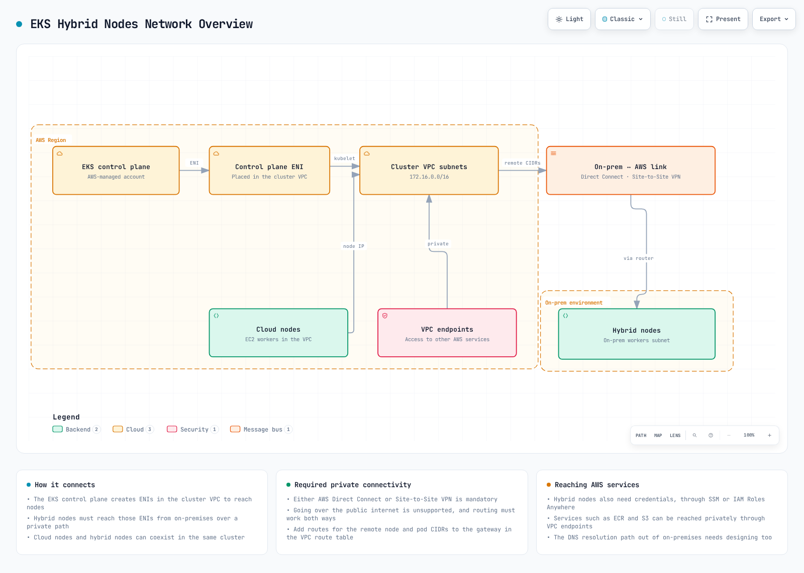
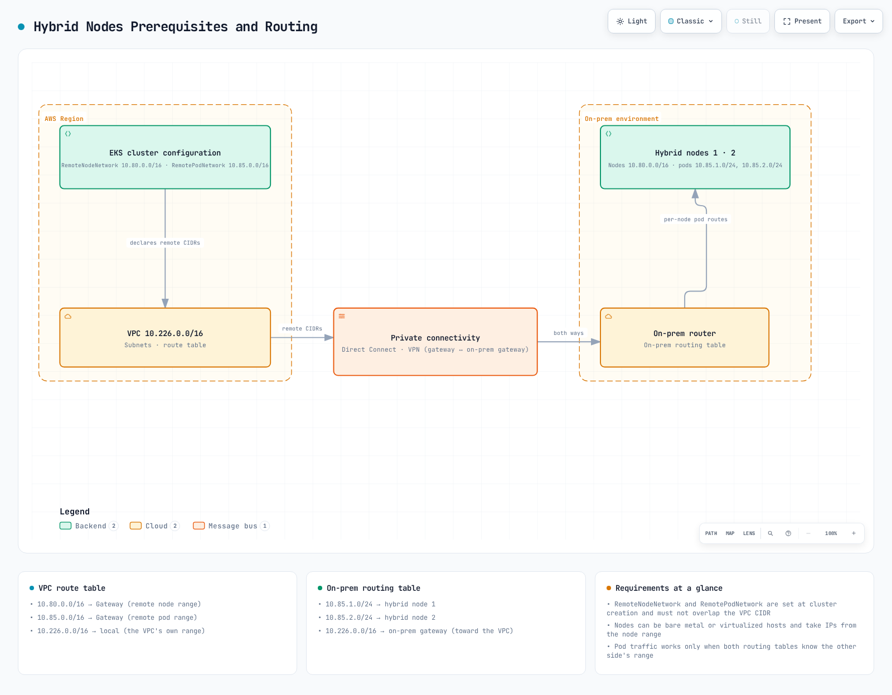

# Nodos híbridos de EKS

> **Versiones compatibles**: EKS 1.31+, nodeadm 0.1+ **Última actualización**: February 23, 2026

Amazon EKS Hybrid Nodes es una característica que permite administrar servidores on-premises desde el plano de control de AWS EKS. Esta guía cubre los conceptos, métodos de configuración y uso práctico de EKS Hybrid Nodes en entornos de producción.

## Tabla de contenido

1. [Requisitos previos y requisitos del sistema](01-prerequisites.md)
2. [Configuración de red](02-network-configuration.md)
3. [Configuración de entorno aislado (S3 + puntos de conexión de VPC)](03-airgap-setup.md)
4. [Bootstrap de nodos](04-node-bootstrap.md)
5. [Integración de servidores GPU](05-gpu-integration.md)
6. [Estrategias de colocación de cargas de trabajo](06-workload-placement.md)
7. [Administración del ciclo de vida de los nodos](07-node-lifecycle.md)
8. [Operaciones y mantenimiento](08-operations.md)
9. [Guía de instalación y migración del SO de servidores Bare Metal](09-bare-metal-os-setup.md)
10. [Gateway de Hybrid Nodes](10-hybrid-nodes-gateway.md)

## ¿Qué son los Hybrid Nodes?

EKS Hybrid Nodes es una característica que permite registrar servidores de su centro de datos on-premises o entorno de edge como nodos de Kubernetes administrados por el plano de control de AWS EKS. Esto permite administrar la infraestructura de cloud y on-premises como un único clúster de Kubernetes.



[🔍 Ver diagrama interactivo](https://www.atomai.click/kubernetes-docs/archmaps/en-eks-hybrid-nodes-highlevel-0.html)

El siguiente diagrama muestra los requisitos previos de red, incluidos VPC, subredes, Transit Gateway/Virtual Private Gateway y conectividad CIDR de Remote Node/Pod.



[🔍 Ver diagrama interactivo](https://www.atomai.click/kubernetes-docs/archmaps/en-eks-hybrid-nodes-prereq-0.html)

## ¿Por qué usar Hybrid Nodes?

### 1. Cumplimiento normativo y soberanía de datos

Ciertos sectores (finanzas, salud, gobierno) tienen normativas que requieren que los datos permanezcan dentro de regiones o instalaciones específicas. Con Hybrid Nodes, puede mantener datos confidenciales on-premises mientras aprovecha las capacidades de administración de EKS.

```yaml
# Example of regulatory compliance workload placement
apiVersion: v1
kind: Pod
metadata:
  name: financial-data-processor
spec:
  nodeSelector:
    topology.kubernetes.io/zone: "on-premises"
    compliance.company.io/data-sovereignty: "required"
  containers:
  - name: processor
    image: harbor.internal.company.io/finance/data-processor:v1.2.0
```

### 2. Gravedad de datos

Cuando existen grandes conjuntos de datos on-premises, es más eficiente acercar el cómputo a los datos que trasladarlos al cloud.

### 3. Aprovechamiento del hardware existente

Puede seguir utilizando servidores de alto rendimiento ya adquiridos (especialmente servidores GPU) mientras aplica una administración moderna de cargas de trabajo basada en Kubernetes.

### 4. Administración unificada

Administrar las cargas de trabajo de Kubernetes tanto en entornos de cloud como on-premises desde un único plano de control reduce la complejidad operativa.

## Componentes de la arquitectura

La arquitectura de EKS Hybrid Nodes consta de los siguientes componentes:

| Componente                       | Ubicación    | Función                                            |
| ------------------------------- | ----------- | ----------------------------------------------- |
| Plano de control de EKS               | AWS         | Servidor API, etcd, administrador de controladores, programador |
| nodeadm                         | On-Premises | Agente de bootstrap y administración de nodos             |
| kubelet                         | On-Premises | Ejecución de Pod e informe del estado de los nodos         |
| containerd                      | On-Premises | Runtime de contenedores                               |
| VPN/Direct Connect              | Red     | Conexión segura entre AWS y entornos on-premises   |
| SSM Agent o IAM Roles Anywhere | On-Premises | Administración de credenciales                           |

### Restricciones y limitaciones clave

* **Conectividad de red**: Requiere conectividad confiable entre entornos on-premises y AWS mediante VPN o Direct Connect (no es adecuado para entornos desconectados, intermitentes, limitados o denegados)
* **Límites de CIDR**: Hasta 15 CIDR para Remote Node Networks y Remote Pod Networks por clúster
* **Solo IPv4**: Debe usar la familia de direcciones IPv4 (IPv6 no es compatible con nodos híbridos)
* **Modo de autenticación**: El clúster debe usar el modo de autenticación `API` o `API_AND_CONFIG_MAP`
* **Acceso a endpoints**: Debe usar solo público O privado ("Público y privado" **no es compatible**; provoca errores al unir nodos híbridos)
* **Precios por vCPU**: Los nodos híbridos se cobran por hora y por vCPU (sin compromisos mínimos)
* **Infraestructura de cloud**: No es compatible con infraestructura de cloud (la ejecución en EC2 generará cargos por nodos híbridos)
* **VPC CNI**: Amazon VPC CNI no es compatible con nodos híbridos; use Cilium o Calico

### Opciones de proveedores de credenciales

EKS Hybrid Nodes admite dos proveedores de credenciales para autenticar nodos on-premises con AWS:

| Característica                  | SSM Hybrid Activations                                                           | IAM Roles Anywhere                                     |
| ------------------------ | -------------------------------------------------------------------------------- | ------------------------------------------------------ |
| **Complejidad de configuración**     | Simple — par de código/ID de activación                                                 | Moderada — requiere infraestructura PKI                 |
| **Certificado requerido** | No                                                                               | Sí (certificado X.509 por nodo)                       |
| **Compatible con entorno aislado**   | No (requiere acceso al endpoint de SSM)                                                | Sí (funciona con CA local)                              |
| **Rotación de credenciales**  | Automática (administrada por AWS, TTL fijo de 1 hora)                                        | Automática (basada en certificados, configurable entre 1 y 12 horas) |
| **Nomenclatura de nodos**          | Generada automáticamente (`mi-xxxx`, no personalizable)                                     | Personalizada (debe coincidir con el CN del certificado)                     |
| **Límites de escalado**       | 1.000 gratis por cuenta y región; nivel advanced-instances para más (costo adicional) | Sin límites                                              |
| **Dependencia de AWS**       | Servicio SSM                                                                      | Servicio IAM Roles Anywhere                             |
| **Mejor para**             | Entornos estándar con internet/VPN                                          | Entorno aislado, cumplimiento estricto, PKI existente               |

> **Recomendación**: Use SSM Hybrid Activations por su simplicidad en la mayoría de los entornos. Elija IAM Roles Anywhere cuando necesite compatibilidad con entornos aislados o ya cuente con infraestructura PKI.

## Casos de uso principales

1. **Cargas de trabajo de AI/ML**: Entrenamiento de modelos en servidores GPU on-premises, servicios de inferencia en el cloud
2. **Servicios financieros**: Procesamiento de datos de transacciones on-premises, analítica en el cloud
3. **Manufactura**: Cómputo de edge en fábricas integrado con el cloud central
4. **Procesamiento de medios**: Procesamiento de archivos multimedia grandes donde residen los datos

## Próximos pasos

Comience con los [Requisitos previos y requisitos del sistema](01-prerequisites.md) para asegurarse de que su entorno esté listo para EKS Hybrid Nodes.

## Cuestionario

Para evaluar su comprensión de EKS Hybrid Nodes, intente responder el siguiente cuestionario:

* [Cuestionario de EKS Hybrid Nodes](https://github.com/Atom-oh/kubernetes-docs/blob/main/en/quizzes/eks-hybrid-nodes/README.md)

## Documentos relacionados

* [Guía de resiliencia de EKS](../eks/10-eks-resiliency.md) - Configuración de alta disponibilidad en entornos híbridos
* [Optimización de costos de EKS](../eks/07-eks-cost-optimization.md) - Estrategias de administración de costos
* [Monitoreo y registro de EKS](../eks/06-eks-monitoring-logging.md) - Configuración de monitoreo integrado

## Documentación oficial

* [Documentación oficial de AWS EKS Hybrid Nodes](https://docs.aws.amazon.com/eks/latest/userguide/hybrid-nodes-overview.html)
* [Guía del usuario de nodeadm](https://docs.aws.amazon.com/eks/latest/userguide/hybrid-nodes-nodeadm.html)
* [Documentación oficial de Harbor](https://goharbor.io/docs/)
* [Documentación de NVIDIA GPU Operator](https://docs.nvidia.com/datacenter/cloud-native/gpu-operator/overview.html)
* [Guía de redes de Hybrid Nodes](https://docs.aws.amazon.com/eks/latest/userguide/hybrid-nodes-networking.html)
* [Configuración de CNI de Hybrid Nodes](https://docs.aws.amazon.com/eks/latest/userguide/hybrid-nodes-cni.html)
* [Solución de problemas de Hybrid Nodes](https://docs.aws.amazon.com/eks/latest/userguide/hybrid-nodes-troubleshooting.html)
