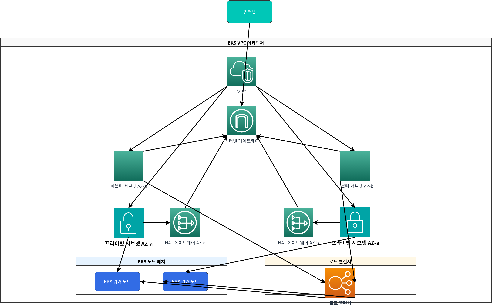

# Parte 1: Requisitos previos

Hay varias formas de crear un Amazon EKS cluster. En este capítulo, aprenderemos cómo crear un EKS cluster usando varias herramientas y métodos.

## Tabla de contenidos

1. [Requisitos previos](02-eks-cluster-creation-part1.md#prerequisites)
2. [Crear un cluster usando eksctl](02-eks-cluster-creation-part1.md#creating-a-cluster-using-eksctl)
3. [Crear un cluster usando AWS Management Console](02-eks-cluster-creation-part1.md#creating-a-cluster-using-aws-management-console)
4. [Crear un cluster usando AWS CLI](02-eks-cluster-creation-part1.md#creating-a-cluster-using-aws-cli)
5. [Crear un cluster usando Terraform](02-eks-cluster-creation-part1.md#creating-a-cluster-using-terraform)

## Requisitos previos

Antes de crear un EKS cluster, se requieren los siguientes requisitos previos:

### 1. AWS Account

Se requiere una AWS account válida. Si no tienes una AWS account, puedes registrarte en el [sitio web de AWS](https://aws.amazon.com/).

### 2. IAM Permissions

Se requieren los siguientes IAM permissions para crear y administrar un EKS cluster:

* `eks:*`
* `ec2:*`
* `iam:*`
* `cloudformation:*`

Si tienes administrator permissions, no se requieren configuraciones de permisos adicionales. De lo contrario, necesitas adjuntar la siguiente IAM policy al user o role:

```json
{
  "Version": "2012-10-17",
  "Statement": [
    {
      "Effect": "Allow",
      "Action": [
        "eks:*",
        "ec2:*",
        "iam:*",
        "cloudformation:*"
      ],
      "Resource": "*"
    }
  ]
}
```

### 3. Instalación de herramientas

Las siguientes herramientas deben estar instaladas para crear y administrar un EKS cluster:

#### AWS CLI

AWS CLI es una herramienta unificada para controlar los AWS services desde la línea de comandos.

**macOS**:

```bash
curl "https://awscli.amazonaws.com/AWSCLIV2.pkg" -o "AWSCLIV2.pkg"
sudo installer -pkg AWSCLIV2.pkg -target /
```

**Linux**:

```bash
curl "https://awscli.amazonaws.com/awscli-exe-linux-x86_64.zip" -o "awscliv2.zip"
unzip awscliv2.zip
sudo ./aws/install
```

**Windows**:

```
https://awscli.amazonaws.com/AWSCLIV2.msi
```

Después de instalar AWS CLI, ejecuta el siguiente comando para configurar las credenciales:

```bash
aws configure
```

#### kubectl

kubectl es una herramienta de línea de comandos para comunicarse con Kubernetes clusters.

**macOS**:

```bash
curl -LO "https://dl.k8s.io/release/$(curl -L -s https://dl.k8s.io/release/stable.txt)/bin/darwin/amd64/kubectl"
chmod +x ./kubectl
sudo mv ./kubectl /usr/local/bin/kubectl
```

**Linux**:

```bash
curl -LO "https://dl.k8s.io/release/$(curl -L -s https://dl.k8s.io/release/stable.txt)/bin/linux/amd64/kubectl"
chmod +x ./kubectl
sudo mv ./kubectl /usr/local/bin/kubectl
```

**Windows**:

```bash
curl -LO "https://dl.k8s.io/release/v1.26.0/bin/windows/amd64/kubectl.exe"
```

#### eksctl

eksctl es una sencilla herramienta CLI para crear y administrar EKS clusters.

**macOS**:

```bash
brew tap weaveworks/tap
brew install weaveworks/tap/eksctl
```

O:

```bash
curl --silent --location "https://github.com/weaveworks/eksctl/releases/latest/download/eksctl_$(uname -s)_amd64.tar.gz" | tar xz -C /tmp
sudo mv /tmp/eksctl /usr/local/bin
```

**Linux**:

```bash
curl --silent --location "https://github.com/weaveworks/eksctl/releases/latest/download/eksctl_$(uname -s)_amd64.tar.gz" | tar xz -C /tmp
sudo mv /tmp/eksctl /usr/local/bin
```

**Windows**:

```bash
# PowerShell
$version = (Invoke-WebRequest -Uri "https://api.github.com/repos/weaveworks/eksctl/releases/latest" | ConvertFrom-Json).tag_name
Invoke-WebRequest -Uri "https://github.com/weaveworks/eksctl/releases/download/$version/eksctl_Windows_amd64.zip" -OutFile eksctl.zip
Expand-Archive -Path eksctl.zip -DestinationPath $env:USERPROFILE\.eksctl\bin
$env:PATH += ";$env:USERPROFILE\.eksctl\bin"
```

### 4. VPC y subnets

Un EKS cluster requiere una VPC y subnets (subredes). Puedes usar una VPC existente o crear una nueva. La VPC para un EKS cluster debe cumplir los siguientes requisitos:



* Al menos 2 subnets deben estar en diferentes Availability Zones.
* Las subnets deben tener acceso a internet (a través de un NAT gateway o internet gateway).
* Las subnets deben tener suficientes direcciones IP.
* Las subnets deben tener tags adecuados.

#### VPC Tags para EKS Cluster

Los siguientes tags (etiquetas) deben aplicarse para permitir que el EKS cluster use correctamente la VPC y las subnets:

**VPC Tags**:

* `kubernetes.io/cluster/<cluster-name>`: `shared` o `owned`

**Public Subnet Tags**:

* `kubernetes.io/cluster/<cluster-name>`: `shared` o `owned`
* `kubernetes.io/role/elb`: `1`

**Private Subnet Tags**:

* `kubernetes.io/cluster/<cluster-name>`: `shared` o `owned`
* `kubernetes.io/role/internal-elb`: `1`

## Cuestionario

Para comprobar lo que aprendiste en este capítulo, intenta resolver el [cuestionario Creación de EKS Cluster - Parte 1](../quizzes/eks/02-eks-cluster-creation-part1-quiz.md).
