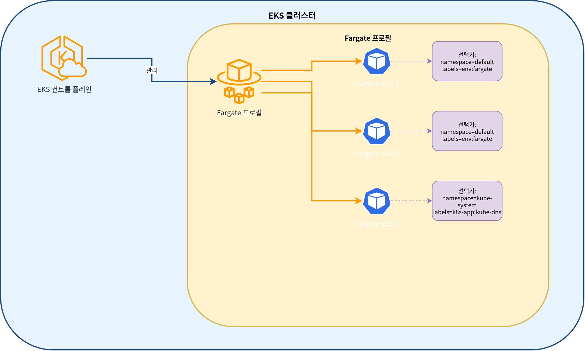

# Parte 2: Creación de clusters con eksctl

## Creación de un cluster usando eksctl

eksctl es la forma más sencilla de crear y administrar clusters EKS. eksctl usa CloudFormation para crear clusters EKS y recursos relacionados.

El siguiente diagrama muestra el proceso de creación de un cluster EKS usando eksctl:


### Creación básica de un cluster

Para crear la forma más básica de un cluster EKS, ejecuta el siguiente comando:

```bash
eksctl create cluster --name my-cluster --region us-west-2
```

Este comando crea un cluster con la siguiente configuración predeterminada:

* 2 Nodes m5.large
* Nueva VPC y subnets
* AMI predeterminada de Amazon Linux 2
* Última versión de Kubernetes

### Creación de un cluster usando un archivo de configuración

Para configuraciones más complejas, puedes definir el cluster usando un archivo YAML:

```yaml
# cluster.yaml
apiVersion: eksctl.io/v1alpha5
kind: ClusterConfig

metadata:
  name: my-eks-cluster
  region: us-west-2
  version: "1.26"

vpc:
  id: vpc-12345678
  subnets:
    private:
      us-west-2a:
        id: subnet-12345678
      us-west-2b:
        id: subnet-87654321
    public:
      us-west-2a:
        id: subnet-23456789
      us-west-2b:
        id: subnet-98765432

managedNodeGroups:
  - name: ng-1
    instanceType: m5.large
    desiredCapacity: 2
    minSize: 1
    maxSize: 3
    privateNetworking: true
    volumeSize: 80
    volumeType: gp3
    iam:
      withAddonPolicies:
        imageBuilder: true
        autoScaler: true
        externalDNS: true
        certManager: true
        appMesh: true
        ebs: true
        fsx: true
        efs: true
        albIngress: true
        xRay: true
        cloudWatch: true

  - name: ng-2
    instanceType: c5.xlarge
    desiredCapacity: 2
    privateNetworking: true
    spot: true

fargate:
  profiles:
    - name: fp-default
      selectors:
        - namespace: default
          labels:
            env: fargate
    - name: fp-kube-system
      selectors:
        - namespace: kube-system
          labels:
            k8s-app: kube-dns

cloudWatch:
  clusterLogging:
    enableTypes: ["api", "audit", "authenticator", "controllerManager", "scheduler"]
```

Para crear un cluster usando este archivo de configuración, ejecuta el siguiente comando:

```bash
eksctl create cluster -f cluster.yaml
```

### Creación de Managed Node Groups

El siguiente diagrama muestra la arquitectura de Managed Node Group para un cluster EKS:


Para agregar un Managed Node Group a un cluster existente, ejecuta el siguiente comando:

```bash
eksctl create nodegroup \
  --cluster my-cluster \
  --region us-west-2 \
  --name my-nodegroup \
  --node-type m5.large \
  --nodes 3 \
  --nodes-min 1 \
  --nodes-max 5 \
  --ssh-access \
  --ssh-public-key my-key
```

O puedes usar un archivo de configuración:

```yaml
# nodegroup.yaml
apiVersion: eksctl.io/v1alpha5
kind: ClusterConfig

metadata:
  name: my-cluster
  region: us-west-2

managedNodeGroups:
  - name: my-nodegroup
    instanceType: m5.large
    desiredCapacity: 3
    minSize: 1
    maxSize: 5
    volumeSize: 80
    volumeType: gp3
    ssh:
      allow: true
      publicKeyName: my-key
```

```bash
eksctl create nodegroup -f nodegroup.yaml
```

### Creación de Fargate Profiles

El siguiente diagrama muestra la arquitectura de EKS Fargate Profile:



Para crear un Fargate Profile, ejecuta el siguiente comando:

```bash
eksctl create fargateprofile \
  --cluster my-cluster \
  --region us-west-2 \
  --name my-fargate-profile \
  --namespace default \
  --labels env=fargate
```

O puedes usar un archivo de configuración:

```yaml
# fargate.yaml
apiVersion: eksctl.io/v1alpha5
kind: ClusterConfig

metadata:
  name: my-cluster
  region: us-west-2

fargate:
  profiles:
    - name: my-fargate-profile
      selectors:
        - namespace: default
          labels:
            env: fargate
```

```bash
eksctl create fargateprofile -f fargate.yaml
```

### Actualización de un cluster

Puedes actualizar un cluster existente usando eksctl:

```bash
# Upgrade cluster version
eksctl upgrade cluster --name=my-cluster --version=1.27

# Upgrade node group
eksctl upgrade nodegroup --cluster=my-cluster --name=my-nodegroup
```

### Eliminación de un cluster

Puedes eliminar un cluster usando eksctl:

```bash
eksctl delete cluster --name=my-cluster --region=us-west-2
```

## Administración del ciclo de vida de un cluster EKS

El siguiente diagrama muestra el proceso general de administración del ciclo de vida para un cluster EKS:


## Cuestionario

Para comprobar lo que aprendiste en este capítulo, intenta el [Cuestionario de creación de clusters EKS - Parte 2](../quizzes/eks/02-eks-cluster-creation-part2-quiz.md).
