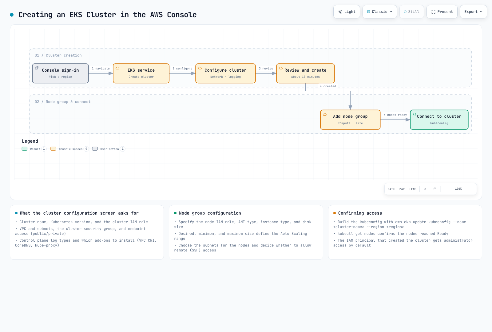

# Parte 3: Creación de clústeres con AWS Management Console y CLI

## Creación de un clúster mediante AWS Management Console

Los pasos para crear un clúster de EKS mediante AWS Management Console son los siguientes:



[🔍 Ver diagrama interactivo](https://www.atomai.click/kubernetes-docs/archmaps/en-eks-02-eks-cluster-creation-part3-0.html)

1. Inicie sesión en [AWS Management Console](https://console.aws.amazon.com/).
2. Busque "EKS" o seleccione "Elastic Kubernetes Service" en la lista de servicios.
3. En la página "Clusters", haga clic en el botón "Create cluster".

### Configuración del clúster

4. En la página "Configure cluster", introduzca la siguiente información:
   * **Nombre del clúster**: Introduzca un nombre único para el clúster.
   * **Versión de Kubernetes**: Seleccione la versión de Kubernetes que desea utilizar.
   * **Rol de servicio del clúster**: Cree un rol nuevo o seleccione un rol existente.
   * **Etiquetas**: Añada etiquetas si es necesario.
   * Haga clic en el botón "Next".

### Especificar la red

5. En la página "Specify networking", introduzca la siguiente información:
   * **VPC**: Cree una VPC nueva o seleccione una VPC existente.
   * **Subredes**: Seleccione las subredes que desea utilizar para el clúster. Al menos 2 subredes deben estar en diferentes zonas de disponibilidad.
   * **Grupos de seguridad**: Seleccione los grupos de seguridad que desea utilizar para el clúster.
   * **Acceso al endpoint del clúster**: Configure el acceso al endpoint del servidor de API del clúster.
     * **Público**: Se puede acceder al servidor de API desde Internet.
     * **Privado**: Solo se puede acceder al servidor de API desde la VPC.
     * **Público y privado**: Se puede acceder al servidor de API tanto desde Internet como desde la VPC.
   * Haga clic en el botón "Next".

### Configurar el registro

6. En la página "Configure logging", introduzca la siguiente información:
   * **Registro del plano de control**: Seleccione los tipos de registros que desea habilitar.
     * Registros del servidor de API
     * Registros de auditoría
     * Registros del autenticador
     * Registros del administrador de controladores
     * Registros del programador
   * Haga clic en el botón "Next".

### Seleccionar complementos

7. En la página "Select add-ons", introduzca la siguiente información:
   * **Amazon VPC CNI**: Plugin de CNI para redes de Pod.
   * **CoreDNS**: Servicio DNS dentro del clúster.
   * **kube-proxy**: Proporciona proxy de red y balanceo de carga.
   * Haga clic en el botón "Next".

### Revisar y crear

8. En la página "Review and create", revise la configuración y haga clic en el botón "Create".

Una vez finalizada la creación del clúster, puede hacer clic en el botón "Add node group" para añadir un grupo de nodos.

### Añadir grupo de nodos

1. En la página "Node group configuration", introduzca la siguiente información:
   * **Nombre del grupo de nodos**: Introduzca un nombre único para el grupo de nodos.
   * **Rol de IAM del nodo**: Cree un rol nuevo o seleccione un rol existente.
   * Haga clic en el botón "Next".
2. En la página "Set compute and scaling configuration", introduzca la siguiente información:
   * **Tipo de AMI**: Seleccione el tipo de AMI que desea utilizar para los nodos.
   * **Tipo de instancia**: Seleccione el tipo de instancia EC2 que desea utilizar para los nodos.
   * **Tamaño del disco**: Especifique el tamaño del disco para los nodos.
   * **Número de nodos**: Especifique el número mínimo, máximo y deseado de nodos.
   * Haga clic en el botón "Next".
3. En la página "Specify networking", introduzca la siguiente información:
   * **Subredes**: Seleccione las subredes que desea utilizar para el grupo de nodos.
   * **Configuración de acceso remoto**: Configure el acceso SSH.
   * Haga clic en el botón "Next".
4. En la página "Review and create", revise la configuración y haga clic en el botón "Create".

## Creación de un clúster mediante AWS CLI

El proceso de creación de un clúster de EKS mediante AWS CLI consta de varios pasos. Este método es útil cuando se necesita más control.


[🔍 Ver diagrama interactivo](https://www.atomai.click/kubernetes-docs/archmaps/en-eks-02-eks-cluster-creation-part3-1.html)

### 1. Crear rol de IAM para el clúster

Un clúster de EKS requiere un rol de IAM que permita al plano de control de Kubernetes administrar recursos de AWS.

```bash
# Create role
aws iam create-role \
  --role-name EKSClusterRole \
  --assume-role-policy-document '{
    "Version": "2012-10-17",
    "Statement": [
      {
        "Effect": "Allow",
        "Principal": {
          "Service": "eks.amazonaws.com"
        },
        "Action": "sts:AssumeRole"
      }
    ]
  }'

# Attach required policy
aws iam attach-role-policy \
  --role-name EKSClusterRole \
  --policy-arn arn:aws:iam::aws:policy/AmazonEKSClusterPolicy
```

### 2. Crear VPC y subredes

Un clúster de EKS requiere una VPC y subredes. Puede utilizar una VPC existente o crear una nueva.

```bash
# Create VPC
aws ec2 create-vpc \
  --cidr-block 10.0.0.0/16 \
  --tag-specifications 'ResourceType=vpc,Tags=[{Key=Name,Value=EKS-VPC}]' \
  --query Vpc.VpcId \
  --output text

# Create subnets
aws ec2 create-subnet \
  --vpc-id vpc-xxxxxxxxxxxxxxxxx \
  --cidr-block 10.0.1.0/24 \
  --availability-zone us-west-2a \
  --tag-specifications 'ResourceType=subnet,Tags=[{Key=Name,Value=EKS-Subnet-1}]' \
  --query Subnet.SubnetId \
  --output text

aws ec2 create-subnet \
  --vpc-id vpc-xxxxxxxxxxxxxxxxx \
  --cidr-block 10.0.2.0/24 \
  --availability-zone us-west-2b \
  --tag-specifications 'ResourceType=subnet,Tags=[{Key=Name,Value=EKS-Subnet-2}]' \
  --query Subnet.SubnetId \
  --output text
```

### 3. Crear grupo de seguridad del clúster

Un clúster de EKS requiere un grupo de seguridad.

```bash
# Create security group
aws ec2 create-security-group \
  --group-name EKS-Cluster-SG \
  --description "Security group for EKS cluster" \
  --vpc-id vpc-xxxxxxxxxxxxxxxxx \
  --query GroupId \
  --output text

# Add inbound rule
aws ec2 authorize-security-group-ingress \
  --group-id sg-xxxxxxxxxxxxxxxxx \
  --protocol tcp \
  --port 443 \
  --cidr 0.0.0.0/0
```

### 4. Crear clúster de EKS

Ahora puede crear el clúster de EKS.

```bash
aws eks create-cluster \
  --name my-cluster \
  --role-arn arn:aws:iam::123456789012:role/EKSClusterRole \
  --resources-vpc-config subnetIds=subnet-xxxxxxxxxxxxxxxxx,subnet-yyyyyyyyyyyyyyyyy,securityGroupIds=sg-zzzzzzzzzzzzzzzzz \
  --kubernetes-version 1.26
```

Espere a que finalice la creación del clúster. Para comprobar el estado del clúster, ejecute el siguiente comando:

```bash
aws eks describe-cluster \
  --name my-cluster \
  --query "cluster.status"
```

### 5. Crear rol de IAM para el nodo

Los nodos de EKS requieren un rol de IAM para acceder a los recursos de AWS.

```bash
# Create role
aws iam create-role \
  --role-name EKSNodeRole \
  --assume-role-policy-document '{
    "Version": "2012-10-17",
    "Statement": [
      {
        "Effect": "Allow",
        "Principal": {
          "Service": "ec2.amazonaws.com"
        },
        "Action": "sts:AssumeRole"
      }
    ]
  }'

# Attach required policies
aws iam attach-role-policy \
  --role-name EKSNodeRole \
  --policy-arn arn:aws:iam::aws:policy/AmazonEKSWorkerNodePolicy

aws iam attach-role-policy \
  --role-name EKSNodeRole \
  --policy-arn arn:aws:iam::aws:policy/AmazonEKS_CNI_Policy

aws iam attach-role-policy \
  --role-name EKSNodeRole \
  --policy-arn arn:aws:iam::aws:policy/AmazonEC2ContainerRegistryReadOnly
```

### 6. Crear grupo de nodos

Ahora puede crear el grupo de nodos.

```bash
aws eks create-nodegroup \
  --cluster-name my-cluster \
  --nodegroup-name my-nodegroup \
  --node-role arn:aws:iam::123456789012:role/EKSNodeRole \
  --subnets subnet-xxxxxxxxxxxxxxxxx subnet-yyyyyyyyyyyyyyyyy \
  --disk-size 80 \
  --scaling-config minSize=1,maxSize=3,desiredSize=2 \
  --instance-types m5.large
```

Espere a que finalice la creación del grupo de nodos. Para comprobar el estado del grupo de nodos, ejecute el siguiente comando:

```bash
aws eks describe-nodegroup \
  --cluster-name my-cluster \
  --nodegroup-name my-nodegroup \
  --query "nodegroup.status"
```

### 7. Configurar kubeconfig

Debe configurar el archivo kubeconfig para acceder al clúster.

```bash
aws eks update-kubeconfig \
  --name my-cluster \
  --region us-west-2
```

### 8. Verificar el clúster

Verifique que el clúster esté configurado correctamente.

```bash
kubectl get nodes
```

## Cuestionario

Para comprobar lo que ha aprendido en este capítulo, pruebe el [Cuestionario sobre la creación de clústeres de EKS - Parte 3](../quizzes/eks/02-eks-cluster-creation-part3-quiz.md).
