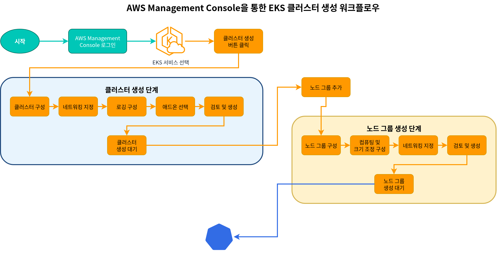
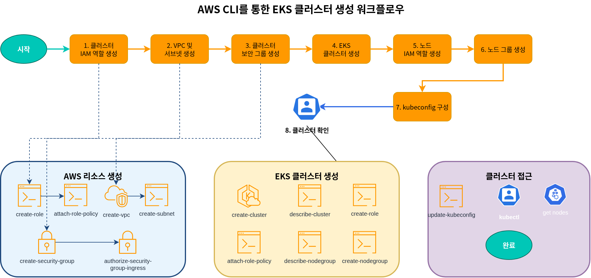

# Parte 3: Creación de clusters con AWS Management Console y CLI

## Creación de un cluster usando AWS Management Console

Los pasos para crear un EKS cluster usando AWS Management Console son los siguientes:



1. Inicia sesión en [AWS Management Console](https://console.aws.amazon.com/).
2. Busca "EKS" o selecciona "Elastic Kubernetes Service" en la lista de servicios.
3. En la página "Clusters", haz clic en el botón "Crear cluster".

### Configuración del cluster

4. En la página "Configurar cluster", ingresa la siguiente información:
   * **Nombre del cluster**: Ingresa un nombre único para el cluster.
   * **Versión de Kubernetes**: Selecciona la versión de Kubernetes que se usará.
   * **Rol de servicio del cluster**: Crea un rol nuevo o selecciona un rol existente.
   * **Tags**: Agrega tags si es necesario.
   * Haz clic en el botón "Siguiente".

### Especificar networking

5. En la página "Especificar networking", ingresa la siguiente información:
   * **VPC**: Crea una VPC nueva o selecciona una VPC existente.
   * **Subnets**: Selecciona las subnets que se usarán para el cluster. Al menos 2 subnets deben estar en diferentes Availability Zones.
   * **Security groups**: Selecciona los security groups que se usarán para el cluster.
   * **Acceso al endpoint del cluster**: Configura el acceso al endpoint del API server del cluster.
     * **Public**: Se puede acceder al API server desde internet.
     * **Private**: Solo se puede acceder al API server desde dentro de la VPC.
     * **Public and Private**: Se puede acceder al API server tanto desde internet como desde dentro de la VPC.
   * Haz clic en el botón "Siguiente".

### Configurar logging

6. En la página "Configurar logging", ingresa la siguiente información:
   * **Logging del control plane**: Selecciona los tipos de logs que se habilitarán.
     * Logs del API server
     * Audit logs
     * Authenticator logs
     * Controller manager logs
     * Scheduler logs
   * Haz clic en el botón "Siguiente".

### Seleccionar add-ons

7. En la página "Seleccionar add-ons", ingresa la siguiente información:
   * **Amazon VPC CNI**: Plugin CNI para networking de Pod.
   * **CoreDNS**: Servicio DNS dentro del cluster.
   * **kube-proxy**: Proporciona proxy de red y balanceo de carga.
   * Haz clic en el botón "Siguiente".

### Revisar y crear

8. En la página "Revisar y crear", revisa la configuración y haz clic en el botón "Crear".

Una vez que se complete la creación del cluster, puedes hacer clic en el botón "Agregar node group" para agregar un node group.

### Agregar Node Group

1. En la página "Configuración de node group", ingresa la siguiente información:
   * **Nombre del node group**: Ingresa un nombre único para el node group.
   * **Rol IAM del Node**: Crea un rol nuevo o selecciona un rol existente.
   * Haz clic en el botón "Siguiente".
2. En la página "Establecer configuración de compute y scaling", ingresa la siguiente información:
   * **Tipo de AMI**: Selecciona el tipo de AMI que se usará para los nodes.
   * **Tipo de instance**: Selecciona el tipo de EC2 instance que se usará para los nodes.
   * **Tamaño de disco**: Especifica el tamaño de disco para los nodes.
   * **Cantidad de nodes**: Especifica el número mínimo, máximo y deseado de nodes.
   * Haz clic en el botón "Siguiente".
3. En la página "Especificar networking", ingresa la siguiente información:
   * **Subnets**: Selecciona las subnets que se usarán para el node group.
   * **Configuración de acceso remoto**: Configura el acceso SSH.
   * Haz clic en el botón "Siguiente".
4. En la página "Revisar y crear", revisa la configuración y haz clic en el botón "Crear".

## Creación de un cluster usando AWS CLI

El proceso de creación de un EKS cluster usando AWS CLI consta de varios pasos. Este método es útil cuando se necesita más control.



### 1. Crear rol IAM del cluster

Un EKS cluster requiere un rol IAM que permita al Kubernetes control plane administrar recursos de AWS.

```bash
# Create role
aws iam create-role \
  --role-name EKSClusterRole \
  --assume-role-policy-document '{
    "Version": "2012-10-17",
    "Statement": [
      {
        "Effect": "Allow",
        "Principal": {
          "Service": "eks.amazonaws.com"
        },
        "Action": "sts:AssumeRole"
      }
    ]
  }'

# Attach required policy
aws iam attach-role-policy \
  --role-name EKSClusterRole \
  --policy-arn arn:aws:iam::aws:policy/AmazonEKSClusterPolicy
```

### 2. Crear VPC y subnets

Un EKS cluster requiere una VPC y subnets. Puedes usar una VPC existente o crear una nueva.

```bash
# Create VPC
aws ec2 create-vpc \
  --cidr-block 10.0.0.0/16 \
  --tag-specifications 'ResourceType=vpc,Tags=[{Key=Name,Value=EKS-VPC}]' \
  --query Vpc.VpcId \
  --output text

# Create subnets
aws ec2 create-subnet \
  --vpc-id vpc-xxxxxxxxxxxxxxxxx \
  --cidr-block 10.0.1.0/24 \
  --availability-zone us-west-2a \
  --tag-specifications 'ResourceType=subnet,Tags=[{Key=Name,Value=EKS-Subnet-1}]' \
  --query Subnet.SubnetId \
  --output text

aws ec2 create-subnet \
  --vpc-id vpc-xxxxxxxxxxxxxxxxx \
  --cidr-block 10.0.2.0/24 \
  --availability-zone us-west-2b \
  --tag-specifications 'ResourceType=subnet,Tags=[{Key=Name,Value=EKS-Subnet-2}]' \
  --query Subnet.SubnetId \
  --output text
```

### 3. Crear security group del cluster

Un EKS cluster requiere un security group.

```bash
# Create security group
aws ec2 create-security-group \
  --group-name EKS-Cluster-SG \
  --description "Security group for EKS cluster" \
  --vpc-id vpc-xxxxxxxxxxxxxxxxx \
  --query GroupId \
  --output text

# Add inbound rule
aws ec2 authorize-security-group-ingress \
  --group-id sg-xxxxxxxxxxxxxxxxx \
  --protocol tcp \
  --port 443 \
  --cidr 0.0.0.0/0
```

### 4. Crear EKS Cluster

Ahora puedes crear el EKS cluster.

```bash
aws eks create-cluster \
  --name my-cluster \
  --role-arn arn:aws:iam::123456789012:role/EKSClusterRole \
  --resources-vpc-config subnetIds=subnet-xxxxxxxxxxxxxxxxx,subnet-yyyyyyyyyyyyyyyyy,securityGroupIds=sg-zzzzzzzzzzzzzzzzz \
  --kubernetes-version 1.26
```

Espera a que se complete la creación del cluster. Para verificar el estado del cluster, ejecuta el siguiente comando:

```bash
aws eks describe-cluster \
  --name my-cluster \
  --query "cluster.status"
```

### 5. Crear rol IAM del Node

Los EKS nodes requieren un rol IAM para acceder a recursos de AWS.

```bash
# Create role
aws iam create-role \
  --role-name EKSNodeRole \
  --assume-role-policy-document '{
    "Version": "2012-10-17",
    "Statement": [
      {
        "Effect": "Allow",
        "Principal": {
          "Service": "ec2.amazonaws.com"
        },
        "Action": "sts:AssumeRole"
      }
    ]
  }'

# Attach required policies
aws iam attach-role-policy \
  --role-name EKSNodeRole \
  --policy-arn arn:aws:iam::aws:policy/AmazonEKSWorkerNodePolicy

aws iam attach-role-policy \
  --role-name EKSNodeRole \
  --policy-arn arn:aws:iam::aws:policy/AmazonEKS_CNI_Policy

aws iam attach-role-policy \
  --role-name EKSNodeRole \
  --policy-arn arn:aws:iam::aws:policy/AmazonEC2ContainerRegistryReadOnly
```

### 6. Crear Node Group

Ahora puedes crear el node group.

```bash
aws eks create-nodegroup \
  --cluster-name my-cluster \
  --nodegroup-name my-nodegroup \
  --node-role arn:aws:iam::123456789012:role/EKSNodeRole \
  --subnets subnet-xxxxxxxxxxxxxxxxx subnet-yyyyyyyyyyyyyyyyy \
  --disk-size 80 \
  --scaling-config minSize=1,maxSize=3,desiredSize=2 \
  --instance-types m5.large
```

Espera a que se complete la creación del node group. Para verificar el estado del node group, ejecuta el siguiente comando:

```bash
aws eks describe-nodegroup \
  --cluster-name my-cluster \
  --nodegroup-name my-nodegroup \
  --query "nodegroup.status"
```

### 7. Configurar kubeconfig

Debes configurar el archivo kubeconfig para acceder al cluster.

```bash
aws eks update-kubeconfig \
  --name my-cluster \
  --region us-west-2
```

### 8. Verificar cluster

Verifica que el cluster esté configurado correctamente.

```bash
kubectl get nodes
```

## Cuestionario

Para comprobar lo que aprendiste en este capítulo, intenta resolver el [cuestionario Creación de EKS Cluster - Parte 3](../quizzes/eks/02-eks-cluster-creation-part3-quiz.md).
