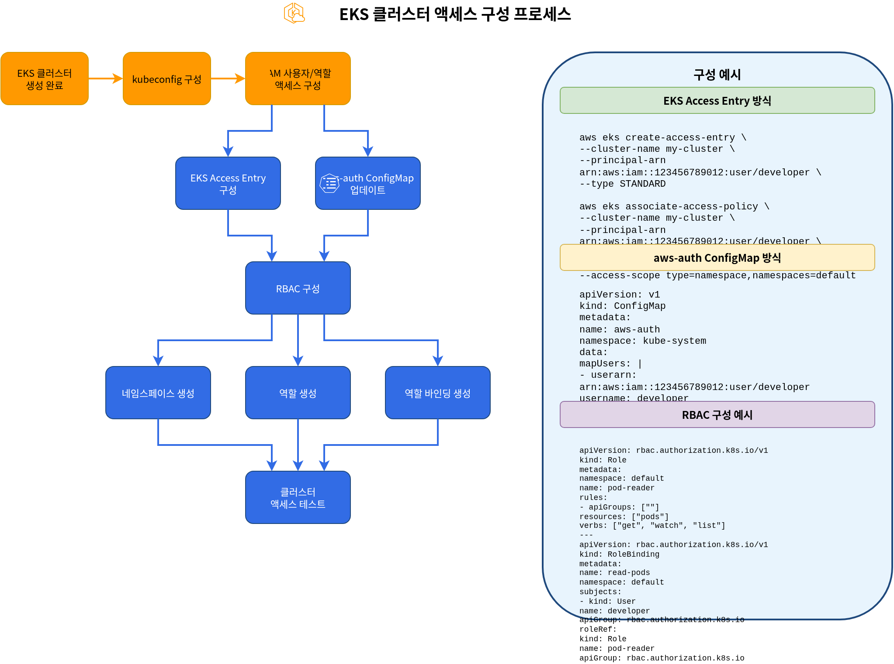
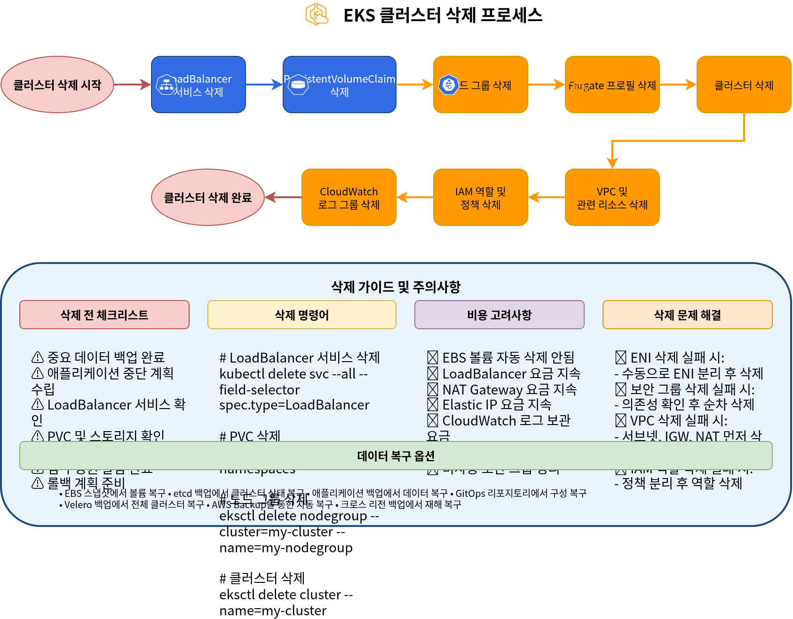

# Parte 5: Acceso, validación, actualización y eliminación del clúster

## Configuración del acceso al clúster

Después de crear un clúster de EKS, se requiere configuración para acceder al clúster. En esta sección, aprenderemos cómo configurar el acceso al clúster.

### Proceso de configuración del acceso al clúster



### Configuración de kubeconfig

Necesitas configurar el archivo kubeconfig para acceder a un clúster de EKS. Puedes configurar kubeconfig usando AWS CLI:

```bash
aws eks update-kubeconfig \
  --name my-cluster \
  --region us-west-2
```

Este comando actualiza el archivo `~/.kube/config` para habilitar el acceso al clúster de EKS.

### Configuración del acceso para IAM User y Role

De forma predeterminada, solo la entidad IAM (user o role) que creó el clúster de EKS puede acceder al clúster. Hay dos métodos para conceder acceso al clúster a otros IAM users o roles: el método tradicional con aws-auth ConfigMap y el nuevo método EKS Access Entry.


#### Método 1: EKS Access Entry (recomendado)

EKS Access Entry es un nuevo método que reemplaza el aws-auth ConfigMap y proporciona un enfoque más estable y fácil de administrar.

1. Habilita Access Entry para el clúster:

```bash
aws eks update-cluster-config \
  --name my-cluster \
  --region us-west-2 \
  --access-config authenticationMode=API_AND_CONFIG_MAP
```

2. Crea Access Entry para un IAM role:

```bash
aws eks create-access-entry \
  --cluster-name my-cluster \
  --principal-arn arn:aws:iam::123456789012:role/MyRole \
  --username my-role \
  --kubernetes-groups system:masters
```

3. Crea Access Entry para un IAM user:

```bash
aws eks create-access-entry \
  --cluster-name my-cluster \
  --principal-arn arn:aws:iam::123456789012:user/my-user \
  --username my-user \
  --kubernetes-groups system:masters
```

4. Lista los Access Entries:

```bash
aws eks list-access-entries --cluster-name my-cluster
```

5. Describe los detalles de Access Entry:

```bash
aws eks describe-access-entry \
  --cluster-name my-cluster \
  --principal-arn arn:aws:iam::123456789012:user/my-user
```

#### Método 2: aws-auth ConfigMap (heredado)

El aws-auth ConfigMap es el método tradicional y aún es compatible, pero se recomienda usar Access Entry para clústeres nuevos.

1. Obtén el ConfigMap `aws-auth` actual:

```bash
kubectl get configmap aws-auth -n kube-system -o yaml > aws-auth.yaml
```

2. Edita el archivo `aws-auth.yaml` para agregar users o roles:

```yaml
apiVersion: v1
kind: ConfigMap
metadata:
  name: aws-auth
  namespace: kube-system
data:
  mapRoles: |
    - rolearn: arn:aws:iam::123456789012:role/EKSNodeRole
      username: system:node:{{EC2PrivateDNSName}}
      groups:
        - system:bootstrappers
        - system:nodes
    # Additional role
    - rolearn: arn:aws:iam::123456789012:role/MyRole
      username: my-role
      groups:
        - system:masters
  mapUsers: |
    # IAM user
    - userarn: arn:aws:iam::123456789012:user/my-user
      username: my-user
      groups:
        - system:masters
```

3. Aplica el ConfigMap actualizado:

```bash
kubectl apply -f aws-auth.yaml
```

> **Nota**: EKS Access Entry se introdujo en 2023, y se recomienda usar Access Entry para clústeres nuevos. Los clústeres existentes se pueden migrar a un modo híbrido que admite ambos métodos.

### Configuración de RBAC

Puedes controlar el acceso a los recursos dentro del clúster usando Kubernetes Role-Based Access Control (RBAC).

1. Crea namespace:

```bash
kubectl create namespace dev
```

2. Crea role:

```yaml
# role.yaml
apiVersion: rbac.authorization.k8s.io/v1
kind: Role
metadata:
  namespace: dev
  name: developer
rules:
- apiGroups: [""]
  resources: ["pods", "services", "configmaps", "secrets"]
  verbs: ["get", "list", "watch", "create", "update", "patch", "delete"]
- apiGroups: ["apps"]
  resources: ["deployments", "statefulsets", "daemonsets"]
  verbs: ["get", "list", "watch", "create", "update", "patch", "delete"]
```

```bash
kubectl apply -f role.yaml
```

3. Crea role binding:

```yaml
# rolebinding.yaml
apiVersion: rbac.authorization.k8s.io/v1
kind: RoleBinding
metadata:
  name: developer-binding
  namespace: dev
subjects:
- kind: User
  name: my-user
  apiGroup: rbac.authorization.k8s.io
roleRef:
  kind: Role
  name: developer
  apiGroup: rbac.authorization.k8s.io
```

```bash
kubectl apply -f rolebinding.yaml
```

## Validación del clúster

Después de crear un clúster de EKS, debes verificar que el clúster esté funcionando correctamente. En esta sección, aprenderemos cómo validar el clúster.

### Proceso de validación del clúster


### Verificar Nodes

Verifica los nodes en el clúster:

```bash
kubectl get nodes
```

Verifica que todos los nodes estén en estado `Ready`.

### Verificar Pods del sistema

Verifica los pods en el namespace kube-system:

```bash
kubectl get pods -n kube-system
```

Verifica que todos los system pods estén en estado `Running`.

### Desplegar una aplicación de prueba

Despliega una aplicación de prueba simple para verificar que el clúster esté funcionando correctamente:

```yaml
# nginx.yaml
apiVersion: apps/v1
kind: Deployment
metadata:
  name: nginx
spec:
  replicas: 3
  selector:
    matchLabels:
      app: nginx
  template:
    metadata:
      labels:
        app: nginx
    spec:
      containers:
      - name: nginx
        image: nginx:latest
        ports:
        - containerPort: 80
---
apiVersion: v1
kind: Service
metadata:
  name: nginx
spec:
  type: LoadBalancer
  ports:
  - port: 80
    targetPort: 80
  selector:
    app: nginx
```

```bash
kubectl apply -f nginx.yaml
```

Verifica el estado del deployment y del service:

```bash
kubectl get deployments
kubectl get pods
kubectl get services
```

Verifica que puedas acceder a la aplicación usando la IP externa del service LoadBalancer:

```bash
curl http://<EXTERNAL-IP>
```

### Verificar los logs del clúster

Verifica los logs del clúster en CloudWatch Logs:

```bash
aws logs describe-log-groups \
  --log-group-name-prefix /aws/eks/my-cluster
```

## Actualización del clúster

Para mantener un clúster de EKS actualizado, se requieren actualizaciones periódicas. En esta sección, aprenderemos cómo actualizar un clúster.

### Proceso de actualización del clúster


### Actualización del control plane

Para actualizar el control plane de EKS, sigue estos pasos:

1. Comprueba las versiones de Kubernetes disponibles:

```bash
aws eks describe-addon-versions \
  --kubernetes-version 1.27 \
  --query "addons[].addonVersions[].compatibilities[].clusterVersion"
```

2. Actualiza el clúster:

```bash
aws eks update-cluster-version \
  --name my-cluster \
  --kubernetes-version 1.27
```

3. Comprueba el estado de la actualización:

```bash
aws eks describe-update \
  --name my-cluster \
  --update-id <UPDATE-ID>
```

### Actualización de Nodes

Después de actualizar el control plane, los nodes también deben actualizarse:

#### Actualización de Managed Node Group

```bash
aws eks update-nodegroup-version \
  --cluster-name my-cluster \
  --nodegroup-name my-nodegroup
```

#### Actualización de Self-Managed Node

Para self-managed nodes, necesitas crear un nuevo node group, migrar workloads y luego eliminar el node group antiguo.

### Actualización de add-ons

Para actualizar los add-ons de EKS, sigue estos pasos:

1. Comprueba las versiones de add-on disponibles:

```bash
aws eks describe-addon-versions \
  --addon-name vpc-cni \
  --kubernetes-version 1.27
```

2. Actualiza el add-on:

```bash
aws eks update-addon \
  --cluster-name my-cluster \
  --addon-name vpc-cni \
  --addon-version <VERSION>
```

## Eliminación del clúster

Cuando un clúster de EKS ya no sea necesario, puedes eliminarlo para ahorrar costos. En esta sección, aprenderemos cómo eliminar un clúster.

### Proceso de eliminación del clúster



### Limpieza de recursos

Antes de eliminar un clúster, debes limpiar todos los recursos creados en el clúster:

1. Elimina los services LoadBalancer:

```bash
kubectl get services --all-namespaces -o json | jq -r '.items[] | select(.spec.type == "LoadBalancer") | .metadata.name + " " + .metadata.namespace' | while read name namespace; do
  kubectl delete service $name -n $namespace
done
```

2. Elimina PersistentVolumeClaims:

```bash
kubectl delete pvc --all --all-namespaces
```

### Eliminar el clúster usando eksctl

Si creaste el clúster usando eksctl, puedes eliminarlo con el siguiente comando:

```bash
eksctl delete cluster --name my-cluster --region us-west-2
```

### Eliminar el clúster usando AWS CLI

Para eliminar un clúster usando AWS CLI, sigue estos pasos:

1. Elimina node group:

```bash
aws eks delete-nodegroup \
  --cluster-name my-cluster \
  --nodegroup-name my-nodegroup
```

2. Elimina Fargate profile:

```bash
aws eks delete-fargate-profile \
  --cluster-name my-cluster \
  --fargate-profile-name my-fargate-profile
```

3. Elimina el clúster:

```bash
aws eks delete-cluster \
  --name my-cluster
```

### Limpiar recursos relacionados

Después de eliminar el clúster de EKS, los siguientes recursos relacionados pueden permanecer:

1. VPC y recursos relacionados:

```bash
aws ec2 delete-vpc --vpc-id vpc-xxxxxxxxxxxxxxxxx
```

2. IAM roles y policies:

```bash
aws iam detach-role-policy \
  --role-name EKSClusterRole \
  --policy-arn arn:aws:iam::aws:policy/AmazonEKSClusterPolicy

aws iam delete-role --role-name EKSClusterRole

aws iam detach-role-policy \
  --role-name EKSNodeRole \
  --policy-arn arn:aws:iam::aws:policy/AmazonEKSWorkerNodePolicy

aws iam detach-role-policy \
  --role-name EKSNodeRole \
  --policy-arn arn:aws:iam::aws:policy/AmazonEKS_CNI_Policy

aws iam detach-role-policy \
  --role-name EKSNodeRole \
  --policy-arn arn:aws:iam::aws:policy/AmazonEC2ContainerRegistryReadOnly

aws iam delete-role --role-name EKSNodeRole
```

3. Grupos de logs de CloudWatch:

```bash
aws logs delete-log-group \
  --log-group-name /aws/eks/my-cluster/cluster
```

## Cuestionario

Para probar lo que aprendiste en este capítulo, intenta el [Cuestionario de creación de clúster de EKS - Parte 5](../quizzes/eks/02-eks-cluster-creation-part5-quiz.md).
