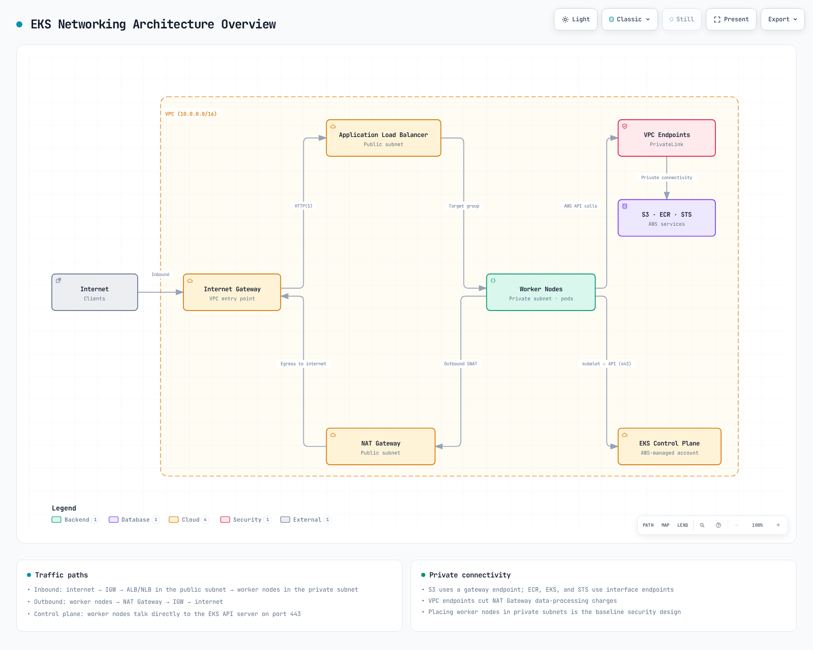
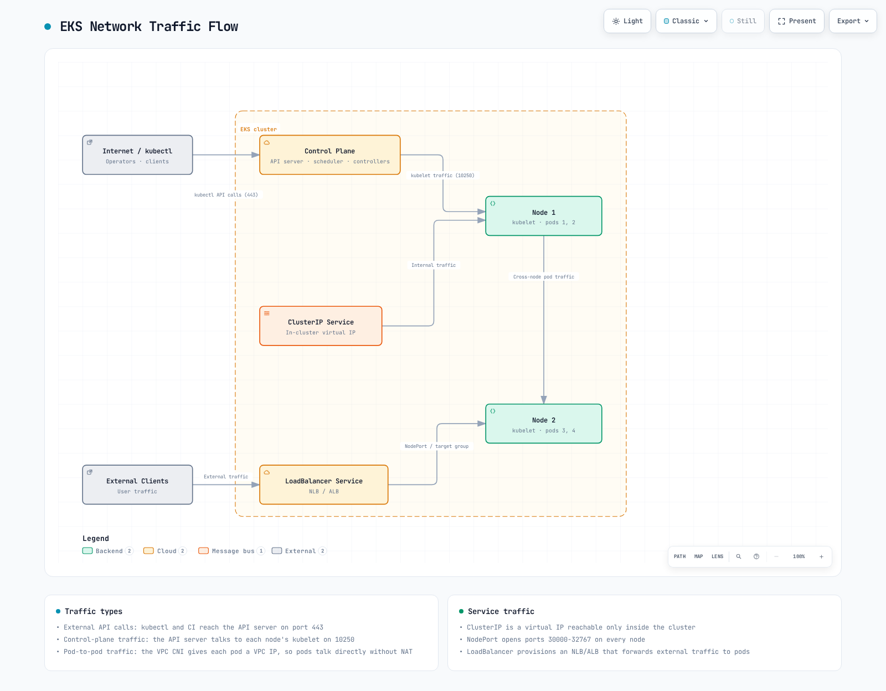
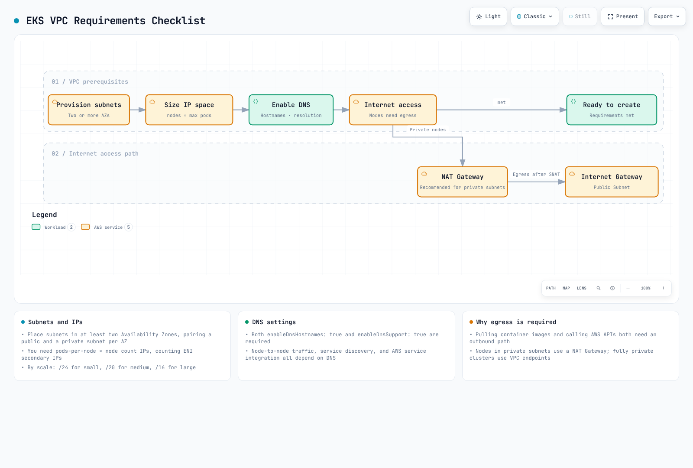
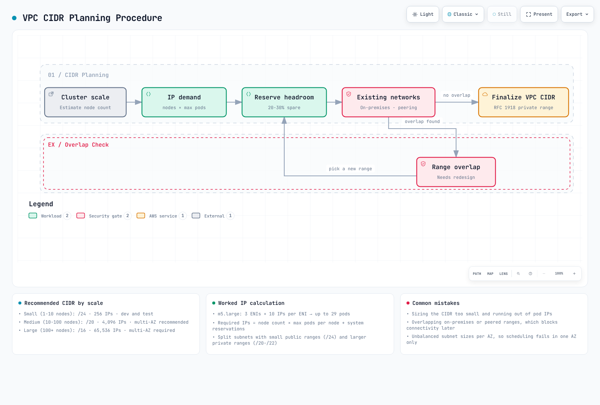

# Redes de EKS

## Descripción general

Las redes de Amazon EKS son un componente fundamental que administra la comunicación de los clústeres de Kubernetes. Este documento abarca los conceptos básicos de las redes de EKS, la configuración de VPC, el diseño de subnets y la configuración de security groups.

## Arquitectura de redes de EKS

La arquitectura de redes de EKS consta de los siguientes componentes:



[🔍 Ver diagrama interactivo](https://www.atomai.click/kubernetes-docs/archmaps/en-eks-03-eks-networking-part1-0.html)

1. **VPC (Virtual Private Cloud)**: Entorno de red aislado donde se ejecuta el clúster de EKS
2. **Subnets**: Unidades que dividen los rangos de direcciones IP dentro de la VPC
3. **Route Tables**: Conjuntos de reglas que determinan las rutas del tráfico de red
4. **Internet Gateway**: Componente que habilita la comunicación entre la VPC e Internet
5. **NAT Gateway**: Componente que permite a los recursos en subnets privadas acceder a Internet
6. **Security Groups**: Firewalls virtuales a nivel de instancia
7. **Network ACLs**: Firewalls virtuales a nivel de subnet
8. **CNI (Container Network Interface)**: Plugin que administra las redes de contenedores

### Flujo de redes de EKS

El tráfico de red fluye en un clúster de EKS de la siguiente manera:



[🔍 Ver diagrama interactivo](https://www.atomai.click/kubernetes-docs/archmaps/en-eks-03-eks-networking-part1-1.html)

1. **Comunicación de Pod a Pod**: Comunicación entre Pods en el mismo nodo o en nodos diferentes
2. **Comunicación de Pod a Service**: Comunicación entre Pods y Services dentro del clúster
3. **Comunicación interna a externa del clúster**: Comunicación entre recursos internos y recursos externos del clúster
4. **Comunicación del Control Plane al nodo**: Comunicación entre el control plane de EKS y los worker nodes

### Relación entre los componentes de redes de EKS


[🔍 Ver diagrama interactivo](https://www.atomai.click/kubernetes-docs/archmaps/en-eks-03-eks-networking-part1-2.html)

## Requisitos de VPC

Una VPC para un clúster de EKS debe cumplir los siguientes requisitos:



[🔍 Ver diagrama interactivo](https://www.atomai.click/kubernetes-docs/archmaps/en-eks-03-eks-networking-part1-3.html)

1. **Subnets**: Debe tener subnets en al menos 2 availability zones
2. **Direcciones IP**: Debe proporcionar una cantidad suficiente de direcciones IP
3. **Nombres de host DNS**: Los nombres de host DNS y la resolución DNS deben estar habilitados
4. **Acceso a Internet**: Los nodos deben poder acceder a Internet (a través de NAT Gateway o Internet Gateway)

### Planificación del CIDR de VPC

Consideraciones al planificar bloques CIDR de VPC:



[🔍 Ver diagrama interactivo](https://www.atomai.click/kubernetes-docs/archmaps/en-eks-03-eks-networking-part1-4.html)

1. **Tamaño del clúster**: Cantidad esperada de nodos y Pods
2. **Requisitos de direcciones IP**: Cantidad de direcciones IP necesarias para cada nodo y Pod
3. **Expansión futura**: Margen para futuras expansiones
4. **Integración con redes existentes**: Evitar superposiciones con redes existentes

Tamaños comunes de bloques CIDR de VPC:

* Clústeres pequeños: /24 (256 direcciones IP)
* Clústeres medianos: /20 (4,096 direcciones IP)
* Clústeres grandes: /16 (65,536 direcciones IP)

### Diseño de subnets


[🔍 Ver diagrama interactivo](https://www.atomai.click/kubernetes-docs/archmaps/en-eks-03-eks-networking-part1-5.html)

Prácticas recomendadas para el diseño de subnets de clústeres de EKS:

1. **Subnets públicas**: Subnets conectadas directamente a Internet Gateway
   * Uso: Load balancers públicos, NAT Gateways, bastion hosts
   * Tamaño típico: /24 (256 direcciones IP)
2. **Subnets privadas**: Subnets no conectadas directamente a Internet Gateway
   * Uso: Worker nodes de EKS, load balancers internos
   * Tamaño típico: /22 (1,024 direcciones IP)
3. **Distribución de Availability Zones**: Distribuya las subnets entre varias availability zones
   * Use al menos 2 availability zones
   * Coloque subnets públicas y privadas en cada availability zone

Ejemplo de diseño de subnets:

| Tipo de subnet | Availability Zone | Bloque CIDR  | Uso                          |
| ----------- | ----------------- | ----------- | ---------------------------- |
| Pública      | us-west-2a        | 10.0.0.0/24 | Load balancers, NAT Gateways |
| Pública      | us-west-2b        | 10.0.1.0/24 | Load balancers, NAT Gateways |
| Privada     | us-west-2a        | 10.0.2.0/22 | Worker nodes de EKS          |
| Privada     | us-west-2b        | 10.0.6.0/22 | Worker nodes de EKS          |

### Etiquetas de subnet


[🔍 Ver diagrama interactivo](https://www.atomai.click/kubernetes-docs/archmaps/en-eks-03-eks-networking-part1-6.html)

EKS utiliza etiquetas específicas en las subnets para detectar recursos automáticamente:

1. **Etiquetas de subnet pública**:
   * `kubernetes.io/role/elb`: Establezca el valor en `1` para usarlo con load balancers orientados a Internet
   * `kubernetes.io/cluster/<cluster-name>`: Establezca el valor en `shared` u `owned`
2. **Etiquetas de subnet privada**:
   * `kubernetes.io/role/internal-elb`: Establezca el valor en `1` para usarlo con load balancers internos
   * `kubernetes.io/cluster/<cluster-name>`: Establezca el valor en `shared` u `owned`

Ejemplo:

```bash
aws ec2 create-tags \
  --resources subnet-xxxxxxxxxxxxxxxxx \
  --tags Key=kubernetes.io/cluster/my-cluster,Value=shared Key=kubernetes.io/role/elb,Value=1
```

### Configuración de Security Groups


[🔍 Ver diagrama interactivo](https://www.atomai.click/kubernetes-docs/archmaps/en-eks-03-eks-networking-part1-7.html)

Los clústeres de EKS tienen dos security groups principales:

1. **Security Group del clúster (Control Plane)**:
   * Reglas de entrada:
     * 443/TCP: Permitir tráfico desde el security group de los worker nodes
   * Reglas de salida:
     * 1025-65535/TCP: Permitir tráfico hacia el security group de los worker nodes
2. **Security Group de nodos (Worker Nodes)**:
   * Reglas de entrada:
     * 443/TCP: Permitir tráfico desde el security group del clúster
     * 1025-65535/TCP: Permitir tráfico desde el security group del clúster
     * ALL: Permitir tráfico dentro del mismo security group
   * Reglas de salida:
     * ALL: Permitir tráfico hacia todos los destinos

## Conclusión

En este documento, aprendimos sobre los conceptos básicos de las redes de EKS y la configuración de VPC. En el siguiente documento, abordaremos temas de redes más avanzados, como Services, load balancing y network policies.

## Cuestionario

Para comprobar lo que aprendió en este capítulo, intente el [Cuestionario de redes de EKS - Parte 1](../quizzes/eks/03-eks-networking-part1-quiz.md).
