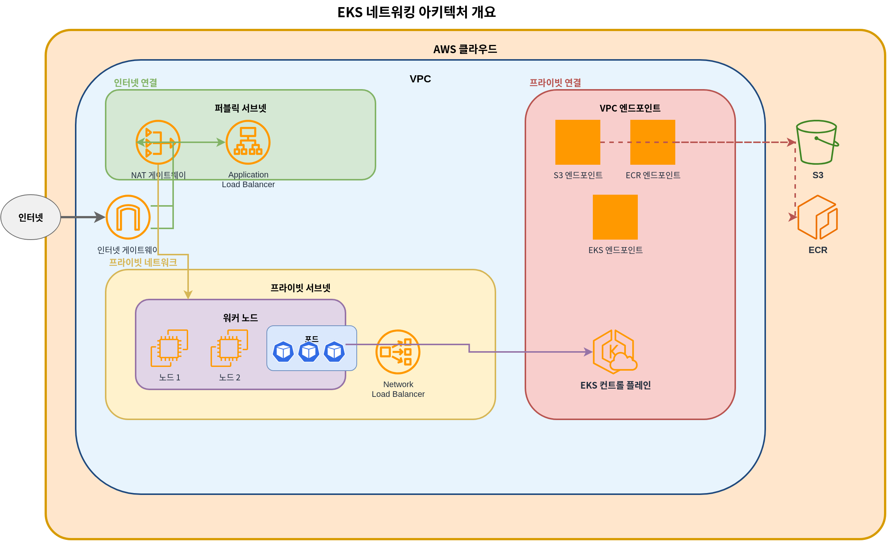
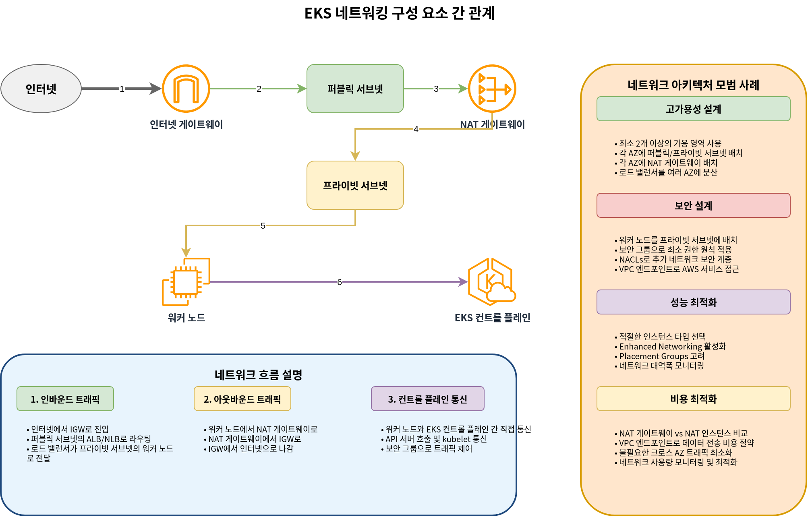
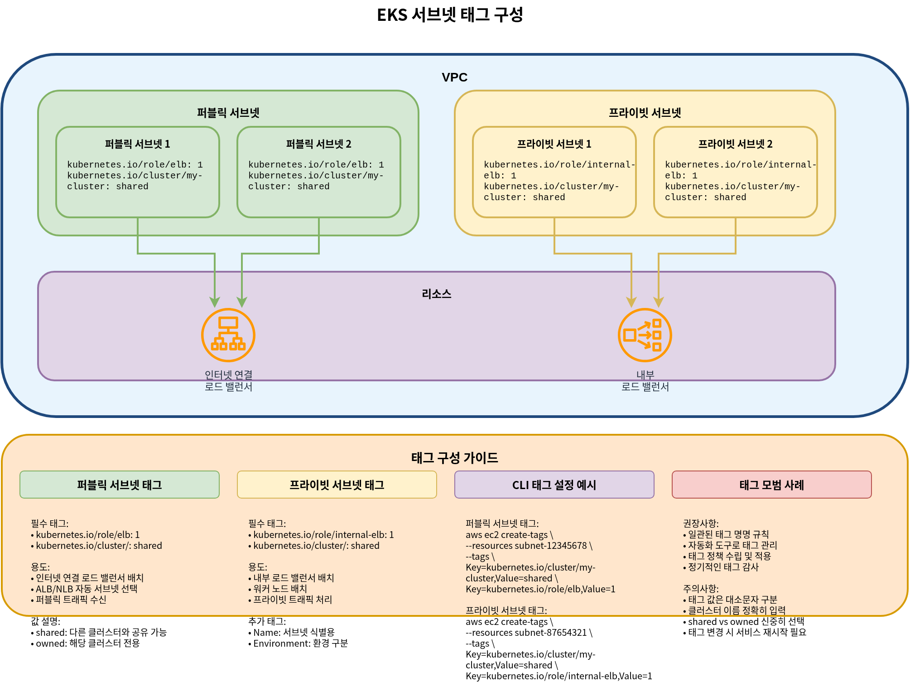

# Networking de EKS

## Descripción general

El networking de Amazon EKS es un componente central que administra la comunicación para Kubernetes clusters. Este documento cubre los conceptos básicos del networking de EKS, la configuración de VPC, el diseño de subnets y la configuración de security groups.

## Arquitectura de networking de EKS

La arquitectura de networking de EKS consta de los siguientes componentes:



1. **VPC (Virtual Private Cloud)**: Entorno de red aislado donde se ejecuta el EKS cluster
2. **Subnets**: Unidades que dividen los rangos de direcciones IP dentro de la VPC
3. **Route Tables**: Conjuntos de reglas que determinan las rutas del tráfico de red
4. **Internet Gateway**: Componente que permite la comunicación entre la VPC e internet
5. **NAT Gateway**: Componente que permite que los recursos en subnets privadas accedan a internet
6. **Security Groups**: Firewalls virtuales a nivel de instancia
7. **Network ACLs**: Firewalls virtuales a nivel de subnet
8. **CNI (Container Network Interface)**: Plugin que administra el networking de containers

### Flujo de networking de EKS

El tráfico de red fluye en un EKS cluster de la siguiente manera:


1. **Comunicación Pod-to-Pod**: Comunicación entre pods en el mismo node o en nodes diferentes
2. **Comunicación Pod-to-Service**: Comunicación entre pods y services dentro del cluster
3. **Comunicación interna a externa del cluster**: Comunicación entre recursos internos del cluster y recursos externos
4. **Comunicación del Control Plane al Node**: Comunicación entre el control plane de EKS y los worker nodes

### Relación entre los componentes de networking de EKS



## Requisitos de VPC

Una VPC para un EKS cluster debe cumplir los siguientes requisitos:


1. **Subnets**: Debe tener subnets en al menos 2 Availability Zones
2. **IP Addresses**: Debe proporcionar una cantidad suficiente de direcciones IP
3. **DNS Hostnames**: Los DNS hostnames y la resolución DNS deben estar habilitados
4. **Internet Access**: Los nodes deben poder acceder a internet (a través de un NAT gateway o internet gateway)

### Planificación de CIDR de VPC

Consideraciones al planificar los bloques CIDR de VPC:


1. **Cluster Size**: Número esperado de nodes y pods
2. **IP Address Requirements**: Número de direcciones IP necesarias para cada node y pod
3. **Future Expansion**: Espacio para expansión futura
4. **Integration with Existing Networks**: Evitar solapamientos con redes existentes

Tamaños comunes de bloques CIDR de VPC:

* Clusters pequeños: /24 (256 direcciones IP)
* Clusters medianos: /20 (4,096 direcciones IP)
* Clusters grandes: /16 (65,536 direcciones IP)

### Diseño de subnets


Mejores prácticas para el diseño de subnets para EKS clusters:

1. **Public Subnets**: Subnets conectadas directamente al internet gateway
   * Uso: Load balancers públicos, NAT gateways, bastion hosts
   * Tamaño típico: /24 (256 direcciones IP)
2. **Private Subnets**: Subnets no conectadas directamente al internet gateway
   * Uso: EKS worker nodes, load balancers internos
   * Tamaño típico: /22 (1,024 direcciones IP)
3. **Availability Zone Distribution**: Distribuir subnets en varias Availability Zones
   * Usar al menos 2 Availability Zones
   * Colocar subnets públicas y privadas en cada Availability Zone

Ejemplo de diseño de subnets:

| Tipo de subnet | Availability Zone | Bloque CIDR | Uso                          |
| -------------- | ----------------- | ----------- | ---------------------------- |
| Pública        | us-west-2a        | 10.0.0.0/24 | Load balancers, NAT gateways |
| Pública        | us-west-2b        | 10.0.1.0/24 | Load balancers, NAT gateways |
| Privada        | us-west-2a        | 10.0.2.0/22 | EKS worker nodes             |
| Privada        | us-west-2b        | 10.0.6.0/22 | EKS worker nodes             |

### Tags de subnets



EKS usa tags específicos en las subnets para descubrir recursos automáticamente:

1. **Public Subnet Tags**:
   * `kubernetes.io/role/elb`: Establece el valor en `1` para usarlo con load balancers orientados a internet
   * `kubernetes.io/cluster/<cluster-name>`: Establece el valor en `shared` o `owned`
2. **Private Subnet Tags**:
   * `kubernetes.io/role/internal-elb`: Establece el valor en `1` para usarlo con load balancers internos
   * `kubernetes.io/cluster/<cluster-name>`: Establece el valor en `shared` o `owned`

Ejemplo:

```bash
aws ec2 create-tags \
  --resources subnet-xxxxxxxxxxxxxxxxx \
  --tags Key=kubernetes.io/cluster/my-cluster,Value=shared Key=kubernetes.io/role/elb,Value=1
```

### Configuración de security groups


Los EKS clusters tienen dos security groups principales:

1. **Cluster Security Group (Control Plane)**:
   * Inbound rules:
     * 443/TCP: Permitir tráfico desde el security group de worker nodes
   * Outbound rules:
     * 1025-65535/TCP: Permitir tráfico hacia el security group de worker nodes
2. **Node Security Group (Worker Nodes)**:
   * Inbound rules:
     * 443/TCP: Permitir tráfico desde el cluster security group
     * 1025-65535/TCP: Permitir tráfico desde el cluster security group
     * ALL: Permitir tráfico dentro del mismo security group
   * Outbound rules:
     * ALL: Permitir tráfico hacia todos los destinos

## Conclusión

En este documento, aprendimos los conceptos básicos del networking de EKS y la configuración de VPC. En el siguiente documento, cubriremos temas de networking más avanzados, como services, load balancing y network policies.

## Cuestionario

Para comprobar lo que aprendiste en este capítulo, intenta resolver el [cuestionario Networking de EKS - Parte 1](../quizzes/eks/03-eks-networking-part1-quiz.md).
