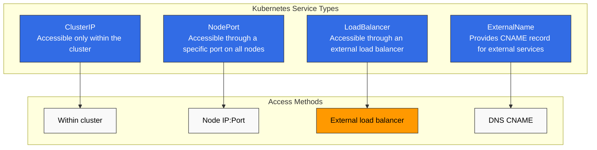
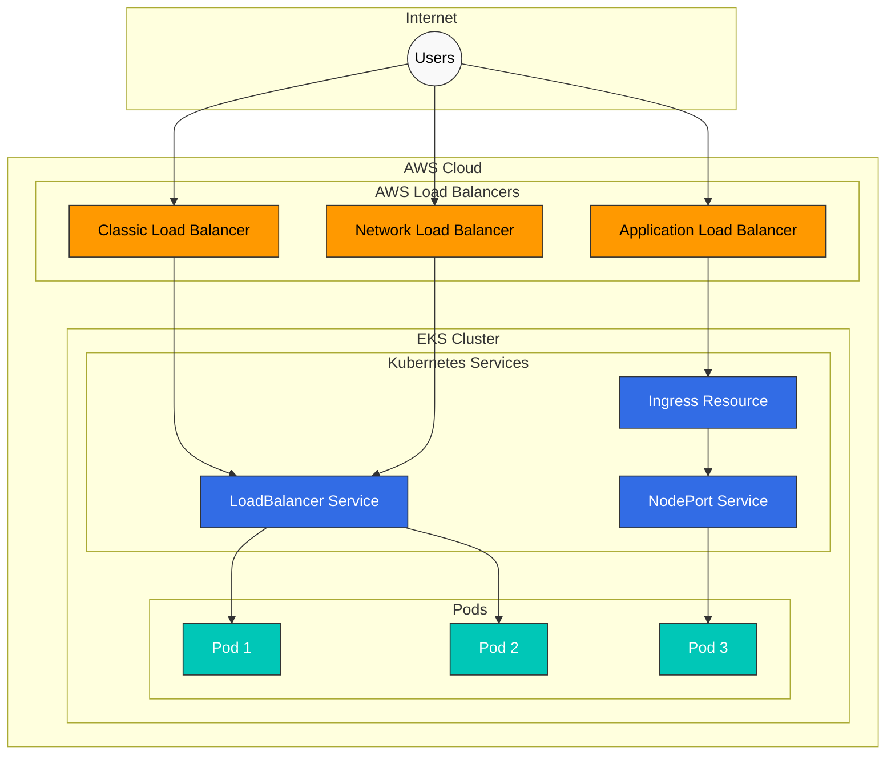
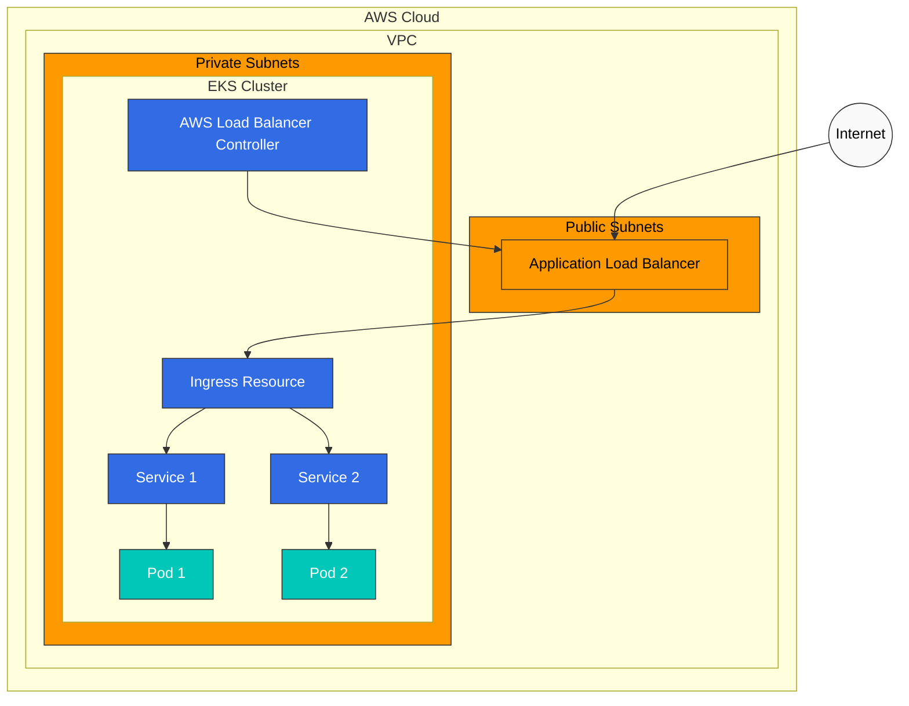
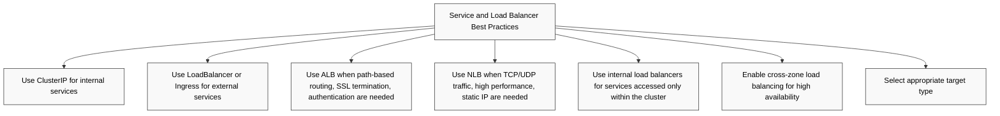
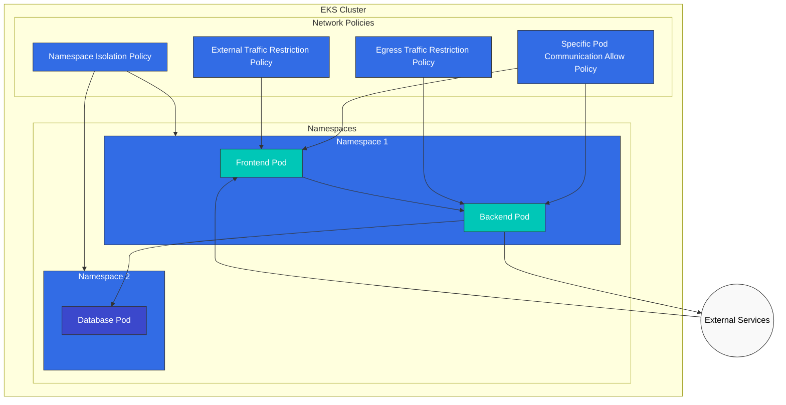
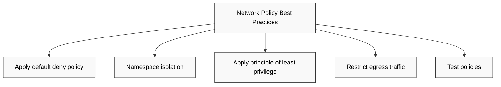
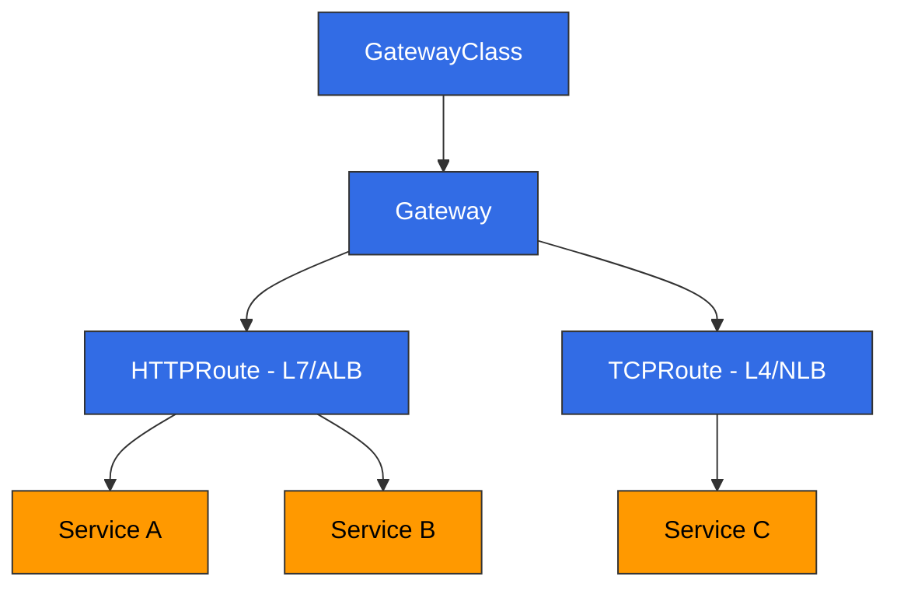

# Redes de EKS - Parte 2: Services, Load Balancing y Network Policies

## Descripción general

En este documento, aprenderemos sobre Services, Load Balancing (balanceo de carga) y Network Policies (políticas de red) en Amazon EKS. Cubrimos cómo exponer aplicaciones mediante Kubernetes Services, la integración con AWS load balancers y cómo controlar la comunicación de Pod a Pod usando Network Policies.

## Tipos de Kubernetes Service

Kubernetes proporciona los siguientes tipos de Service:



1. **ClusterIP**: Service accesible solo dentro del cluster
2. **NodePort**: Service accesible mediante un puerto específico en todos los nodos
3. **LoadBalancer**: Service accesible mediante un load balancer externo
4. **ExternalName**: Proporciona un registro CNAME para Services externos

### Service ClusterIP

Un Service ClusterIP es accesible solo dentro del cluster. Este es el tipo de Service predeterminado.

```yaml
apiVersion: v1
kind: Service
metadata:
  name: my-service
spec:
  selector:
    app: my-app
  ports:
  - port: 80
    targetPort: 8080
  type: ClusterIP
```

### Service NodePort

Un Service NodePort es accesible mediante un puerto específico en todos los nodos.

```yaml
apiVersion: v1
kind: Service
metadata:
  name: my-service
spec:
  selector:
    app: my-app
  ports:
  - port: 80
    targetPort: 8080
    nodePort: 30080
  type: NodePort
```

### Service LoadBalancer

Un Service LoadBalancer es accesible mediante un load balancer externo. En EKS, esto se integra con AWS load balancers (CLB, NLB, ALB).

```yaml
apiVersion: v1
kind: Service
metadata:
  name: my-service
spec:
  selector:
    app: my-app
  ports:
  - port: 80
    targetPort: 8080
  type: LoadBalancer
```

### Service ExternalName

Un Service ExternalName proporciona un registro CNAME para Services externos.

```yaml
apiVersion: v1
kind: Service
metadata:
  name: my-service
spec:
  type: ExternalName
  externalName: my-service.example.com
```

## Integración con AWS Load Balancer

EKS integra Kubernetes Services con AWS load balancers para que las aplicaciones sean accesibles desde el exterior.



### Classic Load Balancer (CLB)

De forma predeterminada, los Services configurados como `type: LoadBalancer` crean un Classic Load Balancer. Sin embargo, CLB ya no se recomienda, y se prefiere usar NLB o ALB.

```yaml
apiVersion: v1
kind: Service
metadata:
  name: my-service
spec:
  selector:
    app: my-app
  ports:
  - port: 80
    targetPort: 8080
  type: LoadBalancer
```

### Network Load Balancer (NLB)

Para usar NLB, debes agregar anotaciones específicas al Service:

```yaml
apiVersion: v1
kind: Service
metadata:
  name: my-service
  annotations:
    service.beta.kubernetes.io/aws-load-balancer-type: nlb
spec:
  selector:
    app: my-app
  ports:
  - port: 80
    targetPort: 8080
  type: LoadBalancer
```

Opciones adicionales de configuración de NLB:

```yaml
metadata:
  annotations:
    # Create internal NLB
    service.beta.kubernetes.io/aws-load-balancer-internal: "true"

    # Enable cross-zone load balancing
    service.beta.kubernetes.io/aws-load-balancer-cross-zone-load-balancing-enabled: "true"

    # Specify target type (instance or ip)
    service.beta.kubernetes.io/aws-load-balancer-target-group-attributes: preserve_client_ip.enabled=true

    # Enable TCP proxy protocol
    service.beta.kubernetes.io/aws-load-balancer-proxy-protocol: "*"
```

### Application Load Balancer (ALB)

Para usar ALB, debes instalar AWS Load Balancer Controller y usar recursos Ingress:



1. Instala AWS Load Balancer Controller:

```bash
# Download IAM policy
curl -o iam-policy.json https://raw.githubusercontent.com/kubernetes-sigs/aws-load-balancer-controller/main/docs/install/iam_policy.json

# Create IAM policy
aws iam create-policy \
  --policy-name AWSLoadBalancerControllerIAMPolicy \
  --policy-document file://iam-policy.json

# Create IAM role and attach policy (using eksctl)
eksctl create iamserviceaccount \
  --cluster=my-cluster \
  --namespace=kube-system \
  --name=aws-load-balancer-controller \
  --attach-policy-arn=arn:aws:iam::123456789012:policy/AWSLoadBalancerControllerIAMPolicy \
  --approve

# Add Helm repository
helm repo add eks https://aws.github.io/eks-charts
helm repo update

# Install AWS Load Balancer Controller
helm install aws-load-balancer-controller eks/aws-load-balancer-controller \
  -n kube-system \
  --set clusterName=my-cluster \
  --set serviceAccount.create=false \
  --set serviceAccount.name=aws-load-balancer-controller
```

2. Crea un recurso Ingress:

```yaml
apiVersion: networking.k8s.io/v1
kind: Ingress
metadata:
  name: my-ingress
  annotations:
    kubernetes.io/ingress.class: alb
    alb.ingress.kubernetes.io/scheme: internet-facing
    alb.ingress.kubernetes.io/target-type: ip
spec:
  rules:
  - http:
      paths:
      - path: /
        pathType: Prefix
        backend:
          service:
            name: my-service
            port:
              number: 80
```

Opciones adicionales de configuración de ALB:

```yaml
metadata:
  annotations:
    # Create internal ALB
    alb.ingress.kubernetes.io/scheme: internal

    # Specify SSL certificate
    alb.ingress.kubernetes.io/certificate-arn: arn:aws:acm:region:account-id:certificate/certificate-id

    # HTTPS redirect
    alb.ingress.kubernetes.io/actions.ssl-redirect: '{"Type": "redirect", "RedirectConfig": {"Protocol": "HTTPS", "Port": "443", "StatusCode": "HTTP_301"}}'

    # Specify target type (instance or ip)
    alb.ingress.kubernetes.io/target-type: ip

    # Specify security groups
    alb.ingress.kubernetes.io/security-groups: sg-xxxx,sg-yyyy
```

### Mejores prácticas de Service y Load Balancer



1. **Usa ClusterIP para Services internos**: Usa el tipo ClusterIP para Services a los que se accede solo dentro del cluster.
2. **Usa LoadBalancer o Ingress para Services externos**: Usa el tipo LoadBalancer o recursos Ingress para Services que necesitan acceso externo.
3. **Usa ALB**: Usa ALB cuando se necesiten características como enrutamiento basado en rutas, terminación SSL y autenticación.
4. **Usa NLB**: Usa NLB cuando se necesite tráfico TCP/UDP, alto rendimiento e IP estática.
5. **Usa load balancers internos**: Usa load balancers internos para Services a los que se accede solo dentro del cluster.
6. **Habilita cross-zone load balancing**: Habilita cross-zone load balancing para alta disponibilidad.
7. **Selecciona el tipo de destino apropiado**: Elige el tipo de destino `ip` para usar las IP de los Pod directamente como destinos, o el tipo de destino `instance` para usar las IP de los nodos como destinos.

## Network Policies

Las Network Policies se usan para controlar la comunicación de Pod a Pod. Para usar Network Policies en EKS, debes instalar un plugin CNI que admita Network Policies (por ejemplo, Calico, Cilium).



### Instalación de Calico

Calico es un plugin CNI ampliamente usado para implementar Network Policies en EKS:

```bash
# Install Calico
kubectl apply -f https://docs.projectcalico.org/manifests/calico-vxlan.yaml

# Check Calico status
kubectl get pods -n kube-system -l k8s-app=calico-node
```

### Network Policy predeterminada

De forma predeterminada, sin Network Policies, todos los Pods pueden comunicarse entre sí. Cuando se aplican Network Policies, solo se permite el tráfico explícitamente autorizado.

### Política de aislamiento de Namespace

Una política que permite la comunicación solo entre Pods dentro de un Namespace específico:

```yaml
apiVersion: networking.k8s.io/v1
kind: NetworkPolicy
metadata:
  name: namespace-isolation
  namespace: my-namespace
spec:
  podSelector: {}
  policyTypes:
  - Ingress
  ingress:
  - from:
    - podSelector: {}
```

### Política para permitir comunicación entre Pods específicos

Una política que permite la comunicación solo entre Pods con etiquetas específicas:

```yaml
apiVersion: networking.k8s.io/v1
kind: NetworkPolicy
metadata:
  name: allow-frontend-to-backend
  namespace: my-namespace
spec:
  podSelector:
    matchLabels:
      app: backend
  policyTypes:
  - Ingress
  ingress:
  - from:
    - podSelector:
        matchLabels:
          app: frontend
    ports:
    - protocol: TCP
      port: 80
```

### Política de restricción de tráfico externo

Una política que permite tráfico solo desde rangos de IP específicos:

```yaml
apiVersion: networking.k8s.io/v1
kind: NetworkPolicy
metadata:
  name: allow-external-traffic
  namespace: my-namespace
spec:
  podSelector:
    matchLabels:
      app: web
  policyTypes:
  - Ingress
  ingress:
  - from:
    - ipBlock:
        cidr: 192.168.1.0/24
        except:
        - 192.168.1.10/32
    ports:
    - protocol: TCP
      port: 80
```

### Política de restricción de tráfico de egreso

Una política que permite tráfico de egreso solo hacia destinos específicos:

```yaml
apiVersion: networking.k8s.io/v1
kind: NetworkPolicy
metadata:
  name: limit-egress-traffic
  namespace: my-namespace
spec:
  podSelector:
    matchLabels:
      app: web
  policyTypes:
  - Egress
  egress:
  - to:
    - podSelector:
        matchLabels:
          app: db
    ports:
    - protocol: TCP
      port: 5432
  - to:
    - ipBlock:
        cidr: 0.0.0.0/0
        except:
        - 10.0.0.0/8
        - 172.16.0.0/12
        - 192.168.0.0/16
    ports:
    - protocol: TCP
      port: 443
```

### Mejores prácticas de Network Policy



1. **Aplica una política default deny**: Deniega todo el tráfico de forma predeterminada y permite explícitamente solo el tráfico necesario.
2. **Aislamiento de Namespace**: Mejora la seguridad restringiendo la comunicación entre Namespaces.
3. **Aplica el principio de mínimo privilegio**: Permite solo la comunicación mínima necesaria.
4. **Restringe el tráfico de egreso**: Mejora la seguridad restringiendo el tráfico que sale desde los Pods.
5. **Prueba las políticas**: Prueba las Network Policies antes de aplicarlas para evitar bloqueos de comunicación no deseados.

---

## Gateway API

> **Versiones compatibles**: AWS Load Balancer Controller v2.13.0+
> **Última actualización**: February 19, 2026

### Descripción general

Gateway API es la API de redes de Services de próxima generación de Kubernetes que supera las limitaciones de los recursos Ingress tradicionales y proporciona capacidades de enrutamiento más completas. AWS Load Balancer Controller admite Gateway API, lo que permite configurar enrutamiento L4 (NLB) y L7 (ALB) mediante recursos Gateway.



### Requisitos previos

1. **AWS Load Balancer Controller v2.13.0 o posterior** instalado
2. **Feature Gates habilitados**: Agrega la bandera `--feature-gates=EnableGatewayAPI=true` al desplegar el controller
3. **Instalación de CRD de Gateway API**:

```bash
# Install Standard CRDs
kubectl apply -f https://github.com/kubernetes-sigs/gateway-api/releases/download/v1.2.1/standard-install.yaml

# Install Experimental CRDs (TCPRoute, etc.)
kubectl apply -f https://github.com/kubernetes-sigs/gateway-api/releases/download/v1.2.1/experimental-install.yaml

# Install AWS LBC-specific CRDs
kubectl apply -f https://raw.githubusercontent.com/kubernetes-sigs/aws-load-balancer-controller/main/config/crd/gateway-api/crds.yaml
```

### Configuración de GatewayClass y Gateway

GatewayClass define el tipo de load balancer, y Gateway representa la instancia real del load balancer.

```yaml
# GatewayClass definition
apiVersion: gateway.networking.k8s.io/v1
kind: GatewayClass
metadata:
  name: amazon-alb
spec:
  controllerName: gateway.k8s.aws/alb

---
# Gateway definition (L7 - ALB)
apiVersion: gateway.networking.k8s.io/v1
kind: Gateway
metadata:
  name: my-hotel-gateway
  namespace: default
spec:
  gatewayClassName: amazon-alb
  listeners:
  - name: http
    protocol: HTTP
    port: 80
  - name: https
    protocol: HTTPS
    port: 443
    tls:
      mode: Terminate
      certificateRefs:
      - kind: Secret
        name: my-tls-secret
```

### Ejemplo de HTTPRoute (L7 → ALB)

HTTPRoute define reglas para enrutar tráfico HTTP/HTTPS a Services. Los HTTPRoutes asociados a un Gateway distribuyen el tráfico mediante un ALB.

```yaml
apiVersion: gateway.networking.k8s.io/v1
kind: HTTPRoute
metadata:
  name: app-route
  namespace: default
spec:
  parentRefs:
  - name: my-hotel-gateway
    sectionName: http
  hostnames:
  - "app.example.com"
  rules:
  - matches:
    - path:
        type: PathPrefix
        value: /api
    backendRefs:
    - name: api-service
      port: 80
      weight: 90
    - name: api-service-v2
      port: 80
      weight: 10
  - matches:
    - path:
        type: PathPrefix
        value: /
    backendRefs:
    - name: frontend-service
      port: 80
```

### Ejemplo de TCPRoute (L4 → NLB)

TCPRoute maneja tráfico TCP y proporciona Load Balancing de nivel L4 mediante un NLB.

```yaml
# GatewayClass for NLB
apiVersion: gateway.networking.k8s.io/v1
kind: GatewayClass
metadata:
  name: amazon-nlb
spec:
  controllerName: gateway.k8s.aws/nlb

---
# NLB Gateway
apiVersion: gateway.networking.k8s.io/v1
kind: Gateway
metadata:
  name: my-nlb-gateway
spec:
  gatewayClassName: amazon-nlb
  listeners:
  - name: tcp
    protocol: TCP
    port: 5432

---
# TCPRoute
apiVersion: gateway.networking.k8s.io/v1alpha2
kind: TCPRoute
metadata:
  name: db-route
spec:
  parentRefs:
  - name: my-nlb-gateway
    sectionName: tcp
  rules:
  - backendRefs:
    - name: postgres-service
      port: 5432
```

### Compatibilidad con QUIC/HTTP3

Los ALB creados mediante Gateway API admiten automáticamente el protocolo QUIC/HTTP3. Cuando se configura un listener HTTPS, el ALB gestiona automáticamente las actualizaciones del protocolo QUIC.

```yaml
apiVersion: gateway.networking.k8s.io/v1
kind: Gateway
metadata:
  name: quic-gateway
  annotations:
    gateway.k8s.aws/quic-enabled: "true"
spec:
  gatewayClassName: amazon-alb
  listeners:
  - name: https
    protocol: HTTPS
    port: 443
    tls:
      mode: Terminate
      certificateRefs:
      - kind: Secret
        name: tls-cert
```

### Detección de certificados

AWS Load Balancer Controller admite dos métodos de detección de certificados:

1. **Referencia estática de certificado**: Se especifica directamente en `tls.certificateRefs` del Gateway
2. **Detección automática basada en hostname**: Busca automáticamente en ACM certificados coincidentes según el campo `hostnames` del HTTPRoute

```yaml
# Hostname-based auto-discovery example
apiVersion: gateway.networking.k8s.io/v1
kind: HTTPRoute
metadata:
  name: auto-cert-route
spec:
  parentRefs:
  - name: my-gateway
  hostnames:
  - "secure.example.com"  # Auto-discovers matching certificate from ACM
  rules:
  - backendRefs:
    - name: secure-service
      port: 443
```

### Security Groups

Los load balancers creados mediante Gateway API tienen security groups creados automáticamente:

- **Frontend security group**: Permite tráfico entrante desde clientes hacia el load balancer
- **Backend security group**: Permite tráfico desde el load balancer hacia los Pods de destino

También se pueden especificar security groups personalizados mediante anotaciones de Gateway:

```yaml
apiVersion: gateway.networking.k8s.io/v1
kind: Gateway
metadata:
  name: custom-sg-gateway
  annotations:
    gateway.k8s.aws/security-group-ids: sg-0123456789abcdef0,sg-0987654321fedcba0
spec:
  gatewayClassName: amazon-alb
  listeners:
  - name: http
    protocol: HTTP
    port: 80
```

### Target Groups out-of-band

El uso de `TargetGroupName` backendRef permite conectar target groups preexistentes al enrutamiento de Gateway API. Esto es útil para la integración con infraestructura existente o escenarios de migración.

```yaml
apiVersion: gateway.networking.k8s.io/v1
kind: HTTPRoute
metadata:
  name: oob-route
spec:
  parentRefs:
  - name: my-gateway
  rules:
  - backendRefs:
    - group: gateway.k8s.aws
      kind: TargetGroupBinding
      name: existing-target-group
```

### Comparación entre Gateway API e Ingress

| Característica | Ingress | Gateway API |
|---------|---------|-------------|
| Modelo de enrutamiento | Basado en Host/Path | Basado en Host/Path/Header/Query |
| Compatibilidad con protocolos | HTTP/HTTPS | HTTP, HTTPS, TCP, TLS, gRPC |
| División de tráfico | Basada en anotaciones | Nativa basada en peso |
| Separación de roles | Recurso único | Separación GatewayClass/Gateway/Route |
| Extensibilidad | Limitada mediante anotaciones | Extensible mediante asociación de Policy |
| Load Balancing L4 | No compatible | TCPRoute/UDPRoute compatible |

## Cuestionario

Para comprobar lo que aprendiste en este capítulo, intenta el [cuestionario del tema](../quizzes/eks/03-eks-networking-part2-quiz.md).
