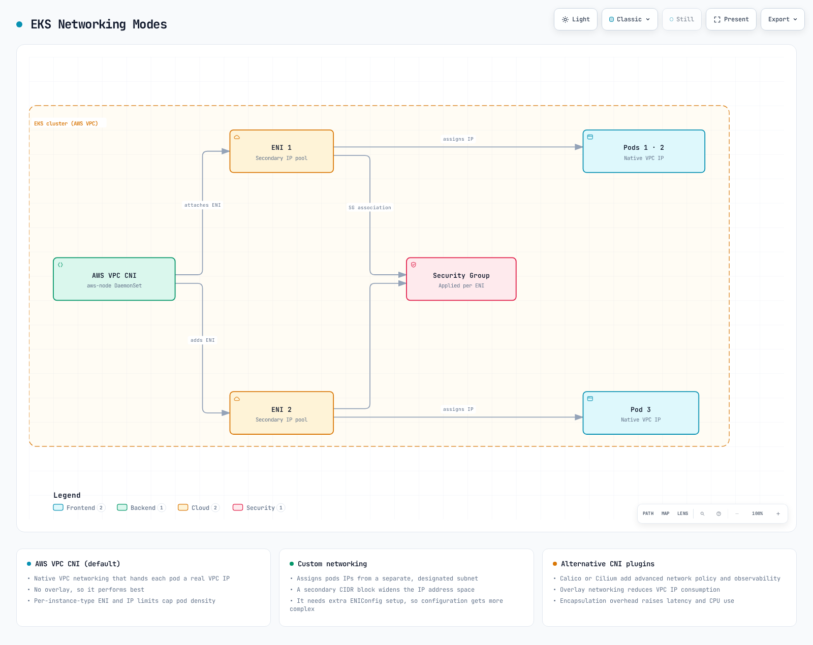
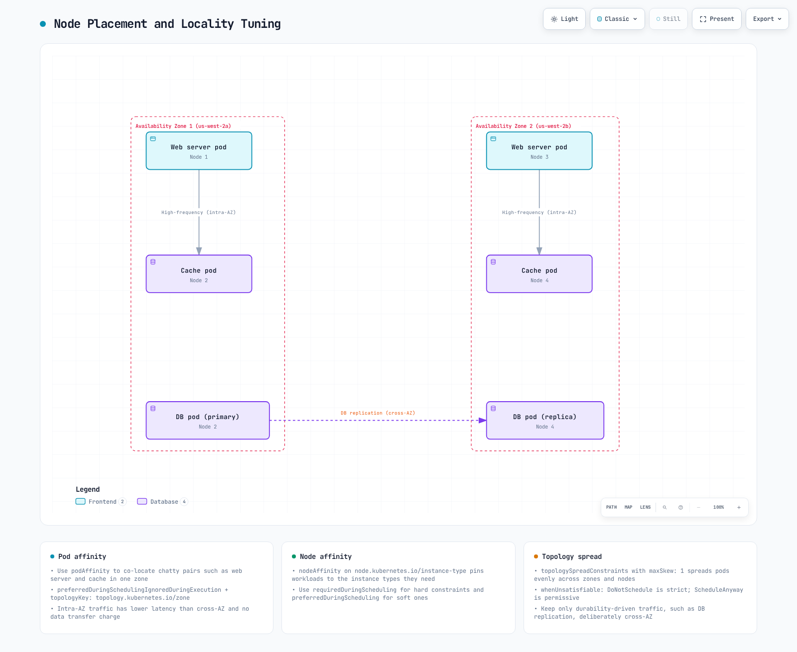
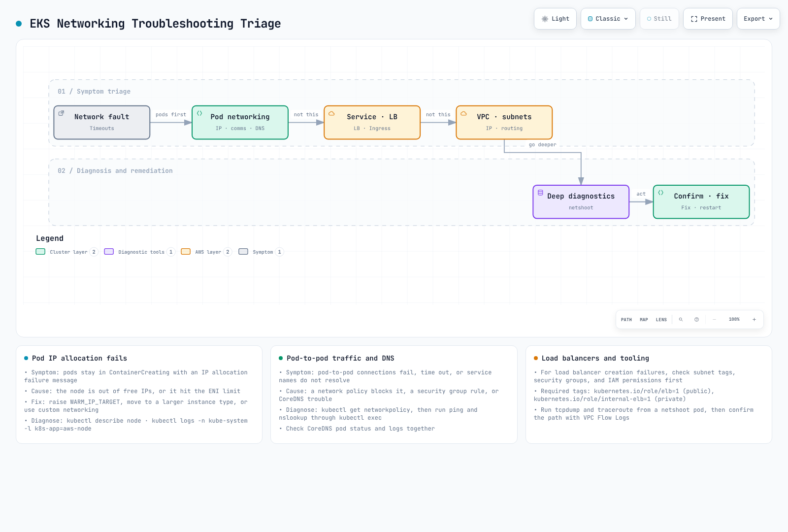

# Parte 3: Solución de problemas

## Descripción general

Este documento cubre la optimización del rendimiento, los métodos de solución de problemas y los casos de uso avanzados para las redes de Amazon EKS. Analizaremos cómo optimizar el rendimiento de red, resolver problemas comunes de red y aprovechar las características avanzadas de red.

## Optimización del rendimiento de red

Existen varias estrategias para optimizar el rendimiento de red en los clústeres de EKS.


[🔍 Ver diagrama interactivo](https://www.atomai.click/kubernetes-docs/archmaps/en-eks-03-eks-networking-part3-0.html)

### Selección del tipo de instancia

El rendimiento de red varía significativamente según el tipo de instancia. Para cargas de trabajo que requieren un uso intensivo de la red, se recomienda elegir tipos de instancia que admitan redes mejoradas.

1. **Instancias compatibles con redes mejoradas**:
   * Los tipos de instancia como C5, M5 y R5 admiten redes mejoradas.
   * Estas instancias proporcionan mayor ancho de banda, menor latencia y menor jitter.
2. **Ancho de banda de red**:
   * Los tamaños de instancia más grandes proporcionan mayor ancho de banda de red.
   * Por ejemplo, m5.large proporciona hasta 10Gbps, mientras que m5.24xlarge proporciona hasta 25Gbps de ancho de banda de red.
3. **Elastic Network Adapter (ENA)**:
   * ENA admite un ancho de banda de red de hasta 100Gbps.
   * La mayoría de los tipos de instancia modernos admiten ENA.

### Modos de red del clúster

EKS admite varios modos de red, cada uno con diferentes características de rendimiento.



[🔍 Ver diagrama interactivo](https://www.atomai.click/kubernetes-docs/archmaps/en-eks-03-eks-networking-part3-1.html)

1. **AWS VPC CNI (predeterminado)**:
   * Asigna direcciones IP de VPC directamente a los pods.
   * Ofrece un rendimiento excelente, ya que usa redes de VPC nativas.
   * Cada nodo tiene un límite en la cantidad de direcciones IP que puede asignar.
2. **Redes personalizadas**:
   * Permite asignar direcciones IP de subredes específicas a los pods.
   * Puede ampliar el espacio de direcciones IP mediante bloques CIDR secundarios.
   * Proporciona un control más preciso sobre la topología de red.
3. **Plugins de CNI alternativos**:
   * Se pueden usar plugins de CNI alternativos como Calico y Cilium.
   * Estos plugins proporcionan características adicionales (por ejemplo, políticas de red y cifrado), pero pueden tener sobrecarga de rendimiento.

### Optimización de MTU

MTU (Maximum Transmission Unit) es un factor importante que afecta el rendimiento de red.

1. **Configuración predeterminada de MTU**:
   * La MTU predeterminada para AWS VPC CNI es 9001.
   * Algunas rutas de red pueden requerir una MTU menor.
2. **Ajuste de MTU**:
   * Se puede ajustar la configuración de MTU de AWS VPC CNI:

```bash
kubectl set env daemonset aws-node -n kube-system ENI_MTU=9001
```

3. **Jumbo Frames**:
   * Usar jumbo frames (MTU > 1500) puede mejorar el rendimiento de red.
   * Todos los componentes de red, incluidos VPC, subredes, grupos de seguridad y balanceadores de carga, deben admitir jumbo frames.

### Optimización de TCP

La configuración de TCP se puede optimizar para mejorar el rendimiento de red.

1. **TCP Early Demux**:
   * TCP early demux puede mejorar el rendimiento, pero puede causar problemas en algunos modos de red.
   * Se puede deshabilitar si es necesario:

```bash
kubectl set env daemonset aws-node -n kube-system DISABLE_TCP_EARLY_DEMUX=true
```

2. **Configuración de TCP Keepalive**:
   * La configuración de TCP keepalive se puede ajustar para optimizar el mantenimiento y la reutilización de conexiones.
   * Esto es especialmente útil para cargas de trabajo que gestionan muchas conexiones cortas.

```bash
# System-level TCP keepalive settings
sysctl -w net.ipv4.tcp_keepalive_time=60
sysctl -w net.ipv4.tcp_keepalive_intvl=15
sysctl -w net.ipv4.tcp_keepalive_probes=6
```

3. **Tamaño de búfer TCP**:
   * El tamaño del búfer TCP se puede ajustar para optimizar el rendimiento.
   * Se recomienda establecer el tamaño del búfer según el producto de ancho de banda y retardo (BDP).

```bash
# System-level TCP buffer settings
sysctl -w net.core.rmem_max=16777216
sysctl -w net.core.wmem_max=16777216
sysctl -w net.ipv4.tcp_rmem="4096 87380 16777216"
sysctl -w net.ipv4.tcp_wmem="4096 65536 16777216"
```

### Ubicación y proximidad de nodos

El rendimiento de red se puede mejorar optimizando la ubicación y la proximidad de los nodos.



[🔍 Ver diagrama interactivo](https://www.atomai.click/kubernetes-docs/archmaps/en-eks-03-eks-networking-part3-2.html)

1. **Proximidad de Availability Zone**:
   * Coloque los pods que se comunican con frecuencia en la misma zona de disponibilidad para reducir la latencia.
   * Use afinidad y antiafinidad de pods para controlar la ubicación de los pods.

```yaml
apiVersion: apps/v1
kind: Deployment
metadata:
  name: web-server
spec:
  replicas: 3
  selector:
    matchLabels:
      app: web
  template:
    metadata:
      labels:
        app: web
    spec:
      affinity:
        podAffinity:
          preferredDuringSchedulingIgnoredDuringExecution:
          - weight: 100
            podAffinityTerm:
              labelSelector:
                matchExpressions:
                - key: app
                  operator: In
                  values:
                  - cache
              topologyKey: topology.kubernetes.io/zone
```

2. **Proximidad de nodos**:
   * Coloque los pods que se comunican con frecuencia en el mismo nodo para reducir los saltos de red.
   * Esto es especialmente útil para aplicaciones sensibles a la latencia.

```yaml
apiVersion: apps/v1
kind: Deployment
metadata:
  name: web-server
spec:
  replicas: 3
  selector:
    matchLabels:
      app: web
  template:
    metadata:
      labels:
        app: web
    spec:
      affinity:
        podAffinity:
          preferredDuringSchedulingIgnoredDuringExecution:
          - weight: 100
            podAffinityTerm:
              labelSelector:
                matchExpressions:
                - key: app
                  operator: In
                  values:
                  - cache
              topologyKey: kubernetes.io/hostname
```

3. **Topology Aware Hints**:
   * Use topology aware hints para mantener el tráfico de Service dentro de la misma zona.
   * Esto reduce los costos de transferencia de datos entre zonas de disponibilidad y mejora la latencia.

```yaml
apiVersion: v1
kind: Service
metadata:
  name: my-service
  annotations:
    service.kubernetes.io/topology-aware-hints: "auto"
spec:
  selector:
    app: my-app
  ports:
  - port: 80
    targetPort: 8080
  type: ClusterIP
```

### Optimización de políticas de red

Las políticas de red mejoran la seguridad, pero pueden afectar el rendimiento.

1. **Minimizar el número de políticas**:
   * Aplique únicamente las políticas de red mínimas necesarias.
   * Demasiadas políticas pueden causar una degradación del rendimiento.
2. **Optimizar el alcance de las políticas**:
   * Use políticas específicas en lugar de políticas amplias.
   * Use selectores de etiquetas para limitar el alcance de las políticas.
3. **Considerar el orden de evaluación de las políticas**:
   * Las políticas de red se evalúan de forma acumulativa.
   * Defina primero las reglas más utilizadas para optimizar el rendimiento de evaluación.

## Solución de problemas de red

Exploremos problemas comunes de red que pueden ocurrir en los clústeres de EKS y cómo resolverlos.



[🔍 Ver diagrama interactivo](https://www.atomai.click/kubernetes-docs/archmaps/en-eks-03-eks-networking-part3-3.html)

### Problemas de red de Pod


[🔍 Ver diagrama interactivo](https://www.atomai.click/kubernetes-docs/archmaps/en-eks-03-eks-networking-part3-4.html)

1. **Fallo en la asignación de IP de Pod**:
   * Síntoma: Pod atascado en el estado `ContainerCreating`
   * Causa: El nodo no tiene suficientes direcciones IP disponibles
   * Solución:
     * Compruebe el estado del nodo: `kubectl describe node <node-name>`
     * Compruebe los logs de AWS VPC CNI: `kubectl logs -n kube-system -l k8s-app=aws-node`
     * Aumente WARM\_IP\_TARGET: `kubectl set env daemonset aws-node -n kube-system WARM_IP_TARGET=10`
     * Actualice el tipo de instancia del nodo: cambie a un tipo de instancia que admita más ENI y direcciones IP
2. **Problemas de comunicación de Pod a Pod**:
   * Síntoma: Pod no puede comunicarse con otros pods
   * Causa: Políticas de red, grupos de seguridad, problemas de enrutamiento, etc.
   * Solución:
     * Compruebe las políticas de red: `kubectl get networkpolicy`
     * Compruebe las reglas de los grupos de seguridad: use la consola de AWS o AWS CLI
     * Pruebe la conectividad de red desde dentro del pod:

```bash
kubectl exec -it <pod-name> -- ping <target-pod-ip>
kubectl exec -it <pod-name> -- curl <target-service-name>
kubectl exec -it <pod-name> -- traceroute <target-pod-ip>
```

3. **Problemas de resolución DNS**:
   * Síntoma: Pod no puede resolver nombres de Service
   * Causa: Problemas de CoreDNS, políticas de red, grupos de seguridad, etc.
   * Solución:
     * Compruebe el estado de los pods de CoreDNS: `kubectl get pods -n kube-system -l k8s-app=kube-dns`
     * Compruebe los logs de CoreDNS: `kubectl logs -n kube-system -l k8s-app=kube-dns`
     * Compruebe la configuración de DNS: `kubectl exec -it <pod-name> -- cat /etc/resolv.conf`
     * Pruebe las consultas DNS:

```bash
kubectl exec -it <pod-name> -- nslookup kubernetes.default.svc.cluster.local
kubectl exec -it <pod-name> -- dig kubernetes.default.svc.cluster.local
```

### Problemas de Service y balanceo de carga


[🔍 Ver diagrama interactivo](https://www.atomai.click/kubernetes-docs/archmaps/en-eks-03-eks-networking-part3-5.html)

1. **Problemas de conexión de Service**:
   * Síntoma: No se puede conectar a los pods mediante el Service
   * Causa: Selector de Service, estado de los pods, endpoints, etc.
   * Solución:
     * Compruebe el estado del Service: `kubectl describe service <service-name>`
     * Compruebe los endpoints: `kubectl get endpoints <service-name>`
     * Compruebe el estado de los pods: `kubectl get pods -l <selector-label>`
     * Compruebe el DNS de Service: `kubectl exec -it <pod-name> -- nslookup <service-name>`
2. **Problemas de balanceador de carga**:
   * Síntoma: No se puede conectar al balanceador de carga desde el exterior
   * Causa: Grupos de seguridad, etiquetas de subred, comprobaciones de estado, etc.
   * Solución:
     * Compruebe el estado del balanceador de carga: use la consola de AWS o AWS CLI
     * Compruebe las reglas de los grupos de seguridad: verifique que se permita el tráfico entrante
     * Compruebe las etiquetas de subred: verifique que existan las etiquetas adecuadas
     * Compruebe la configuración de comprobación de estado: ruta, puerto, etc. de comprobación de estado
3. **Problemas de Ingress**:
   * Síntoma: No se puede conectar al Service mediante Ingress
   * Causa: Controlador de Ingress, anotaciones, certificados, etc.
   * Solución:
     * Compruebe el estado de Ingress: `kubectl describe ingress <ingress-name>`
     * Compruebe los logs del controlador de Ingress: `kubectl logs -n kube-system -l app.kubernetes.io/name=aws-load-balancer-controller`
     * Compruebe el estado de ALB: use la consola de AWS o AWS CLI
     * Compruebe el estado del grupo de destino: verifique que los destinos estén en buen estado

## Cuestionario

Para comprobar lo que ha aprendido en este capítulo, pruebe el [cuestionario del tema](../quizzes/eks/03-eks-networking-part3-quiz.md).
