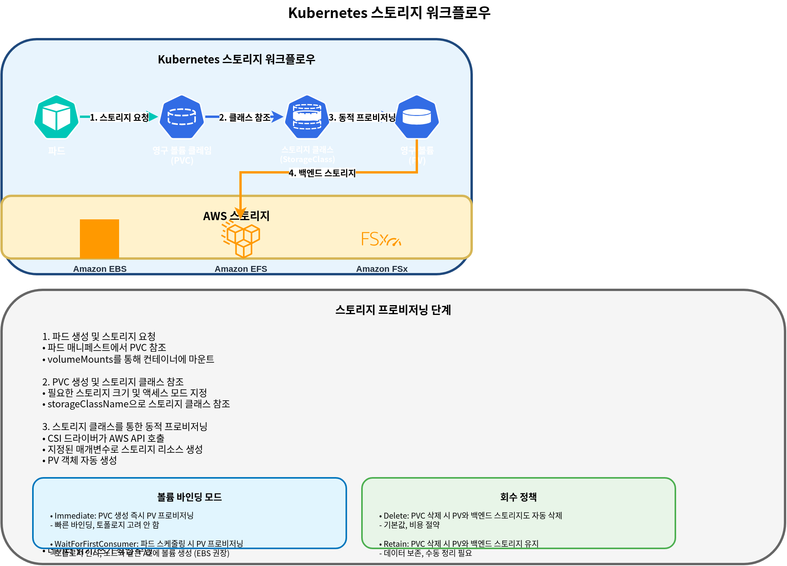

# Almacenamiento en EKS

> **Última actualización**: July 3, 2026

Al ejecutar aplicaciones en Amazon EKS, existen varias opciones de almacenamiento para guardar y administrar datos. Este documento cubre los conceptos básicos del almacenamiento en EKS y cómo usar Amazon EBS (Elastic Block Store) y Amazon EFS (Elastic File System).

## Tabla de contenidos

1. [Conceptos básicos de almacenamiento en Kubernetes](04-eks-storage-part1.md#kubernetes-storage-basic-concepts)
2. [Descripción general de las opciones de almacenamiento de Amazon EKS](04-eks-storage-part1.md#amazon-eks-storage-options-overview)
3. [Almacenamiento con Amazon EBS](04-eks-storage-part1.md#storage-with-amazon-ebs)
4. [Almacenamiento con Amazon EFS](04-eks-storage-part1.md#storage-with-amazon-efs)
5. [Storage Classes y aprovisionamiento dinámico](04-eks-storage-part1.md#storage-classes-and-dynamic-provisioning)

## Conceptos básicos de almacenamiento en Kubernetes

Primero entendamos los conceptos clave para administrar almacenamiento en Kubernetes.


### Volume

Un Volume es un directorio que se puede montar en containers dentro de un Pod, y los datos persisten incluso si el container se reinicia. La vida útil de un Volume es la misma que la vida útil del Pod, y cuando se elimina el Pod, también se elimina el Volume.

### Persistent Volume (PV)

Un Persistent Volume es una porción del almacenamiento del cluster que es aprovisionada por un administrador o aprovisionada dinámicamente mediante una storage class. Los PV tienen un ciclo de vida independiente de los Pods, y persisten incluso cuando se eliminan los Pods.

### Persistent Volume Claim (PVC)

Un Persistent Volume Claim es una solicitud de almacenamiento de un usuario. Un PVC solicita almacenamiento con un tamaño y un modo de acceso específicos, y esta solicitud se vincula a un PV adecuado.

### StorageClass

Una storage class describe la "clase" de almacenamiento ofrecida por el administrador. Usar storage classes permite que los PV se aprovisionen dinámicamente cuando se crean los PVC.

### Modos de acceso

Kubernetes admite los siguientes modos de acceso:

* **ReadWriteOnce (RWO)**: Se puede montar como lectura/escritura por un solo node
* **ReadOnlyMany (ROX)**: Se puede montar como solo lectura por muchos nodes
* **ReadWriteMany (RWX)**: Se puede montar como lectura/escritura por muchos nodes
* **ReadWriteOncePod (RWOP)**: Se puede montar como lectura/escritura por un solo Pod (Kubernetes 1.22+)

## Descripción general de las opciones de almacenamiento de Amazon EKS

En Amazon EKS, puedes aprovechar varios servicios de almacenamiento de AWS para proporcionar almacenamiento a aplicaciones containerized.


### Opciones principales de almacenamiento

1. **Amazon EBS (Elastic Block Store)**
   * Almacenamiento en bloque, montable en un solo node (RWO)
   * Almacenamiento en bloque de alto rendimiento y duradero
   * Adecuado para databases y aplicaciones stateful
2. **Amazon EFS (Elastic File System)**
   * File system NFS completamente administrado
   * Se puede montar simultáneamente desde varios nodes (RWX)
   * Adecuado para workloads que requieren file systems compartidos
3. **Amazon FSx for Lustre**
   * File system de alto rendimiento
   * Adecuado para machine learning, HPC y analítica de big data
   * Se puede montar simultáneamente desde varios nodes (RWX)
4. **Amazon S3 (Simple Storage Service)**
   * Almacenamiento de objetos
   * No se puede montar directamente como Volume, pero es accesible mediante la S3 API
   * Adecuado para almacenamiento de datos a gran escala
5. **EC2 Instance Store (Local NVMe)**
   * Almacenamiento NVMe local efímero conectado físicamente a la EC2 instance, que ofrece latencia muy baja
   * El EC2 Instance Store CSI Driver alcanzó disponibilidad general (GA) como Amazon EKS add-on en mayo de 2026, por lo que ahora puede instalarse y administrarse como un add-on estándar desde la EKS Console/CLI (anteriormente requería instalación manual mediante manifests de la comunidad). El driver administra automáticamente el ciclo de vida del Volume, lo que reduce la sobrecarga operativa
   * Adecuado para procesamiento de datos efímeros de AI/ML, caché local de Spark/Hadoop, procesamiento de logs de alto throughput y capas de caché de databases
   * Costo: el driver en sí es gratuito; solo pagas por la EC2 instance subyacente que incluye instance store ([fuente](https://aws.amazon.com/about-aws/whats-new/2026/05/ec2-csi-eks/))

### Comparación de opciones de almacenamiento

| Opción de almacenamiento | Tipo                 | Modo de acceso | Rendimiento                    | Casos de uso                                                          |
| ------------------------ | -------------------- | -------------- | ------------------------------ | --------------------------------------------------------------------- |
| Amazon EBS               | Bloque               | RWO            | Alto                           | Databases, aplicaciones stateful                                      |
| Amazon EFS               | File                 | RWX            | Medio                          | Archivos compartidos, web servers, CMS                                |
| FSx for Lustre           | File                 | RWX            | Muy alto                       | HPC, entrenamiento de ML, big data                                    |
| Amazon S3                | Objeto               | API Access     | Medio                          | Backup, archivo, contenido estático                                   |
| EC2 Instance Store       | Bloque (NVMe local)  | RWO, efímero   | Muy alto (latencia ultrabaja)  | Datos efímeros AI/ML, caché local, procesamiento de logs de alto throughput |

## Almacenamiento con Amazon EBS

Amazon EBS proporciona Volumes de almacenamiento a nivel de bloque que se pueden adjuntar a EC2 instances. En EKS, puedes montar EBS volumes en Kubernetes Pods mediante el EBS CSI (Container Storage Interface) driver.


### Instalación del EBS CSI Driver

Para usar EBS volumes en EKS, necesitas instalar el EBS CSI driver. Este driver se proporciona como Amazon EKS add-on.

```bash
# Install EBS CSI driver
eksctl create addon --name aws-ebs-csi-driver --cluster my-cluster --version latest

# Or using AWS CLI
aws eks create-addon --cluster-name my-cluster --addon-name aws-ebs-csi-driver --addon-version latest
```

### Creación de una EBS Storage Class

Crea una storage class para el aprovisionamiento dinámico de EBS volumes. Aquí usamos el tipo de Volume gp3.

```yaml
apiVersion: storage.k8s.io/v1
kind: StorageClass
metadata:
  name: ebs-gp3
provisioner: ebs.csi.aws.com
volumeBindingMode: WaitForFirstConsumer
parameters:
  type: gp3
  encrypted: "true"
  fsType: ext4
```

### Creación de un Persistent Volume Claim (PVC)

Crea un PVC para que lo use tu aplicación.

```yaml
apiVersion: v1
kind: PersistentVolumeClaim
metadata:
  name: ebs-claim
spec:
  accessModes:
    - ReadWriteOnce
  storageClassName: ebs-gp3
  resources:
    requests:
      storage: 10Gi
```

### Uso de un PVC en un Pod

Monta el PVC creado en un Pod.

```yaml
apiVersion: v1
kind: Pod
metadata:
  name: app-with-ebs
spec:
  containers:
  - name: app
    image: nginx
    volumeMounts:
    - mountPath: "/data"
      name: ebs-volume
  volumes:
  - name: ebs-volume
    persistentVolumeClaim:
      claimName: ebs-claim
```

### Snapshots de EBS Volume

Puedes crear snapshots de EBS volumes para respaldar datos.

```yaml
apiVersion: snapshot.storage.k8s.io/v1
kind: VolumeSnapshot
metadata:
  name: ebs-snapshot
spec:
  volumeSnapshotClassName: csi-aws-vsc
  source:
    persistentVolumeClaimName: ebs-claim
```

### Expansión de EBS Volume

Puedes ampliar el tamaño de EBS volumes según sea necesario.

```yaml
apiVersion: v1
kind: PersistentVolumeClaim
metadata:
  name: ebs-claim
spec:
  accessModes:
    - ReadWriteOnce
  storageClassName: ebs-gp3
  resources:
    requests:
      storage: 20Gi  # Expanded from 10Gi to 20Gi
```

### Tipos de EBS Volume y rendimiento

Amazon EBS proporciona varios tipos de Volume:

| Tipo de Volume | Descripción              | Casos de uso                                |
| -------------- | ------------------------ | ------------------------------------------- |
| gp3            | SSD de propósito general | Adecuado para la mayoría de workloads, rentable |
| io2            | SSD de IOPS aprovisionadas | Databases de alto rendimiento             |
| st1            | HDD optimizado para throughput | Big data, procesamiento de logs        |
| sc1            | HDD frío                 | Datos accedidos con poca frecuencia         |

Para EKS, se recomienda el tipo de Volume gp3. gp3 es rentable y proporciona rendimiento consistente.

## Almacenamiento con Amazon EFS

Amazon EFS es un file system NFS completamente administrado al que se puede acceder simultáneamente desde varias EC2 instances. En EKS, puedes montar EFS file systems en varios Pods simultáneamente mediante el EFS CSI driver.


### Instalación del EFS CSI Driver

Para usar EFS en EKS, necesitas instalar el EFS CSI driver.

```bash
# Install EFS CSI driver
eksctl create addon --name aws-efs-csi-driver --cluster my-cluster --version latest

# Or using AWS CLI
aws eks create-addon --cluster-name my-cluster --addon-name aws-efs-csi-driver --addon-version latest
```

### Creación de un EFS File System

Crea un EFS file system usando AWS Management Console, AWS CLI o AWS CloudFormation.

```bash
# Create EFS file system using AWS CLI
aws efs create-file-system \
  --performance-mode generalPurpose \
  --throughput-mode bursting \
  --encrypted \
  --tags Key=Name,Value=MyEFSFileSystem

# Save file system ID
EFS_FS_ID=$(aws efs describe-file-systems --query "FileSystems[?Name=='MyEFSFileSystem'].FileSystemId" --output text)

# Get EKS cluster VPC ID
VPC_ID=$(aws eks describe-cluster --name my-cluster --query "cluster.resourcesVpcConfig.vpcId" --output text)

# Create security group
aws ec2 create-security-group \
  --group-name MyEFSSecurityGroup \
  --description "Security group for EFS mount targets" \
  --vpc-id $VPC_ID

SG_ID=$(aws ec2 describe-security-groups \
  --filters Name=group-name,Values=MyEFSSecurityGroup \
  --query "SecurityGroups[0].GroupId" --output text)

# Allow NFS traffic
aws ec2 authorize-security-group-ingress \
  --group-id $SG_ID \
  --protocol tcp \
  --port 2049 \
  --cidr 10.0.0.0/16

# Get subnet IDs
SUBNET_IDS=$(aws ec2 describe-subnets \
  --filters "Name=vpc-id,Values=$VPC_ID" \
  --query "Subnets[*].SubnetId" --output text)

# Create mount target in each subnet
for SUBNET_ID in $SUBNET_IDS; do
  aws efs create-mount-target \
    --file-system-id $EFS_FS_ID \
    --subnet-id $SUBNET_ID \
    --security-groups $SG_ID
done
```

### Creación de una EFS Storage Class

Crea una storage class para usar EFS.

```yaml
apiVersion: storage.k8s.io/v1
kind: StorageClass
metadata:
  name: efs-sc
provisioner: efs.csi.aws.com
parameters:
  provisioningMode: efs-ap
  fileSystemId: fs-0123456789abcdef0  # Created EFS file system ID
  directoryPerms: "700"
```

### Creación de un Persistent Volume Claim (PVC)

Crea un PVC para usar EFS.

```yaml
apiVersion: v1
kind: PersistentVolumeClaim
metadata:
  name: efs-claim
spec:
  accessModes:
    - ReadWriteMany  # Can read/write simultaneously from multiple nodes
  storageClassName: efs-sc
  resources:
    requests:
      storage: 5Gi
```

### Uso de un PVC de EFS en un Pod

Monta el PVC creado en un Pod.

```yaml
apiVersion: v1
kind: Pod
metadata:
  name: app-with-efs
spec:
  containers:
  - name: app
    image: nginx
    volumeMounts:
    - mountPath: "/shared-data"
      name: efs-volume
  volumes:
  - name: efs-volume
    persistentVolumeClaim:
      claimName: efs-claim
```

### EFS Access Points

Usar EFS access points te permite restringir el acceso a directorios específicos y establecer permisos de usuario y grupo.

```yaml
apiVersion: v1
kind: PersistentVolume
metadata:
  name: efs-pv
spec:
  capacity:
    storage: 5Gi
  volumeMode: Filesystem
  accessModes:
    - ReadWriteMany
  persistentVolumeReclaimPolicy: Retain
  storageClassName: efs-sc
  csi:
    driver: efs.csi.aws.com
    volumeHandle: fs-0123456789abcdef0::fsap-0123456789abcdef0
    # volumeHandle format: {EFS file system ID}::{EFS access point ID}
```

### Modos de rendimiento y modos de throughput de EFS

Amazon EFS proporciona dos modos de rendimiento y tres modos de throughput:

**Modos de rendimiento**:

* **General Purpose**: Recomendado para la mayoría de workloads
* **Max I/O**: Adecuado para workloads que requieren alto procesamiento paralelo

**Modos de throughput**:

* **Bursting**: Modo predeterminado, proporciona créditos de ráfaga según el tamaño del file system
* **Provisioned**: Úsalo cuando se necesita throughput consistente
* **Elastic**: Ajusta automáticamente el throughput según el workload (recomendado)

## Storage Classes y aprovisionamiento dinámico

Usar Kubernetes storage classes permite que los Persistent Volumes se aprovisionen dinámicamente. En EKS, puedes configurar storage classes para varios servicios de almacenamiento de AWS.



### Modos de vinculación de Volume

El campo `volumeBindingMode` en una storage class determina cómo se vinculan los PV cuando se crean los PVC:

* **Immediate**: Aprovisiona y vincula el PV inmediatamente cuando se crea el PVC.
* **WaitForFirstConsumer**: Retrasa el aprovisionamiento del PV hasta que un Pod intenta usar el PVC.

Para almacenamiento local al node como EBS, se recomienda usar `WaitForFirstConsumer`. Esto garantiza que el Volume se cree en la misma availability zone que el node donde se programa el Pod.

### Configuración de la Storage Class predeterminada

Configurar una storage class específica como predeterminada permite que esa storage class se use incluso cuando no se especifica la storage class en el PVC.

```yaml
apiVersion: storage.k8s.io/v1
kind: StorageClass
metadata:
  name: ebs-gp3
  annotations:
    storageclass.kubernetes.io/is-default-class: "true"
provisioner: ebs.csi.aws.com
volumeBindingMode: WaitForFirstConsumer
parameters:
  type: gp3
  encrypted: "true"
```

### Ejemplos de Storage Class

**1. EBS gp3 Storage Class**

```yaml
apiVersion: storage.k8s.io/v1
kind: StorageClass
metadata:
  name: ebs-gp3
provisioner: ebs.csi.aws.com
volumeBindingMode: WaitForFirstConsumer
parameters:
  type: gp3
  encrypted: "true"
  iops: "3000"
  throughput: "125"
```

**2. EFS Storage Class**

```yaml
apiVersion: storage.k8s.io/v1
kind: StorageClass
metadata:
  name: efs-sc
provisioner: efs.csi.aws.com
parameters:
  provisioningMode: efs-ap
  fileSystemId: fs-0123456789abcdef0
  directoryPerms: "700"
```

**3. FSx for Lustre Storage Class**

```yaml
apiVersion: storage.k8s.io/v1
kind: StorageClass
metadata:
  name: fsx-lustre
provisioner: fsx.csi.aws.com
parameters:
  subnetId: subnet-0123456789abcdef0
  securityGroupIds: sg-0123456789abcdef0
  deploymentType: SCRATCH_2
  automaticBackupRetentionDays: "0"
  dailyAutomaticBackupStartTime: "00:00"
  perUnitStorageThroughput: "200"
  dataCompressionType: "NONE"
```

### Políticas de recuperación

La política de recuperación de un Persistent Volume determina cómo se manejan el PV y sus datos cuando se elimina el PVC:

* **Delete**: Cuando se elimina el PVC, también se eliminan el PV y sus datos.
* **Retain**: Cuando se elimina el PVC, se conservan el PV y los datos. El administrador debe limpiarlos manualmente.
* **Recycle**: Política obsoleta; usa aprovisionamiento dinámico y storage classes en su lugar.

Puedes configurar la política de recuperación usando el campo `persistentVolumeReclaimPolicy` en la storage class:

```yaml
apiVersion: storage.k8s.io/v1
kind: StorageClass
metadata:
  name: ebs-gp3-retain
provisioner: ebs.csi.aws.com
volumeBindingMode: WaitForFirstConsumer
reclaimPolicy: Retain
parameters:
  type: gp3
  encrypted: "true"
```

## Conclusión

En Amazon EKS, puedes configurar soluciones de almacenamiento que cumplan los requisitos de tu aplicación usando varias opciones de almacenamiento. Este documento cubrió conceptos básicos y métodos de configuración centrados en EBS y EFS. El siguiente documento cubrirá configuraciones avanzadas de almacenamiento usando FSx for Lustre y S3.

## Quiz

Para comprobar lo que aprendiste en este capítulo, prueba el [quiz del tema](../quizzes/eks/04-eks-storage-part1-quiz.md).
