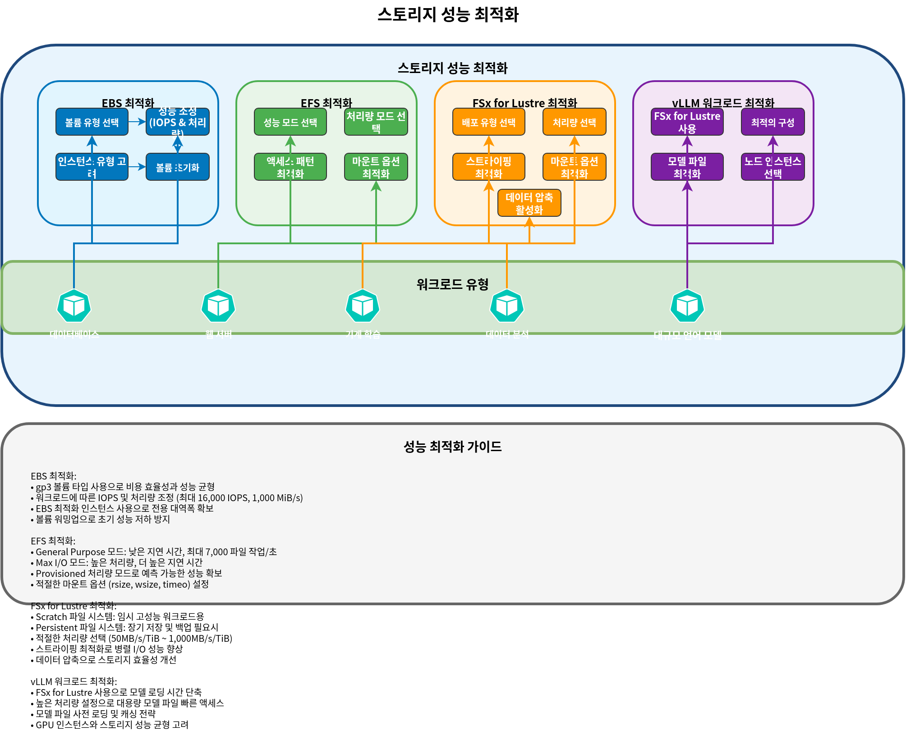

# Parte 2: Storage Classes

Este documento es la segunda parte de la serie de almacenamiento de Amazon EKS, y cubre FSx for Lustre, Amazon S3, snapshots, expansión de volúmenes y optimización de rendimiento.

## Tabla de contenidos

1. [Amazon FSx for Lustre](04-eks-storage-part2.md#amazon-fsx-for-lustre)
2. [Integración de almacenamiento de Amazon S3](04-eks-storage-part2.md#amazon-s3-storage-integration)
3. [Snapshots y backups](04-eks-storage-part2.md#snapshots-and-backups)
4. [Expansión y redimensionamiento de volúmenes](04-eks-storage-part2.md#volume-expansion-and-resizing)
5. [Clonación de volúmenes](04-eks-storage-part2.md#volume-cloning)
6. [Multi-Attach EBS](04-eks-storage-part2.md#multi-attach-ebs)
7. [Análisis profundo de Mountpoint for S3 CSI](04-eks-storage-part2.md#mountpoint-for-s3-csi-deep-dive)
8. [Optimización del rendimiento de almacenamiento](04-eks-storage-part2.md#storage-performance-optimization)

## Amazon FSx for Lustre

Amazon FSx for Lustre es un file system de alto rendimiento para workloads intensivos en cómputo, como high-performance computing (HPC), machine learning y procesamiento de big data. Lustre es un file system distribuido paralelo que proporciona alto throughput y baja latencia, accesible simultáneamente desde miles de clientes.


### Instalación del FSx for Lustre CSI Driver

Sigue estos pasos para instalar el FSx for Lustre CSI driver:

1. Crea un rol de IAM:

```bash
eksctl create iamserviceaccount \
  --name fsx-csi-controller-sa \
  --namespace kube-system \
  --cluster my-cluster \
  --attach-policy-arn arn:aws:iam::aws:policy/AmazonFSxFullAccess \
  --approve \
  --role-only \
  --role-name AmazonEKS_FSx_Lustre_CSI_DriverRole
```

2. Instala el driver usando Helm:

```bash
helm repo add aws-fsx-csi-driver https://kubernetes-sigs.github.io/aws-fsx-csi-driver/
helm repo update
helm upgrade -i aws-fsx-csi-driver aws-fsx-csi-driver/aws-fsx-csi-driver \
  --namespace kube-system \
  --set controller.serviceAccount.create=false \
  --set controller.serviceAccount.name=fsx-csi-controller-sa
```

### Creación de un file system FSx for Lustre

Puedes usar AWS CLI para crear un file system FSx for Lustre:

```bash
# Get VPC ID and subnet ID of EKS cluster
VPC_ID=$(aws eks describe-cluster \
  --name my-cluster \
  --query "cluster.resourcesVpcConfig.vpcId" \
  --output text)

SUBNET_ID=$(aws ec2 describe-subnets \
  --filters "Name=vpc-id,Values=$VPC_ID" \
  --query "Subnets[0].SubnetId" \
  --output text)

# Create security group
SECURITY_GROUP_ID=$(aws ec2 create-security-group \
  --group-name FsxLustreSecurityGroup \
  --description "Security group for FSx Lustre file system" \
  --vpc-id $VPC_ID \
  --output text)

# Allow Lustre traffic
aws ec2 authorize-security-group-ingress \
  --group-id $SECURITY_GROUP_ID \
  --protocol tcp \
  --port 988 \
  --cidr $VPC_CIDR

# Create FSx for Lustre file system
FILE_SYSTEM_ID=$(aws fsx create-file-system \
  --file-system-type LUSTRE \
  --storage-capacity 1200 \
  --subnet-ids $SUBNET_ID \
  --lustre-configuration DeploymentType=SCRATCH_2,PerUnitStorageThroughput=125 \
  --security-group-ids $SECURITY_GROUP_ID \
  --tags Key=Name,Value=MyLustreFileSystem \
  --query "FileSystem.FileSystemId" \
  --output text)
```

### Creación de una Storage Class de FSx for Lustre

Crea una storage class que use FSx for Lustre:

```yaml
apiVersion: storage.k8s.io/v1
kind: StorageClass
metadata:
  name: fsx-lustre-sc
provisioner: fsx.csi.aws.com
parameters:
  deploymentType: SCRATCH_2
  storageCapacity: "1200"
  perUnitStorageThroughput: "125"
  automaticBackupRetentionDays: "0"
  dailyAutomaticBackupStartTime: "00:00"
  copyTagsToBackups: "false"
  dataCompressionType: "NONE"
  driveCacheType: "NONE"
  storageType: "SSD"
  mountName: "fsx-lustre-fs"
```

### Creación de PVC y montaje en un Pod

1. Crea el PVC:

```yaml
apiVersion: v1
kind: PersistentVolumeClaim
metadata:
  name: fsx-claim
spec:
  accessModes:
    - ReadWriteMany
  storageClassName: fsx-lustre-sc
  resources:
    requests:
      storage: 1200Gi
```

2. Monta el PVC en el pod:

```yaml
apiVersion: v1
kind: Pod
metadata:
  name: app-with-fsx
spec:
  containers:
  - name: app
    image: nvidia/cuda:11.6.0-base-ubuntu20.04
    command: ["sleep", "infinity"]
    volumeMounts:
    - mountPath: "/data"
      name: fsx-volume
  volumes:
  - name: fsx-volume
    persistentVolumeClaim:
      claimName: fsx-claim
```

### Aprovisionamiento estático para montaje de FSx for Lustre

También puedes montar estáticamente un file system FSx for Lustre ya creado:

```yaml
apiVersion: v1
kind: PersistentVolume
metadata:
  name: fsx-lustre-pv
spec:
  capacity:
    storage: 1200Gi
  volumeMode: Filesystem
  accessModes:
    - ReadWriteMany
  persistentVolumeReclaimPolicy: Retain
  storageClassName: fsx-lustre-sc
  csi:
    driver: fsx.csi.aws.com
    volumeHandle: fs-0123456789abcdef0
    volumeAttributes:
      dnsname: fs-0123456789abcdef0.fsx.us-west-2.amazonaws.com
      mountname: fsx
```

### Tipos de Deployment de FSx for Lustre

FSx for Lustre ofrece varios tipos de deployment para cumplir diferentes requisitos de workload:

1. **Scratch File Systems**:
   * **Scratch 1**: File system optimizado para costos para almacenamiento y procesamiento a corto plazo
   * **Scratch 2**: Proporciona mayor burst throughput y mejor durabilidad de datos que Scratch 1
2. **Persistent File Systems**:
   * **Persistent 1**: File system para almacenamiento a largo plazo y workloads críticos para el throughput
   * **Persistent 2**: Proporciona mayor throughput que Persistent 1

### Configuración de FSx for Lustre para vLLM

Considera la siguiente configuración para optimizar FSx for Lustre para workloads de AI a gran escala como vLLM (Vector Language Model):

```yaml
apiVersion: storage.k8s.io/v1
kind: StorageClass
metadata:
  name: fsx-lustre-vllm
provisioner: fsx.csi.aws.com
parameters:
  deploymentType: PERSISTENT_2
  storageCapacity: "4800"  # 4.8TB
  perUnitStorageThroughput: "1000"  # 1000 MB/s per TiB
  dataCompressionType: "LZ4"  # Enable data compression
  mountName: "vllm-models"
```

Esta configuración proporciona los siguientes beneficios:

* El alto throughput reduce el tiempo de carga del modelo
* La compresión de datos mejora la eficiencia de almacenamiento
* Acceso simultáneo a los mismos archivos de modelo desde múltiples nodes

## Integración de almacenamiento de Amazon S3

Amazon S3 es un servicio de almacenamiento de objetos que puede almacenar y recuperar cantidades ilimitadas de datos. En Kubernetes, S3 no se puede montar directamente como un Volume, pero hay varias formas de integrarlo con S3.


### Configuración de IRSA para acceso a S3

Configura IAM Roles for Service Accounts (IRSA) para que los pods accedan a S3:

```bash
eksctl create iamserviceaccount \
  --name s3-access-sa \
  --namespace default \
  --cluster my-cluster \
  --attach-policy-arn arn:aws:iam::aws:policy/AmazonS3ReadOnlyAccess \
  --approve
```

### Configuración de Pod para acceso a S3

Pod que usa service account para acceder a S3:

```yaml
apiVersion: v1
kind: Pod
metadata:
  name: s3-access-pod
spec:
  serviceAccountName: s3-access-sa
  containers:
  - name: app
    image: amazon/aws-cli:latest
    command: ["sleep", "infinity"]
```

### Montaje de S3A File System

Puedes usar el file system Hadoop S3A para acceder a S3 de una manera similar a HDFS:

```yaml
apiVersion: v1
kind: Pod
metadata:
  name: hadoop-s3a-pod
spec:
  serviceAccountName: s3-access-sa
  containers:
  - name: hadoop
    image: apache/hadoop:3.3.1
    env:
    - name: HADOOP_HOME
      value: /opt/hadoop
    - name: HADOOP_CONF_DIR
      value: /opt/hadoop/etc/hadoop
    - name: AWS_REGION
      value: us-west-2
    command: ["sleep", "infinity"]
    volumeMounts:
    - name: hadoop-config
      mountPath: /opt/hadoop/etc/hadoop
  volumes:
  - name: hadoop-config
    configMap:
      name: hadoop-config
---
apiVersion: v1
kind: ConfigMap
metadata:
  name: hadoop-config
data:
  core-site.xml: |
    <?xml version="1.0" encoding="UTF-8"?>
    <configuration>
      <property>
        <name>fs.s3a.aws.credentials.provider</name>
        <value>com.amazonaws.auth.WebIdentityTokenCredentialsProvider</value>
      </property>
      <property>
        <name>fs.s3a.endpoint</name>
        <value>s3.us-west-2.amazonaws.com</value>
      </property>
    </configuration>
```

### Montaje de S3 Bucket con CSI Driver

Puedes montar S3 buckets como volúmenes de Kubernetes usando el [AWS S3 CSI driver](https://github.com/awslabs/mountpoint-s3-csi-driver):

1. Instala el driver:

```bash
helm repo add aws-mountpoint-s3-csi-driver https://awslabs.github.io/mountpoint-s3-csi-driver
helm repo update
helm upgrade --install aws-mountpoint-s3-csi-driver aws-mountpoint-s3-csi-driver/aws-mountpoint-s3-csi-driver \
  --namespace kube-system \
  --set controller.serviceAccount.create=false \
  --set controller.serviceAccount.name=s3-csi-controller-sa
```

2. Crea la storage class:

```yaml
apiVersion: storage.k8s.io/v1
kind: StorageClass
metadata:
  name: s3-sc
provisioner: s3.csi.aws.com
parameters:
  bucketName: my-eks-bucket
  mountOptions: "--cache-control-max-ttl 0"
```

3. Crea el PVC y el pod:

```yaml
apiVersion: v1
kind: PersistentVolumeClaim
metadata:
  name: s3-claim
spec:
  accessModes:
    - ReadWriteMany
  storageClassName: s3-sc
  resources:
    requests:
      storage: 1Gi
---
apiVersion: v1
kind: Pod
metadata:
  name: app-with-s3
spec:
  serviceAccountName: s3-access-sa
  containers:
  - name: app
    image: nginx
    volumeMounts:
    - mountPath: "/data"
      name: s3-volume
  volumes:
  - name: s3-volume
    persistentVolumeClaim:
      claimName: s3-claim
```

### Casos de uso de S3

Amazon S3 es adecuado para los siguientes casos de uso:

1. **Data Lake**: Repositorio central para analítica de datos a gran escala
2. **Backup y Archive**: Retención de datos a largo plazo
3. **Static Web Content**: Servir contenido estático como imágenes, videos y documentos
4. **ML Model Repository**: Almacenamiento de archivos de modelos entrenados
5. **Logs y Audit Data**: Almacenamiento de archivos de log y datos de auditoría

## Snapshots y backups

En Kubernetes, puedes usar volume snapshots para hacer backup y restaurar datos de PV.


### Instalación del Volume Snapshot Controller

Instala el snapshot controller para usar la funcionalidad de volume snapshot:

```bash
kubectl apply -f https://raw.githubusercontent.com/kubernetes-csi/external-snapshotter/master/client/config/crd/snapshot.storage.k8s.io_volumesnapshotclasses.yaml
kubectl apply -f https://raw.githubusercontent.com/kubernetes-csi/external-snapshotter/master/client/config/crd/snapshot.storage.k8s.io_volumesnapshotcontents.yaml
kubectl apply -f https://raw.githubusercontent.com/kubernetes-csi/external-snapshotter/master/client/config/crd/snapshot.storage.k8s.io_volumesnapshots.yaml

kubectl apply -f https://raw.githubusercontent.com/kubernetes-csi/external-snapshotter/master/deploy/kubernetes/snapshot-controller/rbac-snapshot-controller.yaml
kubectl apply -f https://raw.githubusercontent.com/kubernetes-csi/external-snapshotter/master/deploy/kubernetes/snapshot-controller/setup-snapshot-controller.yaml
```

### Creación de una Volume Snapshot Class

Crea una snapshot class para volúmenes EBS:

```yaml
apiVersion: snapshot.storage.k8s.io/v1
kind: VolumeSnapshotClass
metadata:
  name: ebs-snapshot-class
driver: ebs.csi.aws.com
deletionPolicy: Delete
parameters:
  csi.storage.k8s.io/snapshotter-secret-name: ""
  csi.storage.k8s.io/snapshotter-secret-namespace: ""
```

### Creación de Volume Snapshot

Crea un snapshot del PVC:

```yaml
apiVersion: snapshot.storage.k8s.io/v1
kind: VolumeSnapshot
metadata:
  name: ebs-volume-snapshot
spec:
  volumeSnapshotClassName: ebs-snapshot-class
  source:
    persistentVolumeClaimName: ebs-claim
```

### Restauración de PVC desde Snapshot

Crea un nuevo PVC desde un snapshot:

```yaml
apiVersion: v1
kind: PersistentVolumeClaim
metadata:
  name: ebs-claim-restored
spec:
  accessModes:
    - ReadWriteOnce
  storageClassName: ebs-gp3
  resources:
    requests:
      storage: 10Gi
  dataSource:
    name: ebs-volume-snapshot
    kind: VolumeSnapshot
    apiGroup: snapshot.storage.k8s.io
```

### Automatización de snapshots regulares

Puedes automatizar backups y restauraciones regulares usando [Velero](https://velero.io/):

1. Instala Velero:

```bash
# Install Velero CLI
brew install velero

# Install Velero server
velero install \
  --provider aws \
  --plugins velero/velero-plugin-for-aws:v1.5.0 \
  --bucket velero-backup-bucket \
  --backup-location-config region=us-west-2 \
  --snapshot-location-config region=us-west-2 \
  --secret-file ./credentials-velero
```

2. Crea un schedule de backup:

```bash
velero schedule create daily-backup \
  --schedule="0 1 * * *" \
  --include-namespaces=default,app-namespace
```

3. Restaura a un punto específico en el tiempo:

```bash
velero restore create --from-backup daily-backup-20250710010000
```

## Expansión y redimensionamiento de volúmenes

En Kubernetes, puedes expandir el tamaño de un PVC para aumentar la capacidad de almacenamiento.


### Habilitación de expansión de volúmenes

Habilita la expansión de volúmenes en la storage class:

```yaml
apiVersion: storage.k8s.io/v1
kind: StorageClass
metadata:
  name: ebs-gp3-expandable
provisioner: ebs.csi.aws.com
parameters:
  type: gp3
allowVolumeExpansion: true
```

### Expansión del tamaño del PVC

Expande el tamaño del PVC:

```yaml
apiVersion: v1
kind: PersistentVolumeClaim
metadata:
  name: ebs-claim
spec:
  accessModes:
    - ReadWriteOnce
  storageClassName: ebs-gp3-expandable
  resources:
    requests:
      storage: 20Gi  # Expanded from original 10Gi to 20Gi
```

### Expansión del file system

Después de la expansión del volumen, es posible que debas expandir el file system:

1. Expansión online (cuando el pod está en ejecución):
   * El EBS CSI driver expande automáticamente el file system.
2. Expansión offline (cuando se requiere expansión manual):
   * Conéctate al pod y ejecuta el comando de expansión del file system:

```bash
# For ext4 file system
resize2fs /dev/xvdf

# For xfs file system
xfs_growfs /data
```

### Mejores prácticas de redimensionamiento de volúmenes

1. **Establece un tamaño inicial adecuado**: Establece un tamaño inicial del volumen ligeramente mayor que lo necesario
2. **Configura monitoreo**: Monitorea el uso del volumen y configura alertas
3. **Expansión gradual**: Expande gradualmente el tamaño del volumen según sea necesario
4. **Planifica el downtime**: Algunas expansiones del file system pueden requerir downtime
5. **Considera la automatización**: Implementa políticas de expansión automática

## Clonación de volúmenes

La clonación de volúmenes permite crear un nuevo PVC desde un PVC existente sin pasar por el proceso de snapshot. Esto es útil para crear entornos de prueba, depurar problemas de datos de producción o aprovisionar rápidamente nuevos workloads con datos existentes.

### Concepto de clonación de volúmenes EBS CSI

El EBS CSI driver admite la clonación de PVC usando el campo `dataSource`. Cuando clonas un volumen, el CSI driver crea un nuevo volumen EBS desde un snapshot del volumen de origen, pero este proceso se abstrae del usuario.

Características clave de la clonación de volúmenes:

* El clon es independiente del PVC de origen
* Los cambios en el clon no afectan al origen
* El clon hereda la storage class del origen, salvo que se especifique lo contrario
* Tanto el origen como el clon deben estar en el mismo namespace

### Uso del campo dataSource

Para crear un clon, especifica el PVC de origen en el campo `dataSource`:

```yaml
apiVersion: v1
kind: PersistentVolumeClaim
metadata:
  name: ebs-clone
spec:
  accessModes:
    - ReadWriteOnce
  storageClassName: ebs-gp3
  resources:
    requests:
      storage: 10Gi
  dataSource:
    kind: PersistentVolumeClaim
    name: ebs-source-pvc
```

### Comparación entre clon y snapshot

| Característica        | Clon de volumen       | Volume Snapshot                              |
| --------------------- | --------------------- | -------------------------------------------- |
| Velocidad de creación | Rápida (un solo paso) | Dos pasos (crear snapshot y luego restaurar) |
| Overhead de almacenamiento | Copia completa inmediata | Almacenamiento incremental                   |
| Cross-Namespace       | No                    | Sí (con VolumeSnapshotContent)               |
| Point-in-Time         | Al crear el clon      | Cualquier snapshot guardado                  |
| Caso de uso           | Duplicación rápida    | Backup y recuperación                        |

### Ejemplo YAML de clon de volumen

Ejemplo completo para clonar un volumen de database:

```yaml
# Source PVC (existing)
apiVersion: v1
kind: PersistentVolumeClaim
metadata:
  name: postgres-data
  namespace: production
spec:
  accessModes:
    - ReadWriteOnce
  storageClassName: ebs-gp3
  resources:
    requests:
      storage: 100Gi
---
# Clone for testing
apiVersion: v1
kind: PersistentVolumeClaim
metadata:
  name: postgres-data-test
  namespace: production
spec:
  accessModes:
    - ReadWriteOnce
  storageClassName: ebs-gp3
  resources:
    requests:
      storage: 100Gi
  dataSource:
    kind: PersistentVolumeClaim
    name: postgres-data
---
# Pod using the cloned volume
apiVersion: v1
kind: Pod
metadata:
  name: postgres-test
  namespace: production
spec:
  containers:
  - name: postgres
    image: postgres:15
    volumeMounts:
    - mountPath: /var/lib/postgresql/data
      name: postgres-storage
    env:
    - name: POSTGRES_PASSWORD
      value: testpassword
  volumes:
  - name: postgres-storage
    persistentVolumeClaim:
      claimName: postgres-data-test
```

## Multi-Attach EBS

Multi-Attach permite adjuntar un único volumen EBS a múltiples instancias EC2 simultáneamente. Esta característica está disponible para volúmenes io1 e io2 Block Express y es útil para aplicaciones clustered que requieren almacenamiento compartido de alto rendimiento.

### Multi-Attachment io1/io2 Block Express

Multi-Attach solo es compatible con volúmenes Provisioned IOPS SSD:

* **io1**: Hasta 16 adjuntos simultáneos
* **io2 Block Express**: Hasta 16 adjuntos simultáneos con mayor rendimiento

Requisitos:

* Las instancias deben estar en la misma Availability Zone que el volumen
* Las instancias deben ser instancias EC2 basadas en Nitro
* El volumen debe usar modo Block device (no modo Filesystem)

### ¿Por qué no ReadWriteMany?

EBS Multi-Attach no admite el modo de acceso `ReadWriteMany` en el sentido tradicional porque:

1. **Modo Block requerido**: Multi-Attach funciona solo con dispositivos de bloque sin procesar, no con filesystems montados
2. **Sin coordinación de filesystem**: EBS no proporciona coordinación a nivel de filesystem
3. **Responsabilidad de la aplicación**: La aplicación debe manejar el acceso concurrente y la integridad de los datos

El modo de acceso de Kubernetes para Multi-Attach EBS es `ReadWriteOncePod` o mediante Block volumeMode con coordinación a nivel de aplicación (como databases clustered u OCFS2/GFS2).

### Limitaciones

* **Solo la misma AZ**: Todas las instancias adjuntas deben estar en la misma Availability Zone
* **Solo modo Block**: No se puede usar como filesystem compartido sin un filesystem consciente de cluster
* **Instancias Nitro**: Solo compatible con tipos de instancia basados en Nitro
* **Sin resize online**: No se puede redimensionar mientras está adjunto a múltiples instancias
* **Coordinación de la aplicación**: Las aplicaciones deben implementar su propio bloqueo/coordinación

### Casos de uso de Multi-Attach y ejemplo YAML

Casos de uso comunes:

* Databases clustered (Oracle RAC, SQL Server FCI)
* Aplicaciones de alta disponibilidad con estado compartido
* Sistemas de almacenamiento distribuido

```yaml
apiVersion: storage.k8s.io/v1
kind: StorageClass
metadata:
  name: ebs-io2-multi-attach
provisioner: ebs.csi.aws.com
parameters:
  type: io2
  iops: "64000"
  multiAttachEnabled: "true"
volumeBindingMode: WaitForFirstConsumer
---
apiVersion: v1
kind: PersistentVolumeClaim
metadata:
  name: shared-block-pvc
spec:
  accessModes:
    - ReadWriteMany
  volumeMode: Block
  storageClassName: ebs-io2-multi-attach
  resources:
    requests:
      storage: 100Gi
---
apiVersion: apps/v1
kind: StatefulSet
metadata:
  name: clustered-app
spec:
  serviceName: clustered-app
  replicas: 2
  selector:
    matchLabels:
      app: clustered-app
  template:
    metadata:
      labels:
        app: clustered-app
    spec:
      affinity:
        podAntiAffinity:
          requiredDuringSchedulingIgnoredDuringExecution:
          - labelSelector:
              matchLabels:
                app: clustered-app
            topologyKey: kubernetes.io/hostname
      containers:
      - name: app
        image: my-clustered-app:latest
        volumeDevices:
        - name: shared-block
          devicePath: /dev/xvda
      volumes:
      - name: shared-block
        persistentVolumeClaim:
          claimName: shared-block-pvc
```

## Análisis profundo de Mountpoint for S3 CSI

Mountpoint for Amazon S3 es un cliente de archivos que traduce operaciones de file system en llamadas a la S3 object API, lo que permite que las aplicaciones accedan a S3 buckets mediante una interfaz similar a POSIX. El Mountpoint for S3 CSI driver integra esta capacidad con Kubernetes.

### Características de rendimiento

Mountpoint for S3 está optimizado para patrones de acceso específicos:

**Optimización de lectura secuencial**:

* Rendimiento excelente para lecturas secuenciales grandes
* Prefetching automático para patrones de acceso predecibles
* El throughput escala con el tamaño del objeto
* Ideal para workloads de analítica de datos y entrenamiento de ML

**Limitaciones de escritura aleatoria**:

* S3 es un object store, no un block store
* Las escrituras aleatorias requieren reescribir objetos completos
* Las operaciones append crean nuevas versiones de objetos
* No es adecuado para workloads de database ni aplicaciones que requieren I/O aleatorio

Benchmarks de rendimiento (aproximados):

| Operación                      | Rendimiento                         |
| ------------------------------ | ----------------------------------- |
| Lectura secuencial (archivos grandes) | Hasta 100 Gbps agregado             |
| Escritura secuencial (archivos nuevos) | Hasta 50 Gbps agregado              |
| Lectura aleatoria (archivos pequeños) | Mayor latencia, menor throughput    |
| Escritura aleatoria            | No recomendado                      |

### Limitaciones

Mountpoint for S3 tiene varias limitaciones de compatibilidad POSIX:

* **Sin hard links**: No se admiten hard links
* **Sin symbolic links**: No se admiten symbolic links
* **Sin chmod/chown**: Los permisos de archivos no se pueden cambiar después de la creación
* **Sin file locking**: Los locks advisory y mandatory no están disponibles
* **Sin sparse files**: No se admiten operaciones de sparse file
* **Sin extended attributes**: No se admiten operaciones xattr
* **Consistencia eventual**: Las operaciones de listado pueden no reflejar inmediatamente escrituras recientes
* **Sin rename entre directorios**: Rename solo se admite dentro del mismo directorio
* **Sin append a archivos existentes**: Debe reescribirse todo el objeto

### Configuración de caché

Mountpoint for S3 proporciona opciones de caché para mejorar el rendimiento:

**Metadata Cache**:

```yaml
parameters:
  mountOptions: "--metadata-ttl 60"  # Cache metadata for 60 seconds
```

**Data Cache** (para workloads con muchas lecturas):

```yaml
parameters:
  mountOptions: "--cache /tmp/s3-cache --max-cache-size 10737418240"  # 10GB cache
```

Ejemplo completo de configuración de caché:

```yaml
apiVersion: storage.k8s.io/v1
kind: StorageClass
metadata:
  name: s3-cached
provisioner: s3.csi.aws.com
parameters:
  bucketName: my-ml-data-bucket
  mountOptions: |
    --metadata-ttl 300
    --cache /tmp/mountpoint-cache
    --max-cache-size 53687091200
    --read-part-size 8388608
    --prefetch-bytes 20971520
```

### Ejemplo de escenario de entrenamiento con dataset grande

Mountpoint for S3 es ideal para workloads de entrenamiento de ML que leen datasets grandes:

```yaml
apiVersion: storage.k8s.io/v1
kind: StorageClass
metadata:
  name: s3-ml-training
provisioner: s3.csi.aws.com
parameters:
  bucketName: ml-training-datasets
  mountOptions: |
    --read-part-size 8388608
    --prefetch-bytes 52428800
    --metadata-ttl 3600
    --cache /tmp/s3-cache
    --max-cache-size 107374182400
---
apiVersion: v1
kind: PersistentVolumeClaim
metadata:
  name: training-data
spec:
  accessModes:
    - ReadOnlyMany
  storageClassName: s3-ml-training
  resources:
    requests:
      storage: 1Ti
---
apiVersion: batch/v1
kind: Job
metadata:
  name: ml-training-job
spec:
  parallelism: 4
  template:
    spec:
      serviceAccountName: ml-training-sa
      containers:
      - name: trainer
        image: pytorch/pytorch:2.0.1-cuda11.7-cudnn8-runtime
        resources:
          limits:
            nvidia.com/gpu: 1
            memory: 64Gi
          requests:
            memory: 32Gi
        command:
        - python
        - /app/train.py
        - --data-dir=/data
        - --epochs=100
        volumeMounts:
        - name: training-data
          mountPath: /data
          readOnly: true
        - name: model-output
          mountPath: /models
      volumes:
      - name: training-data
        persistentVolumeClaim:
          claimName: training-data
      - name: model-output
        persistentVolumeClaim:
          claimName: model-output-pvc
      restartPolicy: Never
      nodeSelector:
        node.kubernetes.io/instance-type: p4d.24xlarge
```

Optimizaciones clave en este ejemplo:

* **Acceso ReadOnlyMany**: Múltiples training pods pueden leer simultáneamente
* **Prefetch grande**: El prefetch de 50 MB reduce la latencia de lectura
* **Caché local**: Caché de 100 GB para datos accedidos frecuentemente
* **Tipo de instancia adecuado**: Instancia GPU con alto ancho de banda de red

## Optimización del rendimiento de almacenamiento

Exploremos varias estrategias para optimizar el rendimiento de almacenamiento en EKS.



### Optimización de rendimiento de EBS

1. **Selecciona el tipo de volumen adecuado**:
   * Workloads generales: gp3
   * Databases de alto rendimiento: io2
   * Workloads centrados en throughput: st1
2. **Ajuste de rendimiento de volúmenes gp3**:

```yaml
apiVersion: storage.k8s.io/v1
kind: StorageClass
metadata:
  name: ebs-gp3-high-perf
provisioner: ebs.csi.aws.com
parameters:
  type: gp3
  iops: "16000"  # Up to 16,000 IOPS
  throughput: "1000"  # Up to 1,000 MiB/s
```

3. **Considera el tipo de instancia**:
   * Usa instancias optimizadas para EBS
   * Selecciona instancias con suficiente ancho de banda de red
4. **Inicialización de volúmenes**:
   * Considera inicializar volúmenes nuevos antes de usarlos:

```bash
dd if=/dev/zero of=/dev/xvdf bs=1M count=1000 oflag=direct
```

### Optimización de rendimiento de EFS

1. **Selecciona el modo de rendimiento adecuado**:
   * La mayoría de workloads: modo General Purpose
   * Workloads de alta concurrencia: modo Max I/O
2. **Selecciona el modo de throughput**:
   * Workloads predecibles: Provisioned throughput
   * Workloads variables: Bursting o Elastic throughput
3. **Optimiza los patrones de acceso**:
   * Operaciones con archivos grandes: usa tamaños de I/O grandes
   * Acceso paralelo: usa múltiples threads o procesos
4. **Optimiza las opciones de montaje**:

```yaml
apiVersion: v1
kind: Pod
metadata:
  name: efs-app
spec:
  containers:
  - name: app
    image: nginx
    volumeMounts:
    - mountPath: "/data"
      name: efs-volume
  volumes:
  - name: efs-volume
    persistentVolumeClaim:
      claimName: efs-claim
    mountOptions:
      - nfsvers=4.1
      - rsize=1048576
      - wsize=1048576
      - timeo=600
      - retrans=2
      - noresvport
```

### Optimización de rendimiento de FSx for Lustre

1. **Selecciona el tipo de deployment y throughput adecuados**:
   * Requisitos de alto throughput: PERSISTENT\_2 + alto throughput
   * Workloads temporales rentables: SCRATCH\_2
2. **Optimiza el striping**:
   * Archivos grandes: stripe en múltiples OSTs (Object Storage Targets)
   * Archivos pequeños: almacenar en un solo OST
3. **Opciones de montaje del cliente**:

```yaml
mountOptions:
  - flock
  - noatime
  - relatime
```

4. **Habilita la compresión de datos**:

```yaml
parameters:
  dataCompressionType: "LZ4"
```

### Optimización de almacenamiento para workloads de vLLM

Optimización de almacenamiento para workloads de large language model como vLLM:

1. **Usa FSx for Lustre**:
   * El alto throughput reduce el tiempo de carga del modelo
   * Acceso simultáneo a los mismos archivos de modelo desde múltiples nodes
2. **Configuración óptima**:

```yaml
apiVersion: storage.k8s.io/v1
kind: StorageClass
metadata:
  name: fsx-lustre-vllm
provisioner: fsx.csi.aws.com
parameters:
  deploymentType: PERSISTENT_2
  storageCapacity: "4800"  # 4.8TB
  perUnitStorageThroughput: "1000"  # 1000 MB/s per TiB
  dataCompressionType: "LZ4"  # Enable data compression
```

3. **Optimización de archivos de modelo**:
   * Precarga los archivos de modelo en memoria
   * Considera la cuantización del modelo
   * Implementa model sharding
4. **Selección del tipo de instancia de node**:
   * Selecciona instancias con suficiente memoria y ancho de banda de red
   * Considera soporte de EFA (Elastic Fabric Adapter) para instancias GPU

## Conclusión

Este documento cubrió FSx for Lustre, S3, snapshots, expansión de volúmenes y optimización de rendimiento en Amazon EKS. Cada opción de almacenamiento tiene diferentes características y casos de uso, por lo que es importante seleccionar y optimizar la solución de almacenamiento adecuada para los requisitos de tu aplicación.

La siguiente parte cubrirá monitoreo, troubleshooting, optimización de costos y seguridad para el almacenamiento de EKS.

## Referencias

* [Amazon FSx for Lustre CSI Driver](https://github.com/kubernetes-sigs/aws-fsx-csi-driver)
* [Amazon S3 CSI Driver](https://github.com/awslabs/mountpoint-s3-csi-driver)
* [Kubernetes Volume Snapshots](https://kubernetes.io/docs/concepts/storage/volume-snapshots/)
* [Velero Backup and Restore](https://velero.io/docs/)
* [Amazon EKS Storage Best Practices](https://aws.github.io/aws-eks-best-practices/storage/)

## Quiz

Para probar lo que has aprendido en este capítulo, intenta el [quiz del tema](../quizzes/eks/04-eks-storage-part2-quiz.md).
