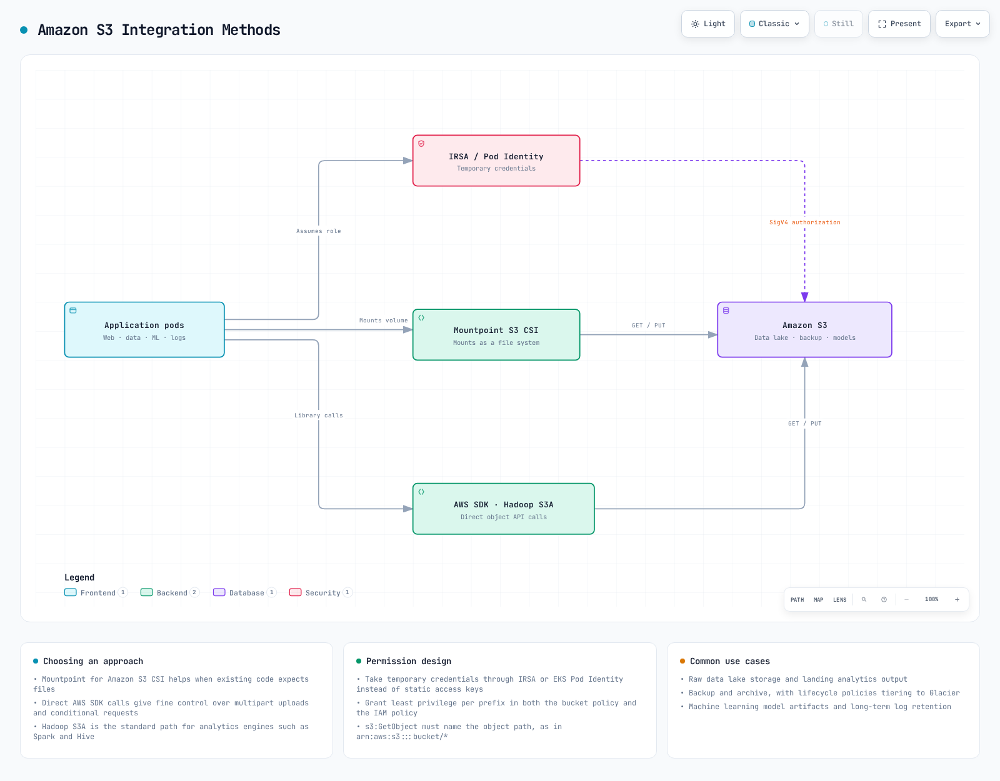
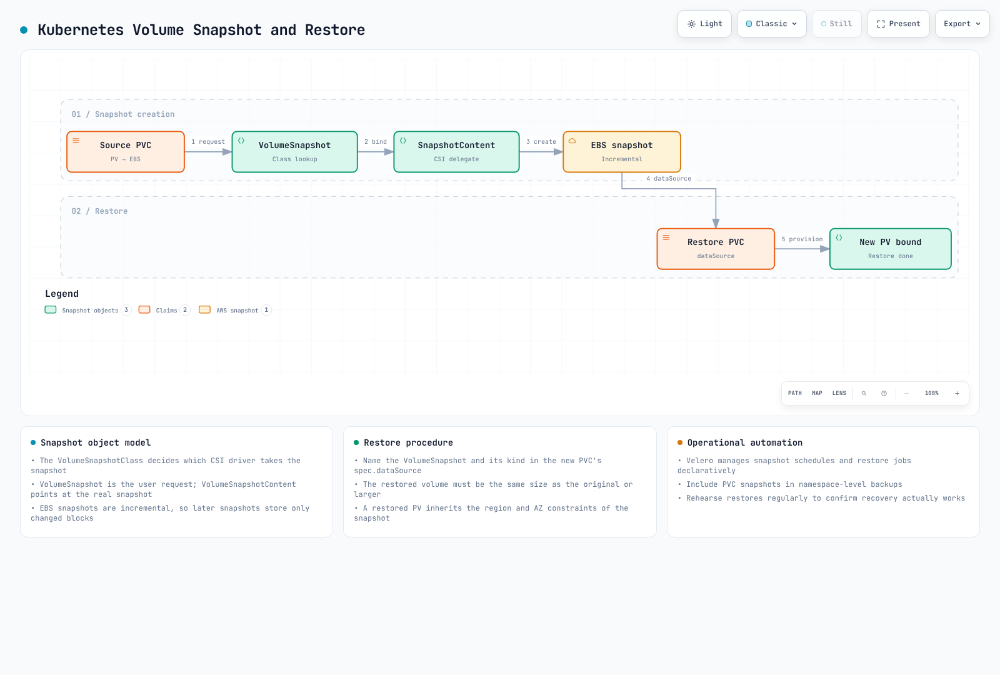

# Parte 2: Clases de almacenamiento

Este documento es la segunda parte de la serie sobre almacenamiento de Amazon EKS y cubre FSx for Lustre, Amazon S3, snapshots, expansión de volúmenes y optimización del rendimiento.

## Tabla de contenidos

1. [Amazon FSx for Lustre](04-eks-storage-part2.md#amazon-fsx-for-lustre)
2. [Integración de almacenamiento de Amazon S3](04-eks-storage-part2.md#amazon-s3-storage-integration)
3. [Snapshots y copias de seguridad](04-eks-storage-part2.md#snapshots-and-backups)
4. [Expansión y redimensionamiento de volúmenes](04-eks-storage-part2.md#volume-expansion-and-resizing)
5. [Clonación de volúmenes](04-eks-storage-part2.md#volume-cloning)
6. [Multi-Attach de EBS](04-eks-storage-part2.md#multi-attach-ebs)
7. [Análisis detallado de Mountpoint for S3 CSI](04-eks-storage-part2.md#mountpoint-for-s3-csi-deep-dive)
8. [Optimización del rendimiento de almacenamiento](04-eks-storage-part2.md#storage-performance-optimization)

## Amazon FSx for Lustre

Amazon FSx for Lustre es un sistema de archivos de alto rendimiento para cargas de trabajo de cómputo intensivo, como computación de alto rendimiento (HPC), machine learning y procesamiento de big data. Lustre es un sistema de archivos distribuido en paralelo que proporciona alto rendimiento y baja latencia, accesible simultáneamente desde miles de clientes.


[🔍 Ver diagrama interactivo](https://www.atomai.click/kubernetes-docs/archmaps/en-eks-04-eks-storage-part2-0.html)

### Instalación del driver FSx for Lustre CSI

Siga estos pasos para instalar el driver FSx for Lustre CSI:

1. Cree un rol de IAM:

```bash
eksctl create iamserviceaccount \
  --name fsx-csi-controller-sa \
  --namespace kube-system \
  --cluster my-cluster \
  --attach-policy-arn arn:aws:iam::aws:policy/AmazonFSxFullAccess \
  --approve \
  --role-only \
  --role-name AmazonEKS_FSx_Lustre_CSI_DriverRole
```

2. Instale el driver con Helm:

```bash
helm repo add aws-fsx-csi-driver https://kubernetes-sigs.github.io/aws-fsx-csi-driver/
helm repo update
helm upgrade -i aws-fsx-csi-driver aws-fsx-csi-driver/aws-fsx-csi-driver \
  --namespace kube-system \
  --set controller.serviceAccount.create=false \
  --set controller.serviceAccount.name=fsx-csi-controller-sa
```

### Creación de un sistema de archivos FSx for Lustre

Puede usar AWS CLI para crear un sistema de archivos FSx for Lustre:

```bash
# Get VPC ID and subnet ID of EKS cluster
VPC_ID=$(aws eks describe-cluster \
  --name my-cluster \
  --query "cluster.resourcesVpcConfig.vpcId" \
  --output text)

SUBNET_ID=$(aws ec2 describe-subnets \
  --filters "Name=vpc-id,Values=$VPC_ID" \
  --query "Subnets[0].SubnetId" \
  --output text)

# Create security group
SECURITY_GROUP_ID=$(aws ec2 create-security-group \
  --group-name FsxLustreSecurityGroup \
  --description "Security group for FSx Lustre file system" \
  --vpc-id $VPC_ID \
  --output text)

# Allow Lustre traffic
aws ec2 authorize-security-group-ingress \
  --group-id $SECURITY_GROUP_ID \
  --protocol tcp \
  --port 988 \
  --cidr $VPC_CIDR

# Create FSx for Lustre file system
FILE_SYSTEM_ID=$(aws fsx create-file-system \
  --file-system-type LUSTRE \
  --storage-capacity 1200 \
  --subnet-ids $SUBNET_ID \
  --lustre-configuration DeploymentType=SCRATCH_2,PerUnitStorageThroughput=125 \
  --security-group-ids $SECURITY_GROUP_ID \
  --tags Key=Name,Value=MyLustreFileSystem \
  --query "FileSystem.FileSystemId" \
  --output text)
```

### Creación de una StorageClass de FSx for Lustre

Cree una clase de almacenamiento que use FSx for Lustre:

```yaml
apiVersion: storage.k8s.io/v1
kind: StorageClass
metadata:
  name: fsx-lustre-sc
provisioner: fsx.csi.aws.com
parameters:
  deploymentType: SCRATCH_2
  storageCapacity: "1200"
  perUnitStorageThroughput: "125"
  automaticBackupRetentionDays: "0"
  dailyAutomaticBackupStartTime: "00:00"
  copyTagsToBackups: "false"
  dataCompressionType: "NONE"
  driveCacheType: "NONE"
  storageType: "SSD"
  mountName: "fsx-lustre-fs"
```

### Creación de PVC y montaje en un Pod

1. Cree un PVC:

```yaml
apiVersion: v1
kind: PersistentVolumeClaim
metadata:
  name: fsx-claim
spec:
  accessModes:
    - ReadWriteMany
  storageClassName: fsx-lustre-sc
  resources:
    requests:
      storage: 1200Gi
```

2. Monte el PVC en el Pod:

```yaml
apiVersion: v1
kind: Pod
metadata:
  name: app-with-fsx
spec:
  containers:
  - name: app
    image: nvidia/cuda:11.6.0-base-ubuntu20.04
    command: ["sleep", "infinity"]
    volumeMounts:
    - mountPath: "/data"
      name: fsx-volume
  volumes:
  - name: fsx-volume
    persistentVolumeClaim:
      claimName: fsx-claim
```

### Aprovisionamiento estático para el montaje de FSx for Lustre

También puede montar de forma estática un sistema de archivos FSx for Lustre ya creado:

```yaml
apiVersion: v1
kind: PersistentVolume
metadata:
  name: fsx-lustre-pv
spec:
  capacity:
    storage: 1200Gi
  volumeMode: Filesystem
  accessModes:
    - ReadWriteMany
  persistentVolumeReclaimPolicy: Retain
  storageClassName: fsx-lustre-sc
  csi:
    driver: fsx.csi.aws.com
    volumeHandle: fs-0123456789abcdef0
    volumeAttributes:
      dnsname: fs-0123456789abcdef0.fsx.us-west-2.amazonaws.com
      mountname: fsx
```

### Tipos de implementación de FSx for Lustre

FSx for Lustre ofrece varios tipos de implementación para satisfacer diferentes requisitos de carga de trabajo:

1. **Sistemas de archivos Scratch**:
   * **Scratch 1**: Sistema de archivos optimizado en costos para almacenamiento y procesamiento a corto plazo
   * **Scratch 2**: Proporciona mayor rendimiento de ráfaga y mejor durabilidad de los datos que Scratch 1
2. **Sistemas de archivos persistentes**:
   * **Persistent 1**: Sistema de archivos para almacenamiento a largo plazo y cargas de trabajo críticas para el rendimiento
   * **Persistent 2**: Proporciona mayor rendimiento que Persistent 1

### Configuración de FSx for Lustre para vLLM

Considere la siguiente configuración para optimizar FSx for Lustre para cargas de trabajo de IA a gran escala como vLLM (Vector Language Model):

```yaml
apiVersion: storage.k8s.io/v1
kind: StorageClass
metadata:
  name: fsx-lustre-vllm
provisioner: fsx.csi.aws.com
parameters:
  deploymentType: PERSISTENT_2
  storageCapacity: "4800"  # 4.8TB
  perUnitStorageThroughput: "1000"  # 1000 MB/s per TiB
  dataCompressionType: "LZ4"  # Enable data compression
  mountName: "vllm-models"
```

Esta configuración proporciona los siguientes beneficios:

* El alto rendimiento reduce el tiempo de carga del modelo
* La compresión de datos mejora la eficiencia de almacenamiento
* Acceso simultáneo a los mismos archivos de modelo desde varios nodos

## Integración de almacenamiento de Amazon S3

Amazon S3 es un servicio de almacenamiento de objetos que puede almacenar y recuperar cantidades ilimitadas de datos. En Kubernetes, S3 no se puede montar directamente como volumen, pero hay varias formas de integrarlo con S3.



[🔍 Ver diagrama interactivo](https://www.atomai.click/kubernetes-docs/archmaps/en-eks-04-eks-storage-part2-1.html)

### Configuración de IRSA para acceso a S3

Configure IAM Roles for Service Accounts (IRSA) para que los Pods accedan a S3:

```bash
eksctl create iamserviceaccount \
  --name s3-access-sa \
  --namespace default \
  --cluster my-cluster \
  --attach-policy-arn arn:aws:iam::aws:policy/AmazonS3ReadOnlyAccess \
  --approve
```

### Configuración de Pod para acceso a S3

Pod que usa una cuenta de servicio para acceder a S3:

```yaml
apiVersion: v1
kind: Pod
metadata:
  name: s3-access-pod
spec:
  serviceAccountName: s3-access-sa
  containers:
  - name: app
    image: amazon/aws-cli:latest
    command: ["sleep", "infinity"]
```

### Montaje de sistema de archivos S3A

Puede usar el sistema de archivos Hadoop S3A para acceder a S3 de una manera similar a HDFS:

```yaml
apiVersion: v1
kind: Pod
metadata:
  name: hadoop-s3a-pod
spec:
  serviceAccountName: s3-access-sa
  containers:
  - name: hadoop
    image: apache/hadoop:3.3.1
    env:
    - name: HADOOP_HOME
      value: /opt/hadoop
    - name: HADOOP_CONF_DIR
      value: /opt/hadoop/etc/hadoop
    - name: AWS_REGION
      value: us-west-2
    command: ["sleep", "infinity"]
    volumeMounts:
    - name: hadoop-config
      mountPath: /opt/hadoop/etc/hadoop
  volumes:
  - name: hadoop-config
    configMap:
      name: hadoop-config
---
apiVersion: v1
kind: ConfigMap
metadata:
  name: hadoop-config
data:
  core-site.xml: |
    <?xml version="1.0" encoding="UTF-8"?>
    <configuration>
      <property>
        <name>fs.s3a.aws.credentials.provider</name>
        <value>com.amazonaws.auth.WebIdentityTokenCredentialsProvider</value>
      </property>
      <property>
        <name>fs.s3a.endpoint</name>
        <value>s3.us-west-2.amazonaws.com</value>
      </property>
    </configuration>
```

### Montaje de un bucket de S3 con el driver CSI

Puede montar buckets de S3 como volúmenes de Kubernetes mediante el [driver AWS S3 CSI](https://github.com/awslabs/mountpoint-s3-csi-driver):

1. Instale el driver:

```bash
helm repo add aws-mountpoint-s3-csi-driver https://awslabs.github.io/mountpoint-s3-csi-driver
helm repo update
helm upgrade --install aws-mountpoint-s3-csi-driver aws-mountpoint-s3-csi-driver/aws-mountpoint-s3-csi-driver \
  --namespace kube-system \
  --set controller.serviceAccount.create=false \
  --set controller.serviceAccount.name=s3-csi-controller-sa
```

2. Cree una clase de almacenamiento:

```yaml
apiVersion: storage.k8s.io/v1
kind: StorageClass
metadata:
  name: s3-sc
provisioner: s3.csi.aws.com
parameters:
  bucketName: my-eks-bucket
  mountOptions: "--cache-control-max-ttl 0"
```

3. Cree un PVC y un Pod:

```yaml
apiVersion: v1
kind: PersistentVolumeClaim
metadata:
  name: s3-claim
spec:
  accessModes:
    - ReadWriteMany
  storageClassName: s3-sc
  resources:
    requests:
      storage: 1Gi
---
apiVersion: v1
kind: Pod
metadata:
  name: app-with-s3
spec:
  serviceAccountName: s3-access-sa
  containers:
  - name: app
    image: nginx
    volumeMounts:
    - mountPath: "/data"
      name: s3-volume
  volumes:
  - name: s3-volume
    persistentVolumeClaim:
      claimName: s3-claim
```

### Casos de uso de S3

Amazon S3 es adecuado para los siguientes casos de uso:

1. **Data Lake**: Repositorio central para análisis de datos a gran escala
2. **Copia de seguridad y archivo**: Retención de datos a largo plazo
3. **Contenido web estático**: Entrega de contenido estático como imágenes, videos y documentos
4. **Repositorio de modelos de ML**: Almacenamiento de archivos de modelos entrenados
5. **Logs y datos de auditoría**: Almacenamiento de archivos de logs y datos de auditoría

## Snapshots y copias de seguridad

En Kubernetes, puede usar snapshots de volúmenes para realizar copias de seguridad y restaurar datos de PV.



[🔍 Ver diagrama interactivo](https://www.atomai.click/kubernetes-docs/archmaps/en-eks-04-eks-storage-part2-2.html)

### Instalación del controlador de snapshots de volúmenes

Instale el controlador de snapshots para usar la funcionalidad de snapshots de volúmenes:

```bash
kubectl apply -f https://raw.githubusercontent.com/kubernetes-csi/external-snapshotter/master/client/config/crd/snapshot.storage.k8s.io_volumesnapshotclasses.yaml
kubectl apply -f https://raw.githubusercontent.com/kubernetes-csi/external-snapshotter/master/client/config/crd/snapshot.storage.k8s.io_volumesnapshotcontents.yaml
kubectl apply -f https://raw.githubusercontent.com/kubernetes-csi/external-snapshotter/master/client/config/crd/snapshot.storage.k8s.io_volumesnapshots.yaml

kubectl apply -f https://raw.githubusercontent.com/kubernetes-csi/external-snapshotter/master/deploy/kubernetes/snapshot-controller/rbac-snapshot-controller.yaml
kubectl apply -f https://raw.githubusercontent.com/kubernetes-csi/external-snapshotter/master/deploy/kubernetes/snapshot-controller/setup-snapshot-controller.yaml
```

### Creación de una clase de snapshot de volumen

Cree una clase de snapshot para volúmenes EBS:

```yaml
apiVersion: snapshot.storage.k8s.io/v1
kind: VolumeSnapshotClass
metadata:
  name: ebs-snapshot-class
driver: ebs.csi.aws.com
deletionPolicy: Delete
parameters:
  csi.storage.k8s.io/snapshotter-secret-name: ""
  csi.storage.k8s.io/snapshotter-secret-namespace: ""
```

### Creación de un snapshot de volumen

Cree un snapshot del PVC:

```yaml
apiVersion: snapshot.storage.k8s.io/v1
kind: VolumeSnapshot
metadata:
  name: ebs-volume-snapshot
spec:
  volumeSnapshotClassName: ebs-snapshot-class
  source:
    persistentVolumeClaimName: ebs-claim
```

### Restauración de PVC desde un snapshot

Cree un nuevo PVC desde un snapshot:

```yaml
apiVersion: v1
kind: PersistentVolumeClaim
metadata:
  name: ebs-claim-restored
spec:
  accessModes:
    - ReadWriteOnce
  storageClassName: ebs-gp3
  resources:
    requests:
      storage: 10Gi
  dataSource:
    name: ebs-volume-snapshot
    kind: VolumeSnapshot
    apiGroup: snapshot.storage.k8s.io
```

### Automatización de snapshots periódicos

Puede automatizar las copias de seguridad y restauraciones periódicas con [Velero](https://velero.io/):

1. Instale Velero:

```bash
# Install Velero CLI
brew install velero

# Install Velero server
velero install \
  --provider aws \
  --plugins velero/velero-plugin-for-aws:v1.5.0 \
  --bucket velero-backup-bucket \
  --backup-location-config region=us-west-2 \
  --snapshot-location-config region=us-west-2 \
  --secret-file ./credentials-velero
```

2. Cree un calendario de copias de seguridad:

```bash
velero schedule create daily-backup \
  --schedule="0 1 * * *" \
  --include-namespaces=default,app-namespace
```

3. Restaure a un punto específico en el tiempo:

```bash
velero restore create --from-backup daily-backup-20250710010000
```

## Expansión y redimensionamiento de volúmenes

En Kubernetes, puede ampliar el tamaño de un PVC para aumentar la capacidad de almacenamiento.


[🔍 Ver diagrama interactivo](https://www.atomai.click/kubernetes-docs/archmaps/en-eks-04-eks-storage-part2-3.html)

### Habilitación de la expansión de volúmenes

Habilite la expansión de volúmenes en la clase de almacenamiento:

```yaml
apiVersion: storage.k8s.io/v1
kind: StorageClass
metadata:
  name: ebs-gp3-expandable
provisioner: ebs.csi.aws.com
parameters:
  type: gp3
allowVolumeExpansion: true
```

### Ampliación del tamaño de PVC

Amplíe el tamaño del PVC:

```yaml
apiVersion: v1
kind: PersistentVolumeClaim
metadata:
  name: ebs-claim
spec:
  accessModes:
    - ReadWriteOnce
  storageClassName: ebs-gp3-expandable
  resources:
    requests:
      storage: 20Gi  # Expanded from original 10Gi to 20Gi
```

### Expansión del sistema de archivos

Después de la expansión del volumen, quizá deba ampliar el sistema de archivos:

1. Expansión en línea (cuando el Pod está en ejecución):
   * El driver EBS CSI amplía automáticamente el sistema de archivos.
2. Expansión sin conexión (cuando se requiere una expansión manual):
   * Conéctese al Pod y ejecute el comando de expansión del sistema de archivos:

```bash
# For ext4 file system
resize2fs /dev/xvdf

# For xfs file system
xfs_growfs /data
```

### Prácticas recomendadas para el redimensionamiento de volúmenes

1. **Establezca un tamaño inicial adecuado**: Establezca el tamaño inicial del volumen ligeramente por encima de lo necesario
2. **Configure la monitorización**: Supervise el uso del volumen y configure alertas
3. **Expansión gradual**: Amplíe gradualmente el tamaño del volumen según sea necesario
4. **Planifique el tiempo de inactividad**: Algunas expansiones del sistema de archivos pueden requerir tiempo de inactividad
5. **Considere la automatización**: Implemente políticas de expansión automática

## Clonación de volúmenes

La clonación de volúmenes permite crear un nuevo PVC a partir de un PVC existente sin pasar por el proceso de snapshot. Esto es útil para crear entornos de prueba, depurar problemas con datos de producción o aprovisionar rápidamente nuevas cargas de trabajo con datos existentes.

### Concepto de clonación de volúmenes EBS CSI

El driver EBS CSI admite la clonación de PVC mediante el campo `dataSource`. Al clonar un volumen, el driver CSI crea un nuevo volumen EBS a partir de un snapshot del volumen de origen, pero este proceso queda abstraído para el usuario.

Características clave de la clonación de volúmenes:

* El clon es independiente del PVC de origen
* Los cambios en el clon no afectan al origen
* El clon hereda la clase de almacenamiento del origen, a menos que se especifique lo contrario
* Tanto el origen como el clon deben estar en el mismo namespace

### Uso del campo dataSource

Para crear un clon, especifique el PVC de origen en el campo `dataSource`:

```yaml
apiVersion: v1
kind: PersistentVolumeClaim
metadata:
  name: ebs-clone
spec:
  accessModes:
    - ReadWriteOnce
  storageClassName: ebs-gp3
  resources:
    requests:
      storage: 10Gi
  dataSource:
    kind: PersistentVolumeClaim
    name: ebs-source-pvc
```

### Comparación entre clon y snapshot

| Característica          | Clon de volumen        | Snapshot de volumen                         |
| ---------------- | ------------------- | ----------------------------------------- |
| Velocidad de creación   | Rápida (un solo paso)  | Dos pasos (crear snapshot y luego restaurar) |
| Sobrecarga de almacenamiento | Copia completa inmediata | Almacenamiento incremental                       |
| Entre namespaces  | No                  | Sí (con VolumeSnapshotContent)          |
| Punto en el tiempo    | En la creación del clon   | Cualquier snapshot guardado                        |
| Caso de uso         | Duplicación rápida   | Copia de seguridad y recuperación                       |

### Ejemplo YAML de clon de volumen

Ejemplo completo para clonar un volumen de base de datos:

```yaml
# Source PVC (existing)
apiVersion: v1
kind: PersistentVolumeClaim
metadata:
  name: postgres-data
  namespace: production
spec:
  accessModes:
    - ReadWriteOnce
  storageClassName: ebs-gp3
  resources:
    requests:
      storage: 100Gi
---
# Clone for testing
apiVersion: v1
kind: PersistentVolumeClaim
metadata:
  name: postgres-data-test
  namespace: production
spec:
  accessModes:
    - ReadWriteOnce
  storageClassName: ebs-gp3
  resources:
    requests:
      storage: 100Gi
  dataSource:
    kind: PersistentVolumeClaim
    name: postgres-data
---
# Pod using the cloned volume
apiVersion: v1
kind: Pod
metadata:
  name: postgres-test
  namespace: production
spec:
  containers:
  - name: postgres
    image: postgres:15
    volumeMounts:
    - mountPath: /var/lib/postgresql/data
      name: postgres-storage
    env:
    - name: POSTGRES_PASSWORD
      value: testpassword
  volumes:
  - name: postgres-storage
    persistentVolumeClaim:
      claimName: postgres-data-test
```

## Multi-Attach de EBS

Multi-Attach permite conectar un único volumen EBS a varias instancias EC2 simultáneamente. Esta característica está disponible para volúmenes io1 e io2 Block Express y es útil para aplicaciones en clúster que requieren almacenamiento compartido con alto rendimiento.

### Multi-Attachment de io1/io2 Block Express

Multi-Attach solo se admite en volúmenes Provisioned IOPS SSD:

* **io1**: Hasta 16 conexiones simultáneas
* **io2 Block Express**: Hasta 16 conexiones simultáneas con mayor rendimiento

Requisitos:

* Las instancias deben estar en la misma Availability Zone que el volumen
* Las instancias deben ser instancias EC2 basadas en Nitro
* El volumen debe usar el modo de dispositivo Block (no el modo Filesystem)

### ¿Por qué no ReadWriteMany?

EBS Multi-Attach no admite el modo de acceso `ReadWriteMany` en el sentido tradicional porque:

1. **Se requiere modo Block**: Multi-Attach funciona solo con dispositivos de bloque sin procesar, no con sistemas de archivos montados
2. **Sin coordinación del sistema de archivos**: EBS no proporciona coordinación a nivel de sistema de archivos
3. **Responsabilidad de la aplicación**: La aplicación debe manejar el acceso concurrente y la integridad de los datos

El modo de acceso de Kubernetes para EBS Multi-Attach es `ReadWriteOncePod` o mediante volumeMode Block con coordinación a nivel de aplicación (como bases de datos en clúster u OCFS2/GFS2).

### Limitaciones

* **Solo la misma AZ**: Todas las instancias conectadas deben estar en la misma Availability Zone
* **Solo modo Block**: No se puede usar como un sistema de archivos compartido sin un sistema de archivos compatible con clústeres
* **Instancias Nitro**: Solo se admite en tipos de instancia basados en Nitro
* **Sin redimensionamiento en línea**: No se puede redimensionar mientras está conectado a varias instancias
* **Coordinación de la aplicación**: Las aplicaciones deben implementar su propio bloqueo/coordinación

### Casos de uso de Multi-Attach y ejemplo YAML

Casos de uso comunes:

* Bases de datos en clúster (Oracle RAC, SQL Server FCI)
* Aplicaciones de alta disponibilidad con estado compartido
* Sistemas de almacenamiento distribuido

```yaml
apiVersion: storage.k8s.io/v1
kind: StorageClass
metadata:
  name: ebs-io2-multi-attach
provisioner: ebs.csi.aws.com
parameters:
  type: io2
  iops: "64000"
  multiAttachEnabled: "true"
volumeBindingMode: WaitForFirstConsumer
---
apiVersion: v1
kind: PersistentVolumeClaim
metadata:
  name: shared-block-pvc
spec:
  accessModes:
    - ReadWriteMany
  volumeMode: Block
  storageClassName: ebs-io2-multi-attach
  resources:
    requests:
      storage: 100Gi
---
apiVersion: apps/v1
kind: StatefulSet
metadata:
  name: clustered-app
spec:
  serviceName: clustered-app
  replicas: 2
  selector:
    matchLabels:
      app: clustered-app
  template:
    metadata:
      labels:
        app: clustered-app
    spec:
      affinity:
        podAntiAffinity:
          requiredDuringSchedulingIgnoredDuringExecution:
          - labelSelector:
              matchLabels:
                app: clustered-app
            topologyKey: kubernetes.io/hostname
      containers:
      - name: app
        image: my-clustered-app:latest
        volumeDevices:
        - name: shared-block
          devicePath: /dev/xvda
      volumes:
      - name: shared-block
        persistentVolumeClaim:
          claimName: shared-block-pvc
```

## Análisis detallado de Mountpoint for S3 CSI

Mountpoint for Amazon S3 es un cliente de archivos que traduce operaciones de sistema de archivos en llamadas a la API de objetos de S3, lo que permite a las aplicaciones acceder a buckets de S3 mediante una interfaz similar a POSIX. El driver Mountpoint for S3 CSI integra esta capacidad con Kubernetes.

### Características de rendimiento

Mountpoint for S3 está optimizado para patrones de acceso específicos:

**Optimización de lectura secuencial**:

* Excelente rendimiento para lecturas secuenciales grandes
* Prefetching automático para patrones de acceso predecibles
* El rendimiento escala con el tamaño del objeto
* Ideal para análisis de datos y cargas de trabajo de entrenamiento de ML

**Limitaciones de escritura aleatoria**:

* S3 es un almacén de objetos, no un almacén de bloques
* Las escrituras aleatorias requieren reescribir objetos completos
* Las operaciones de append crean nuevas versiones de objetos
* No es adecuado para cargas de trabajo de bases de datos o aplicaciones que requieren I/O aleatoria

Benchmarks de rendimiento (aproximados):

| Operación                     | Rendimiento                      |
| ----------------------------- | -------------------------------- |
| Lectura secuencial (archivos grandes) | Hasta 100 Gbps agregados         |
| Escritura secuencial (archivos nuevos)  | Hasta 50 Gbps agregados          |
| Lectura aleatoria (archivos pequeños)     | Mayor latencia, menor rendimiento |
| Escritura aleatoria                  | No recomendada                  |

### Limitaciones

Mountpoint for S3 tiene varias limitaciones de compatibilidad con POSIX:

* **Sin hard links**: Los hard links no son compatibles
* **Sin enlaces simbólicos**: Los enlaces simbólicos no son compatibles
* **Sin chmod/chown**: Los permisos de archivo no se pueden cambiar después de la creación
* **Sin bloqueo de archivos**: Los bloqueos consultivos y obligatorios no están disponibles
* **Sin archivos dispersos**: Las operaciones con archivos dispersos no son compatibles
* **Sin atributos extendidos**: Las operaciones xattr no son compatibles
* **Consistencia eventual**: Las operaciones de listado pueden no reflejar inmediatamente las escrituras recientes
* **Sin cambio de nombre entre directorios**: El cambio de nombre solo se admite dentro del mismo directorio
* **Sin append a archivos existentes**: Debe reescribir el objeto completo

### Configuración de caché

Mountpoint for S3 proporciona opciones de caché para mejorar el rendimiento:

**Caché de metadatos**:

```yaml
parameters:
  mountOptions: "--metadata-ttl 60"  # Cache metadata for 60 seconds
```

**Caché de datos** (para cargas de trabajo con muchas lecturas):

```yaml
parameters:
  mountOptions: "--cache /tmp/s3-cache --max-cache-size 10737418240"  # 10GB cache
```

Ejemplo completo de configuración de caché:

```yaml
apiVersion: storage.k8s.io/v1
kind: StorageClass
metadata:
  name: s3-cached
provisioner: s3.csi.aws.com
parameters:
  bucketName: my-ml-data-bucket
  mountOptions: |
    --metadata-ttl 300
    --cache /tmp/mountpoint-cache
    --max-cache-size 53687091200
    --read-part-size 8388608
    --prefetch-bytes 20971520
```

### Ejemplo de escenario de entrenamiento con conjuntos de datos grandes

Mountpoint for S3 es ideal para cargas de trabajo de entrenamiento de ML que leen conjuntos de datos grandes:

```yaml
apiVersion: storage.k8s.io/v1
kind: StorageClass
metadata:
  name: s3-ml-training
provisioner: s3.csi.aws.com
parameters:
  bucketName: ml-training-datasets
  mountOptions: |
    --read-part-size 8388608
    --prefetch-bytes 52428800
    --metadata-ttl 3600
    --cache /tmp/s3-cache
    --max-cache-size 107374182400
---
apiVersion: v1
kind: PersistentVolumeClaim
metadata:
  name: training-data
spec:
  accessModes:
    - ReadOnlyMany
  storageClassName: s3-ml-training
  resources:
    requests:
      storage: 1Ti
---
apiVersion: batch/v1
kind: Job
metadata:
  name: ml-training-job
spec:
  parallelism: 4
  template:
    spec:
      serviceAccountName: ml-training-sa
      containers:
      - name: trainer
        image: pytorch/pytorch:2.0.1-cuda11.7-cudnn8-runtime
        resources:
          limits:
            nvidia.com/gpu: 1
            memory: 64Gi
          requests:
            memory: 32Gi
        command:
        - python
        - /app/train.py
        - --data-dir=/data
        - --epochs=100
        volumeMounts:
        - name: training-data
          mountPath: /data
          readOnly: true
        - name: model-output
          mountPath: /models
      volumes:
      - name: training-data
        persistentVolumeClaim:
          claimName: training-data
      - name: model-output
        persistentVolumeClaim:
          claimName: model-output-pvc
      restartPolicy: Never
      nodeSelector:
        node.kubernetes.io/instance-type: p4d.24xlarge
```

Optimizaciones clave de este ejemplo:

* **Acceso ReadOnlyMany**: Varios Pods de entrenamiento pueden leer simultáneamente
* **Prefetch grande**: El prefetch de 50 MB reduce la latencia de lectura
* **Caché local**: Caché de 100 GB para datos a los que se accede con frecuencia
* **Tipo de instancia adecuado**: Instancia GPU con alto ancho de banda de red

## Optimización del rendimiento de almacenamiento

Exploremos varias estrategias para optimizar el rendimiento de almacenamiento en EKS.


[🔍 Ver diagrama interactivo](https://www.atomai.click/kubernetes-docs/archmaps/en-eks-04-eks-storage-part2-4.html)

### Optimización del rendimiento de EBS

1. **Seleccione el tipo de volumen adecuado**:
   * Cargas de trabajo generales: gp3
   * Bases de datos de alto rendimiento: io2
   * Cargas de trabajo centradas en rendimiento: st1
2. **Ajuste del rendimiento del volumen gp3**:

```yaml
apiVersion: storage.k8s.io/v1
kind: StorageClass
metadata:
  name: ebs-gp3-high-perf
provisioner: ebs.csi.aws.com
parameters:
  type: gp3
  iops: "16000"  # Up to 16,000 IOPS
  throughput: "1000"  # Up to 1,000 MiB/s
```

3. **Considere el tipo de instancia**:
   * Use instancias optimizadas para EBS
   * Seleccione instancias con ancho de banda de red suficiente
4. **Inicialización de volumen**:
   * Considere inicializar volúmenes nuevos antes de usarlos:

```bash
dd if=/dev/zero of=/dev/xvdf bs=1M count=1000 oflag=direct
```

### Optimización del rendimiento de EFS

1. **Seleccione el modo de rendimiento adecuado**:
   * La mayoría de las cargas de trabajo: modo General Purpose
   * Cargas de trabajo de alta concurrencia: modo Max I/O
2. **Seleccione el modo de rendimiento**:
   * Cargas de trabajo predecibles: rendimiento aprovisionado
   * Cargas de trabajo variables: rendimiento Bursting o Elastic
3. **Optimice los patrones de acceso**:
   * Operaciones con archivos grandes: use tamaños de I/O grandes
   * Acceso paralelo: use varios hilos o procesos
4. **Optimice las opciones de montaje**:

```yaml
apiVersion: v1
kind: Pod
metadata:
  name: efs-app
spec:
  containers:
  - name: app
    image: nginx
    volumeMounts:
    - mountPath: "/data"
      name: efs-volume
  volumes:
  - name: efs-volume
    persistentVolumeClaim:
      claimName: efs-claim
    mountOptions:
      - nfsvers=4.1
      - rsize=1048576
      - wsize=1048576
      - timeo=600
      - retrans=2
      - noresvport
```

### Optimización del rendimiento de FSx for Lustre

1. **Seleccione el tipo de implementación y el rendimiento adecuados**:
   * Requisitos de alto rendimiento: PERSISTENT\_2 + alto rendimiento
   * Cargas de trabajo temporales rentables: SCRATCH\_2
2. **Optimice el striping**:
   * Archivos grandes: distribuya en bandas entre varios OST (Object Storage Targets)
   * Archivos pequeños: almacene en un único OST
3. **Opciones de montaje del cliente**:

```yaml
mountOptions:
  - flock
  - noatime
  - relatime
```

4. **Habilite la compresión de datos**:

```yaml
parameters:
  dataCompressionType: "LZ4"
```

### Optimización de almacenamiento para cargas de trabajo de vLLM

Optimización de almacenamiento para cargas de trabajo de modelos de lenguaje grandes como vLLM:

1. **Use FSx for Lustre**:
   * El alto rendimiento reduce el tiempo de carga del modelo
   * Acceso simultáneo a los mismos archivos de modelo desde varios nodos
2. **Configuración óptima**:

```yaml
apiVersion: storage.k8s.io/v1
kind: StorageClass
metadata:
  name: fsx-lustre-vllm
provisioner: fsx.csi.aws.com
parameters:
  deploymentType: PERSISTENT_2
  storageCapacity: "4800"  # 4.8TB
  perUnitStorageThroughput: "1000"  # 1000 MB/s per TiB
  dataCompressionType: "LZ4"  # Enable data compression
```

3. **Optimización de archivos de modelo**:
   * Precargue los archivos de modelo en memoria
   * Considere la cuantización de modelos
   * Implemente sharding de modelos
4. **Selección del tipo de instancia de nodo**:
   * Seleccione instancias con memoria y ancho de banda de red suficientes
   * Considere la compatibilidad con EFA (Elastic Fabric Adapter) para instancias GPU

## Conclusión

Este documento cubrió FSx for Lustre, S3, snapshots, expansión de volúmenes y optimización del rendimiento en Amazon EKS. Cada opción de almacenamiento tiene distintas características y casos de uso, por lo que es importante seleccionar y optimizar la solución de almacenamiento adecuada para los requisitos de su aplicación.

La siguiente parte cubrirá monitorización, solución de problemas, optimización de costos y seguridad para el almacenamiento de EKS.

## Referencias

* [Amazon FSx for Lustre CSI Driver](https://github.com/kubernetes-sigs/aws-fsx-csi-driver)
* [Amazon S3 CSI Driver](https://github.com/awslabs/mountpoint-s3-csi-driver)
* [Kubernetes Volume Snapshots](https://kubernetes.io/docs/concepts/storage/volume-snapshots/)
* [Velero Backup and Restore](https://velero.io/docs/)
* [Amazon EKS Storage Best Practices](https://aws.github.io/aws-eks-best-practices/storage/)

## Cuestionario

Para comprobar lo que ha aprendido en este capítulo, pruebe el [cuestionario del tema](../quizzes/eks/04-eks-storage-part2-quiz.md).
