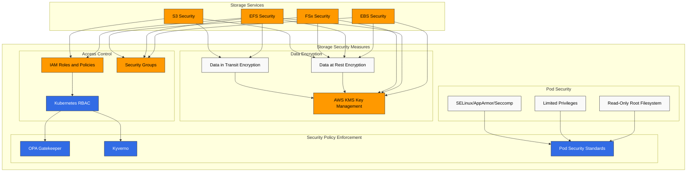
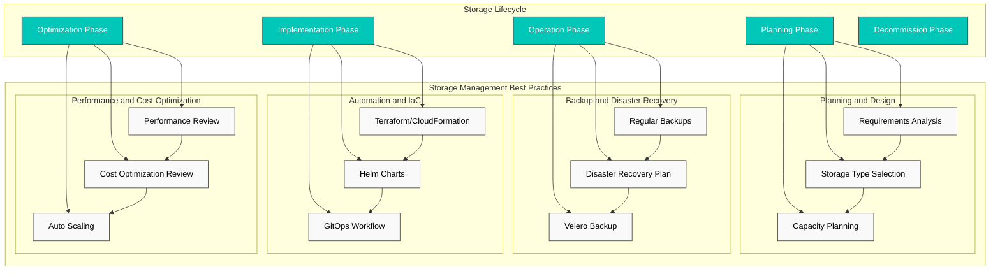

# Amazon EKS Storage - Part 3: Monitoring, Troubleshooting, Cost Optimization, and Security

Este documento es la tercera y última parte de la serie de almacenamiento de Amazon EKS, y cubre el monitoreo del almacenamiento, la solución de problemas, la optimización de costos y la seguridad.

## Table of Contents

1. [Storage Monitoring](#storage-monitoring)
2. [Storage Troubleshooting](#storage-troubleshooting)
3. [Storage Cost Optimization](#storage-cost-optimization)
4. [Storage Security](#storage-security)
5. [Storage Management Best Practices](#storage-management-best-practices)

## Storage Monitoring

Monitorear eficazmente los recursos de almacenamiento en un cluster de EKS es importante para detectar problemas de rendimiento de forma temprana y establecer la planificación de capacidad.

```mermaid
flowchart TD
    subgraph Monitoring_Solutions ["Storage Monitoring Solutions"]
        subgraph AWS_CloudWatch ["AWS CloudWatch"]
            EBS_Metrics[EBS Volume Metrics]
            EFS_Metrics[EFS File System Metrics]
            FSx_Metrics[FSx for Lustre Metrics]
            CW_Alarms[CloudWatch Alarms]
            CW_Dashboard[CloudWatch Dashboard]
        end

        subgraph K8s_Monitoring ["Kubernetes Monitoring"]
            Prometheus[Prometheus]
            Grafana[Grafana Dashboard]
            ServiceMonitor[ServiceMonitor]
            PodMonitor[PodMonitor]
            PrometheusRule[Alert Rules]
        end

        subgraph Custom_Solutions ["Custom Solutions"]
            Usage_Exporter[Volume Usage Exporter]
            Custom_Metrics[Custom Metrics]
            Custom_Alerts[Custom Alerts]
        end
    end

    subgraph Key_Metrics ["Key Monitoring Metrics"]
        Volume_Usage[Volume Usage]
        IOPS[IOPS Usage]
        Throughput[Throughput]
        Latency[Latency]
        Queue_Length[Queue Length]
        Burst_Credits[Burst Credits]
    end

    %% Connection relationships
    EBS_Metrics --> Volume_Usage
    EBS_Metrics --> IOPS
    EBS_Metrics --> Throughput
    EBS_Metrics --> Latency
    EBS_Metrics --> Queue_Length
    EBS_Metrics --> Burst_Credits

    EFS_Metrics --> Volume_Usage
    EFS_Metrics --> Throughput
    EFS_Metrics --> Burst_Credits

    FSx_Metrics --> Volume_Usage
    FSx_Metrics --> IOPS
    FSx_Metrics --> Throughput

    Volume_Usage --> CW_Alarms
    IOPS --> CW_Alarms
    Throughput --> CW_Alarms
    Latency --> CW_Alarms
    Queue_Length --> CW_Alarms
    Burst_Credits --> CW_Alarms

    CW_Alarms --> CW_Dashboard

    Prometheus --> ServiceMonitor
    Prometheus --> PodMonitor
    ServiceMonitor --> Grafana
    PodMonitor --> Grafana
    Prometheus --> PrometheusRule

    Usage_Exporter --> Custom_Metrics
    Custom_Metrics --> Custom_Alerts

    %% Class definitions
    classDef awsService fill:#FF9900,stroke:#333,stroke-width:1px,color:black;
    classDef k8sComponent fill:#326CE5,stroke:#333,stroke-width:1px,color:white;
    classDef userApp fill:#00C7B7,stroke:#333,stroke-width:1px,color:white;
    classDef dataStore fill:#3B48CC,stroke:#333,stroke-width:1px,color:white;
    classDef default fill:#f9f9f9,stroke:#333,stroke-width:1px,color:black;

    %% Class application
    class EBS_Metrics,EFS_Metrics,FSx_Metrics,CW_Alarms,CW_Dashboard awsService;
    class Prometheus,Grafana,ServiceMonitor,PodMonitor,PrometheusRule k8sComponent;
    class Usage_Exporter,Custom_Metrics,Custom_Alerts userApp;
    class Volume_Usage,IOPS,Throughput,Latency,Queue_Length,Burst_Credits default;
```



### Monitoring with CloudWatch

Puedes usar AWS CloudWatch para monitorear métricas de rendimiento de volúmenes EBS, EFS y FSx for Lustre:

#### EBS Volume Metrics

Métricas clave de EBS:
- VolumeReadBytes/VolumeWriteBytes: rendimiento de lectura/escritura
- VolumeReadOps/VolumeWriteOps: número de operaciones de lectura/escritura
- VolumeTotalReadTime/VolumeTotalWriteTime: latencia de lectura/escritura
- VolumeQueueLength: número de solicitudes de I/O pendientes
- BurstBalance: saldo de créditos burst (volúmenes gp2)

Ejemplo de dashboard de CloudWatch:

```bash
aws cloudwatch get-dashboard --dashboard-name EBSVolumeMonitoring
```

#### EFS File System Metrics

Métricas clave de EFS:
- TotalIOBytes: total de bytes de I/O
- DataReadIOBytes/DataWriteIOBytes: rendimiento de lectura/escritura
- ClientConnections: número de clientes conectados
- PermittedThroughput: rendimiento permitido
- BurstCreditBalance: saldo de créditos burst

#### FSx for Lustre Metrics

Métricas clave de FSx for Lustre:
- DataReadBytes/DataWriteBytes: rendimiento de lectura/escritura
- DataReadOperations/DataWriteOperations: número de operaciones de lectura/escritura
- FreeDataStorageCapacity: capacidad de almacenamiento disponible
- NetworkThroughputUtilization: utilización del rendimiento de red

### Monitoring with Prometheus and Grafana

Puedes usar Prometheus y Grafana para monitorear recursos de almacenamiento a nivel de Kubernetes:

1. Instala Prometheus y Grafana:

```bash
helm repo add prometheus-community https://prometheus-community.github.io/helm-charts
helm repo update
helm install prometheus prometheus-community/kube-prometheus-stack \
  --namespace monitoring \
  --create-namespace
```

2. Configura ServiceMonitor para la recopilación de métricas relacionadas con el almacenamiento:

```yaml
apiVersion: monitoring.coreos.com/v1
kind: ServiceMonitor
metadata:
  name: csi-metrics
  namespace: monitoring
spec:
  selector:
    matchLabels:
      app: ebs-csi-controller
  endpoints:
  - port: metrics
    interval: 30s
```

3. Configura el dashboard de Grafana:

Crea un dashboard en Grafana que incluya las siguientes métricas:
- Uso y capacidad de PVC
- Estado de aprovisionamiento de volúmenes
- Latencia de operación del driver CSI
- Operaciones de montaje/desmontaje de volúmenes

### Custom Monitoring Solutions

Puedes implementar soluciones de monitoreo personalizadas para requisitos específicos:

1. Pod de monitoreo de uso de volúmenes:

```yaml
apiVersion: apps/v1
kind: DaemonSet
metadata:
  name: volume-usage-exporter
  namespace: monitoring
spec:
  selector:
    matchLabels:
      app: volume-usage-exporter
  template:
    metadata:
      labels:
        app: volume-usage-exporter
    spec:
      containers:
      - name: exporter
        image: quay.io/prometheus/node-exporter:v1.3.1
        args:
        - --path.procfs=/host/proc
        - --path.sysfs=/host/sys
        - --collector.filesystem
        volumeMounts:
        - name: proc
          mountPath: /host/proc
          readOnly: true
        - name: sys
          mountPath: /host/sys
          readOnly: true
        - name: root
          mountPath: /host/root
          readOnly: true
          mountPropagation: HostToContainer
      volumes:
      - name: proc
        hostPath:
          path: /proc
      - name: sys
        hostPath:
          path: /sys
      - name: root
        hostPath:
          path: /
```

2. Configuración de reglas de alerta:

```yaml
apiVersion: monitoring.coreos.com/v1
kind: PrometheusRule
metadata:
  name: storage-alerts
  namespace: monitoring
spec:
  groups:
  - name: storage
    rules:
    - alert: VolumeUsageHigh
      expr: kubelet_volume_stats_used_bytes / kubelet_volume_stats_capacity_bytes > 0.85
      for: 10m
      labels:
        severity: warning
      annotations:
        summary: "Volume usage high ({{ $value | humanizePercentage }})"
        description: "PVC {{ $labels.persistentvolumeclaim }} is using {{ $value | humanizePercentage }} of its capacity."
    - alert: VolumeFullIn24Hours
      expr: predict_linear(kubelet_volume_stats_used_bytes[6h], 24 * 3600) > kubelet_volume_stats_capacity_bytes
      for: 10m
      labels:
        severity: warning
      annotations:
        summary: "Volume will fill in 24 hours"
        description: "PVC {{ $labels.persistentvolumeclaim }} is predicted to fill within 24 hours."
```

## Storage Troubleshooting

Exploremos los problemas comunes de almacenamiento que pueden ocurrir en clusters de EKS y sus soluciones.

```mermaid
flowchart TD
    subgraph Common_Issues ["Common Storage Issues"]
        PVC_Pending[PVC in Pending State]
        Volume_Provisioning[Volume Provisioning Failure]
        Mount_Issues[Volume Mount Issues]
        Performance_Issues[Performance Issues]
    end

    subgraph Troubleshooting_Steps ["Troubleshooting Steps"]
        Check_PVC[Check PVC Status]
        Check_SC[Check Storage Class]
        Check_CSI[Check CSI Driver Logs]
        Check_IAM[Check IAM Permissions]
        Check_Pod[Check Pod Status]
        Check_Node[Check Node Status]
        Check_SG[Check Security Groups]
        Check_Network[Check Network Connectivity]
        Check_Metrics[Check Performance Metrics]
        Check_FS[Test File System]
    end

    subgraph Resolution_Actions ["Resolution Actions"]
        Fix_SC[Fix Storage Class]
        Fix_CSI[Reinstall CSI Driver]
        Fix_IAM[Add IAM Permissions]
        Fix_Pod[Restart Pod]
        Fix_SG[Add Security Group Rules]
        Fix_Volume[Change Volume Type]
        Fix_Instance[Change Instance Type]
        Fix_FS[Optimize File System]
    end

    %% Issue and troubleshooting step connections
    PVC_Pending --> Check_PVC
    PVC_Pending --> Check_SC
    PVC_Pending --> Check_CSI
    PVC_Pending --> Check_IAM

    Volume_Provisioning --> Check_CSI
    Volume_Provisioning --> Check_IAM
    Volume_Provisioning --> Check_SC

    Mount_Issues --> Check_Pod
    Mount_Issues --> Check_Node
    Mount_Issues --> Check_SG
    Mount_Issues --> Check_Network

    Performance_Issues --> Check_Metrics
    Performance_Issues --> Check_FS
    Performance_Issues --> Check_Node

    %% Troubleshooting steps and action connections
    Check_SC --> Fix_SC
    Check_CSI --> Fix_CSI
    Check_IAM --> Fix_IAM
    Check_Pod --> Fix_Pod
    Check_SG --> Fix_SG
    Check_Metrics --> Fix_Volume
    Check_Metrics --> Fix_Instance
    Check_FS --> Fix_FS

    %% Class definitions
    classDef awsService fill:#FF9900,stroke:#333,stroke-width:1px,color:black;
    classDef k8sComponent fill:#326CE5,stroke:#333,stroke-width:1px,color:white;
    classDef userApp fill:#00C7B7,stroke:#333,stroke-width:1px,color:white;
    classDef dataStore fill:#3B48CC,stroke:#333,stroke-width:1px,color:white;
    classDef default fill:#f9f9f9,stroke:#333,stroke-width:1px,color:black;

    %% Class application
    class PVC_Pending,Volume_Provisioning,Mount_Issues,Performance_Issues k8sComponent;
    class Check_PVC,Check_SC,Check_CSI,Check_IAM,Check_Pod,Check_Node,Check_SG,Check_Network,Check_Metrics,Check_FS default;
    class Fix_SC,Fix_CSI,Fix_IAM,Fix_Pod,Fix_SG,Fix_Volume,Fix_Instance,Fix_FS userApp;
```



### Volume Provisioning Issues

#### Issue: PVC Remains in Pending State

1. Comprueba el estado del PVC:

```bash
kubectl get pvc
kubectl describe pvc <pvc-name>
```

2. Comprueba la storage class:

```bash
kubectl get sc
kubectl describe sc <storage-class-name>
```

3. Comprueba los logs del Pod provisioner:

```bash
kubectl -n kube-system get pods | grep csi
kubectl -n kube-system logs <csi-controller-pod-name>
```

4. Causas comunes y soluciones:
   - La storage class no existe: crea la storage class correcta
   - El driver CSI no está instalado: instala el driver
   - Permisos de IAM insuficientes: concede los permisos de IAM requeridos
   - Límite de volúmenes excedido: solicita un aumento del límite del servicio

#### Issue: Volume Not Provisioned with WaitForFirstConsumer Binding Mode

1. Comprueba el estado del Pod:

```bash
kubectl get pods
kubectl describe pod <pod-name>
```

2. Comprueba las zonas de disponibilidad de los nodes:

```bash
kubectl get nodes -L topology.kubernetes.io/zone
```

3. Soluciones:
   - Resuelve los problemas de scheduling del Pod
   - Comprueba las reglas de node selector y affinity
   - Asegúrate de que el node pool esté en la misma zona de disponibilidad que el PVC

### Volume Mount Issues

#### Issue: Pod Stuck in ContainerCreating State

1. Comprueba los eventos del Pod:

```bash
kubectl describe pod <pod-name>
```

2. Comprueba los logs de kubelet del node:

```bash
kubectl get nodes
ssh ec2-user@<node-ip>
sudo journalctl -u kubelet
```

3. Causas comunes y soluciones:
   - ID de volumen no encontrado: verifica la existencia del volumen en la consola de AWS
   - Error de montaje del dispositivo: comprueba la ruta del dispositivo y el file system
   - Problemas de permisos: comprueba los roles de IAM y los security groups

#### Issue: EFS or FSx Mount Failure

1. Comprueba los security groups:
   - EFS: permite el puerto TCP 2049
   - FSx for Lustre: permite el puerto TCP 988

2. Comprueba la conectividad de red:

```bash
kubectl debug node/<node-name> -it --image=amazon/aws-cli
ping <efs-dns-name>
telnet <efs-dns-name> 2049
```

3. Crea un Pod helper de montaje:

```yaml
apiVersion: v1
kind: Pod
metadata:
  name: mount-helper
spec:
  containers:
  - name: mount-helper
    image: amazonlinux:2
    command: ["sleep", "infinity"]
    securityContext:
      privileged: true
```

4. Prueba el montaje manualmente:

```bash
kubectl exec -it mount-helper -- bash
yum install -y nfs-utils
mkdir -p /mnt/efs
mount -t nfs4 <efs-dns-name>:/ /mnt/efs
```

### Performance Issues

#### Issue: Slow I/O Performance

1. Comprueba las métricas de rendimiento del volumen:

```bash
aws cloudwatch get-metric-statistics \
  --namespace AWS/EBS \
  --metric-name VolumeReadOps \
  --dimensions Name=VolumeId,Value=vol-1234567890abcdef0 \
  --start-time $(date -u -v-1H +%Y-%m-%dT%H:%M:%SZ) \
  --end-time $(date -u +%Y-%m-%dT%H:%M:%SZ) \
  --period 300 \
  --statistics Average
```

2. Prueba el rendimiento del file system:

```bash
kubectl exec -it <pod-name> -- bash
dd if=/dev/zero of=/data/test bs=1M count=1000 oflag=direct
dd if=/data/test of=/dev/null bs=1M count=1000 iflag=direct
```

3. Causas comunes y soluciones:
   - Tipo de volumen inadecuado: selecciona un tipo de volumen adecuado para la workload (por ejemplo, gp3, io2)
   - Límites de IOPS o throughput: ajusta los parámetros de rendimiento del volumen
   - Limitaciones de la instance: usa instances optimizadas para EBS
   - Fragmentación del file system: optimiza o recrea el file system

#### Issue: EFS Performance Degradation

1. Comprueba el modo de rendimiento y el modo de throughput de EFS
2. Optimiza las opciones de montaje del cliente:

```yaml
mountOptions:
  - nfsvers=4.1
  - rsize=1048576
  - wsize=1048576
  - timeo=600
  - retrans=2
  - noresvport
```

3. Optimiza los patrones de acceso:
   - Usa archivos grandes en lugar de archivos pequeños
   - Usa patrones de acceso secuencial
   - Minimiza las operaciones de metadatos

## Storage Cost Optimization

Exploremos estrategias para optimizar los costos de almacenamiento en clusters de EKS.

```mermaid
flowchart TD
    subgraph Cost_Optimization_Strategies ["Cost Optimization Strategies"]
        subgraph Volume_Optimization ["Volume Optimization"]
            Volume_Type[Select Appropriate Volume Type]
            Volume_Size[Optimize Volume Size]
            GP3_Migration[Migrate to gp3 Volumes]
        end

        subgraph Lifecycle_Management ["Lifecycle Management"]
            Data_Tiering[Data Tiering]
            Snapshot_Policy[Automated Snapshot Policy]
            PV_Reclaim[PV Reclaim Policy]
        end

        subgraph EFS_Optimization ["EFS Optimization"]
            Throughput_Mode[Appropriate Throughput Mode]
            IA_Storage[IA Storage Class]
            Access_Points[Access Points]
        end

        subgraph FSx_Optimization ["FSx Optimization"]
            Deployment_Type[Appropriate Deployment Type]
            Data_Compression[Data Compression]
            S3_Integration[S3 Integration]
        end

        subgraph Cost_Monitoring ["Cost Monitoring"]
            Cost_Explorer[AWS Cost Explorer]
            K8s_Cost[Kubernetes Cost Allocation]
            Cost_Anomaly[Cost Anomaly Detection]
        end
    end

    subgraph Storage_Types ["Storage Type Optimization"]
        EBS[Amazon EBS]
        EFS[Amazon EFS]
        FSx[Amazon FSx for Lustre]
        S3[Amazon S3]
    end

    %% Connection relationships
    EBS --> Volume_Type
    EBS --> Volume_Size
    EBS --> GP3_Migration

    EBS --> Snapshot_Policy
    EBS --> PV_Reclaim

    EFS --> Throughput_Mode
    EFS --> IA_Storage
    EFS --> Access_Points

    FSx --> Deployment_Type
    FSx --> Data_Compression
    FSx --> S3_Integration

    S3 --> Data_Tiering

    Volume_Optimization --> Cost_Monitoring
    Lifecycle_Management --> Cost_Monitoring
    EFS_Optimization --> Cost_Monitoring
    FSx_Optimization --> Cost_Monitoring

    %% Class definitions
    classDef awsService fill:#FF9900,stroke:#333,stroke-width:1px,color:black;
    classDef k8sComponent fill:#326CE5,stroke:#333,stroke-width:1px,color:white;
    classDef userApp fill:#00C7B7,stroke:#333,stroke-width:1px,color:white;
    classDef dataStore fill:#3B48CC,stroke:#333,stroke-width:1px,color:white;
    classDef default fill:#f9f9f9,stroke:#333,stroke-width:1px,color:black;

    %% Class application
    class EBS,EFS,FSx,S3 awsService;
    class Volume_Type,Volume_Size,GP3_Migration,Data_Tiering,Snapshot_Policy,PV_Reclaim,Throughput_Mode,IA_Storage,Access_Points,Deployment_Type,Data_Compression,S3_Integration default;
    class Cost_Explorer,K8s_Cost,Cost_Anomaly userApp;
```



### Volume Type and Size Optimization

1. **Selecciona el tipo de volumen adecuado**:
   - Workloads generales: gp3 (más rentable que gp2)
   - Workloads intensivas en throughput: st1
   - Datos con acceso poco frecuente: sc1

2. **Optimiza el tamaño del volumen**:
   - Aprovisiona volúmenes ligeramente mayores de lo necesario
   - Monitorea el uso del volumen y amplíalo según sea necesario
   - Limpia o archiva datos innecesarios

3. **Migra a volúmenes gp3**:

```yaml
apiVersion: storage.k8s.io/v1
kind: StorageClass
metadata:
  name: ebs-gp3
  annotations:
    storageclass.kubernetes.io/is-default-class: "true"
provisioner: ebs.csi.aws.com
parameters:
  type: gp3
  encrypted: "true"
allowVolumeExpansion: true
```

### Storage Lifecycle Management

1. **Data tiering**:
   - Datos de acceso frecuente: EBS o EFS
   - Datos de acceso poco frecuente: S3 o S3 Glacier

2. **Política automatizada de snapshots**:
   - Crea snapshots regulares
   - Elimina automáticamente los snapshots antiguos

```yaml
apiVersion: snapshot.storage.k8s.io/v1
kind: VolumeSnapshotClass
metadata:
  name: ebs-snapshot-class
driver: ebs.csi.aws.com
deletionPolicy: Delete
```

3. **Política de reclamación de PV**:
   - Usa la política Delete para datos temporales
   - Usa la política Retain para datos importantes

### EFS Cost Optimization

1. **Selecciona el modo de throughput adecuado**:
   - Workloads predecibles: throughput aprovisionado
   - Workloads variables: modo bursting

2. **Gestión del lifecycle**:
   - Mueve automáticamente los archivos de acceso poco frecuente a la storage class IA (Infrequent Access)
   - Configura la política de lifecycle:

```bash
aws efs put-lifecycle-configuration \
  --file-system-id fs-1234567890abcdef0 \
  --lifecycle-policies '[{"TransitionToIA":"AFTER_30_DAYS"}]'
```

3. **Usa access points**:
   - Comparte el file system usando access points específicos de la aplicación

### FSx for Lustre Cost Optimization

1. **Selecciona el tipo de deployment adecuado**:
   - Workloads temporales: SCRATCH_2
   - Workloads a largo plazo: PERSISTENT_1 o PERSISTENT_2

2. **Habilita la compresión de datos**:
   - Usa compresión de datos LZ4 para reducir los costos de almacenamiento

3. **Integración con S3**:
   - Conecta el bucket de S3 a FSx for Lustre para data tiering

### Cost Monitoring and Analysis

1. **Usa AWS Cost Explorer**:
   - Analiza las tendencias de costos de almacenamiento
   - Analiza los costos por recurso

2. **Asignación de costos de Kubernetes**:
   - Asigna costos usando namespaces y labels
   - Usa herramientas como Kubecost

3. **Detección de anomalías de costos**:
   - Configura AWS Budgets y alertas
   - Configura alertas para aumentos de costos anormales

## Storage Security

Exploremos las mejores prácticas de seguridad para proteger los recursos de almacenamiento en clusters de EKS.



### Data Encryption

1. **Cifrado de datos en reposo**:
   - Cifrado de volúmenes EBS:

```yaml
apiVersion: storage.k8s.io/v1
kind: StorageClass
metadata:
  name: ebs-encrypted
provisioner: ebs.csi.aws.com
parameters:
  type: gp3
  encrypted: "true"
  kmsKeyId: arn:aws:kms:us-west-2:111122223333:key/1234abcd-12ab-34cd-56ef-1234567890ab
```

   - Cifrado de file system EFS:

```bash
aws efs create-file-system \
  --encrypted \
  --kms-key-id arn:aws:kms:us-west-2:111122223333:key/1234abcd-12ab-34cd-56ef-1234567890ab
```

   - Cifrado de FSx for Lustre:

```bash
aws fsx create-file-system \
  --file-system-type LUSTRE \
  --storage-capacity 1200 \
  --subnet-ids subnet-1234567890abcdef0 \
  --lustre-configuration DeploymentType=SCRATCH_2 \
  --security-group-ids sg-1234567890abcdef0 \
  --kms-key-id arn:aws:kms:us-west-2:111122223333:key/1234abcd-12ab-34cd-56ef-1234567890ab
```

2. **Cifrado de datos en tránsito**:
   - Cifrado en tránsito de EFS:

```yaml
mountOptions:
  - tls
```

   - Cifrado en tránsito de S3:

```bash
aws s3 cp --sse AES256 file.txt s3://my-bucket/
```

### Access Control

1. **Roles y políticas de IAM**:
   - Aplica el principio de privilegio mínimo
   - Usa roles de IAM para service accounts

```bash
eksctl create iamserviceaccount \
  --name ebs-csi-controller-sa \
  --namespace kube-system \
  --cluster my-cluster \
  --attach-policy-arn arn:aws:iam::aws:policy/service-role/AmazonEBSCSIDriverPolicy \
  --approve
```

2. **Security groups**:
   - Permite solo los puertos requeridos
   - Restringe las IPs de origen

```bash
aws ec2 authorize-security-group-ingress \
  --group-id sg-1234567890abcdef0 \
  --protocol tcp \
  --port 2049 \
  --source-group sg-0987654321fedcba0
```

3. **Kubernetes RBAC**:
   - Restringe el acceso a PVs y PVCs

```yaml
apiVersion: rbac.authorization.k8s.io/v1
kind: Role
metadata:
  namespace: app-namespace
  name: pvc-manager
rules:
- apiGroups: [""]
  resources: ["persistentvolumeclaims"]
  verbs: ["get", "list", "watch", "create", "update", "patch", "delete"]
---
apiVersion: rbac.authorization.k8s.io/v1
kind: RoleBinding
metadata:
  name: pvc-manager-binding
  namespace: app-namespace
subjects:
- kind: ServiceAccount
  name: app-service-account
  namespace: app-namespace
roleRef:
  kind: Role
  name: pvc-manager
  apiGroup: rbac.authorization.k8s.io
```

### Pod Security Context

1. **Root filesystem de solo lectura**:

```yaml
apiVersion: v1
kind: Pod
metadata:
  name: secure-pod
spec:
  containers:
  - name: app
    image: nginx
    securityContext:
      readOnlyRootFilesystem: true
    volumeMounts:
    - name: data-volume
      mountPath: /data
      readOnly: false
```

2. **Privilegios limitados**:

```yaml
securityContext:
  runAsUser: 1000
  runAsGroup: 3000
  fsGroup: 2000
  allowPrivilegeEscalation: false
```

3. **Perfiles SELinux, AppArmor o seccomp**:

```yaml
securityContext:
  seLinuxOptions:
    level: "s0:c123,c456"
  seccompProfile:
    type: RuntimeDefault
```

### Security Policy Enforcement

1. **OPA Gatekeeper o Kyverno**:
   - Permite solo volúmenes cifrados

```yaml
apiVersion: kyverno.io/v1
kind: ClusterPolicy
metadata:
  name: require-ebs-encryption
spec:
  validationFailureAction: enforce
  rules:
  - name: check-ebs-encryption
    match:
      resources:
        kinds:
        - PersistentVolumeClaim
    validate:
      message: "EBS volumes must be encrypted"
      pattern:
        spec:
          storageClassName: "ebs-*"
          +(storageClassName): "ebs-encrypted"
```

2. **Pod Security Standards**:
   - Aplica Pod Security Standards a los namespaces

```yaml
apiVersion: v1
kind: Namespace
metadata:
  name: secure-ns
  labels:
    pod-security.kubernetes.io/enforce: restricted
```

## Storage Management Best Practices

Exploremos las mejores prácticas para gestionar eficazmente el almacenamiento en clusters de EKS.



### Storage Planning and Design

1. **Análisis de requisitos**:
   - Requisitos de rendimiento (IOPS, throughput)
   - Requisitos de capacidad
   - Patrones de acceso (relación lectura/escritura, concurrencia)
   - Requisitos de disponibilidad y durabilidad

2. **Selección del tipo de almacenamiento**:
   - Block storage (EBS): bases de datos, aplicaciones stateful
   - File storage (EFS): archivos compartidos, servidores web, CMS
   - File storage de alto rendimiento (FSx for Lustre): HPC, entrenamiento de ML
   - Object storage (S3): backups, archivos, contenido estático

3. **Planificación de capacidad**:
   - Requisitos actuales + margen de crecimiento
   - Implementa mecanismos de auto-scaling
   - Revisiones regulares de capacidad

### Backup and Disaster Recovery

1. **Backups regulares**:
   - Automatiza snapshots de volúmenes
   - Define políticas de retención de backups

```bash
# Create snapshot daily at midnight
0 0 * * * kubectl create -f snapshot.yaml
```

2. **Plan de disaster recovery**:
   - Replicación Multi-AZ o cross-region
   - Define Recovery Time Objective (RTO) y Recovery Point Objective (RPO)
   - Pruebas regulares de recuperación

3. **Backup del cluster con Velero**:

```bash
velero backup create daily-backup --include-namespaces=default,app-namespace
```

### Automation and IaC (Infrastructure as Code)

1. **Usa Terraform o CloudFormation**:
   - Definición declarativa de recursos de almacenamiento
   - Control de versiones y seguimiento de cambios

```hcl
resource "aws_efs_file_system" "example" {
  creation_token = "example"
  performance_mode = "generalPurpose"
  throughput_mode = "bursting"
  encrypted = true

  lifecycle_policy {
    transition_to_ia = "AFTER_30_DAYS"
  }

  tags = {
    Name = "ExampleFileSystem"
  }
}
```

2. **Usa Helm charts**:
   - Templatiza storage classes y PVCs

```yaml
# values.yaml
storage:
  class: ebs-gp3
  size: 10Gi
  encrypted: true
```

3. **Workflow GitOps**:
   - Gestiona la configuración de almacenamiento con ArgoCD o Flux

### Performance and Cost Optimization

1. **Revisión regular del rendimiento**:
   - Identifica y resuelve cuellos de botella
   - Ajusta la configuración de almacenamiento a medida que cambian las workloads

2. **Revisión de optimización de costos**:
   - Identifica y elimina volúmenes no utilizados
   - Migra a tipos de almacenamiento rentables
   - Considera Reserved Instances o Savings Plans

3. **Auto scaling**:
   - Escala automáticamente el almacenamiento según la demanda
   - Configura alertas basadas en uso

## Conclusion

En este documento, cubrimos el monitoreo, la solución de problemas, la optimización de costos y la seguridad para el almacenamiento de Amazon EKS. La gestión eficaz del almacenamiento es fundamental para garantizar el rendimiento, la confiabilidad y la rentabilidad de tu cluster de EKS.

Los requisitos de almacenamiento varían según la aplicación, por lo que es importante comprender las características de tu workload y seleccionar la solución de almacenamiento adecuada. Además, debes gestionar eficazmente los recursos de almacenamiento mediante monitoreo regular, solución de problemas, optimización de costos y revisiones de seguridad.

## References

- [Amazon EKS Storage Best Practices](https://aws.github.io/aws-eks-best-practices/storage/)
- [Kubernetes Storage Troubleshooting](https://kubernetes.io/docs/tasks/debug-application-cluster/debug-application/#debugging-pods)
- [AWS Storage Cost Optimization](https://aws.amazon.com/blogs/storage/cost-optimization-for-amazon-ebs-and-amazon-efs/)
- [Kubernetes Storage Security](https://kubernetes.io/docs/concepts/security/)

## Quiz

Para comprobar lo que aprendiste en este capítulo, intenta el [cuestionario del tema](../quizzes/eks/04-eks-storage-part3-quiz.md).
