# Amazon EKS Security

> **Versiones compatibles**: Amazon EKS 1.31, 1.32, 1.33
> **Última actualización**: July 3, 2026

Para ejecutar workloads de forma segura en Amazon EKS (Elastic Kubernetes Service), debes comprender e implementar varias capas de seguridad y buenas prácticas. Este documento cubre conceptos clave, componentes y buenas prácticas para fortalecer la seguridad de tu EKS cluster.

## Table of Contents

1. [EKS Security Overview](#eks-security-overview)
2. [Latest Security Trends (2023)](#latest-security-trends-2023)
3. [IAM and Authentication](#iam-and-authentication)
4. [OIDC Provider Deep Dive](#oidc-provider-deep-dive)
5. [EKS Pod Identity](#eks-pod-identity)
6. [Cluster Endpoint Access Control](#cluster-endpoint-access-control)
7. [Network Security](#network-security)
8. [Pod Security](#pod-security)
9. [Bottlerocket and Read-Only OS](#bottlerocket-and-read-only-os)
10. [IAM Permission Boundaries](#iam-permission-boundaries)
11. [Encryption and Secrets Management](#encryption-and-secrets-management)
12. [Compliance and Auditing](#compliance-and-auditing)
13. [Security Monitoring and Detection](#security-monitoring-and-detection)
14. [EKS Security Best Practices](#eks-security-best-practices)
15. [EKS Security Considerations for Financial Services](#eks-security-considerations-for-financial-services)

## EKS Security Overview

Amazon EKS combina las características de seguridad de AWS y Kubernetes para proporcionar una arquitectura de seguridad de varias capas. La seguridad de EKS consta de las siguientes áreas clave:

- **Modelo de responsabilidad compartida**: AWS administra la seguridad del EKS control plane, mientras que los clientes son responsables de la seguridad de worker nodes, containers y applications.
- **Seguridad de infraestructura**: Seguridad de infraestructura de red, incluidos VPC, subnets y security groups
- **Seguridad del cluster**: Control de acceso al Kubernetes API server, RBAC y service accounts
- **Seguridad de workloads**: Seguridad de container images, seguridad en runtime y network policies

### EKS Security Architecture

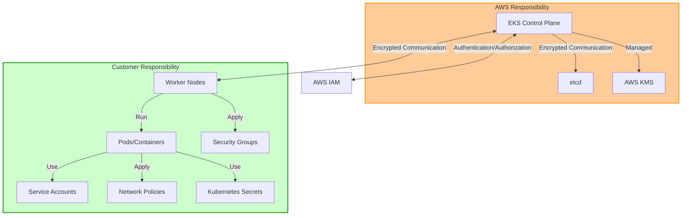

## Latest Security Trends (2023)

Las tendencias y recomendaciones más recientes en el ámbito de seguridad de Kubernetes y EKS son las siguientes:

### 1. Zero Trust Architecture

Al alejarse de los modelos tradicionales de seguridad basados en perímetro, este enfoque no confía en ningún acceso de forma predeterminada y lo verifica continuamente.

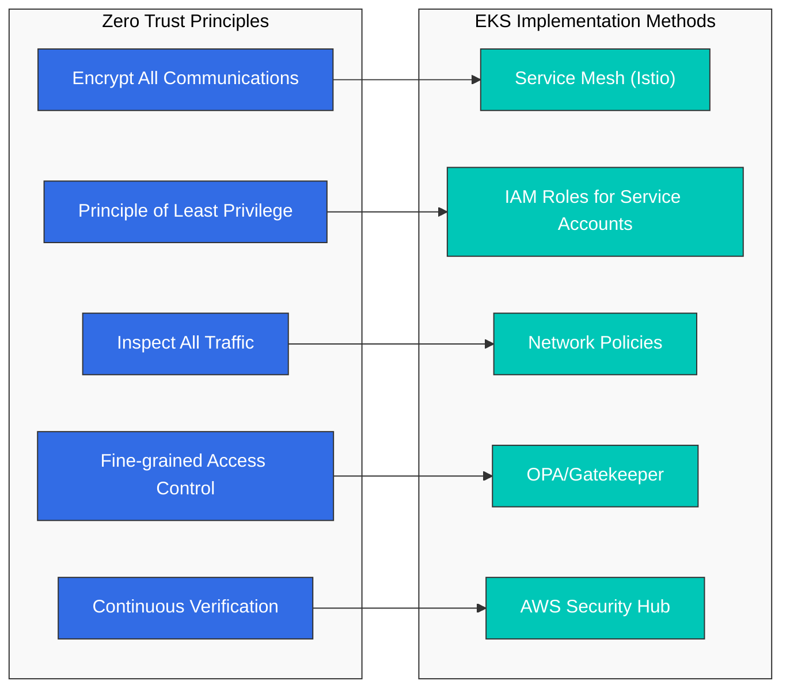

Implementación de Zero Trust en EKS:
- **Service Mesh**: Comunicación mTLS entre services usando Istio o AWS App Mesh
- **IAM Roles for Service Accounts (IRSA)**: Gestión de permisos de granularidad fina
- **Network Policies**: Policies de denegación predeterminada que permiten solo la comunicación necesaria
- **OPA/Gatekeeper**: Control de acceso basado en policies
- **AWS Security Hub**: Monitoreo continuo de la postura de seguridad

### 2. Supply Chain Security

A medida que aumentan los ataques a la software supply chain, la seguridad de todo el pipeline, desde container images hasta deployment, se ha vuelto importante.

Métodos clave de implementación:
- Adoptar el framework **SLSA (Supply-chain Levels for Software Artifacts)**
- **Firma y verificación de images**: Cosign, Notary v2
- Generación y gestión de **SBOM (Software Bill of Materials)**: Syft, Grype
- **Image scanning**: Amazon ECR image scanning, Trivy, Clair
- **Seguridad GitOps**: Commits firmados, pipelines seguros

### 3. Runtime Security and Threat Detection

A medida que la seguridad de container runtime se vuelve importante, las siguientes tecnologías están ganando atención:

- **Monitoreo de seguridad basado en eBPF**: Cilium, Falco
- **AWS GuardDuty EKS Protection**: Detección de amenazas en runtime
- **Análisis de Kubernetes Audit logs**: CloudWatch Logs Insights
- **Detección de comportamiento anómalo**: Amazon Detective
- **Prevención de container escape**: gVisor, Kata Containers

### 4. Policy as Code

Un enfoque para gestionar security policies como código con el fin de mejorar la consistencia y la automatización:

- **OPA (Open Policy Agent)**: Motor de policies de propósito general
- **Kyverno**: Gestión de policies nativa de Kubernetes
- **AWS Config**: Monitoreo de cumplimiento
- **Terraform Sentinel**: Aplicación de IaC policies
- **AWS CloudFormation Guard**: Validación de IaC policies

## IAM and Authentication

### EKS Authentication Mechanisms

Amazon EKS proporciona los siguientes mecanismos de autenticación:

1. **AWS IAM Authenticator**: Autentica ante el Kubernetes API server usando credenciales de AWS IAM.
2. **OIDC Provider Integration**: Se integra con OIDC providers externos (por ejemplo, Active Directory, Okta, Auth0) para gestionar la autenticación de usuarios.
3. **IAM Roles for Service Accounts**: Vincula AWS IAM roles a Kubernetes service accounts para que pods puedan acceder de forma segura a AWS services.

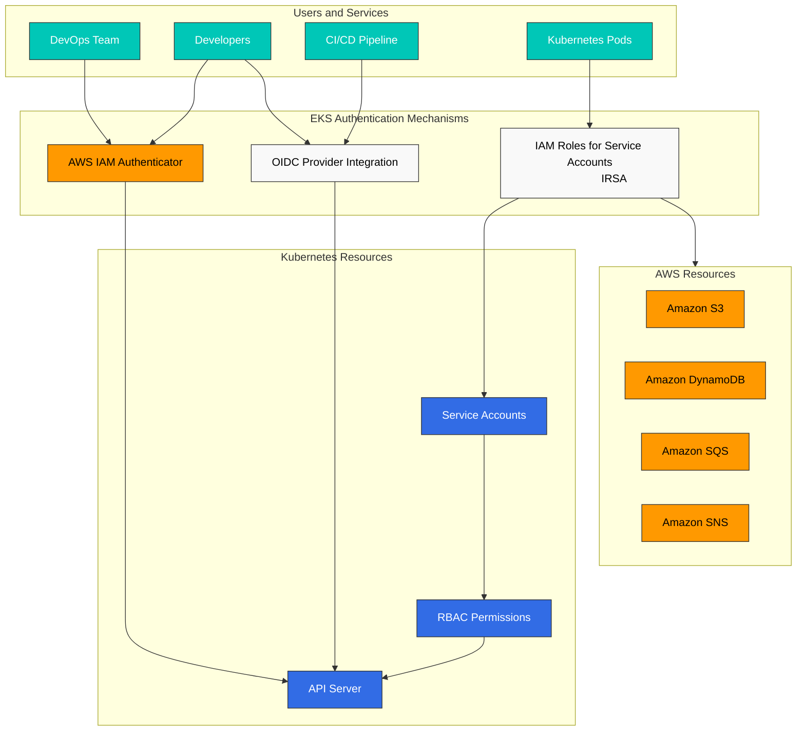

### IAM Roles and Policy Configuration

#### EKS Cluster Role

Permisos mínimos requeridos al crear un EKS cluster:

```json
{
  "Version": "2012-10-17",
  "Statement": [
    {
      "Effect": "Allow",
      "Action": [
        "eks:CreateCluster",
        "eks:DescribeCluster",
        "eks:UpdateClusterConfig",
        "eks:DeleteCluster"
      ],
      "Resource": "*"
    },
    {
      "Effect": "Allow",
      "Action": "iam:PassRole",
      "Resource": "*",
      "Condition": {
        "StringEquals": {
          "iam:PassedToService": "eks.amazonaws.com"
        }
      }
    }
  ]
}
```

#### EKS Access Entry

EKS Access Entry es un nuevo método que reemplaza el aws-auth ConfigMap para gestionar el acceso de IAM users y roles a EKS clusters. Access Entry proporciona los siguientes beneficios:

- Mayor estabilidad como solución administrada por AWS
- Gestión mediante API declarativa
- Capacidades de control de versiones y auditoría
- Separación entre el IAM role del node y la gestión de acceso de users/roles

```bash
# Enable Access Entry for the cluster
aws eks update-cluster-config \
  --name my-cluster \
  --region us-west-2 \
  --access-config authenticationMode=API_AND_CONFIG_MAP

# Create Access Entry for IAM role
aws eks create-access-entry \
  --cluster-name my-cluster \
  --principal-arn arn:aws:iam::123456789012:role/DevTeamRole \
  --username dev-team \
  --kubernetes-groups dev-team

# Create Access Entry for IAM user
aws eks create-access-entry \
  --cluster-name my-cluster \
  --principal-arn arn:aws:iam::123456789012:user/admin \
  --username admin \
  --kubernetes-groups system:masters

# List Access Entries
aws eks list-access-entries --cluster-name my-cluster
```

> **Nota**: EKS Access Entry se introdujo en 2023 y proporciona un método más estable y fácil de administrar que el aws-auth ConfigMap. Los clusters existentes pueden migrar a un modo híbrido que admite ambos métodos.

### IRSA (IAM Roles for Service Accounts)

IRSA te permite vincular AWS IAM roles a Kubernetes service accounts para que pods puedan acceder de forma segura a AWS services.

#### IRSA Setup Steps

1. Crea un OIDC provider para el EKS cluster:

```bash
eksctl utils associate-iam-oidc-provider --cluster my-cluster --approve
```

2. Crea IAM role y policy:

```bash
eksctl create iamserviceaccount \
  --name s3-reader \
  --namespace default \
  --cluster my-cluster \
  --attach-policy-arn arn:aws:iam::aws:policy/AmazonS3ReadOnlyAccess \
  --approve
```

3. Asocia el service account con un pod:

```yaml
apiVersion: v1
kind: Pod
metadata:
  name: s3-reader
spec:
  serviceAccountName: s3-reader
  containers:
  - name: app
    image: amazonlinux:2
    command: ['sh', '-c', 'aws s3 ls']
```

## OIDC Provider Deep Dive

OpenID Connect (OIDC) es la base de IAM Roles for Service Accounts (IRSA) en EKS. Comprender cómo funciona OIDC te ayuda a solucionar problemas de autenticación e implementar patrones seguros de workload identity.

### OIDC Trust Relationship Mechanics

Cuando creas un EKS cluster, AWS crea automáticamente un endpoint de OIDC provider. Este endpoint funciona como un identity provider en el que AWS STS confía para autenticar Kubernetes service accounts.

La trust relationship funciona de la siguiente manera:
1. EKS emite OIDC tokens a pods mediante projected service account tokens
2. El token contiene claims sobre la identidad del pod (namespace, service account name)
3. AWS STS valida el token contra las public keys del OIDC provider
4. Si es válido, STS emite credenciales temporales de AWS

### STS AssumeRoleWithWebIdentity Flow

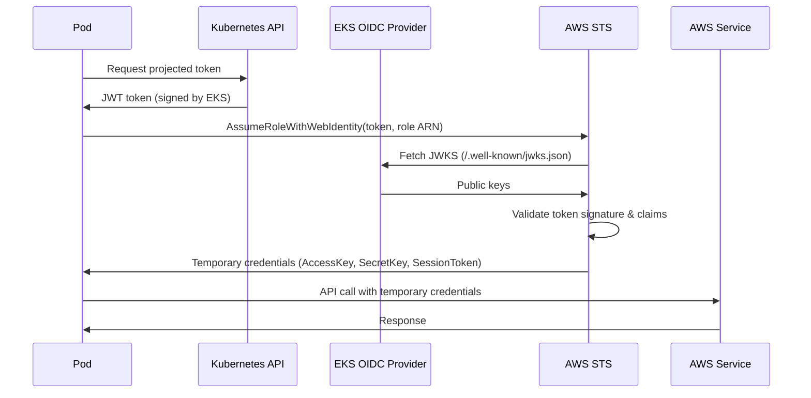

### Token Exchange Mechanism

El projected service account token es un JWT (JSON Web Token) con la siguiente estructura:

```json
{
  "aud": ["sts.amazonaws.com"],
  "exp": 1234567890,
  "iat": 1234567800,
  "iss": "https://oidc.eks.us-west-2.amazonaws.com/id/EXAMPLED539D4633E53DE1B71EXAMPLE",
  "kubernetes.io": {
    "namespace": "default",
    "pod": {
      "name": "my-pod",
      "uid": "1234-5678-9012-3456"
    },
    "serviceaccount": {
      "name": "my-service-account",
      "uid": "abcd-efgh-ijkl-mnop"
    }
  },
  "sub": "system:serviceaccount:default:my-service-account"
}
```

Claims clave:
- **iss**: La URL del OIDC provider (debe coincidir con la IAM trust policy)
- **sub**: El subject (identificador del service account)
- **aud**: La audience (debe incluir `sts.amazonaws.com` para AWS)

### OIDC Endpoint Verification

Verifica la configuración OIDC de tu cluster:

```bash
# Get OIDC provider URL
aws eks describe-cluster \
  --name my-cluster \
  --query "cluster.identity.oidc.issuer" \
  --output text

# Example output: https://oidc.eks.us-west-2.amazonaws.com/id/EXAMPLED539D4633E53DE1B71EXAMPLE

# List OIDC providers in your account
aws iam list-open-id-connect-providers

# Get OIDC provider details
aws iam get-open-id-connect-provider \
  --open-id-connect-provider-arn arn:aws:iam::123456789012:oidc-provider/oidc.eks.us-west-2.amazonaws.com/id/EXAMPLED539D4633E53DE1B71EXAMPLE
```

### JWKS URI and Token Validation

El endpoint JWKS (JSON Web Key Set) proporciona public keys para validar tokens:

```bash
# Fetch JWKS from OIDC provider
OIDC_URL=$(aws eks describe-cluster --name my-cluster --query "cluster.identity.oidc.issuer" --output text)
curl -s "${OIDC_URL}/.well-known/openid-configuration" | jq .

# Get the JWKS directly
curl -s "${OIDC_URL}/keys" | jq .
```

La respuesta JWKS contiene public keys RSA usadas para verificar firmas de tokens:

```json
{
  "keys": [
    {
      "kty": "RSA",
      "kid": "key-id-1",
      "use": "sig",
      "alg": "RS256",
      "n": "base64-encoded-modulus",
      "e": "AQAB"
    }
  ]
}
```

## EKS Pod Identity

EKS Pod Identity es un mecanismo de autenticación más reciente que simplifica cómo pods acceden a AWS services. Proporciona ventajas sobre IRSA mientras mantiene sólidas garantías de seguridad.

### Advantages over IRSA

| Característica | IRSA | EKS Pod Identity |
|---------|------|------------------|
| Complejidad de configuración | Requiere OIDC provider + IAM role por SA | Pod Identity Association más simple |
| Reutilización de IAM Role | Un role por service account | El mismo role entre clusters/accounts |
| Session Tags | Limitado | Soporte completo para ABAC |
| Cross-Account | Trust policies complejas | Simplificado con associations |
| Credential Rotation | Basado en tokens, de corta duración | Administrado por Pod Identity Agent |
| Troubleshooting | Validación de tokens compleja | Depuración más simple |

### Pod Identity Agent Mechanics

El EKS Pod Identity Agent se ejecuta como un DaemonSet en tus nodes y gestiona la distribución de credenciales:

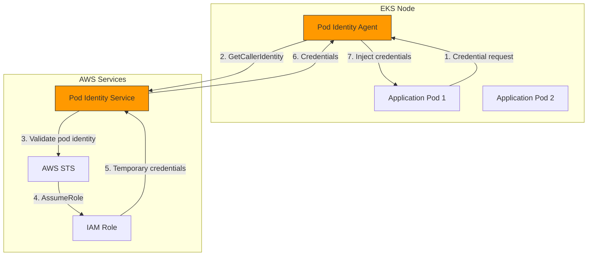

### Pod Identity Association Setup

**Usando eksctl**:

```bash
# Create Pod Identity Association
eksctl create podidentityassociation \
  --cluster my-cluster \
  --namespace default \
  --service-account-name my-app-sa \
  --role-arn arn:aws:iam::123456789012:role/MyAppRole
```

**Usando AWS CLI**:

```bash
# First, create the IAM role with Pod Identity trust policy
cat > trust-policy.json << 'EOF'
{
  "Version": "2012-10-17",
  "Statement": [
    {
      "Effect": "Allow",
      "Principal": {
        "Service": "pods.eks.amazonaws.com"
      },
      "Action": [
        "sts:AssumeRole",
        "sts:TagSession"
      ]
    }
  ]
}
EOF

aws iam create-role \
  --role-name MyAppRole \
  --assume-role-policy-document file://trust-policy.json

# Attach required policies
aws iam attach-role-policy \
  --role-name MyAppRole \
  --policy-arn arn:aws:iam::aws:policy/AmazonS3ReadOnlyAccess

# Create the Pod Identity Association
aws eks create-pod-identity-association \
  --cluster-name my-cluster \
  --namespace default \
  --service-account my-app-sa \
  --role-arn arn:aws:iam::123456789012:role/MyAppRole
```

### IRSA to Pod Identity Migration Procedure

Migración paso a paso de IRSA a Pod Identity:

1. **Instala Pod Identity Agent** (si aún no está instalado):

```bash
aws eks create-addon \
  --cluster-name my-cluster \
  --addon-name eks-pod-identity-agent \
  --addon-version v1.0.0-eksbuild.1
```

2. **Actualiza la IAM role trust policy** para admitir tanto IRSA como Pod Identity:

```json
{
  "Version": "2012-10-17",
  "Statement": [
    {
      "Effect": "Allow",
      "Principal": {
        "Federated": "arn:aws:iam::123456789012:oidc-provider/oidc.eks.us-west-2.amazonaws.com/id/EXAMPLE"
      },
      "Action": "sts:AssumeRoleWithWebIdentity",
      "Condition": {
        "StringEquals": {
          "oidc.eks.us-west-2.amazonaws.com/id/EXAMPLE:sub": "system:serviceaccount:default:my-app-sa"
        }
      }
    },
    {
      "Effect": "Allow",
      "Principal": {
        "Service": "pods.eks.amazonaws.com"
      },
      "Action": [
        "sts:AssumeRole",
        "sts:TagSession"
      ]
    }
  ]
}
```

3. **Crea Pod Identity Association**:

```bash
aws eks create-pod-identity-association \
  --cluster-name my-cluster \
  --namespace default \
  --service-account my-app-sa \
  --role-arn arn:aws:iam::123456789012:role/MyAppRole
```

4. **Prueba la nueva autenticación** reiniciando pods:

```bash
kubectl rollout restart deployment my-app -n default
```

5. **Elimina las annotations de IRSA** después de verificar que Pod Identity funciona:

```bash
kubectl annotate serviceaccount my-app-sa \
  -n default \
  eks.amazonaws.com/role-arn-
```

6. **Limpia la IRSA trust policy** del IAM role (opcional, después de la migración completa).

### Pod Identity Architecture Diagram

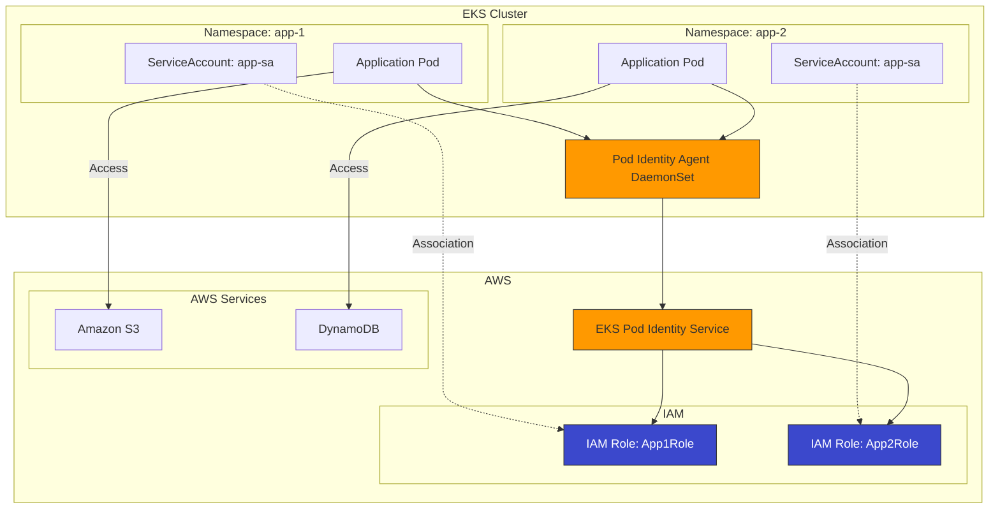

## Cluster Endpoint Access Control

El control de acceso al endpoint del EKS cluster determina cómo users y workloads pueden llegar al Kubernetes API server. Una configuración adecuada es esencial para la seguridad.

### Public/Private/Public+Private Endpoint Configuration

EKS admite tres configuraciones de acceso al endpoint:

| Configuración | Public Endpoint | Private Endpoint | Caso de uso |
|--------------|-----------------|------------------|----------|
| Solo Public | Habilitado | Deshabilitado | Desarrollo, pruebas |
| Solo Private | Deshabilitado | Habilitado | Producción de alta seguridad |
| Public + Private | Habilitado | Habilitado | Equilibrio entre seguridad y conveniencia |

**Solo Public** (predeterminado):
- API server accesible desde internet
- Nodes se comunican a través de internet
- Configuración más simple, pero menos segura

**Solo Private**:
- API server accesible solo desde dentro de la VPC
- Requiere VPN, Direct Connect o bastion host para acceso con kubectl
- Nodes se comunican a través de una red privada
- Opción más segura

**Public + Private**:
- API server accesible tanto desde internet como desde la VPC
- Nodes se comunican a través de una red privada (más eficiente)
- Buen equilibrio entre seguridad y facilidad de uso

### CIDR Restriction Settings

Cuando uses public endpoint, restringe el acceso a rangos de IP específicos:

```bash
# Update cluster to restrict public access
aws eks update-cluster-config \
  --name my-cluster \
  --resources-vpc-config \
    endpointPublicAccess=true,\
    endpointPrivateAccess=true,\
    publicAccessCidrs="10.0.0.0/8","203.0.113.0/24"
```

Usando eksctl:

```yaml
# cluster-config.yaml
apiVersion: eksctl.io/v1alpha5
kind: ClusterConfig
metadata:
  name: my-cluster
  region: us-west-2

vpc:
  clusterEndpoints:
    publicAccess: true
    privateAccess: true
  publicAccessCIDRs:
    - 10.0.0.0/8        # Internal corporate network
    - 203.0.113.0/24    # Office IP range
```

### Private Cluster Operation Patterns

Operar un EKS cluster solo private requiere soluciones de conectividad de red:

**Patrón 1: Acceso VPN**

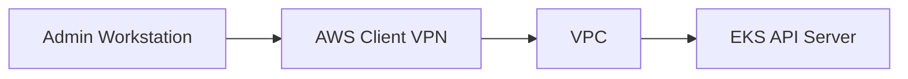

```bash
# Create Client VPN endpoint
aws ec2 create-client-vpn-endpoint \
  --client-cidr-block 10.100.0.0/16 \
  --server-certificate-arn arn:aws:acm:us-west-2:123456789012:certificate/abc123 \
  --authentication-options Type=certificate-authentication,MutualAuthentication={ClientRootCertificateChainArn=arn:aws:acm:us-west-2:123456789012:certificate/xyz789} \
  --connection-log-options Enabled=false \
  --vpc-id vpc-12345678
```

**Patrón 2: Transit Gateway**

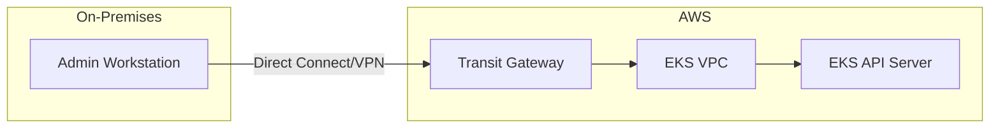

**Patrón 3: Bastion Host con SSM**

```yaml
# Bastion host deployment for kubectl access
apiVersion: apps/v1
kind: Deployment
metadata:
  name: kubectl-bastion
  namespace: kube-system
spec:
  replicas: 1
  selector:
    matchLabels:
      app: kubectl-bastion
  template:
    metadata:
      labels:
        app: kubectl-bastion
    spec:
      serviceAccountName: kubectl-bastion-sa
      containers:
      - name: bastion
        image: amazon/aws-cli:latest
        command: ["sleep", "infinity"]
        resources:
          requests:
            memory: "256Mi"
            cpu: "100m"
```

Acceso mediante SSM Session Manager:

```bash
# Start SSM session to bastion pod's node
aws ssm start-session --target i-1234567890abcdef0

# Or use kubectl exec through SSM
aws ssm start-session \
  --target i-1234567890abcdef0 \
  --document-name AWS-StartPortForwardingSession \
  --parameters '{"portNumber":["443"],"localPortNumber":["6443"]}'
```

### Endpoint Access Control Configuration Example

Ejemplo completo para un cluster private listo para producción:

```bash
# Create cluster with private endpoint only
eksctl create cluster \
  --name production-cluster \
  --region us-west-2 \
  --vpc-private-subnets subnet-private1,subnet-private2,subnet-private3 \
  --without-nodegroup

# Update to private-only endpoint
aws eks update-cluster-config \
  --name production-cluster \
  --resources-vpc-config \
    endpointPublicAccess=false,\
    endpointPrivateAccess=true

# Verify endpoint configuration
aws eks describe-cluster \
  --name production-cluster \
  --query "cluster.resourcesVpcConfig.{PublicAccess:endpointPublicAccess,PrivateAccess:endpointPrivateAccess,PublicCIDRs:publicAccessCidrs}"
```

VPC endpoints requeridos para private clusters:

```bash
# Create required VPC endpoints
for service in ec2 ecr.api ecr.dkr s3 logs sts elasticloadbalancing autoscaling; do
  aws ec2 create-vpc-endpoint \
    --vpc-id vpc-12345678 \
    --service-name com.amazonaws.us-west-2.${service} \
    --subnet-ids subnet-private1 subnet-private2 \
    --security-group-ids sg-12345678
done
```

### Customer-Routed Control Plane Egress (June 2026)

> **Anunciado**: June 18, 2026 · [Source](https://aws.amazon.com/about-aws/whats-new/2026/06/amazon-eks-customer-routed-control-plane-egress/)

Anteriormente, cuando el Kubernetes API server de EKS necesitaba alcanzar endpoints externos (admission webhooks, OIDC providers privados, aggregated API servers), ese tráfico de egreso salía por una ruta administrada por AWS. Con Customer-Routed Control Plane Egress, puedes enrutar este tráfico de egreso del control plane directamente a través de tu propia VPC.

**Tráfico compatible**:
- Llamadas de admission webhook (OPA/Gatekeeper, Kyverno)
- Acceso a OIDC provider privado
- Acceso a aggregated API server (por ejemplo, Metrics Server, APIs personalizadas)

**Características clave**:
- Debido a que el egreso del control plane atraviesa la VPC del cliente, puedes implementar un perímetro de datos y monitorear/inspeccionar el tráfico dentro de tu propia red
- Aplicable a nivel de organización usando la IAM condition key `eks:controlPlaneEgressMode` en una SCP
- Puede aplicarse a clusters existentes, sin costo adicional, disponible en todas las regiones

```bash
# Enable customer-routed control plane egress on a cluster
aws eks update-cluster-config \
  --name my-cluster \
  --resources-vpc-config controlPlaneEgressMode=CUSTOMER_ROUTED
```

```json
// SCP example: enforce customer-routed egress mode
{
  "Version": "2012-10-17",
  "Statement": [
    {
      "Sid": "RequireCustomerRoutedControlPlaneEgress",
      "Effect": "Deny",
      "Action": [
        "eks:CreateCluster",
        "eks:UpdateClusterConfig"
      ],
      "Resource": "*",
      "Condition": {
        "StringNotEquals": {
          "eks:controlPlaneEgressMode": "CUSTOMER_ROUTED"
        }
      }
    }
  ]
}
```

## Network Security

### Security Groups

Puedes usar AWS security groups para controlar el tráfico de red hacia nodes y pods en tu EKS cluster.

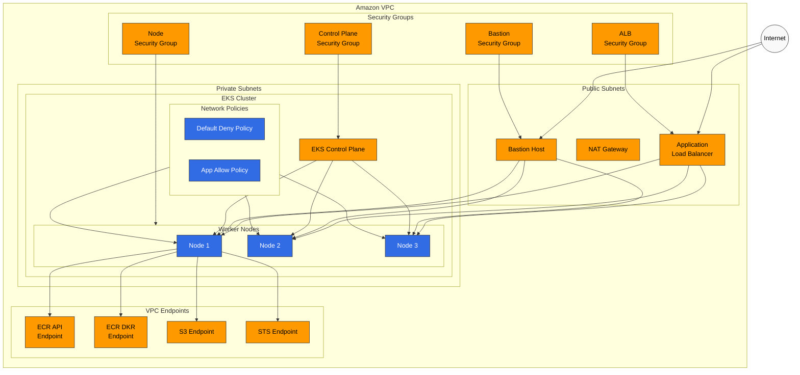

#### Cluster Security Group

El EKS cluster security group permite la comunicación entre el control plane y los worker nodes:

- Puerto 443 (HTTPS): Comunicación del cluster API server
- Puerto 10250: kubelet API
- Rango de puertos 1025-65535: Comunicación entre nodes

#### Node Security Group

Configuración recomendada de security group para worker nodes:

- Inbound: Permitir tráfico desde el cluster security group
- Outbound: Permitir todo el tráfico (puede restringirse según sea necesario)

### Network Policies

Puedes usar Kubernetes network policies para controlar la comunicación entre pods. En EKS, puedes implementar network policies mediante network plugins como Amazon VPC CNI, Calico y Cilium.

#### Default Deny Policy Example

```yaml
apiVersion: networking.k8s.io/v1
kind: NetworkPolicy
metadata:
  name: default-deny
  namespace: default
spec:
  podSelector: {}
  policyTypes:
  - Ingress
  - Egress
```

#### Allow Policy Example for Specific Applications

```yaml
apiVersion: networking.k8s.io/v1
kind: NetworkPolicy
metadata:
  name: api-allow
  namespace: default
spec:
  podSelector:
    matchLabels:
      app: api
  policyTypes:
  - Ingress
  ingress:
  - from:
    - podSelector:
        matchLabels:
          app: frontend
    ports:
    - protocol: TCP
      port: 8080
```

### VPC Endpoints

Usa VPC endpoints para acceso privado a AWS services y así acceder de forma segura a AWS services sin pasar por un internet gateway.

VPC endpoints recomendados para EKS clusters:

- com.amazonaws.region.ecr.api
- com.amazonaws.region.ecr.dkr
- com.amazonaws.region.s3
- com.amazonaws.region.logs
- com.amazonaws.region.sts

## Pod Security

### Pod Security Standards (PSS)

Pod Security Standards, introducidos en Kubernetes 1.23, proporcionan un mecanismo integrado para restringir el security context de pods. Puedes aplicar los siguientes niveles de PSS en EKS:

- **Privileged**: Sin restricciones
- **Baseline**: Evita escaladas de privilegios conocidas
- **Restricted**: Aplica restricciones de seguridad fuertes

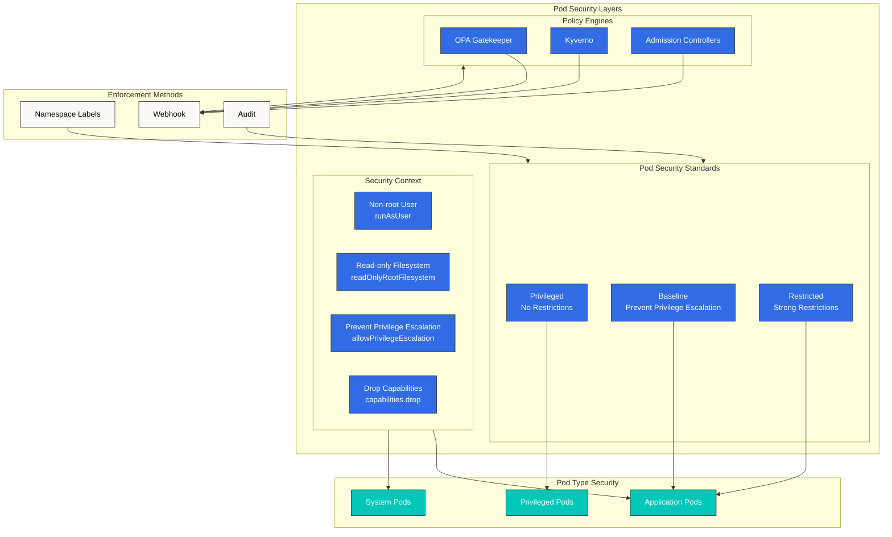

Ejemplo de aplicación de PSS a un namespace:

```yaml
apiVersion: v1
kind: Namespace
metadata:
  name: secure-ns
  labels:
    pod-security.kubernetes.io/enforce: restricted
    pod-security.kubernetes.io/audit: restricted
    pod-security.kubernetes.io/warn: restricted
```

### Security Context

Puedes configurar security context a nivel de pod y container para restringir privilegios:

```yaml
apiVersion: v1
kind: Pod
metadata:
  name: secure-pod
spec:
  securityContext:
    runAsUser: 1000
    runAsGroup: 3000
    fsGroup: 2000
  containers:
  - name: secure-container
    image: nginx
    securityContext:
      allowPrivilegeEscalation: false
      readOnlyRootFilesystem: true
      capabilities:
        drop:
        - ALL
```

### OPA Gatekeeper and Kyverno

Puedes aplicar security policies en todo el cluster usando policy engines como OPA Gatekeeper o Kyverno.

#### Kyverno Policy Example - Prevent Privileged Containers

```yaml
apiVersion: kyverno.io/v1
kind: ClusterPolicy
metadata:
  name: disallow-privileged-containers
spec:
  validationFailureAction: enforce
  rules:
  - name: privileged-containers
    match:
      resources:
        kinds:
        - Pod
    validate:
      message: "Privileged containers are not allowed"
      pattern:
        spec:
          containers:
          - name: "*"
            securityContext:
              privileged: false
```

## Bottlerocket and Read-Only OS

Bottlerocket es un sistema operativo orientado a un propósito específico y centrado en seguridad, diseñado específicamente para ejecutar containers. Proporciona seguridad mejorada mediante su huella mínima y diseño inmutable.

### Bottlerocket Characteristics

**Configuración basada en API**:
- Sin acceso SSH de forma predeterminada
- Cambios de configuración mediante API (apiclient)
- Settings persistidos entre reinicios
- Cambios validados antes de la aplicación

```bash
# Example: Configure Bottlerocket settings via user data
[settings.kubernetes]
cluster-name = "my-cluster"
api-server = "https://EXAMPLE.gr7.us-west-2.eks.amazonaws.com"
cluster-certificate = "BASE64_ENCODED_CERT"

[settings.kubernetes.node-labels]
"node.kubernetes.io/os" = "bottlerocket"

[settings.kubernetes.node-taints]
"bottlerocket" = "true:NoSchedule"
```

**Actualizaciones automáticas**:
- Despliegue de updates basado en waves
- Rollback automático en caso de fallo
- Ventanas de actualización configurables

```bash
# Configure update settings
[settings.updates]
targets-base-url = "https://updates.bottlerocket.aws/"
version-lock = "1.15.%"  # Lock to specific minor version
```

### SELinux Enforcement

Bottlerocket ejecuta SELinux en modo enforcing de forma predeterminada:

- **Aislamiento de procesos**: Containers no pueden acceder a recursos del host
- **Protección del sistema de archivos**: Controles de acceso estrictos sobre archivos del sistema
- **Aislamiento de red**: Acceso de red controlado entre procesos

SELinux proporciona mandatory access control que previene:
- Ataques de container escape
- Escalada de privilegios
- Acceso no autorizado a archivos

### dm-verity (Root Filesystem Integrity)

dm-verity proporciona verificación criptográfica del root filesystem:

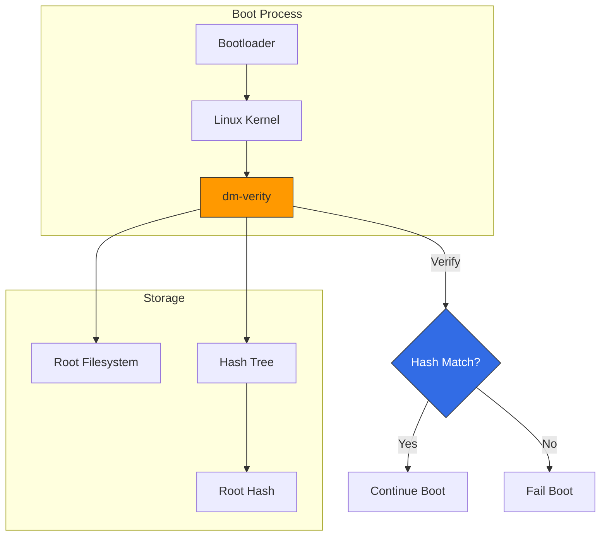

Beneficios clave:
- **Detección de manipulación**: Se detecta cualquier modificación de archivos del sistema
- **Verificación en el arranque**: La integridad del sistema se verifica antes de iniciar containers
- **Root de solo lectura**: El root filesystem se monta como read-only

### Immutable Infrastructure Strategy

Bottlerocket habilita un enfoque real de immutable infrastructure:

1. **Sin updates in-place**: Reemplaza nodes en lugar de parchearlos
2. **Estado consistente**: Cada node parte de una image conocida como válida
3. **Audit Trail**: Todos los cambios se rastrean mediante versiones de AMI
4. **Recuperación rápida**: Realiza rollback lanzando la AMI anterior

Patrón de implementación:

```yaml
# Node group with Bottlerocket
apiVersion: eksctl.io/v1alpha5
kind: ClusterConfig
metadata:
  name: secure-cluster
  region: us-west-2

managedNodeGroups:
  - name: bottlerocket-ng
    instanceType: m5.large
    desiredCapacity: 3
    amiFamily: Bottlerocket
    bottlerocket:
      settings:
        kubernetes:
          node-labels:
            os: bottlerocket
        host-containers:
          admin:
            enabled: false  # Disable admin container for production
```

### Using Bottlerocket with EKS Managed Node Groups

Configuración completa para managed node groups de Bottlerocket:

```bash
# Create managed node group with Bottlerocket
aws eks create-nodegroup \
  --cluster-name my-cluster \
  --nodegroup-name bottlerocket-nodes \
  --node-role arn:aws:iam::123456789012:role/EKSNodeRole \
  --subnets subnet-1 subnet-2 subnet-3 \
  --ami-type BOTTLEROCKET_x86_64 \
  --instance-types m5.large \
  --scaling-config minSize=2,maxSize=10,desiredSize=3 \
  --update-config maxUnavailable=1
```

Usando eksctl con configuración avanzada:

```yaml
apiVersion: eksctl.io/v1alpha5
kind: ClusterConfig
metadata:
  name: production-cluster
  region: us-west-2

managedNodeGroups:
  - name: bottlerocket-workers
    instanceType: m5.xlarge
    minSize: 3
    maxSize: 20
    desiredCapacity: 5
    amiFamily: Bottlerocket
    volumeSize: 100
    volumeType: gp3
    volumeEncrypted: true
    iam:
      attachPolicyARNs:
        - arn:aws:iam::aws:policy/AmazonEKSWorkerNodePolicy
        - arn:aws:iam::aws:policy/AmazonEKS_CNI_Policy
        - arn:aws:iam::aws:policy/AmazonEC2ContainerRegistryReadOnly
        - arn:aws:iam::aws:policy/AmazonSSMManagedInstanceCore
    bottlerocket:
      settings:
        kubernetes:
          node-labels:
            workload-type: general
            os: bottlerocket
          node-taints:
            - key: "CriticalAddonsOnly"
              value: "true"
              effect: "NoSchedule"
        kernel:
          sysctl:
            "net.core.somaxconn": "32768"
            "net.ipv4.tcp_max_syn_backlog": "32768"
        host-containers:
          admin:
            enabled: false
          control:
            enabled: true
```

## IAM Permission Boundaries

IAM Permission Boundaries proporcionan un mecanismo para establecer los permisos máximos que puede tener una entidad IAM, independientemente de qué policies tenga adjuntas.

### Permission Boundary Concept

Los permisos efectivos son la intersección de identity-based policies y permission boundaries:

```
Effective Permissions = Identity Policy ∩ Permission Boundary
```

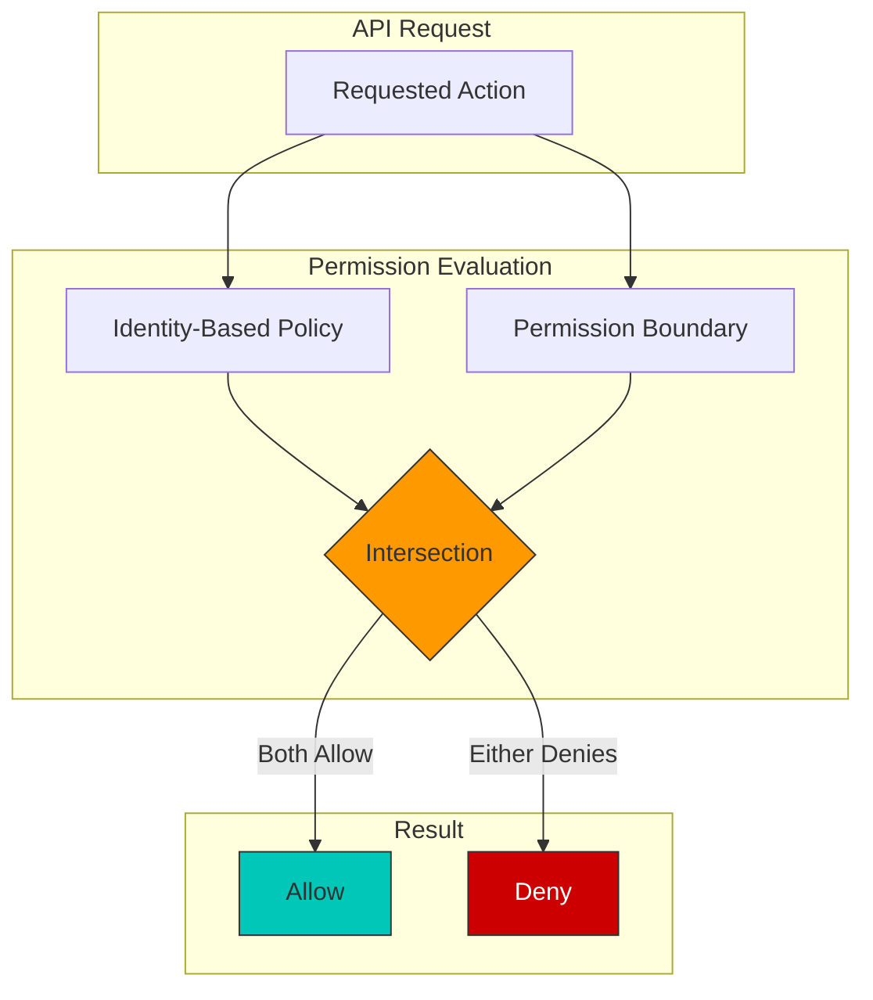

Escenario de ejemplo:
- Identity policy permite: `s3:*`, `ec2:*`, `rds:*`
- Permission boundary permite: `s3:*`, `ec2:Describe*`
- Permisos efectivos: `s3:*`, `ec2:Describe*`

### SCP (Service Control Policy) Usage

Las SCPs proporcionan guardrails a nivel de AWS Organizations:

```json
{
  "Version": "2012-10-17",
  "Statement": [
    {
      "Sid": "DenyEKSClusterDeletion",
      "Effect": "Deny",
      "Action": "eks:DeleteCluster",
      "Resource": "*",
      "Condition": {
        "StringNotLike": {
          "aws:PrincipalArn": "arn:aws:iam::*:role/EKSAdminRole"
        }
      }
    },
    {
      "Sid": "RequireIMDSv2",
      "Effect": "Deny",
      "Action": "ec2:RunInstances",
      "Resource": "arn:aws:ec2:*:*:instance/*",
      "Condition": {
        "StringNotEquals": {
          "ec2:MetadataHttpTokens": "required"
        }
      }
    },
    {
      "Sid": "DenyPublicEKSEndpoint",
      "Effect": "Deny",
      "Action": "eks:UpdateClusterConfig",
      "Resource": "*",
      "Condition": {
        "Bool": {
          "eks:endpointPublicAccess": "true"
        }
      }
    }
  ]
}
```

### Least Privilege IAM Policy Patterns

Buenas prácticas para EKS IAM policies:

**Patrón 1: Permisos con alcance de Namespace**

```json
{
  "Version": "2012-10-17",
  "Statement": [
    {
      "Sid": "AllowNamespaceOperations",
      "Effect": "Allow",
      "Action": [
        "eks:DescribeCluster",
        "eks:ListClusters"
      ],
      "Resource": "*"
    },
    {
      "Sid": "AllowSpecificClusterAccess",
      "Effect": "Allow",
      "Action": [
        "eks:AccessKubernetesApi"
      ],
      "Resource": "arn:aws:eks:us-west-2:123456789012:cluster/production-cluster",
      "Condition": {
        "StringEquals": {
          "eks:namespaces": ["team-a", "team-a-staging"]
        }
      }
    }
  ]
}
```

**Patrón 2: Restricciones basadas en recursos**

```json
{
  "Version": "2012-10-17",
  "Statement": [
    {
      "Sid": "AllowECRPull",
      "Effect": "Allow",
      "Action": [
        "ecr:GetDownloadUrlForLayer",
        "ecr:BatchGetImage",
        "ecr:BatchCheckLayerAvailability"
      ],
      "Resource": "arn:aws:ecr:us-west-2:123456789012:repository/approved-*"
    },
    {
      "Sid": "AllowECRAuth",
      "Effect": "Allow",
      "Action": "ecr:GetAuthorizationToken",
      "Resource": "*"
    }
  ]
}
```

**Patrón 3: Acceso basado en condiciones**

```json
{
  "Version": "2012-10-17",
  "Statement": [
    {
      "Sid": "AllowS3AccessWithTags",
      "Effect": "Allow",
      "Action": [
        "s3:GetObject",
        "s3:PutObject"
      ],
      "Resource": "arn:aws:s3:::app-bucket/*",
      "Condition": {
        "StringEquals": {
          "aws:ResourceTag/Environment": "${aws:PrincipalTag/Environment}"
        }
      }
    }
  ]
}
```

### EKS Node Role Permission Boundary Example

Aplica permission boundaries a EKS node roles para limitar el radio de impacto:

```json
{
  "Version": "2012-10-17",
  "Statement": [
    {
      "Sid": "AllowEKSNodeOperations",
      "Effect": "Allow",
      "Action": [
        "ec2:DescribeInstances",
        "ec2:DescribeVolumes",
        "ec2:DescribeNetworkInterfaces",
        "ec2:AttachVolume",
        "ec2:DetachVolume",
        "ecr:GetAuthorizationToken",
        "ecr:BatchCheckLayerAvailability",
        "ecr:GetDownloadUrlForLayer",
        "ecr:BatchGetImage",
        "logs:CreateLogStream",
        "logs:PutLogEvents"
      ],
      "Resource": "*"
    },
    {
      "Sid": "DenyPrivilegedActions",
      "Effect": "Deny",
      "Action": [
        "iam:*",
        "organizations:*",
        "account:*",
        "eks:DeleteCluster",
        "eks:UpdateClusterConfig",
        "ec2:DeleteVpc",
        "ec2:DeleteSubnet",
        "ec2:DeleteSecurityGroup"
      ],
      "Resource": "*"
    },
    {
      "Sid": "AllowSecretsInNamespace",
      "Effect": "Allow",
      "Action": [
        "secretsmanager:GetSecretValue"
      ],
      "Resource": "arn:aws:secretsmanager:*:*:secret:/eks/production/*"
    }
  ]
}
```

Aplica el boundary al node role:

```bash
# Create permission boundary
aws iam create-policy \
  --policy-name EKSNodePermissionBoundary \
  --policy-document file://node-permission-boundary.json

# Apply boundary to node role
aws iam put-role-permissions-boundary \
  --role-name EKSNodeRole \
  --permissions-boundary arn:aws:iam::123456789012:policy/EKSNodePermissionBoundary

# Verify boundary is applied
aws iam get-role --role-name EKSNodeRole --query "Role.PermissionsBoundary"
```

### Proactive Governance with 7 New IAM Condition Keys (April 2026)

> **Anunciado**: April 20, 2026 · [Source](https://aws.amazon.com/about-aws/whats-new/2026/04/amazon-eks-iam-condition-keys/)

Amazon EKS añadió siete nuevas IAM condition keys que te permiten aplicar gobernanza proactiva basada en policies al crear y actualizar clusters. Estas conditions pueden aplicarse a las APIs `CreateCluster`, `UpdateClusterConfig`, `UpdateClusterVersion` y `AssociateEncryptionConfig`, e integrarse con AWS Organizations SCPs.

| Condition Key | Propósito |
|----------------|---------|
| `eks:endpointPublicAccess` / `eks:endpointPrivateAccess` | Exigir el uso del private endpoint |
| `eks:encryptionConfigProviderKeyArns` | Requerir secrets encryption basada en KMS |
| `eks:kubernetesVersion` | Restringir la creación/actualización de clusters a versiones de Kubernetes aprobadas |
| `eks:controlPlaneScalingTier` | Restringir el scaling tier del control plane |
| `eks:deletionProtection` | Exigir protección contra eliminación del cluster |
| `eks:zonalShiftEnabled` | Controlar si zonal shift está habilitado |

```json
// SCP example: require private endpoint and KMS encryption
{
  "Version": "2012-10-17",
  "Statement": [
    {
      "Sid": "RequirePrivateEndpointAndKmsEncryption",
      "Effect": "Deny",
      "Action": [
        "eks:CreateCluster",
        "eks:UpdateClusterConfig"
      ],
      "Resource": "*",
      "Condition": {
        "Bool": {
          "eks:endpointPublicAccess": "true"
        }
      }
    },
    {
      "Sid": "RequireEncryptionConfig",
      "Effect": "Deny",
      "Action": "eks:CreateCluster",
      "Resource": "*",
      "Condition": {
        "Null": {
          "eks:encryptionConfigProviderKeyArns": "true"
        }
      }
    },
    {
      "Sid": "RestrictKubernetesVersion",
      "Effect": "Deny",
      "Action": [
        "eks:CreateCluster",
        "eks:UpdateClusterVersion"
      ],
      "Resource": "*",
      "Condition": {
        "StringNotEquals": {
          "eks:kubernetesVersion": ["1.32", "1.33"]
        }
      }
    }
  ]
}
```

## Encryption and Secrets Management

### EKS Encryption Options

#### etcd Encryption

EKS cifra Kubernetes secrets almacenados en etcd de forma predeterminada. Puedes usar AWS KMS para una capa adicional de cifrado:

```mermaid
flowchart TD
    subgraph Encryption_Options ["EKS Encryption Options"]
        subgraph ETCD_Encryption ["etcd Encryption"]
            Default[Default Encryption]
            KMS_Encryption[AWS KMS Encryption]
        end

        subgraph Secret_Management ["Secrets Management Solutions"]
            K8s_Secrets[Kubernetes Secrets]
            AWS_SM[AWS Secrets Manager]
            AWS_PS[AWS Parameter Store]
            Vault[HashiCorp Vault]
            SOPS[Mozilla SOPS]
        end

        subgraph Integration_Tools ["Integration Tools"]
            ESO["External Secrets
                Operator"]
            ASCP["AWS Secrets and
                Configuration Provider"]
            CSI_Driver["Secrets Store
                CSI Driver"]
        end
    end

    subgraph Usage_Patterns ["Usage Patterns"]
        subgraph Storage ["Storage"]
            Encrypted_Storage[Encrypted Storage]
            Version_Control[Version Control]
            Access_Control[Access Control]
        end

        subgraph Retrieval ["Retrieval"]
            Pod_Mount[Pod Mount]
            Env_Vars[Environment Variables]
            Init_Container[Init Container]
        end
    end

    KMS_Encryption --> Default

    AWS_SM --> ESO
    AWS_PS --> ESO
    AWS_SM --> ASCP
    AWS_PS --> ASCP
    Vault --> CSI_Driver

    ESO --> K8s_Secrets
    ASCP --> K8s_Secrets
    CSI_Driver --> K8s_Secrets

    K8s_Secrets --> Encrypted_Storage
    AWS_SM --> Encrypted_Storage
    AWS_PS --> Encrypted_Storage
    Vault --> Encrypted_Storage
    SOPS --> Encrypted_Storage

    AWS_SM --> Version_Control
    Vault --> Version_Control

    AWS_SM --> Access_Control
    AWS_PS --> Access_Control
    Vault --> Access_Control

    K8s_Secrets --> Pod_Mount
    K8s_Secrets --> Env_Vars
    K8s_Secrets --> Init_Container

    %% Class definitions
    classDef awsService fill:#FF9900,stroke:#333,stroke-width:1px,color:black;
    classDef k8sComponent fill:#326CE5,stroke:#333,stroke-width:1px,color:white;
    classDef userApp fill:#00C7B7,stroke:#333,stroke-width:1px,color:white;
    classDef dataStore fill:#3B48CC,stroke:#333,stroke-width:1px,color:white;
    classDef default fill:#f9f9f9,stroke:#333,stroke-width:1px,color:black;

    %% Class application
    class KMS_Encryption,AWS_SM,AWS_PS,ASCP awsService;
    class K8s_Secrets,ESO,CSI_Driver k8sComponent;
    class Vault,SOPS userApp;
    class Default,Encrypted_Storage,Version_Control,Access_Control,Pod_Mount,Env_Vars,Init_Container default;
```

```bash
eksctl create cluster --name my-cluster --region us-west-2 --encryption-provider-config-key arn:aws:kms:us-west-2:111122223333:key/1234abcd-12ab-34cd-56ef-1234567890ab
```

### AWS Secrets Manager and Parameter Store Integration

Puedes usar External Secrets Operator o AWS Secrets and Configuration Provider (ASCP) para montar secrets almacenados en AWS Secrets Manager o Parameter Store en Kubernetes pods.

#### Install External Secrets Operator

```bash
helm repo add external-secrets https://charts.external-secrets.io
helm install external-secrets external-secrets/external-secrets -n external-secrets --create-namespace
```

#### Define SecretStore and ExternalSecret

```yaml
apiVersion: external-secrets.io/v1beta1
kind: SecretStore
metadata:
  name: aws-secretsmanager
spec:
  provider:
    aws:
      service: SecretsManager
      region: us-west-2
      auth:
        jwt:
          serviceAccountRef:
            name: external-secrets-sa
---
apiVersion: external-secrets.io/v1beta1
kind: ExternalSecret
metadata:
  name: db-credentials
spec:
  refreshInterval: 1h
  secretStoreRef:
    name: aws-secretsmanager
    kind: SecretStore
  target:
    name: db-credentials
  data:
  - secretKey: username
    remoteRef:
      key: db-credentials
      property: username
  - secretKey: password
    remoteRef:
      key: db-credentials
      property: password
```

### SOPS (Secrets OPerationS)

Puedes usar Mozilla SOPS para almacenar y gestionar de forma segura encrypted secrets en repositorios Git.

#### SOPS Installation and Usage

```bash
# Install SOPS
brew install sops

# Encrypt secrets using AWS KMS key
sops --encrypt --aws-profile default --kms arn:aws:kms:us-west-2:111122223333:key/1234abcd-12ab-34cd-56ef-1234567890ab secrets.yaml > secrets.enc.yaml

# Decrypt encrypted secrets
sops --decrypt secrets.enc.yaml
```

## Compliance and Auditing

### EKS Audit Logging

Puedes habilitar EKS control plane audit logs para registrar todas las API calls realizadas en el cluster:

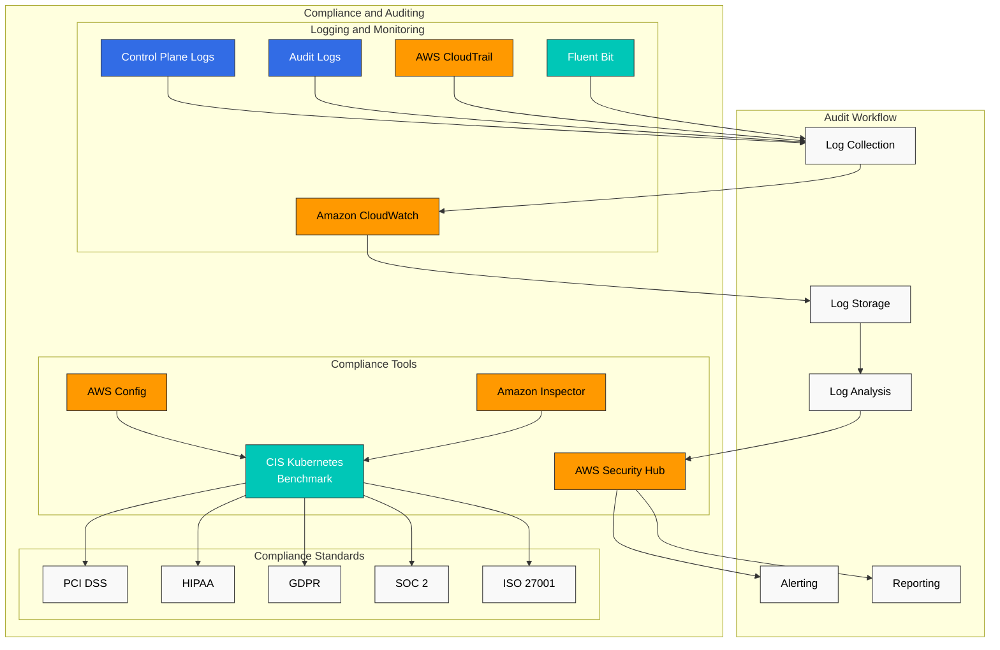

```bash
aws eks update-cluster-config \
  --region us-west-2 \
  --name my-cluster \
  --logging '{"clusterLogging":[{"types":["api","audit","authenticator","controllerManager","scheduler"],"enabled":true}]}'
```

### AWS Config Rules

Puedes usar AWS Config para monitorear el estado de cumplimiento de tu EKS cluster:

- eks-cluster-logging-enabled
- eks-cluster-oldest-supported-version
- eks-endpoint-no-public-access
- eks-secrets-encrypted

### AWS Security Hub Integration

Puedes usar AWS Security Hub para gestionar y monitorear centralmente la postura de seguridad de tu EKS cluster. Security Hub verifica el cumplimiento frente a estándares de la industria como CIS Kubernetes Benchmark.

## Security Monitoring and Detection

### GuardDuty EKS Protection

Puedes habilitar Amazon GuardDuty EKS Protection para detectar posibles amenazas de seguridad en tu EKS cluster:

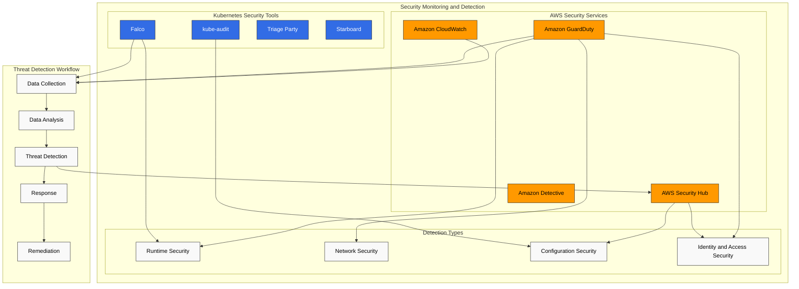

```bash
aws guardduty update-detector \
  --detector-id 12abc34d567e8fa901bc2d34e56789f0 \
  --features '[{"Name": "EKS_RUNTIME_MONITORING", "Status": "ENABLED"}]'
```

### AWS Security Hub

Puedes usar AWS Security Hub para gestionar y monitorear centralmente la postura de seguridad de tu EKS cluster:

```bash
aws securityhub enable-security-hub
aws securityhub batch-enable-standards --standards-subscription-requests '[{"StandardsArn":"arn:aws:securityhub:us-west-2::standards/aws-foundational-security-best-practices/v/1.0.0"}]'
```

### Falco

Puedes usar Falco para realizar monitoreo de seguridad en runtime y detección de anomalías:

```bash
helm repo add falcosecurity https://falcosecurity.github.io/charts
helm install falco falcosecurity/falco --namespace falco --create-namespace
```

Ejemplo de regla de Falco:

```yaml
- rule: Terminal shell in container
  desc: A shell was spawned by a pod in the container
  condition: container and shell_procs and not container_entrypoint
  output: Shell spawned in a container (user=%user.name pod=%k8s.pod.name container=%container.name shell=%proc.name parent=%proc.pname cmdline=%proc.cmdline)
  priority: WARNING
```

## EKS Security Best Practices

### Cluster Security Hardening

1. **Mantener la versión más reciente de Kubernetes**: Actualiza regularmente el EKS cluster a la versión más reciente para aplicar security patches
2. **Usar Private API Endpoint**: Restringe el acceso al API server desde internet público
3. **Aplicar el principio de mínimo privilegio**: Aplica el principio de mínimo privilegio a IAM roles y RBAC
4. **Restringir Security Groups**: Configura security groups para permitir solo los puertos necesarios
5. **Implementar Network Policies**: Aplica network policies para restringir la comunicación entre pods

### Node and Container Security

1. **Usar la AMI más reciente**: Usa EKS-optimized AMI con los security patches más recientes
2. **Escanear Container Images**: Usa ECR image scanning o herramientas como Trivy para vulnerability scanning
3. **Usar Immutable Infrastructure**: Crea nuevos node groups y elimina los node groups antiguos al actualizar nodes
4. **Ejecutar Containers como Non-Root User**: Ejecuta containers como non-root user para limitar privilegios
5. **Usar Read-Only Filesystem**: Monta el root filesystem del container como read-only cuando sea posible

### Continuous Security Monitoring

1. **Habilitar Audit Logging**: Habilita EKS control plane audit logs
2. **Habilitar GuardDuty EKS Protection**: Habilita GuardDuty EKS Protection para monitoreo de seguridad en runtime
3. **Integración con Security Hub**: Usa AWS Security Hub para la gestión centralizada de la postura de seguridad
4. **Evaluaciones de seguridad regulares**: Realiza evaluaciones de seguridad periódicas basadas en CIS Kubernetes Benchmark
5. **Establecer un plan de respuesta a incidentes**: Establece y prueba un plan de respuesta a incidentes de seguridad para el EKS cluster

## EKS Security Considerations for Financial Services

Requisitos de seguridad adicionales que se deben considerar al usar EKS en la industria de servicios financieros:

### Regulatory Compliance

1. **PCI DSS**: Cumplimiento de requisitos PCI DSS para workloads que procesan datos de pago con tarjeta
2. **GDPR/CCPA**: Cumplimiento de regulaciones de protección de datos para información de identificación personal (PII)
3. **Regulaciones financieras**: Cumplimiento de requisitos regulatorios financieros nacionales (por ejemplo, directrices de la autoridad supervisora financiera)

### Data Security

1. **Encryption in Transit**: Cifra todas las comunicaciones de red usando TLS 1.2 o superior
2. **Data at Rest Encryption**: Cifra data at rest usando AWS KMS
3. **Data Classification**: Clasifica los datos por sensibilidad y aplica controles de seguridad adecuados
4. **Data Access Logging**: Logging y monitoreo detallados para todo acceso a datos sensibles

### High Availability and Disaster Recovery

1. **Multi-AZ Deployment**: Despliega el EKS cluster en varias availability zones
2. **Disaster Recovery Plan**: Establece un disaster recovery plan que incluya backups regulares y pruebas de recuperación
3. **Business Continuity**: Define RTO (Recovery Time Objective) y RPO (Recovery Point Objective) adecuados para servicios financieros

### EKS Security Architecture Example for Financial Services

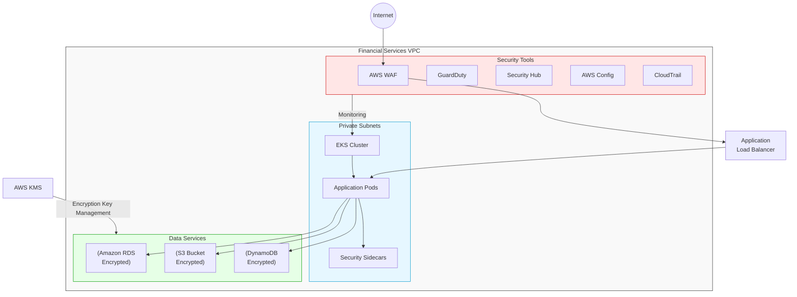

## Conclusion

La seguridad de Amazon EKS se implementa mediante una estrategia de defensa de varias capas. Puedes operar tu EKS cluster de forma segura mediante autenticación y autorización sólidas con IAM y RBAC, seguridad de red mediante network policies y security groups, seguridad de workloads mediante Pod Security Standards y security context, e integración con diversos AWS security services.

En industrias con regulaciones estrictas, como los servicios financieros, se deben considerar controles de seguridad y requisitos de cumplimiento adicionales. Es importante mantener la postura de seguridad de tu entorno EKS mediante evaluaciones de seguridad regulares, vulnerability scanning y monitoreo continuo.

## References

- [Amazon EKS Security Best Practices](https://aws.github.io/aws-eks-best-practices/security/docs/)
- [Kubernetes Security Best Practices](https://kubernetes.io/docs/concepts/security/overview/)
- [CIS Kubernetes Benchmark](https://www.cisecurity.org/benchmark/kubernetes)
- [AWS Security Hub](https://aws.amazon.com/security-hub/)
- [Amazon GuardDuty](https://aws.amazon.com/guardduty/)
- [Amazon EKS Customer-Routed Control Plane Egress (2026-06-18)](https://aws.amazon.com/about-aws/whats-new/2026/06/amazon-eks-customer-routed-control-plane-egress/)
- [Amazon EKS New IAM Condition Keys (2026-04-20)](https://aws.amazon.com/about-aws/whats-new/2026/04/amazon-eks-iam-condition-keys/)

## Quiz

Para comprobar lo que aprendiste en este capítulo, intenta el [quiz del tema](../quizzes/eks/05-eks-security-quiz.md).
