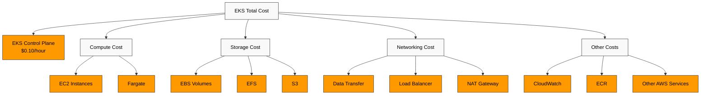
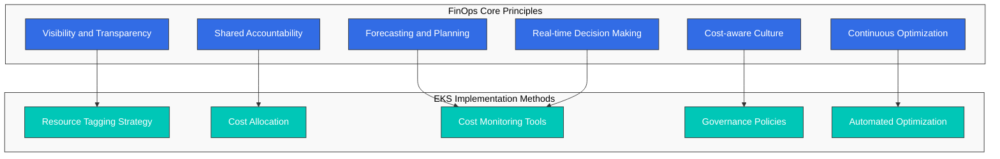
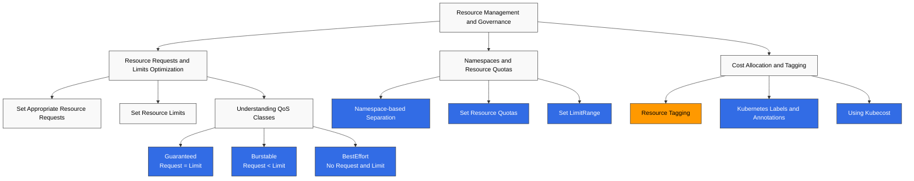

# Amazon EKS Cost Optimization

> **Supported Versions**: Amazon EKS 1.31, 1.32, 1.33
> **Última actualización**: February 22, 2026

Amazon EKS (Elastic Kubernetes Service) facilita desplegar, administrar y escalar aplicaciones en contenedores, pero gestionar los costos de forma eficaz es importante. Este documento cubre varias estrategias y mejores prácticas para optimizar los costos de tu cluster de EKS.

## Table of Contents

1. [EKS Cost Components](#eks-cost-components)
2. [FinOps Principles and EKS](#finops-principles-and-eks)
3. [Compute Cost Optimization](#compute-cost-optimization)
4. [Storage Cost Optimization](#storage-cost-optimization)
5. [Networking Cost Optimization](#networking-cost-optimization)
6. [Resource Management and Governance](#resource-management-and-governance)
7. [Cost Monitoring and Analysis](#cost-monitoring-and-analysis)
8. [Cost Optimization Best Practices](#cost-optimization-best-practices)

## EKS Cost Components

Los costos en los que se incurre al usar Amazon EKS constan de los siguientes componentes:



## FinOps Principles and EKS

FinOps (Financial Operations) es un modelo operativo para la gestión de costos en la nube en el que los equipos de finanzas, tecnología y negocio colaboran para compartir la responsabilidad del gasto en la nube y tomar decisiones de optimización de costos.

### Core Principles of the FinOps Framework



### Applying FinOps to EKS

1. **Lograr visibilidad de costos**
   - Asignación de costos usando namespaces, labels y annotations de Kubernetes
   - Análisis detallado de costos mediante la integración de herramientas como AWS Cost Explorer y Kubecost
   - Análisis de costos por equipo, aplicación y entorno

2. **Implementar un modelo de responsabilidad compartida**
   - Asignación de costos e informes por equipo
   - Definir y hacer seguimiento de objetivos de optimización de costos
   - Proporcionar incentivos por ahorros de costos

3. **Automatizar la optimización continua**
   - Implementar políticas de auto-scaling
   - Automatizar el uso de spot instances
   - Detectar y eliminar recursos inactivos

4. **Previsión y planificación de costos**
   - Previsión de costos mediante el análisis de patrones de workload
   - Uso de Reserved Instances y Savings Plans
   - Detección de anomalías de costos y alertas

### Latest FinOps Tools and Technologies

1. **Kubecost**: herramienta de monitoreo y optimización de costos de Kubernetes
2. **AWS Cost Anomaly Detection**: detección de aumentos anormales de costos
3. **Karpenter**: aprovisionamiento eficiente de nodes y optimización de costos
4. **Goldilocks**: optimización de resource requests y limits
5. **Vertical Pod Autoscaler**: ajuste automático de resource requests de pod

### EKS Cluster Cost

Costo del cluster de EKS en sí:

- **EKS Control Plane**: $0.10 por hora (puede variar según la región)
- **EKS Extended Cluster**: $0.10 por hora (puede variar según la región)

### Compute Cost

Costo de los worker nodes que se ejecutan en el cluster de EKS:

- **EC2 Instances**: costo de las EC2 instances usadas para node groups
- **Fargate**: costo basado en el uso de vCPU y memoria al usar Fargate profiles

### Storage Cost

Costo del almacenamiento usado en el cluster de EKS:

- **EBS Volumes**: costo de los EBS volumes usados para persistent volumes
- **EFS**: costo de EFS usado para sistemas de archivos compartidos
- **S3**: costo de S3 usado para almacenamiento de objetos

### Networking Cost

Costo relacionado con networking para el cluster de EKS:

- **Data Transfer**: costo de la transferencia de datos entre regiones o hacia Internet
- **Load Balancer**: costo de los load balancers usados para services
- **NAT Gateway**: costo de NAT gateway para tráfico saliente desde private subnets

### Other Costs

- **CloudWatch**: costo de CloudWatch usado para monitoreo y logging
- **ECR**: costo de ECR usado para almacenamiento de container images
- **Other AWS Services**: costo de otros AWS services usados con el cluster de EKS

## Compute Cost Optimization

El costo de compute suele ser el componente de costo más grande de un cluster de EKS. Puedes optimizar los costos de compute usando las siguientes estrategias.

```mermaid
flowchart TD
    ComputeCost[Compute Cost Optimization] --> InstanceType[Instance Type Optimization]
    ComputeCost --> SpotInstances[Spot Instance Utilization]
    ComputeCost --> SavingsPlans["Savings Plans and
                Reserved Instances"]
    ComputeCost --> AutoScaling[Auto Scaling Optimization]
    ComputeCost --> FargateVsEC2["Fargate vs EC2
                Cost Comparison"]

    InstanceType --> Family[Instance Family Selection]
    InstanceType --> Size[Instance Size Optimization]
    InstanceType --> Generation[Instance Generation Consideration]

    SpotInstances --> WorkloadTypes[Suitable Workload Types]
    SpotInstances --> ManagedNodeGroups[Managed Node Groups]
    SpotInstances --> Karpenter[Karpenter Utilization]
    SpotInstances --> InterruptionHandling[Interruption Handling]

    SavingsPlans --> ComputeSP[Compute Savings Plans]
    SavingsPlans --> EC2SP[EC2 Instance Savings Plans]
    SavingsPlans --> RI[Reserved Instances]

    AutoScaling --> CA[Cluster Autoscaler]
    AutoScaling --> KarpenterAS[Karpenter]
    AutoScaling --> HPA[Horizontal Pod Autoscaler]
    AutoScaling --> VPA[Vertical Pod Autoscaler]

    %% Class definitions
    classDef awsService fill:#FF9900,stroke:#333,stroke-width:1px,color:black;
    classDef k8sComponent fill:#326CE5,stroke:#333,stroke-width:1px,color:white;
    classDef default fill:#f9f9f9,stroke:#333,stroke-width:1px,color:black;

    %% Class application
    class ComputeSP,EC2SP,RI,SpotInstances,ManagedNodeGroups awsService;
    class CA,KarpenterAS,HPA,VPA,Karpenter k8sComponent;
    class ComputeCost,InstanceType,Family,Size,Generation,WorkloadTypes,InterruptionHandling,SavingsPlans,AutoScaling,FargateVsEC2 default;
```



### Selecting the Right Instance Type

Seleccionar el instance type correcto para tu workload es importante:

#### Instance Family Selection

Selecciona la instance family adecuada según las características del workload:

- **General Purpose (T3, M5, M6)**: Workloads que requieren recursos equilibrados de compute, memoria y networking
- **Compute Optimized (C5, C6)**: Workloads intensivos en compute que requieren procesadores de alto rendimiento
- **Memory Optimized (R5, R6, X1)**: Workloads intensivos en memoria, como grandes bases de datos en memoria y cachés
- **Storage Optimized (I3, D2)**: Workloads que requieren alto I/O de disco
- **Accelerated Computing (P3, G4, Inf1)**: Workloads que requieren GPU o aceleradores de machine learning

#### Instance Size Optimization

Selecciona el instance size adecuado para los requisitos de tu workload:

- Las instances demasiado grandes pueden provocar desperdicio de recursos.
- Las instances demasiado pequeñas pueden causar problemas de rendimiento.
- Usa CloudWatch Container Insights o métricas de Kubernetes para monitorear el uso real de recursos y seleccionar el tamaño adecuado.

#### Instance Generation Consideration

Las instances de generaciones más recientes generalmente ofrecen mejor rendimiento y eficiencia de costos que las generaciones anteriores:

- Usa M6i o M6g en lugar de M5
- Usa C6i o C6g en lugar de C5
- Usa R6i o R6g en lugar de R5

### Spot Instance Utilization

El uso de spot instances te permite usar EC2 instances con hasta un 90% menos que los precios on-demand:

#### Workloads Suitable for Spot Instances

- **Stateless Applications**: aplicaciones que no almacenan estado
- **Fault-tolerant Applications**: aplicaciones que pueden manejar interrupciones de instances
- **Batch Processing Jobs**: Jobs que pueden reiniciarse si se interrumpen
- **CI/CD Pipelines**: Jobs de build y prueba

#### Using Spot Instances in Managed Node Groups

```bash
eksctl create nodegroup \
  --cluster my-cluster \
  --name my-spot-ng \
  --node-type m5.large \
  --nodes-min 2 \
  --nodes-max 5 \
  --spot
```

#### Spot Instance Provisioning with Karpenter

```yaml
apiVersion: karpenter.sh/v1
kind: NodePool
metadata:
  name: spot
spec:
  template:
    spec:
      requirements:
      - key: karpenter.sh/capacity-type
        operator: In
        values: ["spot"]
      - key: kubernetes.io/arch
        operator: In
        values: ["amd64"]
      - key: node.kubernetes.io/instance-type
        operator: In
        values: ["m5.large", "m5.xlarge", "m5.2xlarge"]
      nodeClassRef:
        group: karpenter.k8s.aws
        kind: EC2NodeClass
        name: spot-class
  limits:
    cpu: 1000
    memory: 1000Gi
  disruption:
    consolidationPolicy: WhenEmpty
    consolidateAfter: 30s
---
apiVersion: karpenter.k8s.aws/v1
kind: EC2NodeClass
metadata:
  name: spot-class
spec:
  subnetSelectorTerms:
    - tags:
        karpenter.sh/discovery: my-cluster
  securityGroupSelectorTerms:
    - tags:
        karpenter.sh/discovery: my-cluster
```

#### Spot Instance Interruption Handling

Mejores prácticas para manejar interrupciones de spot instances:

1. **Usar múltiples instance types**: distribuye el riesgo de interrupción usando varios instance types
2. **Usar múltiples Availability Zones**: despliega instances en múltiples availability zones
3. **Usar Spot Instance Interruption Handler**: usa AWS Node Termination Handler para manejar notificaciones de interrupción

```bash
helm repo add eks https://aws.github.io/eks-charts
helm install aws-node-termination-handler \
  --namespace kube-system \
  eks/aws-node-termination-handler \
  --set enableSpotInterruptionDraining=true
```

### Savings Plans and Reserved Instances

Para workloads predecibles, puedes reducir costos usando Savings Plans o Reserved Instances:

#### Compute Savings Plans

Compute Savings Plans ofrecen hasta un 66% de descuento sobre tarifas on-demand con un compromiso de 1 o 3 años:

- **Flexibility**: se aplica independientemente de instance family, size, OS, tenancy y región
- **Includes EC2, Fargate, and Lambda**: se aplica a través de múltiples servicios de compute

#### EC2 Instance Savings Plans

EC2 Instance Savings Plans ofrecen hasta un 72% de descuento para instance families en una región específica:

- **Moderate Flexibility**: se aplica a tamaños y OS dentro de una instance family en una región específica
- **Higher Discount Rate**: ofrece una tasa de descuento mayor que Compute Savings Plans

#### Reserved Instances

Reserved Instances ofrecen hasta un 75% de descuento para instance types y regiones específicos:

- **Low Flexibility**: vinculado a instance types, regiones y availability zones específicos
- **Highest Discount Rate**: ofrece la tasa de descuento más alta

### Fargate vs EC2 Cost Comparison

Al elegir entre Fargate y EC2, considera los costos:

#### Fargate Advantages

- **Reduced Operational Overhead**: no se requiere administración de nodes
- **Precise Resource Provisioning**: asignación de recursos a nivel de pod
- **No Idle Capacity**: paga solo por pods en ejecución

#### EC2 Advantages

- **More Cost-efficient for Large Workloads**: para casos de alta utilización de recursos
- **More Instance Type Options**: permite seleccionar instance types para varios workloads
- **Spot Instance Support**: posibles ahorros adicionales usando spot instances

#### Cost Comparison Example

**Escenario**: aplicación que usa 2vCPU y 4GB de memoria

**Costo de Fargate**:
- vCPU: $0.04048 por vCPU-hora × 2 = $0.08096 por hora
- Memoria: $0.004445 por GB-hora × 4 = $0.01778 por hora
- Costo total: $0.09874 por hora

**Costo de EC2 (t3.medium)**:
- On-demand: $0.0416 por hora
- Spot: ~$0.0125 por hora (suponiendo un 70% de descuento)

En este ejemplo, EC2 es más eficiente en costos, pero se deben considerar la sobrecarga de administración de nodes y la utilización del cluster.

### Auto Scaling Optimization

Puedes optimizar costos implementando estrategias eficaces de auto-scaling:

#### Cluster Autoscaler

Cluster Autoscaler agrega nodes automáticamente cuando los pods no se pueden programar y elimina nodes cuando no están suficientemente utilizados:

```bash
# Install Cluster Autoscaler
kubectl apply -f https://raw.githubusercontent.com/kubernetes/autoscaler/master/cluster-autoscaler/cloudprovider/aws/examples/cluster-autoscaler-autodiscover.yaml

# Configure Cluster Autoscaler
kubectl -n kube-system set env deployment.apps/cluster-autoscaler \
  CLUSTER_NAME=my-cluster \
  AWS_REGION=us-west-2
```

Optimización de la configuración de Cluster Autoscaler:

- **scale-down-delay-after-add**: retraso antes del scale down después de agregar un node (predeterminado: 10 minutos)
- **scale-down-unneeded-time**: tiempo antes de que un node se considere innecesario (predeterminado: 10 minutos)
- **max-node-provision-time**: tiempo máximo de espera para el aprovisionamiento de nodes (predeterminado: 15 minutos)

```bash
kubectl -n kube-system set env deployment.apps/cluster-autoscaler \
  CLUSTER_AUTOSCALER_EXPANDER=least-waste \
  CLUSTER_AUTOSCALER_SCALE_DOWN_DELAY_AFTER_ADD=5m \
  CLUSTER_AUTOSCALER_SCALE_DOWN_UNNEEDED_TIME=5m
```

#### Karpenter

Karpenter es una alternativa a Cluster Autoscaler, que proporciona un aprovisionamiento de nodes más rápido y flexible:

```yaml
apiVersion: karpenter.sh/v1
kind: NodePool
metadata:
  name: default
spec:
  template:
    spec:
      requirements:
      - key: kubernetes.io/arch
        operator: In
        values: ["amd64"]
      - key: node.kubernetes.io/instance-type
        operator: In
        values: ["m5.large", "m5.xlarge", "m5.2xlarge"]
      nodeClassRef:
        group: karpenter.k8s.aws
        kind: EC2NodeClass
        name: default-class
  limits:
    cpu: 1000
    memory: 1000Gi
  disruption:
    consolidationPolicy: WhenEmpty
    consolidateAfter: 30s
---
apiVersion: karpenter.k8s.aws/v1
kind: EC2NodeClass
metadata:
  name: default-class
spec:
  subnetSelectorTerms:
    - tags:
        karpenter.sh/discovery: my-cluster
  securityGroupSelectorTerms:
    - tags:
        karpenter.sh/discovery: my-cluster
```

Configuraciones de optimización de costos de Karpenter:

- **ttlSecondsAfterEmpty**: tiempo hasta la terminación después de que un node queda vacío (por ejemplo, 30 segundos)
- **consolidation.enabled**: habilitar consolidación de nodes (predeterminado: true)
- **instance-types**: especificar instance types eficientes en costos

#### Horizontal Pod Autoscaler (HPA)

HPA ajusta automáticamente el número de pods según la utilización de CPU o métricas personalizadas:

```yaml
apiVersion: autoscaling/v2
kind: HorizontalPodAutoscaler
metadata:
  name: app-hpa
spec:
  scaleTargetRef:
    apiVersion: apps/v1
    kind: Deployment
    name: app
  minReplicas: 2
  maxReplicas: 10
  metrics:
  - type: Resource
    resource:
      name: cpu
      target:
        type: Utilization
        averageUtilization: 70
  - type: Resource
    resource:
      name: memory
      target:
        type: Utilization
        averageUtilization: 80
```

Configuraciones de optimización de HPA:

- **--horizontal-pod-autoscaler-downscale-stabilization**: período de estabilización de scale down (predeterminado: 5 minutos)
- **--horizontal-pod-autoscaler-cpu-initialization-period**: período de inicialización de CPU (predeterminado: 5 minutos)
- **--horizontal-pod-autoscaler-initial-readiness-delay**: retraso inicial de readiness (predeterminado: 30 segundos)

#### Vertical Pod Autoscaler (VPA)

VPA ajusta automáticamente las CPU y memory requests de pod para optimizar la utilización de recursos:

```yaml
apiVersion: autoscaling.k8s.io/v1
kind: VerticalPodAutoscaler
metadata:
  name: app-vpa
spec:
  targetRef:
    apiVersion: apps/v1
    kind: Deployment
    name: app
  updatePolicy:
    updateMode: Auto
  resourcePolicy:
    containerPolicies:
    - containerName: '*'
      minAllowed:
        cpu: 50m
        memory: 100Mi
      maxAllowed:
        cpu: 1
        memory: 1Gi
```

Modos de VPA:

- **Auto**: reinicia pods automáticamente para actualizar resource requests
- **Initial**: establece resource requests solo para nuevos pods
- **Off**: proporciona solo recomendaciones, sin actualizaciones automáticas
## Storage Cost Optimization

El almacenamiento es un componente de costo importante de los clusters de EKS. Puedes optimizar los costos de almacenamiento usando las siguientes estrategias.

```mermaid
flowchart TD
    StorageCost[Storage Cost Optimization] --> EBSOptimize[EBS Volume Optimization]
    StorageCost --> EFSOptimize[EFS Cost Optimization]
    StorageCost --> S3Optimize[S3 Cost Optimization]

    EBSOptimize --> VolumeType[Select Appropriate Volume Type]
    EBSOptimize --> GP3Migration[Migrate to gp3]
    EBSOptimize --> VolumeSize[Volume Size Optimization]
    EBSOptimize --> LifecycleManagement[Volume Lifecycle Management]

    EFSOptimize --> ThroughputMode[Select Appropriate Throughput Mode]
    EFSOptimize --> EFSLifecycle[Lifecycle Management]
    EFSOptimize --> AccessPatterns[Access Pattern Optimization]

    S3Optimize --> StorageClass[Storage Class Optimization]
    S3Optimize --> LifecyclePolicy[Lifecycle Policy]
    S3Optimize --> RequestOptimize[S3 Request Optimization]

    VolumeType --> GP3[gp3: General Purpose SSD]
    VolumeType --> GP2[gp2: Previous Generation General Purpose SSD]
    VolumeType --> IO[io1/io2: Provisioned IOPS SSD]
    VolumeType --> ST1[st1: Throughput Optimized HDD]
    VolumeType --> SC1[sc1: Cold HDD]

    StorageClass --> Standard[S3 Standard]
    StorageClass --> IntelligentTiering[S3 Intelligent-Tiering]
    StorageClass --> StandardIA[S3 Standard-IA]
    StorageClass --> OneZoneIA[S3 One Zone-IA]
    StorageClass --> Glacier[S3 Glacier]

    %% Class definitions
    classDef awsService fill:#FF9900,stroke:#333,stroke-width:1px,color:black;
    classDef dataStore fill:#3B48CC,stroke:#333,stroke-width:1px,color:white;
    classDef default fill:#f9f9f9,stroke:#333,stroke-width:1px,color:black;

    %% Class application
    class GP3,GP2,IO,ST1,SC1,Standard,IntelligentTiering,StandardIA,OneZoneIA,Glacier awsService;
    class StorageCost,EBSOptimize,EFSOptimize,S3Optimize,VolumeType,GP3Migration,VolumeSize,LifecycleManagement,ThroughputMode,EFSLifecycle,AccessPatterns,StorageClass,LifecyclePolicy,RequestOptimize default;
```



### EBS Volume Optimization

EBS volumes se usan principalmente para almacenamiento persistente en clusters de EKS:

#### Select Appropriate Volume Type

Selecciona el tipo de EBS volume adecuado para tu workload:

- **gp3**: SSD de uso general recomendado para la mayoría de los workloads
- **gp2**: SSD de uso general de generación anterior; se recomienda migrar a gp3
- **io1/io2**: SSD de IOPS provisionadas para workloads de alto rendimiento
- **st1**: HDD optimizado para throughput para workloads intensivos en throughput
- **sc1**: HDD frío para datos accedidos con poca frecuencia

gp3 es más eficiente en costos que gp2 y tiene mayor rendimiento base:

| Volume Type | Baseline IOPS | Max IOPS | Baseline Throughput | Max Throughput | Price per GB |
|------------|--------------|----------|---------------------|----------------|--------------|
| gp3        | 3,000        | 16,000   | 125 MiB/s           | 1,000 MiB/s    | $0.08/GB-month |
| gp2        | 3 IOPS/GB    | 16,000   | Up to 250 MiB/s     | 250 MiB/s      | $0.10/GB-month |

#### Migrate to gp3

Migra los volumes gp2 existentes a gp3 para reducir costos:

```yaml
apiVersion: storage.k8s.io/v1
kind: StorageClass
metadata:
  name: gp3
  annotations:
    storageclass.kubernetes.io/is-default-class: "true"
provisioner: ebs.csi.aws.com
parameters:
  type: gp3
  encrypted: "true"
allowVolumeExpansion: true
```

Migración de PVC existente a gp3:

1. Crea un volume snapshot
2. Crea un nuevo PVC con volume gp3 desde el snapshot
3. Migra la aplicación al nuevo PVC

#### Volume Size Optimization

Provisiona solo el volume size necesario:

- Los volumes sobreaprovisionados generan costos innecesarios.
- Monitorea el uso de volumes y ajusta el tamaño según sea necesario.
- Considera soluciones de auto-expansion para ajustar automáticamente el volume size según sea necesario.

#### Volume Lifecycle Management

Identifica y elimina volumes innecesarios:

- Revisa regularmente PVCs y PVs no utilizados
- Limpia volumes de pods terminados
- Define políticas de reclaim de PV adecuadas (Delete o Retain)

### EFS Cost Optimization

EFS es útil para workloads que requieren acceso compartido entre múltiples nodes:

#### Select Appropriate Throughput Mode

Selecciona el throughput mode de EFS adecuado para tu workload:

- **Bursting Throughput**: adecuado para patrones de acceso intermitentes
- **Provisioned Throughput**: adecuado para workloads que requieren rendimiento predecible
- **Elastic Throughput**: adecuado para workloads muy variables

#### Lifecycle Management

Usa la gestión de lifecycle de EFS para mover automáticamente archivos accedidos con poca frecuencia a la storage class IA (Infrequent Access):

```bash
aws efs put-lifecycle-configuration \
  --file-system-id fs-1234567890abcdef0 \
  --lifecycle-policies '[{"TransitionToIA":"AFTER_30_DAYS"}]'
```

#### Access Pattern Optimization

Optimiza los patrones de acceso a EFS para reducir costos:

- Usa archivos grandes en lugar de archivos pequeños
- Minimiza las operaciones de metadata
- Usa patrones de acceso secuenciales

### S3 Cost Optimization

S3 es una opción eficiente en costos para almacenar logs, backups, contenido estático, etc.:

#### Storage Class Optimization

Selecciona la storage class de S3 adecuada para tu workload:

- **S3 Standard**: datos accedidos con frecuencia
- **S3 Intelligent-Tiering**: datos con patrones de acceso cambiantes
- **S3 Standard-IA**: datos accedidos con poca frecuencia
- **S3 One Zone-IA**: datos no críticos accedidos con poca frecuencia
- **S3 Glacier**: datos de archivo

#### Lifecycle Policy

Usa políticas de lifecycle de S3 para mover automáticamente objetos a storage classes más baratas o expirarlos:

```json
{
  "Rules": [
    {
      "ID": "Move to IA after 30 days, Glacier after 90 days",
      "Status": "Enabled",
      "Prefix": "logs/",
      "Transitions": [
        {
          "Days": 30,
          "StorageClass": "STANDARD_IA"
        },
        {
          "Days": 90,
          "StorageClass": "GLACIER"
        }
      ],
      "Expiration": {
        "Days": 365
      }
    }
  ]
}
```

#### S3 Request Optimization

Optimiza los costos de requests de S3:

- Combina objetos pequeños en objetos más grandes
- Minimiza operaciones LIST innecesarias
- Considera usar S3 Transfer Acceleration o multipart uploads

## Networking Cost Optimization

Los costos de networking pueden ser significativos, especialmente con grandes transferencias de datos. Puedes optimizar los costos de networking usando las siguientes estrategias.

```mermaid
flowchart TD
    NetworkCost[Networking Cost Optimization] --> DataTransfer[Data Transfer Optimization]
    NetworkCost --> LoadBalancer[Load Balancer Optimization]
    NetworkCost --> NATGateway[NAT Gateway Optimization]

    DataTransfer --> RegionalComm[Utilize Intra-region Communication]
    DataTransfer --> AZRouting[Availability Zone Aware Routing]
    DataTransfer --> Compression[Use Compression]

    LoadBalancer --> LBType[Select Appropriate Load Balancer Type]
    LoadBalancer --> LBSharing[Load Balancer Sharing]
    LoadBalancer --> IdleLB[Remove Idle Load Balancers]

    NATGateway --> NATSharing[NAT Gateway Sharing]
    NATGateway --> VPCEndpoints[Use VPC Endpoints]
    NATGateway --> OutboundTraffic[Outbound Traffic Optimization]

    LBType --> NLB[Network Load Balancer]
    LBType --> ALB[Application Load Balancer]
    LBType --> CLB[Classic Load Balancer]

    VPCEndpoints --> S3Endpoint[S3 VPC Endpoint]
    VPCEndpoints --> DynamoDBEndpoint[DynamoDB VPC Endpoint]
    VPCEndpoints --> ECREndpoint[ECR VPC Endpoint]
    VPCEndpoints --> CloudWatchEndpoint[CloudWatch Logs VPC Endpoint]
    VPCEndpoints --> STSEndpoint[STS VPC Endpoint]

    %% Class definitions
    classDef awsService fill:#FF9900,stroke:#333,stroke-width:1px,color:black;
    classDef k8sComponent fill:#326CE5,stroke:#333,stroke-width:1px,color:white;
    classDef default fill:#f9f9f9,stroke:#333,stroke-width:1px,color:black;

    %% Class application
    class NLB,ALB,CLB,S3Endpoint,DynamoDBEndpoint,ECREndpoint,CloudWatchEndpoint,STSEndpoint awsService;
    class AZRouting k8sComponent;
    class NetworkCost,DataTransfer,LoadBalancer,NATGateway,RegionalComm,Compression,LBType,LBSharing,IdleLB,NATSharing,VPCEndpoints,OutboundTraffic default;
```



### Data Transfer Optimization

#### Utilize Intra-region Communication

Reduce los costos de transferencia de datos entre regiones comunicándote dentro de la misma región siempre que sea posible:

- Coloca el cluster de EKS y los AWS services relacionados en la misma región
- Minimiza la transferencia de datos entre regiones cuando abarques múltiples regiones

#### Availability Zone Aware Routing

Implementa routing consciente de availability zone para reducir los costos de transferencia de datos entre AZ:

- Usa topology-aware service routing
- Configura afinidad de availability zone

```yaml
apiVersion: v1
kind: Service
metadata:
  name: my-service
  annotations:
    service.kubernetes.io/topology-aware-hints: "auto"
spec:
  selector:
    app: my-app
  ports:
  - port: 80
    targetPort: 8080
  type: ClusterIP
```

#### Use Compression

Reduce la cantidad de datos transferidos usando compresión antes de la transferencia de datos:

- Compresión de respuestas de API
- Compresión de logs y métricas
- Optimización de imágenes y assets estáticos

### Load Balancer Optimization

#### Select Appropriate Load Balancer Type

Selecciona el tipo de load balancer adecuado para tu workload:

- **Network Load Balancer (NLB)**: tráfico TCP/UDP, cuando se necesita baja latencia
- **Application Load Balancer (ALB)**: tráfico HTTP/HTTPS, cuando se necesita routing basado en rutas
- **Classic Load Balancer (CLB)**: workloads legacy

#### Load Balancer Sharing

Reduce costos compartiendo load balancers entre múltiples services:

- Usa ALB Ingress Controller
- Expón múltiples services usando recursos Ingress

```bash
# Install ALB Ingress Controller
helm repo add eks https://aws.github.io/eks-charts
helm install aws-load-balancer-controller \
  eks/aws-load-balancer-controller \
  -n kube-system \
  --set clusterName=my-cluster
```

```yaml
apiVersion: networking.k8s.io/v1
kind: Ingress
metadata:
  name: shared-ingress
  annotations:
    kubernetes.io/ingress.class: alb
    alb.ingress.kubernetes.io/scheme: internet-facing
spec:
  rules:
  - host: service1.example.com
    http:
      paths:
      - path: /
        pathType: Prefix
        backend:
          service:
            name: service1
            port:
              number: 80
  - host: service2.example.com
    http:
      paths:
      - path: /
        pathType: Prefix
        backend:
          service:
            name: service2
            port:
              number: 80
```

#### Remove Idle Load Balancers

Identifica y elimina load balancers no utilizados:

- Monitorea load balancers sin tráfico
- Elimina load balancers innecesarios en entornos de prueba o desarrollo

### NAT Gateway Optimization

Los NAT gateways generan cargos por hora y cargos por procesamiento de datos:

#### NAT Gateway Sharing

Reduce costos compartiendo NAT gateways entre múltiples subnets:

- Usa un NAT gateway por availability zone
- Usa el mismo NAT gateway para múltiples private subnets

#### Use VPC Endpoints

Reduce los costos de NAT gateway usando VPC endpoints para acceso privado a AWS services:

```bash
# Create S3 VPC Endpoint
aws ec2 create-vpc-endpoint \
  --vpc-id vpc-1234567890abcdef0 \
  --service-name com.amazonaws.us-west-2.s3 \
  --route-table-ids rtb-1234567890abcdef0

# Create DynamoDB VPC Endpoint
aws ec2 create-vpc-endpoint \
  --vpc-id vpc-1234567890abcdef0 \
  --service-name com.amazonaws.us-west-2.dynamodb \
  --route-table-ids rtb-1234567890abcdef0
```

VPC endpoints usados comúnmente:

- S3
- DynamoDB
- ECR
- CloudWatch Logs
- STS

#### Outbound Traffic Optimization

Optimiza el tráfico saliente que pasa por NAT gateway:

- Minimiza llamadas innecesarias a API externas
- Programa grandes transferencias de datos en horas de baja demanda
- Usa compresión de datos

## Resource Management and Governance

La gestión y gobernanza eficaces de recursos son importantes para controlar los costos del cluster de EKS. Puedes gestionar recursos eficazmente usando las siguientes estrategias.



### Resource Requests and Limits Optimization

#### Set Appropriate Resource Requests

Establece resource requests que coincidan con los requisitos reales de recursos de tu aplicación:

- Requests demasiado altos provocan desperdicio de recursos.
- Requests demasiado bajos pueden causar problemas de rendimiento.
- Usa VPA (Vertical Pod Autoscaler) para optimizar resource requests

```yaml
apiVersion: v1
kind: Pod
metadata:
  name: app
spec:
  containers:
  - name: app
    image: app:latest
    resources:
      requests:
        cpu: 100m
        memory: 256Mi
      limits:
        cpu: 500m
        memory: 512Mi
```

#### Set Resource Limits

Establece resource limits para evitar que los containers usen recursos excesivos:

- CPU Limit: CPU máxima que un container puede usar
- Memory Limit: memoria máxima que un container puede usar

#### Understanding QoS Classes

Comprende y utiliza las clases QoS (Quality of Service) de Kubernetes:

- **Guaranteed**: Request = Limit (prioridad más alta)
- **Burstable**: Request < Limit
- **BestEffort**: sin request ni limit (prioridad más baja)

Cuando los recursos son escasos, los pods BestEffort se desalojan primero y luego los pods Burstable.

### Namespaces and Resource Quotas

#### Namespace-based Separation

Usa namespaces para separar recursos lógicamente:

- Crea namespaces por equipo, entorno o aplicación
- Monitorea el uso de recursos por namespace

#### Set Resource Quotas

Usa ResourceQuota para limitar el uso de recursos por namespace:

```yaml
apiVersion: v1
kind: ResourceQuota
metadata:
  name: team-quota
  namespace: team-a
spec:
  hard:
    requests.cpu: "10"
    requests.memory: 20Gi
    limits.cpu: "20"
    limits.memory: 40Gi
    pods: "20"
    services: "10"
    persistentvolumeclaims: "5"
```

#### Set LimitRange

Usa LimitRange para establecer resource limits predeterminados para containers dentro de un namespace:

```yaml
apiVersion: v1
kind: LimitRange
metadata:
  name: default-limits
  namespace: team-a
spec:
  limits:
  - default:
      cpu: 500m
      memory: 512Mi
    defaultRequest:
      cpu: 100m
      memory: 256Mi
    type: Container
```

### Cost Allocation and Tagging

#### Resource Tagging

Etiqueta AWS resources para rastrear y asignar costos:

- Etiqueta por equipo, proyecto, entorno, cost center, etc.
- Implementa una estrategia de tagging consistente

```bash
# Tag EKS cluster
aws eks tag-resource \
  --resource-arn arn:aws:eks:us-west-2:123456789012:cluster/my-cluster \
  --tags Team=DevOps,Environment=Production,CostCenter=123456

# Tag EC2 instance
aws ec2 create-tags \
  --resources i-1234567890abcdef0 \
  --tags Key=Team,Value=DevOps Key=Environment,Value=Production Key=CostCenter,Value=123456
```

#### Kubernetes Labels and Annotations

Etiqueta recursos de Kubernetes con labels y annotations para rastrear y asignar costos:

```yaml
apiVersion: apps/v1
kind: Deployment
metadata:
  name: app
  labels:
    app: app
    team: team-a
    environment: production
    cost-center: "123456"
spec:
  replicas: 3
  selector:
    matchLabels:
      app: app
  template:
    metadata:
      labels:
        app: app
        team: team-a
        environment: production
        cost-center: "123456"
    spec:
      containers:
      - name: app
        image: app:latest
```

#### Using Kubecost

Usa Kubecost para rastrear y optimizar costos de recursos de Kubernetes:

```bash
# Install Kubecost
helm repo add kubecost https://kubecost.github.io/cost-analyzer/
helm install kubecost kubecost/cost-analyzer \
  --namespace kubecost \
  --create-namespace \
  --set kubecostToken="<your-token>"
```

Kubecost proporciona las siguientes características:

- Análisis de costos por namespace, deployment, service, label
- Recomendaciones de optimización de costos
- Informes de asignación de costos y chargeback
## Cost Monitoring and Analysis

Para optimizar costos eficazmente, necesitas monitorear y analizar costos de forma continua. Puedes monitorear y analizar los costos del cluster de EKS usando las siguientes herramientas y estrategias.

```mermaid
flowchart TD
    CostMonitoring[Cost Monitoring and Analysis] --> CostExplorer[AWS Cost Explorer]
    CostMonitoring --> KubecostTool[Kubecost]
    CostMonitoring --> ContainerInsights[CloudWatch Container Insights]
    CostMonitoring --> CustomDashboard[Custom Cost Dashboard]

    CostExplorer --> CostAnalysis[Cost Analysis]
    CostExplorer --> AnomalyDetection[Cost Anomaly Detection]
    CostExplorer --> Budgets[Cost Budget Setting]

    KubecostTool --> KubecostDashboard[Kubecost Dashboard]
    KubecostTool --> KubecostAlerts[Kubecost Alerts]

    ContainerInsights --> ResourceUsage[Resource Usage Monitoring]
    ContainerInsights --> CostInsights[Cost Optimization Insights]

    CustomDashboard --> GrafanaDashboard[Grafana Dashboard]
    CustomDashboard --> OptimizationScore[Cost Optimization Score]

    %% Class definitions
    classDef awsService fill:#FF9900,stroke:#333,stroke-width:1px,color:black;
    classDef k8sComponent fill:#326CE5,stroke:#333,stroke-width:1px,color:white;
    classDef grafana fill:#F8B52A,stroke:#333,stroke-width:1px,color:black;
    classDef default fill:#f9f9f9,stroke:#333,stroke-width:1px,color:black;

    %% Class application
    class CostExplorer,AnomalyDetection,Budgets,ContainerInsights,ResourceUsage,CostInsights awsService;
    class KubecostTool,KubecostDashboard,KubecostAlerts k8sComponent;
    class GrafanaDashboard grafana;
    class CostMonitoring,CostAnalysis,CustomDashboard,OptimizationScore default;
```



### AWS Cost Explorer

AWS Cost Explorer es una herramienta que ayuda a visualizar, comprender y gestionar costos y uso de AWS:

#### Cost Analysis

Analiza los costos del cluster de EKS usando AWS Cost Explorer:

- Análisis de costos por service
- Análisis de costos por tag
- Análisis de tendencias de costos a lo largo del tiempo

```bash
# Get cost data using AWS CLI
aws ce get-cost-and-usage \
  --time-period Start=2025-06-01,End=2025-07-01 \
  --granularity MONTHLY \
  --metrics "BlendedCost" "UnblendedCost" "UsageQuantity" \
  --group-by Type=DIMENSION,Key=SERVICE Type=TAG,Key=Environment
```

#### Cost Anomaly Detection

Usa AWS Cost Anomaly Detection para detectar aumentos anormales de costos:

1. Inicia sesión en AWS Management Console
2. Navega al servicio AWS Cost Management
3. Selecciona "Cost Anomaly Detection"
4. Haz clic en "Create anomaly monitor"
5. Configura el tipo de monitor y las preferencias de notificación

#### Cost Budget Setting

Usa AWS Budgets para establecer presupuestos de costos y recibir alertas cuando se excedan:

```bash
# Create budget using AWS CLI
aws budgets create-budget \
  --account-id 123456789012 \
  --budget file://budget.json \
  --notifications-with-subscribers file://notifications.json
```

budget.json:
```json
{
  "BudgetName": "EKS Cluster Budget",
  "BudgetLimit": {
    "Amount": "1000",
    "Unit": "USD"
  },
  "BudgetType": "COST",
  "CostFilters": {
    "TagKeyValue": [
      "user:Environment$Production"
    ],
    "Service": [
      "Amazon Elastic Kubernetes Service"
    ]
  },
  "TimePeriod": {
    "Start": 1625097600,
    "End": 1627776000
  },
  "TimeUnit": "MONTHLY"
}
```

notifications.json:
```json
[
  {
    "Notification": {
      "ComparisonOperator": "GREATER_THAN",
      "NotificationType": "ACTUAL",
      "Threshold": 80,
      "ThresholdType": "PERCENTAGE"
    },
    "Subscribers": [
      {
        "Address": "email@example.com",
        "SubscriptionType": "EMAIL"
      }
    ]
  }
]
```

### Kubecost

Kubecost es una herramienta dedicada para monitorear y optimizar costos de clusters de Kubernetes:

#### Kubecost Installation

```bash
helm repo add kubecost https://kubecost.github.io/cost-analyzer/
helm install kubecost kubecost/cost-analyzer \
  --namespace kubecost \
  --create-namespace \
  --set kubecostToken="<your-token>"
```

#### Kubecost Dashboard

El dashboard de Kubecost proporciona la siguiente información:

- Costo por namespace, deployment, service, node
- Eficiencia y utilización de recursos
- Recomendaciones de optimización de costos
- Informes de asignación de costos y chargeback

#### Kubecost Alerts

Configura alertas de Kubecost para recibir notificaciones por anomalías de costo o excesos de presupuesto:

```yaml
apiVersion: v1
kind: ConfigMap
metadata:
  name: cost-analyzer-alerts
  namespace: kubecost
data:
  alerts.json: |
    {
      "alerts": [
        {
          "name": "Budget Warning",
          "description": "Monthly spend is approaching budget",
          "type": "budget",
          "threshold": 0.8,
          "window": "month",
          "aggregation": "namespace",
          "filter": {
            "namespace": "team-a"
          },
          "budget": 1000
        }
      ]
    }
```

### CloudWatch Container Insights

Usa CloudWatch Container Insights para monitorear el uso de recursos del cluster de EKS:

#### Enable Container Insights

```bash
# Enable Container Insights
eksctl utils update-cluster-logging \
  --enable-types containerinsights \
  --cluster my-cluster \
  --region us-west-2
```

#### Resource Usage Monitoring

El dashboard de CloudWatch te permite monitorear las siguientes métricas:

- Uso de CPU y memoria
- I/O de disco y red
- Conteo de reinicios de containers
- Estado de nodes

#### Cost Optimization Insights

Analiza datos de CloudWatch Container Insights para identificar oportunidades de optimización de costos:

- Identifica recursos sobreaprovisionados
- Identifica nodes con baja utilización de recursos
- Analiza diferencias entre resource requests y uso real

### Custom Cost Dashboard

Puedes crear dashboards de costos personalizados para monitorear integralmente los costos del cluster de EKS:

#### Grafana Dashboard

Crea dashboards de costos personalizados usando Prometheus y Grafana:

1. Recopila métricas de uso de recursos en Prometheus
2. Crea un dashboard de costos en Grafana
3. Integra con la API de AWS Cost Explorer para mostrar datos de costos reales

#### Cost Optimization Score

Calcula puntuaciones de optimización de costos para hacer seguimiento de la eficiencia de costos del cluster:

- Relación entre resource request y uso
- Utilización de nodes
- Relación de uso de spot instances
- Relación de recursos inactivos

## Cost Optimization Best Practices

Veamos las mejores prácticas para optimizar los costos del cluster de EKS.

```mermaid
flowchart TD
    BestPractices[Cost Optimization Best Practices] --> GeneralPractices[General Best Practices]
    BestPractices --> WorkloadSpecific[Workload-specific Optimization]
    BestPractices --> FinancialServices[Cost Optimization for Financial Services]

    GeneralPractices --> ContinuousOpt[Continuous Cost Optimization]
    GeneralPractices --> CostCulture[Building Cost-aware Culture]
    GeneralPractices --> Automation[Utilizing Automation]

    WorkloadSpecific --> DevTest[Development and Test Environments]
    WorkloadSpecific --> BatchWorkloads[Batch Workloads]
    WorkloadSpecific --> WebApps[Web Applications]
    WorkloadSpecific --> DBWorkloads[Database Workloads]

    FinancialServices --> ComplianceCost[Regulatory Compliance Cost Management]
    FinancialServices --> HABalance[High Availability and Cost Balance]
    FinancialServices --> SecurityBalance[Security Requirements and Cost Balance]

    ContinuousOpt --> Measure[Measure]
    ContinuousOpt --> Analyze[Analyze]
    ContinuousOpt --> Optimize[Optimize]
    ContinuousOpt --> Monitor[Monitor]
    ContinuousOpt --> Iterate[Iterate]

    DevTest --> AutoShutdown[Auto shutdown environments when not in use]
    DevTest --> DevSpot[Use spot instances]
    DevTest --> ResourceLimits[Set resource limits]

    BatchWorkloads --> BatchSpot[Use spot instances]
    BatchWorkloads --> OffPeak[Schedule runs during off-peak hours]
    BatchWorkloads --> ResourceRelease[Release resources after job completion]

    %% Class definitions
    classDef awsService fill:#FF9900,stroke:#333,stroke-width:1px,color:black;
    classDef k8sComponent fill:#326CE5,stroke:#333,stroke-width:1px,color:white;
    classDef default fill:#f9f9f9,stroke:#333,stroke-width:1px,color:black;

    %% Class application
    class DevSpot,BatchSpot awsService;
    class ResourceLimits,ResourceRelease k8sComponent;
    class BestPractices,GeneralPractices,WorkloadSpecific,FinancialServices,ContinuousOpt,CostCulture,Automation,DevTest,BatchWorkloads,WebApps,DBWorkloads,ComplianceCost,HABalance,SecurityBalance,Measure,Analyze,Optimize,Monitor,Iterate,AutoShutdown,OffPeak default;
```



### General Best Practices

#### Continuous Cost Optimization

La optimización de costos es un proceso continuo, no una tarea única:

1. **Measure**: mide los costos actuales y el uso de recursos
2. **Analyze**: analiza los impulsores de costos y las oportunidades de optimización
3. **Optimize**: implementa estrategias de optimización de costos
4. **Monitor**: monitorea los resultados y ajusta según sea necesario
5. **Iterate**: repite el proceso

#### Building Cost-aware Culture

Construye una cultura consciente de costos dentro de la organización:

- Proporciona visibilidad de costos a los equipos
- Define objetivos de optimización de costos
- Reconoce y recompensa los logros de optimización de costos
- Comparte mejores prácticas de optimización de costos

#### Utilizing Automation

Usa la automatización para optimizar costos:

- Implementa auto-scaling
- Aprovisionamiento de recursos basado en uso
- Automatiza la detección de anomalías de costos y alertas
- Identifica y elimina automáticamente recursos inactivos

### Workload-specific Optimization

#### Development and Test Environments

Optimiza costos para entornos de desarrollo y prueba:

- Auto shutdown de entornos cuando no estén en uso
- Usa spot instances
- Establece resource limits
- Considera usar entornos compartidos

```bash
# CronJob for auto-shutdown of dev environment
kubectl apply -f - <<EOF
apiVersion: batch/v1
kind: CronJob
metadata:
  name: dev-env-shutdown
  namespace: kube-system
spec:
  schedule: "0 20 * * 1-5"  # Weekdays at 8 PM
  jobTemplate:
    spec:
      template:
        spec:
          serviceAccountName: cluster-admin
          containers:
          - name: kubectl
            image: bitnami/kubectl:latest
            command:
            - /bin/sh
            - -c
            - kubectl scale deployment -n dev --all --replicas=0
          restartPolicy: OnFailure
EOF
```

#### Batch Workloads

Optimiza costos para batch workloads:

- Usa spot instances
- Programa ejecuciones durante horas de baja demanda
- Optimiza resource requests
- Libera recursos después de completar el job

```yaml
apiVersion: batch/v1
kind: Job
metadata:
  name: batch-job
spec:
  template:
    spec:
      nodeSelector:
        kubernetes.io/lifecycle: spot
      containers:
      - name: batch-processor
        image: batch-processor:latest
        resources:
          requests:
            cpu: 2
            memory: 4Gi
          limits:
            cpu: 4
            memory: 8Gi
      restartPolicy: Never
  backoffLimit: 4
```

#### Web Applications

Optimiza costos para web applications:

- Implementa auto-scaling
- Usa CDN para reducir tráfico
- Implementa una estrategia de caching
- Considera una arquitectura serverless

```yaml
apiVersion: autoscaling/v2
kind: HorizontalPodAutoscaler
metadata:
  name: web-app-hpa
spec:
  scaleTargetRef:
    apiVersion: apps/v1
    kind: Deployment
    name: web-app
  minReplicas: 2
  maxReplicas: 10
  metrics:
  - type: Resource
    resource:
      name: cpu
      target:
        type: Utilization
        averageUtilization: 70
  - type: Resource
    resource:
      name: memory
      target:
        type: Utilization
        averageUtilization: 80
```

#### Database Workloads

Optimiza costos para database workloads:

- Selecciona el instance type adecuado
- Configura storage auto-scaling
- Considera usar read replicas
- Considera agregar una capa de caching

### Cost Optimization for Financial Services

Estrategias adicionales de optimización de costos a considerar al usar EKS en la industria de servicios financieros:

#### Regulatory Compliance Cost Management

Optimiza costos mientras cumples con los requisitos de cumplimiento regulatorio:

- Aprovisiona recursos mínimos para cumplir con los requisitos regulatorios
- Reduce costos operativos mediante automatización de compliance
- Separa entornos regulados y no regulados

#### High Availability and Cost Balance

Mantén el equilibrio entre requisitos de high availability y costos:

- Despliegue Multi-AZ para workloads críticos
- Considera despliegue single-AZ para workloads no críticos
- Implementa un enfoque eficiente en costos para entornos de disaster recovery

#### Security Requirements and Cost Balance

Mantén el equilibrio entre requisitos de seguridad y costos:

- Implementa controles de seguridad usando un enfoque basado en riesgos
- Reduce costos operativos mediante automatización de seguridad
- Selecciona herramientas y servicios de seguridad eficientes en costos

## Conclusion

Optimizar eficazmente los costos de clusters de Amazon EKS requiere un enfoque integral que cubra costos de compute, almacenamiento, networking y operación. Implementar las estrategias y mejores prácticas cubiertas en este documento puede reducir significativamente los costos de EKS sin sacrificar rendimiento ni estabilidad.

Puntos clave:

1. **EKS Cost Components**: costo del cluster de EKS, costo de compute, costo de almacenamiento, costo de networking y otros costos
2. **Compute Cost Optimization**: selección de instance types adecuados, uso de spot instances, uso de Savings Plans y Reserved Instances, optimización de auto-scaling
3. **Storage Cost Optimization**: optimización de EBS volumes, optimización de costos de EFS, optimización de costos de S3
4. **Networking Cost Optimization**: optimización de transferencia de datos, optimización de load balancer, optimización de NAT gateway
5. **Resource Management and Governance**: optimización de resource requests y limits, namespaces y resource quotas, asignación de costos y tagging
6. **Cost Monitoring and Analysis**: AWS Cost Explorer, Kubecost, CloudWatch Container Insights, dashboards de costos personalizados
7. **Cost Optimization Best Practices**: mejores prácticas generales, optimización específica por workload, optimización de costos para servicios financieros

La optimización de costos es un proceso continuo, y debes revisar y ajustar regularmente las estrategias de optimización de costos a medida que evolucionan tu cluster y tus workloads.

## References

- [Amazon EKS Pricing](https://aws.amazon.com/eks/pricing/)
- [AWS Cost Optimization Resources](https://aws.amazon.com/aws-cost-management/)
- [Kubernetes Resource Management](https://kubernetes.io/docs/concepts/configuration/manage-resources-containers/)
- [AWS Well-Architected Framework - Cost Optimization Pillar](https://docs.aws.amazon.com/wellarchitected/latest/cost-optimization-pillar/welcome.html)
- [Kubecost Documentation](https://www.kubecost.com/kubernetes-cost-optimization/kubernetes-cost-optimization-best-practices/)
- [EKS Best Practices - Cost Optimization](https://aws.github.io/aws-eks-best-practices/cost-optimization/)

## Quiz

Para comprobar lo que has aprendido en este capítulo, prueba el [cuestionario del tema](../quizzes/eks/07-eks-cost-optimization-quiz.md).
