# Amazon EKS Upgrades

> **Última actualización**: July 3, 2026

Mantener tu cluster de Amazon EKS actualizado es importante para la seguridad, la estabilidad y para aprovechar nuevas características. Este documento proporciona estrategias, mejores prácticas y guías paso a paso para actualizar clusters de EKS de forma segura.

## Table of Contents

1. [EKS Upgrade Overview](#eks-upgrade-overview)
2. [Upgrade Planning and Preparation](#upgrade-planning-and-preparation)
3. [EKS Control Plane Upgrade](#eks-control-plane-upgrade)
4. [Node Group Upgrade](#node-group-upgrade)
5. [Add-on Upgrade](#add-on-upgrade)
6. [Upgrade Validation and Troubleshooting](#upgrade-validation-and-troubleshooting)
7. [Upgrade Automation](#upgrade-automation)
8. [Upgrade Best Practices](#upgrade-best-practices)

## EKS Upgrade Overview

```mermaid
flowchart TD
    UpgradeOverview[EKS Upgrade Overview] --> VersionManagement[EKS Version Management]
    UpgradeOverview --> UpgradeComponents[Upgrade Components]
    UpgradeOverview --> UpgradePath[Upgrade Path]
    UpgradeOverview --> UpgradeOrder[Upgrade Order]

    VersionManagement --> Support["Version Support
                Minimum 4 versions supported simultaneously"]
    VersionManagement --> SupportPeriod["Support Period
                Approximately 14 months"]
    VersionManagement --> Deprecation["Version Deprecation
                Minimum 60 days notice"]

    UpgradeComponents --> ControlPlane[EKS Control Plane]
    UpgradeComponents --> NodeGroups[Node Groups]
    UpgradeComponents --> Addons[Add-ons]
    UpgradeComponents --> SelfManaged[Self-managed Components]

    UpgradePath --> CorrectPath["Correct Path
                1.24 → 1.25 → 1.26 → 1.27"]
    UpgradePath --> InvalidPath["Not Supported
                1.24 → 1.26"]

    UpgradeOrder --> Step1[1. Upgrade Planning and Preparation]
    UpgradeOrder --> Step2[2. EKS Control Plane Upgrade]
    UpgradeOrder --> Step3[3. Add-on Upgrade]
    UpgradeOrder --> Step4[4. Node Group Upgrade]
    UpgradeOrder --> Step5[5. Upgrade Validation]

    %% Class definitions
    classDef awsService fill:#FF9900,stroke:#333,stroke-width:1px,color:black;
    classDef k8sComponent fill:#326CE5,stroke:#333,stroke-width:1px,color:white;
    classDef default fill:#f9f9f9,stroke:#333,stroke-width:1px,color:black;

    %% Class application
    class ControlPlane,NodeGroups,Addons awsService;
    class SelfManaged k8sComponent;
    class UpgradeOverview,VersionManagement,UpgradeComponents,UpgradePath,UpgradeOrder,Support,SupportPeriod,Deprecation,CorrectPath,InvalidPath,Step1,Step2,Step3,Step4,Step5 default;
```



### EKS Version Management

Amazon EKS sigue la política de gestión de versiones de Kubernetes:

- **Version Support**: EKS admite un mínimo de 4 versiones de Kubernetes simultáneamente.
- **Support Period**: Cada versión de Kubernetes recibe soporte durante aproximadamente 14 meses después de su lanzamiento en EKS.
- **Version Deprecation**: Se proporciona un aviso con un mínimo de 60 días antes de que una versión quede obsoleta.

### Recent EKS Upgrade Announcements (2026)

- **Kubernetes version rollback support (July 1, 2026)**: Si una actualización causa problemas, ahora puedes hacer rollback del control plane a la versión menor anterior dentro de un plazo de 7 días. EKS ejecuta previamente una comprobación automatizada de Rollback Readiness, que cubre compatibilidad de API, version skew, compatibilidad de add-ons y estado del cluster. Los clusters de EKS Auto Mode hacen rollback automáticamente: los worker nodes revierten por sí solos y el control plane se restaura en secuencia. No hay cargo adicional y está disponible en todas las regiones. Consulta [Rollback Procedure](#rollback-procedure) más abajo para obtener detalles. (Fuente: [Amazon EKS announces Kubernetes version rollback](https://aws.amazon.com/about-aws/whats-new/2026/07/amazon-eks-version-rollback))
- **99.99% SLA and 8XL control plane tier (March 20, 2026)**: El SLA para clusters con Provisioned Control Plane aumentó de 99.95% a 99.99%, medido con granularidad de un minuto. Un nuevo tier de escalado 8XL duplica la capacidad de gestión de solicitudes de API del tier 4XL anterior, orientado a clusters muy grandes y cargas de trabajo de AI/ML/HPC. (Fuente: [Amazon EKS announces SLA and 8XL scaling tier](https://aws.amazon.com/about-aws/whats-new/2026/03/amazon-eks-announces-sla-8xl-scaling-tier/))

### Upgrade Components

Las actualizaciones de clusters de EKS incluyen los siguientes componentes:

1. **EKS Control Plane**: Kubernetes API server, etcd, controller manager, etc.
2. **Node Groups**: Worker nodes y AMI de nodes
3. **Add-ons**: Add-ons administrados por AWS (por ejemplo, CoreDNS, kube-proxy, VPC CNI)
4. **Self-managed Components**: Helm charts, recursos personalizados, etc.

### Upgrade Path

Los clusters de EKS deben actualizarse una versión menor a la vez:

- 1.24 → 1.25 → 1.26 → 1.27 (ruta correcta)
- 1.24 → 1.26 (no compatible)

### Upgrade Order

El orden general de actualización es el siguiente:

1. Planificación y preparación de la actualización
2. Actualización del control plane de EKS
3. Actualización de add-ons
4. Actualización de node groups
5. Validación de la actualización

## Upgrade Planning and Preparation

```mermaid
flowchart TD
    UpgradePlanning[Upgrade Planning and Preparation] --> Assessment[Upgrade Assessment]
    UpgradePlanning --> Preparation[Pre-upgrade Preparation]

    Assessment --> Compatibility[Version Compatibility Check]
    Assessment --> ResourceReq[Resource Requirements Assessment]
    Assessment --> Schedule[Upgrade Schedule Planning]

    Compatibility --> DeprecatedAPI[Check Deprecated APIs]
    Compatibility --> FeatureChanges[Review Feature Changes]
    Compatibility --> AddonCompat[Check Add-on Compatibility]

    ResourceReq --> ClusterCapacity[Check Cluster Capacity]
    ResourceReq --> Downtime[Downtime Tolerance]
    ResourceReq --> RollbackPlan[Rollback Plan]

    Schedule --> MaintenanceWindow[Set Maintenance Window]
    Schedule --> PhaseApproach[Phased Approach]
    Schedule --> RollbackWindow[Plan Rollback Window]

    Preparation --> ClusterState[Check Cluster State]
    Preparation --> Backup[Create Backup]
    Preparation --> TestUpgrade[Test Upgrade]
    Preparation --> Documentation[Create Upgrade Documentation]

    %% Class definitions
    classDef awsService fill:#FF9900,stroke:#333,stroke-width:1px,color:black;
    classDef k8sComponent fill:#326CE5,stroke:#333,stroke-width:1px,color:white;
    classDef default fill:#f9f9f9,stroke:#333,stroke-width:1px,color:black;

    %% Class application
    class ClusterCapacity,MaintenanceWindow awsService;
    class DeprecatedAPI,AddonCompat,ClusterState k8sComponent;
    class UpgradePlanning,Assessment,Preparation,Compatibility,ResourceReq,Schedule,FeatureChanges,Downtime,RollbackPlan,PhaseApproach,RollbackWindow,Backup,TestUpgrade,Documentation default;
```



### Upgrade Assessment

Antes de iniciar una actualización, debes evaluar lo siguiente:

#### Version Compatibility Check

Comprueba la compatibilidad con la versión objetivo de Kubernetes:

- **API Deprecation**: Identifica workloads que usan APIs obsoletas
- **Feature Changes**: Revisa los cambios de características en la nueva versión
- **Add-on Compatibility**: Verifica que los add-ons sean compatibles con la versión objetivo

```bash
# Check deprecated API usage
kubectl get -l k8s-app!=kube-dns deployments --all-namespaces -o json | jq '.items[].spec.template.spec.containers[].image' | sort | uniq

# Check deprecated API usage
kubectl get $(kubectl api-resources --verbs=list -o name | paste -sd, -) \
  --all-namespaces -o json | jq '.items[] | select(.apiVersion | contains("beta"))' | jq -r '.kind,.apiVersion,.metadata.name' | sort | uniq
```

#### Resource Requirements Assessment

Evalúa los recursos necesarios para la actualización:

- **Cluster Capacity**: Capacidad suficiente para alojar nodes adicionales durante la actualización
- **Downtime Tolerance**: Si los workloads pueden tolerar downtime
- **Rollback Plan**: Plan de rollback en caso de problemas

#### Upgrade Schedule Planning

Planifica el cronograma de actualización:

- **Maintenance Window**: Programa la actualización durante periodos de bajo tráfico
- **Phased Approach**: Comienza con entornos no productivos y avanza hacia producción
- **Rollback Window**: Planifica el tiempo necesario para rollback en caso de problemas

### Pre-upgrade Preparation

#### Check Cluster State

Comprueba el estado del cluster antes de la actualización:

```bash
# Check node status
kubectl get nodes

# Check pod status
kubectl get pods --all-namespaces

# Check component status
kubectl get componentstatuses

# Check events
kubectl get events --all-namespaces
```

#### Create Backup

Haz backup de los datos importantes antes de la actualización:

```bash
# etcd backup
kubectl -n kube-system exec -it etcd-pod -- etcdctl snapshot save /tmp/etcd-backup.db

# Backup using Velero
velero backup create pre-upgrade-backup --include-namespaces=default,app-namespace
```

#### Test Upgrade

Prueba la actualización en un entorno no productivo:

1. Crea un cluster de prueba similar al entorno de producción
2. Realiza la actualización en el cluster de prueba
3. Prueba workloads y características
4. Identifica y resuelve problemas

#### Create Upgrade Documentation

Documenta el proceso de actualización:

- Pasos de actualización
- Responsables y contactos
- Procedimientos de rollback
- Guía de troubleshooting

## EKS Control Plane Upgrade

```mermaid
flowchart TD
    ControlPlaneUpgrade[EKS Control Plane Upgrade] --> Preparation[Control Plane Upgrade Preparation]
    ControlPlaneUpgrade --> Execution[Control Plane Upgrade Execution]
    ControlPlaneUpgrade --> Monitoring[Control Plane Upgrade Monitoring]
    ControlPlaneUpgrade --> Troubleshooting[Control Plane Upgrade Troubleshooting]

    Preparation --> CheckVersion[Check Current Version]
    Preparation --> AvailableVersions[Check Available Versions]
    Preparation --> UpgradePlan[Create Upgrade Plan]

    Execution --> Console[Using AWS Management Console]
    Execution --> CLI[Using AWS CLI]
    Execution --> Eksctl[Using eksctl]

    Monitoring --> CheckStatus[Check Upgrade Status]
    Monitoring --> ClusterState[Monitor Cluster State]
    Monitoring --> CloudWatchMetrics[Monitor CloudWatch Metrics]

    Troubleshooting --> CommonIssues[Common Issues]
    Troubleshooting --> TroubleshootingSteps[Troubleshooting Steps]

    CommonIssues --> UpgradeFailure[Upgrade Failure]
    CommonIssues --> APIAvailability[API Server Availability Issues]
    CommonIssues --> CompatibilityIssues[Compatibility Issues]

    %% Class definitions
    classDef awsService fill:#FF9900,stroke:#333,stroke-width:1px,color:black;
    classDef k8sComponent fill:#326CE5,stroke:#333,stroke-width:1px,color:white;
    classDef default fill:#f9f9f9,stroke:#333,stroke-width:1px,color:black;

    %% Class application
    class Console,CLI,CloudWatchMetrics awsService;
    class Eksctl,ClusterState,APIAvailability k8sComponent;
    class ControlPlaneUpgrade,Preparation,Execution,Monitoring,Troubleshooting,CheckVersion,AvailableVersions,UpgradePlan,CheckStatus,CommonIssues,TroubleshootingSteps,UpgradeFailure,CompatibilityIssues default;
```



### Control Plane Upgrade Preparation

#### Check Current Version

Comprueba la versión actual del cluster de EKS:

```bash
aws eks describe-cluster --name my-cluster --query "cluster.version"
```

#### Check Available Versions

Comprueba las versiones disponibles de Kubernetes:

```bash
aws eks describe-addon-versions --kubernetes-version 1.27
```

#### Create Upgrade Plan

Crea un plan de actualización del control plane:

- Tiempo de actualización: Selecciona periodos de bajo tráfico
- Configuración de monitoreo: Monitorea el estado del cluster durante la actualización
- Plan de rollback: Procedimiento de rollback en caso de problemas

### Control Plane Upgrade Execution

#### Upgrade Using AWS Management Console

1. Inicia sesión en AWS Management Console
2. Navega al servicio Amazon EKS
3. Selecciona el cluster que se va a actualizar en la lista de clusters
4. Selecciona la pestaña "Cluster configuration"
5. Haz clic en "Update Kubernetes version"
6. Selecciona la versión objetivo y haz clic en "Update"

#### Upgrade Using AWS CLI

```bash
aws eks update-cluster-version \
  --name my-cluster \
  --kubernetes-version 1.27
```

#### Upgrade Using eksctl

```bash
eksctl upgrade cluster \
  --name my-cluster \
  --version 1.27 \
  --approve
```

### Control Plane Upgrade Monitoring

#### Check Upgrade Status

Comprueba el estado de la actualización:

```bash
# Check status using AWS CLI
aws eks describe-update \
  --name my-cluster \
  --update-id <update-id>

# Check status using eksctl
eksctl get clusters
eksctl get nodegroup --cluster my-cluster
```

#### Monitor Cluster State

Monitorea el estado del cluster durante la actualización:

```bash
# Check node status
kubectl get nodes

# Check pod status
kubectl get pods --all-namespaces

# Check events
kubectl get events --all-namespaces --sort-by='.lastTimestamp'
```

#### Monitor CloudWatch Metrics

Monitorea las métricas del cluster en CloudWatch:

- Latencia del API server
- Latencia de etcd
- Latencia del controller manager
- Latencia del scheduler

### Control Plane Upgrade Troubleshooting

#### Common Issues

Problemas comunes que pueden ocurrir durante la actualización del control plane:

- **Upgrade Failure**: El proceso de actualización falla o se interrumpe
- **API Server Availability**: Problemas de disponibilidad del API server durante la actualización
- **Compatibility Issues**: Problemas de compatibilidad entre workloads y la nueva versión

#### Troubleshooting Steps

1. Comprueba el estado de la actualización
2. Revisa los logs de CloudTrail
3. Revisa los logs del control plane de EKS
4. Contacta a AWS Support
## Node Group Upgrade

Después de actualizar el control plane, debes actualizar los node groups. Hay varias estrategias para actualizar node groups, cada una con ventajas y desventajas.

```mermaid
flowchart TD
    NodeGroupUpgrade[Node Group Upgrade] --> UpgradeStrategies[Node Group Upgrade Strategies]
    NodeGroupUpgrade --> ManagedNG[Managed Node Group Upgrade]
    NodeGroupUpgrade --> SelfManagedNG[Self-managed Node Group Upgrade]
    NodeGroupUpgrade --> FargateUpgrade[Fargate Node Upgrade]
    NodeGroupUpgrade --> MonitoringValidation[Node Upgrade Monitoring and Validation]

    UpgradeStrategies --> ManagedStrategy[Managed Node Groups]
    UpgradeStrategies --> SelfManagedStrategy[Self-managed Node Groups]
    UpgradeStrategies --> FargateStrategy[Fargate]

    ManagedStrategy --> RollingUpgrade[Rolling Upgrade]
    ManagedStrategy --> AutoDraining[Auto Draining]
    ManagedStrategy --> VersionTracking[Version Tracking]

    SelfManagedStrategy --> BlueGreen[Blue/Green Deployment]
    SelfManagedStrategy --> RollingManual[Rolling Upgrade]
    SelfManagedStrategy --> InPlace[In-place Upgrade]

    ManagedNG --> CheckManagedVersion[Check Managed Node Group Version]
    ManagedNG --> ConsoleManagedUpgrade[Using AWS Management Console]
    ManagedNG --> CLIManagedUpgrade[Using AWS CLI]
    ManagedNG --> EksctlManagedUpgrade[Using eksctl]
    ManagedNG --> ManagedConfig[Managed Node Group Upgrade Configuration]

    SelfManagedNG --> BlueGreenDeploy[Blue/Green Deployment]
    SelfManagedNG --> RollingUpgradeSelf[Rolling Upgrade]
    SelfManagedNG --> InPlaceUpgrade[In-place Upgrade]

    MonitoringValidation --> CheckNodeVersion[Check Node Version]
    MonitoringValidation --> CheckNodeStatus[Check Node Status]
    MonitoringValidation --> CheckPodDeployment[Check Pod Deployment]

    %% Class definitions
    classDef awsService fill:#FF9900,stroke:#333,stroke-width:1px,color:black;
    classDef k8sComponent fill:#326CE5,stroke:#333,stroke-width:1px,color:white;
    classDef default fill:#f9f9f9,stroke:#333,stroke-width:1px,color:black;

    %% Class application
    class ManagedNG,ConsoleManagedUpgrade,CLIManagedUpgrade,FargateUpgrade,FargateStrategy awsService;
    class EksctlManagedUpgrade,RollingUpgrade,AutoDraining,BlueGreen,RollingManual,InPlace,CheckNodeVersion,CheckNodeStatus,CheckPodDeployment k8sComponent;
    class NodeGroupUpgrade,UpgradeStrategies,SelfManagedNG,ManagedStrategy,SelfManagedStrategy,VersionTracking,CheckManagedVersion,ManagedConfig,BlueGreenDeploy,RollingUpgradeSelf,InPlaceUpgrade,MonitoringValidation default;
```



### Node Group Upgrade Strategies

#### Managed Node Group Upgrade

Los managed node groups son una característica de administración de node groups proporcionada por AWS que automatiza las actualizaciones de nodes:

- **Rolling Upgrade**: Los nodes se reemplazan uno por uno para minimizar la interrupción de workloads
- **Auto Draining**: Los nodes se drenan automáticamente para que los pods se muevan a otros nodes
- **Version Tracking**: Selecciona automáticamente la AMI de node compatible con la versión del control plane

#### Self-managed Node Group Upgrade

Para los self-managed node groups, debes actualizar los nodes manualmente:

- **Blue/Green Deployment**: Crea un nuevo node group y migra los workloads
- **Rolling Upgrade**: Drena y termina nodes uno por uno, y reemplázalos por nodes nuevos
- **In-place Upgrade**: Actualiza kubelet y el container runtime en nodes existentes

#### Fargate Node Upgrade

Los nodes de Fargate son administrados por AWS, por lo que no se necesita una actualización separada:

- Los pods de Fargate usan automáticamente la versión de plataforma más reciente cuando se programan de nuevo.
- Los pods de Fargate existentes mantienen la versión de plataforma actual hasta que se reinician.

### Managed Node Group Upgrade

#### Check Managed Node Group Version

Comprueba la versión actual del managed node group:

```bash
aws eks describe-nodegroup \
  --cluster-name my-cluster \
  --nodegroup-name my-nodegroup \
  --query "nodegroup.version"
```

#### Upgrade Using AWS Management Console

1. Inicia sesión en AWS Management Console
2. Navega al servicio Amazon EKS
3. Selecciona el cluster que se va a actualizar en la lista de clusters
4. Selecciona la pestaña "Compute"
5. Selecciona el node group que se va a actualizar
6. Haz clic en "Update node group"
7. Selecciona la versión objetivo y haz clic en "Update"

#### Upgrade Using AWS CLI

```bash
aws eks update-nodegroup-version \
  --cluster-name my-cluster \
  --nodegroup-name my-nodegroup \
  --kubernetes-version 1.27
```

#### Upgrade Using eksctl

```bash
eksctl upgrade nodegroup \
  --cluster my-cluster \
  --name my-nodegroup \
  --kubernetes-version 1.27
```

#### Managed Node Group Upgrade Configuration

Puedes configurar el comportamiento de actualización de managed node groups:

- **Max Unavailable**: Número máximo de nodes no disponibles durante la actualización
- **Pod Disruption Budget**: Mantén la disponibilidad del service respetando los Pod Disruption Budgets (PDB)

```bash
aws eks update-nodegroup-config \
  --cluster-name my-cluster \
  --nodegroup-name my-nodegroup \
  --update-config maxUnavailable=1
```

### Self-managed Node Group Upgrade

#### Blue/Green Deployment

El blue/green deployment crea un nuevo node group y luego migra los workloads:

1. Crea un nuevo node group:

```bash
eksctl create nodegroup \
  --cluster my-cluster \
  --name my-nodegroup-new \
  --node-type m5.large \
  --nodes 3 \
  --nodes-min 3 \
  --nodes-max 6 \
  --node-ami auto
```

2. Migra los workloads:

```bash
# Apply taint to existing nodes
kubectl taint nodes -l alpha.eksctl.io/nodegroup-name=my-nodegroup-old \
  node-group=old:NoSchedule

# Verify new pods are scheduled on new nodes
kubectl get pods -o wide

# Drain existing nodes
for node in $(kubectl get nodes -l alpha.eksctl.io/nodegroup-name=my-nodegroup-old -o name); do
  kubectl drain --ignore-daemonsets --delete-emptydir-data $node
done
```

3. Elimina el node group existente:

```bash
eksctl delete nodegroup \
  --cluster my-cluster \
  --name my-nodegroup-old
```

#### Rolling Upgrade

Rolling upgrade drena y termina nodes uno por uno, y los reemplaza por nodes nuevos:

```bash
# Get node list
NODES=$(kubectl get nodes -l alpha.eksctl.io/nodegroup-name=my-nodegroup -o name)

# Perform draining and termination for each node
for node in $NODES; do
  echo "Draining node $node..."
  kubectl drain --ignore-daemonsets --delete-emptydir-data $node

  # Get node ID
  INSTANCE_ID=$(aws ec2 describe-instances \
    --filters "Name=private-dns-name,Values=$(echo $node | cut -d'/' -f2)" \
    --query "Reservations[0].Instances[0].InstanceId" \
    --output text)

  # Terminate node
  aws ec2 terminate-instances --instance-ids $INSTANCE_ID

  # Wait for new node to be ready
  echo "Waiting for new node to be ready..."
  sleep 60

  # Check node status
  kubectl get nodes
done
```

#### In-place Upgrade

In-place upgrade actualiza kubelet y el container runtime en nodes existentes:

```bash
# Get node list
NODES=$(kubectl get nodes -l alpha.eksctl.io/nodegroup-name=my-nodegroup -o name)

# Perform in-place upgrade for each node
for node in $NODES; do
  echo "Cordoning node $node..."
  kubectl cordon $node

  echo "Draining node $node..."
  kubectl drain --ignore-daemonsets --delete-emptydir-data $node

  # SSH to node and perform upgrade
  # This part may vary depending on node access method
  INSTANCE_ID=$(aws ec2 describe-instances \
    --filters "Name=private-dns-name,Values=$(echo $node | cut -d'/' -f2)" \
    --query "Reservations[0].Instances[0].InstanceId" \
    --output text)

  # Execute command using SSM
  aws ssm send-command \
    --instance-ids $INSTANCE_ID \
    --document-name "AWS-RunShellScript" \
    --parameters commands=["sudo yum update -y kubelet kubectl"]

  # Uncordon node
  echo "Uncordoning node $node..."
  kubectl uncordon $node
done
```

### Node Upgrade Monitoring and Validation

#### Check Node Version

Comprueba la versión de Kubernetes de los nodes:

```bash
kubectl get nodes -o custom-columns=NAME:.metadata.name,VERSION:.status.nodeInfo.kubeletVersion
```

#### Check Node Status

Comprueba el estado de los nodes:

```bash
kubectl get nodes
kubectl describe nodes
```

#### Check Pod Deployment

Verifica que los pods estén desplegados normalmente:

```bash
kubectl get pods --all-namespaces -o wide
kubectl get pods --all-namespaces -o wide | grep -v Running
```

## Add-on Upgrade

Los clusters de EKS incluyen varios add-ons que también deben actualizarse.

```mermaid
flowchart TD
    AddonUpgrade[Add-on Upgrade] --> ManagedAddons[AWS Managed Add-ons]
    AddonUpgrade --> SelfManagedAddons[Self-managed Add-ons]
    AddonUpgrade --> KeyAddonGuides[Key Add-on Upgrade Guides]
    AddonUpgrade --> AddonTroubleshooting[Add-on Upgrade Troubleshooting]

    ManagedAddons --> ListAddons[Check Managed Add-on List]
    ManagedAddons --> CheckAddonVersion[Check Managed Add-on Version]
    ManagedAddons --> AvailableVersions[Check Available Add-on Versions]
    ManagedAddons --> UpgradeAddons[Upgrade Managed Add-ons]

    SelfManagedAddons --> HelmUpgrade[Upgrade Using Helm]
    SelfManagedAddons --> KubectlUpgrade[Upgrade Using kubectl]

    KeyAddonGuides --> CoreDNSUpgrade[CoreDNS Upgrade]
    KeyAddonGuides --> KubeProxyUpgrade[kube-proxy Upgrade]
    KeyAddonGuides --> VPCCNIUpgrade[VPC CNI Upgrade]

    AddonTroubleshooting --> CommonAddonIssues[Common Issues]
    AddonTroubleshooting --> TroubleshootingSteps[Troubleshooting Steps]

    CommonAddonIssues --> ConfigConflicts[Configuration Conflicts]
    CommonAddonIssues --> CompatibilityIssues[Compatibility Issues]
    CommonAddonIssues --> ResourceConstraints[Resource Constraints]

    %% Class definitions
    classDef awsService fill:#FF9900,stroke:#333,stroke-width:1px,color:black;
    classDef k8sComponent fill:#326CE5,stroke:#333,stroke-width:1px,color:white;
    classDef default fill:#f9f9f9,stroke:#333,stroke-width:1px,color:black;

    %% Class application
    class ManagedAddons,UpgradeAddons awsService;
    class CoreDNSUpgrade,KubeProxyUpgrade,VPCCNIUpgrade,HelmUpgrade,KubectlUpgrade k8sComponent;
    class AddonUpgrade,SelfManagedAddons,KeyAddonGuides,AddonTroubleshooting,ListAddons,CheckAddonVersion,AvailableVersions,CommonAddonIssues,TroubleshootingSteps,ConfigConflicts,CompatibilityIssues,ResourceConstraints default;
```



### AWS Managed Add-ons

#### Check Managed Add-on List

Comprueba los add-ons administrados instalados en el cluster:

```bash
aws eks list-addons --cluster-name my-cluster
```

#### Check Managed Add-on Version

Comprueba la versión actual de los add-ons administrados:

```bash
aws eks describe-addon \
  --cluster-name my-cluster \
  --addon-name vpc-cni \
  --query "addon.addonVersion"
```

#### Check Available Add-on Versions

Comprueba las versiones disponibles de add-ons:

```bash
aws eks describe-addon-versions \
  --addon-name vpc-cni \
  --kubernetes-version 1.27
```

#### Upgrade Managed Add-ons

Puedes actualizar add-ons administrados usando AWS Management Console, AWS CLI o eksctl:

```bash
# Upgrade using AWS CLI
aws eks update-addon \
  --cluster-name my-cluster \
  --addon-name vpc-cni \
  --addon-version v1.12.0-eksbuild.1 \
  --resolve-conflicts PRESERVE

# Upgrade using eksctl
eksctl update addon \
  --cluster my-cluster \
  --name vpc-cni \
  --version v1.12.0-eksbuild.1 \
  --preserve
```

### Self-managed Add-ons

#### Upgrade Self-managed Add-ons

Actualiza self-managed add-ons usando Helm o kubectl:

```bash
# Upgrade using Helm
helm repo update
helm upgrade metrics-server metrics-server/metrics-server \
  --namespace kube-system \
  --version 3.8.2

# Upgrade using kubectl
kubectl apply -f https://raw.githubusercontent.com/kubernetes-sigs/metrics-server/v0.6.1/deploy/kubernetes/metrics-server-deployment.yaml
```

### Key Add-on Upgrade Guides

#### CoreDNS Upgrade

CoreDNS proporciona service de DNS para el cluster de Kubernetes:

```bash
# Check CoreDNS version
kubectl get deployment coredns -n kube-system -o jsonpath="{.spec.template.spec.containers[0].image}"

# Upgrade CoreDNS
aws eks update-addon \
  --cluster-name my-cluster \
  --addon-name coredns \
  --addon-version v1.9.3-eksbuild.2 \
  --resolve-conflicts PRESERVE
```

#### kube-proxy Upgrade

kube-proxy gestiona el networking de service de Kubernetes:

```bash
# Check kube-proxy version
kubectl get daemonset kube-proxy -n kube-system -o jsonpath="{.spec.template.spec.containers[0].image}"

# Upgrade kube-proxy
aws eks update-addon \
  --cluster-name my-cluster \
  --addon-name kube-proxy \
  --addon-version v1.27.1-eksbuild.1 \
  --resolve-conflicts PRESERVE
```

#### VPC CNI Upgrade

Amazon VPC CNI gestiona el networking de pod:

```bash
# Check VPC CNI version
kubectl describe daemonset aws-node -n kube-system | grep Image

# Upgrade VPC CNI
aws eks update-addon \
  --cluster-name my-cluster \
  --addon-name vpc-cni \
  --addon-version v1.12.0-eksbuild.1 \
  --resolve-conflicts PRESERVE
```

### Add-on Upgrade Troubleshooting

#### Common Issues

Problemas comunes que pueden ocurrir durante la actualización de add-ons:

- **Configuration Conflicts**: Conflictos entre la configuración personalizada y la nueva versión
- **Compatibility Issues**: Problemas de compatibilidad entre el add-on y la versión de Kubernetes
- **Resource Constraints**: Recursos insuficientes para la actualización

#### Troubleshooting Steps

1. Comprueba el estado del add-on:

```bash
aws eks describe-addon \
  --cluster-name my-cluster \
  --addon-name vpc-cni
```

2. Comprueba los logs del add-on:

```bash
kubectl logs -n kube-system -l k8s-app=kube-dns
kubectl logs -n kube-system -l k8s-app=kube-proxy
kubectl logs -n kube-system -l k8s-app=aws-node
```

3. Comprueba los events del add-on:

```bash
kubectl get events -n kube-system --sort-by='.lastTimestamp'
```
## Upgrade Validation and Troubleshooting

Después de completar la actualización, debes validar que el cluster esté funcionando normalmente y resolver cualquier problema que pueda ocurrir.

```mermaid
flowchart TD
    ValidationTroubleshooting[Upgrade Validation and Troubleshooting] --> Validation[Upgrade Validation]
    ValidationTroubleshooting --> Troubleshooting[Upgrade Troubleshooting]

    Validation --> VersionCheck[Check Cluster Version]
    Validation --> ClusterStateCheck[Check Cluster State]
    Validation --> WorkloadValidation[Workload Validation]
    Validation --> FunctionalTesting[Functional Testing]

    ClusterStateCheck --> NodeStatus[Check Node Status]
    ClusterStateCheck --> PodStatus[Check Pod Status]
    ClusterStateCheck --> NamespaceStatus[Check Namespace Status]
    ClusterStateCheck --> ServiceStatus[Check Service Status]

    WorkloadValidation --> DeploymentStatus[Check Deployment Status]
    WorkloadValidation --> StatefulSetStatus[Check StatefulSet Status]
    WorkloadValidation --> DaemonSetStatus[Check DaemonSet Status]
    WorkloadValidation --> EndpointStatus[Check Service Endpoints]

    FunctionalTesting --> PodCreation[Pod Creation Test]
    FunctionalTesting --> ServiceCreation[Service Creation Test]
    FunctionalTesting --> ScalingTest[Scaling Test]

    Troubleshooting --> CommonIssues[Common Upgrade Issues]
    Troubleshooting --> TroubleshootingSteps[Troubleshooting Steps]
    Troubleshooting --> RollbackProcedure[Rollback Procedure]

    CommonIssues --> ControlPlaneIssues[Control Plane Upgrade Failure]
    CommonIssues --> NodeIssues[Node Upgrade Issues]
    CommonIssues --> AddonIssues[Add-on Upgrade Issues]
    CommonIssues --> WorkloadIssues[Workload Issues]

    TroubleshootingSteps --> CheckLogs[Check Logs]
    TroubleshootingSteps --> CheckEvents[Check Events]
    TroubleshootingSteps --> CheckResourceStatus[Check Resource Status]
    TroubleshootingSteps --> CheckAPIVersion[Check API Version]

    %% Class definitions
    classDef awsService fill:#FF9900,stroke:#333,stroke-width:1px,color:black;
    classDef k8sComponent fill:#326CE5,stroke:#333,stroke-width:1px,color:white;
    classDef default fill:#f9f9f9,stroke:#333,stroke-width:1px,color:black;

    %% Class application
    class ControlPlaneIssues awsService;
    class NodeStatus,PodStatus,NamespaceStatus,ServiceStatus,DeploymentStatus,StatefulSetStatus,DaemonSetStatus,EndpointStatus,PodCreation,ServiceCreation,ScalingTest,NodeIssues,AddonIssues,WorkloadIssues,CheckLogs,CheckEvents,CheckResourceStatus,CheckAPIVersion k8sComponent;
    class ValidationTroubleshooting,Validation,Troubleshooting,VersionCheck,ClusterStateCheck,WorkloadValidation,FunctionalTesting,CommonIssues,TroubleshootingSteps,RollbackProcedure default;
```



### Upgrade Validation

#### Check Cluster Version

Comprueba las versiones del cluster y de los nodes:

```bash
# Check cluster version
kubectl version --short

# Check node version
kubectl get nodes -o custom-columns=NAME:.metadata.name,VERSION:.status.nodeInfo.kubeletVersion
```

#### Check Cluster State

Comprueba el estado de los componentes del cluster:

```bash
# Check node status
kubectl get nodes

# Check pod status
kubectl get pods --all-namespaces

# Check namespace status
kubectl get namespaces

# Check service status
kubectl get services --all-namespaces
```

#### Workload Validation

Verifica que los workloads de aplicación estén funcionando normalmente:

```bash
# Check deployment status
kubectl get deployments --all-namespaces

# Check statefulset status
kubectl get statefulsets --all-namespaces

# Check daemonset status
kubectl get daemonsets --all-namespaces

# Check service endpoints
kubectl get endpoints --all-namespaces
```

#### Functional Testing

Prueba que las características clave estén funcionando normalmente:

1. **Pod Creation Test**:

```bash
kubectl run nginx --image=nginx
kubectl get pod nginx
kubectl delete pod nginx
```

2. **Service Creation Test**:

```bash
kubectl create deployment nginx --image=nginx --replicas=2
kubectl expose deployment nginx --port=80 --type=ClusterIP
kubectl get service nginx
kubectl delete service nginx
kubectl delete deployment nginx
```

3. **Scaling Test**:

```bash
kubectl create deployment nginx --image=nginx
kubectl scale deployment nginx --replicas=3
kubectl get deployment nginx
kubectl delete deployment nginx
```

### Upgrade Troubleshooting

#### Common Upgrade Issues

Problemas comunes que pueden ocurrir durante la actualización:

1. **Control Plane Upgrade Failure**:
   - Problemas de disponibilidad del API server
   - Problemas de la base de datos etcd
   - Problemas de permisos de IAM

2. **Node Upgrade Issues**:
   - Falla al drenar nodes
   - Falla al iniciar nuevos nodes
   - Incompatibilidad de versión de kubelet

3. **Add-on Upgrade Issues**:
   - Conflictos de configuración
   - Problemas de compatibilidad
   - Restricciones de recursos

4. **Workload Issues**:
   - Falla de workloads debido a obsolescencia de API
   - Falla en la programación de pods debido a restricciones de recursos
   - Problemas de networking

#### Troubleshooting Steps

1. **Check Logs**:

```bash
# Check control plane logs
aws eks update-cluster-config \
  --region us-west-2 \
  --name my-cluster \
  --logging '{"clusterLogging":[{"types":["api","audit","authenticator","controllerManager","scheduler"],"enabled":true}]}'

# Check node logs
kubectl logs -n kube-system -l component=kube-proxy
kubectl logs -n kube-system -l k8s-app=aws-node
```

2. **Check Events**:

```bash
kubectl get events --all-namespaces --sort-by='.lastTimestamp'
```

3. **Check Resource Status**:

```bash
kubectl describe nodes
kubectl describe pods --all-namespaces | grep -A 10 "Events:"
```

4. **Check API Version**:

```bash
kubectl api-versions
```

#### Rollback Procedure

Si los problemas de actualización no pueden resolverse, considera rollback:

1. **Control Plane Rollback**:
   - A partir de julio de 2026, Amazon EKS admite hacer rollback del control plane a la versión menor anterior dentro de los 7 días posteriores a una actualización. Una comprobación automatizada de Rollback Readiness se ejecuta previamente, cubriendo compatibilidad de API, version skew, compatibilidad de add-ons y estado del cluster. Los clusters de EKS Auto Mode hacen rollback automáticamente: los worker nodes revierten por sí solos y el control plane se restaura en secuencia. No hay cargo adicional y está disponible en todas las regiones. (Fuente: [Amazon EKS announces Kubernetes version rollback](https://aws.amazon.com/about-aws/whats-new/2026/07/amazon-eks-version-rollback))
   - Si han pasado más de 7 días o esta característica no está disponible, y el problema es grave, debes crear un nuevo cluster y migrar workloads.

2. **Node Group Rollback**:
   - Rollback al node group de la versión anterior:

```bash
# Create new node group with previous version
eksctl create nodegroup \
  --cluster my-cluster \
  --name my-nodegroup-old-version \
  --node-type m5.large \
  --nodes 3 \
  --nodes-min 3 \
  --nodes-max 6 \
  --node-ami-family AmazonLinux2 \
  --node-ami auto \
  --kubernetes-version 1.26

# Delete previous node group once new node group is ready
eksctl delete nodegroup \
  --cluster my-cluster \
  --name my-nodegroup-new-version
```

3. **Add-on Rollback**:
   - Rollback a la versión anterior del add-on:

```bash
aws eks update-addon \
  --cluster-name my-cluster \
  --addon-name vpc-cni \
  --addon-version <previous-version> \
  --resolve-conflicts PRESERVE
```

## Upgrade Automation

En entornos a gran escala, automatizar el proceso de actualización es importante. Puedes automatizar actualizaciones de EKS usando las siguientes herramientas y métodos.

```mermaid
flowchart TD
    UpgradeAutomation[Upgrade Automation] --> EksctlAutomation[Automation Using eksctl]
    UpgradeAutomation --> CLIScriptAutomation[Automation Using AWS CLI and Scripts]
    UpgradeAutomation --> GitOpsAutomation[Automation Using GitOps]
    UpgradeAutomation --> BestPractices[Automation Best Practices]

    EksctlAutomation --> ClusterUpgrade[Cluster Upgrade]
    EksctlAutomation --> NodegroupUpgrade[Node Group Upgrade]

    CLIScriptAutomation --> VariableSetup[Variable Setup]
    CLIScriptAutomation --> ClusterUpgradeScript[Cluster Upgrade Script]
    CLIScriptAutomation --> AddonUpgradeScript[Add-on Upgrade Script]
    CLIScriptAutomation --> NodegroupUpgradeScript[Node Group Upgrade Script]

    GitOpsAutomation --> GitConfig[Store Cluster Configuration in Git Repository]
    GitOpsAutomation --> CICDPipeline[Configure CI/CD Pipeline]

    BestPractices --> GradualApproach[Gradual Approach]
    BestPractices --> RollbackPlan[Rollback Plan]
    BestPractices --> ValidationSteps[Validation Steps]
    BestPractices --> Notifications[Notifications]
    BestPractices --> Documentation[Documentation]

    %% Class definitions
    classDef awsService fill:#FF9900,stroke:#333,stroke-width:1px,color:black;
    classDef k8sComponent fill:#326CE5,stroke:#333,stroke-width:1px,color:white;
    classDef default fill:#f9f9f9,stroke:#333,stroke-width:1px,color:black;

    %% Class application
    class CLIScriptAutomation,VariableSetup,ClusterUpgradeScript,AddonUpgradeScript,NodegroupUpgradeScript awsService;
    class EksctlAutomation,ClusterUpgrade,NodegroupUpgrade,GitOpsAutomation,GitConfig,CICDPipeline k8sComponent;
    class UpgradeAutomation,BestPractices,GradualApproach,RollbackPlan,ValidationSteps,Notifications,Documentation default;
```



### Automation Using eksctl

eksctl es una herramienta de línea de comandos para la administración de clusters de EKS que puede usarse para automatizar actualizaciones:

```bash
# Cluster upgrade
eksctl upgrade cluster \
  --name my-cluster \
  --version 1.27 \
  --approve

# Node group upgrade
eksctl upgrade nodegroup \
  --cluster my-cluster \
  --name my-nodegroup \
  --kubernetes-version 1.27
```

### Automation Using AWS CLI and Scripts

Puedes automatizar el proceso de actualización usando AWS CLI y shell scripts:

```bash
#!/bin/bash

# Variable setup
CLUSTER_NAME="my-cluster"
TARGET_VERSION="1.27"
REGION="us-west-2"

# Cluster upgrade
echo "Upgrading cluster $CLUSTER_NAME to version $TARGET_VERSION..."
UPDATE_ID=$(aws eks update-cluster-version \
  --region $REGION \
  --name $CLUSTER_NAME \
  --kubernetes-version $TARGET_VERSION \
  --query "update.id" \
  --output text)

# Wait for upgrade completion
echo "Waiting for cluster upgrade to complete..."
aws eks wait update-successful \
  --region $REGION \
  --name $CLUSTER_NAME \
  --update-id $UPDATE_ID

# Add-on upgrade
echo "Upgrading addons..."
for ADDON in vpc-cni coredns kube-proxy; do
  LATEST_VERSION=$(aws eks describe-addon-versions \
    --region $REGION \
    --addon-name $ADDON \
    --kubernetes-version $TARGET_VERSION \
    --query "addons[0].addonVersions[0].addonVersion" \
    --output text)

  echo "Upgrading $ADDON to version $LATEST_VERSION..."
  aws eks update-addon \
    --region $REGION \
    --cluster-name $CLUSTER_NAME \
    --addon-name $ADDON \
    --addon-version $LATEST_VERSION \
    --resolve-conflicts PRESERVE
done

# Managed node group upgrade
echo "Upgrading managed nodegroups..."
NODEGROUPS=$(aws eks list-nodegroups \
  --region $REGION \
  --cluster-name $CLUSTER_NAME \
  --query "nodegroups[]" \
  --output text)

for NG in $NODEGROUPS; do
  echo "Upgrading nodegroup $NG..."
  aws eks update-nodegroup-version \
    --region $REGION \
    --cluster-name $CLUSTER_NAME \
    --nodegroup-name $NG

  # Wait for node group upgrade completion
  echo "Waiting for nodegroup $NG upgrade to complete..."
  aws eks wait nodegroup-active \
    --region $REGION \
    --cluster-name $CLUSTER_NAME \
    --nodegroup-name $NG
done

echo "Upgrade process completed successfully!"
```

### Automation Using GitOps

Puedes automatizar actualizaciones de clusters de EKS usando herramientas GitOps (por ejemplo, Flux, ArgoCD):

1. **Store Cluster Configuration in Git Repository**:

```yaml
# cluster.yaml
apiVersion: eksctl.io/v1alpha5
kind: ClusterConfig
metadata:
  name: my-cluster
  region: us-west-2
  version: "1.27"
managedNodeGroups:
  - name: my-nodegroup
    instanceType: m5.large
    desiredCapacity: 3
    minSize: 3
    maxSize: 6
```

2. **Configure CI/CD Pipeline**:

```yaml
# .github/workflows/upgrade-eks.yml
name: Upgrade EKS Cluster

on:
  push:
    branches: [ main ]
    paths:
      - 'cluster.yaml'

jobs:
  upgrade:
    runs-on: ubuntu-latest
    steps:
      - name: Checkout code
        uses: actions/checkout@v2

      - name: Configure AWS credentials
        uses: aws-actions/configure-aws-credentials@v1
        with:
          aws-access-key-id: ${{ secrets.AWS_ACCESS_KEY_ID }}
          aws-secret-access-key: ${{ secrets.AWS_SECRET_ACCESS_KEY }}
          aws-region: us-west-2

      - name: Install eksctl
        run: |
          curl --silent --location "https://github.com/weaveworks/eksctl/releases/latest/download/eksctl_$(uname -s)_amd64.tar.gz" | tar xz -C /tmp
          sudo mv /tmp/eksctl /usr/local/bin

      - name: Upgrade EKS cluster
        run: |
          eksctl upgrade cluster -f cluster.yaml
```

### Automation Best Practices

Mejores prácticas para automatizar actualizaciones de EKS:

1. **Gradual Approach**: Comienza con entornos no productivos y avanza hacia producción
2. **Rollback Plan**: Implementa un mecanismo automatizado de rollback
3. **Validation Steps**: Incluye pasos de validación automatizados después de la actualización
4. **Notifications**: Configura notificaciones para éxito o falla de la actualización
5. **Documentation**: Documenta el proceso y los pasos de automatización

## Upgrade Best Practices

Veamos las mejores prácticas para actualizaciones de clusters de EKS.

```mermaid
flowchart TD
    BestPractices[Upgrade Best Practices] --> GeneralPractices[General Best Practices]
    BestPractices --> LargeClusterPractices[Best Practices for Large Clusters]
    BestPractices --> FinancialServicesPractices[Best Practices for Financial Services]

    GeneralPractices --> UpgradePlanning[Upgrade Planning]
    GeneralPractices --> UpgradePreparation[Upgrade Preparation]
    GeneralPractices --> UpgradeExecution[Upgrade Execution]
    GeneralPractices --> PostUpgrade[Post-upgrade]

    UpgradePlanning --> VersionSelection[Version Selection]
    UpgradePlanning --> UpgradeSchedule[Upgrade Schedule]
    UpgradePlanning --> PhaseApproach[Phased Approach]
    UpgradePlanning --> RollbackPlanning[Rollback Planning]

    UpgradePreparation --> Backup[Backup]
    UpgradePreparation --> ResourceAllocation[Resource Allocation]
    UpgradePreparation --> CompatibilityCheck[Compatibility Check]
    UpgradePreparation --> DeprecatedAPIIdentification[Deprecated API Identification]

    UpgradeExecution --> ControlPlaneFirst[Control Plane First]
    UpgradeExecution --> AddonsNext[Add-ons Next]
    UpgradeExecution --> NodesLast[Nodes Last]
    UpgradeExecution --> GradualNodeUpgrade[Gradual Node Upgrade]

    PostUpgrade --> Validation[Validation]
    PostUpgrade --> Monitoring[Monitoring]
    PostUpgrade --> Documentation[Documentation]
    PostUpgrade --> Learning[Learning]

    LargeClusterPractices --> CanaryDeployment[Canary Deployment]
    LargeClusterPractices --> Automation[Automation]
    LargeClusterPractices --> EnhancedMonitoring[Enhanced Monitoring]
    LargeClusterPractices --> CommunicationPlan[Communication Plan]
    LargeClusterPractices --> AutomatedRollback[Automated Rollback]

    FinancialServicesPractices --> ComplianceCheck[Regulatory Compliance]
    FinancialServicesPractices --> RiskAssessment[Risk Assessment]
    FinancialServicesPractices --> ChangeManagement[Change Management]
    FinancialServicesPractices --> EnhancedTesting[Enhanced Testing]
    FinancialServicesPractices --> EnhancedDocumentation[Enhanced Documentation]

    %% Class definitions
    classDef awsService fill:#FF9900,stroke:#333,stroke-width:1px,color:black;
    classDef k8sComponent fill:#326CE5,stroke:#333,stroke-width:1px,color:white;
    classDef default fill:#f9f9f9,stroke:#333,stroke-width:1px,color:black;

    %% Class application
    class ResourceAllocation,EnhancedMonitoring awsService;
    class ControlPlaneFirst,AddonsNext,NodesLast,GradualNodeUpgrade,CanaryDeployment,Automation,AutomatedRollback k8sComponent;
    class BestPractices,GeneralPractices,LargeClusterPractices,FinancialServicesPractices,UpgradePlanning,UpgradePreparation,UpgradeExecution,PostUpgrade,VersionSelection,UpgradeSchedule,PhaseApproach,RollbackPlanning,Backup,CompatibilityCheck,DeprecatedAPIIdentification,Validation,Monitoring,Documentation,Learning,CommunicationPlan,ComplianceCheck,RiskAssessment,ChangeManagement,EnhancedTesting,EnhancedDocumentation default;
```



### General Best Practices

#### Upgrade Planning

1. **Version Selection**: Selecciona una versión estable y revisa las notas de la versión
2. **Upgrade Schedule**: Programa la actualización durante periodos de bajo tráfico
3. **Phased Approach**: Comienza con entornos no productivos y avanza hacia producción
4. **Rollback Planning**: Crea un plan de rollback en caso de problemas

#### Upgrade Preparation

1. **Backup**: Haz backup de los datos importantes
2. **Resource Allocation**: Asegura recursos suficientes para la actualización
3. **Compatibility Check**: Verifica la compatibilidad de workloads y add-ons
4. **Deprecated API Identification**: Identifica y actualiza workloads que usan APIs obsoletas

#### Upgrade Execution

1. **Control Plane First**: Actualiza primero el control plane
2. **Add-ons Next**: Actualiza los add-ons después de la actualización del control plane
3. **Nodes Last**: Actualiza los nodes después de la actualización del control plane y de los add-ons
4. **Gradual Node Upgrade**: Actualiza los nodes gradualmente para minimizar la interrupción de workloads

#### Post-upgrade

1. **Validation**: Valida el estado del cluster y de los workloads
2. **Monitoring**: Monitorea el cluster después de la actualización
3. **Documentation**: Documenta el proceso y los resultados de la actualización
4. **Learning**: Aprende de los problemas encontrados durante la actualización y de sus soluciones

### Best Practices for Large Clusters

Mejores prácticas adicionales para actualizaciones de clusters grandes de EKS:

1. **Canary Deployment**: Comienza con algunos nodes o workloads y expande gradualmente
2. **Automation**: Automatiza el proceso de actualización
3. **Enhanced Monitoring**: Monitorea continuamente el estado del cluster durante la actualización
4. **Communication Plan**: Comunica regularmente el estado de la actualización a las partes interesadas
5. **Automated Rollback**: Implementa un mecanismo automatizado de rollback en caso de problemas

### Best Practices for Financial Services

Mejores prácticas adicionales para actualizaciones de clusters de EKS en la industria de servicios financieros:

1. **Regulatory Compliance**: Asegura que la actualización cumpla los requisitos regulatorios
2. **Risk Assessment**: Realiza una evaluación de riesgos antes de la actualización
3. **Change Management**: Sigue procesos estrictos de change management
4. **Enhanced Testing**: Realiza pruebas exhaustivas antes de la actualización
5. **Enhanced Documentation**: Documentación detallada del proceso y los resultados de la actualización

## Conclusion

Actualizar correctamente un cluster de Amazon EKS requiere planificación, preparación y validación exhaustivas. Este documento cubrió estrategias, pasos y mejores prácticas para actualizar de forma segura los control planes, node groups y add-ons de clusters de EKS.

Puntos clave:

1. **EKS Upgrade Overview**: Gestión de versiones de EKS, componentes y ruta de actualización
2. **Upgrade Planning and Preparation**: Evaluación, preparación y pruebas de actualización
3. **EKS Control Plane Upgrade**: Métodos de actualización del control plane y monitoreo
4. **Node Group Upgrade**: Estrategias de actualización de managed y self-managed node groups
5. **Add-on Upgrade**: Actualizaciones de add-ons administrados por AWS y self-managed add-ons
6. **Upgrade Validation and Troubleshooting**: Validación de actualización y resolución de problemas comunes
7. **Upgrade Automation**: Automatización de actualizaciones usando eksctl, AWS CLI y GitOps
8. **Upgrade Best Practices**: Mejores prácticas generales y mejores prácticas específicas por industria

Mantener tu cluster de EKS actualizado te permite aprovechar parches de seguridad, correcciones de bugs y nuevas características, lo que mejora la seguridad, estabilidad y rendimiento generales de tu cluster.

## References

- [Amazon EKS Upgrade Documentation](https://docs.aws.amazon.com/eks/latest/userguide/update-cluster.html)
- [Kubernetes Versions and Version Skew](https://kubernetes.io/docs/setup/release/version-skew-policy/)
- [EKS Managed Node Group Upgrade](https://docs.aws.amazon.com/eks/latest/userguide/update-managed-node-group.html)
- [EKS Add-on Upgrade](https://docs.aws.amazon.com/eks/latest/userguide/managing-add-ons.html)
- [eksctl Documentation](https://eksctl.io/usage/cluster-upgrade/)
- [Kubernetes Upgrade Best Practices](https://kubernetes.io/docs/tasks/administer-cluster/cluster-upgrade/)

## Quiz

Para poner a prueba lo que aprendiste en este capítulo, intenta el [cuestionario del tema](../quizzes/eks/08-eks-upgrades-quiz.md).
