# Amazon EKS Troubleshooting

> **Última actualización**: July 3, 2026

Al operar clusters de Amazon EKS, pueden surgir varios problemas. Este documento proporciona problemas comunes que pueden ocurrir en clusters de EKS y sus soluciones.

## Table of Contents

1. [Troubleshooting Basics](#troubleshooting-basics)
2. [Cluster Creation and Management Issues](#cluster-creation-and-management-issues)
3. [Networking Issues](#networking-issues)
4. [Node and Pod Issues](#node-and-pod-issues)
5. [IAM and Authentication Issues](#iam-and-authentication-issues)
6. [Storage Issues](#storage-issues)
7. [Logging and Monitoring Issues](#logging-and-monitoring-issues)
8. [Performance Issues](#performance-issues)
9. [Upgrade Issues](#upgrade-issues)
10. [Common Error Messages and Solutions](#common-error-messages-and-solutions)

## Troubleshooting Basics

```mermaid
flowchart TD
    TroubleshootingBasics[Troubleshooting Basics] --> Approach[Troubleshooting Approach]
    TroubleshootingBasics --> Tools[Essential Tools and Commands]
    TroubleshootingBasics --> LogCollection[Log Collection and Analysis]
    TroubleshootingBasics --> DiagnosticInfo[Diagnostic Information Collection]

    Approach --> IdentifyProblem[1. Identify Problem]
    Approach --> CollectInfo[2. Collect Information]
    Approach --> Analyze[3. Analyze]
    Approach --> Resolve[4. Resolve]
    Approach --> Verify[5. Verify]
    Approach --> Document[6. Document]

    Tools --> AWSCLI[AWS CLI]
    Tools --> Kubectl[kubectl]
    Tools --> Eksctl[eksctl]
    Tools --> CloudWatch[AWS CloudWatch]

    LogCollection --> ControlPlane[EKS Control Plane Logs]
    LogCollection --> NodeLogs[Node Logs]
    LogCollection --> PodLogs[Pod Logs]

    DiagnosticInfo --> ClusterInfo[Cluster Diagnostic Info]
    DiagnosticInfo --> SystemResources[System Resource Info]
    DiagnosticInfo --> NetworkDiagnostics[Network Diagnostics]

    %% Class definitions
    classDef awsService fill:#FF9900,stroke:#333,stroke-width:1px,color:black;
    classDef k8sComponent fill:#326CE5,stroke:#333,stroke-width:1px,color:white;
    classDef default fill:#f9f9f9,stroke:#333,stroke-width:1px,color:black;

    %% Apply classes
    class AWSCLI,CloudWatch,ControlPlane awsService;
    class Kubectl,Eksctl,NodeLogs,PodLogs k8sComponent;
    class TroubleshootingBasics,Approach,Tools,LogCollection,DiagnosticInfo,IdentifyProblem,CollectInfo,Analyze,Resolve,Verify,Document,ClusterInfo,SystemResources,NetworkDiagnostics default;
```



### Troubleshooting Approach

Un enfoque sistemático para solucionar eficazmente problemas de clusters de EKS:

1. **Identificar el problema**: Identifica claramente los síntomas y el impacto del problema.
2. **Recopilar información**: Reúne logs, events y métricas relevantes.
3. **Analizar**: Analiza la información recopilada para identificar la causa raíz.
4. **Resolver**: Aplica las soluciones adecuadas.
5. **Verificar**: Confirma que el problema se haya resuelto.
6. **Documentar**: Documenta el problema y la solución para referencia futura.

### Essential Tools and Commands

Herramientas y comandos esenciales para troubleshooting de EKS:

#### AWS CLI

Usa AWS CLI para comprobar la información del cluster de EKS:

```bash
# List EKS clusters
aws eks list-clusters

# Check cluster details
aws eks describe-cluster --name my-cluster

# List node groups
aws eks list-nodegroups --cluster-name my-cluster

# Check node group details
aws eks describe-nodegroup --cluster-name my-cluster --nodegroup-name my-nodegroup
```

#### kubectl

Usa kubectl para comprobar recursos de Kubernetes:

```bash
# Check node status
kubectl get nodes
kubectl describe node <node-name>

# Check pod status
kubectl get pods --all-namespaces
kubectl describe pod <pod-name> -n <namespace>

# Check service status
kubectl get services --all-namespaces
kubectl describe service <service-name> -n <namespace>

# Check events
kubectl get events --all-namespaces --sort-by='.lastTimestamp'

# Check logs
kubectl logs <pod-name> -n <namespace>
kubectl logs <pod-name> -n <namespace> -c <container-name>
```

#### eksctl

Usa eksctl para administrar clusters de EKS:

```bash
# List clusters
eksctl get clusters

# List node groups
eksctl get nodegroup --cluster my-cluster

# Enable cluster logging
eksctl utils update-cluster-logging --enable-types all --cluster my-cluster --approve
```

#### AWS CloudWatch

Usa CloudWatch para comprobar logs y métricas del cluster de EKS:

```bash
# Check CloudWatch log groups
aws logs describe-log-groups --log-group-name-prefix /aws/eks/my-cluster

# Check CloudWatch log streams
aws logs describe-log-streams --log-group-name /aws/eks/my-cluster/cluster

# Check CloudWatch log events
aws logs get-log-events --log-group-name /aws/eks/my-cluster/cluster --log-stream-name <log-stream-name>
```

### Log Collection and Analysis

#### EKS Control Plane Logs

Habilita y comprueba los logs del control plane de EKS:

```bash
# Enable control plane logs
aws eks update-cluster-config \
  --name my-cluster \
  --logging '{"clusterLogging":[{"types":["api","audit","authenticator","controllerManager","scheduler"],"enabled":true}]}'

# Check logs in CloudWatch
aws logs get-log-events \
  --log-group-name /aws/eks/my-cluster/cluster \
  --log-stream-name kube-apiserver-<timestamp>
```

#### Node Logs

Comprueba los logs de los nodes:

```bash
# Connect to node using SSM
aws ssm start-session --target <instance-id>

# Check node logs
sudo journalctl -u kubelet

# Check container runtime logs
sudo journalctl -u docker
sudo journalctl -u containerd
```

#### Pod Logs

Comprueba los logs de los pods:

```bash
# Check pod logs
kubectl logs <pod-name> -n <namespace>

# Check previous pod logs
kubectl logs <pod-name> -n <namespace> --previous

# Check specific container logs
kubectl logs <pod-name> -n <namespace> -c <container-name>

# Stream logs
kubectl logs -f <pod-name> -n <namespace>
```

### Diagnostic Information Collection

#### Cluster Diagnostic Information

Recopila información de diagnóstico del cluster:

```bash
# Collect cluster info
kubectl cluster-info dump > cluster-info.txt

# Collect node info
kubectl describe nodes > nodes-info.txt

# Collect pod info
kubectl get pods --all-namespaces -o wide > pods-info.txt
kubectl describe pods --all-namespaces > pods-desc-info.txt

# Collect service info
kubectl get services --all-namespaces -o wide > services-info.txt
kubectl describe services --all-namespaces > services-desc-info.txt
```

#### System Resource Information

Recopila información de recursos del sistema:

```bash
# Check node resource usage
kubectl top nodes

# Check pod resource usage
kubectl top pods --all-namespaces

# Check node disk usage
kubectl debug node/<node-name> -it --image=busybox -- df -h
```

#### Network Diagnostics

Recopila información de diagnóstico de red:

```bash
# Check network policies
kubectl get networkpolicies --all-namespaces

# Check DNS
kubectl run dnsutils --image=tutum/dnsutils --restart=Never -- sleep 3600
kubectl exec -it dnsutils -- nslookup kubernetes.default

# Check network connectivity
kubectl run netshoot --image=nicolaka/netshoot --restart=Never -- sleep 3600
kubectl exec -it netshoot -- ping <target-ip>
kubectl exec -it netshoot -- traceroute <target-ip>
```

## Cluster Creation and Management Issues

```mermaid
flowchart TD
    ClusterIssues[Cluster Creation and Management Issues] --> CreationFailure[Cluster Creation Failure]
    ClusterIssues --> EndpointAccess[Cluster Endpoint Access Issues]
    ClusterIssues --> DeletionIssues[Cluster Deletion Issues]

    CreationFailure --> CommonCauses1[Common Causes]
    CreationFailure --> TroubleshootingSteps1[Troubleshooting Steps]
    CreationFailure --> Solutions1[Common Solutions]

    CommonCauses1 --> IAMPermissions[Insufficient IAM Permissions]
    CommonCauses1 --> QuotaExceeded[Service Quota Exceeded]
    CommonCauses1 --> NetworkConfig[Network Configuration Issues]
    CommonCauses1 --> ResourceConflict[Resource Name Conflict]
    CommonCauses1 --> ServiceAvailability[AWS Service Availability Issues]

    EndpointAccess --> CommonCauses2[Common Causes]
    EndpointAccess --> TroubleshootingSteps2[Troubleshooting Steps]
    EndpointAccess --> Solutions2[Common Solutions]

    CommonCauses2 --> NetworkRestriction[Network Access Restriction]
    CommonCauses2 --> AuthIssues[Authentication Issues]
    CommonCauses2 --> KubeconfigError[kubeconfig Configuration Error]
    CommonCauses2 --> APIServerAvailability[API Server Availability Issues]

    DeletionIssues --> CommonCauses3[Common Causes]
    DeletionIssues --> TroubleshootingSteps3[Troubleshooting Steps]
    DeletionIssues --> Solutions3[Common Solutions]

    CommonCauses3 --> ResourceDependency[Resource Dependencies]
    CommonCauses3 --> IAMPermissionLack[Insufficient IAM Permissions]
    CommonCauses3 --> ResourceDeletionFailure[Resource Deletion Failure]

    %% Class definitions
    classDef awsService fill:#FF9900,stroke:#333,stroke-width:1px,color:black;
    classDef k8sComponent fill:#326CE5,stroke:#333,stroke-width:1px,color:white;
    classDef default fill:#f9f9f9,stroke:#333,stroke-width:1px,color:black;

    %% Apply classes
    class IAMPermissions,QuotaExceeded,ServiceAvailability,APIServerAvailability,ResourceDependency,IAMPermissionLack awsService;
    class KubeconfigError,NetworkConfig k8sComponent;
    class ClusterIssues,CreationFailure,EndpointAccess,DeletionIssues,CommonCauses1,TroubleshootingSteps1,Solutions1,NetworkRestriction,AuthIssues,CommonCauses2,TroubleshootingSteps2,Solutions2,CommonCauses3,TroubleshootingSteps3,Solutions3,ResourceConflict,ResourceDeletionFailure default;
```



### Cluster Creation Failure

#### Common Causes

Causas comunes de fallos en la creación de clusters de EKS:

1. **Permisos de IAM insuficientes**: El usuario o rol de IAM que crea el cluster no tiene los permisos necesarios
2. **Service Quota excedida**: Cuota excedida para clusters de EKS o recursos relacionados (por ejemplo, VPC, subnets)
3. **Problemas de configuración de red**: Errores de configuración de VPC, subnet o security group
4. **Conflicto de nombres de recursos**: Uso de nombres de cluster o de recursos que ya están en uso
5. **Problemas de disponibilidad de servicios de AWS**: Problemas de disponibilidad con EKS o servicios relacionados

#### Troubleshooting Steps

1. **Comprobar permisos de IAM**:

```bash
# Check IAM permissions
aws sts get-caller-identity

# Check required IAM policies
aws iam list-attached-role-policies --role-name <role-name>
```

2. **Comprobar Service Quotas**:

```bash
# Check EKS cluster quota
aws service-quotas get-service-quota --service-code eks --quota-code L-1194D53C

# Check VPC quota
aws service-quotas get-service-quota --service-code vpc --quota-code L-F678F1CE
```

3. **Comprobar la configuración de red**:

```bash
# Check VPC
aws ec2 describe-vpcs --vpc-ids <vpc-id>

# Check subnets
aws ec2 describe-subnets --subnet-ids <subnet-id-1> <subnet-id-2>

# Check routing tables
aws ec2 describe-route-tables --filters "Name=vpc-id,Values=<vpc-id>"

# Check security groups
aws ec2 describe-security-groups --group-ids <security-group-id>
```

4. **Comprobar logs de CloudTrail**:

```bash
# Check CloudTrail events
aws cloudtrail lookup-events --lookup-attributes AttributeKey=EventName,AttributeValue=CreateCluster
```

5. **Comprobar el estado de los servicios de AWS**:

Comprueba el estado de EKS y los servicios relacionados en el AWS Service Status Dashboard (https://status.aws.amazon.com/).

#### Common Solutions

1. **Agregar permisos de IAM**:

```bash
# Add IAM policy for EKS cluster management
aws iam attach-role-policy \
  --role-name <role-name> \
  --policy-arn arn:aws:iam::aws:policy/AmazonEKSClusterPolicy
```

2. **Solicitar aumento de Service Quota**:

```bash
# Request service quota increase
aws service-quotas request-service-quota-increase \
  --service-code eks \
  --quota-code L-1194D53C \
  --desired-value <new-value>
```

3. **Modificar la configuración de red**:

```bash
# Add subnet tags
aws ec2 create-tags \
  --resources <subnet-id> \
  --tags Key=kubernetes.io/cluster/<cluster-name>,Value=shared

# Add security group rules
aws ec2 authorize-security-group-ingress \
  --group-id <security-group-id> \
  --protocol tcp \
  --port 443 \
  --cidr <cidr-block>
```

4. **Intentar en una región diferente**:

```bash
# Create cluster in different region
aws eks create-cluster \
  --region <different-region> \
  --name my-cluster \
  --role-arn <role-arn> \
  --resources-vpc-config subnetIds=<subnet-id-1>,<subnet-id-2>,securityGroupIds=<security-group-id>
```

### Cluster Endpoint Access Issues

#### Common Causes

Causas comunes de problemas de acceso al endpoint del cluster de EKS:

1. **Restricción de acceso de red**: Restricciones de acceso de red al endpoint del cluster
2. **Problemas de autenticación**: Problemas de autenticación con el cluster
3. **Error de configuración de kubeconfig**: Configuración incorrecta de kubeconfig
4. **Problemas de disponibilidad del API Server**: Problemas de disponibilidad del API Server

#### Troubleshooting Steps

1. **Comprobar el endpoint del cluster**:

```bash
# Check cluster endpoint
aws eks describe-cluster --name my-cluster --query "cluster.endpoint"

# Test endpoint access
curl -k <cluster-endpoint>
```

2. **Comprobar la política de acceso al endpoint del cluster**:

```bash
# Check cluster endpoint access policy
aws eks describe-cluster --name my-cluster --query "cluster.resourcesVpcConfig.endpointPublicAccess"
aws eks describe-cluster --name my-cluster --query "cluster.resourcesVpcConfig.endpointPrivateAccess"
aws eks describe-cluster --name my-cluster --query "cluster.resourcesVpcConfig.publicAccessCidrs"
```

3. **Comprobar la configuración de kubeconfig**:

```bash
# Check kubeconfig configuration
cat ~/.kube/config

# Update kubeconfig
aws eks update-kubeconfig --name my-cluster --region <region>
```

4. **Comprobar autenticación**:

```bash
# Check AWS CLI credentials
aws sts get-caller-identity

# Test kubectl authentication
kubectl auth can-i get pods
```

#### Common Solutions

1. **Modificar la política de acceso al endpoint del cluster**:

```bash
# Enable public endpoint access
aws eks update-cluster-config \
  --name my-cluster \
  --resources-vpc-config endpointPublicAccess=true,publicAccessCidrs=["0.0.0.0/0"]

# Enable private endpoint access
aws eks update-cluster-config \
  --name my-cluster \
  --resources-vpc-config endpointPrivateAccess=true
```

2. **Regenerar kubeconfig**:

```bash
# Regenerate kubeconfig
aws eks update-kubeconfig --name my-cluster --region <region>
```

3. **Configurar autenticación de IAM**:

```bash
# Check aws-auth ConfigMap
kubectl describe configmap aws-auth -n kube-system

# Update aws-auth ConfigMap
eksctl create iamidentitymapping \
  --cluster my-cluster \
  --arn <iam-role-or-user-arn> \
  --username <username> \
  --group system:masters
```

4. **Crear un VPC Endpoint**:

```bash
# Create VPC endpoint for EKS
aws ec2 create-vpc-endpoint \
  --vpc-id <vpc-id> \
  --service-name com.amazonaws.<region>.eks \
  --vpc-endpoint-type Interface \
  --subnet-ids <subnet-id-1> <subnet-id-2> \
  --security-group-ids <security-group-id>
```

5. **Usar acceso al cluster con un clic mediante CloudShell** (lanzado el 30 de abril de 2026):

Cuando la configuración local de kubeconfig o los problemas de acceso de red bloquean el acceso al cluster, la consola de EKS ofrece una alternativa directa. Al hacer clic en **Connect** en la lista de clusters, se inicia automáticamente AWS CloudShell con kubectl preconfigurado para ese cluster, para que puedas comenzar el troubleshooting desde el navegador de inmediato, sin instalar kubectl localmente, configurar credenciales de AWS CLI ni configurar kubeconfig. Admite clusters con endpoints de API públicos o privados, está disponible en todas las regiones y no genera costos adicionales más allá de los cargos existentes de CloudShell/EKS. (Fuente: [Amazon EKS one-click cluster access](https://aws.amazon.com/about-aws/whats-new/2026/04/amazon-eks-one-click-cluster-access/))

### Cluster Deletion Issues

#### Common Causes

Causas comunes de problemas al eliminar clusters de EKS:

1. **Dependencias de recursos**: Todavía existen recursos que dependen del cluster
2. **Permisos de IAM insuficientes**: El usuario o rol de IAM que elimina el cluster no tiene los permisos necesarios
3. **Fallo al eliminar recursos**: Fallo al eliminar recursos del cluster

#### Troubleshooting Steps

1. **Comprobar el estado del cluster**:

```bash
# Check cluster status
aws eks describe-cluster --name my-cluster --query "cluster.status"
```

2. **Comprobar recursos del cluster**:

```bash
# Check node groups
aws eks list-nodegroups --cluster-name my-cluster

# Check Fargate profiles
aws eks list-fargate-profiles --cluster-name my-cluster

# Check add-ons
aws eks list-addons --cluster-name my-cluster
```

3. **Comprobar logs de CloudTrail**:

```bash
# Check CloudTrail events
aws cloudtrail lookup-events --lookup-attributes AttributeKey=EventName,AttributeValue=DeleteCluster
```

#### Common Solutions

1. **Eliminar recursos dependientes**:

```bash
# Delete node groups
aws eks delete-nodegroup --cluster-name my-cluster --nodegroup-name <nodegroup-name>

# Delete Fargate profiles
aws eks delete-fargate-profile --cluster-name my-cluster --fargate-profile-name <profile-name>

# Delete add-ons
aws eks delete-addon --cluster-name my-cluster --addon-name <addon-name>
```

2. **Forzar eliminación**:

```bash
# Force delete using eksctl
eksctl delete cluster --name my-cluster --force
```

3. **Limpieza manual de recursos**:

```bash
# Delete load balancers
kubectl delete services --all --all-namespaces

# Delete PVCs
kubectl delete pvc --all --all-namespaces

# Delete namespaces
kubectl delete namespaces --all --ignore-not-found=true
```

4. **Limpieza de recursos de AWS**:

```bash
# Delete ELBs
aws elb describe-load-balancers | jq -r '.LoadBalancerDescriptions[].LoadBalancerName' | xargs -I {} aws elb delete-load-balancer --load-balancer-name {}

# Delete NLB/ALBs
aws elbv2 describe-load-balancers | jq -r '.LoadBalancers[].LoadBalancerArn' | xargs -I {} aws elbv2 delete-load-balancer --load-balancer-arn {}

# Delete security groups
aws ec2 describe-security-groups --filters "Name=tag:kubernetes.io/cluster/<cluster-name>,Values=owned" | jq -r '.SecurityGroups[].GroupId' | xargs -I {} aws ec2 delete-security-group --group-id {}
```

## Networking Issues

Los problemas de red están entre los problemas más comunes en clusters de EKS. Esta sección cubre problemas de red comunes y sus soluciones.

```mermaid
flowchart TD
    NetworkingIssues[Networking Issues] --> PodCommunication[Pod-to-Pod Communication Issues]
    NetworkingIssues --> ServiceAccess[Service Access Issues]
    NetworkingIssues --> LoadBalancer[Load Balancer Issues]
    NetworkingIssues --> DNSIssues[DNS Issues]
    NetworkingIssues --> VPCCNIIssues[VPC CNI Issues]

    PodCommunication --> PodCommonCauses[Common Causes]
    PodCommunication --> PodTroubleshootingSteps[Troubleshooting Steps]
    PodCommunication --> PodSolutions[Common Solutions]

    PodCommonCauses --> NetworkPolicy[Network Policies]
    PodCommonCauses --> SecurityGroupRules[Security Group Rules]
    PodCommonCauses --> CNIPluginIssues[CNI Plugin Issues]
    PodCommonCauses --> PodCIDRConflict[Pod CIDR Conflict]
    PodCommonCauses --> MTUMismatch[MTU Mismatch]

    ServiceAccess --> ServiceCommonCauses[Common Causes]
    ServiceAccess --> ServiceTroubleshootingSteps[Troubleshooting Steps]
    ServiceAccess --> ServiceSolutions[Common Solutions]

    ServiceCommonCauses --> SelectorMismatch[Service Selector Mismatch]
    ServiceCommonCauses --> EndpointIssues[Endpoint Issues]
    ServiceCommonCauses --> PodStatusIssues[Pod Status Issues]
    ServiceCommonCauses --> PortMismatch[Service Port Mismatch]
    ServiceCommonCauses --> KubeProxyIssues[kube-proxy Issues]

    LoadBalancer --> LBCommonCauses[Common Causes]
    LoadBalancer --> LBTroubleshootingSteps[Troubleshooting Steps]
    LoadBalancer --> LBSolutions[Common Solutions]

    LBCommonCauses --> SubnetTagMissing[Missing Subnet Tags]
    LBCommonCauses --> SGRuleRestriction[Security Group Rule Restrictions]
    LBCommonCauses --> HealthCheckFailure[Health Check Failure]
    LBCommonCauses --> ServiceAnnotationIssues[Service Annotation Issues]
    LBCommonCauses --> QuotaExceeded[Quota Exceeded]

    %% Class definitions
    classDef awsService fill:#FF9900,stroke:#333,stroke-width:1px,color:black;
    classDef k8sComponent fill:#326CE5,stroke:#333,stroke-width:1px,color:white;
    classDef default fill:#f9f9f9,stroke:#333,stroke-width:1px,color:black;

    %% Apply classes
    class SecurityGroupRules,SubnetTagMissing,SGRuleRestriction,HealthCheckFailure,QuotaExceeded awsService;
    class NetworkPolicy,CNIPluginIssues,PodCIDRConflict,SelectorMismatch,EndpointIssues,PodStatusIssues,PortMismatch,KubeProxyIssues,ServiceAnnotationIssues k8sComponent;
    class NetworkingIssues,PodCommunication,ServiceAccess,LoadBalancer,DNSIssues,VPCCNIIssues,PodCommonCauses,PodTroubleshootingSteps,PodSolutions,MTUMismatch,ServiceCommonCauses,ServiceTroubleshootingSteps,ServiceSolutions,LBCommonCauses,LBTroubleshootingSteps,LBSolutions default;
```



### Pod-to-Pod Communication Issues

#### Common Causes

Causas comunes de problemas de comunicación pod-to-pod:

1. **Network Policies**: Network policies restrictivas que bloquean la comunicación pod-to-pod
2. **Reglas de Security Group**: Reglas de security group restrictivas que bloquean la comunicación pod-to-pod
3. **Problemas del plugin CNI**: Problemas de configuración o versión del plugin CNI
4. **Conflicto de Pod CIDR**: Conflictos de rango de Pod CIDR
5. **Desajuste de MTU**: Desajuste de MTU entre interfaces de red

#### Troubleshooting Steps

1. **Comprobar Network Policies**:

```bash
# Check network policies
kubectl get networkpolicies --all-namespaces
kubectl describe networkpolicy <networkpolicy-name> -n <namespace>
```

2. **Comprobar reglas de Security Group**:

```bash
# Check node security groups
aws ec2 describe-instances \
  --filters "Name=tag:eks:cluster-name,Values=my-cluster" \
  --query "Reservations[*].Instances[*].SecurityGroups[*]" \
  --output text

# Check security group rules
aws ec2 describe-security-group-rules \
  --filters "Name=group-id,Values=<security-group-id>"
```

3. **Comprobar el plugin CNI**:

```bash
# Check CNI plugin version
kubectl describe daemonset aws-node -n kube-system | grep Image

# Check CNI plugin configuration
kubectl describe configmap aws-node -n kube-system
```

4. **Comprobar Pod CIDR**:

```bash
# Check pod CIDR
kubectl get nodes -o jsonpath='{.items[*].spec.podCIDR}'

# Check pod IPs
kubectl get pods -o wide --all-namespaces
```

5. **Comprobar MTU**:

```bash
# Check node MTU
kubectl debug node/<node-name> -it --image=busybox -- ifconfig

# Check CNI MTU
kubectl describe configmap aws-node -n kube-system | grep MTU
```

#### Common Solutions

1. **Modificar Network Policies**:

```bash
# Create allow network policy
cat <<EOF | kubectl apply -f -
apiVersion: networking.k8s.io/v1
kind: NetworkPolicy
metadata:
  name: allow-all
  namespace: <namespace>
spec:
  podSelector: {}
  ingress:
  - {}
  egress:
  - {}
  policyTypes:
  - Ingress
  - Egress
EOF
```

2. **Modificar reglas de Security Group**:

```bash
# Add node-to-node communication rule
aws ec2 authorize-security-group-ingress \
  --group-id <security-group-id> \
  --protocol all \
  --source-group <security-group-id>
```

3. **Actualizar el plugin CNI**:

```bash
# Update CNI plugin
aws eks update-addon \
  --cluster-name my-cluster \
  --addon-name vpc-cni \
  --addon-version <latest-version> \
  --resolve-conflicts PRESERVE
```

4. **Modificar la configuración de CNI**:

```bash
# Modify CNI MTU configuration
kubectl set env daemonset aws-node -n kube-system AWS_VPC_ENI_MTU=1500
```

5. **Reiniciar Pods**:

```bash
# Restart pods
kubectl delete pod <pod-name> -n <namespace>
```

### Service Access Issues

#### Common Causes

Causas comunes de problemas de acceso a Services:

1. **Desajuste del selector del Service**: El selector del Service no coincide con las labels de los pods
2. **Problemas de Endpoints**: No se crean los endpoints del Service
3. **Problemas de estado de Pod**: Los pods no están ready
4. **Desajuste de puertos del Service**: El puerto del Service no coincide con el puerto del pod
5. **Problemas de kube-proxy**: Problemas de configuración o estado de kube-proxy

#### Troubleshooting Steps

1. **Comprobar Service y Pods**:

```bash
# Check service
kubectl get services -n <namespace>
kubectl describe service <service-name> -n <namespace>

# Check pods
kubectl get pods -l <service-selector> -n <namespace>
kubectl describe pod <pod-name> -n <namespace>
```

2. **Comprobar Endpoints**:

```bash
# Check endpoints
kubectl get endpoints <service-name> -n <namespace>
kubectl describe endpoints <service-name> -n <namespace>
```

3. **Comprobar estado de Pod**:

```bash
# Check pod status
kubectl get pods -l <service-selector> -n <namespace> -o wide
kubectl describe pod <pod-name> -n <namespace>
```

4. **Comprobar puertos del Service**:

```bash
# Check service ports
kubectl get service <service-name> -n <namespace> -o jsonpath='{.spec.ports[*]}'

# Check pod ports
kubectl get pod <pod-name> -n <namespace> -o jsonpath='{.spec.containers[*].ports[*]}'
```

5. **Comprobar kube-proxy**:

```bash
# Check kube-proxy status
kubectl get pods -n kube-system -l k8s-app=kube-proxy
kubectl logs -n kube-system -l k8s-app=kube-proxy
```

#### Common Solutions

1. **Modificar el selector del Service**:

```bash
# Modify service selector
kubectl patch service <service-name> -n <namespace> -p '{"spec":{"selector":{"app":"<app-label>"}}}'
```

2. **Modificar labels de Pod**:

```bash
# Modify pod labels
kubectl label pod <pod-name> -n <namespace> app=<app-label> --overwrite
```

3. **Modificar puertos del Service**:

```bash
# Modify service ports
kubectl patch service <service-name> -n <namespace> -p '{"spec":{"ports":[{"port":80,"targetPort":8080}]}}'
```

4. **Reiniciar kube-proxy**:

```bash
# Restart kube-proxy
kubectl delete pod -n kube-system -l k8s-app=kube-proxy
```

5. **Recrear Service**:

```bash
# Delete service
kubectl delete service <service-name> -n <namespace>

# Create service
kubectl expose deployment <deployment-name> -n <namespace> --port=80 --target-port=8080
```

### Load Balancer Issues

#### Common Causes

Causas comunes de problemas de load balancer:

1. **Faltan tags de subnet**: Faltan tags de subnet para el load balancer
2. **Restricciones de reglas de Security Group**: Reglas de security group restrictivas
3. **Fallo de Health Check**: Fallos de health check del load balancer
4. **Problemas de anotaciones del Service**: Anotaciones del Service incorrectas
5. **Cuota excedida**: Cuota del load balancer excedida

#### Troubleshooting Steps

1. **Comprobar estado del Service**:

```bash
# Check service status
kubectl get service <service-name> -n <namespace>
kubectl describe service <service-name> -n <namespace>
```

2. **Comprobar estado del Load Balancer**:

```bash
# Check load balancer ARN
aws elbv2 describe-load-balancers \
  --query "LoadBalancers[?contains(DNSName, '<load-balancer-dns>')].LoadBalancerArn" \
  --output text

# Check load balancer status
aws elbv2 describe-load-balancer-attributes \
  --load-balancer-arn <load-balancer-arn>

# Check target group health
aws elbv2 describe-target-health \
  --target-group-arn <target-group-arn>
```

3. **Comprobar tags de subnet**:

```bash
# Check subnet tags
aws ec2 describe-subnets \
  --subnet-ids <subnet-id-1> <subnet-id-2> \
  --query "Subnets[*].{ID:SubnetId,Tags:Tags}"
```

4. **Comprobar reglas de Security Group**:

```bash
# Check security group rules
aws ec2 describe-security-group-rules \
  --filters "Name=group-id,Values=<security-group-id>"
```

5. **Comprobar events del Service**:

```bash
# Check service events
kubectl get events -n <namespace> --field-selector involvedObject.name=<service-name>
```

#### Common Solutions

1. **Agregar tags de subnet**:

```bash
# Add public subnet tags
aws ec2 create-tags \
  --resources <subnet-id-1> <subnet-id-2> \
  --tags Key=kubernetes.io/role/elb,Value=1

# Add private subnet tags
aws ec2 create-tags \
  --resources <subnet-id-1> <subnet-id-2> \
  --tags Key=kubernetes.io/role/internal-elb,Value=1
```

2. **Agregar reglas de Security Group**:

```bash
# Add inbound rule
aws ec2 authorize-security-group-ingress \
  --group-id <security-group-id> \
  --protocol tcp \
  --port 80 \
  --cidr 0.0.0.0/0

# Add outbound rule
aws ec2 authorize-security-group-egress \
  --group-id <security-group-id> \
  --protocol tcp \
  --port 80 \
  --cidr 0.0.0.0/0
```

3. **Modificar anotaciones del Service**:

```bash
# Add internal load balancer annotation
kubectl annotate service <service-name> -n <namespace> \
  service.beta.kubernetes.io/aws-load-balancer-internal="true" \
  --overwrite

# Add load balancer type annotation
kubectl annotate service <service-name> -n <namespace> \
  service.beta.kubernetes.io/aws-load-balancer-type="nlb" \
  --overwrite
```

4. **Recrear Service**:

```bash
# Backup service
kubectl get service <service-name> -n <namespace> -o yaml > service-backup.yaml

# Delete service
kubectl delete service <service-name> -n <namespace>

# Create service
kubectl apply -f service-backup.yaml
```

5. **Crear Load Balancer manualmente**:

```bash
# Create load balancer
aws elbv2 create-load-balancer \
  --name <load-balancer-name> \
  --type application \
  --subnets <subnet-id-1> <subnet-id-2> \
  --security-groups <security-group-id>
```

### DNS Issues

#### Common Causes

Causas comunes de problemas de DNS:

1. **Problemas de Pods de CoreDNS**: Los pods de CoreDNS no se están ejecutando o no están ready
2. **Problemas de Service kube-dns**: El service kube-dns no está configurado correctamente
3. **Problemas de política de DNS**: La política DNS del Pod no está configurada correctamente
4. **Restricciones de Network Policy**: Network policies que bloquean el tráfico DNS
5. **Problemas de configuración de CoreDNS**: Errores de configuración de CoreDNS

#### Troubleshooting Steps

1. **Comprobar Pods de CoreDNS**:

```bash
# Check CoreDNS pods
kubectl get pods -n kube-system -l k8s-app=kube-dns
kubectl describe pod -n kube-system -l k8s-app=kube-dns
```

2. **Comprobar Service kube-dns**:

```bash
# Check kube-dns service
kubectl get service kube-dns -n kube-system
kubectl describe service kube-dns -n kube-system
```

3. **Comprobar configuración de CoreDNS**:

```bash
# Check CoreDNS configuration
kubectl get configmap coredns -n kube-system -o yaml
```

4. **Probar la resolución DNS**:

```bash
# Create DNS resolution test pod
kubectl run dnsutils --image=tutum/dnsutils --restart=Never -- sleep 3600

# Test DNS resolution
kubectl exec -it dnsutils -- nslookup kubernetes.default
kubectl exec -it dnsutils -- nslookup <service-name>.<namespace>.svc.cluster.local
```

5. **Depuración de DNS**:

```bash
# Create DNS debugging pod
cat <<EOF | kubectl apply -f -
apiVersion: v1
kind: Pod
metadata:
  name: dnsutils
  namespace: default
spec:
  containers:
  - name: dnsutils
    image: tutum/dnsutils
    command:
      - sleep
      - "3600"
    imagePullPolicy: IfNotPresent
  restartPolicy: Always
EOF

# DNS debugging
kubectl exec -it dnsutils -- cat /etc/resolv.conf
kubectl exec -it dnsutils -- dig kubernetes.default.svc.cluster.local
```

#### Common Solutions

1. **Reiniciar CoreDNS**:

```bash
# Restart CoreDNS pods
kubectl delete pod -n kube-system -l k8s-app=kube-dns
```

2. **Modificar configuración de CoreDNS**:

```bash
# Modify CoreDNS configuration
kubectl edit configmap coredns -n kube-system
```

3. **Escalar CoreDNS hacia arriba**:

```bash
# Scale up CoreDNS
kubectl scale deployment coredns -n kube-system --replicas=3
```

4. **Modificar la política de DNS**:

```bash
# Modify DNS policy
kubectl patch deployment <deployment-name> -n <namespace> -p '{"spec":{"template":{"spec":{"dnsPolicy":"ClusterFirst"}}}}'
```

5. **Actualizar CoreDNS**:

```bash
# Update CoreDNS
aws eks update-addon \
  --cluster-name my-cluster \
  --addon-name coredns \
  --addon-version <latest-version> \
  --resolve-conflicts PRESERVE
```

### VPC CNI Issues

#### Common Causes

Causas comunes de problemas de VPC CNI:

1. **Agotamiento de direcciones IP**: Direcciones IP insuficientes asignadas a los nodes
2. **Límite de ENI alcanzado**: Límite de ENI (Elastic Network Interface) del node alcanzado
3. **Problemas de versión de CNI**: Versión de CNI obsoleta o incompatible
4. **Errores de configuración de CNI**: Configuración de CNI incorrecta
5. **Problemas de permisos**: Permisos de IAM insuficientes para CNI

#### Troubleshooting Steps

1. **Comprobar Pods de VPC CNI**:

```bash
# Check VPC CNI pods
kubectl get pods -n kube-system -l k8s-app=aws-node
kubectl describe pod -n kube-system -l k8s-app=aws-node
```

2. **Comprobar logs de VPC CNI**:

```bash
# Check VPC CNI logs
kubectl logs -n kube-system -l k8s-app=aws-node
```

3. **Comprobar uso de direcciones IP**:

```bash
# Check IP address usage
kubectl exec -n kube-system -l k8s-app=aws-node -- curl -s http://localhost:61679/v1/enis | jq
```

4. **Comprobar configuración de CNI**:

```bash
# Check CNI configuration
kubectl describe daemonset aws-node -n kube-system | grep -A 10 Environment
```

5. **Comprobar permisos de IAM**:

```bash
# Check node IAM role
aws eks describe-nodegroup \
  --cluster-name my-cluster \
  --nodegroup-name <nodegroup-name> \
  --query "nodegroup.nodeRole"

# Check IAM policies
aws iam list-attached-role-policies \
  --role-name <node-role-name>
```

#### Common Solutions

1. **Resolver agotamiento de direcciones IP**:

```bash
# Enable prefix delegation
kubectl set env daemonset aws-node -n kube-system ENABLE_PREFIX_DELEGATION=true

# Enable custom networking
kubectl set env daemonset aws-node -n kube-system AWS_VPC_K8S_CNI_CUSTOM_NETWORK_CFG=true
```

2. **Aumentar límite de ENI**:

```bash
# Update node group with larger instance type
aws eks update-nodegroup-config \
  --cluster-name my-cluster \
  --nodegroup-name <nodegroup-name> \
  --scaling-config desiredSize=<desired-size>,minSize=<min-size>,maxSize=<max-size> \
  --update-config maxUnavailable=1
```

3. **Actualizar VPC CNI**:

```bash
# Update VPC CNI
aws eks update-addon \
  --cluster-name my-cluster \
  --addon-name vpc-cni \
  --addon-version <latest-version> \
  --resolve-conflicts PRESERVE
```

4. **Modificar configuración de CNI**:

```bash
# Modify CNI configuration
kubectl set env daemonset aws-node -n kube-system WARM_IP_TARGET=5
kubectl set env daemonset aws-node -n kube-system MINIMUM_IP_TARGET=2
```

5. **Agregar permisos de IAM**:

```bash
# Add CNI IAM policy
aws iam attach-role-policy \
  --role-name <node-role-name> \
  --policy-arn arn:aws:iam::aws:policy/AmazonEKS_CNI_Policy
```

## Node and Pod Issues

```mermaid
flowchart TD
    NodePodIssues[Node and Pod Issues] --> NodeNotReady[Node NotReady Issues]
    NodePodIssues --> PodNotRunning[Pod Not Running Issues]
    NodePodIssues --> ResourceConstraints[Resource Constraint Issues]
    NodePodIssues --> NodeGroupIssues[Node Group Issues]

    NodeNotReady --> NodeCommonCauses[Common Causes]
    NodeNotReady --> NodeTroubleshootingSteps[Troubleshooting Steps]
    NodeNotReady --> NodeSolutions[Common Solutions]

    NodeCommonCauses --> KubeletIssues[kubelet Issues]
    NodeCommonCauses --> NodeNetworkIssues[Node Network Issues]
    NodeCommonCauses --> NodeResourceExhaustion[Node Resource Exhaustion]
    NodeCommonCauses --> NodeHealthCheckFailure[Node Health Check Failure]
    NodeCommonCauses --> NodeDiskPressure[Node Disk Pressure]

    PodNotRunning --> PodCommonCauses[Common Causes]
    PodNotRunning --> PodTroubleshootingSteps[Troubleshooting Steps]
    PodNotRunning --> PodSolutions[Common Solutions]

    PodCommonCauses --> ImagePullFailure[Image Pull Failure]
    PodCommonCauses --> ResourceRequestIssues[Resource Request Issues]
    PodCommonCauses --> PodConfigError[Pod Configuration Error]
    PodCommonCauses --> SchedulingFailure[Scheduling Failure]
    PodCommonCauses --> VolumeMountFailure[Volume Mount Failure]

    %% Class definitions
    classDef awsService fill:#FF9900,stroke:#333,stroke-width:1px,color:black;
    classDef k8sComponent fill:#326CE5,stroke:#333,stroke-width:1px,color:white;
    classDef default fill:#f9f9f9,stroke:#333,stroke-width:1px,color:black;

    %% Apply classes
    class NodeGroupIssues awsService;
    class KubeletIssues,NodeNetworkIssues,NodeResourceExhaustion,NodeHealthCheckFailure,NodeDiskPressure,ImagePullFailure,ResourceRequestIssues,PodConfigError,SchedulingFailure,VolumeMountFailure k8sComponent;
    class NodePodIssues,NodeNotReady,PodNotRunning,ResourceConstraints,NodeCommonCauses,NodeTroubleshootingSteps,NodeSolutions,PodCommonCauses,PodTroubleshootingSteps,PodSolutions default;
```



### Node NotReady Issues

#### Common Causes

Causas comunes de problemas de node NotReady:

1. **Problemas de kubelet**: El servicio kubelet no se está ejecutando o tiene errores
2. **Problemas de red del Node**: Problemas de configuración de red del node
3. **Agotamiento de recursos del Node**: Agotamiento de recursos del node (CPU, memoria, disco)
4. **Fallo de Health Check del Node**: Fallos de health check del node
5. **Presión de disco del Node**: Agotamiento del espacio en disco del node

#### Troubleshooting Steps

1. **Comprobar estado del Node**:

```bash
# Check node status
kubectl get nodes
kubectl describe node <node-name>
```

2. **Comprobar condiciones del Node**:

```bash
# Check node conditions
kubectl get nodes -o jsonpath='{.items[*].status.conditions}' | jq
```

3. **Comprobar estado de kubelet**:

```bash
# Connect to node using SSM
aws ssm start-session --target <instance-id>

# Check kubelet status
sudo systemctl status kubelet
sudo journalctl -u kubelet -n 100
```

4. **Comprobar recursos del Node**:

```bash
# Check node resources
kubectl top node <node-name>

# Check disk usage
kubectl debug node/<node-name> -it --image=busybox -- df -h
```

5. **Comprobar events del Node**:

```bash
# Check node events
kubectl get events --field-selector involvedObject.name=<node-name>
```

#### Common Solutions

1. **Reiniciar kubelet**:

```bash
# Connect to node
aws ssm start-session --target <instance-id>

# Restart kubelet
sudo systemctl restart kubelet
```

2. **Corregir problemas de red**:

```bash
# Check network configuration
aws ssm start-session --target <instance-id>
sudo cat /etc/cni/net.d/*
sudo systemctl restart containerd
```

3. **Liberar espacio en disco**:

```bash
# Connect to node
aws ssm start-session --target <instance-id>

# Clean up unused images
sudo crictl rmi --prune

# Clean up logs
sudo journalctl --vacuum-time=1d
```

4. **Reiniciar Node**:

```bash
# Reboot EC2 instance
aws ec2 reboot-instances --instance-ids <instance-id>
```

5. **Reemplazar Node**:

```bash
# Cordon node
kubectl cordon <node-name>

# Drain node
kubectl drain <node-name> --ignore-daemonsets --delete-emptydir-data

# Terminate instance
aws ec2 terminate-instances --instance-ids <instance-id>
```

### Pod Not Running Issues

#### Common Causes

Causas comunes de problemas de pod que no se ejecuta:

1. **Fallo de descarga de imagen**: Fallo al descargar la imagen del container
2. **Problemas de resource requests**: Recursos insuficientes para cumplir los resource requests
3. **Error de configuración del Pod**: Errores en la especificación del Pod
4. **Fallo de scheduling**: Fallo de scheduling del Pod
5. **Fallo de montaje de volume**: Fallo de montaje de volume

#### Troubleshooting Steps

1. **Comprobar estado del Pod**:

```bash
# Check pod status
kubectl get pod <pod-name> -n <namespace>
kubectl describe pod <pod-name> -n <namespace>
```

2. **Comprobar events del Pod**:

```bash
# Check pod events
kubectl get events -n <namespace> --field-selector involvedObject.name=<pod-name>
```

3. **Comprobar logs del Pod**:

```bash
# Check pod logs
kubectl logs <pod-name> -n <namespace>
kubectl logs <pod-name> -n <namespace> --previous
```

4. **Comprobar estado del Container**:

```bash
# Check container status
kubectl get pod <pod-name> -n <namespace> -o jsonpath='{.status.containerStatuses[*]}'
```

5. **Comprobar scheduling**:

```bash
# Check pod scheduling
kubectl get pod <pod-name> -n <namespace> -o jsonpath='{.status.conditions[?(@.type=="PodScheduled")]}'
```

#### Common Solutions

1. **Corregir problemas de descarga de imagen**:

```bash
# Check image availability
docker pull <image-name>

# Create image pull secret
kubectl create secret docker-registry <secret-name> \
  --docker-server=<registry-server> \
  --docker-username=<username> \
  --docker-password=<password> \
  --docker-email=<email> \
  -n <namespace>

# Add image pull secret to pod
kubectl patch serviceaccount default -n <namespace> -p '{"imagePullSecrets":[{"name":"<secret-name>"}]}'
```

2. **Corregir problemas de recursos**:

```bash
# Reduce resource requests
kubectl patch deployment <deployment-name> -n <namespace> -p '{"spec":{"template":{"spec":{"containers":[{"name":"<container-name>","resources":{"requests":{"memory":"128Mi","cpu":"100m"}}}]}}}}'
```

3. **Corregir errores de configuración**:

```bash
# Check and fix pod specification
kubectl get deployment <deployment-name> -n <namespace> -o yaml > deployment.yaml
# Edit deployment.yaml
kubectl apply -f deployment.yaml
```

4. **Corregir problemas de scheduling**:

```bash
# Check schedulable nodes
kubectl get nodes -o jsonpath='{.items[?(@.spec.unschedulable!=true)].metadata.name}'

# Remove node taints
kubectl taint nodes <node-name> <taint-key>-
```

5. **Corregir problemas de volume**:

```bash
# Check PVC status
kubectl get pvc -n <namespace>
kubectl describe pvc <pvc-name> -n <namespace>

# Recreate PVC
kubectl delete pvc <pvc-name> -n <namespace>
kubectl apply -f pvc.yaml
```

### Resource Constraint Issues

#### Common Causes

Causas comunes de problemas de restricciones de recursos:

1. **CPU insuficiente**: Recursos de CPU insuficientes
2. **Memoria insuficiente**: Recursos de memoria insuficientes
3. **Disco insuficiente**: Espacio en disco insuficiente
4. **Resource Quotas**: Límites de resource quota alcanzados
5. **Limit Ranges**: Limit ranges de container excedidos

#### Troubleshooting Steps

1. **Comprobar uso de recursos**:

```bash
# Check node resources
kubectl top nodes

# Check pod resources
kubectl top pods -n <namespace>
```

2. **Comprobar Resource Quotas**:

```bash
# Check resource quotas
kubectl get resourcequotas -n <namespace>
kubectl describe resourcequota <quota-name> -n <namespace>
```

3. **Comprobar Limit Ranges**:

```bash
# Check limit ranges
kubectl get limitranges -n <namespace>
kubectl describe limitrange <limitrange-name> -n <namespace>
```

4. **Comprobar recursos del Pod**:

```bash
# Check pod resource requests and limits
kubectl get pod <pod-name> -n <namespace> -o jsonpath='{.spec.containers[*].resources}'
```

#### Common Solutions

1. **Ajustar Resource Requests y Limits**:

```bash
# Adjust resource requests and limits
kubectl patch deployment <deployment-name> -n <namespace> -p '{"spec":{"template":{"spec":{"containers":[{"name":"<container-name>","resources":{"requests":{"memory":"256Mi","cpu":"200m"},"limits":{"memory":"512Mi","cpu":"500m"}}}]}}}}'
```

2. **Ajustar Resource Quotas**:

```bash
# Adjust resource quotas
kubectl patch resourcequota <quota-name> -n <namespace> -p '{"spec":{"hard":{"requests.cpu":"10","requests.memory":"20Gi"}}}'
```

3. **Expandir Node Group**:

```bash
# Expand node group
aws eks update-nodegroup-config \
  --cluster-name my-cluster \
  --nodegroup-name <nodegroup-name> \
  --scaling-config desiredSize=<desired-size>,minSize=<min-size>,maxSize=<max-size>
```

4. **Habilitar Cluster Autoscaler**:

```bash
# Deploy Cluster Autoscaler
kubectl apply -f https://raw.githubusercontent.com/kubernetes/autoscaler/master/cluster-autoscaler/cloudprovider/aws/examples/cluster-autoscaler-autodiscover.yaml
```

## IAM and Authentication Issues

```mermaid
flowchart TD
    IAMAuthIssues[IAM and Authentication Issues] --> ClusterAccessDenied[Cluster Access Denied]
    IAMAuthIssues --> IRSAIssues[IRSA Issues]
    IAMAuthIssues --> NodeJoinFailure[Node Join Failure]

    ClusterAccessDenied --> AccessCommonCauses[Common Causes]
    ClusterAccessDenied --> AccessTroubleshootingSteps[Troubleshooting Steps]
    ClusterAccessDenied --> AccessSolutions[Common Solutions]

    AccessCommonCauses --> AWSAuthConfigMapMissing[aws-auth ConfigMap Missing]
    AccessCommonCauses --> IAMRoleNotMapped[IAM Role Not Mapped]
    AccessCommonCauses --> TokenExpiration[Token Expiration]
    AccessCommonCauses --> KubeconfigMisconfiguration[kubeconfig Misconfiguration]

    IRSAIssues --> IRSACommonCauses[Common Causes]
    IRSAIssues --> IRSATroubleshootingSteps[Troubleshooting Steps]
    IRSAIssues --> IRSASolutions[Common Solutions]

    IRSACommonCauses --> OIDCProviderNotConfigured[OIDC Provider Not Configured]
    IRSACommonCauses --> TrustPolicyMisconfiguration[Trust Policy Misconfiguration]
    IRSACommonCauses --> ServiceAccountAnnotationMissing[Service Account Annotation Missing]
    IRSACommonCauses --> IAMRolePermissionIssues[IAM Role Permission Issues]

    NodeJoinFailure --> NodeJoinCommonCauses[Common Causes]
    NodeJoinFailure --> NodeJoinTroubleshootingSteps[Troubleshooting Steps]
    NodeJoinFailure --> NodeJoinSolutions[Common Solutions]

    NodeJoinCommonCauses --> NodeRolePermissions[Node Role Permissions]
    NodeJoinCommonCauses --> SecurityGroupRestrictions[Security Group Restrictions]
    NodeJoinCommonCauses --> BootstrapFailure[Bootstrap Failure]

    %% Class definitions
    classDef awsService fill:#FF9900,stroke:#333,stroke-width:1px,color:black;
    classDef k8sComponent fill:#326CE5,stroke:#333,stroke-width:1px,color:white;
    classDef default fill:#f9f9f9,stroke:#333,stroke-width:1px,color:black;

    %% Apply classes
    class AWSAuthConfigMapMissing,IAMRoleNotMapped,TokenExpiration,OIDCProviderNotConfigured,TrustPolicyMisconfiguration,IAMRolePermissionIssues,NodeRolePermissions,SecurityGroupRestrictions awsService;
    class KubeconfigMisconfiguration,ServiceAccountAnnotationMissing,BootstrapFailure k8sComponent;
    class IAMAuthIssues,ClusterAccessDenied,IRSAIssues,NodeJoinFailure,AccessCommonCauses,AccessTroubleshootingSteps,AccessSolutions,IRSACommonCauses,IRSATroubleshootingSteps,IRSASolutions,NodeJoinCommonCauses,NodeJoinTroubleshootingSteps,NodeJoinSolutions default;
```



### Cluster Access Denied

#### Common Causes

Causas comunes de acceso denegado al cluster:

1. **Falta aws-auth ConfigMap**: aws-auth ConfigMap falta o está mal configurado
2. **IAM Role no mapeado**: El IAM role o usuario no está mapeado en aws-auth ConfigMap
3. **Expiración del token**: El token de autenticación de AWS ha expirado
4. **kubeconfig mal configurado**: kubeconfig está mal configurado

#### Troubleshooting Steps

1. **Comprobar identidad de AWS**:

```bash
# Check AWS identity
aws sts get-caller-identity
```

2. **Comprobar aws-auth ConfigMap**:

```bash
# Check aws-auth ConfigMap
kubectl get configmap aws-auth -n kube-system -o yaml
```

3. **Comprobar kubeconfig**:

```bash
# Check kubeconfig
cat ~/.kube/config
kubectl config current-context
```

4. **Comprobar autenticación**:

```bash
# Check authentication
kubectl auth can-i get pods
```

#### Common Solutions

1. **Actualizar kubeconfig**:

```bash
# Update kubeconfig
aws eks update-kubeconfig --name my-cluster --region <region>
```

2. **Agregar mapeo de identidad de IAM**:

```bash
# Add IAM identity mapping using eksctl
eksctl create iamidentitymapping \
  --cluster my-cluster \
  --arn <iam-role-or-user-arn> \
  --username <username> \
  --group system:masters

# Or manually edit aws-auth ConfigMap
kubectl edit configmap aws-auth -n kube-system
```

3. **Crear aws-auth ConfigMap**:

```bash
# Create aws-auth ConfigMap
cat <<EOF | kubectl apply -f -
apiVersion: v1
kind: ConfigMap
metadata:
  name: aws-auth
  namespace: kube-system
data:
  mapRoles: |
    - rolearn: <node-role-arn>
      username: system:node:{{EC2PrivateDNSName}}
      groups:
        - system:bootstrappers
        - system:nodes
    - rolearn: <admin-role-arn>
      username: admin
      groups:
        - system:masters
EOF
```

4. **Actualizar credenciales de AWS**:

```bash
# Refresh AWS credentials
aws sts get-session-token
aws eks get-token --cluster-name my-cluster
```

### IRSA Issues

#### Common Causes

Causas comunes de problemas de IRSA:

1. **Proveedor OIDC no configurado**: El proveedor OIDC no está configurado para el cluster
2. **Trust Policy mal configurada**: La trust policy del IAM role está mal configurada
3. **Falta anotación de Service Account**: Falta la anotación del service account
4. **Problemas de permisos del IAM Role**: Al IAM role le faltan los permisos necesarios

#### Troubleshooting Steps

1. **Comprobar proveedor OIDC**:

```bash
# Check OIDC provider
aws eks describe-cluster --name my-cluster --query "cluster.identity.oidc.issuer"

# List OIDC providers
aws iam list-open-id-connect-providers
```

2. **Comprobar Service Account**:

```bash
# Check service account
kubectl get serviceaccount <service-account-name> -n <namespace> -o yaml
```

3. **Comprobar IAM Role**:

```bash
# Check IAM role trust policy
aws iam get-role --role-name <role-name> --query "Role.AssumeRolePolicyDocument"

# Check IAM role policies
aws iam list-attached-role-policies --role-name <role-name>
```

4. **Comprobar variables de entorno del Pod**:

```bash
# Check pod environment variables
kubectl exec -it <pod-name> -n <namespace> -- env | grep AWS
```

#### Common Solutions

1. **Configurar proveedor OIDC**:

```bash
# Associate OIDC provider
eksctl utils associate-iam-oidc-provider --cluster my-cluster --approve
```

2. **Corregir Trust Policy**:

```bash
# Get OIDC provider URL
OIDC_PROVIDER=$(aws eks describe-cluster --name my-cluster --query "cluster.identity.oidc.issuer" --output text | sed -e "s/^https:\/\///")

# Update trust policy
cat > trust-policy.json << EOF
{
  "Version": "2012-10-17",
  "Statement": [
    {
      "Effect": "Allow",
      "Principal": {
        "Federated": "arn:aws:iam::<account-id>:oidc-provider/${OIDC_PROVIDER}"
      },
      "Action": "sts:AssumeRoleWithWebIdentity",
      "Condition": {
        "StringEquals": {
          "${OIDC_PROVIDER}:sub": "system:serviceaccount:<namespace>:<service-account-name>"
        }
      }
    }
  ]
}
EOF

aws iam update-assume-role-policy --role-name <role-name> --policy-document file://trust-policy.json
```

3. **Agregar anotación de Service Account**:

```bash
# Add service account annotation
kubectl annotate serviceaccount <service-account-name> -n <namespace> \
  eks.amazonaws.com/role-arn=<role-arn> \
  --overwrite
```

4. **Agregar permisos de IAM**:

```bash
# Attach IAM policy
aws iam attach-role-policy \
  --role-name <role-name> \
  --policy-arn <policy-arn>
```

### Node Join Failure

#### Common Causes

Causas comunes de fallo de unión de nodes:

1. **Permisos del Node Role**: Al IAM role del node le faltan los permisos necesarios
2. **Restricciones de Security Group**: Las reglas de security group impiden la comunicación del node con el control plane
3. **Fallo de bootstrap**: Fallo del script de bootstrap del node

#### Troubleshooting Steps

1. **Comprobar estado del Node Group**:

```bash
# Check node group status
aws eks describe-nodegroup --cluster-name my-cluster --nodegroup-name <nodegroup-name>
```

2. **Comprobar IAM Role del Node**:

```bash
# Check node IAM role
aws iam get-role --role-name <node-role-name>
aws iam list-attached-role-policies --role-name <node-role-name>
```

3. **Comprobar Security Groups**:

```bash
# Check security groups
aws ec2 describe-security-groups --group-ids <security-group-id>
```

4. **Comprobar logs del Node**:

```bash
# Connect to node using SSM
aws ssm start-session --target <instance-id>

# Check kubelet logs
sudo journalctl -u kubelet
```

#### Common Solutions

1. **Agregar permisos de IAM del Node**:

```bash
# Attach required policies
aws iam attach-role-policy \
  --role-name <node-role-name> \
  --policy-arn arn:aws:iam::aws:policy/AmazonEKSWorkerNodePolicy

aws iam attach-role-policy \
  --role-name <node-role-name> \
  --policy-arn arn:aws:iam::aws:policy/AmazonEC2ContainerRegistryReadOnly

aws iam attach-role-policy \
  --role-name <node-role-name> \
  --policy-arn arn:aws:iam::aws:policy/AmazonEKS_CNI_Policy
```

2. **Corregir reglas de Security Group**:

```bash
# Add required inbound rules
aws ec2 authorize-security-group-ingress \
  --group-id <node-security-group-id> \
  --protocol tcp \
  --port 443 \
  --source-group <cluster-security-group-id>

aws ec2 authorize-security-group-ingress \
  --group-id <node-security-group-id> \
  --protocol tcp \
  --port 10250 \
  --source-group <cluster-security-group-id>
```

3. **Corregir script de bootstrap**:

```bash
# Connect to node
aws ssm start-session --target <instance-id>

# Re-run bootstrap script
sudo /etc/eks/bootstrap.sh my-cluster
```

## Storage Issues

### EBS Volume Issues

#### Common Causes

Causas comunes de problemas de EBS volume:

1. **CSI Driver no instalado**: El EBS CSI driver no está instalado
2. **Problemas de permisos de IAM**: Al IAM role del node le faltan permisos de EBS
3. **Fallo de asociación del Volume**: Falla la asociación del volume
4. **StorageClass mal configurado**: StorageClass está mal configurado

#### Troubleshooting Steps

1. **Comprobar CSI Driver**:

```bash
# Check EBS CSI driver
kubectl get pods -n kube-system -l app=ebs-csi-controller
kubectl describe deployment ebs-csi-controller -n kube-system
```

2. **Comprobar PVC y PV**:

```bash
# Check PVC status
kubectl get pvc -n <namespace>
kubectl describe pvc <pvc-name> -n <namespace>

# Check PV status
kubectl get pv
kubectl describe pv <pv-name>
```

3. **Comprobar StorageClass**:

```bash
# Check StorageClass
kubectl get storageclass
kubectl describe storageclass <storageclass-name>
```

4. **Comprobar permisos de IAM**:

```bash
# Check node IAM role permissions
aws iam list-attached-role-policies --role-name <node-role-name>
```

#### Common Solutions

1. **Instalar EBS CSI Driver**:

```bash
# Install EBS CSI driver using eksctl
eksctl create addon \
  --cluster my-cluster \
  --name aws-ebs-csi-driver \
  --service-account-role-arn <role-arn>
```

2. **Agregar permisos de IAM**:

```bash
# Attach EBS CSI driver policy
aws iam attach-role-policy \
  --role-name <role-name> \
  --policy-arn arn:aws:iam::aws:policy/service-role/AmazonEBSCSIDriverPolicy
```

3. **Crear StorageClass**:

```bash
# Create StorageClass
cat <<EOF | kubectl apply -f -
apiVersion: storage.k8s.io/v1
kind: StorageClass
metadata:
  name: ebs-sc
provisioner: ebs.csi.aws.com
parameters:
  type: gp3
  fsType: ext4
volumeBindingMode: WaitForFirstConsumer
EOF
```

### EFS Volume Issues

#### Common Causes

Causas comunes de problemas de EFS volume:

1. **EFS CSI Driver no instalado**: El EFS CSI driver no está instalado
2. **Problemas de Security Group**: Las reglas de security group impiden el acceso a EFS
3. **Problemas de Mount Target**: Los mount targets de EFS no están configurados
4. **Problemas de permisos de IAM**: Al IAM role del node le faltan permisos de EFS

#### Troubleshooting Steps

1. **Comprobar EFS CSI Driver**:

```bash
# Check EFS CSI driver
kubectl get pods -n kube-system -l app=efs-csi-controller
```

2. **Comprobar sistema de archivos EFS**:

```bash
# Check EFS file system
aws efs describe-file-systems --file-system-id <file-system-id>

# Check mount targets
aws efs describe-mount-targets --file-system-id <file-system-id>
```

3. **Comprobar Security Groups**:

```bash
# Check EFS security group
aws ec2 describe-security-groups --group-ids <efs-security-group-id>
```

#### Common Solutions

1. **Instalar EFS CSI Driver**:

```bash
# Install EFS CSI driver
kubectl apply -k "github.com/kubernetes-sigs/aws-efs-csi-driver/deploy/kubernetes/overlays/stable/?ref=release-1.5"
```

2. **Configurar Security Groups**:

```bash
# Allow NFS traffic
aws ec2 authorize-security-group-ingress \
  --group-id <efs-security-group-id> \
  --protocol tcp \
  --port 2049 \
  --source-group <node-security-group-id>
```

3. **Crear Mount Targets**:

```bash
# Create mount target
aws efs create-mount-target \
  --file-system-id <file-system-id> \
  --subnet-id <subnet-id> \
  --security-groups <security-group-id>
```

## Logging and Monitoring Issues

### CloudWatch Issues

#### Common Causes

Causas comunes de problemas de CloudWatch:

1. **CloudWatch Agent no instalado**: El CloudWatch agent no está instalado
2. **Problemas de permisos de IAM**: Al IAM role del node le faltan permisos de CloudWatch
3. **Problemas de configuración de Log Group**: El log group no está configurado
4. **Problemas de configuración del Agent**: El CloudWatch agent está mal configurado

#### Troubleshooting Steps

1. **Comprobar CloudWatch Agent**:

```bash
# Check CloudWatch agent pods
kubectl get pods -n amazon-cloudwatch -l name=cloudwatch-agent
```

2. **Comprobar permisos de IAM**:

```bash
# Check node IAM role permissions
aws iam list-attached-role-policies --role-name <node-role-name>
```

3. **Comprobar Log Groups**:

```bash
# Check log groups
aws logs describe-log-groups --log-group-name-prefix /aws/eks/my-cluster
```

#### Common Solutions

1. **Instalar CloudWatch Agent**:

```bash
# Install CloudWatch Container Insights
kubectl apply -f https://raw.githubusercontent.com/aws-samples/amazon-cloudwatch-container-insights/latest/k8s-deployment-manifest-templates/deployment-mode/daemonset/container-insights-monitoring/quickstart/cwagent-fluentd-quickstart.yaml
```

2. **Agregar permisos de IAM**:

```bash
# Attach CloudWatch policy
aws iam attach-role-policy \
  --role-name <node-role-name> \
  --policy-arn arn:aws:iam::aws:policy/CloudWatchAgentServerPolicy
```

### Prometheus and Grafana Issues

#### Common Causes

Causas comunes de problemas de Prometheus y Grafana:

1. **Prometheus no instalado**: Prometheus no está instalado correctamente
2. **Problemas de Scrape Target**: Los scrape targets no están configurados
3. **Problemas de Storage**: Problemas de storage de Prometheus
4. **Problemas de Data Source de Grafana**: El data source de Grafana está mal configurado

#### Troubleshooting Steps

1. **Comprobar Pods de Prometheus**:

```bash
# Check Prometheus pods
kubectl get pods -n monitoring -l app=prometheus
kubectl logs -n monitoring -l app=prometheus
```

2. **Comprobar targets de Prometheus**:

```bash
# Port forward to Prometheus
kubectl port-forward -n monitoring svc/prometheus-server 9090:80

# Check targets in browser: http://localhost:9090/targets
```

3. **Comprobar Pods de Grafana**:

```bash
# Check Grafana pods
kubectl get pods -n monitoring -l app=grafana
kubectl logs -n monitoring -l app=grafana
```

#### Common Solutions

1. **Instalar Prometheus usando Helm**:

```bash
# Install Prometheus
helm repo add prometheus-community https://prometheus-community.github.io/helm-charts
helm install prometheus prometheus-community/prometheus -n monitoring --create-namespace
```

2. **Configurar ServiceMonitor**:

```bash
# Create ServiceMonitor
cat <<EOF | kubectl apply -f -
apiVersion: monitoring.coreos.com/v1
kind: ServiceMonitor
metadata:
  name: my-app
  namespace: monitoring
spec:
  selector:
    matchLabels:
      app: my-app
  endpoints:
  - port: metrics
    interval: 30s
EOF
```

## Performance Issues

### Node Performance Issues

#### Common Causes

Causas comunes de problemas de rendimiento de nodes:

1. **Restricciones de recursos**: CPU o memoria insuficientes
2. **Cuellos de botella de red**: Limitaciones de ancho de banda de red
3. **Problemas de Disk I/O**: Cuellos de botella de Disk I/O
4. **Desajuste de tipo de instancia**: El tipo de instancia no coincide con los requisitos de la workload

#### Troubleshooting Steps

1. **Comprobar uso de recursos del Node**:

```bash
# Check node resources
kubectl top nodes
kubectl describe node <node-name>
```

2. **Comprobar rendimiento del sistema**:

```bash
# Connect to node
aws ssm start-session --target <instance-id>

# Check CPU usage
top

# Check memory usage
free -m

# Check disk I/O
iostat -x 1
```

#### Common Solutions

1. **Escalar Node Group**:

```bash
# Scale node group
aws eks update-nodegroup-config \
  --cluster-name my-cluster \
  --nodegroup-name <nodegroup-name> \
  --scaling-config desiredSize=<size>,minSize=<min>,maxSize=<max>
```

2. **Usar un tipo de instancia más grande**:

```bash
# Create new node group with larger instance type
eksctl create nodegroup \
  --cluster my-cluster \
  --name <new-nodegroup-name> \
  --node-type <larger-instance-type> \
  --nodes <node-count>
```

### Pod Performance Issues

#### Common Causes

Causas comunes de problemas de rendimiento de pods:

1. **Resource Limits**: Resource limits demasiado restrictivos
2. **Problemas de aplicación**: Problemas de rendimiento de la aplicación
3. **Problemas de red**: Problemas de latencia o ancho de banda de red
4. **Problemas de Storage**: Problemas de rendimiento de storage

#### Troubleshooting Steps

1. **Comprobar uso de recursos del Pod**:

```bash
# Check pod resources
kubectl top pods -n <namespace>
kubectl describe pod <pod-name> -n <namespace>
```

2. **Comprobar logs de la aplicación**:

```bash
# Check application logs
kubectl logs <pod-name> -n <namespace>
```

#### Common Solutions

1. **Ajustar Resource Limits**:

```bash
# Adjust resource limits
kubectl patch deployment <deployment-name> -n <namespace> -p '{"spec":{"template":{"spec":{"containers":[{"name":"<container-name>","resources":{"limits":{"memory":"1Gi","cpu":"1000m"}}}]}}}}'
```

2. **Habilitar HPA**:

```bash
# Create HPA
kubectl autoscale deployment <deployment-name> -n <namespace> --cpu-percent=70 --min=2 --max=10
```

## Upgrade Issues

### Cluster Upgrade Issues

#### Common Causes

Causas comunes de problemas de upgrade del cluster:

1. **Compatibilidad de versiones**: Versiones de Kubernetes incompatibles
2. **Compatibilidad de Add-on**: Add-ons incompatibles con la nueva versión
3. **Deprecación de API**: APIs deprecadas en uso
4. **Problemas de Custom Resource**: CRDs incompatibles con la nueva versión

#### Troubleshooting Steps

1. **Comprobar versión actual**:

```bash
# Check cluster version
aws eks describe-cluster --name my-cluster --query "cluster.version"

# Check node versions
kubectl get nodes -o wide
```

2. **Comprobar compatibilidad de Add-on**:

```bash
# Check add-on versions
aws eks describe-addon-versions --kubernetes-version <target-version>
```

3. **Comprobar APIs deprecadas**:

```bash
# Install pluto
brew install fairwindsops/tap/pluto

# Check deprecated APIs
pluto detect-files -d .
pluto detect-helm -A
```

#### Common Solutions

1. **Actualizar el Control Plane del Cluster**:

```bash
# Upgrade cluster
aws eks update-cluster-version \
  --name my-cluster \
  --kubernetes-version <target-version>
```

2. **Actualizar Add-ons**:

```bash
# Upgrade add-ons
aws eks update-addon \
  --cluster-name my-cluster \
  --addon-name vpc-cni \
  --addon-version <target-version> \
  --resolve-conflicts PRESERVE

aws eks update-addon \
  --cluster-name my-cluster \
  --addon-name coredns \
  --addon-version <target-version> \
  --resolve-conflicts PRESERVE

aws eks update-addon \
  --cluster-name my-cluster \
  --addon-name kube-proxy \
  --addon-version <target-version> \
  --resolve-conflicts PRESERVE
```

### Node Group Upgrade Issues

#### Common Causes

Causas comunes de problemas de upgrade de node group:

1. **Compatibilidad de AMI**: AMI no compatible con la versión del cluster
2. **PodDisruptionBudget**: PDB que impide el desalojo de pods
3. **Fallo de drain de Node**: Fallo de drain del node
4. **Restricciones de recursos**: Recursos insuficientes para nuevos nodes

#### Troubleshooting Steps

1. **Comprobar estado del Node Group**:

```bash
# Check node group status
aws eks describe-nodegroup \
  --cluster-name my-cluster \
  --nodegroup-name <nodegroup-name>
```

2. **Comprobar PodDisruptionBudgets**:

```bash
# Check PDBs
kubectl get pdb --all-namespaces
kubectl describe pdb <pdb-name> -n <namespace>
```

3. **Comprobar estado de drain del Node**:

```bash
# Check node status
kubectl get nodes
kubectl describe node <node-name>
```

#### Common Solutions

1. **Actualizar Node Group**:

```bash
# Update node group
aws eks update-nodegroup-version \
  --cluster-name my-cluster \
  --nodegroup-name <nodegroup-name>
```

2. **Ajustar PodDisruptionBudget**:

```bash
# Temporarily modify PDB
kubectl patch pdb <pdb-name> -n <namespace> -p '{"spec":{"minAvailable":0}}'
```

3. **Forzar drain del Node**:

```bash
# Force drain node
kubectl drain <node-name> --ignore-daemonsets --delete-emptydir-data --force
```

## Common Error Messages and Solutions

### Cluster Errors

#### `error: You must be logged in to the server (Unauthorized)`

**Causa**: Problemas de autenticación con el cluster.

**Solución**:
- Comprueba las credenciales de AWS CLI
- Regenera kubeconfig
- Comprueba aws-auth ConfigMap

```bash
# Check AWS CLI credentials
aws sts get-caller-identity

# Regenerate kubeconfig
aws eks update-kubeconfig --name my-cluster --region <region>
```

#### `Unable to connect to the server: dial tcp: lookup xxx: no such host`

**Causa**: Problema de resolución DNS o problema con el endpoint del cluster.

**Solución**:
- Comprueba el endpoint del cluster
- Comprueba la configuración de DNS
- Comprueba la conectividad de red

```bash
# Check cluster endpoint
aws eks describe-cluster --name my-cluster --query "cluster.endpoint"

# Check DNS resolution
nslookup <cluster-endpoint>
```

### Node and Pod Errors

#### `Insufficient pods`

**Causa**: El node ha alcanzado el número máximo de pods.

**Solución**:
- Agrega más nodes
- Usa tipos de instancia más grandes
- Habilita prefix delegation

```bash
# Check node pod capacity
kubectl describe node <node-name> | grep -A 5 "Capacity"

# Reduce pod resource requests
kubectl patch deployment <deployment-name> -n <namespace> -p '{"spec":{"template":{"spec":{"containers":[{"name":"<container-name>","resources":{"requests":{"memory":"128Mi"}}}]}}}}'
```

#### `CrashLoopBackOff`

**Causa**: El container se bloquea repetidamente y se reinicia.

**Solución**:
- Comprueba los logs del container
- Comprueba la configuración de la aplicación
- Comprueba las restricciones de recursos

```bash
# Check container logs
kubectl logs <pod-name> -n <namespace>
kubectl logs <pod-name> -n <namespace> --previous
```

#### `ImagePullBackOff`

**Causa**: No se puede descargar la imagen del container.

**Solución**:
- Comprueba el nombre y tag de la imagen
- Comprueba la accesibilidad del registro de imágenes
- Configura image pull secrets

```bash
# Create image pull secret
kubectl create secret docker-registry <secret-name> \
  --docker-server=<registry-server> \
  --docker-username=<username> \
  --docker-password=<password> \
  --docker-email=<email> \
  -n <namespace>

# Add secret to service account
kubectl patch serviceaccount <service-account-name> -n <namespace> -p '{"imagePullSecrets":[{"name":"<secret-name>"}]}'
```

#### `Evicted`

**Causa**: El Pod fue desalojado debido a presión de recursos del node.

**Solución**:
- Comprueba los recursos del node
- Ajusta resource requests y limits del pod
- Escala horizontalmente el node group

```bash
# Check node resources
kubectl describe node <node-name> | grep -A 10 "Allocated resources"
```

### Networking Errors

#### `FailedCreateServiceEndpoints`

**Causa**: No se pueden crear endpoints del service.

**Solución**:
- Comprueba el selector del service
- Comprueba las labels de los pods
- Comprueba el estado de los pods

```bash
# Check service selector
kubectl get service <service-name> -n <namespace> -o jsonpath='{.spec.selector}'

# Check pod labels
kubectl get pods -n <namespace> --show-labels
```

#### `EniLimitExceeded`

**Causa**: Se ha excedido el límite de ENI del node.

**Solución**:
- Actualiza el node group con un tipo de instancia más grande
- Habilita prefix delegation
- Habilita custom networking

```bash
# Enable prefix delegation
kubectl set env daemonset aws-node -n kube-system ENABLE_PREFIX_DELEGATION=true
```

#### `FailedLoadBalancerCreation`

**Causa**: No se puede crear el load balancer.

**Solución**:
- Comprueba los tags de subnet
- Comprueba las reglas de security group
- Comprueba las anotaciones del service

```bash
# Add subnet tags
aws ec2 create-tags \
  --resources <subnet-id-1> <subnet-id-2> \
  --tags Key=kubernetes.io/role/elb,Value=1
```

### IAM and Authentication Errors

#### `error: You must be logged in to the server (Unauthorized)`

**Causa**: Problemas de autenticación con el cluster.

**Solución**:
- Comprueba las credenciales de AWS CLI
- Regenera kubeconfig
- Comprueba aws-auth ConfigMap

```bash
# Check AWS CLI credentials
aws sts get-caller-identity

# Regenerate kubeconfig
aws eks update-kubeconfig --name my-cluster --region <region>
```

#### `error: You must be logged in to the server (the server has asked for the client to provide credentials)`

**Causa**: Problemas de autenticación de IAM.

**Solución**:
- Comprueba las credenciales de AWS CLI
- Comprueba aws-auth ConfigMap
- Agrega mapeo de IAM role o usuario

```bash
# Check aws-auth ConfigMap
kubectl get configmap aws-auth -n kube-system -o yaml

# Add IAM role or user mapping
eksctl create iamidentitymapping \
  --cluster my-cluster \
  --arn <iam-role-or-user-arn> \
  --username <username> \
  --group system:masters
```

#### `error: error loading config file "/home/user/.kube/config": open /home/user/.kube/config: permission denied`

**Causa**: Problemas de permisos del archivo kubeconfig.

**Solución**:
- Corrige los permisos del archivo kubeconfig
- Regenera el archivo kubeconfig

```bash
# Fix kubeconfig file permissions
chmod 600 ~/.kube/config

# Regenerate kubeconfig file
aws eks update-kubeconfig --name my-cluster --region <region>
```

### Storage Errors

#### `FailedAttachVolume: Multi-Attach error for volume`

**Causa**: El volume ya está asociado a otro node.

**Solución**:
- Elimina el pod anterior
- Desasocia manualmente el volume
- Reinicia el node

```bash
# Delete previous pod
kubectl delete pod <old-pod-name> -n <namespace>

# Manually detach volume
aws ec2 detach-volume --volume-id <volume-id>
```

#### `FailedMount: Unable to mount volumes for pod: timeout expired waiting for volumes to attach or mount`

**Causa**: No se puede montar el volume.

**Solución**:
- Comprueba el estado del volume
- Comprueba el CSI driver
- Reinicia el node

```bash
# Check volume status
aws ec2 describe-volumes --volume-ids <volume-id>

# Check CSI driver
kubectl get pods -n kube-system -l app=ebs-csi-controller
kubectl logs -n kube-system -l app=ebs-csi-controller -c ebs-plugin
```

#### `PersistentVolumeClaim is not bound`

**Causa**: El PVC no está vinculado a un PV.

**Solución**:
- Comprueba el estado de PVC y PV
- Comprueba StorageClass
- Comprueba el modo de volume binding

```bash
# Check PVC status
kubectl describe pvc <pvc-name> -n <namespace>

# Check PV status
kubectl get pv

# Check StorageClass
kubectl get storageclass
```

### Logging and Monitoring Errors

#### `Failed to list *v1.Pod: Unauthorized`

**Causa**: Problemas de autenticación con el metrics server.

**Solución**:
- Comprueba el service account del metrics server
- Comprueba la configuración RBAC
- Reinicia el metrics server

```bash
# Restart metrics server
kubectl delete pod -n kube-system -l k8s-app=metrics-server
```

#### `Failed to scrape node`

**Causa**: Metrics server no puede recopilar métricas del node.

**Solución**:
- Comprueba la configuración de kubelet
- Comprueba la configuración del metrics server
- Comprueba la conectividad de red

```bash
# Check kubelet configuration
aws ssm start-session --target <instance-id>
sudo cat /etc/kubernetes/kubelet/kubelet-config.json
```

#### `Failed to list *v1.Pod: the server could not find the requested resource`

**Causa**: Problemas de configuración del API server.

**Solución**:
- Comprueba la configuración del API server
- Comprueba la versión del cluster
- Reinstala metrics server

```bash
# Reinstall metrics server
kubectl apply -f https://github.com/kubernetes-sigs/metrics-server/releases/latest/download/components.yaml
```

## Quiz

Para probar lo que aprendiste en este capítulo, intenta el [quiz del tema](../quizzes/eks/09-eks-troubleshooting-quiz.md).
