# Características y hoja de ruta de versiones de Kubernetes

> **Versiones compatibles**: Kubernetes 1.29 - 1.36
> **Última actualización**: July 3, 2026

Kubernetes evoluciona rápidamente, con tres lanzamientos por año que introducen nuevas características, promueven características existentes y deprecian APIs antiguas. Para los equipos empresariales que ejecutan Amazon EKS, comprender el panorama de versiones es esencial para planificar actualizaciones, adoptar nuevas capacidades en el momento adecuado y evitar interrupciones por deprecaciones. Este documento proporciona una referencia integral, versión por versión, que cubre Kubernetes 1.29 a 1.36, con orientación específica de EKS para cada lanzamiento.

## Tabla de contenido

1. [Descripción general y objetivos de aprendizaje](#1-overview-and-learning-objectives)
2. [Ciclo de lanzamiento de Kubernetes](#2-kubernetes-release-cycle)
3. [Matriz de compatibilidad de versiones de EKS](#3-eks-version-support-matrix)
4. [Guía de características por versión](#4-version-by-version-feature-guide)
5. [Cronograma de promoción de características clave](#5-key-feature-graduation-timeline)
6. [Deprecaciones y eliminaciones](#6-deprecations-and-removals)
7. [Consideraciones específicas de EKS](#7-eks-specific-considerations)
8. [Planificación de actualización de versiones](#8-version-upgrade-planning)
9. [Perspectiva futura](#9-future-outlook)
10. [Referencias](#10-references)

---

## 1. Descripción general y objetivos de aprendizaje

### Propósito de este documento

Este documento sirve como referencia centralizada para:

- **Nuevas características específicas por versión** introducidas en Kubernetes 1.29 a 1.36
- **Cronogramas de promoción de características** que siguen la progresión de alpha a beta y luego a GA
- **Calendarios de deprecación** y acciones de migración requeridas
- **Ventanas de soporte de EKS**, incluidas las fechas de soporte estándar y extendido
- **Orientación para la planificación de actualizaciones** para equipos empresariales

### Objetivos de aprendizaje

Después de leer este documento, podrás:

1. Explicar el ciclo de lanzamiento de Kubernetes y el modelo de madurez de características
2. Identificar qué características están disponibles en cada versión de Kubernetes
3. Mapear feature gates a versiones específicas y comprender su ciclo de vida
4. Planificar actualizaciones de versión según la disponibilidad de características y los cronogramas de deprecación
5. Comprender las políticas de soporte de versiones específicas de EKS, incluido el soporte estándar frente al extendido
6. Evaluar las compensaciones de costo y riesgo de permanecer en versiones antiguas
7. Anticipar próximas características y su cronograma esperado de promoción

### Quién debería leer esto

| Audiencia | Secciones clave |
|----------|-------------|
| **Platform Engineers** | Guía de características por versión, planificación de actualizaciones, deprecaciones |
| **Cluster Administrators** | Matriz de soporte de EKS, planificación de actualizaciones, consideraciones específicas de EKS |
| **Application Developers** | Guía de características (Sidecar Containers, In-Place Resize, DRA), cronograma de promoción de características |
| **Security Teams** | Deprecaciones, características relacionadas con seguridad por versión, StructuredAuthz, User Namespaces |
| **Engineering Managers** | Descripción general, matriz de soporte, implicaciones de costo del Extended Support |

---

## 2. Ciclo de lanzamiento de Kubernetes

### Cadencia de lanzamientos

Kubernetes sigue una cadencia de lanzamientos predecible con aproximadamente tres lanzamientos por año, separados por unos cuatro meses.

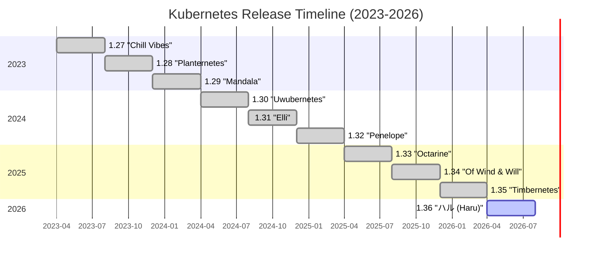
```mermaid
gantt
    title Kubernetes Release Timeline (2023-2026)
    dateFormat  YYYY-MM
    axisFormat  %Y-%m

    section 2023
    1.27 "Chill Vibes"        :done, v127, 2023-04, 2023-08
    1.28 "Planternetes"       :done, v128, 2023-08, 2023-12
    1.29 "Mandala"            :done, v129, 2023-12, 2024-04

    section 2024
    1.30 "Uwubernetes"        :done, v130, 2024-04, 2024-08
    1.31 "Elli"               :done, v131, 2024-08, 2024-12
    1.32 "Penelope"           :done, v132, 2024-12, 2025-04

    section 2025
    1.33 "Octarine"           :done, v133, 2025-04, 2025-08
    1.34 "Of Wind & Will"     :done, v134, 2025-08, 2025-12
    1.35 "Timbernetes"        :done, v135, 2025-12, 2026-04

    section 2026
    1.36 "ハル (Haru)"         :active, v136, 2026-04, 2026-08
```

### Cronograma típico de lanzamiento

Cada lanzamiento sigue un cronograma estructurado que abarca aproximadamente 15 semanas:

| Fase | Duración | Descripción |
|-------|----------|-------------|
| **Enhancements Freeze** | Semana 0 | Todas las características deben tener KEPs (Kubernetes Enhancement Proposals) aprobados |
| **Code Freeze** | ~Semana 10 | Sin código de características nuevas; enfoque en correcciones de errores y pruebas |
| **Beta Release** | ~Semana 11 | Versión preliminar para pruebas |
| **RC (Release Candidate)** | ~Semana 13 | Fase final de pruebas |
| **General Availability** | ~Semana 15 | Lanzamiento oficial |

### Modelo de madurez de características

Kubernetes usa un modelo de promoción de tres etapas para todas las características. Comprender estas etapas es crítico para la planificación de producción.

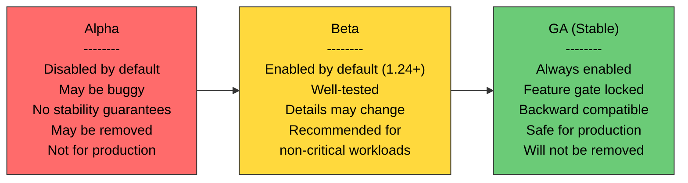
```mermaid
flowchart LR
    Alpha["Alpha
    --------
    Disabled by default
    May be buggy
    No stability guarantees
    May be removed
    Not for production"]
    -->
    Beta["Beta
    --------
    Enabled by default (1.24+)
    Well-tested
    Details may change
    Recommended for
    non-critical workloads"]
    -->
    GA["GA (Stable)
    --------
    Always enabled
    Feature gate locked
    Backward compatible
    Safe for production
    Will not be removed"]

    style Alpha fill:#ff6b6b,stroke:#333,color:black
    style Beta fill:#ffd93d,stroke:#333,color:black
    style GA fill:#6bcb77,stroke:#333,color:black
```

**Cambios de política clave que debes conocer:**

- **Desde Kubernetes 1.24**: Las APIs beta ya no están habilitadas de forma predeterminada en clusters nuevos. Las nuevas características beta requieren opt-in explícito mediante feature gates.
- **Desde Kubernetes 1.28**: Los feature gates para características GA se eliminan después de dos lanzamientos, lo que significa que la característica queda habilitada permanentemente.

### Feature Gates

Los feature gates son pares clave-valor que controlan si una característica está habilitada o deshabilitada. Son el mecanismo mediante el cual se aplica el modelo de madurez alpha/beta/GA.

```yaml
# Example: Enabling feature gates on the kubelet
apiVersion: kubelet.config.k8s.io/v1beta1
kind: KubeletConfiguration
featureGates:
  InPlacePodVerticalScaling: true    # Enable in-place pod resize (beta in 1.33)
  UserNamespacesSupport: true         # Enable user namespaces (beta in 1.33)
```

```yaml
# Example: Enabling feature gates on the API server (EKS managed - informational only)
# Note: In EKS, control plane feature gates are managed by AWS.
# You cannot directly modify API server flags on EKS.
apiVersion: kubeadm.k8s.io/v1beta3
kind: ClusterConfiguration
apiServer:
  extraArgs:
    feature-gates: "ValidatingAdmissionPolicy=true,StructuredAuthorizationConfiguration=true"
```

**Comprobar los feature gates habilitados en tu cluster:**

```bash
# List all feature gates and their status on a node's kubelet
kubectl get --raw /api/v1/nodes/<node-name>/proxy/configz | jq '.kubeletconfig.featureGates'

# Check API server feature gates (requires API server access logs)
kubectl get --raw /metrics | grep kubernetes_feature_enabled

# Check specific feature gate status
kubectl get --raw /metrics | grep 'kubernetes_feature_enabled{name="InPlacePodVerticalScaling"}'
```

### Estructura de gobernanza de SIG

El desarrollo de Kubernetes se organiza en Special Interest Groups (SIGs). Comprender qué SIG es responsable de una característica te ayuda a seguir su progreso y encontrar documentación relevante.

| SIG | Alcance | Características clave en este documento |
|-----|-------|-------------------------------|
| **SIG Node** | Kubelet, container runtime, ciclo de vida del pod | Sidecar Containers, In-Place Pod Resize, User Namespaces |
| **SIG Auth** | Autenticación, autorización, política de seguridad | StructuredAuthorizationConfiguration, CEL Admission |
| **SIG Network** | Networking, Service, Ingress, DNS | Gateway API, ServiceCIDR/IPAddress, Topology Aware Routing |
| **SIG Storage** | PV/PVC, CSI, gestión de volúmenes | VolumeAttributesClass, ReadWriteOncePod |
| **SIG Scheduling** | Scheduler, Pod Scheduling Readiness | Pod Scheduling Readiness, Gang Scheduling |
| **SIG Apps** | Controladores de workloads (Deployment, StatefulSet, Job) | Job Success Policy, Sidecar Containers |
| **SIG API Machinery** | API server, CRDs, admission control | CEL Admission, KYAML |
| **SIG Autoscaling** | HPA, VPA, cluster autoscaling | HPA Container Resource Metrics |

---

## 3. Matriz de compatibilidad de versiones de EKS

### Niveles de soporte

Amazon EKS proporciona dos niveles de soporte de versión:

| Nivel | Duración | Precio | Descripción |
|------|----------|---------|-------------|
| **Standard Support** | 14 meses desde el lanzamiento de EKS | $0.10/cluster/hour | Soporte completo de características, parches de seguridad, correcciones de errores |
| **Extended Support** | 12 meses adicionales | $0.60/cluster/hour | Solo parches de seguridad y correcciones críticas de errores |

> **Impacto de costo**: El soporte extendido cuesta 6 veces el precio del soporte estándar. Para un solo cluster ejecutándose 24/7, esto se traduce en aproximadamente $4,380/año en soporte extendido frente a $730/año en soporte estándar -- un adicional de $3,650 por cluster por año.

### Diagrama de ciclo de vida de versiones

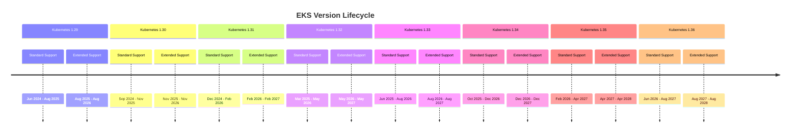
```mermaid
timeline
    title EKS Version Lifecycle
    section Kubernetes 1.29
        Standard Support : Jun 2024 - Aug 2025
        Extended Support : Aug 2025 - Aug 2026
    section Kubernetes 1.30
        Standard Support : Sep 2024 - Nov 2025
        Extended Support : Nov 2025 - Nov 2026
    section Kubernetes 1.31
        Standard Support : Dec 2024 - Feb 2026
        Extended Support : Feb 2026 - Feb 2027
    section Kubernetes 1.32
        Standard Support : Mar 2025 - May 2026
        Extended Support : May 2026 - May 2027
    section Kubernetes 1.33
        Standard Support : Jun 2025 - Aug 2026
        Extended Support : Aug 2026 - Aug 2027
    section Kubernetes 1.34
        Standard Support : Oct 2025 - Dec 2026
        Extended Support : Dec 2026 - Dec 2027
    section Kubernetes 1.35
        Standard Support : Feb 2026 - Apr 2027
        Extended Support : Apr 2027 - Apr 2028
    section Kubernetes 1.36
        Standard Support : Jun 2026 - Aug 2027
        Extended Support : Aug 2027 - Aug 2028
```

### Matriz detallada de soporte de versiones

La tabla siguiente rastrea cada versión de Kubernetes compatible con EKS, incluidas las fechas de lanzamiento upstream, la disponibilidad en EKS y las fechas de fin de soporte.

| Versión K8s | Nombre en clave | Lanzamiento upstream | Lanzamiento EKS | Fin de Standard Support | Fin de Extended Support | Estado actual |
|-------------|-----------|-----------------|-------------|---------------------|---------------------|----------------|
| **1.29** | Mandala | Dec 2023 | Jun 2024 | Aug 2025 | Aug 2026 | Extended Support |
| **1.30** | Uwubernetes | Apr 2024 | Sep 2024 | Nov 2025 | Nov 2026 | Extended Support |
| **1.31** | Elli | Aug 2024 | Dec 2024 | Feb 2026 | Feb 2027 | Extended Support |
| **1.32** | Penelope | Dec 2024 | Mar 2025 | May 2026 | May 2027 | Standard Support |
| **1.33** | Octarine | Apr 2025 | Jun 2025 | Aug 2026 | Aug 2027 | Standard Support |
| **1.34** | Of Wind & Will | Aug 2025 | Oct 2025 | Dec 2026 | Dec 2027 | Standard Support |
| **1.35** | Timbernetes | Dec 2025 | Feb 2026 | Apr 2027 | Apr 2028 | Standard Support |
| **1.36** | ハル (Haru) | Apr 2026 | Jun 2026 | Aug 2027 | Aug 2028 | Standard Support |

> **Nota**: Las fechas de lanzamiento de EKS suelen retrasarse 2-4 meses respecto a los lanzamientos upstream de Kubernetes. AWS usa este tiempo para validar el lanzamiento, integrarlo con add-ons administrados por EKS y asegurar compatibilidad con los servicios de AWS.

### Comportamiento de actualización automática

Cuando una versión de Kubernetes llega al fin de soporte (incluido el soporte extendido), EKS actualizará automáticamente tu cluster:

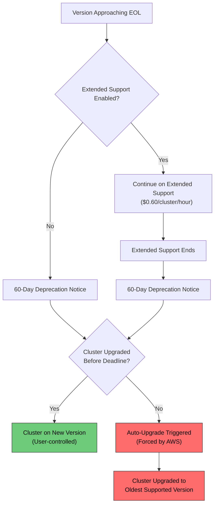
```mermaid
flowchart TD
    A["Version Approaching EOL"] --> B{"Extended Support Enabled?"}
    B -->|Yes| C["Continue on Extended Support
    ($0.60/cluster/hour)"]
    B -->|No| D["60-Day Deprecation Notice"]
    C --> E["Extended Support Ends"]
    E --> F["60-Day Deprecation Notice"]
    D --> G{"Cluster Upgraded
    Before Deadline?"}
    F --> G
    G -->|Yes| H["Cluster on New Version
    (User-controlled)"]
    G -->|No| I["Auto-Upgrade Triggered
    (Forced by AWS)"]
    I --> J["Cluster Upgraded to
    Oldest Supported Version"]

    style I fill:#ff6b6b,stroke:#333,color:black
    style J fill:#ff6b6b,stroke:#333,color:black
    style H fill:#6bcb77,stroke:#333,color:black
```

**Importante**: Las actualizaciones automáticas solo actualizan el control plane. Aún debes actualizar manualmente tus node groups, add-ons y componentes autoadministrados. Una actualización forzada del control plane sin las actualizaciones correspondientes de nodos y add-ons puede causar interrupciones en workloads.

### Anuncios recientes de soporte de versiones de EKS (2026)

AWS realizó varios anuncios en 2026 que afectan el soporte de versiones de EKS:

| Fecha | Anuncio | Puntos destacados |
|:---:|------|------|
| 2026-06-02 | EKS y EKS Distro comienzan a soportar Kubernetes 1.36 | User Namespaces GA, Mutating Admission Policies, In-Place Pod Vertical Scaling, Resource Health Status, comprobaciones previas a la actualización de EKS Cluster Insights |
| 2026-01-28 | EKS y EKS Distro comienzan a soportar Kubernetes 1.35 | In-Place Pod Resource Updates, PreferSameNode Traffic Distribution, Node Topology Labels mediante Downward API, Image Volumes |

#### Soporte de Kubernetes 1.36 (2 de junio de 2026)

Amazon EKS y EKS Distro comenzaron a soportar Kubernetes 1.36. El anuncio destacó (consulta la sección 4.8 más abajo para detalles de implementación):

- **User Namespaces (GA)**: Mapea el usuario root del container a un usuario no privilegiado del host, fortaleciendo el aislamiento multi-tenant
- **Mutating Admission Policies**: Mutación basada en CEL sin requerir un servidor webhook
- **In-Place Pod Vertical Scaling**: Ajusta CPU/memoria sin reiniciar el pod
- **Resource Health Status**: Expone la salud de dispositivos y condiciones de fallo de hardware en el estado del Pod
- **EKS Cluster Insights**: Comprobaciones previas a la actualización para uso de APIs deprecadas y compatibilidad de add-ons

> Fuente: [Amazon EKS Distro now supports Kubernetes version 1.36](https://aws.amazon.com/about-aws/whats-new/2026/06/amazon-eks-distro-kubernetes-version-1-36/)

#### Soporte de Kubernetes 1.35 (28 de enero de 2026)

Amazon EKS y EKS Distro comenzaron a soportar Kubernetes 1.35, agregando:

- **In-Place Pod Resource Updates** -- la misma capacidad de ajuste de recursos sin reinicio cubierta como In-Place Pod Vertical Scaling GA en la sección 4.7
- **PreferSameNode Traffic Distribution** -- prefiere enrutar tráfico a endpoints en el mismo nodo
- **Node Topology Labels via Downward API** -- expone etiquetas de topología del nodo a pods
- **Image Volumes** -- monta imágenes OCI como volúmenes para entregar datos y modelos de ML

> Fuente: [Amazon EKS Distro now supports Kubernetes version 1.35](https://aws.amazon.com/about-aws/whats-new/2026/01/amazon-eks-distro-kubernetes-version-1-35)

> **Anuncios relacionados**: El soporte de rollback de versiones de EKS (1 de julio de 2026) y el nuevo SLA del control plane de 99.99% / nivel de escalado 8XL (20 de marzo de 2026) se cubren en el documento [EKS Upgrades](08-eks-upgrades.md), ya que se relacionan directamente con el proceso de actualización y no con características de versiones de Kubernetes.

---

## 4. Guía de características por versión

Esta sección proporciona un desglose detallado de las características introducidas, promovidas y deprecadas en cada versión de Kubernetes desde 1.29 hasta 1.36.

### 4.1 Kubernetes 1.29 "Mandala" (diciembre de 2023)

**Tema**: Nombrado por la forma de arte geométrico que simboliza el universo, reflejando el enfoque holístico de la comunidad para este lanzamiento.

**Estadísticas del lanzamiento**: 49 mejoras -- 11 Stable, 19 Beta, 19 Alpha

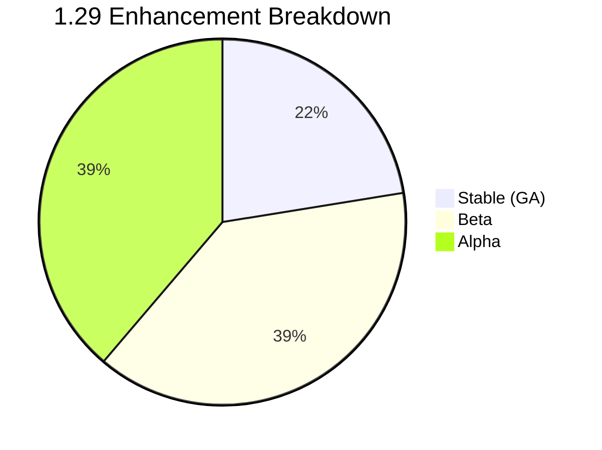
```mermaid
pie title 1.29 Enhancement Breakdown
    "Stable (GA)" : 11
    "Beta" : 19
    "Alpha" : 19
```

#### Características clave promovidas (GA)

**KMS v2 Encryption**

KMS v2 para cifrado en reposo de Kubernetes Secrets alcanzó GA, proporcionando mejoras significativas de rendimiento sobre KMS v1.

| Aspecto | KMS v1 | KMS v2 |
|--------|--------|--------|
| Llamadas de cifrado por escritura | 1 por objeto | 1 por rotación de DEK |
| Rendimiento | Alta latencia a escala | Latencia casi constante |
| Jerarquía de claves | Una sola capa | Dos capas (KEK + DEK) |
| Estado | Deprecado en 1.28 | GA en 1.29 |

```yaml
# KMS v2 EncryptionConfiguration
apiVersion: apiserver.config.k8s.io/v1
kind: EncryptionConfiguration
resources:
  - resources:
      - secrets
    providers:
      - kms:
          apiVersion: v2
          name: aws-encryption-provider
          endpoint: unix:///var/run/kmsplugin/socket.sock
          timeout: 3s
      - identity: {}
```

**ReadWriteOncePod PV Access Mode**

El modo de acceso `ReadWriteOncePod` (RWOP) se promovió a GA. Esto garantiza que un PersistentVolume solo pueda montarse como lectura-escritura por un único Pod en todo el cluster, proporcionando garantías de seguridad de datos más fuertes que `ReadWriteOnce` (que permite múltiples pods en el mismo nodo).

```yaml
apiVersion: v1
kind: PersistentVolumeClaim
metadata:
  name: database-pvc
spec:
  accessModes:
    - ReadWriteOncePod    # Only one pod can mount this volume
  storageClassName: gp3
  resources:
    requests:
      storage: 100Gi
```

**Otras características GA en 1.29**:
- `NodeExpandSecret` para expansión de volúmenes CSI con credenciales
- `KubeletTracing` para trazas distribuidas a nivel de kubelet
- Modo de acceso `ReadWriteOncePod` de PersistentVolume
- `MinDomainsInPodTopologySpread` para restricciones de distribución de topología

#### Características beta clave

**nftables-based kube-proxy (Alpha)**

Se introdujo como alpha un nuevo backend de kube-proxy que usa nftables en lugar de iptables. Esto es importante porque nftables ofrece mejor rendimiento y escalabilidad que iptables, especialmente en clusters con miles de Services.

```bash
# Check current kube-proxy mode
kubectl get configmap kube-proxy-config -n kube-system -o yaml | grep mode

# nftables mode (alpha in 1.29 - requires feature gate)
# mode: nftables
```

| Modo de proxy | Madurez en 1.29 | Complejidad de reglas | Rendimiento a escala |
|-----------|-------------------|-----------------|---------------------|
| iptables | Stable (predeterminado) | O(n) por paquete | Se degrada >5000 services |
| IPVS | Stable | Búsqueda O(1) | Bueno a escala |
| nftables | Alpha | Búsqueda O(1) | Excelente a escala |

**Load Balancer IP Mode**

La característica `LoadBalancerIPMode` (beta) permite que los Services de tipo LoadBalancer especifiquen cómo se maneja la IP del load balancer, mejorando la compatibilidad con implementaciones de cloud providers.

#### Características alpha clave

- **SidecarContainers** (initContainer con `restartPolicy: Always`) -- una característica emblemática que inicia su recorrido
- **PodLifecycleSleepAction** -- agrega la acción `sleep` a los hooks de ciclo de vida del pod
- **Unknown Version Interoperability Proxy** -- proxy de solicitudes para versiones de API desconocidas

#### Deprecaciones en 1.29

- `flowcontrol.apiserver.k8s.io/v1beta2` deprecado (eliminado en 1.32)
- Plugin de admission `SecurityContextDeny` deprecado
- Las integraciones de cloud providers in-tree continúan su ruta de deprecación

---

### 4.2 Kubernetes 1.30 "Uwubernetes" (abril de 2024)

**Tema**: Un nombre lúdico elegido por la comunidad que encarna la naturaleza acogedora de la comunidad de Kubernetes.

**Estadísticas del lanzamiento**: 45 mejoras -- 17 Stable, 18 Beta, 10 Alpha

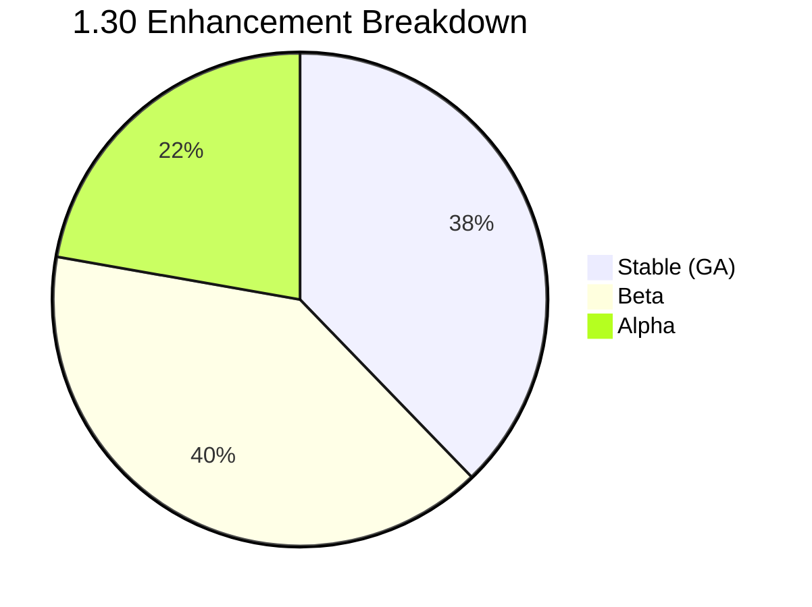
```mermaid
pie title 1.30 Enhancement Breakdown
    "Stable (GA)" : 17
    "Beta" : 18
    "Alpha" : 10
```

#### Características clave promovidas (GA)

**ValidatingAdmissionPolicy with CEL (GA)**

Una de las características promovidas más significativas, ValidatingAdmissionPolicy permite admission control nativo usando Common Expression Language (CEL), eliminando la necesidad de controladores de admission basados en webhooks para muchos casos de uso.

| Aspecto | Admission Webhooks | ValidatingAdmissionPolicy (CEL) |
|--------|-------------------|-------------------------------|
| Latencia | Viaje de ida y vuelta por red | Evaluación en proceso |
| Riesgo de disponibilidad | Falla del servidor webhook = solicitudes bloqueadas | Sin dependencia externa |
| Lenguaje | Cualquiera (Go, Python, etc.) | CEL |
| Complejidad | Alta (desplegar, mantener, escalar) | Baja (un solo recurso YAML) |
| Recorrido de la característica | N/A | Alpha 1.26 -> Beta 1.28 -> GA 1.30 |

```yaml
# ValidatingAdmissionPolicy: Require resource limits on all containers
apiVersion: admissionregistration.k8s.io/v1
kind: ValidatingAdmissionPolicy
metadata:
  name: require-resource-limits
spec:
  failurePolicy: Fail
  matchConstraints:
    resourceRules:
      - apiGroups: [""]
        apiVersions: ["v1"]
        operations: ["CREATE", "UPDATE"]
        resources: ["pods"]
  validations:
    - expression: >-
        object.spec.containers.all(c,
          has(c.resources) &&
          has(c.resources.limits) &&
          has(c.resources.limits.memory) &&
          has(c.resources.limits.cpu)
        )
      message: "All containers must have CPU and memory limits set"
      reason: Invalid
---
apiVersion: admissionregistration.k8s.io/v1
kind: ValidatingAdmissionPolicyBinding
metadata:
  name: require-resource-limits-binding
spec:
  policyName: require-resource-limits
  validationActions:
    - Deny
  matchResources:
    namespaceSelector:
      matchLabels:
        enforce-limits: "true"
```

```yaml
# CEL: Enforce image registry policy
apiVersion: admissionregistration.k8s.io/v1
kind: ValidatingAdmissionPolicy
metadata:
  name: restrict-image-registries
spec:
  failurePolicy: Fail
  matchConstraints:
    resourceRules:
      - apiGroups: [""]
        apiVersions: ["v1"]
        operations: ["CREATE", "UPDATE"]
        resources: ["pods"]
  validations:
    - expression: >-
        object.spec.containers.all(c,
          c.image.startsWith('123456789012.dkr.ecr.') ||
          c.image.startsWith('public.ecr.aws/')
        )
      message: "Images must come from approved ECR registries"
    - expression: >-
        object.spec.initContainers.all(c,
          c.image.startsWith('123456789012.dkr.ecr.') ||
          c.image.startsWith('public.ecr.aws/')
        )
      message: "Init container images must come from approved ECR registries"
```

**Pod Scheduling Readiness (GA)**

Pod Scheduling Readiness permite crear pods pero no programarlos hasta que se cumplan ciertas condiciones. Esto desacopla la creación del pod de la programación, habilitando flujos de trabajo avanzados como batch scheduling y aprovisionamiento de recursos.

```yaml
# Pod with scheduling gates
apiVersion: v1
kind: Pod
metadata:
  name: ml-training-job
spec:
  schedulingGates:
    - name: "example.com/gpu-provisioned"      # Gate 1: Wait for GPU node
    - name: "example.com/dataset-downloaded"    # Gate 2: Wait for data
  containers:
    - name: trainer
      image: ml-training:v2
      resources:
        limits:
          nvidia.com/gpu: 4
```

```bash
# Remove a scheduling gate when the condition is met
kubectl patch pod ml-training-job --type='json' -p='[
  {"op": "remove", "path": "/spec/schedulingGates/0"}
]'

# Check remaining scheduling gates
kubectl get pod ml-training-job -o jsonpath='{.spec.schedulingGates}'
```

**HPA ContainerResource Metrics (GA)**

HPA ahora puede escalar según métricas de containers individuales en lugar de métricas totales del pod. Esto es crucial para patrones sidecar donde el uso de recursos del container principal debe impulsar el escalado, no el total combinado que incluye sidecars.

```yaml
apiVersion: autoscaling/v2
kind: HorizontalPodAutoscaler
metadata:
  name: web-app-hpa
spec:
  scaleTargetRef:
    apiVersion: apps/v1
    kind: Deployment
    name: web-app
  minReplicas: 2
  maxReplicas: 50
  metrics:
    - type: ContainerResource
      containerResource:
        name: cpu
        container: app              # Scale based only on the 'app' container
        target:
          type: Utilization
          averageUtilization: 70
    - type: ContainerResource
      containerResource:
        name: memory
        container: app              # Ignore sidecar memory usage
        target:
          type: Utilization
          averageUtilization: 80
```

**Otras características GA en 1.30**:
- `MinDomainsInPodTopologySpread` -- conteo mínimo de dominios para distribución de topología
- `NodeLogQuery` -- consulta logs a nivel de nodo mediante la API del kubelet
- `PodDisruptionConditions` -- agrega condiciones relacionadas con interrupciones al estado del Pod
- `StableLoadBalancerNodeSet` -- conjunto estable de nodos para health checks del load balancer

#### Características beta clave

**Contextual Logging (Beta, habilitado por defecto)**

Contextual logging agrega contexto estructurado (como nombre del pod, namespace, componente) a todos los mensajes de log de Kubernetes, haciendo que el análisis y la correlación de logs sean significativamente más fáciles.

```bash
# Before contextual logging
I0415 12:00:00.000000       1 controller.go:100] "Reconciling object" name="my-pod"

# With contextual logging (additional context automatically added)
I0415 12:00:00.000000       1 controller.go:100] "Reconciling object" logger="pod-controller" pod="default/my-pod" node="ip-10-0-1-100"
```

**Recursive Read-Only Mounts (Beta)**

Permite hacer que todo un árbol de mounts de volumen sea de solo lectura de forma recursiva, evitando sub-mounts escribibles dentro de una ruta de mount de solo lectura.

#### Características alpha clave

- **UserNamespacesSupport** -- user namespaces a nivel de pod para mejorar el aislamiento de seguridad
- **RelaxedEnvironmentVariableValidation** -- permite caracteres previamente inválidos en valores de variables de entorno
- **SELinuxMountReadWriteOncePod** -- soporte de etiquetas SELinux para volúmenes RWOP

---

### 4.3 Kubernetes 1.31 "Elli" (agosto de 2024)

**Tema**: Nombrado por un perro perteneciente a un contribuidor de Kubernetes, reflejando el toque personal de la comunidad.

**Estadísticas del lanzamiento**: 45 mejoras -- 11 Stable, 22 Beta, 12 Alpha

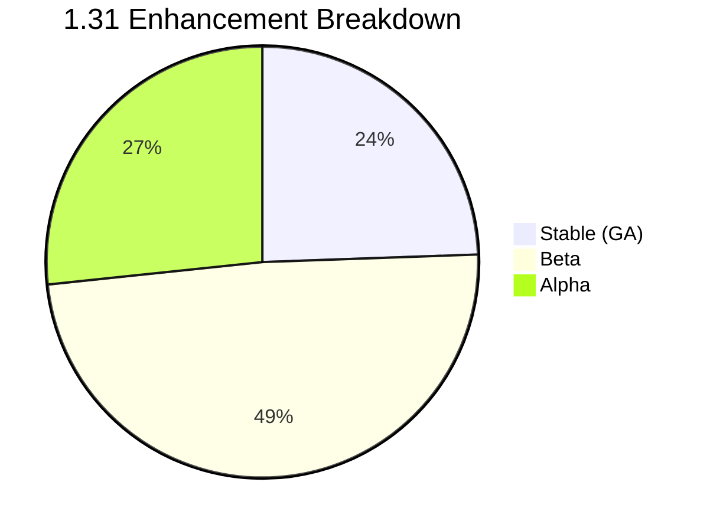
```mermaid
pie title 1.31 Enhancement Breakdown
    "Stable (GA)" : 11
    "Beta" : 22
    "Alpha" : 12
```

#### Características clave promovidas (GA)

**AppArmor Support (GA)**

El soporte nativo de AppArmor en Kubernetes se promovió a GA, reemplazando el enfoque anterior basado en anotaciones con campos de API adecuados.

```yaml
# Old approach (deprecated annotations)
# metadata:
#   annotations:
#     container.apparmor.security.beta.kubernetes.io/app: localhost/my-profile

# New GA approach: native API field
apiVersion: v1
kind: Pod
metadata:
  name: secure-app
spec:
  containers:
    - name: app
      image: myapp:latest
      securityContext:
        appArmorProfile:
          type: Localhost
          localhostProfile: my-custom-profile
```

```yaml
# AppArmor with RuntimeDefault profile
apiVersion: apps/v1
kind: Deployment
metadata:
  name: web-server
spec:
  template:
    spec:
      containers:
        - name: nginx
          image: nginx:1.27
          securityContext:
            appArmorProfile:
              type: RuntimeDefault    # Uses container runtime's default profile
```

**Persistent Volume Last Phase Transition Time (GA)**

Un nuevo campo `.status.lastPhaseTransitionTime` en PersistentVolumes rastrea cuándo el PV cambió de fase por última vez (Available, Bound, Released, Failed). Esto permite mejor monitoreo y automatización alrededor del ciclo de vida de volúmenes.

```bash
# Check PV phase transition times
kubectl get pv -o custom-columns=\
NAME:.metadata.name,\
PHASE:.status.phase,\
LAST_TRANSITION:.status.lastPhaseTransitionTime

# Example output:
# NAME         PHASE     LAST_TRANSITION
# pv-data-01   Bound     2025-01-15T10:30:00Z
# pv-data-02   Released  2025-01-14T22:15:00Z
```

**Otras características GA en 1.31**:
- `PodDisruptionConditions` -- estado enriquecido del Pod con información sobre la causa de interrupción
- `JobPodReplacementPolicy` -- controla cuándo se reemplazan pods fallidos en Jobs
- `PodHostIPs` -- expone todas las IPs del host (IPv4 e IPv6) a pods mediante downward API

#### Características beta clave

**DRA Structured Parameters (Beta)**

Dynamic Resource Allocation (DRA) structured parameters pasó a beta, permitiendo que device plugins anuncien capacidades de hardware mediante una API estandarizada. Esto es fundamental para la programación de GPU, FPGA y otros aceleradores.

```yaml
# ResourceClaim for GPU allocation using DRA
apiVersion: resource.k8s.io/v1beta1
kind: ResourceClaim
metadata:
  name: gpu-claim
spec:
  devices:
    requests:
      - name: gpu
        deviceClassName: gpu.nvidia.com
        selectors:
          - cel:
              expression: >-
                device.attributes["gpu.nvidia.com"].model == "A100" &&
                device.capacity["gpu.nvidia.com"].memory.compareTo(quantity("80Gi")) >= 0
```

**Sidecar Containers (Beta)**

La característica sidecar containers avanzó a beta (habilitada por defecto en 1.31 después de haber sido alpha en 1.29). Los init containers con `restartPolicy: Always` ahora funcionan como verdaderos sidecars que:
- Inician antes que los containers regulares
- Se ejecutan junto con el workload principal
- Se terminan al final durante el apagado del pod

```yaml
apiVersion: v1
kind: Pod
metadata:
  name: app-with-sidecar
spec:
  initContainers:
    - name: log-shipper
      image: fluent-bit:latest
      restartPolicy: Always       # This makes it a sidecar
      volumeMounts:
        - name: log-volume
          mountPath: /var/log/app
  containers:
    - name: app
      image: myapp:latest
      volumeMounts:
        - name: log-volume
          mountPath: /var/log/app
  volumes:
    - name: log-volume
      emptyDir: {}
```

**Traffic Distribution for Services (Beta)**

Un nuevo campo `spec.trafficDistribution` en Services permite solicitar preferencias de enrutamiento de tráfico, como preferir endpoints de la misma zona.

```yaml
apiVersion: v1
kind: Service
metadata:
  name: my-service
spec:
  trafficDistribution: PreferClose    # Route traffic to closest endpoints
  selector:
    app: my-app
  ports:
    - port: 80
      targetPort: 8080
```

**Otras características beta en 1.31**:
- `PodLifecycleSleepAction` -- acción `sleep` en hooks PreStop/PostStart
- `RelaxedDNSSearchValidation` -- validación relajada de rutas de búsqueda DNS
- `VolumeAttributesClass` -- atributos de volumen mutables mediante CSI

#### Características alpha clave

- **PortForwardWebsockets** -- port forwarding basado en WebSocket
- **ImageVolume** -- monta imágenes OCI como volúmenes de solo lectura
- **DRAPartitionableDevices** -- soporte de particionado para dispositivos DRA

---

### 4.4 Kubernetes 1.32 "Penelope" (diciembre de 2024)

**Tema**: Nombrado por Penelope, el personaje fiel de la Odisea de Homero, simbolizando la confiabilidad constante del proyecto.

**Estadísticas del lanzamiento**: 44 mejoras -- 13 Stable, 12 Beta, 19 Alpha

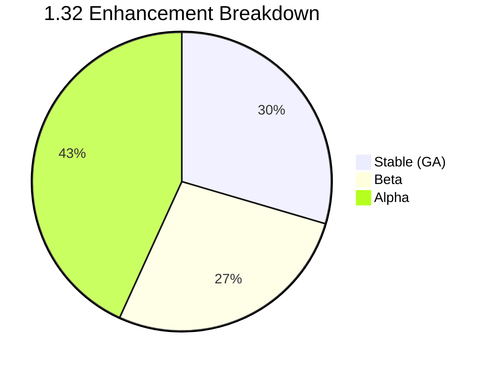
```mermaid
pie title 1.32 Enhancement Breakdown
    "Stable (GA)" : 13
    "Beta" : 12
    "Alpha" : 19
```

#### Características clave promovidas (GA)

**StructuredAuthorizationConfiguration (GA)**

Una característica de seguridad importante que permite definir cadenas ordenadas de módulos de autorización (Node, RBAC, Webhook, CEL) con configuración estructurada. Esto reemplaza el enfoque heredado de la bandera `--authorization-mode`.

```yaml
# StructuredAuthorizationConfiguration
# (Managed by AWS for EKS control plane; shown for reference)
apiVersion: apiserver.config.k8s.io/v1beta1
kind: AuthorizationConfiguration
authorizers:
  - type: Node
    name: node
  - type: RBAC
    name: rbac
  - type: Webhook
    name: custom-authz
    webhook:
      timeout: 3s
      subjectAccessReviewVersion: v1
      matchConditionSubjectAccessReviewVersion: v1
      failurePolicy: Deny
      connectionInfo:
        type: KubeConfigFile
        kubeConfigFile: /etc/kubernetes/authz-webhook.kubeconfig
      matchConditions:
        - expression: >-
            request.resourceAttributes.namespace == "production"
```

Esto permite:
- **Evaluación ordenada**: Solicitudes de autorización evaluadas en orden a través de una cadena
- **Filtrado basado en CEL**: Usa expresiones CEL para hacer coincidir solo las solicitudes relevantes con cada autorizador
- **Enrutamiento granular de webhooks**: Envía solo solicitudes específicas a webhooks de autorización externos
- **Recorrido de la característica**: Alpha 1.29 -> Beta 1.30 -> GA 1.32

**Auto-Remove PVC Protection Finalizer (GA)**

Los finalizers de protección de PersistentVolumeClaim ahora se limpian automáticamente cuando el PVC ya no está en uso. Esto elimina el problema común de PVCs huérfanos que no pueden eliminarse porque su finalizer de protección nunca se removió.

```bash
# Before 1.32: Common issue - stuck PVC deletion
$ kubectl delete pvc my-pvc
persistentvolumeclaim "my-pvc" deleted  # ... hangs forever

$ kubectl get pvc my-pvc -o jsonpath='{.metadata.finalizers}'
["kubernetes.io/pvc-protection"]  # Finalizer not removed

# After 1.32 (GA): Automatic cleanup
$ kubectl delete pvc my-pvc
persistentvolumeclaim "my-pvc" deleted  # Completes immediately when no pod references it
```

**Otras características GA en 1.32**:
- `CustomResourceFieldSelectors` -- field selectors para CRDs
- `RetryGenerateName` -- reintento automático con nombres generados nuevos ante conflicto
- `SizeMemoryBackedVolumes` -- aplica límites de tamaño en volúmenes emptyDir respaldados por memoria
- `StableLoadBalancerNodeSet` -- conjunto consistente de nodos para health checking de LB
- `ServiceAccountTokenJTI` -- JTI único en tokens de SA para seguimiento de auditoría
- `ServiceAccountTokenNodeBindingValidation` -- vincula tokens de SA a nodos

#### Características beta clave

**User Namespaces (Beta)**

User namespaces proporcionan una potente frontera de seguridad al remapear UIDs y GIDs dentro de containers, de modo que incluso si un proceso se ejecuta como root dentro del container, se mapea a un usuario no privilegiado en el host.

```yaml
apiVersion: v1
kind: Pod
metadata:
  name: secure-pod
spec:
  hostUsers: false              # Enable user namespace remapping
  containers:
    - name: app
      image: myapp:latest
      securityContext:
        runAsUser: 0            # Root inside container
        # Maps to unprivileged UID on host (e.g., UID 65534+offset)
```

**VolumeAttributesClass (Beta)**

VolumeAttributesClass permite cambiar atributos de volumen (como IOPS, throughput) después del aprovisionamiento, sin recrear el volumen.

```yaml
apiVersion: storage.k8s.io/v1beta1
kind: VolumeAttributesClass
metadata:
  name: high-performance
driverName: ebs.csi.aws.com
parameters:
  iops: "10000"
  throughput: "500"
---
apiVersion: v1
kind: PersistentVolumeClaim
metadata:
  name: database-volume
spec:
  accessModes:
    - ReadWriteOnce
  resources:
    requests:
      storage: 500Gi
  storageClassName: gp3
  volumeAttributesClassName: high-performance    # Apply performance attributes
```

```yaml
# Modify volume attributes by changing the class reference
# (triggers a CSI ModifyVolume call)
apiVersion: v1
kind: PersistentVolumeClaim
metadata:
  name: database-volume
spec:
  volumeAttributesClassName: ultra-performance   # Switch to higher tier
```

**nftables kube-proxy (Beta)**

El backend nftables para kube-proxy avanzó a beta, trayendo soporte nftables listo para producción para enrutamiento de Service.

#### Características alpha clave

- **DynamicResourceAllocation (DRA) Core** -- framework integral de programación de GPU/aceleradores
- **MultiCIDRServiceAllocator** -- asigna IPs de Service desde múltiples rangos CIDR
- **RelaxedEnvironmentVariableValidation** -- permite conjuntos ampliados de caracteres en env vars
- **InPlacePodVerticalScalingExtendedStatus** -- informes extendidos de estado para redimensionamiento de pod

---

### 4.5 Kubernetes 1.33 "Octarine" (abril de 2025)

**Tema**: Nombrado por el octavo color, visible solo para magos, de la serie Discworld de Terry Pratchett. Un nombre apropiado para un lanzamiento lleno de características mágicas.

**Estadísticas del lanzamiento**: 64 mejoras -- 18 Stable, 20 Beta, 24 Alpha (el lanzamiento más grande en este rango)

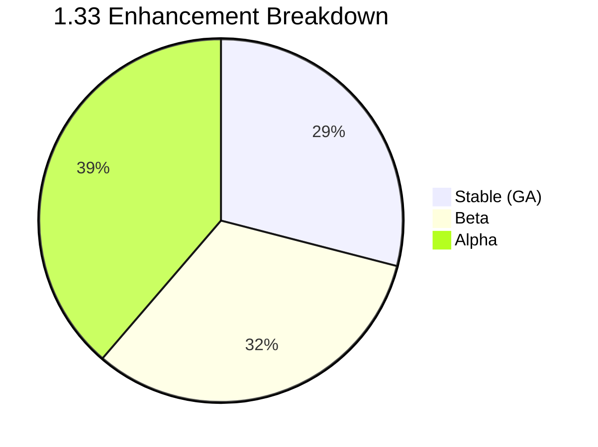
```mermaid
pie title 1.33 Enhancement Breakdown
    "Stable (GA)" : 18
    "Beta" : 20
    "Alpha" : 24
```

#### Características clave promovidas (GA)

**Sidecar Containers (GA)**

La promoción a GA más esperada de este lanzamiento. Los sidecar containers nativos, implementados como init containers con `restartPolicy: Always`, alcanzaron estabilidad completa después de un recorrido de varias versiones.

| Versión | Estado | Comportamiento |
|---------|--------|----------|
| 1.28 | Alpha | Feature gate `SidecarContainers` requerido |
| 1.29 | Alpha | Correcciones de errores, mejoras de estabilidad |
| 1.31 | Beta | Habilitado por defecto |
| 1.33 | **GA** | Habilitado permanentemente, feature gate eliminado |

```yaml
# Production-ready sidecar pattern (GA in 1.33)
apiVersion: apps/v1
kind: Deployment
metadata:
  name: microservice
spec:
  replicas: 3
  selector:
    matchLabels:
      app: microservice
  template:
    metadata:
      labels:
        app: microservice
    spec:
      initContainers:
        # Sidecar 1: Service mesh proxy
        - name: envoy-proxy
          image: envoyproxy/envoy:v1.31
          restartPolicy: Always
          ports:
            - containerPort: 15001
          resources:
            requests:
              cpu: 100m
              memory: 128Mi
            limits:
              cpu: 500m
              memory: 256Mi

        # Sidecar 2: Log collection
        - name: fluent-bit
          image: fluent/fluent-bit:3.2
          restartPolicy: Always
          volumeMounts:
            - name: app-logs
              mountPath: /var/log/app
          resources:
            requests:
              cpu: 50m
              memory: 64Mi

        # Regular init container (runs to completion first)
        - name: db-migration
          image: myapp-migrations:latest
          command: ["./migrate", "--target", "latest"]

      containers:
        - name: app
          image: myapp:v3.2
          ports:
            - containerPort: 8080
          volumeMounts:
            - name: app-logs
              mountPath: /var/log/app

      volumes:
        - name: app-logs
          emptyDir: {}
```

**Garantías del ciclo de vida de sidecar containers:**

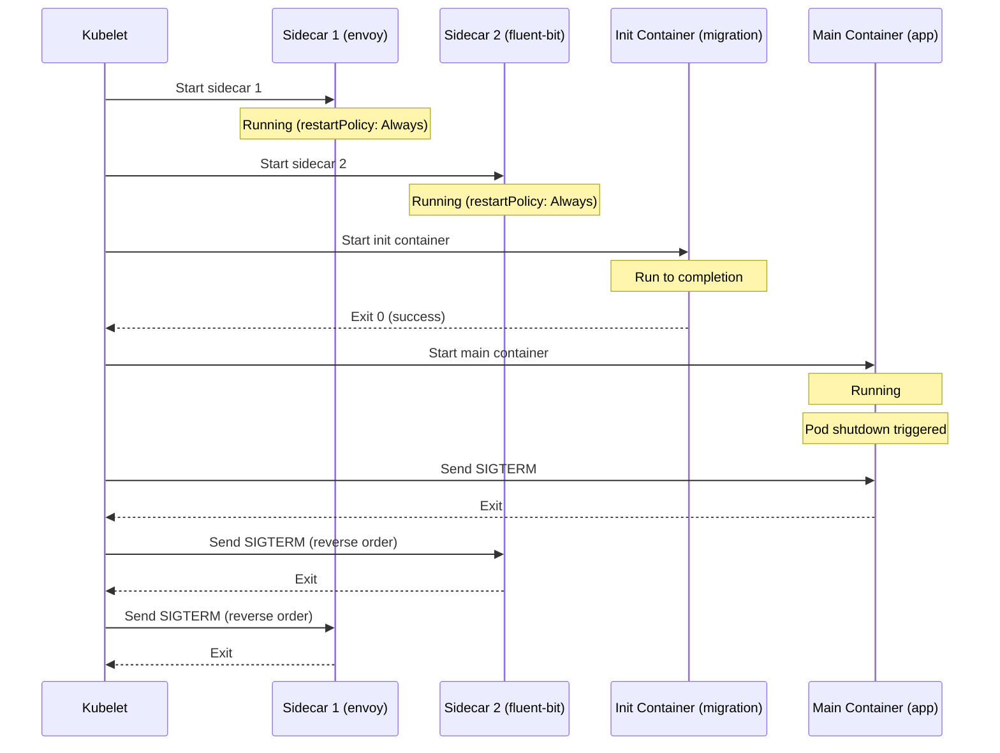
```mermaid
sequenceDiagram
    participant K as Kubelet
    participant S1 as Sidecar 1 (envoy)
    participant S2 as Sidecar 2 (fluent-bit)
    participant I as Init Container (migration)
    participant M as Main Container (app)

    K->>S1: Start sidecar 1
    Note over S1: Running (restartPolicy: Always)
    K->>S2: Start sidecar 2
    Note over S2: Running (restartPolicy: Always)
    K->>I: Start init container
    Note over I: Run to completion
    I-->>K: Exit 0 (success)
    K->>M: Start main container
    Note over M: Running

    Note over M: Pod shutdown triggered
    K->>M: Send SIGTERM
    M-->>K: Exit
    K->>S2: Send SIGTERM (reverse order)
    S2-->>K: Exit
    K->>S1: Send SIGTERM (reverse order)
    S1-->>K: Exit
```

**ServiceCIDR and IPAddress API (GA)**

La API ServiceCIDR e IPAddress permite la gestión dinámica de rangos de IP de Service sin reiniciar el cluster. Esto es particularmente útil para clusters a gran escala que agotan su Service CIDR inicial.

```yaml
# Define additional Service CIDR ranges
apiVersion: networking.k8s.io/v1
kind: ServiceCIDR
metadata:
  name: secondary-service-range
spec:
  cidrs:
    - "10.200.0.0/16"
```

```bash
# View allocated IP addresses
kubectl get ipaddresses

# Check ServiceCIDR status
kubectl get servicecidrs
NAME                       CIDRS            AGE
kubernetes                 10.96.0.0/12     365d
secondary-service-range    10.200.0.0/16    30d
```

**Topology Aware Routing (GA)**

Anteriormente conocida como "Topology Aware Hints", esta característica se promovió a GA con el nombre "Topology Aware Routing". Permite el enrutamiento preferencial de tráfico de Service a endpoints en la misma zona de disponibilidad, reduciendo costos de transferencia de datos entre AZ.

```yaml
apiVersion: v1
kind: Service
metadata:
  name: my-service
  annotations:
    # Legacy hint-based approach (deprecated)
    # service.kubernetes.io/topology-aware-hints: Auto
spec:
  trafficDistribution: PreferClose    # GA approach in 1.33
  selector:
    app: my-app
  ports:
    - port: 80
      targetPort: 8080
```

> **Consejo de costo para EKS**: Habilitar topology-aware routing en servicios internos de alto tráfico puede reducir significativamente los cargos por transferencia de datos entre AZ, que son $0.01/GB dentro de la misma región en AWS.

**Job Success Policy (GA)**

Permite especificar condiciones bajo las cuales un Job se considera exitoso incluso si no todos los pods se han completado. Esto es esencial para frameworks de computación distribuida donde el éxito de un pod líder determina el éxito global del job.

```yaml
apiVersion: batch/v1
kind: Job
metadata:
  name: distributed-training
spec:
  completionMode: Indexed
  completions: 8
  parallelism: 8
  successPolicy:
    rules:
      - succeededIndexes: "0"       # Job succeeds when index 0 (leader) succeeds
        succeededCount: 1
  template:
    spec:
      containers:
        - name: trainer
          image: pytorch-training:latest
          env:
            - name: JOB_COMPLETION_INDEX
              valueFrom:
                fieldRef:
                  fieldPath: metadata.annotations['batch.kubernetes.io/job-completion-index']
```

**Otras características GA en 1.33**:
- `PodLifecycleSleepAction` -- acción `sleep` en hooks de ciclo de vida del pod
- `LoadBalancerIPMode` -- controla cómo se expone la IP de LB a los pods
- `JobManagedBy` -- gestión externa de objetos Job por un controller
- `RetryGenerateName` -- reintento automático de colisión de nombres para nombres generados

#### Características beta clave (habilitadas por defecto)

**In-Place Pod Vertical Scaling (Beta)**

Una de las características más esperadas en la historia de Kubernetes. El redimensionamiento in-place del pod permite cambiar recursos de CPU y memoria en un pod en ejecución sin reiniciarlo.

```yaml
apiVersion: v1
kind: Pod
metadata:
  name: resizable-app
spec:
  containers:
    - name: app
      image: myapp:latest
      resources:
        requests:
          cpu: 500m
          memory: 256Mi
        limits:
          cpu: "1"
          memory: 512Mi
      resizePolicy:
        - resourceName: cpu
          restartPolicy: NotRequired    # CPU resize without restart
        - resourceName: memory
          restartPolicy: RestartContainer  # Memory resize requires restart
```

```bash
# Resize a running pod's CPU (no restart!)
kubectl patch pod resizable-app --subresource resize --patch '{
  "spec": {
    "containers": [{
      "name": "app",
      "resources": {
        "requests": {"cpu": "1"},
        "limits": {"cpu": "2"}
      }
    }]
  }
}'

# Check resize status
kubectl get pod resizable-app -o jsonpath='{.status.resize}'
# "InProgress" -> "Proposed" -> "" (completed)

# View allocated vs requested resources
kubectl get pod resizable-app -o jsonpath='{.status.containerStatuses[0].allocatedResources}'
```

| Recorrido de la característica | Versión | Notas |
|----------------|---------|-------|
| Alpha | 1.27 | Implementación inicial |
| Beta | 1.33 | Habilitado por defecto |
| GA | 1.35 | Estabilidad completa |

**OCI Images as Volumes (Beta)**

Monta imágenes OCI (Open Container Initiative) directamente como volúmenes de solo lectura en pods. Esto permite compartir datos, modelos de ML y configuración como imágenes de container sin empaquetarlos dentro de la imagen de la aplicación.

```yaml
apiVersion: v1
kind: Pod
metadata:
  name: ml-inference
spec:
  containers:
    - name: inference-server
      image: inference-engine:latest
      volumeMounts:
        - name: model
          mountPath: /models/llama
          readOnly: true
  volumes:
    - name: model
      image:
        reference: 123456789012.dkr.ecr.us-west-2.amazonaws.com/models:llama-7b
        pullPolicy: IfNotPresent
```

**User Namespaces (Beta)**

User namespaces avanzó a beta, proporcionando un aislamiento de seguridad más fuerte donde los procesos del container se mapean a usuarios no privilegiados en el host.

**Otras características beta en 1.33**:
- `MatchLabelKeysInPodAffinity` -- usa claves de etiqueta para coincidencias de pod affinity
- `PodLevelResources` -- establece límites de recursos a nivel de pod (no solo a nivel de container)
- `ServiceTrafficDistribution` -- controles mejorados de distribución de tráfico
- `StructuredAuthenticationConfiguration` -- configuración authn estructurada que sigue el patrón de authz

#### Características alpha clave

- **KYAML** -- un subconjunto de YAML más seguro que restringe características peligrosas de YAML
- Mejoras de **PortForwardWebsockets**
- Mejoras de **CRDValidationRatcheting** -- permite que campos inválidos existentes pasen la validación
- **MutatingAdmissionPolicy** -- mutating admission basado en CEL (contraparte de ValidatingAdmissionPolicy)

---

### 4.6 Kubernetes 1.34 "Of Wind & Will" (agosto de 2025)

**Tema**: Un nombre evocador que captura el impulso y la determinación que llevan al proyecto Kubernetes hacia adelante.

**Estadísticas del lanzamiento**: 58 mejoras -- 23 Stable, 22 Beta, 13 Alpha

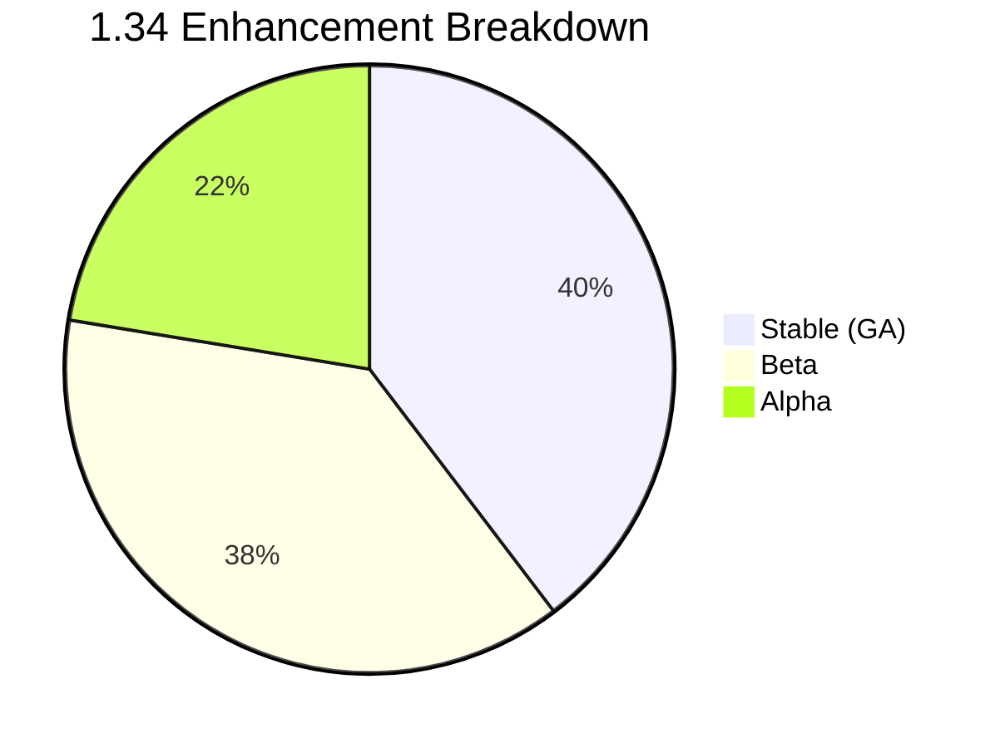
```mermaid
pie title 1.34 Enhancement Breakdown
    "Stable (GA)" : 23
    "Beta" : 22
    "Alpha" : 13
```

#### Características clave promovidas (GA)

**Dynamic Resource Allocation (DRA) Core APIs (GA)**

DRA alcanzó GA, proporcionando un framework estandarizado para solicitar y asignar recursos de hardware como GPUs, FPGAs y dispositivos de red. Esto reemplaza el modelo heredado de device plugin con un enfoque más flexible y nativo de Kubernetes.

```yaml
# DeviceClass: Define a class of hardware devices
apiVersion: resource.k8s.io/v1
kind: DeviceClass
metadata:
  name: gpu-a100
spec:
  selectors:
    - cel:
        expression: >-
          device.driver == "gpu.nvidia.com" &&
          device.attributes["model"].stringValue == "A100"
---
# ResourceClaim: Request specific hardware
apiVersion: resource.k8s.io/v1
kind: ResourceClaim
metadata:
  name: training-gpus
  namespace: ml-team
spec:
  devices:
    requests:
      - name: gpu
        deviceClassName: gpu-a100
        count: 4
    constraints:
      - requests: ["gpu"]
        matchAttribute: "gpu.nvidia.com/numa-node"    # All GPUs on same NUMA node
---
# ResourceClaimTemplate: Auto-create claims per pod
apiVersion: resource.k8s.io/v1
kind: ResourceClaimTemplate
metadata:
  name: gpu-claim-template
  namespace: ml-team
spec:
  spec:
    devices:
      requests:
        - name: gpu
          deviceClassName: gpu-a100
          count: 1
---
# Pod using DRA
apiVersion: v1
kind: Pod
metadata:
  name: ml-training
  namespace: ml-team
spec:
  resourceClaims:
    - name: gpu-claim
      resourceClaimName: training-gpus
  containers:
    - name: trainer
      image: pytorch-training:latest
      resources:
        claims:
          - name: gpu-claim
            request: gpu
```

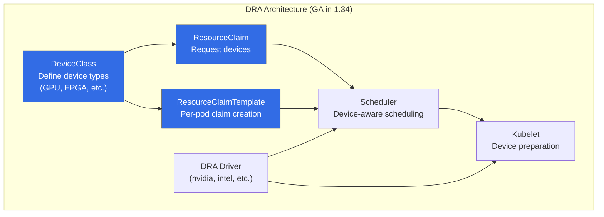
```mermaid
flowchart TD
    subgraph "DRA Architecture (GA in 1.34)"
        DC["DeviceClass
        Define device types
        (GPU, FPGA, etc.)"]
        RC["ResourceClaim
        Request devices"]
        RCT["ResourceClaimTemplate
        Per-pod claim creation"]
        DRI["DRA Driver
        (nvidia, intel, etc.)"]
        SCH["Scheduler
        Device-aware scheduling"]
        KUB["Kubelet
        Device preparation"]
    end

    DC --> RC
    DC --> RCT
    RC --> SCH
    RCT --> SCH
    SCH --> KUB
    DRI --> SCH
    DRI --> KUB

    style DC fill:#326CE5,stroke:#333,color:white
    style RC fill:#326CE5,stroke:#333,color:white
    style RCT fill:#326CE5,stroke:#333,color:white
```

**Namespace Structured Deletion (GA)**

La eliminación de namespaces ahora sigue un orden bien definido, asegurando que los recursos dependientes se limpien antes de los recursos de los que dependen. Esto elimina una clase antigua de problemas de namespaces atascados.

```bash
# Before 1.34: Namespace deletion could get stuck
$ kubectl delete namespace old-project
# Hangs indefinitely due to finalizer ordering issues

# After 1.34 (GA): Ordered deletion with clear status
$ kubectl delete namespace old-project
$ kubectl get namespace old-project -o jsonpath='{.status.conditions}'
# Shows clear progress through deletion phases
```

**VolumeAttributesClass (GA)**

VolumeAttributesClass se promovió a GA, permitiendo la modificación in-place de atributos de volumen como IOPS y throughput.

```yaml
# Change EBS volume performance tier without recreating
apiVersion: storage.k8s.io/v1
kind: VolumeAttributesClass
metadata:
  name: high-iops
driverName: ebs.csi.aws.com
parameters:
  iops: "16000"
  throughput: "1000"
---
apiVersion: storage.k8s.io/v1
kind: VolumeAttributesClass
metadata:
  name: standard
driverName: ebs.csi.aws.com
parameters:
  iops: "3000"
  throughput: "125"
```

```bash
# Switch a PVC's performance tier
kubectl patch pvc database-vol --type='merge' -p '{
  "spec": {"volumeAttributesClassName": "high-iops"}
}'

# Monitor the modification
kubectl get pvc database-vol -o jsonpath='{.status.currentVolumeAttributesClassName}'
kubectl get pvc database-vol -o jsonpath='{.status.modifyVolumeStatus}'
```

**Otras características GA en 1.34**:
- `nftablesProxyMode` -- backend nftables de kube-proxy
- `TrafficDistribution` para Services
- `PodLevelResources` -- establece límites de recursos agregados a nivel de pod
- `MatchLabelKeysInPodAffinity` -- coincidencia de affinity basada en claves de etiqueta
- `ImageVolume` -- imágenes OCI como volúmenes
- `UserNamespacesSupport` -- aislamiento con user namespaces

#### Características beta clave

**KYAML (Beta, habilitado por defecto)**

KYAML es un subconjunto más seguro de YAML diseñado para manifests de Kubernetes. Rechaza características peligrosas de YAML como anchors, aliases y ciertas coerciones de tipo que pueden provocar vulnerabilidades de seguridad o comportamiento inesperado.

```yaml
# STANDARD YAML: These dangerous patterns are REJECTED by KYAML

# Pattern 1: YAML anchors and aliases (disabled in KYAML)
# defaults: &defaults
#   replicas: 3
# production:
#   <<: *defaults     # REJECTED: anchor/alias

# Pattern 2: Boolean coercion (restricted in KYAML)
# environment: yes    # YAML interprets as boolean True
# environment: "yes"  # KYAML requires explicit quoting

# Pattern 3: Octal notation ambiguity
# fileMode: 0644      # YAML may interpret as octal or decimal
# fileMode: "0644"    # KYAML requires clarity
```

```bash
# Check if KYAML validation is enabled on your cluster
kubectl get --raw /metrics | grep kyaml_validation

# Test a manifest against KYAML rules
kubectl apply --dry-run=server -f manifest.yaml
# Warnings will indicate KYAML violations
```

**MutatingAdmissionPolicy (Beta)**

La contraparte basada en CEL de ValidatingAdmissionPolicy, que permite mutación inline de recursos durante admission sin webhooks.

```yaml
apiVersion: admissionregistration.k8s.io/v1beta1
kind: MutatingAdmissionPolicy
metadata:
  name: inject-default-labels
spec:
  matchConstraints:
    resourceRules:
      - apiGroups: ["apps"]
        apiVersions: ["v1"]
        operations: ["CREATE"]
        resources: ["deployments"]
  mutations:
    - patchType: ApplyConfiguration
      applyConfiguration:
        expression: >-
          Object{
            metadata: Object.metadata{
              labels: {
                "app.kubernetes.io/managed-by": "platform-team",
                "cost-center": string(request.namespace)
              }
            }
          }
```

**Otras características beta en 1.34**:
- `CRDValidationRatcheting` -- validación progresiva de campos de CRD
- `DeviceHealthConditions` -- informa la salud de dispositivos mediante DRA
- Mejoras de `PodLevelResources`

#### Características alpha clave

- **KYAML** pasó de alpha a beta en este lanzamiento
- **GangScheduling** (alpha) -- programa grupos de pods atómicamente
- Características extendidas de **InPlacePodVerticalScaling**
- Mejoras de **DRAPartitionableDevices**

---

### 4.7 Kubernetes 1.35 "Timbernetes" (diciembre de 2025)

**Tema**: Un nombre con temática de leñador que refleja el enfoque del lanzamiento en atravesar la complejidad y construir bases sólidas.

**Estadísticas del lanzamiento**: 60 mejoras -- 17 Stable, 19 Beta, 22 Alpha

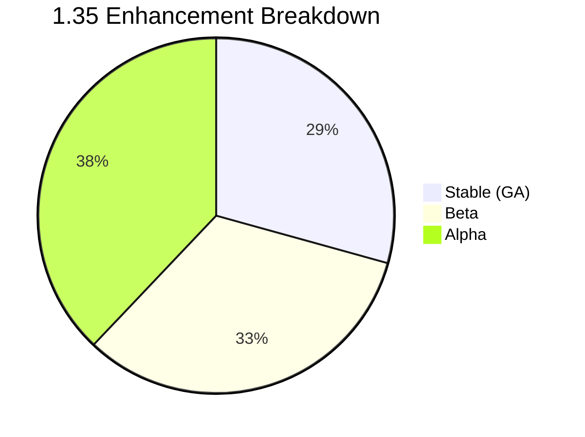
```mermaid
pie title 1.35 Enhancement Breakdown
    "Stable (GA)" : 17
    "Beta" : 19
    "Alpha" : 22
```

#### Características clave promovidas (GA)

**In-Place Pod Vertical Scaling (GA)**

La esperada promoción del redimensionamiento in-place de pods. Los Pods ahora pueden redimensionarse (CPU y memoria) sin reinicio, con garantías completas de estabilidad.

| Versión | Estado | Cambios clave |
|---------|--------|-------------|
| 1.27 | Alpha | Implementación inicial, redimensionamiento solo de CPU |
| 1.33 | Beta | Redimensionamiento de memoria, políticas de redimensionamiento, habilitado por defecto |
| 1.35 | **GA** | Estabilidad completa, estado extendido, listo para producción |

```yaml
# Production-ready in-place scaling with VPA integration
apiVersion: autoscaling.k8s.io/v1
kind: VerticalPodAutoscaler
metadata:
  name: app-vpa
spec:
  targetRef:
    apiVersion: apps/v1
    kind: Deployment
    name: web-app
  updatePolicy:
    updateMode: "InPlace"           # Use in-place resize (requires 1.35+)
  resourcePolicy:
    containerPolicies:
      - containerName: app
        minAllowed:
          cpu: 100m
          memory: 128Mi
        maxAllowed:
          cpu: "4"
          memory: 4Gi
        controlledResources:
          - cpu
          - memory
```

```yaml
# Resize policy controlling restart behavior
apiVersion: v1
kind: Pod
metadata:
  name: production-app
spec:
  containers:
    - name: app
      image: myapp:latest
      resources:
        requests:
          cpu: "1"
          memory: 1Gi
        limits:
          cpu: "2"
          memory: 2Gi
      resizePolicy:
        - resourceName: cpu
          restartPolicy: NotRequired       # CPU: resize in-place
        - resourceName: memory
          restartPolicy: NotRequired       # Memory: also in-place (GA!)
```

```bash
# Resize workflow
kubectl patch pod production-app --subresource resize --patch '{
  "spec": {
    "containers": [{
      "name": "app",
      "resources": {
        "requests": {"cpu": "2", "memory": "2Gi"},
        "limits": {"cpu": "4", "memory": "4Gi"}
      }
    }]
  }
}'

# Monitor resize progress
kubectl get pod production-app -o json | jq '{
  resize: .status.resize,
  allocated: .status.containerStatuses[0].allocatedResources,
  requested: .spec.containers[0].resources.requests
}'
```

> **Impacto para usuarios de EKS**: El redimensionamiento in-place de pods elimina la necesidad de reiniciar pods para ajustes de recursos. Esto es transformador para:
> - **Workloads stateful** (bases de datos, cachés) que son costosos de reiniciar
> - **Jobs batch de larga duración** que necesitan más recursos a mitad de ejecución
> - **Adopción de VPA**, que antes requería reinicios de pods
> - **Optimización de costos** mediante right-sizing sin interrupciones

**Otras características GA en 1.35**:
- `CRDValidationRatcheting` -- validación progresiva de CRD
- `DeviceHealthConditions` -- informes de salud de dispositivos DRA
- `PodLifecycleSleepActionGracePeriod` -- período de gracia configurable para acciones sleep
- `ContextualLogging` -- logging estructurado completamente promovido

#### Características beta clave

**KYAML (Beta, habilitado por defecto)**

KYAML alcanzó beta y se habilitó por defecto, lo que significa que todo YAML enviado al API server se valida contra el subconjunto más seguro. Los patrones YAML inválidos generan advertencias (no rechazos en beta).

```bash
# With KYAML enabled, these warnings appear on apply:
$ kubectl apply -f deployment.yaml
Warning: KYAML: line 15: implicit boolean coercion; use "true" instead of "yes"
Warning: KYAML: line 23: YAML anchor detected; anchors are not supported in KYAML
deployment.apps/my-app created
```

**Gang Scheduling (Alpha avanzando a Beta)**

Gang scheduling garantiza que un grupo de pods se programe atómicamente -- o todos los pods del grupo se programan, o ninguno. Esto es crítico para entrenamiento distribuido y workloads HPC estrechamente acoplados.

```yaml
# PodGroup for gang scheduling
apiVersion: scheduling.k8s.io/v1alpha1
kind: PodGroup
metadata:
  name: distributed-training
  namespace: ml-team
spec:
  minMember: 4                    # All 4 pods must be schedulable
  scheduleTimeoutSeconds: 300     # Timeout if group can't be scheduled
---
apiVersion: batch/v1
kind: Job
metadata:
  name: pytorch-distributed
  namespace: ml-team
spec:
  completions: 4
  parallelism: 4
  template:
    metadata:
      labels:
        pod-group.scheduling.k8s.io/name: distributed-training
    spec:
      schedulerName: default-scheduler
      containers:
        - name: trainer
          image: pytorch-dist:latest
          resources:
            limits:
              nvidia.com/gpu: 8
```

**Otras características beta en 1.35**:
- `AnonymousAuthConfigurableEndpoints` -- acceso anónimo configurable por endpoint
- `InPlacePodVerticalScalingAllocatedStatus` -- informes detallados de estado de redimensionamiento
- Mejoras de `SELinuxMount`
- `NodeInclusionPolicyInPodTopologySpread` -- control de inclusión de nodos para distribución de topología

#### Características alpha clave

- **PodLevelInPlaceScaling** -- redimensiona a nivel de pod (agregado), no solo a nivel de container
- **LeaderMigration** -- migra la elección de líder de controller-manager
- Mejoras de **SchedulerQueueingHints**
- **RecoverVolumeExpansionFailure** -- se recupera de fallos de expansión de volumen

---

### 4.8 Kubernetes 1.36 "ハル (Haru)" (abril de 2026)

**Tema**: Nombrado con la palabra japonesa para "primavera" (ハル/Haru), simbolizando nuevos comienzos y crecimiento.

**Estadísticas del lanzamiento**: 68 mejoras -- 18 Stable, 25 Beta, 25 Alpha. Los temas principales incluyen hardening de seguridad, soporte para workloads AI/ML y extensibilidad de API. EKS soporta 1.36 en todas las regiones disponibles, incluido GovCloud (US).

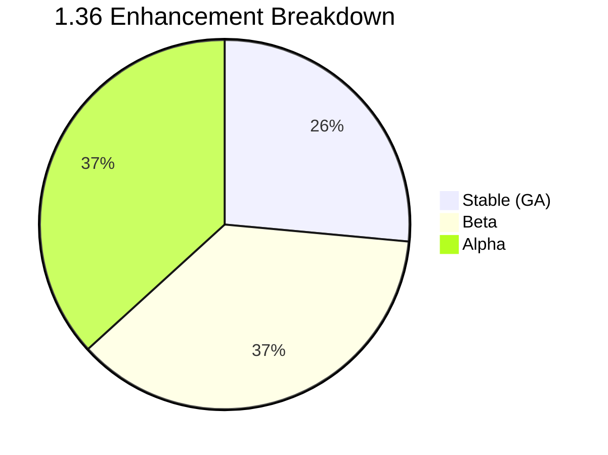
```mermaid
pie title 1.36 Enhancement Breakdown
    "Stable (GA)" : 18
    "Beta" : 25
    "Alpha" : 25
```

**Descripción general de características clave**:

| Característica | Etapa | Valor clave |
|---------|-------|-----------|
| Mutating Admission Policies | **GA** | Elimina servidores webhook -- simplicidad operativa, rendimiento, disponibilidad |
| In-Place Pod Vertical Scaling | **Mejorado** | Ajuste de recursos sin downtime -- eficiencia de costos, protección de SLA |
| User Namespaces | **GA** | Container root ≠ node root -- aislamiento de privilegios |
| Fine-Grained Kubelet API Authorization | **GA** | Acceso de mínimo privilegio a la API del kubelet |
| Legacy ServiceAccount Token Cleanup | **GA** | Limpieza automática de tokens no usados -- menor superficie de ataque |
| Resource Health Status (DRA) | Mejorado | Salud de dispositivos GPU -- identificación más rápida de causa raíz de fallos |

#### Características clave promovidas (GA)

**Mutating Admission Policies (GA)**

Mutating Admission Policies (MAP) llevan mutación basada en CEL a objetos nativos de Kubernetes, eliminando la necesidad de servidores webhook externos. Con MAP, la lógica de mutación se define declarativamente usando recursos `MutatingAdmissionPolicy` y `MutatingAdmissionPolicyBinding`, y el API server la evalúa en proceso.

Características clave:

- **Evaluación en proceso del API server**: Sin viajes de ida y vuelta de red a webhooks, sin latencia de servidores externos. La mutación se ejecuta dentro del propio proceso del API server.
- **Simplicidad operativa**: Sin gestión de certificados, sin despliegues de alta disponibilidad, sin preocupaciones de escalado para servidores webhook. El API server maneja todo.
- **Idempotencia garantizada**: Las expresiones CEL producen resultados deterministas, eliminando casos límite de ordenamiento y reinvocación.
- **Limitación**: Las mutaciones que requieren búsquedas de datos externos (por ejemplo, consultar un servidor OPA o un image registry) aún necesitan webhooks tradicionales. MAP es para mutaciones autocontenidas e impulsadas por políticas.

> **Impacto**: Los servidores webhook para admission control han sido históricamente puntos únicos de fallo en clusters Kubernetes. Un webhook mal configurado o no disponible puede bloquear toda la creación de pods en todo el cluster. MAP elimina esta clase de riesgo operativo para la mayoría de los casos de uso de mutación.

El siguiente ejemplo demuestra una `MutatingAdmissionPolicy` que auto-inyecta `resizePolicy` en pods anotados para redimensionamiento in-place. Este es un patrón práctico que combina MAP (GA en 1.36) con In-Place Pod Vertical Scaling (GA en 1.35):

```yaml
apiVersion: admissionregistration.k8s.io/v1
kind: MutatingAdmissionPolicy
metadata:
  name: inject-resizepolicy
spec:
  failurePolicy: Fail
  reinvocationPolicy: Never
  matchConstraints:
    resourceRules:
      - apiGroups: [""]
        apiVersions: ["v1"]
        operations: ["CREATE"]
        resources: ["pods"]
  matchConditions:
    - name: only-resize-enabled
      expression: >-
        has(object.metadata.annotations) &&
        ("resize.example.com/enabled" in object.metadata.annotations) &&
        object.metadata.annotations["resize.example.com/enabled"] == "true"
  mutations:
    - patchType: JSONPatch
      jsonPatch:
        expression: >-
          object.spec.containers.map(c, JSONPatch{
            op: "add",
            path: "/spec/containers/" + string(object.spec.containers.indexOf(c)) + "/resizePolicy",
            value: [
              {"resourceName": "cpu",    "restartPolicy": "NotRequired"},
              {"resourceName": "memory", "restartPolicy": "RestartContainer"}
            ]
          })
---
apiVersion: admissionregistration.k8s.io/v1
kind: MutatingAdmissionPolicyBinding
metadata:
  name: inject-resizepolicy-binding
spec:
  policyName: inject-resizepolicy
  matchResources:
    namespaceSelector:
      matchLabels:
        map-demo: "true"
```

> **Nota de seguridad**: `matchConstraints` de MAP es cluster-wide por defecto. Siempre delimita las mutaciones usando un `namespaceSelector` en el binding para evitar modificaciones no intencionadas en todo el cluster.

> **Nota técnica**: `resizePolicy` se define como una lista atómica en el esquema de la API de Kubernetes. Esto significa que debes usar `JSONPatch` (como se muestra arriba). Intentar usar `ApplyConfiguration` fallará con `"may not mutate atomic arrays"`.

**Mejoras de In-Place Pod Vertical Scaling**

Basándose en la promoción a GA del redimensionamiento in-place por container en 1.35, Kubernetes 1.36 agrega varias mejoras:

- **Redimensionamiento de presupuesto compartido a nivel de pod**: Los recursos a nivel de pod ahora pueden redimensionarse sin reiniciar el pod, permitiendo ajustes agregados de recursos entre todos los containers de un pod.
- **Seguimiento de checkpoints de CPUManager**: CPUManager ahora rastrea el estado de checkpoints durante operaciones de redimensionamiento en vivo, manteniendo la alineación NUMA para workloads sensibles al rendimiento.
- **Redimensionamiento de CPU (NotRequired)**: Los cambios de CPU con `restartPolicy: NotRequired` se aplican mediante actualizaciones de cgroup con cero downtime -- sin reinicio de container, sin caídas de conexión.
- **Comportamiento de reducción de memoria**: Las operaciones de reducción de memoria pueden activar `RestartContainer` según el uso real de memoria en el momento del redimensionamiento. La validación por workload es esencial antes de habilitar el redimensionamiento de memoria en producción.

**User Namespaces (Feature Gate eliminado)**

User Namespaces ha alcanzado plena preparación para producción con el feature gate eliminado en 1.36. El UID 0 del container (root dentro del container) se mapea a un UID de host no privilegiado, proporcionando aislamiento de privilegios sin cambios en la aplicación.

Con el gate eliminado, user namespaces está disponible en todos los clusters que ejecutan 1.36 sin configuración de feature gate. Esto elimina la necesidad de soluciones de terceros para lograr aislamiento de privilegios del container al host.

**KYAML (GA)**

KYAML ha alcanzado GA, haciendo del subconjunto YAML más seguro el estándar para todos los manifests de Kubernetes. La validación KYAML ahora rechaza (no solo advierte sobre) patrones YAML peligrosos por defecto.

| Característica YAML | ¿Permitida en KYAML? | Razón |
|-------------|-------------------|--------|
| Anchors & Aliases | No | Riesgo de inyección, confusión |
| Merge Keys (`<<`) | No | Comportamiento impredecible |
| Booleanos implícitos (`yes`/`no`) | No | Bugs de coerción de tipo |
| Claves de mapa que no son string | No | Ambigüedad |
| Claves duplicadas | No | Sobrescritura silenciosa |
| Comentarios | Sí | Esencial para documentación |
| Strings multilínea (`|`, `>`) | Sí | Comúnmente necesario |
| Secuencias/mapeos flow | Sí | Uso estándar de YAML |

```bash
# KYAML is now enforced by default
$ kubectl apply -f bad-manifest.yaml
Error from server: error parsing bad-manifest.yaml: KYAML validation failed:
  line 5: YAML anchors are not permitted
  line 12: implicit boolean value "yes" is not permitted; use "true" or "false"
```

**Gang Scheduling (GA)**

La programación atómica de grupos de pods se promovió a GA.

```yaml
# GA-level gang scheduling
apiVersion: scheduling.k8s.io/v1
kind: PodGroup
metadata:
  name: mpi-job
spec:
  minMember: 8
  scheduleTimeoutSeconds: 600
  priorityClassName: high-priority
```

**Otras características GA en 1.36**:
- `AnonymousAuthConfigurableEndpoints` -- control de autenticación anónima por endpoint
- `SELinuxMount` -- gestión de etiquetas SELinux para volúmenes
- `NodeInclusionPolicyInPodTopologySpread` -- inclusión de nodos para distribución de topología
- `RecoverVolumeExpansionFailure` -- recuperación automatizada de expansiones fallidas
- `FineGrainedKubeletAPIAuthorization` -- acceso de mínimo privilegio a la API del kubelet, restringiendo qué nodos pueden acceder a qué endpoints del kubelet
- `LegacyServiceAccountTokenCleanUp` -- limpieza automática de tokens ServiceAccount basados en Secret no usados, reduciendo la superficie de ataque de credenciales de larga duración

#### Patrón de gestión de recursos consciente de fases

Esta sección presenta un patrón práctico que combina In-Place Pod Vertical Scaling (GA en 1.35) con Mutating Admission Policies (GA en 1.36) para implementar gestión de recursos consciente de fases -- ajustando automáticamente los recursos del container según la fase del ciclo de vida de la aplicación.

**Definición del problema**

Muchos workloads containerizados tienen fases de ciclo de vida distintas que demandan perfiles de recursos diferentes:

- **Fase de startup (warmup)**: Alta CPU para compilación JIT de JVM, carga de modelos LLM, precarga de índices/caché
- **Fase steady-state (serving)**: Menor CPU suficiente para el manejo normal de solicitudes

Ambas fases muestran el container como `Running` en Kubernetes. No hay un mecanismo nativo para cambiar recursos automáticamente cuando la aplicación transiciona de warmup a serving. La solución típica -- sobreaprovisionar para la fase de startup -- desperdicia recursos durante la fase steady-state, mucho más larga.

Los workloads objetivo incluyen aplicaciones JVM con warmup JIT, servidores de inferencia ML que cargan modelos en memoria y servicios que construyen cachés o índices al iniciar.

**Flujo**:

```
Pod Create (startup: large CPU, req==limit -> Guaranteed QoS)
  -> Controller watches pod.status.containerStatuses[].started
  -> started:true detected (= startup probe passed)
  -> Resize via pods/resize subresource to steady-state CPU (zero-downtime)
```

**Idea clave -- preservación de QoS**

La clase QoS se determina en el momento de creación del Pod y no cambia al redimensionar (KEP-1287). Al establecer `requests == limits` tanto en la fase de startup como en la fase steady-state, el pod mantiene QoS `Guaranteed` durante todo su ciclo de vida. La memoria permanece fija (evitando riesgo de reinicio); solo cambia la CPU.

**Enfoque basado en anotaciones (sin requerir CRD)**

En lugar de definir un Custom Resource, este patrón usa anotaciones en workloads existentes. Un controller liviano observa pods y actúa sobre las anotaciones:

```yaml
apiVersion: apps/v1
kind: Deployment
metadata:
  name: phase-aware-app
spec:
  replicas: 2
  selector:
    matchLabels:
      app: phase-aware-app
  template:
    metadata:
      annotations:
        resize.example.com/enabled:          "true"
        resize.example.com/trigger:          "StartupProbePassed"
        resize.example.com/steady-resources: |
          {"app":{"requests":{"cpu":"50m"},"limits":{"cpu":"50m"}}}
      labels:
        app: phase-aware-app
    spec:
      containers:
        - name: app
          image: myapp:latest
          resizePolicy:
            - resourceName: cpu
              restartPolicy: NotRequired
            - resourceName: memory
              restartPolicy: RestartContainer
          resources:
            requests:
              cpu: "200m"
              memory: 64Mi
            limits:
              cpu: "200m"
              memory: 64Mi
          startupProbe:
            httpGet:
              path: /healthz
              port: 8080
            initialDelaySeconds: 5
            periodSeconds: 3
            failureThreshold: 30
```

**Implementación del controller (Go)**

El siguiente controller observa pods anotados y los parchea a recursos steady-state cuando el startup probe pasa. Funciona de forma idéntica para Deployments, StatefulSets, DaemonSets y Argo Rollouts porque solo observa Pods -- sin necesidad de ramas por tipo de workload.

```go
// pod-resizer — annotation-based zero-downtime in-place downscale controller.
// Watches Pods only — works identically for Deployment/StatefulSet/DaemonSet/Rollout.
// On startup probe pass, patches to steady resources via pods/resize subresource.
// Maintains req==limit on both phases to preserve Guaranteed QoS (KEP-1287).
package main

import (
	"context"
	"encoding/json"
	"fmt"
	"log"
	"strconv"
	"sync"
	"time"

	corev1 "k8s.io/api/core/v1"
	metav1 "k8s.io/apimachinery/pkg/apis/meta/v1"
	"k8s.io/apimachinery/pkg/types"
	"k8s.io/client-go/informers"
	"k8s.io/client-go/kubernetes"
	"k8s.io/client-go/rest"
	"k8s.io/client-go/tools/cache"
)

const (
	annEnabled = "resize.example.com/enabled"
	annTrigger = "resize.example.com/trigger"
	annDelay   = "resize.example.com/delay-seconds"
	annSteady  = "resize.example.com/steady-resources"
	annResized = "resize.example.com/resized"
)

type resVals struct {
	Requests map[string]string `json:"requests,omitempty"`
	Limits   map[string]string `json:"limits,omitempty"`
}

var clientset *kubernetes.Clientset
var processed sync.Map

func main() {
	cfg, err := rest.InClusterConfig()
	if err != nil {
		log.Fatalf("in-cluster config: %v", err)
	}
	clientset, err = kubernetes.NewForConfig(cfg)
	if err != nil {
		log.Fatalf("clientset: %v", err)
	}

	factory := informers.NewSharedInformerFactory(clientset, 15*time.Second)
	podInformer := factory.Core().V1().Pods().Informer()
	podInformer.AddEventHandler(cache.ResourceEventHandlerFuncs{
		AddFunc:    func(obj interface{}) { handle(obj) },
		UpdateFunc: func(_, obj interface{}) { handle(obj) },
	})

	stop := make(chan struct{})
	defer close(stop)
	log.Printf("pod-resizer starting; watching pods annotated %s=true", annEnabled)
	factory.Start(stop)
	factory.WaitForCacheSync(stop)
	log.Printf("informer cache synced; ready")
	select {}
}

func handle(obj interface{}) {
	pod, ok := obj.(*corev1.Pod)
	if !ok {
		return
	}
	a := pod.Annotations
	if a == nil || a[annEnabled] != "true" || a[annResized] == "true" {
		return
	}
	if pod.DeletionTimestamp != nil || pod.Status.Phase != corev1.PodRunning {
		return
	}

	trigger := a[annTrigger]
	if trigger == "" {
		trigger = "StartupProbePassed"
	}
	if !triggerMet(pod, trigger, a[annDelay]) {
		return
	}

	steady := map[string]resVals{}
	if err := json.Unmarshal([]byte(a[annSteady]), &steady); err != nil {
		log.Printf("ERROR %s/%s: bad %s: %v", pod.Namespace, pod.Name, annSteady, err)
		return
	}
	patch := buildResizePatch(steady)
	if patch == nil {
		return
	}
	pb, _ := json.Marshal(patch)

	key := string(pod.UID)
	if _, loaded := processed.LoadOrStore(key, true); loaded {
		return
	}

	if _, err := clientset.CoreV1().Pods(pod.Namespace).Patch(
		context.TODO(), pod.Name, types.StrategicMergePatchType, pb,
		metav1.PatchOptions{}, "resize"); err != nil {
		processed.Delete(key)
		log.Printf("ERROR %s/%s: resize patch failed: %v", pod.Namespace, pod.Name, err)
		return
	}
	log.Printf("RESIZED %s/%s [%s] trigger=%s patch=%s",
		pod.Namespace, pod.Name, ownerKind(pod), trigger, string(pb))

	mark := []byte(fmt.Sprintf(`{"metadata":{"annotations":{%q:"true"}}}`, annResized))
	if _, err := clientset.CoreV1().Pods(pod.Namespace).Patch(
		context.TODO(), pod.Name, types.MergePatchType, mark, metav1.PatchOptions{}); err != nil {
		log.Printf("WARN %s/%s: marker patch failed: %v", pod.Namespace, pod.Name, err)
	}
}

func triggerMet(pod *corev1.Pod, trigger, delayStr string) bool {
	switch trigger {
	case "Ready":
		for _, c := range pod.Status.Conditions {
			if c.Type == corev1.PodReady {
				return c.Status == corev1.ConditionTrue
			}
		}
		return false
	case "Delay":
		delay, _ := strconv.Atoi(delayStr)
		for _, cs := range pod.Status.ContainerStatuses {
			if cs.State.Running != nil {
				return time.Since(cs.State.Running.StartedAt.Time) >= time.Duration(delay)*time.Second
			}
		}
		return false
	default:
		if len(pod.Status.ContainerStatuses) == 0 {
			return false
		}
		for _, cs := range pod.Status.ContainerStatuses {
			if cs.Started == nil || !*cs.Started {
				return false
			}
		}
		return true
	}
}

func buildResizePatch(steady map[string]resVals) map[string]interface{} {
	var containers []map[string]interface{}
	for name, rv := range steady {
		res := map[string]interface{}{}
		if len(rv.Requests) > 0 {
			res["requests"] = rv.Requests
		}
		if len(rv.Limits) > 0 {
			res["limits"] = rv.Limits
		}
		containers = append(containers, map[string]interface{}{"name": name, "resources": res})
	}
	if len(containers) == 0 {
		return nil
	}
	return map[string]interface{}{"spec": map[string]interface{}{"containers": containers}}
}

func ownerKind(pod *corev1.Pod) string {
	if len(pod.OwnerReferences) > 0 {
		return pod.OwnerReferences[0].Kind
	}
	return "Pod"
}
```

**RBAC del controller**

El controller requiere acceso al subresource `pods/resize` para aplicar parches, además de permisos estándar de watch/list para pods:

```yaml
apiVersion: v1
kind: ServiceAccount
metadata:
  name: pod-resizer
  namespace: pod-resizer-system
---
apiVersion: rbac.authorization.k8s.io/v1
kind: ClusterRole
metadata:
  name: pod-resizer
rules:
  - apiGroups: [""]
    resources: ["pods"]
    verbs: ["get", "list", "watch", "patch"]
  - apiGroups: [""]
    resources: ["pods/resize"]          # Required for resize subresource
    verbs: ["patch"]
---
apiVersion: rbac.authorization.k8s.io/v1
kind: ClusterRoleBinding
metadata:
  name: pod-resizer
subjects:
  - kind: ServiceAccount
    name: pod-resizer
    namespace: pod-resizer-system
roleRef:
  apiGroup: rbac.authorization.k8s.io
  kind: ClusterRole
  name: pod-resizer
```

**Workload de demo**

Un workload mínimo para probar el patrón de redimensionamiento consciente de fases:

```yaml
apiVersion: v1
kind: Namespace
metadata:
  name: resize-demo
  labels:
    map-demo: "true"        # Enables MAP resizePolicy injection
---
apiVersion: apps/v1
kind: Deployment
metadata:
  name: busybox-resize-demo
  namespace: resize-demo
spec:
  replicas: 2
  selector:
    matchLabels:
      app: busybox-resize-demo
  template:
    metadata:
      labels:
        app: busybox-resize-demo
      annotations:
        resize.example.com/enabled:          "true"
        resize.example.com/trigger:          "StartupProbePassed"
        resize.example.com/steady-resources: |
          {"busybox":{"requests":{"cpu":"50m"},"limits":{"cpu":"50m"}}}
    spec:
      containers:
        - name: busybox
          image: busybox:1.36
          command: ["sh", "-c", "echo 'starting warmup'; sleep 10; echo 'ready'; while true; do sleep 3600; done"]
          resources:
            requests:
              cpu: "200m"
              memory: 64Mi
            limits:
              cpu: "200m"
              memory: 64Mi
          startupProbe:
            exec:
              command: ["sh", "-c", "test -f /tmp/ready || (sleep 8 && touch /tmp/ready)"]
            initialDelaySeconds: 2
            periodSeconds: 3
            failureThreshold: 10
```

**Compatibilidad con Argo Rollouts**

El controller funciona con Argo Rollouts sin modificación. La cadena de propiedad es Rollout -> ReplicaSet -> Pod, idéntica en estructura a Deployment -> ReplicaSet -> Pod. Como el controller observa solo Pods y no inspecciona owner references con lógica específica por tipo, se soporta cualquier workload controller que cree pods con las anotaciones apropiadas.

**Resultados de prueba (EKS 1.36.1)**

Probado en EKS v1.36.1, containerd 2.2.3, Amazon Linux 2023 (cgroup v2, arm64/Graviton).

Salida de log del controller:

```
2026/06/28 09:12:03 pod-resizer starting; watching pods annotated resize.example.com/enabled=true
2026/06/28 09:12:03 informer cache synced; ready
2026/06/28 09:12:41 RESIZED resize-demo/busybox-resize-demo-7f8b9c6d4-k2xnm [ReplicaSet] trigger=StartupProbePassed patch={"spec":{"containers":[{"name":"busybox","resources":{"limits":{"cpu":"50m"},"requests":{"cpu":"50m"}}}]}}
2026/06/28 09:12:41 RESIZED resize-demo/busybox-resize-demo-7f8b9c6d4-p9wvj [ReplicaSet] trigger=StartupProbePassed patch={"spec":{"containers":[{"name":"busybox","resources":{"limits":{"cpu":"50m"},"requests":{"cpu":"50m"}}}]}}
2026/06/28 09:13:05 RESIZED resize-demo/busybox-resize-ds-xq7zt [DaemonSet] trigger=StartupProbePassed patch={"spec":{"containers":[{"name":"busybox","resources":{"limits":{"cpu":"50m"},"requests":{"cpu":"50m"}}}]}}
2026/06/28 09:13:22 RESIZED resize-demo/busybox-resize-sts-0 [StatefulSet] trigger=StartupProbePassed patch={"spec":{"containers":[{"name":"busybox","resources":{"limits":{"cpu":"50m"},"requests":{"cpu":"50m"}}}]}}
```

Verificación de redimensionamiento in-place:

| Workload | QoS | CPU (req/lim) | restartCount | containerID |
|----------|-----|---------------|--------------|-------------|
| Deployment (x2) | Guaranteed -> **Guaranteed** | 200m -> **50m** | 0 -> **0** | **Idéntico** |
| DaemonSet | Guaranteed -> **Guaranteed** | 200m -> **50m** | 0 -> **0** | **Idéntico** |
| StatefulSet | Guaranteed -> **Guaranteed** | 200m -> **50m** | 0 -> **0** | **Idéntico** |

> **Evidencia clave**: `restartCount=0` Y `containerID` idéntico antes y después del redimensionamiento confirma una verdadera reasignación de CPU de cgroup in-place. Ningún container fue recreado. La clase QoS se preservó como `Guaranteed` durante todo el redimensionamiento.

**Resultados de prueba de inyección MAP**

Verificando que `MutatingAdmissionPolicy` inyecta correctamente `resizePolicy` según la presencia de anotación:

| Caso | Anotación presente | resizePolicy inyectado | Veredicto |
|------|-------------------|----------------------|---------|
| with-annotation | Sí | `[{cpu:NotRequired},{memory:RestartContainer}]` | Inyectado (sin webhook necesario) |
| without-annotation | No | `[]` (ninguno) | No inyectado (matchCondition funcionando) |

**Ventajas del enfoque basado en anotaciones**

| Aspecto | Beneficio |
|--------|---------|
| Sobrecarga operativa | Sin CRD/CR -- solo agrega anotaciones a workloads existentes |
| Universalidad de workloads | El controller observa solo Pods -- comportamiento idéntico para Deployment/StatefulSet/DaemonSet/Rollout |
| Complejidad de código | Sin ramificación por tipo, creación de hijos ni manejo de owner references |
| Workloads existentes | Aplicar mediante parche de anotación (sin reescritura de manifest) |
| Automatización de resizePolicy | MAP (GA) auto-inyecta al crear el pod -- totalmente automatizado sin webhooks |

**Advertencias**

- El redimensionamiento CPU-only con cero downtime es seguro y está verificado. Reducir memoria puede activar reinicio de container según el uso real -- valida por workload antes de habilitarlo.
- Se requiere `kubectl` versión 1.32 o posterior para `--subresource resize` (solo debugging; el controller usa client-go, que maneja subresources de forma nativa).
- Las interacciones con HPA y la política de alineación NUMA estática de CPUManager necesitan validación por workload. El escalado HPA concurrente y el redimensionamiento in-place pueden producir objetivos de recursos conflictivos.
- Para despliegues de producción, agrega leader election al controller para alta disponibilidad con múltiples réplicas.

#### Checklist de actualización

- **Ingress-NGINX retirado (2026-03-24)**: Los parches de seguridad se detuvieron. Migra a un controller compatible con Gateway API (por ejemplo, Envoy Gateway, Istio Gateway, Cilium Gateway API).
- **Auditoría de modo IPVS / service externalIPs**: Revisa services que usan modo IPVS o `externalIPs` para compatibilidad con cambios de networking en 1.36. Se recomienda auditoría antes de actualizar.
- **EKS Cluster Insights**: Ejecuta EKS Cluster Insights antes de iniciar la actualización para identificar uso de APIs deprecadas, versiones incompatibles de add-ons y otros problemas de compatibilidad.

#### Características beta clave

**Pod-Level In-Place Scaling (Beta)**

Basándose en la GA del redimensionamiento in-place por container en 1.35, pod-level in-place scaling permite establecer límites de recursos agregados a nivel de pod y redimensionarlos.

```yaml
apiVersion: v1
kind: Pod
metadata:
  name: multi-container-app
spec:
  resources:                          # Pod-level resource limits
    limits:
      cpu: "4"
      memory: 8Gi
    requests:
      cpu: "2"
      memory: 4Gi
  containers:
    - name: app
      image: myapp:latest
      resources:
        requests:
          cpu: "1"
          memory: 2Gi
    - name: sidecar
      image: sidecar:latest
      resources:
        requests:
          cpu: 500m
          memory: 512Mi
    # Remaining resources available for burst
```

**Improved DRA Partitioning**

El particionado DRA para dispositivos como GPUs alcanzó beta, permitiendo compartir recursos con granularidad fina.

```yaml
# Request a GPU partition (MIG-like)
apiVersion: resource.k8s.io/v1
kind: ResourceClaim
metadata:
  name: gpu-partition
spec:
  devices:
    requests:
      - name: gpu-slice
        deviceClassName: gpu-partition
        selectors:
          - cel:
              expression: >-
                device.capacity["gpu.nvidia.com"].memory.compareTo(quantity("10Gi")) >= 0
```

#### Características alpha clave

- **MultipleSCTPAssociations** -- múltiples asociaciones SCTP por pod
- **SchedulerFIFO** -- opción de cola FIFO para scheduling
- Mejoras de **CPUManagerPolicyAlpha**

---

## 5. Cronograma de promoción de características clave

La siguiente tabla proporciona una vista integral entre versiones de las promociones principales de características. Úsala para comprender el ciclo de vida completo de las características que planeas adoptar.

### Características core

| Característica | KEP | Alpha | Beta | GA | Descripción |
|---------|-----|-------|------|-----|-------------|
| Sidecar Containers | KEP-753 | 1.28 | 1.29/1.31 | **1.33** | Soporte nativo de sidecar mediante init containers con `restartPolicy: Always` |
| In-Place Pod Vertical Scaling | KEP-1287 | 1.27 | 1.33 | **1.35** | Redimensiona CPU/memoria del pod sin reinicio |
| Pod Scheduling Readiness | KEP-3521 | 1.26 | 1.27 | **1.30** | Scheduling gates para retrasar la programación del pod |
| Job Success Policy | KEP-3998 | 1.28 | 1.31 | **1.33** | Criterios de éxito personalizados para Jobs |
| Pod-Level Resources | KEP-2837 | 1.32 | 1.33 | **1.34** | Límites de recursos agregados a nivel de pod |

### Características de seguridad

| Característica | KEP | Alpha | Beta | GA | Descripción |
|---------|-----|-------|------|-----|-------------|
| ValidatingAdmissionPolicy (CEL) | KEP-3488 | 1.26 | 1.28 | **1.30** | Admission control nativo con CEL |
| MutatingAdmissionPolicy (CEL) | KEP-3962 | 1.33 | 1.34/1.35 | **1.36** | Mutación nativa con CEL |
| StructuredAuthorizationConfiguration | KEP-3221 | 1.29 | 1.30 | **1.32** | Configuración de cadena de autorización ordenada |
| AppArmor GA | KEP-24 | 1.4 | 1.28 | **1.31** | Campo de API nativo de perfil AppArmor |
| User Namespaces | KEP-127 | 1.25 | 1.30/1.33 | **1.34** | Remapeo UID/GID para aislamiento de seguridad |
| KYAML | KEP-4222 | 1.33 | 1.34/1.35 | **1.36** | Subconjunto YAML más seguro para manifests de Kubernetes |

### Características de networking

| Característica | KEP | Alpha | Beta | GA | Descripción |
|---------|-----|-------|------|-----|-------------|
| Gateway API (CRD) | KEP-1897 | 1.18 | 1.22 | **1.26+** | API Ingress de próxima generación (basada en CRD, independiente de versión) |
| ServiceCIDR / IPAddress API | KEP-1880 | 1.27 | 1.31 | **1.33** | Gestión dinámica de rangos de IP de Service |
| Topology Aware Routing | KEP-2433 | 1.21 | 1.23 | **1.33** | Enrutamiento de tráfico consciente de zona |
| nftables kube-proxy | KEP-3866 | 1.29 | 1.31 | **1.34** | Enrutamiento de Service basado en nftables |
| Traffic Distribution | KEP-4444 | 1.30 | 1.31 | **1.34** | Preferencias de distribución de tráfico de Service |

### Características de almacenamiento

| Característica | KEP | Alpha | Beta | GA | Descripción |
|---------|-----|-------|------|-----|-------------|
| ReadWriteOncePod | KEP-2485 | 1.22 | 1.27 | **1.29** | Modo de acceso RW de un solo pod |
| VolumeAttributesClass | KEP-3751 | 1.29 | 1.31 | **1.34** | Atributos de volumen mutables (IOPS, throughput) |
| PV Last Phase Transition | KEP-3762 | 1.28 | 1.29 | **1.31** | Seguimiento de timestamp para cambios de fase de PV |
| RecoverVolumeExpansionFailure | KEP-1790 | 1.23 | 1.35 | **1.36** | Recuperación de fallos de expansión de volumen |

### Características de scheduling

| Característica | KEP | Alpha | Beta | GA | Descripción |
|---------|-----|-------|------|-----|-------------|
| Gang Scheduling | KEP-4818 | 1.35 | 1.35 | **1.36** | Programación atómica de grupos para workloads distribuidos |
| Pod Scheduling Readiness | KEP-3521 | 1.26 | 1.27 | **1.30** | Scheduling gates para programación diferida |
| MinDomainsInPodTopologySpread | KEP-3022 | 1.24 | 1.25 | **1.30** | Conteo mínimo de dominios para distribución de topología |

### Características de gestión de recursos

| Característica | KEP | Alpha | Beta | GA | Descripción |
|---------|-----|-------|------|-----|-------------|
| DRA Core APIs | KEP-3063 | 1.26 | 1.31 | **1.34** | Dynamic Resource Allocation para aceleradores |
| HPA Container Metrics | KEP-2273 | 1.20 | 1.27 | **1.30** | Métricas HPA por container |
| OCI Images as Volumes | KEP-4639 | 1.31 | 1.33 | **1.34** | Monta imágenes OCI como volúmenes de solo lectura |

### Visualización integral del cronograma

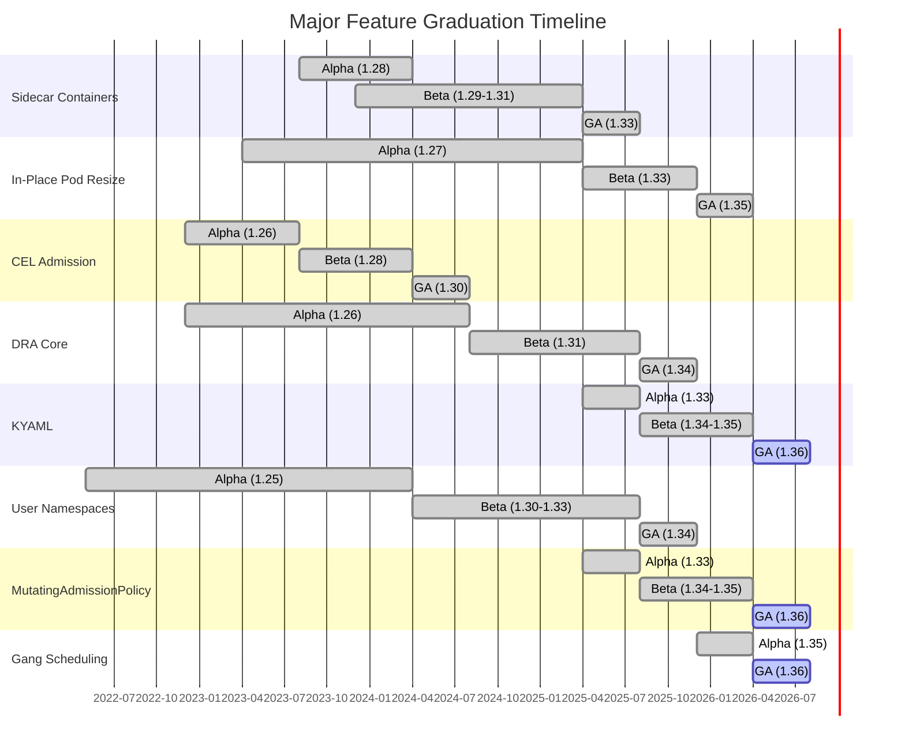
```mermaid
gantt
    title Major Feature Graduation Timeline
    dateFormat  YYYY-MM
    axisFormat  %Y-%m

    section Sidecar Containers
    Alpha (1.28)              :done, s1, 2023-08, 2024-04
    Beta (1.29-1.31)          :done, s2, 2023-12, 2025-04
    GA (1.33)                 :done, s3, 2025-04, 2025-08

    section In-Place Pod Resize
    Alpha (1.27)              :done, r1, 2023-04, 2025-04
    Beta (1.33)               :done, r2, 2025-04, 2025-12
    GA (1.35)                 :done, r3, 2025-12, 2026-04

    section CEL Admission
    Alpha (1.26)              :done, c1, 2022-12, 2023-08
    Beta (1.28)               :done, c2, 2023-08, 2024-04
    GA (1.30)                 :done, c3, 2024-04, 2024-08

    section DRA Core
    Alpha (1.26)              :done, d1, 2022-12, 2024-08
    Beta (1.31)               :done, d2, 2024-08, 2025-08
    GA (1.34)                 :done, d3, 2025-08, 2025-12

    section KYAML
    Alpha (1.33)              :done, k1, 2025-04, 2025-08
    Beta (1.34-1.35)          :done, k2, 2025-08, 2026-04
    GA (1.36)                 :active, k3, 2026-04, 2026-08

    section User Namespaces
    Alpha (1.25)              :done, u1, 2022-05, 2024-04
    Beta (1.30-1.33)          :done, u2, 2024-04, 2025-08
    GA (1.34)                 :done, u3, 2025-08, 2025-12

    section MutatingAdmissionPolicy
    Alpha (1.33)              :done, m1, 2025-04, 2025-08
    Beta (1.34-1.35)          :done, m2, 2025-08, 2026-04
    GA (1.36)                 :active, m3, 2026-04, 2026-08

    section Gang Scheduling
    Alpha (1.35)              :done, g1, 2025-12, 2026-04
    GA (1.36)                 :active, g2, 2026-04, 2026-08
```

---

## 6. Deprecaciones y eliminaciones

Comprender las deprecaciones y eliminaciones es crítico para la planificación de actualizaciones. Una deprecación anuncia que una API o característica se eliminará en una versión futura, dando tiempo a los equipos para migrar. Una eliminación es la supresión real de la API o característica.

### Política de deprecación de APIs de Kubernetes

- **APIs GA**: Se deprecan solo cuando hay disponible una API GA de reemplazo. Mínimo 12 meses o 3 lanzamientos antes de la eliminación.
- **APIs beta**: Mínimo 9 meses o 3 lanzamientos antes de la eliminación después de la deprecación.
- **APIs alpha**: Pueden eliminarse en cualquier lanzamiento sin aviso.

### Deprecaciones y eliminaciones de API por versión

#### Eliminado en 1.29

| API/Característica | Reemplazado por | Ruta de migración |
|------------|-------------|----------------|
| Plugin de admission `SecurityContextDeny` | Pod Security Standards (PSS) | Migra al admission controller `PodSecurity` |

#### Eliminado en 1.32

| API/Característica | Reemplazado por | Ruta de migración |
|------------|-------------|----------------|
| `flowcontrol.apiserver.k8s.io/v1beta2` | `flowcontrol.apiserver.k8s.io/v1beta3` -> `v1` | Actualiza la versión de API en recursos FlowSchema y PriorityLevelConfiguration |
| API HPA `autoscaling/v2beta1` | `autoscaling/v2` | Actualiza todos los manifests HPA para usar `autoscaling/v2` |

#### Eliminado en 1.34

| API/Característica | Reemplazado por | Ruta de migración |
|------------|-------------|----------------|
| Patrones heredados de bandera `--authorization-mode` | StructuredAuthorizationConfiguration | Migra a archivo de configuración de autorización estructurada |
| `flowcontrol.apiserver.k8s.io/v1beta3` | `flowcontrol.apiserver.k8s.io/v1` | Actualiza a la versión estable de la API |

#### Deprecado (aún no eliminado)

| API/Característica | Deprecado en | Eliminación esperada | Ruta de migración |
|------------|--------------|-----------------|----------------|
| Cloud provider in-tree (AWS, GCP, Azure) | 1.26+ | En curso | Migra a external cloud controller managers |
| Perfiles AppArmor basados en anotaciones | 1.31 | 1.35 | Usa el campo `securityContext.appArmorProfile` |
| `batch/v1beta1` CronJob | 1.21 | 1.25 (eliminado) | Usa `batch/v1` |
| `policy/v1beta1` PodDisruptionBudget | 1.21 | 1.25 (eliminado) | Usa `policy/v1` |
| Modo iptables de kube-proxy | 1.33 (soft) | TBD | Planifica migración a nftables o IPVS |

### Feature gates eliminados por versión

Cuando una característica alcanza GA, su feature gate normalmente se elimina después de 2 lanzamientos. Esto significa que no puedes deshabilitar características GA.

```bash
# Check for feature gates that reference removed gates
# This would cause kubelet startup failure after upgrade

# Feature gates removed in 1.33:
# - SidecarContainers (GA in 1.33, gate removed in 1.35)
# - ServiceCIDR (GA in 1.33, gate removed in 1.35)

# Feature gates removed in 1.34:
# - UserNamespacesSupport (GA in 1.34, gate removed in 1.36)
# - VolumeAttributesClass (GA in 1.34, gate removed in 1.36)

# If you have explicit feature gate overrides, check them:
kubectl get cm kubelet-config -n kube-system -o yaml | grep featureGates -A 20
```

### Checklist de migración para APIs deprecadas

```bash
#!/bin/bash
# deprecation-check.sh - Check for deprecated API usage

echo "=== Kubernetes Deprecation Audit ==="

# Check for deprecated API versions in cluster resources
echo ""
echo "--- Checking for deprecated APIs in running resources ---"

# FlowSchema (v1beta2/v1beta3 deprecated)
echo "FlowSchemas using deprecated API versions:"
kubectl get flowschemas -o json | jq -r '.items[] | select(.apiVersion != "flowcontrol.apiserver.k8s.io/v1") | "\(.metadata.name): \(.apiVersion)"'

# Check for AppArmor annotations (deprecated in 1.31)
echo ""
echo "Pods using deprecated AppArmor annotations:"
kubectl get pods -A -o json | jq -r '.items[] | select(.metadata.annotations // {} | keys[] | test("apparmor.security.beta")) | "\(.metadata.namespace)/\(.metadata.name)"'

# Check for deprecated admission webhooks
echo ""
echo "Admission webhooks using deprecated API versions:"
kubectl get validatingwebhookconfigurations -o json | jq -r '.items[] | select(.apiVersion | test("v1beta1")) | .metadata.name'
kubectl get mutatingwebhookconfigurations -o json | jq -r '.items[] | select(.apiVersion | test("v1beta1")) | .metadata.name'

# Check Helm releases for deprecated APIs
echo ""
echo "Checking Helm releases for deprecated API versions:"
for release in $(helm list -A -q); do
  helm get manifest $release -n $(helm list -A -f "^${release}$" -o json | jq -r '.[0].namespace') 2>/dev/null | \
    grep "apiVersion:" | sort -u | while read line; do
      case "$line" in
        *v1beta1*|*v1beta2*|*v2beta1*)
          echo "  $release: $line (DEPRECATED)"
          ;;
      esac
    done
done

echo ""
echo "=== Audit Complete ==="
```

### Matriz de compatibilidad de API

Usa esta tabla para verificar que tus manifests sean compatibles con la versión objetivo de Kubernetes antes de actualizar.

| Recurso | API estable | APIs deprecadas | Seguro desde |
|----------|-----------|-----------------|------------|
| HorizontalPodAutoscaler | `autoscaling/v2` | `v2beta1` (eliminado 1.26), `v2beta2` (eliminado 1.26) | 1.23 |
| CronJob | `batch/v1` | `v1beta1` (eliminado 1.25) | 1.21 |
| PodDisruptionBudget | `policy/v1` | `v1beta1` (eliminado 1.25) | 1.21 |
| CSIDriver | `storage.k8s.io/v1` | `v1beta1` (eliminado 1.22) | 1.18 |
| FlowSchema | `flowcontrol.apiserver.k8s.io/v1` | `v1beta2` (eliminado 1.32), `v1beta3` (eliminado 1.34) | 1.29 |
| ValidatingAdmissionPolicy | `admissionregistration.k8s.io/v1` | `v1beta1` (deprecado 1.30) | 1.30 |
| ResourceClaim (DRA) | `resource.k8s.io/v1` | `v1alpha3` (eliminado 1.34), `v1beta1` (eliminado 1.34) | 1.34 |
| VolumeAttributesClass | `storage.k8s.io/v1` | `v1beta1` (eliminado 1.36) | 1.34 |

---

## 7. Consideraciones específicas de EKS

### Retraso de versiones de EKS frente a upstream

Los lanzamientos de EKS se retrasan respecto a Kubernetes upstream aproximadamente 2-4 meses. Este retraso proporciona:

| Beneficio | Descripción |
|---------|-------------|
| **Estabilidad** | AWS valida el lanzamiento con integraciones específicas de EKS |
| **Compatibilidad de add-ons** | Los add-ons administrados se prueban y actualizan |
| **Disponibilidad de AMI** | Las AMIs optimizadas para EKS se construyen y prueban |
| **Parches de seguridad** | Las CVEs conocidas se abordan antes del lanzamiento |

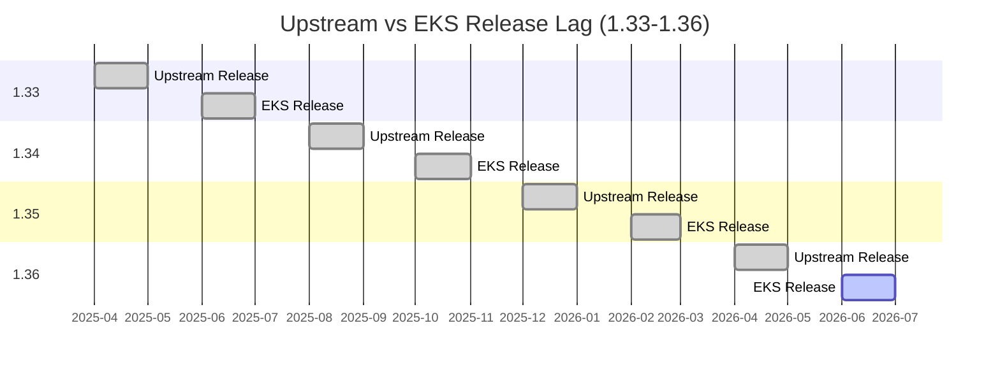
```mermaid
gantt
    title Upstream vs EKS Release Lag (1.33-1.36)
    dateFormat YYYY-MM
    axisFormat %Y-%m

    section 1.33
    Upstream Release    :done, u33, 2025-04, 2025-05
    EKS Release         :done, e33, 2025-06, 2025-07

    section 1.34
    Upstream Release    :done, u34, 2025-08, 2025-09
    EKS Release         :done, e34, 2025-10, 2025-11

    section 1.35
    Upstream Release    :done, u35, 2025-12, 2026-01
    EKS Release         :done, e35, 2026-02, 2026-03

    section 1.36
    Upstream Release    :done, u36, 2026-04, 2026-05
    EKS Release         :active, e36, 2026-06, 2026-07
```

### Disponibilidad de feature gates en EKS

No todos los feature gates de Kubernetes upstream están disponibles en EKS. AWS controla la configuración del control plane, por lo que:

- **Características GA**: Siempre habilitadas (igual que upstream)
- **Características beta (habilitadas por defecto)**: Generalmente disponibles en EKS
- **Características beta (deshabilitadas por defecto)**: Pueden requerir un ticket de soporte de EKS o no estar disponibles
- **Características alpha**: No disponibles en EKS (las características alpha nunca se habilitan en EKS)

```bash
# Check which feature gates are active on your EKS cluster's nodes
kubectl get --raw "/api/v1/nodes/$(kubectl get nodes -o jsonpath='{.items[0].metadata.name}')/proxy/configz" | \
  jq '.kubeletconfig.featureGates'

# Check API server feature gates via metrics
kubectl get --raw /metrics 2>/dev/null | grep kubernetes_feature_enabled | head -30
```

### Matriz de compatibilidad de add-ons administrados de EKS

Al actualizar clusters EKS, la compatibilidad de add-ons es crítica. Cada versión de Kubernetes tiene requisitos específicos de versión de add-ons.

| Add-on | K8s 1.31 | K8s 1.32 | K8s 1.33 | K8s 1.34 | K8s 1.35 | K8s 1.36 |
|--------|----------|----------|----------|----------|----------|----------|
| **VPC CNI** | v1.18+ | v1.19+ | v1.19+ | v1.20+ | v1.20+ | v1.21+ |
| **CoreDNS** | v1.11.1+ | v1.11.3+ | v1.12.0+ | v1.12.0+ | v1.12.1+ | v1.12.1+ |
| **kube-proxy** | v1.31.x | v1.32.x | v1.33.x | v1.34.x | v1.35.x | v1.36.x |
| **EBS CSI** | v1.35+ | v1.36+ | v1.37+ | v1.38+ | v1.39+ | v1.40+ |
| **EFS CSI** | v2.0+ | v2.1+ | v2.1+ | v2.2+ | v2.2+ | v2.3+ |
| **ADOT** | v0.102+ | v0.104+ | v0.106+ | v0.108+ | v0.110+ | v0.112+ |

> **Nota**: Siempre consulta la versión más reciente de [EKS add-on version compatibility](https://docs.aws.amazon.com/eks/latest/userguide/managing-add-ons.html) antes de actualizar, ya que pueden requerirse versiones de parche específicas.

```bash
# Check current add-on versions
aws eks describe-addon-versions --kubernetes-version 1.36 \
  --addon-name vpc-cni --query 'addons[].addonVersions[].addonVersion' --output table

# List all installed add-ons and their versions
aws eks list-addons --cluster-name my-cluster --output table
for addon in $(aws eks list-addons --cluster-name my-cluster --query 'addons[]' --output text); do
  version=$(aws eks describe-addon --cluster-name my-cluster --addon-name $addon \
    --query 'addon.addonVersion' --output text)
  echo "$addon: $version"
done
```

### Soporte de versiones de EKS Auto Mode

EKS Auto Mode simplifica la gestión del cluster administrando node groups automáticamente, pero tiene sus propias consideraciones de versión:

| Característica | Comportamiento con Auto Mode |
|---------|------------------------|
| **Actualizaciones del control plane** | Administradas por EKS (pueden activarse mediante API/consola) |
| **Actualizaciones de nodos** | Manejadas automáticamente por Auto Mode |
| **Version skew** | Auto Mode mantiene skew n-1 entre control plane y nodos |
| **Actualizaciones de add-ons** | Add-ons core administrados automáticamente |
| **Feature gates** | Los feature gates a nivel de nodo son administrados por Auto Mode |

```bash
# Check Auto Mode status
aws eks describe-cluster --name my-cluster \
  --query 'cluster.computeConfig' --output json

# Verify Auto Mode node version alignment
kubectl get nodes -o custom-columns=\
NAME:.metadata.name,\
VERSION:.status.nodeInfo.kubeletVersion,\
INSTANCE_TYPE:.metadata.labels.'node\.kubernetes\.io/instance-type'
```

> **Importante**: Al usar EKS Auto Mode, asegúrate de que cualquier configuración personalizada de NodePool sea compatible con la versión objetivo de Kubernetes. Los NodePools de Auto Mode adoptan automáticamente nuevas AMIs durante las actualizaciones, pero las configuraciones personalizadas pueden requerir verificación manual.

### Análisis de costo de Extended Support

Comprender el impacto financiero del soporte extendido ayuda a los equipos a priorizar la planificación de actualizaciones.

```
Cost Comparison: Standard vs Extended Support (per cluster)

Standard Support:  $0.10/hour  x  24 hours  x  365 days  =  $876/year
Extended Support:  $0.60/hour  x  24 hours  x  365 days  =  $5,256/year

Additional cost per cluster in extended support:  $4,380/year
```

| Clusters en Extended Support | Costo anual adicional |
|-----------------------------|----------------------|
| 1 cluster | $4,380 |
| 5 clusters | $21,900 |
| 10 clusters | $43,800 |
| 25 clusters | $109,500 |
| 50 clusters | $219,000 |
| 100 clusters | $438,000 |

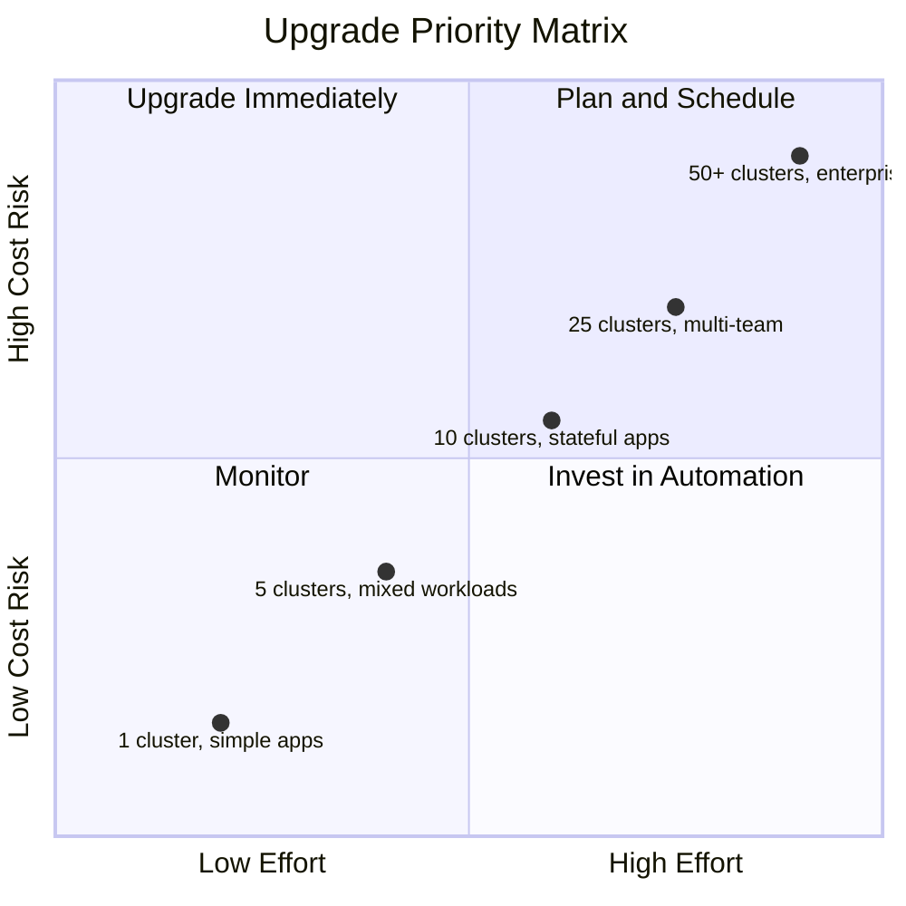
```mermaid
quadrantChart
    title Upgrade Priority Matrix
    x-axis Low Effort --> High Effort
    y-axis Low Cost Risk --> High Cost Risk
    quadrant-1 Plan and Schedule
    quadrant-2 Upgrade Immediately
    quadrant-3 Monitor
    quadrant-4 Invest in Automation
    "1 cluster, simple apps": [0.2, 0.15]
    "5 clusters, mixed workloads": [0.4, 0.35]
    "10 clusters, stateful apps": [0.6, 0.55]
    "25 clusters, multi-team": [0.75, 0.7]
    "50+ clusters, enterprise": [0.9, 0.9]
```

---

## 8. Planificación de actualización de versiones

### Estrategia de pruebas de feature gates

Antes de actualizar, prueba los nuevos feature gates en un entorno de staging para asegurar compatibilidad.

```yaml
# Step 1: Enable feature gates in staging
# For EKS managed node groups, use a custom launch template
apiVersion: eksctl.io/v1alpha5
kind: ClusterConfig
metadata:
  name: staging-cluster
  region: us-west-2
managedNodeGroups:
  - name: test-nodes
    instanceType: m6i.xlarge
    desiredCapacity: 3
    kubelet:
      featureGates:
        InPlacePodVerticalScaling: true
        UserNamespacesSupport: true
```

```bash
# Step 2: Verify feature gates are active
kubectl get --raw "/api/v1/nodes/$(kubectl get nodes -o jsonpath='{.items[0].metadata.name}')/proxy/configz" | \
  jq '.kubeletconfig.featureGates'

# Step 3: Run feature-specific tests
# Example: Test in-place pod resize
cat <<EOF | kubectl apply -f -
apiVersion: v1
kind: Pod
metadata:
  name: resize-test
spec:
  containers:
    - name: test
      image: nginx:latest
      resources:
        requests:
          cpu: 100m
          memory: 128Mi
        limits:
          cpu: 200m
          memory: 256Mi
      resizePolicy:
        - resourceName: cpu
          restartPolicy: NotRequired
        - resourceName: memory
          restartPolicy: NotRequired
EOF

# Attempt resize
kubectl patch pod resize-test --subresource resize --patch '{
  "spec": {"containers": [{"name": "test", "resources": {"requests": {"cpu": "200m"},"limits": {"cpu": "400m"}}}]}
}'

# Verify resize succeeded
kubectl get pod resize-test -o jsonpath='{.status.resize}'
kubectl get pod resize-test -o jsonpath='{.status.containerStatuses[0].allocatedResources}'
```

### Checklist previa a la actualización por salto de versión

Usa este framework de checklist al planificar cada actualización de versión. Completa los elementos específicos según tus versiones de origen y destino.

#### Checklist general previa a la actualización (todas las versiones)

```markdown
## Pre-Upgrade Checklist: v1.X -> v1.Y

### Phase 1: Assessment (1-2 weeks before)
- [ ] Review Kubernetes changelog for target version
- [ ] Review EKS release notes for target version
- [ ] Check deprecated API usage with `kubectl convert` or Pluto
- [ ] Verify add-on compatibility matrix
- [ ] Check third-party operator compatibility (cert-manager, Istio, ArgoCD, etc.)
- [ ] Review feature gate changes (new, graduated, removed)
- [ ] Test upgrade in staging/dev environment

### Phase 2: Preparation (1 week before)
- [ ] Back up etcd (EKS manages this, but verify backup schedule)
- [ ] Document current cluster state (versions, add-ons, node groups)
- [ ] Update IaC templates (Terraform, CDK, CloudFormation)
- [ ] Prepare rollback plan
- [ ] Schedule maintenance window
- [ ] Notify stakeholders

### Phase 3: Execution
- [ ] Upgrade control plane
- [ ] Verify API server health
- [ ] Upgrade managed add-ons (CoreDNS, kube-proxy, VPC CNI)
- [ ] Upgrade EBS CSI driver
- [ ] Upgrade node groups (rolling update)
- [ ] Verify node health and version
- [ ] Run smoke tests

### Phase 4: Validation
- [ ] Verify all workloads are running
- [ ] Check HPA/VPA functionality
- [ ] Validate ingress/networking
- [ ] Test service mesh (if applicable)
- [ ] Verify monitoring and alerting
- [ ] Check storage operations (PVC create, attach, resize)
- [ ] Run integration tests
```

#### Notas de actualización específicas por versión

**Actualizar a 1.33 (desde 1.32)**:
```markdown
Additional checks:
- [ ] Sidecar containers GA: Verify init containers with restartPolicy: Always work as expected
- [ ] In-Place Pod Resize beta: Test resize behavior with existing VPA configurations
- [ ] ServiceCIDR GA: If using custom Service CIDR, verify compatibility
- [ ] Topology Aware Routing GA: Review Service traffic distribution settings
```

**Actualizar a 1.34 (desde 1.33)**:
```markdown
Additional checks:
- [ ] DRA GA: If using device plugins, plan migration to DRA
- [ ] KYAML beta: Audit YAML manifests for anchor/alias usage
- [ ] VolumeAttributesClass GA: Test volume modification workflows
- [ ] Namespace deletion changes: Verify namespace cleanup procedures
- [ ] User Namespaces GA: Test workloads with hostUsers: false
```

**Actualizar a 1.35 (desde 1.34)**:
```markdown
Additional checks:
- [ ] In-Place Pod Resize GA: Full production use now safe
- [ ] KYAML enabled by default: Fix any YAML warnings before upgrade
- [ ] Gang Scheduling alpha: Not available on EKS (alpha)
- [ ] Remove deprecated feature gate overrides for 1.33 GA features
- [ ] Verify sidecar container feature gate is not explicitly set (removed in 1.35)
```

**Actualizar a 1.36 (desde 1.35)**:
```markdown
Additional checks:
- [ ] KYAML GA: All YAML must pass KYAML validation (strict enforcement)
- [ ] Gang Scheduling GA: Evaluate for distributed workloads
- [ ] Pod-level In-Place Scaling beta: Test pod-level resource limits
- [ ] Remove deprecated feature gate overrides for 1.34 GA features
```

### Verificación de compatibilidad de API

```bash
#!/bin/bash
# api-compat-check.sh - Verify API compatibility before upgrade

TARGET_VERSION=${1:-"1.36"}
echo "=== API Compatibility Check for Kubernetes $TARGET_VERSION ==="

# Tool 1: Use kubectl convert (if available)
echo ""
echo "--- Checking with kubectl convert ---"
# Install convert plugin if not present
# kubectl krew install convert

# Tool 2: Use Pluto for deprecated API detection
echo ""
echo "--- Checking with Pluto ---"
if command -v pluto &> /dev/null; then
  echo "Scanning cluster for deprecated APIs..."
  pluto detect-all-in-cluster --target-versions k8s=v${TARGET_VERSION}
  
  echo ""
  echo "Scanning Helm releases..."
  pluto detect-helm --target-versions k8s=v${TARGET_VERSION}
else
  echo "Pluto not installed. Install with:"
  echo "  brew install FairwindsOps/tap/pluto"
  echo "  or: kubectl krew install deprecations"
fi

# Tool 3: Check with kubent (kube-no-trouble)
echo ""
echo "--- Checking with kubent ---"
if command -v kubent &> /dev/null; then
  kubent --target-version ${TARGET_VERSION}
else
  echo "kubent not installed. Install from: https://github.com/doitintl/kube-no-trouble"
fi

# Manual checks
echo ""
echo "--- Manual API Version Checks ---"

# Check for v1beta1 usage
echo "Resources using v1beta1 APIs:"
kubectl api-resources -o wide 2>/dev/null | grep v1beta1

# Check CRDs for deprecated API versions
echo ""
echo "CRDs with deprecated conversion webhooks:"
kubectl get crds -o json | jq -r '.items[] | select(.spec.conversion.webhook != null) | .metadata.name'

echo ""
echo "=== Compatibility Check Complete ==="
```

### Alineación de versiones de add-ons

```bash
#!/bin/bash
# addon-alignment.sh - Verify add-on compatibility for target K8s version

CLUSTER_NAME=${1:-"my-cluster"}
TARGET_K8S_VERSION=${2:-"1.36"}

echo "=== Add-on Alignment Check ==="
echo "Cluster: $CLUSTER_NAME"
echo "Target K8s Version: $TARGET_K8S_VERSION"
echo ""

# Get current add-on versions
echo "--- Current Add-on Versions ---"
for addon in $(aws eks list-addons --cluster-name $CLUSTER_NAME --query 'addons[]' --output text); do
  current_version=$(aws eks describe-addon --cluster-name $CLUSTER_NAME --addon-name $addon \
    --query 'addon.addonVersion' --output text 2>/dev/null)
  echo "$addon: $current_version"
done

# Get compatible versions for target
echo ""
echo "--- Compatible Versions for K8s $TARGET_K8S_VERSION ---"
for addon in vpc-cni coredns kube-proxy aws-ebs-csi-driver; do
  echo ""
  echo "$addon:"
  aws eks describe-addon-versions \
    --addon-name $addon \
    --kubernetes-version $TARGET_K8S_VERSION \
    --query 'addons[].addonVersions[?compatibilities[?defaultVersion==`true`]].addonVersion' \
    --output text 2>/dev/null | head -5
  
  default_version=$(aws eks describe-addon-versions \
    --addon-name $addon \
    --kubernetes-version $TARGET_K8S_VERSION \
    --query 'addons[].addonVersions[?compatibilities[?defaultVersion==`true`]].addonVersion | [0]' \
    --output text 2>/dev/null)
  echo "  Default: $default_version"
done

echo ""
echo "=== Alignment Check Complete ==="
```

### Flujo de ejecución de actualización

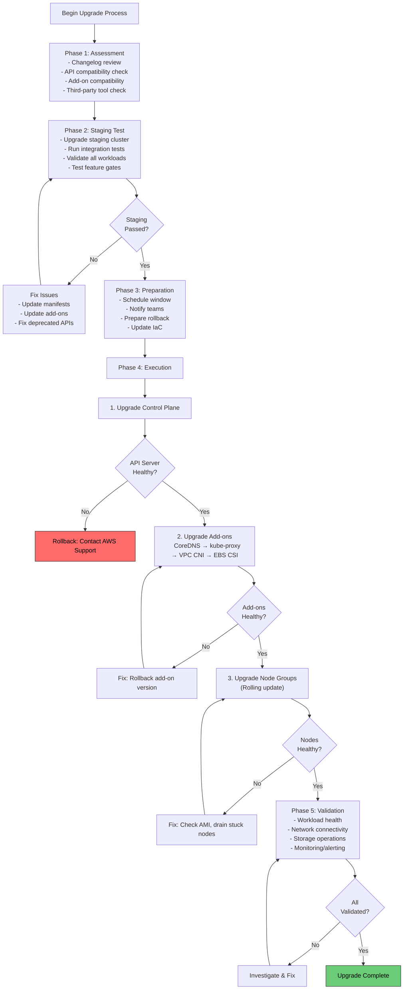
```mermaid
flowchart TD
    Start["Begin Upgrade Process"] --> Assess["Phase 1: Assessment
    - Changelog review
    - API compatibility check
    - Add-on compatibility
    - Third-party tool check"]
    
    Assess --> Staging["Phase 2: Staging Test
    - Upgrade staging cluster
    - Run integration tests
    - Validate all workloads
    - Test feature gates"]
    
    Staging --> StagePass{"Staging
    Passed?"}
    StagePass -->|No| Fix["Fix Issues
    - Update manifests
    - Update add-ons
    - Fix deprecated APIs"]
    Fix --> Staging
    
    StagePass -->|Yes| Prepare["Phase 3: Preparation
    - Schedule window
    - Notify teams
    - Prepare rollback
    - Update IaC"]
    
    Prepare --> Execute["Phase 4: Execution"]
    
    Execute --> CP["1. Upgrade Control Plane"]
    CP --> CPCheck{"API Server
    Healthy?"}
    CPCheck -->|No| CPRollback["Rollback: Contact AWS Support"]
    CPCheck -->|Yes| Addons["2. Upgrade Add-ons
    CoreDNS → kube-proxy → VPC CNI → EBS CSI"]
    
    Addons --> AddonCheck{"Add-ons
    Healthy?"}
    AddonCheck -->|No| AddonFix["Fix: Rollback add-on version"]
    AddonFix --> Addons
    AddonCheck -->|Yes| Nodes["3. Upgrade Node Groups
    (Rolling update)"]
    
    Nodes --> NodeCheck{"Nodes
    Healthy?"}
    NodeCheck -->|No| NodeFix["Fix: Check AMI, drain stuck nodes"]
    NodeFix --> Nodes
    NodeCheck -->|Yes| Validate["Phase 5: Validation
    - Workload health
    - Network connectivity
    - Storage operations
    - Monitoring/alerting"]
    
    Validate --> Pass{"All
    Validated?"}
    Pass -->|No| Investigate["Investigate & Fix"]
    Investigate --> Validate
    Pass -->|Yes| Complete["Upgrade Complete"]

    style Complete fill:#6bcb77,stroke:#333,color:black
    style CPRollback fill:#ff6b6b,stroke:#333,color:black
```

### Estrategia de rollback

> **Actualización (2026-07-01)**: Amazon EKS anunció soporte de rollback de versiones de Kubernetes. Dentro de los 7 días posteriores a una actualización, puedes revertir el control plane a la versión menor anterior. Primero se ejecuta una comprobación automatizada Rollback Readiness, que cubre compatibilidad de API, version skew, compatibilidad de add-ons y salud del cluster. Los clusters EKS Auto Mode hacen rollback automáticamente -- los worker nodes revierten por sí mismos y el control plane se restaura en secuencia. No hay cargo adicional y está disponible en todas las regiones. La estrategia siguiente es el fallback para casos en los que hayan pasado más de 7 días o esta característica no esté disponible. (Fuente: [Amazon EKS announces Kubernetes version rollback](https://aws.amazon.com/about-aws/whats-new/2026/07/amazon-eks-version-rollback))

```yaml
# Upgrade rollback strategy
rollback_strategy:

  control_plane:
    note: "Within 7 days: use EKS native version rollback / Beyond 7 days: blue-green cluster strategy"
    mitigation:
      - "Use EKS version rollback to restore the previous minor version immediately (within 7 days, no additional cost)"
      - "Beyond 7 days, fall back to a blue/green cluster strategy established before the upgrade"
      - "Shift traffic via Route 53 weighted routing"
      - "Migrate workloads to the new cluster"

  node_groups:
    strategy: "Create new node group + retain previous node group"
    steps:
      - "Do not immediately delete the previous version's node group"
      - "If issues arise, remove the taint from the previous node group"
      - "Add a taint to the new node group to shift traffic"

  workloads:
    strategy: "GitOps-based rollback"
    steps:
      - "Roll back to the previous commit in ArgoCD/Flux"
      - "Run a Helm rollback"

  addons:
    strategy: "Downgrade to the previous version"
    command: |
      aws eks update-addon \
        --cluster-name my-cluster \
        --addon-name vpc-cni \
        --addon-version <previous-version> \
        --resolve-conflicts OVERWRITE
```

---

## 9. Perspectiva futura

### Características en desarrollo activo

La comunidad de Kubernetes continúa expandiendo los límites de la orquestación de containers. Estas son características y tendencias clave en desarrollo activo que podrían aparecer en próximos lanzamientos.

#### Corto plazo (esperado 1.37 - 1.38)

| Característica | Estado actual | Cronograma esperado | Impacto |
|---------|--------------|-------------------|--------|
| **Pod-Level In-Place Scaling GA** | Beta (1.36) | 1.37 | Gestión agregada de recursos del pod |
| **Mejoras de MutatingAdmissionPolicy** | GA (1.36) | En curso | Patrones de mutación CEL más ricos |
| **Particionado DRA mejorado** | Beta (1.36) | 1.37 | Compartición de GPU con granularidad fina |
| **Mejoras de Scheduler** | Varias | En curso | Mejor bin-packing, gestión de colas |

#### Tendencias a medio plazo

**Optimización de workloads AI/ML**

Kubernetes evoluciona rápidamente para soportar mejor workloads AI/ML:

- **Crecimiento del ecosistema DRA**: Más device drivers para hardware especializado (TPUs, ASICs personalizados)
- **Madurez de gang scheduling**: Mejor soporte para entrenamiento distribuido con requisitos estrictos de co-programación
- **GPU time-slicing y MIG**: Soporte nativo de Kubernetes para particionado de GPU
- **Scheduling consciente de red**: Considera la topología de red para ubicación de entrenamiento distribuido

**Hardening de seguridad**

- **Integración con Sigstore**: Seguridad nativa de supply chain para imágenes de container
- **Madurez de Policy as Code**: Admission basado en CEL que cubre escenarios más complejos
- **Confidential containers**: Aislamiento de containers basado en TEE
- **Logging de auditoría mejorado**: Eventos de auditoría estructurados y consultables

**Experiencia de desarrollador**

- **Ecosistema KYAML**: Mejoras de tooling para el subconjunto YAML más seguro
- **Experiencia CRD mejorada**: Mejor validación, defaulting y conversión
- **kubectl mejorado**: Opciones más potentes de consulta, filtrado y formato

### Tendencias del ecosistema CNCF

| Tendencia | Proyectos clave | Impacto en Kubernetes |
|-------|-------------|-------------------|
| **Platform Engineering** | Backstage, Crossplane, KRO | Kubernetes como plataforma para crear plataformas |
| **Networking eBPF** | Cilium, Calico eBPF | Reemplazar iptables/nftables por completo |
| **Evolución de Service Mesh** | Istio Ambient, Cilium SM | Arquitecturas mesh sin sidecar |
| **Madurez de GitOps** | ArgoCD, FluxCD | Operaciones declarativas como predeterminado |
| **Observability** | OpenTelemetry | Estándar unificado de recolección de telemetría |
| **WebAssembly (Wasm)** | SpinKube, wasmCloud | Ejecución de workloads más liviana |
| **Infraestructura AI** | KubeAI, vLLM operator | Serving de AI nativo de Kubernetes |

### Planificar para el futuro

Para equipos que planifican su estrategia de Kubernetes:

1. **Mantente dentro de n-1 de la última versión**: Apunta a ejecutar no más de una versión detrás del último lanzamiento de EKS
2. **Actualiza trimestralmente**: Alinéate con la cadencia de lanzamientos de Kubernetes (cada 4 meses)
3. **Prueba temprano**: Usa clusters de staging para validar nuevas versiones dentro de semanas de su disponibilidad en EKS
4. **Automatiza actualizaciones**: Invierte en pipelines CI/CD que incluyan pruebas de actualización de clusters
5. **Monitorea deprecaciones**: Suscríbete a anuncios de lanzamientos de Kubernetes y revisa changelogs de forma proactiva
6. **Adopta características GA con prontitud**: Las características que alcanzan GA están listas para producción y quedarán habilitadas permanentemente

---

## 10. Referencias

### Recursos oficiales de Kubernetes

- [Kubernetes Release Page](https://kubernetes.io/releases/)
- [Kubernetes Changelog (GitHub)](https://github.com/kubernetes/kubernetes/blob/master/CHANGELOG/)
- [Kubernetes Feature Gates Reference](https://kubernetes.io/docs/reference/command-line-tools-reference/feature-gates/)
- [Kubernetes Enhancement Proposals (KEPs)](https://github.com/kubernetes/enhancements)
- [KEP Tracking Board](https://www.kubernetes.dev/resources/keps/)
- [Kubernetes Deprecation Policy](https://kubernetes.io/docs/reference/using-api/deprecation-policy/)
- [API Migration Guide](https://kubernetes.io/docs/reference/using-api/deprecation-guide/)
- [Kubernetes Blog - Release Announcements](https://kubernetes.io/blog/)
- [SIG Release](https://github.com/kubernetes/sig-release)

### Recursos de Amazon EKS

- [EKS Kubernetes Versions](https://docs.aws.amazon.com/eks/latest/userguide/kubernetes-versions.html)
- [EKS Release Calendar](https://docs.aws.amazon.com/eks/latest/userguide/kubernetes-versions.html#kubernetes-release-calendar)
- [EKS Extended Support](https://docs.aws.amazon.com/eks/latest/userguide/extended-support-control.html)
- [EKS Add-on Versions](https://docs.aws.amazon.com/eks/latest/userguide/managing-add-ons.html)
- [EKS Auto Mode](https://docs.aws.amazon.com/eks/latest/userguide/automode.html)
- [EKS Best Practices Guide](https://aws.github.io/aws-eks-best-practices/)
- [EKS Upgrade Guide](https://docs.aws.amazon.com/eks/latest/userguide/update-cluster.html)

### Herramientas para planificación de actualizaciones

- [Pluto - Deprecated API Detector](https://github.com/FairwindsOps/pluto)
- [kubent (kube-no-trouble)](https://github.com/doitintl/kube-no-trouble)
- [kubectl-convert Plugin](https://kubernetes.io/docs/tasks/tools/install-kubectl-linux/#install-kubectl-convert-plugin)
- [Nova - Helm Chart Version Checker](https://github.com/FairwindsOps/nova)
- [eksctl](https://eksctl.io/)

### Recursos de la comunidad

- [Kubernetes Slack](https://kubernetes.slack.com) - canales #sig-release, #eks
- [CNCF Calendar](https://www.cncf.io/calendar/) - KubeCon y eventos de la comunidad
- [The Kubernetes Podcast](https://kubernetespodcast.com/)
- [Release Team Shadows Program](https://github.com/kubernetes/sig-release/blob/master/release-team/shadows.md)

## Quiz

Para comprobar lo que aprendiste en este documento, intenta el [Kubernetes Version Features and Roadmap Quiz](../quizzes/eks/12-kubernetes-version-roadmap-quiz.md).

---

< [Anterior: EKS Advanced Debugging](./11-eks-advanced-debugging.md) | [Tabla de contenido](./README.md) >
