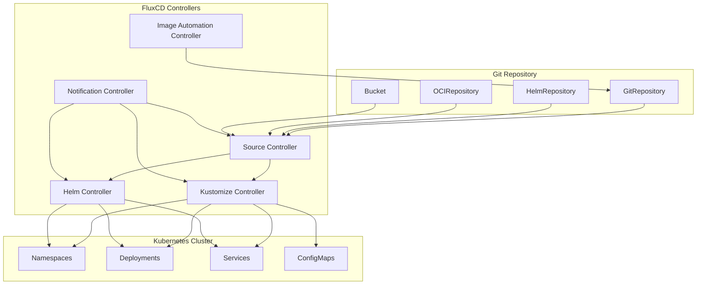

# FluxCD

> **Versiones compatibles**: FluxCD v2.2+
> **Última actualización**: February 22, 2026

FluxCD es un conjunto de soluciones de entrega continua y progresiva para Kubernetes que son abiertas y extensibles. FluxCD se graduó de la CNCF en noviembre de 2022, lo que lo convierte en una de las herramientas GitOps más maduras del ecosistema cloud-native.

## Introducción

FluxCD implementa los principios de GitOps utilizando repositorios Git como fuente de verdad para definir el estado deseado de tus clústeres de Kubernetes. Garantiza automáticamente que el estado de tus clústeres coincida con la configuración en Git.

### Características principales

- **GitOps Native**: Creado desde cero para flujos de trabajo GitOps
- **Multi-tenancy**: Admite múltiples equipos con configuraciones aisladas
- **Multi-cluster**: Gestiona múltiples clústeres desde un único repositorio Git
- **Extensible**: Arquitectura modular con controladores especializados
- **Kubernetes Native**: Utiliza Custom Resource Definitions (CRDs) para la configuración

## Descripción general de la arquitectura

FluxCD consta de un conjunto de controladores especializados que trabajan juntos para implementar flujos de trabajo GitOps:



## Componentes principales

### Source Controller

Source Controller es responsable de obtener artefactos de fuentes externas. Admite varios tipos de fuentes:

#### GitRepository

Rastrea un repositorio Git y lo pone a disposición de otros controladores:

```yaml
apiVersion: source.toolkit.fluxcd.io/v1
kind: GitRepository
metadata:
  name: my-app
  namespace: flux-system
spec:
  interval: 1m
  url: https://github.com/my-org/my-app
  ref:
    branch: main
  secretRef:
    name: git-credentials
```

#### HelmRepository

Rastrea un repositorio de charts Helm:

```yaml
apiVersion: source.toolkit.fluxcd.io/v1
kind: HelmRepository
metadata:
  name: bitnami
  namespace: flux-system
spec:
  interval: 1h
  url: https://charts.bitnami.com/bitnami
```

#### OCIRepository

Rastrea artefactos almacenados en registros compatibles con OCI (incluidos los registros de contenedores):

```yaml
apiVersion: source.toolkit.fluxcd.io/v1beta2
kind: OCIRepository
metadata:
  name: my-artifacts
  namespace: flux-system
spec:
  interval: 5m
  url: oci://ghcr.io/my-org/my-artifacts
  ref:
    tag: latest
```

#### Bucket

Rastrea artefactos almacenados en almacenamiento compatible con S3:

```yaml
apiVersion: source.toolkit.fluxcd.io/v1beta2
kind: Bucket
metadata:
  name: my-bucket
  namespace: flux-system
spec:
  interval: 5m
  provider: aws
  bucketName: my-flux-bucket
  endpoint: s3.amazonaws.com
  region: us-east-1
  secretRef:
    name: aws-credentials
```

### Kustomize Controller

Kustomize Controller aplica overlays de Kustomize y manifiestos de Kubernetes sin modificar procedentes de las fuentes.

#### Kustomization CRD

```yaml
apiVersion: kustomize.toolkit.fluxcd.io/v1
kind: Kustomization
metadata:
  name: my-app
  namespace: flux-system
spec:
  interval: 10m
  targetNamespace: production
  sourceRef:
    kind: GitRepository
    name: my-app
  path: ./deploy/production
  prune: true
  healthChecks:
    - apiVersion: apps/v1
      kind: Deployment
      name: my-app
      namespace: production
  timeout: 2m
```

#### Sustitución de variables

FluxCD admite la sustitución de variables mediante `postBuild`:

```yaml
apiVersion: kustomize.toolkit.fluxcd.io/v1
kind: Kustomization
metadata:
  name: my-app
  namespace: flux-system
spec:
  interval: 10m
  sourceRef:
    kind: GitRepository
    name: my-app
  path: ./deploy
  postBuild:
    substitute:
      ENVIRONMENT: production
      REPLICAS: "3"
    substituteFrom:
      - kind: ConfigMap
        name: cluster-config
      - kind: Secret
        name: cluster-secrets
```

#### Comprobaciones de estado

Define comprobaciones de estado personalizadas para los recursos desplegados:

```yaml
spec:
  healthChecks:
    - apiVersion: apps/v1
      kind: Deployment
      name: frontend
      namespace: production
    - apiVersion: apps/v1
      kind: StatefulSet
      name: database
      namespace: production
  timeout: 5m
```

### Helm Controller

Helm Controller gestiona lanzamientos de charts Helm de forma declarativa.

#### HelmRelease CRD

```yaml
apiVersion: helm.toolkit.fluxcd.io/v2
kind: HelmRelease
metadata:
  name: nginx
  namespace: flux-system
spec:
  interval: 5m
  chart:
    spec:
      chart: nginx
      version: ">=15.0.0"
      sourceRef:
        kind: HelmRepository
        name: bitnami
        namespace: flux-system
  targetNamespace: web
  install:
    createNamespace: true
    remediation:
      retries: 3
  upgrade:
    remediation:
      retries: 3
  values:
    replicaCount: 2
    service:
      type: LoadBalancer
```

#### Anulaciones de valores

Anula valores de Helm desde múltiples fuentes:

```yaml
spec:
  valuesFrom:
    - kind: ConfigMap
      name: nginx-values
      valuesKey: values.yaml
    - kind: Secret
      name: nginx-secrets
      valuesKey: credentials.yaml
  values:
    replicaCount: 3
```

#### Detección de deriva

Habilita la detección de deriva para garantizar que los recursos desplegados coincidan con el estado deseado:

```yaml
spec:
  driftDetection:
    mode: enabled
    ignore:
      - paths: ["/spec/replicas"]
        target:
          kind: Deployment
```

### Notification Controller

Notification Controller maneja eventos entrantes y salientes.

#### Proveedores

Configura proveedores de notificaciones para las alertas:

```yaml
apiVersion: notification.toolkit.fluxcd.io/v1beta3
kind: Provider
metadata:
  name: slack
  namespace: flux-system
spec:
  type: slack
  channel: flux-alerts
  secretRef:
    name: slack-webhook
```

Los proveedores admitidos incluyen:
- Slack
- Microsoft Teams
- Discord
- PagerDuty
- Opsgenie
- GitHub
- GitLab
- Grafana
- Generic webhooks

#### Alertas

Define alertas para eventos de FluxCD:

```yaml
apiVersion: notification.toolkit.fluxcd.io/v1beta3
kind: Alert
metadata:
  name: on-call
  namespace: flux-system
spec:
  summary: "Cluster alerts"
  providerRef:
    name: slack
  eventSeverity: error
  eventSources:
    - kind: GitRepository
      name: '*'
    - kind: Kustomization
      name: '*'
    - kind: HelmRelease
      name: '*'
```

#### Receivers (Webhooks)

Configura webhooks para eventos externos:

```yaml
apiVersion: notification.toolkit.fluxcd.io/v1
kind: Receiver
metadata:
  name: github-receiver
  namespace: flux-system
spec:
  type: github
  events:
    - ping
    - push
  secretRef:
    name: github-webhook-token
  resources:
    - kind: GitRepository
      name: my-app
```

### Automatización de imágenes

FluxCD puede actualizar automáticamente etiquetas de imágenes de contenedor en repositorios Git.

#### ImageRepository

Examina registros de contenedores en busca de etiquetas nuevas:

```yaml
apiVersion: image.toolkit.fluxcd.io/v1beta2
kind: ImageRepository
metadata:
  name: my-app
  namespace: flux-system
spec:
  image: ghcr.io/my-org/my-app
  interval: 1m
  secretRef:
    name: registry-credentials
```

#### ImagePolicy

Define políticas para seleccionar etiquetas de imágenes:

```yaml
apiVersion: image.toolkit.fluxcd.io/v1beta2
kind: ImagePolicy
metadata:
  name: my-app
  namespace: flux-system
spec:
  imageRepositoryRef:
    name: my-app
  policy:
    semver:
      range: ">=1.0.0"
```

#### ImageUpdateAutomation

Automatiza commits de Git cuando se detectan imágenes nuevas:

```yaml
apiVersion: image.toolkit.fluxcd.io/v1beta2
kind: ImageUpdateAutomation
metadata:
  name: my-app
  namespace: flux-system
spec:
  interval: 30m
  sourceRef:
    kind: GitRepository
    name: my-app
  git:
    checkout:
      ref:
        branch: main
    commit:
      author:
        email: flux@my-org.com
        name: Flux
      messageTemplate: |
        Automated image update

        Automation: {{ .AutomationObject }}

        Files:
        {{ range $filename, $_ := .Changed.FileChanges -}}
        - {{ $filename }}
        {{ end -}}

        Objects:
        {{ range $resource, $changes := .Changed.Objects -}}
        - {{ $resource.Kind }} {{ $resource.Name }}
          {{- range $_, $change := $changes }}
          {{ $change.OldValue }} -> {{ $change.NewValue }}
          {{- end }}
        {{ end -}}
    push:
      branch: main
  update:
    path: ./deploy
    strategy: Setters
```

## Instalación

### Uso de Flux CLI

Instala Flux CLI:

```bash
# macOS
brew install fluxcd/tap/flux

# Linux
curl -s https://fluxcd.io/install.sh | sudo bash

# Windows (Chocolatey)
choco install flux
```

### Bootstrap

Inicializa FluxCD en tu clúster:

```bash
# Bootstrap with GitHub
flux bootstrap github \
  --owner=my-org \
  --repository=fleet-infra \
  --branch=main \
  --path=clusters/production \
  --personal

# Bootstrap with GitLab
flux bootstrap gitlab \
  --owner=my-org \
  --repository=fleet-infra \
  --branch=main \
  --path=clusters/production
```

### Verificar la instalación

```bash
# Check Flux components
flux check

# Get all Flux resources
flux get all

# Watch for changes
flux get kustomizations --watch
```

## Múltiples clústeres con Flux

FluxCD admite la gestión de múltiples clústeres desde un único repositorio.

### Estructura del repositorio de flota

```
fleet-infra/
├── clusters/
│   ├── production/
│   │   ├── flux-system/
│   │   │   └── gotk-sync.yaml
│   │   └── apps.yaml
│   ├── staging/
│   │   ├── flux-system/
│   │   │   └── gotk-sync.yaml
│   │   └── apps.yaml
│   └── development/
│       ├── flux-system/
│       │   └── gotk-sync.yaml
│       └── apps.yaml
├── infrastructure/
│   ├── base/
│   │   ├── cert-manager/
│   │   ├── ingress-nginx/
│   │   └── monitoring/
│   └── overlays/
│       ├── production/
│       └── staging/
└── apps/
    ├── base/
    │   ├── frontend/
    │   └── backend/
    └── overlays/
        ├── production/
        └── staging/
```

### Dependencias entre clústeres

```yaml
apiVersion: kustomize.toolkit.fluxcd.io/v1
kind: Kustomization
metadata:
  name: infrastructure
  namespace: flux-system
spec:
  interval: 1h
  sourceRef:
    kind: GitRepository
    name: fleet-infra
  path: ./infrastructure/overlays/production
  prune: true
---
apiVersion: kustomize.toolkit.fluxcd.io/v1
kind: Kustomization
metadata:
  name: apps
  namespace: flux-system
spec:
  dependsOn:
    - name: infrastructure
  interval: 10m
  sourceRef:
    kind: GitRepository
    name: fleet-infra
  path: ./apps/overlays/production
  prune: true
```

## FluxCD en Amazon EKS

### Integración de IRSA

Configura IAM Roles for Service Accounts (IRSA) para FluxCD:

```yaml
apiVersion: v1
kind: ServiceAccount
metadata:
  name: source-controller
  namespace: flux-system
  annotations:
    eks.amazonaws.com/role-arn: arn:aws:iam::ACCOUNT_ID:role/flux-source-controller
```

Política IAM para el acceso a ECR:

```json
{
  "Version": "2012-10-17",
  "Statement": [
    {
      "Effect": "Allow",
      "Action": [
        "ecr:GetAuthorizationToken",
        "ecr:BatchCheckLayerAvailability",
        "ecr:GetDownloadUrlForLayer",
        "ecr:BatchGetImage"
      ],
      "Resource": "*"
    }
  ]
}
```

### Integración de ECR

Configura FluxCD para extraer imágenes de Amazon ECR:

```yaml
apiVersion: source.toolkit.fluxcd.io/v1beta2
kind: OCIRepository
metadata:
  name: my-app
  namespace: flux-system
spec:
  interval: 5m
  url: oci://ACCOUNT_ID.dkr.ecr.us-east-1.amazonaws.com/my-app
  ref:
    tag: latest
  provider: aws
```

### Fuente de Bucket S3

Utiliza S3 como fuente de artefactos:

```yaml
apiVersion: source.toolkit.fluxcd.io/v1beta2
kind: Bucket
metadata:
  name: artifacts
  namespace: flux-system
spec:
  interval: 5m
  provider: aws
  bucketName: my-flux-artifacts
  endpoint: s3.us-east-1.amazonaws.com
  region: us-east-1
```

### Integración de CodeCommit

Inicializa FluxCD con AWS CodeCommit:

```bash
flux bootstrap git \
  --url=ssh://git-codecommit.us-east-1.amazonaws.com/v1/repos/fleet-infra \
  --branch=main \
  --path=clusters/production \
  --ssh-key-algorithm=rsa \
  --ssh-rsa-bits=4096
```

## Prácticas recomendadas

### Estructura del repositorio

- Usa un monorepo para equipos pequeños
- Usa repositorios separados para infraestructura y aplicaciones en organizaciones grandes
- Implementa overlays específicos por entorno con Kustomize

### Seguridad

- Usa secrets sellados u operadores de secrets externos
- Implementa RBAC para escenarios multi-tenant
- Habilita la validación de webhooks para los receivers

### Monitorización

- Configura alertas para fallos de reconciliación
- Exporta métricas a Prometheus
- Configura paneles para los componentes de Flux

### Rendimiento

- Ajusta los intervalos de reconciliación según la frecuencia de los cambios
- Usa almacenamiento en caché para repositorios Helm
- Implementa comprobaciones de estado con timeouts adecuados

## Cuestionario

Para comprobar lo que has aprendido, prueba el [cuestionario de FluxCD](../quizzes/gitops/02-fluxcd-quiz.md).
