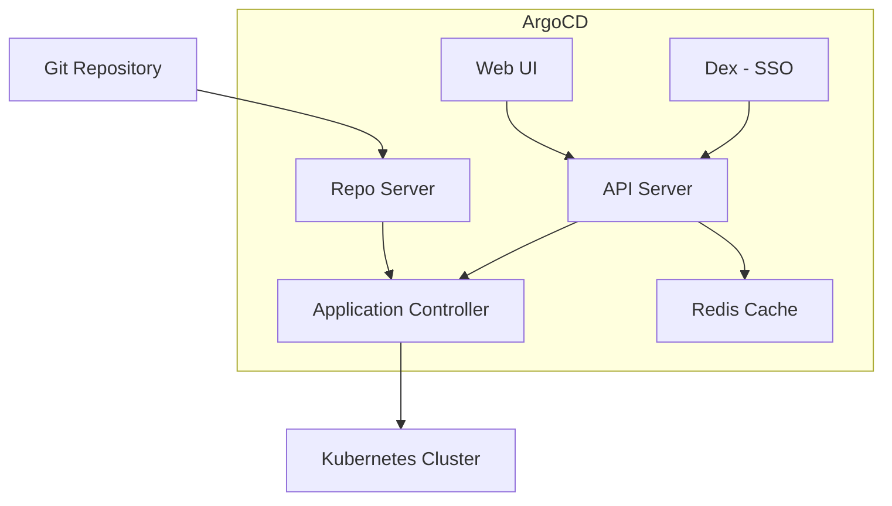
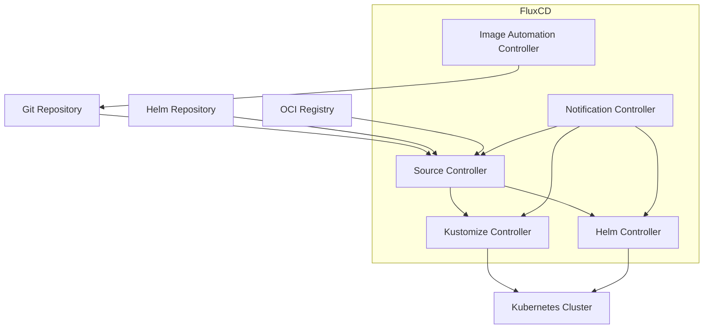

# Comparación de herramientas GitOps

> **Última actualización**: February 22, 2026

Esta guía ofrece una comparación exhaustiva de las herramientas GitOps, con especial atención a ArgoCD y FluxCD, las dos opciones más populares en el ecosistema de Kubernetes.

## Descripción general

GitOps es un marco operativo que adopta las mejores prácticas de DevOps utilizadas para el desarrollo de aplicaciones y las aplica a la automatización de la infraestructura. Las dos herramientas GitOps líderes en el ecosistema CNCF son:

- **ArgoCD**: Una herramienta de entrega continua declarativa basada en GitOps para Kubernetes
- **FluxCD**: Un conjunto de soluciones de entrega continua y progresiva para Kubernetes

Ambos son proyectos graduados de CNCF, lo que indica madurez y una amplia adopción.

## ArgoCD vs FluxCD: comparación directa

### Filosofía y diseño

| Aspecto | ArgoCD | FluxCD |
|--------|--------|--------|
| **Arquitectura** | Aplicación monolítica con UI | Kit de herramientas modular de controllers |
| **Configuración** | CRDs centrados en aplicaciones | CRDs centrados en fuentes |
| **Interfaz de usuario** | Web UI completa incluida | Prioridad para CLI, sin UI integrada |
| **Curva de aprendizaje** | Más accesible para principiantes | Más pronunciada, más flexible |
| **Modelo de despliegue** | GitOps basado en pull | GitOps basado en pull |

### Comparación de funcionalidades

| Funcionalidad | ArgoCD | FluxCD |
|---------|--------|--------|
| **Web UI** | Integrada y con muchas funcionalidades | No incluida (use Weave GitOps) |
| **CLI** | CLI `argocd` | CLI `flux` |
| **Multi-tenancy** | Projects con RBAC | Aislamiento de Namespace |
| **Multi-cluster** | Compatibilidad nativa | Compatibilidad nativa |
| **Compatibilidad con Helm** | Compatibilidad completa | Compatibilidad completa mediante Helm Controller |
| **Compatibilidad con Kustomize** | Compatibilidad completa | Compatibilidad completa mediante Kustomize Controller |
| **Compatibilidad con OCI** | Solo Helm charts | Compatibilidad completa con artefactos OCI |
| **Notificaciones** | Sistema de notificaciones integrado | Notification Controller |
| **RBAC** | RBAC exhaustivo | RBAC nativo de Kubernetes |
| **Integración de SSO** | OIDC, SAML, LDAP | Autenticación de Kubernetes |
| **Comprobaciones de estado** | Estado de recursos integrado | Comprobaciones de estado personalizadas |
| **Entrega progresiva** | Mediante Argo Rollouts | Mediante Flagger |
| **Automatización de imágenes** | Mediante Argo Image Updater | Image Automation integrada |
| **Vista previa de diferencias** | Diferencias visuales en la UI | Diferencias mediante CLI |
| **Sync Waves** | Compatibilidad nativa | Mediante dependencias |
| **Hooks** | PreSync, Sync, PostSync | No nativos (use Jobs) |

### Comparación de arquitectura

#### Arquitectura de ArgoCD



#### Arquitectura de FluxCD



### Comunidad y ecosistema

| Métrica | ArgoCD | FluxCD |
|--------|--------|--------|
| **Estrellas de GitHub** | ~17,000+ | ~6,500+ |
| **Estado en CNCF** | Graduado (Dec 2022) | Graduado (Nov 2022) |
| **Primera versión** | 2018 | 2016 (v1), 2020 (v2) |
| **Mantenedor principal** | Intuit, Red Hat | Weaveworks, CNCF |
| **Herramientas del ecosistema** | Argo Workflows, Rollouts, Events | Flagger, Weave GitOps |

## Cuándo elegir ArgoCD

ArgoCD es ideal cuando necesita:

### Casos de uso

1. **Gestión visual**: Equipos que prefieren una interfaz gráfica para gestionar despliegues
2. **Control centralizado**: Organizaciones que desean una vista unificada para múltiples clusters
3. **RBAC exhaustivo**: Requisitos complejos de control de acceso entre equipos
4. **Integración de SSO**: Entornos empresariales que requieren autenticación OIDC/SAML
5. **Sync Waves y Hooks**: Orquestación compleja de despliegues con requisitos de ordenamiento

### Ventajas

- **Web UI completa**: Interfaz visual intuitiva para la gestión de despliegues
- **Centrado en aplicaciones**: Correspondencia natural con la forma en que los desarrolladores conciben los despliegues
- **Ecosistema maduro**: Integración estrecha con Argo Workflows, Rollouts y Events
- **Funciones empresariales**: SSO, RBAC y registro de auditoría listos para usar
- **Depuración sencilla**: Diferencias visuales y estado de sincronización en la UI

### Escenario de ejemplo

```
Scenario: Enterprise with 50+ microservices
- Multiple teams need self-service deployments
- Security team requires audit logs and RBAC
- Developers want visual feedback on sync status
- Need SSO integration with corporate identity provider

Recommendation: ArgoCD
- Projects per team with role-based access
- Application Sets for template-driven deployments
- Web UI for developer self-service
- Dex integration for SSO
```

## Cuándo elegir FluxCD

FluxCD es ideal cuando necesita:

### Casos de uso

1. **Arquitectura modular**: Elija solo los controllers que necesita
2. **Flujos de trabajo con prioridad para CLI**: Flujos de trabajo GitOps nativos sin dependencia de UI
3. **Automatización de imágenes**: Actualizaciones automáticas de imágenes de contenedor en Git
4. **Artefactos OCI**: Almacene y despliegue desde registros OCI
5. **Huella ligera**: Consumo mínimo de recursos

### Ventajas

- **Diseño modular**: Use solo lo que necesita
- **Automatización nativa de imágenes**: Actualizaciones de imágenes de contenedor integradas
- **Compatibilidad con OCI**: Compatibilidad de primera clase con artefactos OCI
- **Nativo de Kubernetes**: Usa RBAC estándar de Kubernetes
- **Menor uso de recursos**: Menor consumo de memoria y CPU

### Escenario de ejemplo

```
Scenario: Platform team building internal developer platform
- Need automated image updates when CI builds new versions
- Want to store deployment artifacts in container registry
- Prefer CLI-driven GitOps workflows
- Multiple clusters with different configurations

Recommendation: FluxCD
- Image automation for continuous deployment
- OCI repositories for artifact storage
- Kustomize overlays for environment differences
- Multi-cluster management with fleet repo
```

## ¿Pueden trabajar juntos?

Sí, ArgoCD y FluxCD se pueden usar juntos en patrones complementarios:

### Patrón 1: FluxCD para infraestructura, ArgoCD para aplicaciones

```
Git Repository
├── infrastructure/     # Managed by FluxCD
│   ├── cert-manager/
│   ├── ingress-nginx/
│   └── monitoring/
└── applications/       # Managed by ArgoCD
    ├── app-a/
    ├── app-b/
    └── app-c/
```

- FluxCD gestiona la infraestructura del cluster (operators, controllers)
- ArgoCD gestiona los despliegues de aplicaciones con UI para desarrolladores

### Patrón 2: Automatización de imágenes de FluxCD con despliegue de ArgoCD

```
1. CI builds new image → pushes to registry
2. FluxCD Image Automation detects new tag
3. FluxCD commits updated manifest to Git
4. ArgoCD syncs the change to cluster
```

### Patrón 3: Clusters diferentes, herramientas diferentes

- Clusters de producción: ArgoCD (para requisitos de UI y auditoría)
- Clusters de desarrollo: FluxCD (para iteración rápida)

## Consideraciones de migración

### De FluxCD a ArgoCD

1. Exporte las Kustomizations de FluxCD como Applications de ArgoCD
2. Asigne las fuentes de FluxCD a repositorios de ArgoCD
3. Convierta HelmReleases en Helm Applications de ArgoCD
4. Configure RBAC y SSO en ArgoCD

### De ArgoCD a FluxCD

1. Convierta las Applications de ArgoCD en Kustomizations/HelmReleases
2. Configure Source Controller con repositorios Git/Helm
3. Configure Notification Controller para alertas
4. Implemente Image Automation si es necesario

## Otras herramientas GitOps

Aunque ArgoCD y FluxCD dominan el panorama de GitOps, existen otras herramientas:

### Jenkins X

- Se centra en la automatización de pipelines de CI/CD
- Entornos de vista previa integrados
- Pipelines basados en Tekton
- Ideal para: Equipos que quieren CI/CD integrado con GitOps

### Rancher Fleet

- Diseñado para gestionar miles de clusters
- GitOps a escala
- Integrado con Rancher
- Ideal para: Despliegues edge a gran escala

### Weave GitOps

- Producto comercial basado en FluxCD
- Añade UI y funciones empresariales a Flux
- Ideal para: Usuarios de FluxCD que desean una UI

## Matriz de decisión

| Requisito | Mejor opción |
|-------------|-------------|
| Necesita una Web UI | ArgoCD |
| Flujo de trabajo con prioridad para CLI | FluxCD |
| Automatización de imágenes | FluxCD |
| RBAC complejo | ArgoCD |
| Integración de SSO | ArgoCD |
| Recursos mínimos | FluxCD |
| Artefactos OCI | FluxCD |
| Sync waves/hooks | ArgoCD |
| Diferencias visuales | ArgoCD |
| Despliegue modular | FluxCD |
| Auditoría empresarial | ArgoCD |
| Multi-cluster a escala | Ambos |

## Conclusión

Tanto ArgoCD como FluxCD son opciones excelentes para implementar GitOps. La decisión suele reducirse a lo siguiente:

- **Elija ArgoCD** si valora una UI completa, funciones empresariales y una gestión centrada en aplicaciones
- **Elija FluxCD** si prefiere modularidad, flujos de trabajo con CLI y automatización de imágenes integrada

Muchas organizaciones utilizan con éxito ambas herramientas para fines diferentes, aprovechando las fortalezas de cada herramienta donde más importan.

## Cuestionario

Para comprobar lo que ha aprendido, pruebe el [cuestionario de comparación de herramientas GitOps](../quizzes/gitops/03-gitops-comparison-quiz.md).
