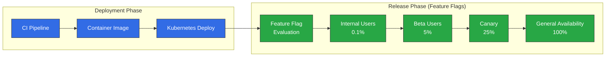
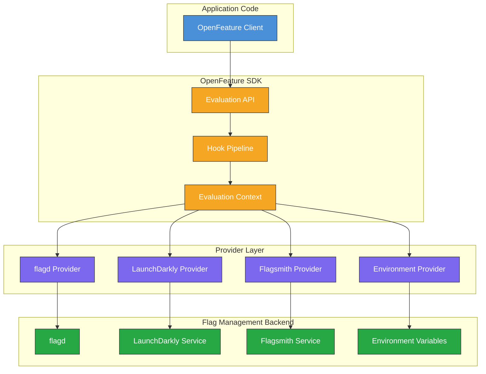
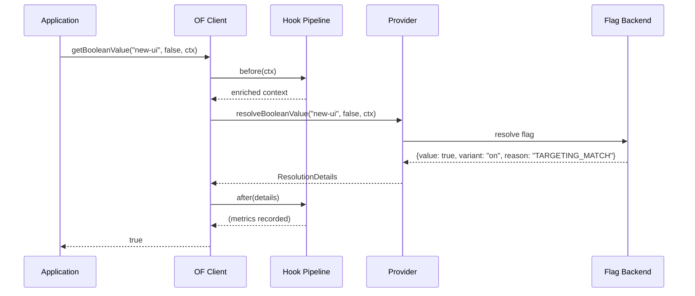
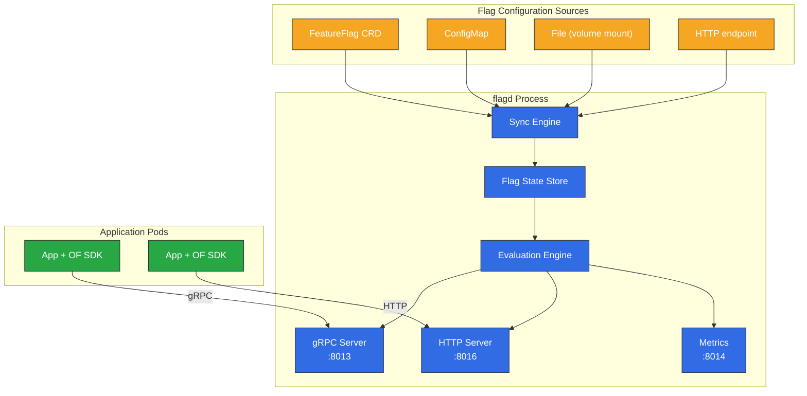
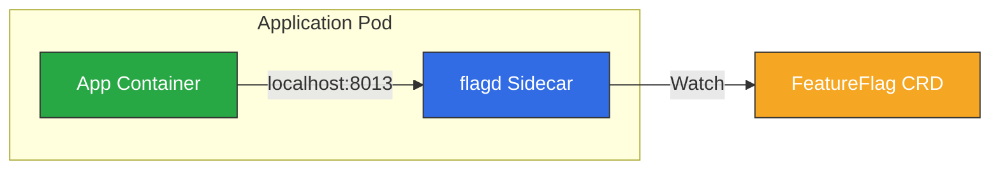
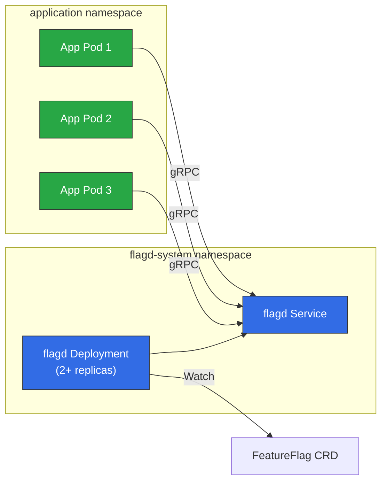
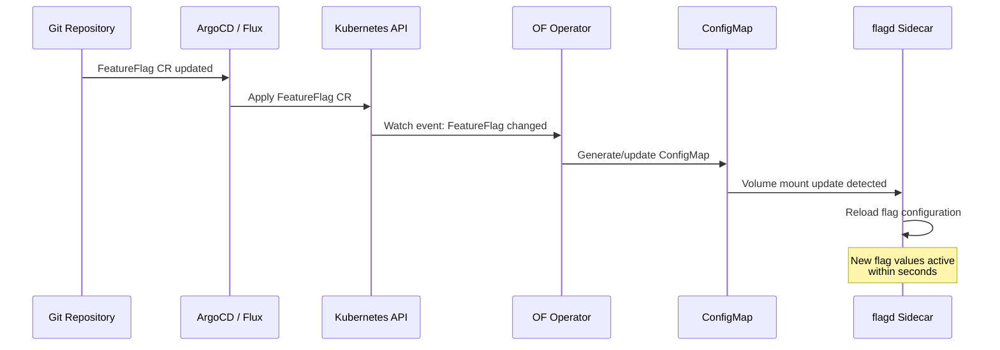
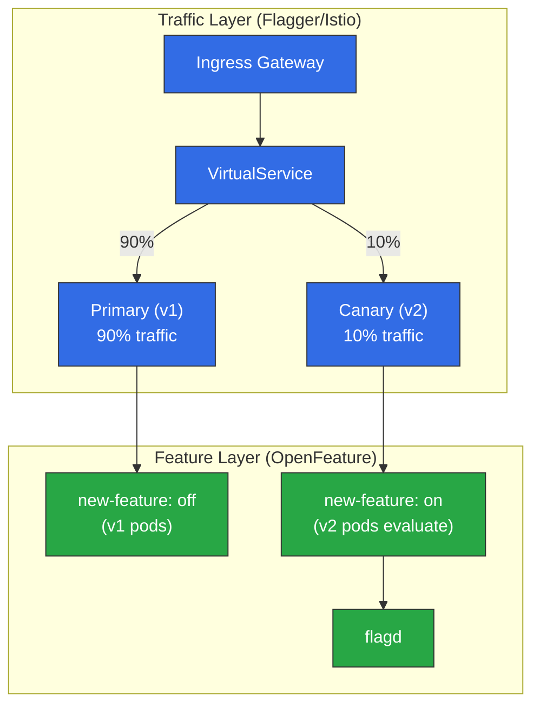
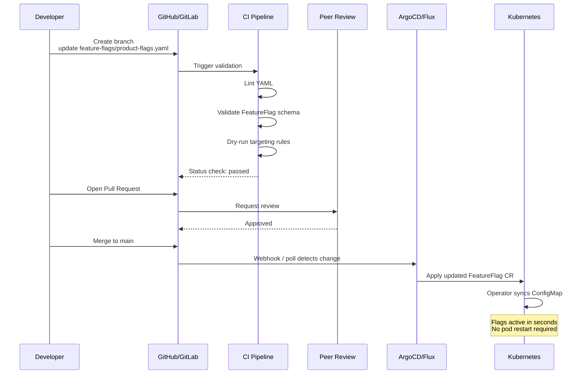
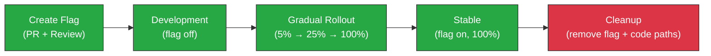

# Feature Flags y OpenFeature

> **Versiones compatibles**: OpenFeature SDK v1.x, flagd v0.11+
> **Última actualización**: June 2025

Los feature flags son una técnica fundamental para la entrega progresiva moderna en Kubernetes. Permiten a los equipos de ingeniería desacoplar el despliegue del lanzamiento, habilitando implementaciones seguras, experimentos dirigidos y reversiones instantáneas sin volver a desplegar código. Esta guía cubre el estándar OpenFeature, la implementación de referencia flagd, el OpenFeature Operator para Kubernetes y patrones de integración de nivel de producción para flujos de trabajo de GitOps.

---

## Tabla de contenido

- [Descripción general y objetivos de aprendizaje](#overview-and-learning-objectives)
- [Arquitectura de OpenFeature](#openfeature-architecture)
- [flagd en Kubernetes](#flagd-on-kubernetes)
- [OpenFeature Operator](#openfeature-operator)
- [Integración de aplicaciones](#application-integration)
- [Combinación de lanzamiento canary y feature flags](#canary-release-and-feature-flag-combination)
- [Integración de GitOps](#gitops-integration)
- [Observabilidad](#observability)
- [Mejores prácticas de producción](#production-best-practices)
- [Referencias](#references)

---

## Descripción general y objetivos de aprendizaje

### Objetivos de aprendizaje

Después de completar esta sección, podrá:

- Explicar el papel de los feature flags en la entrega progresiva y el despliegue continuo
- Comparar plataformas de feature flags y seleccionar la herramienta adecuada para su entorno
- Desplegar flagd en Kubernetes mediante el OpenFeature Operator
- Integrar SDK de OpenFeature en aplicaciones Go, Java, Python y Node.js
- Combinar feature flags con lanzamientos canary para estrategias de implementación sofisticadas
- Gestionar la configuración de feature flags como código mediante flujos de trabajo de GitOps
- Monitorizar evaluaciones de flags con Prometheus y Grafana

### ¿Qué son los feature flags?

Un feature flag (también llamado feature toggle o feature switch) es un mecanismo que permite habilitar o deshabilitar funcionalidades en tiempo de ejecución sin desplegar código nuevo. La idea central es simple: encapsule una ruta de código en una condicional que compruebe el valor de un flag y controle ese valor externamente.

```
if featureEnabled("new-checkout-flow"):
    renderNewCheckout()
else:
    renderLegacyCheckout()
```

Los feature flags cumplen varios propósitos distintos en la entrega de software:

| Categoría | Propósito | Duración | Ejemplo |
|----------|---------|----------|---------|
| **Flags de lanzamiento** | Desacoplar el despliegue del lanzamiento | Días a semanas | Ocultar una funcionalidad sin terminar detrás de un flag durante el desarrollo |
| **Flags de experimento** | Pruebas A/B y decisiones basadas en datos | Semanas a meses | Mostrar la variante B de una página de precios al 10% de los usuarios |
| **Flags de operaciones** | Control operativo e interruptores de circuito | Permanente | Interruptor de apagado para una dependencia downstream no crítica |
| **Flags de permisos** | Derechos y control de acceso | Permanente | Habilitar una funcionalidad premium únicamente para clientes de pago |

### Feature Flags en la entrega progresiva

La entrega progresiva amplía la entrega continua al añadir un control detallado sobre qué usuarios ven nuevas funcionalidades y cuándo. Los feature flags son un componente crítico de este modelo:



Con feature flags, despliega el código en todos los pods simultáneamente, pero controla quién ve el nuevo comportamiento en el nivel de aplicación. Esto es fundamentalmente diferente de los enfoques de división de tráfico (como los despliegues canary), que controlan qué versión del pod recibe una solicitud. Ambas técnicas se complementan, como se describe en la sección [Combinación de lanzamiento canary y feature flags](#combinación-de-lanzamiento-canary-y-feature-flags).

### Comparación de herramientas de feature flags

La siguiente tabla compara las plataformas de feature flags más utilizadas en el ecosistema de Kubernetes:

| Funcionalidad | LaunchDarkly | Flagsmith | flagd | Split.io | Unleash |
|---------|-------------|-----------|-------|----------|---------|
| **Modelo de despliegue** | SaaS (Relay Proxy para on-prem) | SaaS o autohospedado | Autohospedado (nativo de K8s) | SaaS (híbrido disponible) | Autohospedado o SaaS |
| **Compatibilidad con OpenFeature** | Provider oficial | Provider oficial | Implementación de referencia | Provider oficial | Provider oficial |
| **Kubernetes Operator** | No (usa Relay Proxy) | No | Sí (OpenFeature Operator) | No | No |
| **Configuración basada en CRD** | No | No | Sí (FeatureFlag CR) | No | No |
| **Reglas de targeting** | Avanzadas (segmentos, reglas) | Avanzadas (segmentos, reglas) | Reglas basadas en JSON | Avanzadas (atributos) | Basadas en estrategias |
| **Registro de auditoría** | Integrado | Integrado | Mediante Kubernetes + OTel | Integrado | Integrado |
| **Actualizaciones en tiempo real** | Streaming (SSE) | Streaming (SSE/WS) | Sincronización gRPC / watch de K8s | Streaming (SSE) | Polling o webhook |
| **Precios** | Comercial | Nivel gratuito + comercial | Gratuito (OSS, CNCF) | Comercial | Gratuito (OSS) + comercial |
| **Mejor para** | Empresas a escala | Flexibilidad de autohospedaje | Cargas de trabajo de K8s nativas de la nube | Enfoque en experimentación | Necesidades simples de autohospedaje |

### El estándar OpenFeature

OpenFeature es un proyecto incubado por CNCF que proporciona una API neutral respecto al proveedor e impulsada por la comunidad para la evaluación de feature flags. Resuelve el problema de la dependencia de un proveedor al definir una interfaz estándar que funciona con cualquier proveedor de backend.

Beneficios principales de OpenFeature:

- **API neutral respecto al proveedor**: Cambie de provider sin modificar el código de la aplicación
- **Modelo de evaluación coherente**: Tipos de flags booleanos, de cadena, numéricos y de objeto con una API de evaluación uniforme
- **Hooks**: Hooks del ciclo de vida para registro, métricas, validación y tracing
- **Contexto de evaluación**: Contexto estructurado (atributos de usuario, información del entorno) que se pasa a cada evaluación
- **Compatibilidad multilenguaje**: SDK oficiales para Go, Java, Python, Node.js, .NET, PHP y más

---

## Arquitectura de OpenFeature

### Estructura del SDK

El SDK de OpenFeature sigue una arquitectura por capas que separa la API de evaluación del backend de gestión de flags:



### Componentes principales

**API de evaluación**: La interfaz principal con la que interactúa el código de la aplicación. Proporciona métodos de evaluación tipados (`getBooleanValue`, `getStringValue`, `getNumberValue`, `getObjectValue`) y una abstracción `Client` para delimitar evaluaciones.

**Provider**: Un provider es una implementación concreta que conecta el SDK de OpenFeature a un backend específico de gestión de flags. Solo un provider está activo en cualquier momento (por dominio) y el SDK delega en él toda la resolución de flags.

**Contexto de evaluación**: Un conjunto de atributos de clave-valor que proporciona contexto para la evaluación de flags. Entre los atributos comunes se incluyen `targetingKey` (ID de usuario), `email`, `region`, `environment` y propiedades personalizadas. El contexto fluye por todo el pipeline de evaluación.

**Hooks**: Los hooks interceptan el ciclo de vida de evaluación de flags en cuatro etapas:

| Etapa | Momento | Casos de uso habituales |
|-------|--------|-----------------|
| `before` | Antes de la evaluación | Enriquecer el contexto, validar entradas |
| `after` | Después de una evaluación correcta | Registrar métricas, decisiones de registro |
| `error` | Ante un fallo de evaluación | Reporte de errores, lógica de fallback |
| `finally` | Siempre se ejecuta (como try/finally) | Limpieza, finalización de spans |

### Modelo de provider

La abstracción de provider es lo que hace que OpenFeature sea neutral respecto al proveedor. Cada provider implementa una interfaz estándar:

```
Provider Interface:
  - resolveBooleanValue(flagKey, defaultValue, context) -> ResolutionDetails
  - resolveStringValue(flagKey, defaultValue, context) -> ResolutionDetails
  - resolveNumberValue(flagKey, defaultValue, context) -> ResolutionDetails
  - resolveObjectValue(flagKey, defaultValue, context) -> ResolutionDetails
  - initialize(context) -> void
  - shutdown() -> void
  - onContextChange(oldCtx, newCtx) -> void
```

Cambiar de un provider a otro requiere modificar una única línea de código de configuración:

```go
// Switch from flagd to LaunchDarkly by changing only the provider
openfeature.SetProvider(flagd.NewProvider())        // Option A: flagd
openfeature.SetProvider(launchdarkly.NewProvider())  // Option B: LaunchDarkly
```

### Flujo de evaluación

Una evaluación completa de un flag sigue esta secuencia:



---

## flagd en Kubernetes

### ¿Qué es flagd?

flagd es un daemon de feature flags ligero y de código abierto, y la implementación de referencia de un motor de evaluación de flags compatible con OpenFeature. Está diseñado específicamente para entornos cloud-native y se ejecuta de forma nativa en Kubernetes.

Características principales:

- **Ligero**: Un único binario de Go, consumo mínimo de recursos (~20 MB de memoria en inactividad)
- **Nativo de Kubernetes**: Lee la configuración de flags desde FeatureFlag CRD, ConfigMaps o archivos
- **gRPC y HTTP**: Expone endpoints de evaluación mediante gRPC (puerto 8013) y HTTP (puerto 8016)
- **Sincronización en tiempo real**: Observa los recursos de Kubernetes en busca de cambios y actualiza el estado de los flags al instante
- **Evaluación fraccional**: Compatibilidad integrada para implementaciones basadas en porcentajes mediante hashing consistente
- **Reglas de targeting**: Targeting basado en JSON Logic para una segmentación compleja de audiencias

### Arquitectura de flagd



### Instalación con Helm

Instale flagd como un despliegue independiente mediante Helm:

```bash
# Add the OpenFeature Helm repository
helm repo add openfeature https://open-feature.github.io/open-feature-operator/
helm repo update

# Install flagd standalone (without the operator)
helm install flagd openfeature/flagd \
  --namespace flagd-system \
  --create-namespace \
  --set replicas=2 \
  --set resources.requests.cpu=100m \
  --set resources.requests.memory=64Mi \
  --set resources.limits.cpu=500m \
  --set resources.limits.memory=256Mi \
  --set metrics.enabled=true
```

Para la mayoría de los entornos de producción, el enfoque recomendado es instalar el OpenFeature Operator (consulte la siguiente sección), que gestiona las instancias de flagd automáticamente.

### FeatureFlag CRD

El OpenFeature Operator introduce una Custom Resource Definition `FeatureFlag` que permite declarar feature flags como recursos de Kubernetes. Este es el mecanismo principal para gestionar la configuración de flags de una manera nativa de Kubernetes.

Este es un ejemplo completo de FeatureFlag CR que demuestra todos los tipos principales de flags y reglas de targeting:

```yaml
apiVersion: core.openfeature.dev/v1beta1
kind: FeatureFlag
metadata:
  name: product-flags
  namespace: default
  labels:
    app: product-service
    environment: production
spec:
  flagSpec:
    # --- Boolean flag: simple on/off toggle ---
    flags:
      new-checkout-flow:
        state: ENABLED
        variants:
          "on": true
          "off": false
        defaultVariant: "off"
        targeting:
          # Enable for internal users and 10% of external users
          if:
            - or:
              - in:
                - "@company.com"
                - var: email
              - in:
                - var: targetingKey
                - fractional:
                  - - "on"
                    - 10
                  - - "off"
                    - 90
            - "on"
            - "off"

      # --- String flag: multi-variant feature ---
      checkout-theme:
        state: ENABLED
        variants:
          classic: "classic-v1"
          modern: "modern-v2"
          experimental: "modern-v3-beta"
        defaultVariant: classic
        targeting:
          if:
            - in:
              - var: region
              - - "us-east-1"
                - "eu-west-1"
            - "modern"
            - "classic"

      # --- Number flag: configuration tuning ---
      api-rate-limit:
        state: ENABLED
        variants:
          low: 100
          standard: 500
          high: 2000
          unlimited: 10000
        defaultVariant: standard
        targeting:
          if:
            - "=="
              - var: tier
              - "premium"
            - "high"
            - "standard"

      # --- Object flag: complex configuration ---
      recommendation-config:
        state: ENABLED
        variants:
          default:
            algorithm: "collaborative-filtering"
            maxResults: 10
            includeSponsored: false
          enhanced:
            algorithm: "deep-learning-v2"
            maxResults: 20
            includeSponsored: true
            modelVersion: "2025-06"
        defaultVariant: default
        targeting:
          if:
            - in:
              - var: targetingKey
              - fractional:
                - - "enhanced"
                  - 25
                - - "default"
                  - 75
            - "enhanced"
            - "default"

      # --- Ops flag: emergency kill switch ---
      enable-external-recommendations:
        state: ENABLED
        variants:
          "on": true
          "off": false
        defaultVariant: "on"
        # No targeting rules: controlled purely by defaultVariant.
        # Set defaultVariant to "off" to disable the feature globally.
```

### Inyección de sidecar frente a despliegue independiente

flagd puede ejecutarse en dos modos en Kubernetes. La elección depende de sus requisitos de latencia, modelo operativo y presupuesto de recursos.

**Modo sidecar** (inyectado por el OpenFeature Operator):



**Modo independiente** (despliegue centralizado):



| Aspecto | Sidecar | Independiente |
|--------|---------|------------|
| **Latencia** | La menor (localhost) | Ligeramente mayor (salto de red) |
| **Uso de recursos** | Un flagd por pod | Compartido entre pods |
| **Radio de impacto** | Aislamiento por pod | Compartido; una interrupción afecta a todos los consumidores |
| **Escalado** | Escala con los pods de la aplicación | Escalado independiente |
| **Configuración** | Automática mediante anotación de Operator | Gestión manual con Helm/YAML |
| **Mejor para** | Cargas de trabajo críticas y sensibles a la latencia | Sensibles al coste, muchos servicios pequeños |

---

## OpenFeature Operator

El OpenFeature Operator es un Kubernetes operator que gestiona el ciclo de vida de las instancias de flagd y sincroniza las configuraciones de feature flags. Es la forma recomendada de ejecutar flagd en entornos Kubernetes de producción.

### Instalación

```bash
# Install the OpenFeature Operator via Helm
helm repo add openfeature https://open-feature.github.io/open-feature-operator/
helm repo update

helm install open-feature-operator openfeature/open-feature-operator \
  --namespace open-feature-operator-system \
  --create-namespace \
  --set sidecarConfiguration.resources.requests.cpu=50m \
  --set sidecarConfiguration.resources.requests.memory=32Mi \
  --set sidecarConfiguration.resources.limits.cpu=200m \
  --set sidecarConfiguration.resources.limits.memory=128Mi
```

### CRD introducidas por el Operator

El operator introduce varias CRD para gestionar feature flags:

| CRD | Propósito |
|-----|---------|
| `FeatureFlag` | Declara definiciones de feature flags en línea (clave de flag, variantes, reglas de targeting) |
| `FeatureFlagSource` | Apunta a las fuentes de configuración de flags para una carga de trabajo (CRD, archivo, HTTP) |

### FeatureFlagSource CRD

El recurso `FeatureFlagSource` indica al operator desde dónde debe leer flagd su configuración. Un único `FeatureFlagSource` puede hacer referencia a varias fuentes, y el operator las combina.

```yaml
apiVersion: core.openfeature.dev/v1beta1
kind: FeatureFlagSource
metadata:
  name: product-service-flags
  namespace: default
spec:
  sources:
    # Source 1: FeatureFlag CR in the same namespace
    - source: product-flags          # Name of the FeatureFlag CR
      provider: kubernetes           # Read from Kubernetes CRD
    # Source 2: Shared flags from another namespace
    - source: global-flags
      provider: kubernetes
    # Source 3: External HTTP source (for third-party flag data)
    - source: https://flags.internal.company.com/api/v1/flags
      provider: http
      httpSyncBearerToken: "flag-sync-token"  # Token for auth
  # Port configuration for the injected flagd sidecar
  port: 8013
  metricsPort: 8014
  # flagd management port
  managementPort: 8015
  # Evaluation log format
  evaluator: json
  # Default sync provider
  defaultSyncProvider: kubernetes
```

### Inyección automática de Pods

El operator utiliza una anotación para inyectar un contenedor sidecar de flagd en los pods de aplicación. Cuando el webhook de mutación del operator detecta la anotación, agrega automáticamente el contenedor flagd a la especificación del pod.

```yaml
apiVersion: apps/v1
kind: Deployment
metadata:
  name: product-service
  namespace: default
spec:
  replicas: 3
  selector:
    matchLabels:
      app: product-service
  template:
    metadata:
      labels:
        app: product-service
      annotations:
        # This annotation triggers flagd sidecar injection
        openfeature.dev/enabled: "true"
        # Reference the FeatureFlagSource to use
        openfeature.dev/flagsourcename: "product-service-flags"
    spec:
      containers:
        - name: product-service
          image: myregistry/product-service:v1.4.0
          ports:
            - containerPort: 8080
          env:
            # The flagd provider connects to localhost because the sidecar
            # runs in the same pod
            - name: FLAGD_HOST
              value: "localhost"
            - name: FLAGD_PORT
              value: "8013"
```

Después de que el operator procese este Deployment, el pod resultante contendrá dos contenedores: el contenedor de aplicación y el sidecar de flagd, con una configuración de flags obtenida del `FeatureFlagSource` referenciado.

### Sincronización de ConfigMap y CRD

El operator observa los FeatureFlag CR para detectar cambios y genera o actualiza los ConfigMaps correspondientes que lee flagd. Este flujo de sincronización funciona de la siguiente manera:



Al actualizar un FeatureFlag CR, el operator detecta el cambio mediante la API watch de Kubernetes, regenera el ConfigMap que contiene la especificación del flag y flagd detecta el cambio mediante su observador de archivos; todo ello sin reiniciar los pods.

---

## Integración de aplicaciones

### SDK de Go

```go
package main

import (
    "context"
    "fmt"
    "log"

    "github.com/open-feature/go-sdk/openfeature"
    flagd "github.com/open-feature/go-sdk-contrib/providers/flagd/pkg"
)

func main() {
    // Initialize the flagd provider
    provider := flagd.NewProvider(
        flagd.WithHost("localhost"),
        flagd.WithPort(8013),
        flagd.WithResolverType(flagd.GRPC),
    )
    openfeature.SetProvider(provider)

    // Create a client scoped to a domain
    client := openfeature.NewClient("product-service")

    // Build evaluation context with user and environment attributes
    ctx := openfeature.NewEvaluationContext(
        "user-12345",  // targetingKey
        map[string]interface{}{
            "email":   "alice@company.com",
            "region":  "us-east-1",
            "tier":    "premium",
            "env":     "production",
        },
    )

    // Boolean flag evaluation
    newCheckout, _ := client.BooleanValue(
        context.Background(), "new-checkout-flow", false, ctx,
    )
    fmt.Printf("New checkout enabled: %v\n", newCheckout)

    // String flag evaluation
    theme, _ := client.StringValue(
        context.Background(), "checkout-theme", "classic-v1", ctx,
    )
    fmt.Printf("Theme: %s\n", theme)

    // Number flag evaluation
    rateLimit, _ := client.FloatValue(
        context.Background(), "api-rate-limit", 500, ctx,
    )
    fmt.Printf("Rate limit: %.0f\n", rateLimit)

    // Object flag evaluation (returns interface{})
    recoConfig, _ := client.ObjectValue(
        context.Background(), "recommendation-config",
        map[string]interface{}{"algorithm": "collaborative-filtering", "maxResults": 10},
        ctx,
    )
    fmt.Printf("Recommendation config: %v\n", recoConfig)

    // Detailed evaluation (includes reason, variant, metadata)
    details, _ := client.BooleanValueDetails(
        context.Background(), "new-checkout-flow", false, ctx,
    )
    fmt.Printf("Value: %v, Variant: %s, Reason: %s\n",
        details.Value, details.Variant, details.Reason)
}
```

### SDK de Java

```java
import dev.openfeature.sdk.*;
import dev.openfeature.contrib.providers.flagd.FlagdProvider;
import dev.openfeature.contrib.providers.flagd.FlagdOptions;

public class ProductService {

    private final Client featureClient;

    public ProductService() {
        // Configure the flagd provider
        FlagdOptions options = FlagdOptions.builder()
            .host("localhost")
            .port(8013)
            .resolverType(FlagdOptions.ResolverType.GRPC)
            .deadline(500)  // evaluation timeout in ms
            .build();

        OpenFeatureAPI api = OpenFeatureAPI.getInstance();
        api.setProvider(new FlagdProvider(options));
        this.featureClient = api.getClient("product-service");
    }

    public void handleCheckout(User user) {
        // Build evaluation context
        MutableContext ctx = new MutableContext(user.getId());
        ctx.add("email", user.getEmail());
        ctx.add("region", user.getRegion());
        ctx.add("tier", user.getTier());

        // Boolean evaluation
        boolean newCheckout = featureClient.getBooleanValue(
            "new-checkout-flow", false, ctx
        );

        if (newCheckout) {
            processNewCheckout(user);
        } else {
            processLegacyCheckout(user);
        }

        // String evaluation
        String theme = featureClient.getStringValue(
            "checkout-theme", "classic-v1", ctx
        );
        renderWithTheme(theme);

        // Number evaluation
        int rateLimit = featureClient.getIntegerValue(
            "api-rate-limit", 500, ctx
        );
        applyRateLimit(rateLimit);

        // Object evaluation
        Value recoConfig = featureClient.getObjectValue(
            "recommendation-config",
            new Value(Structure.mapToStructure(
                Map.of("algorithm", new Value("collaborative-filtering"))
            )),
            ctx
        );
        configureRecommendations(recoConfig.asStructure());
    }

    // Detailed evaluation with reason and variant
    public void logFlagDecision(String flagKey, User user) {
        MutableContext ctx = new MutableContext(user.getId());
        FlagEvaluationDetails<Boolean> details =
            featureClient.getBooleanDetails(flagKey, false, ctx);

        logger.info("Flag: {}, Value: {}, Variant: {}, Reason: {}",
            flagKey, details.getValue(),
            details.getVariant(), details.getReason());
    }
}
```

### SDK de Python

```python
from openfeature import api
from openfeature.evaluation_context import EvaluationContext
from openfeature.contrib.provider.flagd import FlagdProvider
from openfeature.contrib.provider.flagd.config import ResolverType

# Initialize the provider
provider = FlagdProvider(
    host="localhost",
    port=8013,
    resolver_type=ResolverType.GRPC,
    deadline_ms=500,
)
api.set_provider(provider)

# Create a client
client = api.get_client("product-service")


def handle_request(user: dict):
    """Handle an incoming request with feature flag evaluation."""

    # Build evaluation context
    ctx = EvaluationContext(
        targeting_key=user["id"],
        attributes={
            "email": user["email"],
            "region": user.get("region", "us-east-1"),
            "tier": user.get("tier", "free"),
            "env": "production",
        },
    )

    # Boolean flag
    new_checkout = client.get_boolean_value("new-checkout-flow", False, ctx)
    if new_checkout:
        return render_new_checkout(user)

    # String flag
    theme = client.get_string_value("checkout-theme", "classic-v1", ctx)

    # Number flag
    rate_limit = client.get_integer_value("api-rate-limit", 500, ctx)

    # Object flag
    reco_config = client.get_object_value(
        "recommendation-config",
        {"algorithm": "collaborative-filtering", "maxResults": 10},
        ctx,
    )

    # Detailed evaluation
    details = client.get_boolean_details("new-checkout-flow", False, ctx)
    print(
        f"Flag: new-checkout-flow, Value: {details.value}, "
        f"Variant: {details.variant}, Reason: {details.reason}"
    )

    return render_legacy_checkout(user, theme, rate_limit, reco_config)
```

### SDK de Node.js

```typescript
import { OpenFeature, EvaluationContext } from '@openfeature/server-sdk';
import { FlagdProvider } from '@openfeature/flagd-provider';

// Initialize the provider
const provider = new FlagdProvider({
  host: 'localhost',
  port: 8013,
  resolverType: 'grpc',
  deadlineMs: 500,
});

OpenFeature.setProvider(provider);

// Create a client
const client = OpenFeature.getClient('product-service');

interface User {
  id: string;
  email: string;
  region: string;
  tier: string;
}

async function handleCheckout(user: User): Promise<void> {
  // Build evaluation context
  const ctx: EvaluationContext = {
    targetingKey: user.id,
    email: user.email,
    region: user.region,
    tier: user.tier,
    env: 'production',
  };

  // Boolean flag
  const newCheckout = await client.getBooleanValue(
    'new-checkout-flow',
    false,
    ctx,
  );

  if (newCheckout) {
    await processNewCheckout(user);
  } else {
    await processLegacyCheckout(user);
  }

  // String flag
  const theme = await client.getStringValue(
    'checkout-theme',
    'classic-v1',
    ctx,
  );

  // Number flag
  const rateLimit = await client.getNumberValue(
    'api-rate-limit',
    500,
    ctx,
  );

  // Object flag
  const recoConfig = await client.getObjectValue(
    'recommendation-config',
    { algorithm: 'collaborative-filtering', maxResults: 10 },
    ctx,
  );

  // Detailed evaluation with metadata
  const details = await client.getBooleanDetails(
    'new-checkout-flow',
    false,
    ctx,
  );
  console.log(
    `Flag: new-checkout-flow, Value: ${details.value}, ` +
    `Variant: ${details.variant}, Reason: ${details.reason}`,
  );
}
```

### Análisis detallado de las reglas de targeting

flagd utiliza JSON Logic para las reglas de targeting. Estos son patrones de targeting habituales:

**Implementación basada en porcentajes (hashing consistente)**:

El operador `fractional` utiliza `targetingKey` como entrada para una función hash, lo que garantiza que el mismo usuario siempre vea la misma variante:

```yaml
targeting:
  if:
    - in:
      - var: targetingKey
      - fractional:
        - - "on"
          - 20    # 20% of users
        - - "off"
          - 80    # 80% of users
    - "on"
    - "off"
```

**Targeting basado en atributos (región, nivel, etc.)**:

```yaml
targeting:
  if:
    - and:
      - "=="
        - var: region
        - "us-east-1"
      - in:
        - var: tier
        - - "premium"
          - "enterprise"
    - "enhanced"
    - "default"
```

**Targeting combinado (usuarios internos O porcentaje)**:

```yaml
targeting:
  if:
    - or:
      - ends_with:
        - var: email
        - "@company.com"
      - in:
        - var: targetingKey
        - fractional:
          - - "on"
            - 5
          - - "off"
            - 95
    - "on"
    - "off"
```

---

## Combinación de lanzamiento canary y feature flags

Los feature flags y los lanzamientos canary son estrategias complementarias. Los lanzamientos canary controlan el tráfico en el nivel de infraestructura (qué versión del pod sirve una solicitud), mientras que los feature flags controlan el comportamiento en el nivel de aplicación (qué ruta de código se ejecuta). Combinar ambos proporciona el máximo nivel de seguridad para los lanzamientos.

### Arquitectura: Flagger + Feature Flags



### Flujo de trabajo de Flagger + Feature Flag

El siguiente flujo de trabajo utiliza Flagger para la gestión de tráfico y feature flags para el control detallado dentro de los pods canary:

**Fase 1 -- Desplegar con el flag desactivado**: Entregue v2 con una nueva funcionalidad detrás de un flag (valor predeterminado: desactivado). Flagger comienza a enrutar un pequeño porcentaje del tráfico a v2.

**Fase 2 -- Habilitar el flag para usuarios internos**: Actualice el FeatureFlag CR para habilitar la funcionalidad para usuarios que coincidan con `@company.com`. Los usuarios internos que llegan a los pods v2 ven la nueva funcionalidad; todos los demás usuarios de v2 ven el comportamiento anterior.

**Fase 3 -- Implementación porcentual**: Amplíe la regla de targeting al 10% de todos los usuarios. Monitorice las tasas de error y la latencia mediante el análisis de Flagger.

**Fase 4 -- Implementación completa**: Si las métricas son saludables, Flagger promociona v2 a primaria y el feature flag se abre al 100%.

Ejemplo de recurso Canary de Flagger:

```yaml
apiVersion: flagger.app/v1beta1
kind: Canary
metadata:
  name: product-service
  namespace: default
spec:
  targetRef:
    apiVersion: apps/v1
    kind: Deployment
    name: product-service
  service:
    port: 8080
  analysis:
    interval: 1m
    threshold: 5
    maxWeight: 50
    stepWeight: 10
    metrics:
      - name: request-success-rate
        thresholdRange:
          min: 99
        interval: 1m
      - name: request-duration
        thresholdRange:
          max: 500
        interval: 1m
      # Custom metric: feature flag error rate
      - name: feature-flag-error-rate
        templateRef:
          name: feature-flag-errors
          namespace: flagger-system
        thresholdRange:
          max: 1
        interval: 1m
```

### Pruebas A/B con feature flags

Los feature flags permiten pruebas A/B reales en las que la asignación de usuarios es determinista e independiente del enrutamiento de infraestructura:

```yaml
apiVersion: core.openfeature.dev/v1beta1
kind: FeatureFlag
metadata:
  name: ab-test-pricing
  namespace: default
spec:
  flagSpec:
    flags:
      pricing-page-variant:
        state: ENABLED
        variants:
          control: "pricing-v1"
          variant-a: "pricing-v2-annual-first"
          variant-b: "pricing-v2-monthly-first"
        defaultVariant: control
        targeting:
          if:
            - in:
              - var: targetingKey
              - fractional:
                - - "control"
                  - 34
                - - "variant-a"
                  - 33
                - - "variant-b"
                  - 33
            - fractional:
              - - "control"
                - 34
              - - "variant-a"
                - 33
              - - "variant-b"
                - 33
```

Dado que `fractional` usa hashing consistente sobre `targetingKey`, cada usuario siempre ve la misma variante entre sesiones, lo cual es esencial para resultados válidos de pruebas A/B.

### Patrón de dark launch

Un dark launch despliega nueva funcionalidad en producción, pero solo la expone a usuarios internos o a un pipeline de sombra. Los feature flags lo hacen sencillo:

```yaml
apiVersion: core.openfeature.dev/v1beta1
kind: FeatureFlag
metadata:
  name: dark-launch-payment-v2
  namespace: default
spec:
  flagSpec:
    flags:
      payment-engine-v2:
        state: ENABLED
        variants:
          "on": true
          "off": false
        defaultVariant: "off"
        targeting:
          # Only enable for specific internal test accounts
          if:
            - in:
              - var: targetingKey
              - - "test-user-001"
                - "test-user-002"
                - "qa-bot-001"
            - "on"
            - "off"
```

El código de la aplicación procesa las rutas antigua y nueva simultáneamente, pero solo devuelve el resultado de la nueva ruta cuando el flag está activado:

```go
func processPayment(order Order, ctx openfeature.EvaluationContext) Result {
    // Always run the legacy path
    legacyResult := legacyPaymentEngine.Process(order)

    // Check if the new engine should be used
    useV2, _ := client.BooleanValue(context.Background(), "payment-engine-v2", false, ctx)

    if useV2 {
        newResult := paymentEngineV2.Process(order)
        // Compare results for validation (optional)
        compareResults(legacyResult, newResult)
        return newResult
    }

    return legacyResult
}
```

### Implementación automática basada en métricas

Combine el análisis de Flagger con métricas de feature flags para avanzar o abortar implementaciones automáticamente:

```yaml
apiVersion: flagger.app/v1beta1
kind: MetricTemplate
metadata:
  name: feature-flag-errors
  namespace: flagger-system
spec:
  provider:
    type: prometheus
    address: http://prometheus.monitoring:9090
  query: |
    100 - (
      sum(rate(
        flagd_impression_total{
          key="new-checkout-flow",
          reason!="ERROR"
        }[1m]
      )) /
      sum(rate(
        flagd_impression_total{
          key="new-checkout-flow"
        }[1m]
      )) * 100
    )
```

---

## Integración de GitOps

### Feature flags como código

Gestionar feature flags mediante Git aporta los mismos beneficios que GitOps para la infraestructura: historial de versiones, revisiones de pull requests, despliegue automatizado y pistas de auditoría. La FeatureFlag CRD hace que esto sea natural: la configuración de flags es simplemente otro manifiesto de Kubernetes almacenado en Git.

Diseño de repositorio recomendado:

```
gitops-repo/
├── base/
│   ├── namespaces.yaml
│   └── ...
├── apps/
│   ├── product-service/
│   │   ├── deployment.yaml
│   │   ├── service.yaml
│   │   ├── feature-flags/
│   │   │   ├── product-flags.yaml       # FeatureFlag CR
│   │   │   └── flag-source.yaml         # FeatureFlagSource CR
│   │   └── kustomization.yaml
│   └── checkout-service/
│       ├── deployment.yaml
│       ├── feature-flags/
│       │   └── checkout-flags.yaml
│       └── kustomization.yaml
├── platform/
│   └── open-feature-operator/
│       ├── helmrelease.yaml
│       └── values.yaml
└── environments/
    ├── dev/
    │   └── patches/
    │       └── feature-flags-dev.yaml    # Dev-specific flag overrides
    ├── staging/
    │   └── patches/
    │       └── feature-flags-staging.yaml
    └── production/
        └── patches/
            └── feature-flags-prod.yaml
```

### Despliegue de ArgoCD FeatureFlag CR

Defina una Application de ArgoCD que gestione recursos de feature flags:

```yaml
apiVersion: argoproj.io/v1alpha1
kind: Application
metadata:
  name: product-service-flags
  namespace: argocd
spec:
  project: default
  source:
    repoURL: https://github.com/org/gitops-repo.git
    targetRevision: main
    path: apps/product-service/feature-flags
  destination:
    server: https://kubernetes.default.svc
    namespace: default
  syncPolicy:
    automated:
      prune: true
      selfHeal: true
    syncOptions:
      - CreateNamespace=true
    retry:
      limit: 3
      backoff:
        duration: 5s
        factor: 2
        maxDuration: 1m
```

### Despliegue de Flux FeatureFlag CR

Para FluxCD, utilice un recurso Kustomization:

```yaml
apiVersion: kustomize.toolkit.fluxcd.io/v1
kind: Kustomization
metadata:
  name: product-service-flags
  namespace: flux-system
spec:
  interval: 5m
  sourceRef:
    kind: GitRepository
    name: gitops-repo
  path: ./apps/product-service/feature-flags
  prune: true
  targetNamespace: default
  healthChecks:
    - apiVersion: core.openfeature.dev/v1beta1
      kind: FeatureFlag
      name: product-flags
      namespace: default
```

### Flujo de trabajo de cambio de flags basado en PR

El flujo de trabajo de pull requests para los cambios de feature flags proporciona seguridad y trazabilidad:



**Ejemplo de validación de CI** (GitHub Actions):

```yaml
name: Validate Feature Flags
on:
  pull_request:
    paths:
      - '**/feature-flags/**'

jobs:
  validate:
    runs-on: ubuntu-latest
    steps:
      - uses: actions/checkout@v4

      - name: Validate YAML syntax
        run: |
          find . -path '*/feature-flags/*.yaml' -exec yamllint -d relaxed {} +

      - name: Validate FeatureFlag schema
        run: |
          # Use kubeconform with the OpenFeature CRD schema
          find . -path '*/feature-flags/*.yaml' \
            -exec kubeconform \
              -schema-location 'https://raw.githubusercontent.com/open-feature/open-feature-operator/main/config/crd/bases/core.openfeature.dev_featureflags.yaml' \
              {} +

      - name: Check targeting rules
        run: |
          # Custom script to validate JSON Logic targeting rules
          python scripts/validate-targeting-rules.py \
            --flags-dir apps/*/feature-flags/
```

### Overrides específicos por entorno con Kustomize

Use parches de Kustomize para mantener diferentes estados de flags por entorno:

```yaml
# environments/production/patches/feature-flags-prod.yaml
apiVersion: core.openfeature.dev/v1beta1
kind: FeatureFlag
metadata:
  name: product-flags
spec:
  flagSpec:
    flags:
      new-checkout-flow:
        # Production: conservative 5% rollout
        defaultVariant: "off"
        targeting:
          if:
            - in:
              - var: targetingKey
              - fractional:
                - - "on"
                  - 5
                - - "off"
                  - 95
            - "on"
            - "off"
```

```yaml
# environments/dev/patches/feature-flags-dev.yaml
apiVersion: core.openfeature.dev/v1beta1
kind: FeatureFlag
metadata:
  name: product-flags
spec:
  flagSpec:
    flags:
      new-checkout-flow:
        # Dev: always on
        defaultVariant: "on"
```

---

## Observabilidad

### Métricas de evaluación de flags (Prometheus)

flagd expone métricas de Prometheus en su puerto de métricas (predeterminado: 8014). Las métricas clave para monitorizar el comportamiento de los feature flags son:

| Métrica | Tipo | Descripción |
|--------|------|-------------|
| `flagd_impression_total` | Contador | Número total de evaluaciones de flags, etiquetado por `key`, `variant` y `reason` |
| `flagd_evaluation_error_total` | Contador | Total de errores de evaluación, etiquetado por `key` y `error_code` |
| `flagd_evaluation_duration_seconds` | Histograma | Distribución de latencia de las evaluaciones de flags |
| `flagd_flag_syncs_total` | Contador | Número de sincronizaciones de configuración de flags desde fuentes |

Configuración de scraping de Prometheus:

```yaml
apiVersion: monitoring.coreos.com/v1
kind: ServiceMonitor
metadata:
  name: flagd-metrics
  namespace: monitoring
  labels:
    release: prometheus
spec:
  namespaceSelector:
    any: true
  selector:
    matchLabels:
      app.kubernetes.io/name: flagd
  endpoints:
    - port: metrics
      interval: 15s
      path: /metrics
```

Si utiliza el modo sidecar, configure el scraping a nivel de pod:

```yaml
apiVersion: monitoring.coreos.com/v1
kind: PodMonitor
metadata:
  name: flagd-sidecar-metrics
  namespace: monitoring
spec:
  namespaceSelector:
    any: true
  selector:
    matchLabels:
      openfeature.dev/enabled: "true"
  podMetricsEndpoints:
    - port: "8014"
      interval: 15s
      path: /metrics
```

### Dashboard de Grafana

Paneles clave para un dashboard de Grafana de feature flags:

**Panel 1 -- Tasa de evaluación de flags por variante**:

```promql
sum by (key, variant) (
  rate(flagd_impression_total[5m])
)
```

**Panel 2 -- Tasa de errores por flag**:

```promql
sum by (key) (rate(flagd_evaluation_error_total[5m]))
/
sum by (key) (rate(flagd_impression_total[5m]))
* 100
```

**Panel 3 -- Latencia de evaluación (p99)**:

```promql
histogram_quantile(0.99,
  sum by (le) (
    rate(flagd_evaluation_duration_seconds_bucket[5m])
  )
)
```

**Panel 4 -- Progreso de la implementación (porcentaje de evaluaciones "on")**:

```promql
sum(rate(flagd_impression_total{key="new-checkout-flow", variant="on"}[5m]))
/
sum(rate(flagd_impression_total{key="new-checkout-flow"}[5m]))
* 100
```

**Panel 5 -- Estado de sincronización de configuración**:

```promql
sum by (source) (rate(flagd_flag_syncs_total[5m]))
```

### Seguimiento del historial de cambios

Dado que los feature flags se gestionan como recursos de Kubernetes mediante GitOps, cada cambio se rastrea en dos lugares:

1. **Historial de Git**: Registro completo de commits con diffs, autor, marca de tiempo y enlaces de PR
2. **Eventos de Kubernetes**: El OpenFeature Operator emite eventos cuando cambian las configuraciones de flags

Consulte los eventos de Kubernetes para los cambios de flags:

```bash
kubectl get events --field-selector reason=FlagConfigurationUpdated \
  --sort-by='.metadata.creationTimestamp' -n default
```

### Registro de auditoría

Para auditoría de cumplimiento y seguridad, combine varias fuentes de datos:

| Fuente de datos | Qué captura | Estrategia de retención |
|-------------|-----------------|-------------------|
| Commits de Git | Quién cambió qué, cuándo y por qué (descripción de PR) | Permanente (historial de Git) |
| Registros de auditoría de Kubernetes | Llamadas al servidor de API para recursos FeatureFlag | Registro centralizado (más de 90 días) |
| Registros de evaluación de flagd | Cada evaluación de flag con contexto y resultado | Basada en muestreo (flags de alto volumen) |
| Métricas de Prometheus | Recuentos agregados de evaluaciones y tasas de error | Retención de series temporales (15-30 días) |

Habilite el registro de evaluaciones en flagd para obtener pistas de auditoría detalladas:

```yaml
apiVersion: core.openfeature.dev/v1beta1
kind: FeatureFlagSource
metadata:
  name: audited-flags
spec:
  sources:
    - source: product-flags
      provider: kubernetes
  # Enable structured evaluation logging
  evaluator: json
  logFormat: json
```

---

## Mejores prácticas de producción

### Gestión del ciclo de vida de flags

Cada feature flag debe tener un ciclo de vida definido. Los flags que persisten más allá de su propósito previsto se convierten en deuda técnica que aumenta la complejidad del código, la superficie de pruebas y la carga cognitiva.



Reglas de ciclo de vida recomendadas:

| Tipo de flag | Duración máxima | Acción al vencimiento |
|-----------|-----------------|-----------------|
| Flag de lanzamiento | 30 días después de la implementación al 100% | Eliminar el flag, borrar la ruta de código antigua |
| Flag de experimento | 90 días | Analizar resultados, elegir ganador, eliminar flag |
| Flag de operaciones | Sin vencimiento (permanente) | Revisar trimestralmente |
| Flag de permisos | Sin vencimiento (permanente) | Revisar trimestralmente |

### Prevención de deuda técnica

Los feature flags obsoletos son una fuente significativa de deuda técnica. Implemente estas salvaguardas:

**1. Metadatos de flags con fechas de vencimiento**:

```yaml
apiVersion: core.openfeature.dev/v1beta1
kind: FeatureFlag
metadata:
  name: product-flags
  annotations:
    # Metadata for lifecycle tracking
    openfeature.dev/owner: "checkout-team"
    openfeature.dev/created: "2025-06-01"
    openfeature.dev/expires: "2025-07-15"
    openfeature.dev/jira: "CHECKOUT-1234"
    openfeature.dev/type: "release"
spec:
  flagSpec:
    flags:
      new-checkout-flow:
        state: ENABLED
        # ...
```

**2. Detección automatizada de flags obsoletos** (CronJob):

```yaml
apiVersion: batch/v1
kind: CronJob
metadata:
  name: stale-flag-detector
  namespace: open-feature-operator-system
spec:
  schedule: "0 9 * * 1"  # Every Monday at 9 AM
  jobTemplate:
    spec:
      template:
        spec:
          containers:
            - name: detector
              image: bitnami/kubectl:latest
              command:
                - /bin/sh
                - -c
                - |
                  echo "Checking for expired feature flags..."
                  TODAY=$(date +%Y-%m-%d)
                  kubectl get featureflags --all-namespaces -o json | \
                    jq -r --arg today "$TODAY" \
                    '.items[] |
                     select(.metadata.annotations["openfeature.dev/expires"] != null) |
                     select(.metadata.annotations["openfeature.dev/expires"] < $today) |
                     "\(.metadata.namespace)/\(.metadata.name) expired on \(.metadata.annotations["openfeature.dev/expires"])"'
          restartPolicy: OnFailure
```

**3. Linting a nivel de código**: Use análisis estático para detectar referencias a flags en el código y cruzarlas con las definiciones de flags activas. Los flags referenciados en el código pero ausentes de la CRD (o viceversa) indican artefactos obsoletos.

### Interruptor de apagado de emergencia

Diseñe feature flags críticos como interruptores de apagado que puedan deshabilitar instantáneamente funcionalidades problemáticas:

```yaml
apiVersion: core.openfeature.dev/v1beta1
kind: FeatureFlag
metadata:
  name: kill-switches
  namespace: default
  labels:
    openfeature.dev/type: ops
spec:
  flagSpec:
    flags:
      # Kill switch for external payment provider
      enable-stripe-payments:
        state: ENABLED
        variants:
          "on": true
          "off": false
        defaultVariant: "on"   # Change to "off" to disable Stripe globally

      # Kill switch for recommendation engine
      enable-recommendations:
        state: ENABLED
        variants:
          "on": true
          "off": false
        defaultVariant: "on"

      # Kill switch for real-time notifications
      enable-push-notifications:
        state: ENABLED
        variants:
          "on": true
          "off": false
        defaultVariant: "on"
```

Para escenarios de emergencia, utilice `kubectl` para activar un interruptor de apagado inmediatamente sin esperar al pipeline de GitOps:

```bash
# Emergency: disable Stripe payments
kubectl patch featureflag kill-switches -n default --type='json' \
  -p='[{
    "op": "replace",
    "path": "/spec/flagSpec/flags/enable-stripe-payments/defaultVariant",
    "value": "off"
  }]'
```

Una vez resuelta la emergencia, confirme el cambio en Git para mantener sincronizada la fuente de verdad, o revierta el parche manual y deje que GitOps restaure el estado original.

### Estrategias de implementación gradual

Utilice el operador `fractional` para implementaciones seguras e incrementales:

| Etapa | Porcentaje | Duración | Criterios de aprobación |
|-------|-----------|----------|---------------|
| Interna | 0.1% (solo correos de la empresa) | 1-2 días | Sin errores P0/P1 |
| Adoptantes tempranos | 5% | 2-3 días | Tasa de error < 0.1%, latencia p99 < 500ms |
| Canary | 25% | 3-5 días | Sin degradación en las métricas de negocio |
| Amplia | 50% | 2-3 días | Tasas de conversión estables |
| Disponibilidad general | 100% | -- | Eliminar el flag en 30 días |

Actualice la regla de targeting en cada etapa:

```bash
# Stage: Canary (25%)
kubectl patch featureflag product-flags -n default --type='json' \
  -p='[{
    "op": "replace",
    "path": "/spec/flagSpec/flags/new-checkout-flow/targeting",
    "value": {
      "if": [
        {"in": [{"var": "targetingKey"},
          {"fractional": [["on", 25], ["off", 75]]}]},
        "on", "off"
      ]
    }
  }]'
```

### Minimización del impacto en el rendimiento

La evaluación de feature flags añade latencia a cada solicitud. Minimice el impacto con estas técnicas:

**1. Utilice streaming gRPC con el provider de flagd**: El provider de flagd admite streaming gRPC, donde los valores de flags se envían al SDK y se almacenan en caché localmente. Las evaluaciones se resuelven desde la caché en proceso con una latencia inferior a un milisegundo.

```go
provider := flagd.NewProvider(
    flagd.WithResolverType(flagd.IN_PROCESS), // In-process evaluation
)
```

**2. Evaluación masiva**: Cuando necesite varios flags para una única solicitud, evalúelos juntos para reducir los viajes de ida y vuelta (relevante para providers sin streaming).

**3. Evite flags en bucles activos**: Los feature flags deben evaluarse en el límite de la solicitud, no dentro de bucles ajustados. Almacene el resultado en caché en una variable con ámbito de solicitud.

```go
// Good: evaluate once per request
newCheckout, _ := client.BooleanValue(ctx, "new-checkout-flow", false, evalCtx)
for _, item := range cart.Items {
    if newCheckout {
        processItemV2(item)
    } else {
        processItemV1(item)
    }
}

// Bad: evaluate inside the loop
for _, item := range cart.Items {
    newCheckout, _ := client.BooleanValue(ctx, "new-checkout-flow", false, evalCtx)
    // ...
}
```

**4. Establezca plazos de evaluación**: Configure timeouts para que los fallos en la evaluación de flags no se conviertan en fallos de solicitudes en cascada. El valor predeterminado siempre se devuelve al producirse un timeout.

**5. Límites de recursos para sidecars de flagd**: Establezca límites adecuados de CPU y memoria para evitar que el sidecar compita con el contenedor de aplicación:

```yaml
# Recommended resource settings for flagd sidecar
resources:
  requests:
    cpu: 50m
    memory: 32Mi
  limits:
    cpu: 200m
    memory: 128Mi
```

---

## Referencias

### Documentación oficial

- [Especificación de OpenFeature](https://openfeature.dev/specification/)
- [Documentación del SDK de OpenFeature](https://openfeature.dev/docs/reference/intro)
- [Documentación de flagd](https://flagd.dev/)
- [OpenFeature Operator](https://github.com/open-feature/open-feature-operator)
- [Proyecto OpenFeature de CNCF](https://www.cncf.io/projects/openfeature/)

### Documentación de providers

- [Provider de flagd (Go)](https://github.com/open-feature/go-sdk-contrib/tree/main/providers/flagd)
- [Provider de flagd (Java)](https://github.com/open-feature/java-sdk-contrib/tree/main/providers/flagd)
- [Provider de flagd (Python)](https://github.com/open-feature/python-sdk-contrib/tree/main/providers/openfeature-provider-flagd)
- [Provider de flagd (Node.js)](https://github.com/open-feature/js-sdk-contrib/tree/main/libs/providers/flagd)
- [Providers de OpenFeature de LaunchDarkly](https://docs.launchdarkly.com/sdk/openfeature)
- [Providers de OpenFeature de Flagsmith](https://docs.flagsmith.com/clients/openfeature)

### Documentación interna relacionada

- [Descripción general de GitOps](./README.md) -- Principios de GitOps y selección de herramientas
- [ArgoCD](./argocd/README.md) -- Instalación de ArgoCD, aplicaciones y estrategias de sincronización
- [FluxCD](./02-fluxcd.md) -- Controladores de FluxCD y automatización de imágenes
- [Gestión de tráfico de ArgoCD](./argocd/05-traffic-management.md) -- Argo Rollouts y entrega progresiva
- [División de tráfico de Istio](../service-mesh/istio/traffic-management/04-traffic-splitting.md) -- Gestión de tráfico de service mesh
- [Prometheus](../observability/metrics/01-prometheus.md) -- Recopilación de métricas y alertas
- [Grafana](../observability/grafana/README.md) -- Creación y visualización de dashboards

### Recursos de la comunidad

- [Organización de OpenFeature en GitHub](https://github.com/open-feature)
- [Ecosistema de OpenFeature](https://openfeature.dev/ecosystem) -- Lista completa de providers, hooks e integraciones
- [Mejores prácticas de feature flags (Martin Fowler)](https://martinfowler.com/articles/feature-toggles.html)
- [Entrega progresiva con feature flags (CNCF)](https://www.cncf.io/blog/2023/01/31/progressive-delivery/)
