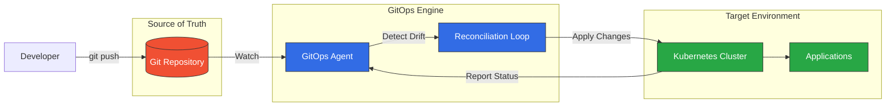
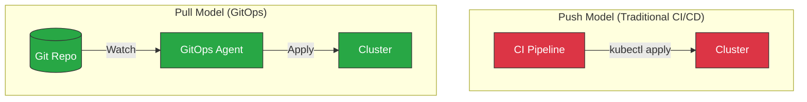
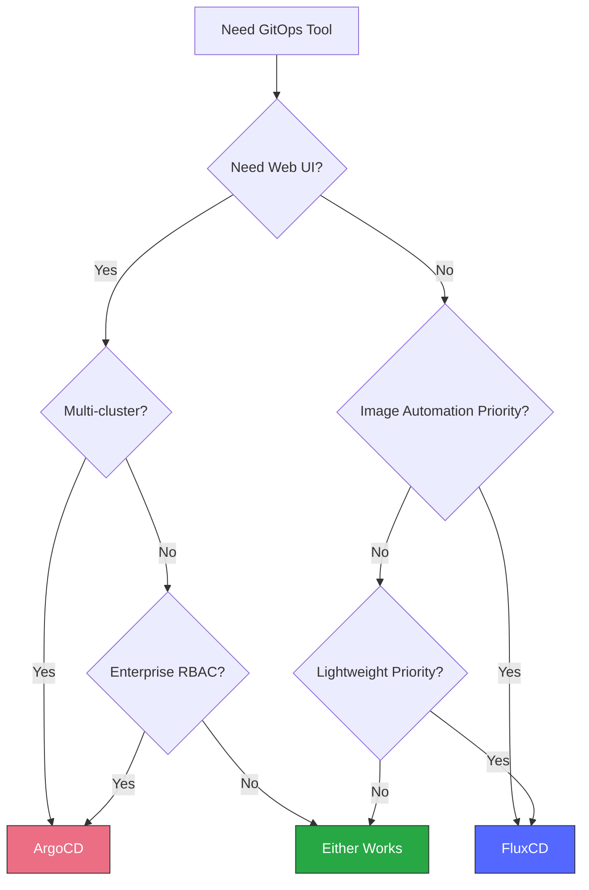
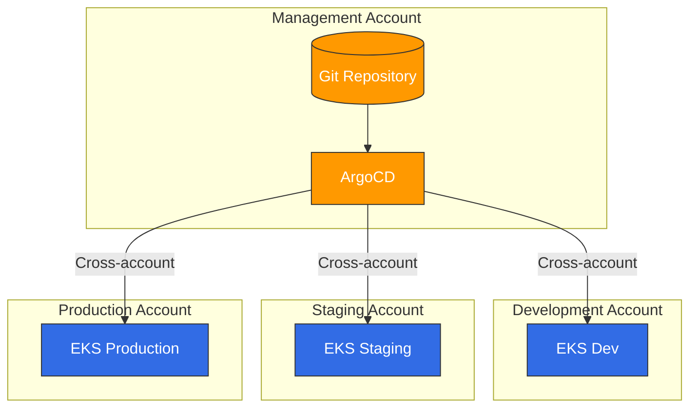

# GitOps

> **Última actualización**: February 23, 2026

## Tabla de contenido
- [¿Qué es GitOps?](#what-is-gitops)
- [Principios fundamentales](#core-principles)
- [Modelo Push vs Pull](#push-vs-pull-model)
- [Descripción general de las herramientas GitOps](#gitops-tools-overview)
- [Guía de selección de herramientas](#tool-selection-guide)
- [GitOps en Amazon EKS](#gitops-on-amazon-eks)
- [Primeros pasos](#getting-started)

## ¿Qué es GitOps?

GitOps es un marco operativo que aplica las prácticas recomendadas de DevOps para la automatización de la infraestructura, como el control de versiones, la colaboración, el cumplimiento y CI/CD, a la gestión de infraestructura. El término fue acuñado por Weaveworks en 2017 y desde entonces se ha convertido en una metodología reconocida por CNCF para el despliegue de aplicaciones cloud-native.

En esencia, GitOps usa repositorios Git como la única fuente de verdad para las configuraciones declarativas de infraestructura y aplicaciones. Los cambios en el estado deseado se realizan mediante commits de Git, y los procesos automatizados garantizan que el estado real del sistema coincida con el estado declarado.



### Historia y evolución

| Año | Hito |
|------|-----------|
| 2017 | Weaveworks acuña el término "GitOps" |
| 2019 | Se lanza Flux v1 y ArgoCD gana popularidad |
| 2020 | CNCF acepta Flux como proyecto incubado |
| 2021 | ArgoCD se convierte en un proyecto graduado de CNCF |
| 2022 | El GitOps Working Group publica los principios |
| 2023 | El proyecto OpenGitOps formaliza los estándares |
| 2024 | GitOps se convierte en el patrón dominante de despliegue de K8s |

### Definición de OpenGitOps de CNCF

El proyecto OpenGitOps define GitOps mediante cuatro principios:

1. **Declarativo**: Un sistema gestionado por GitOps debe expresar su estado deseado de forma declarativa
2. **Versionado e inmutable**: El estado deseado se almacena de una forma que impone inmutabilidad y versionado, y conserva un historial completo de versiones
3. **Extraído automáticamente**: Los agentes de software extraen automáticamente las declaraciones del estado deseado desde la fuente
4. **Conciliado continuamente**: Los agentes de software observan continuamente el estado real del sistema e intentan aplicar el estado deseado

## Principios fundamentales

### Configuración declarativa

Todo se define como código: infraestructura, aplicaciones, políticas y configuraciones. Esto permite:

- **Reproducibilidad**: Cualquier entorno puede recrearse a partir del repositorio Git
- **Auditabilidad**: Historial completo de todos los cambios, con quién, qué, cuándo y por qué
- **Consistencia**: Configuraciones idénticas en todos los entornos

```yaml
# Example: Declarative application state
apiVersion: apps/v1
kind: Deployment
metadata:
  name: web-app
  labels:
    app: web-app
    version: v1.2.3
spec:
  replicas: 3
  selector:
    matchLabels:
      app: web-app
  template:
    metadata:
      labels:
        app: web-app
    spec:
      containers:
      - name: web-app
        image: myregistry/web-app:v1.2.3
        ports:
        - containerPort: 8080
```

### Git como única fuente de verdad

Los repositorios Git almacenan el estado deseado de todo el sistema:

- **Configuraciones de aplicaciones**
- **Definiciones de infraestructura**
- **Políticas de seguridad**
- **Ajustes específicos del entorno**

### Conciliación automatizada

Los agentes de GitOps continuamente:

1. Supervisan el repositorio Git en busca de cambios
2. Comparan el estado deseado con el estado real
3. Aplican cambios para que los sistemas cumplan con lo definido
4. Informan el estado y las desviaciones

### Sistemas con autorreparación

Cuando el estado real se desvía del estado deseado (cambios manuales, fallos, etc.), los agentes de GitOps restauran automáticamente el estado correcto.

## Modelo Push vs Pull

GitOps admite dos modelos de despliegue:



### Modelo Push

En el modelo Push tradicional:
- El pipeline de CI/CD tiene acceso directo al cluster
- Las credenciales se almacenan en el sistema de CI
- Los cambios se envían desde fuera del cluster

**Desventajas:**
- Requiere credenciales del cluster en el sistema de CI
- Es más difícil auditar quién realizó los cambios
- No hay detección automática de desviaciones

### Modelo Pull (recomendado)

En el modelo Pull de GitOps:
- El agente se ejecuta dentro del cluster
- El agente extrae los cambios desde Git
- No se requiere acceso externo al cluster

**Ventajas:**
- Mayor seguridad (sin credenciales externas)
- Registro de auditoría completo en Git
- Detección y corrección automática de desviaciones
- Funciona detrás de firewalls

## Descripción general de las herramientas GitOps

### ArgoCD

[ArgoCD](argocd/README.md) es una herramienta de entrega continua declarativa basada en GitOps para Kubernetes.

**Características principales:**
- UI web para visualización
- Compatibilidad con múltiples clusters
- Integración con SSO
- Capacidades de rollback
- Supervisión del estado de salud
- ApplicationSet para la gestión de flotas

**Ideal para:** Equipos que desean gestión visual, despliegues en múltiples clusters y características empresariales

### FluxCD

FluxCD es un conjunto de soluciones de entrega continua para Kubernetes que son abiertas y extensibles.

**Características principales:**
- Ligero y modular
- Compatibilidad nativa con Helm y Kustomize
- Automatización de imágenes
- Multi-tenancy
- Controladores de notificaciones

**Ideal para:** Equipos que prefieren soluciones ligeras centradas en CLI y flujos de trabajo de automatización de imágenes

### Jenkins X

Jenkins X proporciona CI/CD para aplicaciones cloud-native en Kubernetes.

**Características principales:**
- Pipelines de CI/CD automatizados
- Entornos de vista previa
- Promoción mediante GitOps
- Pipelines basados en Tekton

**Ideal para:** Equipos con una gran inversión en el ecosistema de Jenkins

### Matriz de comparación

| Característica | ArgoCD | FluxCD | Jenkins X |
|---------|--------|--------|-----------|
| UI web | ✅ Completa | ❌ Solo CLI | ✅ Básica |
| Múltiples clusters | ✅ Nativo | ✅ Mediante Flux | ✅ Limitado |
| Compatibilidad con Helm | ✅ Completa | ✅ Completa | ✅ Completa |
| Kustomize | ✅ Completo | ✅ Completo | ✅ Limitado |
| Automatización de imágenes | ⚠️ Limitada | ✅ Nativa | ✅ Nativa |
| RBAC | ✅ Granular | ⚠️ Básico | ⚠️ Básico |
| Notificaciones | ✅ Completas | ✅ Completas | ✅ Básicas |
| Curva de aprendizaje | Media | Baja | Alta |
| Uso de recursos | Medio | Bajo | Alto |
| Estado en CNCF | Graduado | Graduado | Sandbox |

## Guía de selección de herramientas

### Elige ArgoCD cuando:

- Necesites un dashboard visual para las operaciones
- Se requiera la gestión de múltiples clusters
- El SSO/RBAC empresarial sea importante
- El equipo prefiera flujos de trabajo basados en UI
- Necesites ApplicationSet para la gestión de flotas

### Elige FluxCD cuando:

- Prefieras una arquitectura ligera y modular
- La automatización de imágenes sea un requisito principal
- Se prefiera un flujo de trabajo centrado en CLI
- Las restricciones de recursos sean una preocupación
- Necesites una integración estrecha con el controlador de Helm

### Marco de decisión



## GitOps en Amazon EKS

### Consideraciones específicas de EKS

Al implementar GitOps en Amazon EKS:

#### Integración con IAM

Usa IAM Roles for Service Accounts (IRSA) para un acceso seguro a la API de AWS:

```yaml
apiVersion: v1
kind: ServiceAccount
metadata:
  name: gitops-controller
  annotations:
    eks.amazonaws.com/role-arn: arn:aws:iam::123456789012:role/GitOpsRole
```

#### Arquitectura multicuenta



#### Integración de servicios de AWS

GitOps puede gestionar recursos de AWS mediante:

- **AWS Controllers for Kubernetes (ACK)**: CRDs nativos de K8s para servicios de AWS
- **Crossplane**: Aprovisionamiento de recursos multi-cloud
- **Terraform Controller**: Gestión del estado de Terraform mediante GitOps

### Arquitectura recomendada

```
├── infrastructure/
│   ├── base/                    # Shared infrastructure
│   │   ├── vpc/
│   │   ├── eks/
│   │   └── iam/
│   └── environments/
│       ├── dev/
│       ├── staging/
│       └── production/
├── applications/
│   ├── base/                    # Application base configs
│   └── overlays/
│       ├── dev/
│       ├── staging/
│       └── production/
└── platform/
    ├── argocd/                  # GitOps tooling
    ├── monitoring/              # Observability stack
    └── security/                # Security policies
```

## Primeros pasos

### Inicio rápido de ArgoCD

1. **Instala ArgoCD:**
   ```bash
   kubectl create namespace argocd
   kubectl apply -n argocd -f https://raw.githubusercontent.com/argoproj/argo-cd/stable/manifests/install.yaml
   ```

2. **Accede a la UI:**
   ```bash
   kubectl port-forward svc/argocd-server -n argocd 8080:443
   ```

3. **Obtén la contraseña inicial:**
   ```bash
   kubectl -n argocd get secret argocd-initial-admin-secret -o jsonpath="{.data.password}" | base64 -d
   ```

Para la configuración detallada de ArgoCD, consulta la [documentación de ArgoCD](argocd/README.md).

### Inicio rápido de FluxCD

1. **Instala Flux CLI:**
   ```bash
   curl -s https://fluxcd.io/install.sh | sudo bash
   ```

2. **Inicializa Flux:**
   ```bash
   flux bootstrap github \
     --owner=<org> \
     --repository=<repo> \
     --path=clusters/my-cluster
   ```

Para la configuración detallada de FluxCD, consulta la documentación de FluxCD.

## Navegación por secciones

| Tema | Descripción |
|-------|-------------|
| [ArgoCD](argocd/README.md) | Guía completa de ArgoCD con instalación, aplicaciones, estrategias de sincronización y más |
| [FluxCD](02-fluxcd.md) | Configuración de FluxCD, controladores de fuentes y automatización de imágenes |

## Lecturas adicionales

- [CNCF GitOps Working Group](https://github.com/cncf/tag-app-delivery/tree/main/gitops-wg)
- [Proyecto OpenGitOps](https://opengitops.dev/)
- [Principios de GitOps](https://www.gitops.tech/)

## Cuestionario

Para poner a prueba lo que has aprendido, intenta los siguientes cuestionarios:
- [Cuestionario de ArgoCD](../quizzes/gitops/01-argocd-quiz.md)
- [Cuestionario de FluxCD](../quizzes/gitops/02-fluxcd-quiz.md)
- [Cuestionario de comparación de GitOps](../quizzes/gitops/03-gitops-comparison-quiz.md)
