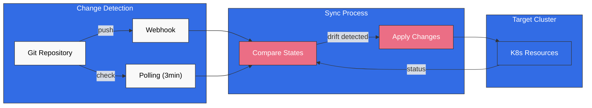
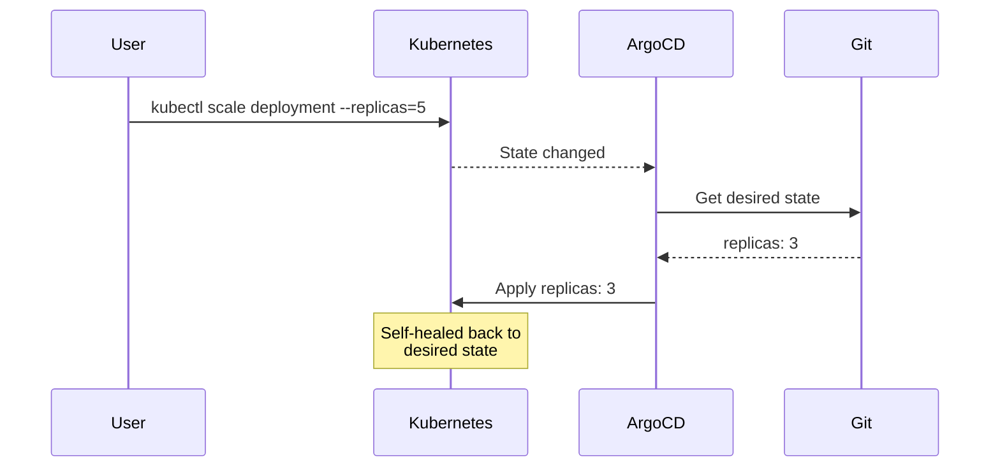
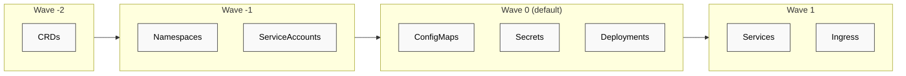
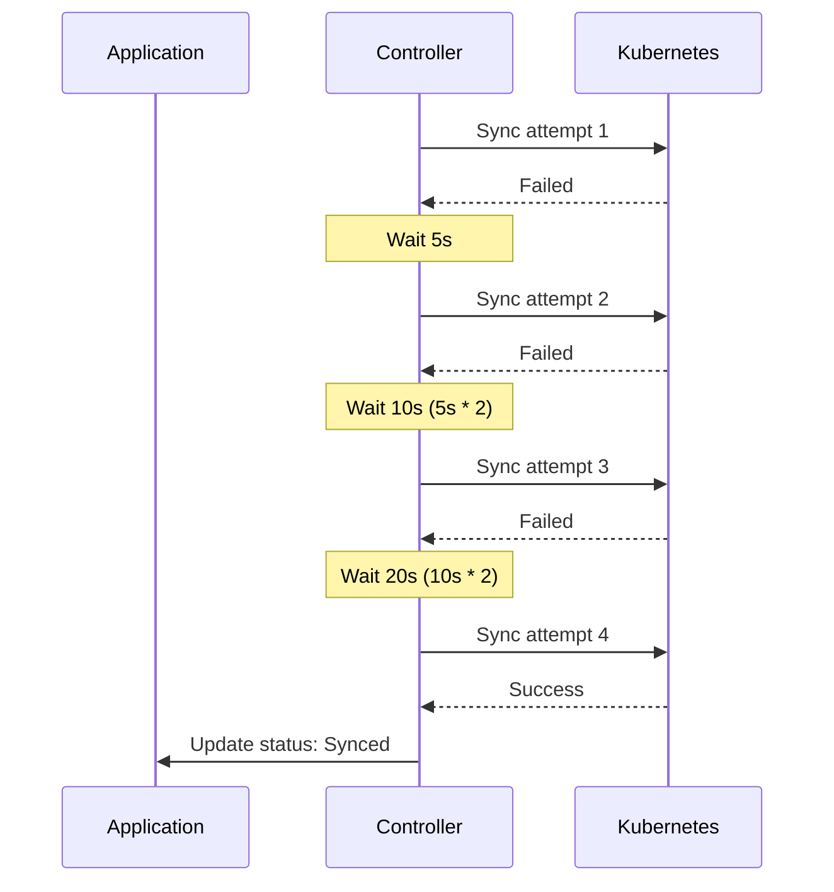

# Estrategias de sincronización de ArgoCD

> **Versiones compatibles**: ArgoCD v2.9+
> **Última actualización**: February 22, 2026

## Tabla de contenido
- [Sincronización manual frente a automatizada](#manual-vs-automated-sync)
- [Políticas de sincronización automática](#auto-sync-policies)
- [Opciones de sincronización](#sync-options)
- [Oleadas y fases de sincronización](#sync-waves-and-phases)
- [Ventanas de sincronización](#sync-windows)
- [Personalización de diferencias](#diffing-customization)
- [Políticas de reintento](#retry-policies)
- [Sincronización selectiva](#selective-sync)

## Sincronización manual frente a automatizada

ArgoCD admite dos modos de sincronización: manual y automatizado.

### Sincronización manual

En el modo manual, los usuarios deben activar explícitamente la sincronización:

```yaml
apiVersion: argoproj.io/v1alpha1
kind: Application
metadata:
  name: manual-sync-app
  namespace: argocd
spec:
  project: default
  source:
    repoURL: https://github.com/myorg/myrepo.git
    targetRevision: HEAD
    path: manifests
  destination:
    server: https://kubernetes.default.svc
    namespace: my-app
  # No syncPolicy.automated = manual sync
```

Activar la sincronización manual:

```bash
# Via CLI
argocd app sync my-app

# Sync specific resources only
argocd app sync my-app --resource ':Deployment:my-deployment'

# Sync with options
argocd app sync my-app --prune --force
```

### Sincronización automatizada

En el modo automatizado, ArgoCD sincroniza automáticamente cuando se detectan cambios:

```yaml
apiVersion: argoproj.io/v1alpha1
kind: Application
metadata:
  name: auto-sync-app
  namespace: argocd
spec:
  project: default
  source:
    repoURL: https://github.com/myorg/myrepo.git
    targetRevision: HEAD
    path: manifests
  destination:
    server: https://kubernetes.default.svc
    namespace: my-app
  syncPolicy:
    automated: {}  # Enable auto-sync with defaults
```



## Políticas de sincronización automática

### Prune

Elimina automáticamente los recursos que ya no existen en Git:

```yaml
syncPolicy:
  automated:
    prune: true
```

**Caso de uso**: Garantizar que el estado del clúster coincida exactamente con el repositorio de Git. Elimina los recursos huérfanos.

**Advertencia**: Ten cuidado con los recursos con ámbito de clúster. Usa la opción `PruneLast` para una poda más segura.

### Self-Heal

Revierte automáticamente los cambios manuales realizados en el clúster:

```yaml
syncPolicy:
  automated:
    selfHeal: true
```

**Caso de uso**: Evitar la deriva de configuración causada por cambios manuales con kubectl u otras herramientas.



### Permitir vacío

Permite aplicaciones sin recursos:

```yaml
syncPolicy:
  automated:
    allowEmpty: true
```

**Caso de uso**: Aplicaciones cuyos recursos se generan de forma condicional o durante la configuración inicial.

### Configuración completa de sincronización automática

```yaml
apiVersion: argoproj.io/v1alpha1
kind: Application
metadata:
  name: fully-automated-app
  namespace: argocd
spec:
  project: default
  source:
    repoURL: https://github.com/myorg/myrepo.git
    targetRevision: HEAD
    path: manifests
  destination:
    server: https://kubernetes.default.svc
    namespace: my-app
  syncPolicy:
    automated:
      prune: true        # Remove orphaned resources
      selfHeal: true     # Revert manual changes
      allowEmpty: false  # Fail if no resources
```

## Opciones de sincronización

Las opciones de sincronización proporcionan control detallado sobre el comportamiento de la sincronización.

### Opciones de sincronización disponibles

| Opción | Descripción | Predeterminado |
|--------|-------------|---------|
| `Validate` | Validar recursos con respecto al esquema | true |
| `CreateNamespace` | Crear el namespace si no existe | false |
| `PrunePropagationPolicy` | Política de propagación de eliminación | foreground |
| `PruneLast` | Podar después de todas las demás sincronizaciones | false |
| `Replace` | Usar replace en lugar de apply | false |
| `FailOnSharedResource` | Fallar si el recurso se administra en otro lugar | false |
| `ApplyOutOfSyncOnly` | Aplicar solo recursos fuera de sincronización | false |
| `ServerSideApply` | Usar apply del lado del servidor | false |
| `RespectIgnoreDifferences` | Respetar ignoreDifferences durante la sincronización | false |

### Opciones a nivel de Application

```yaml
apiVersion: argoproj.io/v1alpha1
kind: Application
metadata:
  name: my-app
  namespace: argocd
spec:
  syncPolicy:
    syncOptions:
      - CreateNamespace=true
      - PrunePropagationPolicy=foreground
      - PruneLast=true
      - Validate=true
      - ApplyOutOfSyncOnly=true
```

### Opciones a nivel de recurso

Aplica opciones de sincronización a recursos específicos mediante anotaciones:

```yaml
apiVersion: apps/v1
kind: Deployment
metadata:
  name: my-deployment
  annotations:
    argocd.argoproj.io/sync-options: Replace=true,Validate=false
spec:
  # ...
```

### Apply del lado del servidor

Usa Kubernetes server-side apply para una mejor detección de conflictos:

```yaml
syncPolicy:
  syncOptions:
    - ServerSideApply=true
```

O por recurso:

```yaml
metadata:
  annotations:
    argocd.argoproj.io/sync-options: ServerSideApply=true
```

**Beneficios**:
- Mejor seguimiento de la propiedad de los campos
- Conflictos de combinación detectados por el servidor de API
- Funciona bien con CRD y webhooks

### Reemplazo forzado

Fuerza el reemplazo de recursos (útil para campos inmutables):

```yaml
metadata:
  annotations:
    argocd.argoproj.io/sync-options: Replace=true
```

**Casos de uso**:
- Jobs (spec inmutable)
- Cambiar la clase de almacenamiento de PVC
- Campos inmutables de ConfigMap/Secret

## Oleadas y fases de sincronización

Las oleadas de sincronización controlan el orden en que se aplican los recursos.

### Cómo funcionan las oleadas

Los recursos se agrupan por número de oleada y se sincronizan en orden:
1. Primero el número de oleada más bajo (puede ser negativo)
2. Dentro de una oleada, los hooks se ejecutan primero y luego los recursos
3. La siguiente oleada comienza solo después de que la anterior finaliza



### Configurar una oleada de sincronización

```yaml
apiVersion: v1
kind: Namespace
metadata:
  name: my-app
  annotations:
    argocd.argoproj.io/sync-wave: "-2"
---
apiVersion: v1
kind: ServiceAccount
metadata:
  name: my-app
  namespace: my-app
  annotations:
    argocd.argoproj.io/sync-wave: "-1"
---
apiVersion: v1
kind: ConfigMap
metadata:
  name: my-config
  namespace: my-app
  annotations:
    argocd.argoproj.io/sync-wave: "0"
---
apiVersion: apps/v1
kind: Deployment
metadata:
  name: my-app
  namespace: my-app
  annotations:
    argocd.argoproj.io/sync-wave: "1"
---
apiVersion: v1
kind: Service
metadata:
  name: my-app
  namespace: my-app
  annotations:
    argocd.argoproj.io/sync-wave: "2"
```

### Combinar oleadas con hooks

```yaml
# PreSync hook in wave -5
apiVersion: batch/v1
kind: Job
metadata:
  name: db-init
  annotations:
    argocd.argoproj.io/hook: PreSync
    argocd.argoproj.io/sync-wave: "-5"
    argocd.argoproj.io/hook-delete-policy: HookSucceeded
spec:
  template:
    spec:
      containers:
        - name: init
          image: myapp/db-init:latest
          command: ["./init-db.sh"]
      restartPolicy: Never
---
# PreSync hook in wave -3 (runs after db-init)
apiVersion: batch/v1
kind: Job
metadata:
  name: db-migrate
  annotations:
    argocd.argoproj.io/hook: PreSync
    argocd.argoproj.io/sync-wave: "-3"
    argocd.argoproj.io/hook-delete-policy: HookSucceeded
spec:
  template:
    spec:
      containers:
        - name: migrate
          image: myapp/migrations:latest
          command: ["./migrate.sh"]
      restartPolicy: Never
```

### Ejemplo completo de ordenación

```yaml
# Order: CRDs -> Namespaces -> RBAC -> ConfigMaps -> Deployments -> Services -> Ingress

# Wave -5: Custom Resource Definitions
apiVersion: apiextensions.k8s.io/v1
kind: CustomResourceDefinition
metadata:
  name: myresources.example.com
  annotations:
    argocd.argoproj.io/sync-wave: "-5"
spec:
  group: example.com
  names:
    kind: MyResource
    plural: myresources
  scope: Namespaced
  versions:
    - name: v1
      served: true
      storage: true
      schema:
        openAPIV3Schema:
          type: object
---
# Wave -4: Namespace
apiVersion: v1
kind: Namespace
metadata:
  name: my-app
  annotations:
    argocd.argoproj.io/sync-wave: "-4"
---
# Wave -3: RBAC
apiVersion: v1
kind: ServiceAccount
metadata:
  name: my-app
  namespace: my-app
  annotations:
    argocd.argoproj.io/sync-wave: "-3"
---
apiVersion: rbac.authorization.k8s.io/v1
kind: Role
metadata:
  name: my-app
  namespace: my-app
  annotations:
    argocd.argoproj.io/sync-wave: "-3"
rules:
  - apiGroups: [""]
    resources: ["configmaps", "secrets"]
    verbs: ["get", "list", "watch"]
---
# Wave -2: Configuration
apiVersion: v1
kind: ConfigMap
metadata:
  name: my-config
  namespace: my-app
  annotations:
    argocd.argoproj.io/sync-wave: "-2"
data:
  config.yaml: |
    server:
      port: 8080
---
# Wave 0: Application (default)
apiVersion: apps/v1
kind: Deployment
metadata:
  name: my-app
  namespace: my-app
  # No wave annotation = wave 0
spec:
  replicas: 3
  selector:
    matchLabels:
      app: my-app
  template:
    metadata:
      labels:
        app: my-app
    spec:
      serviceAccountName: my-app
      containers:
        - name: app
          image: myapp:v1.0.0
          ports:
            - containerPort: 8080
---
# Wave 1: Networking
apiVersion: v1
kind: Service
metadata:
  name: my-app
  namespace: my-app
  annotations:
    argocd.argoproj.io/sync-wave: "1"
spec:
  selector:
    app: my-app
  ports:
    - port: 80
      targetPort: 8080
---
# Wave 2: External access
apiVersion: networking.k8s.io/v1
kind: Ingress
metadata:
  name: my-app
  namespace: my-app
  annotations:
    argocd.argoproj.io/sync-wave: "2"
spec:
  ingressClassName: nginx
  rules:
    - host: myapp.example.com
      http:
        paths:
          - path: /
            pathType: Prefix
            backend:
              service:
                name: my-app
                port:
                  number: 80
```

## Ventanas de sincronización

Las ventanas de sincronización restringen cuándo las aplicaciones pueden sincronizarse.

### Ventanas de permiso

Permiten la sincronización solo durante horas específicas:

```yaml
apiVersion: argoproj.io/v1alpha1
kind: AppProject
metadata:
  name: production
  namespace: argocd
spec:
  syncWindows:
    # Allow sync weekdays 9am-5pm UTC
    - kind: allow
      schedule: '0 9 * * 1-5'
      duration: 8h
      applications:
        - '*'
      namespaces:
        - 'production'
      clusters:
        - 'https://production-cluster'

    # Allow emergency sync window (can be manually activated)
    - kind: allow
      schedule: '0 0 * * *'
      duration: 24h
      applications:
        - '*'
      manualSync: true
```

### Ventanas de denegación

Bloquean la sincronización durante horas específicas:

```yaml
apiVersion: argoproj.io/v1alpha1
kind: AppProject
metadata:
  name: production
  namespace: argocd
spec:
  syncWindows:
    # Deny sync during peak hours
    - kind: deny
      schedule: '0 12 * * *'
      duration: 2h
      applications:
        - 'critical-*'

    # Deny sync during weekends
    - kind: deny
      schedule: '0 0 * * 0,6'
      duration: 24h
      applications:
        - '*'
      namespaces:
        - 'production'
```

### Configuración de ventanas

```yaml
syncWindows:
  - kind: allow                    # allow or deny
    schedule: '0 22 * * *'         # Cron expression (UTC)
    duration: 1h                   # Duration: Ns, Nm, Nh
    applications:                  # Application name patterns
      - 'prod-*'
      - 'frontend'
    namespaces:                    # Target namespaces
      - 'production'
    clusters:                      # Target clusters
      - 'https://production.k8s'
    manualSync: false              # Allow manual sync override
    timeZone: 'America/New_York'   # Optional timezone (default UTC)
```

### Anular una ventana de sincronización

Para emergencias, la sincronización manual puede anular las ventanas de denegación:

```bash
# Force sync even in deny window (requires manualSync: true in allow window)
argocd app sync my-app --force
```

## Personalización de diferencias

### Ignorar diferencias

Configura ArgoCD para ignorar campos específicos:

```yaml
apiVersion: argoproj.io/v1alpha1
kind: Application
metadata:
  name: my-app
  namespace: argocd
spec:
  ignoreDifferences:
    # Ignore all annotations
    - group: ""
      kind: Service
      jsonPointers:
        - /metadata/annotations

    # Ignore specific field by JQ expression
    - group: apps
      kind: Deployment
      jqPathExpressions:
        - .spec.template.spec.containers[].resources

    # Ignore for specific named resource
    - group: apps
      kind: Deployment
      name: my-deployment
      namespace: production
      jsonPointers:
        - /spec/replicas

    # Ignore managed fields from specific controllers
    - group: "*"
      kind: "*"
      managedFieldsManagers:
        - kube-controller-manager
        - cluster-autoscaler
```

### Configuración global de diferencias

En `argocd-cm`:

```yaml
apiVersion: v1
kind: ConfigMap
metadata:
  name: argocd-cm
  namespace: argocd
data:
  # Ignore aggregated cluster roles
  resource.compareoptions: |
    ignoreAggregatedRoles: true

  # Global ignore patterns
  resource.customizations.ignoreDifferences.all: |
    managedFieldsManagers:
      - kube-controller-manager
    jsonPointers:
      - /metadata/annotations/kubectl.kubernetes.io~1last-applied-configuration

  # Ignore for specific resource type
  resource.customizations.ignoreDifferences.admissionregistration.k8s.io_MutatingWebhookConfiguration: |
    jqPathExpressions:
      - .webhooks[]?.clientConfig.caBundle
```

### Ignorar el estado de los recursos

Ignora todos los campos de estado:

```yaml
resource.compareoptions: |
  ignoreResourceStatusField: all
```

O para tipos específicos:

```yaml
resource.compareoptions: |
  ignoreResourceStatusField: crd
```

## Políticas de reintento

Configura el reintento automático ante fallos de sincronización.

### Configuración básica de reintentos

```yaml
apiVersion: argoproj.io/v1alpha1
kind: Application
metadata:
  name: my-app
  namespace: argocd
spec:
  syncPolicy:
    retry:
      limit: 5          # Maximum retry attempts
      backoff:
        duration: 5s    # Initial delay
        factor: 2       # Multiplier for each retry
        maxDuration: 3m # Maximum delay
```

### Flujo de reintento



### Reintentar solo ante errores específicos

Actualmente, ArgoCD reintenta ante todos los fallos de sincronización. Para un control detallado, usa hooks:

```yaml
apiVersion: batch/v1
kind: Job
metadata:
  name: check-prerequisites
  annotations:
    argocd.argoproj.io/hook: PreSync
    argocd.argoproj.io/hook-delete-policy: BeforeHookCreation
spec:
  backoffLimit: 5  # Job-level retries
  template:
    spec:
      containers:
        - name: check
          image: busybox
          command:
            - sh
            - -c
            - |
              # Check if external dependency is ready
              until nc -z external-service 443; do
                echo "Waiting for external-service..."
                sleep 5
              done
              echo "Prerequisites met"
      restartPolicy: Never
```

## Sincronización selectiva

Sincroniza solo recursos específicos dentro de una aplicación.

### Mediante la CLI

```bash
# Sync specific resource by kind and name
argocd app sync my-app --resource ':Deployment:my-deployment'

# Sync resources by group
argocd app sync my-app --resource 'apps:Deployment:*'

# Sync multiple resources
argocd app sync my-app \
  --resource ':ConfigMap:my-config' \
  --resource ':Secret:my-secret' \
  --resource 'apps:Deployment:my-deployment'

# Sync by label
argocd app sync my-app --label 'app.kubernetes.io/component=backend'
```

### Opciones de sincronización para la sincronización selectiva

```bash
# Apply only out-of-sync resources
argocd app sync my-app --apply-out-of-sync-only

# Preview what would be synced
argocd app sync my-app --dry-run

# Sync with prune
argocd app sync my-app --prune
```

### Formato de la ruta de recursos

```
<group>:<kind>:<name>

Examples:
:ConfigMap:my-config                 # Core API group
apps:Deployment:my-deployment        # apps API group
networking.k8s.io:Ingress:my-ingress # networking.k8s.io group
*:*:*                                # All resources
```

## Cuestionario

Para poner a prueba lo que has aprendido, prueba el [cuestionario sobre estrategias de sincronización de ArgoCD](../../quizzes/gitops/argocd/03-sync-strategies-quiz.md).
