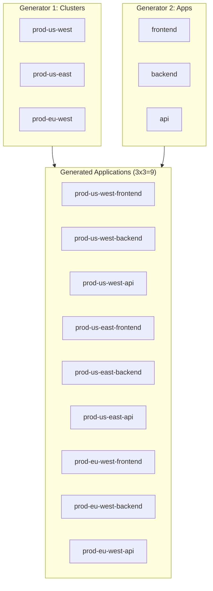
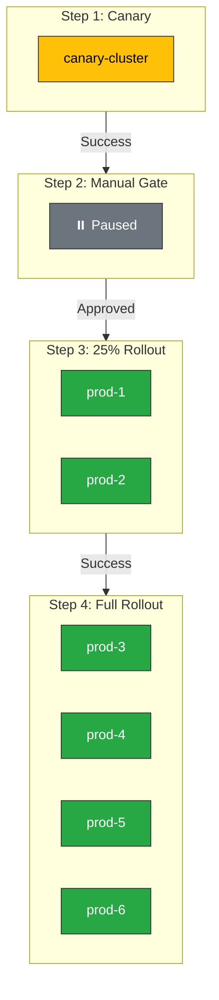

# ArgoCD ApplicationSets

> **Versiones compatibles**: ArgoCD v2.9+, ApplicationSet Controller v0.4+
> **Última actualización**: February 22, 2026

## Tabla de contenidos
- [Descripción general de ApplicationSet](#applicationset-overview)
- [Generadores](#generators)
- [Plantillas de Go](#go-templating)
- [Sincronización progresiva](#progressive-sync)
- [Patrones multi-cluster](#multi-cluster-patterns)
- [Parches de plantilla](#template-patches)

## Descripción general de ApplicationSet

ApplicationSet es un controller de Kubernetes que añade soporte para generar Applications de ArgoCD a partir de plantillas. Permite administrar varias aplicaciones con configuraciones similares entre clusters, entornos o repositorios.

### Cuándo usar ApplicationSet

| Escenario | ¿Usar ApplicationSet? |
|----------|---------------------|
| La misma aplicación en varios clusters | Sí |
| Varios entornos (dev/staging/prod) | Sí |
| Monorepo con muchos servicios | Sí |
| Entornos dinámicos desde PRs | Sí |
| Despliegue de una sola aplicación | No (use Application) |

### Estructura básica

```yaml
apiVersion: argoproj.io/v1alpha1
kind: ApplicationSet
metadata:
  name: my-appset
  namespace: argocd
spec:
  generators:
    - list:
        elements:
          - cluster: dev
            url: https://dev.k8s.local
          - cluster: prod
            url: https://prod.k8s.local
  template:
    metadata:
      name: '{{cluster}}-myapp'
    spec:
      project: default
      source:
        repoURL: https://github.com/myorg/myrepo.git
        targetRevision: HEAD
        path: 'overlays/{{cluster}}'
      destination:
        server: '{{url}}'
        namespace: myapp
```

## Generadores

Los generadores producen parámetros que se sustituyen en la plantilla para crear Applications.

### 1. Generador de lista

El generador más sencillo: define una lista estática de valores:

```yaml
apiVersion: argoproj.io/v1alpha1
kind: ApplicationSet
metadata:
  name: list-example
  namespace: argocd
spec:
  generators:
    - list:
        elements:
          - cluster: dev
            url: https://kubernetes.default.svc
            namespace: dev
            values:
              replicas: "1"
              logLevel: debug
          - cluster: staging
            url: https://staging.k8s.local
            namespace: staging
            values:
              replicas: "2"
              logLevel: info
          - cluster: production
            url: https://production.k8s.local
            namespace: production
            values:
              replicas: "5"
              logLevel: warn
  template:
    metadata:
      name: 'myapp-{{cluster}}'
      labels:
        environment: '{{cluster}}'
    spec:
      project: default
      source:
        repoURL: https://github.com/myorg/myapp.git
        targetRevision: HEAD
        path: manifests
        helm:
          parameters:
            - name: replicaCount
              value: '{{values.replicas}}'
            - name: logging.level
              value: '{{values.logLevel}}'
      destination:
        server: '{{url}}'
        namespace: '{{namespace}}'
      syncPolicy:
        automated:
          prune: true
          selfHeal: true
```

### 2. Generador de clusters

Selecciona automáticamente los clusters registrados de ArgoCD:

```yaml
apiVersion: argoproj.io/v1alpha1
kind: ApplicationSet
metadata:
  name: cluster-example
  namespace: argocd
spec:
  generators:
    - clusters:
        # Select all clusters
        selector: {}

        # Or select by labels
        # selector:
        #   matchLabels:
        #     environment: production
        #     region: us-west-2

        # Available built-in variables:
        # {{name}} - cluster name
        # {{server}} - cluster API server URL
        # {{metadata.labels.<key>}} - cluster labels
        # {{metadata.annotations.<key>}} - cluster annotations

        # Add custom values per cluster
        values:
          clusterName: '{{name}}'
  template:
    metadata:
      name: '{{name}}-guestbook'
    spec:
      project: default
      source:
        repoURL: https://github.com/argoproj/argocd-example-apps.git
        targetRevision: HEAD
        path: guestbook
      destination:
        server: '{{server}}'
        namespace: guestbook
```

#### Etiquetas de cluster para la selección

Primero, añada etiquetas a los Secrets de su cluster:

```yaml
apiVersion: v1
kind: Secret
metadata:
  name: production-cluster
  namespace: argocd
  labels:
    argocd.argoproj.io/secret-type: cluster
    environment: production
    region: us-west-2
    tier: critical
type: Opaque
stringData:
  name: production
  server: https://production.k8s.local
  config: |
    {
      "tlsClientConfig": {
        "insecure": false,
        "caData": "..."
      }
    }
```

Luego seleccione clusters por etiqueta:

```yaml
generators:
  - clusters:
      selector:
        matchLabels:
          environment: production
        matchExpressions:
          - key: tier
            operator: In
            values:
              - critical
              - high
```

### 3. Generador Git: directorios

Examine un repositorio Git en busca de directorios:

```yaml
apiVersion: argoproj.io/v1alpha1
kind: ApplicationSet
metadata:
  name: git-directories
  namespace: argocd
spec:
  generators:
    - git:
        repoURL: https://github.com/myorg/gitops-repo.git
        revision: HEAD
        directories:
          # Include all directories under apps/
          - path: apps/*
          # Exclude specific directories
          - path: apps/excluded-app
            exclude: true
  template:
    metadata:
      name: '{{path.basename}}'
    spec:
      project: default
      source:
        repoURL: https://github.com/myorg/gitops-repo.git
        targetRevision: HEAD
        path: '{{path}}'
      destination:
        server: https://kubernetes.default.svc
        namespace: '{{path.basename}}'
```

#### Estructura del repositorio para el generador de directorios

```
gitops-repo/
├── apps/
│   ├── frontend/
│   │   ├── deployment.yaml
│   │   └── service.yaml
│   ├── backend/
│   │   ├── deployment.yaml
│   │   └── service.yaml
│   ├── database/
│   │   ├── statefulset.yaml
│   │   └── service.yaml
│   └── excluded-app/    # Excluded via generator
│       └── ...
```

### 4. Generador Git: archivos

Lea la configuración desde archivos JSON/YAML en Git:

```yaml
apiVersion: argoproj.io/v1alpha1
kind: ApplicationSet
metadata:
  name: git-files
  namespace: argocd
spec:
  generators:
    - git:
        repoURL: https://github.com/myorg/gitops-repo.git
        revision: HEAD
        files:
          - path: "config/**/config.json"
  template:
    metadata:
      name: '{{cluster.name}}-{{app.name}}'
      labels:
        environment: '{{cluster.environment}}'
    spec:
      project: default
      source:
        repoURL: '{{app.repoURL}}'
        targetRevision: '{{app.revision}}'
        path: '{{app.path}}'
        helm:
          valueFiles:
            - values.yaml
            - 'values-{{cluster.environment}}.yaml'
      destination:
        server: '{{cluster.server}}'
        namespace: '{{app.namespace}}'
```

#### Ejemplo de archivo de configuración

```json
// config/production/us-west-2/config.json
{
  "cluster": {
    "name": "prod-us-west-2",
    "server": "https://prod-usw2.k8s.local",
    "environment": "production"
  },
  "app": {
    "name": "myapp",
    "repoURL": "https://github.com/myorg/myapp.git",
    "revision": "v1.2.3",
    "path": "charts/myapp",
    "namespace": "myapp-prod"
  }
}
```

### 5. Generador Matrix

Combine dos generadores para crear un producto cartesiano:

```yaml
apiVersion: argoproj.io/v1alpha1
kind: ApplicationSet
metadata:
  name: matrix-example
  namespace: argocd
spec:
  generators:
    - matrix:
        generators:
          # First generator: clusters
          - clusters:
              selector:
                matchLabels:
                  environment: production
          # Second generator: applications
          - git:
              repoURL: https://github.com/myorg/apps.git
              revision: HEAD
              directories:
                - path: apps/*
  template:
    metadata:
      # Combines cluster name with app name
      name: '{{name}}-{{path.basename}}'
    spec:
      project: default
      source:
        repoURL: https://github.com/myorg/apps.git
        targetRevision: HEAD
        path: '{{path}}'
      destination:
        server: '{{server}}'
        namespace: '{{path.basename}}'
```

#### Visualización de Matrix



### 6. Generador Merge

Fusione las salidas de varios generadores combinando parámetros:

```yaml
apiVersion: argoproj.io/v1alpha1
kind: ApplicationSet
metadata:
  name: merge-example
  namespace: argocd
spec:
  generators:
    - merge:
        mergeKeys:
          - cluster
        generators:
          # Base configuration for all clusters
          - list:
              elements:
                - cluster: dev
                  replicas: "1"
                - cluster: staging
                  replicas: "2"
                - cluster: production
                  replicas: "5"

          # Override specific cluster settings
          - list:
              elements:
                - cluster: production
                  replicas: "10"  # Override for production
                  enableHA: "true"
  template:
    metadata:
      name: 'myapp-{{cluster}}'
    spec:
      project: default
      source:
        repoURL: https://github.com/myorg/myapp.git
        targetRevision: HEAD
        path: manifests
        helm:
          parameters:
            - name: replicas
              value: '{{replicas}}'
            - name: highAvailability
              value: '{{enableHA}}'
      destination:
        server: https://kubernetes.default.svc
        namespace: '{{cluster}}'
```

### 7. Generador de proveedor SCM

Examine organizaciones de GitHub/GitLab en busca de repositorios:

#### GitHub

```yaml
apiVersion: argoproj.io/v1alpha1
kind: ApplicationSet
metadata:
  name: github-org-apps
  namespace: argocd
spec:
  generators:
    - scmProvider:
        github:
          organization: myorg
          # Optional: filter by topics
          # allBranches: false
          # tokenRef:
          #   secretName: github-token
          #   key: token
        filters:
          - repositoryMatch: "^service-.*"
          - pathsExist:
              - kubernetes/
          - labelMatch: "deploy-to-k8s"
  template:
    metadata:
      name: '{{repository}}'
    spec:
      project: default
      source:
        repoURL: '{{url}}'
        targetRevision: '{{branch}}'
        path: kubernetes
      destination:
        server: https://kubernetes.default.svc
        namespace: '{{repository}}'
```

#### GitLab

```yaml
apiVersion: argoproj.io/v1alpha1
kind: ApplicationSet
metadata:
  name: gitlab-group-apps
  namespace: argocd
spec:
  generators:
    - scmProvider:
        gitlab:
          group: mygroup
          includeSubgroups: true
          # tokenRef:
          #   secretName: gitlab-token
          #   key: token
        filters:
          - pathsExist:
              - deploy/
  template:
    metadata:
      name: '{{repository}}'
    spec:
      project: default
      source:
        repoURL: '{{url}}'
        targetRevision: '{{branch}}'
        path: deploy
      destination:
        server: https://kubernetes.default.svc
        namespace: '{{repository}}'
```

### 8. Generador de Pull Request

Cree entornos para pull requests:

```yaml
apiVersion: argoproj.io/v1alpha1
kind: ApplicationSet
metadata:
  name: pr-environments
  namespace: argocd
spec:
  generators:
    - pullRequest:
        github:
          owner: myorg
          repo: myapp
          tokenRef:
            secretName: github-token
            key: token
          labels:
            - preview
        requeueAfterSeconds: 180
  template:
    metadata:
      name: 'pr-{{number}}-{{branch_slug}}'
      labels:
        preview: "true"
        pr-number: '{{number}}'
    spec:
      project: default
      source:
        repoURL: https://github.com/myorg/myapp.git
        targetRevision: '{{head_sha}}'
        path: kubernetes
        kustomize:
          nameSuffix: '-pr-{{number}}'
          images:
            - 'myapp:pr-{{number}}'
      destination:
        server: https://kubernetes.default.svc
        namespace: 'preview-{{number}}'
      syncPolicy:
        automated:
          prune: true
          selfHeal: true
        syncOptions:
          - CreateNamespace=true
```

### 9. Generador de recursos de decisión de cluster

Delegue la selección del cluster a un recurso externo:

```yaml
apiVersion: argoproj.io/v1alpha1
kind: ApplicationSet
metadata:
  name: cluster-decision
  namespace: argocd
spec:
  generators:
    - clusterDecisionResource:
        configMapRef: cluster-decision-cm
        name: selected-clusters
        requeueAfterSeconds: 180
  template:
    metadata:
      name: '{{clusterName}}-app'
    spec:
      project: default
      source:
        repoURL: https://github.com/myorg/myapp.git
        targetRevision: HEAD
        path: manifests
      destination:
        server: '{{clusterServer}}'
        namespace: myapp
```

Recurso de decisión externo:

```yaml
apiVersion: v1
kind: ConfigMap
metadata:
  name: cluster-decision-cm
  namespace: argocd
data:
  ducktypeVersion: v1
  statusListKey: clusters
---
apiVersion: external.decision/v1
kind: ClusterDecision
metadata:
  name: selected-clusters
  namespace: argocd
status:
  clusters:
    - clusterName: prod-us-west
      clusterServer: https://prod-usw.k8s.local
    - clusterName: prod-eu-west
      clusterServer: https://prod-euw.k8s.local
```

### 10. Generador de plugins

Ejecute lógica de generador personalizada mediante ConfigMap:

```yaml
apiVersion: argoproj.io/v1alpha1
kind: ApplicationSet
metadata:
  name: plugin-example
  namespace: argocd
spec:
  generators:
    - plugin:
        configMapRef:
          name: plugin-generator
        input:
          parameters:
            environment: production
            region: us-west-2
        requeueAfterSeconds: 300
  template:
    metadata:
      name: '{{name}}'
    spec:
      project: default
      source:
        repoURL: '{{repoURL}}'
        targetRevision: '{{revision}}'
        path: '{{path}}'
      destination:
        server: '{{server}}'
        namespace: '{{namespace}}'
```

## Plantillas de Go

ApplicationSet utiliza plantillas de Go para la sustitución de parámetros.

### Sintaxis básica

```yaml
template:
  metadata:
    name: '{{cluster}}-{{app}}'           # Simple substitution
    labels:
      env: '{{values.environment}}'       # Nested values
```

### Funciones

```yaml
template:
  metadata:
    # Normalize strings
    name: '{{normalize .cluster}}'

    # String manipulation
    labels:
      lower: '{{.cluster | lower}}'
      upper: '{{.cluster | upper}}'
      trimmed: '{{.cluster | trim}}'

    annotations:
      # Conditional
      tier: '{{if eq .env "prod"}}critical{{else}}standard{{end}}'
```

### Plantillas avanzadas

```yaml
apiVersion: argoproj.io/v1alpha1
kind: ApplicationSet
metadata:
  name: advanced-template
  namespace: argocd
spec:
  goTemplate: true
  goTemplateOptions:
    - missingkey=error
  generators:
    - list:
        elements:
          - name: app1
            env: prod
            regions:
              - us-west-2
              - us-east-1
  template:
    metadata:
      name: '{{.name}}-{{.env}}'
      annotations:
        regions: '{{range $i, $r := .regions}}{{if $i}},{{end}}{{$r}}{{end}}'
```

## Sincronización progresiva

Controle el despliegue entre aplicaciones con RollingSync.

### Estrategia RollingSync

```yaml
apiVersion: argoproj.io/v1alpha1
kind: ApplicationSet
metadata:
  name: progressive-rollout
  namespace: argocd
spec:
  generators:
    - clusters:
        selector:
          matchLabels:
            environment: production
  strategy:
    type: RollingSync
    rollingSync:
      steps:
        # Step 1: Deploy to canary cluster
        - matchExpressions:
            - key: tier
              operator: In
              values:
                - canary
          maxUpdate: 1

        # Step 2: Wait for manual approval
        - matchExpressions:
            - key: tier
              operator: In
              values:
                - production
          maxUpdate: 0  # Pause here

        # Step 3: Deploy to 25% of prod clusters
        - matchExpressions:
            - key: tier
              operator: In
              values:
                - production
          maxUpdate: 25%

        # Step 4: Deploy to remaining prod clusters
        - matchExpressions:
            - key: tier
              operator: In
              values:
                - production
  template:
    metadata:
      name: '{{name}}-myapp'
    spec:
      project: default
      source:
        repoURL: https://github.com/myorg/myapp.git
        targetRevision: HEAD
        path: manifests
      destination:
        server: '{{server}}'
        namespace: myapp
```

### Flujo de sincronización progresiva



## Patrones multi-cluster

### Patrón hub-and-spoke

ArgoCD central que administra varios clusters:

```yaml
apiVersion: argoproj.io/v1alpha1
kind: ApplicationSet
metadata:
  name: hub-spoke-platform
  namespace: argocd
spec:
  generators:
    - matrix:
        generators:
          - clusters:
              selector:
                matchLabels:
                  managed-by: hub
          - list:
              elements:
                - app: monitoring
                  chart: kube-prometheus-stack
                  repo: https://prometheus-community.github.io/helm-charts
                  version: "55.5.0"
                - app: logging
                  chart: loki-stack
                  repo: https://grafana.github.io/helm-charts
                  version: "2.10.0"
                - app: ingress
                  chart: ingress-nginx
                  repo: https://kubernetes.github.io/ingress-nginx
                  version: "4.9.0"
  template:
    metadata:
      name: '{{name}}-{{app}}'
    spec:
      project: platform
      source:
        repoURL: '{{repo}}'
        chart: '{{chart}}'
        targetRevision: '{{version}}'
      destination:
        server: '{{server}}'
        namespace: '{{app}}'
      syncPolicy:
        automated:
          prune: true
          selfHeal: true
        syncOptions:
          - CreateNamespace=true
```

### Patrón de promoción de entornos

```yaml
apiVersion: argoproj.io/v1alpha1
kind: ApplicationSet
metadata:
  name: environment-promotion
  namespace: argocd
spec:
  generators:
    - git:
        repoURL: https://github.com/myorg/env-config.git
        revision: HEAD
        files:
          - path: "environments/*/config.yaml"
  template:
    metadata:
      name: 'myapp-{{environment}}'
      annotations:
        argocd.argoproj.io/sync-wave: '{{syncWave}}'
    spec:
      project: default
      source:
        repoURL: https://github.com/myorg/myapp.git
        targetRevision: '{{gitRevision}}'
        path: kubernetes
        kustomize:
          images:
            - 'myapp:{{imageTag}}'
      destination:
        server: '{{clusterUrl}}'
        namespace: '{{namespace}}'
```

Archivos de configuración:

```yaml
# environments/dev/config.yaml
environment: dev
namespace: myapp-dev
clusterUrl: https://dev.k8s.local
gitRevision: HEAD
imageTag: latest
syncWave: "0"

# environments/staging/config.yaml
environment: staging
namespace: myapp-staging
clusterUrl: https://staging.k8s.local
gitRevision: release-candidate
imageTag: rc-1.2.3
syncWave: "1"

# environments/production/config.yaml
environment: production
namespace: myapp-prod
clusterUrl: https://production.k8s.local
gitRevision: v1.2.3
imageTag: v1.2.3
syncWave: "2"
```

## Parches de plantilla

Sobrescriba campos de plantilla según la salida del generador.

### Parche básico

```yaml
apiVersion: argoproj.io/v1alpha1
kind: ApplicationSet
metadata:
  name: patched-apps
  namespace: argocd
spec:
  generators:
    - list:
        elements:
          - name: app1
            env: dev
          - name: app2
            env: prod
  template:
    metadata:
      name: '{{name}}'
    spec:
      project: default
      source:
        repoURL: https://github.com/myorg/apps.git
        targetRevision: HEAD
        path: '{{name}}'
      destination:
        server: https://kubernetes.default.svc
        namespace: '{{name}}'
  templatePatch: |
    {{- if eq .env "prod" }}
    spec:
      syncPolicy:
        automated:
          prune: true
          selfHeal: true
    {{- end }}
```

### Parche de fusión estratégica

```yaml
apiVersion: argoproj.io/v1alpha1
kind: ApplicationSet
metadata:
  name: strategic-patch
  namespace: argocd
spec:
  generators:
    - list:
        elements:
          - cluster: dev
            autoSync: "false"
          - cluster: prod
            autoSync: "true"
  template:
    metadata:
      name: 'app-{{cluster}}'
    spec:
      project: default
      source:
        repoURL: https://github.com/myorg/apps.git
        targetRevision: HEAD
        path: app
      destination:
        server: https://kubernetes.default.svc
        namespace: app-{{cluster}}
  templatePatch: |
    spec:
      {{- if eq .autoSync "true" }}
      syncPolicy:
        automated:
          prune: true
          selfHeal: true
      {{- else }}
      syncPolicy: {}
      {{- end }}
```

## Cuestionario

Para poner a prueba lo que ha aprendido, pruebe el [cuestionario de ArgoCD ApplicationSets](../../quizzes/gitops/argocd/04-applicationsets-quiz.md).
