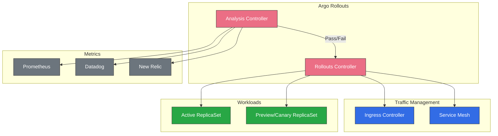
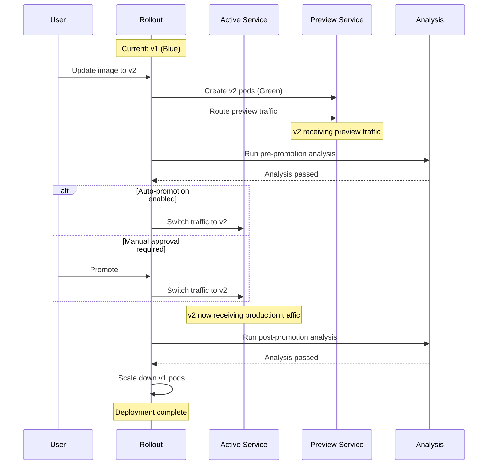
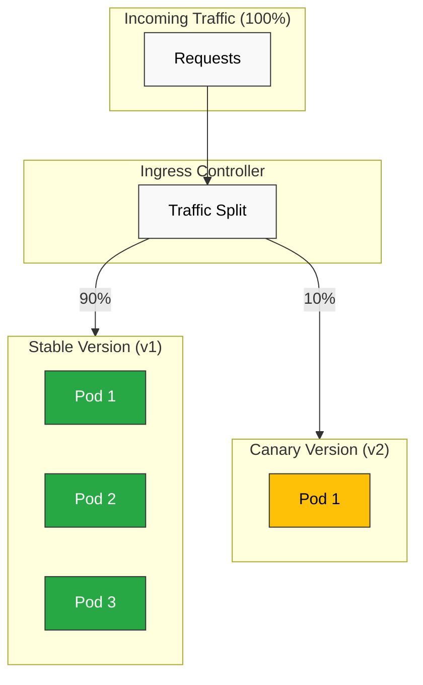

# Gestión de tráfico de ArgoCD

> **Versiones compatibles**: Argo Rollouts v1.6+, ArgoCD v2.9+
> **Última actualización**: July 15, 2026

## Tabla de contenidos
- [Descripción general de Argo Rollouts](#argo-rollouts-overview)
- [Instalación](#installation)
- [Despliegues blue-green](#blue-green-deployments)
- [Despliegues canary](#canary-deployments)
- [Análisis y verificación](#analysis-and-verification)
- [Integración de Ingress](#ingress-integration)
- [Estrategias de rollback](#rollback-strategies)
- [Experimentos](#experiments)
- [Notificaciones](#notifications)

## Descripción general de Argo Rollouts

Argo Rollouts es un controlador de Kubernetes que proporciona capacidades avanzadas de despliegue, incluidos los despliegues blue-green, los despliegues canary y las funcionalidades de entrega progresiva.

### ¿Por qué Argo Rollouts?

Los Deployments estándar de Kubernetes solo admiten actualizaciones continuas. Argo Rollouts amplía estas capacidades con:

| Funcionalidad | Deployment de K8s | Argo Rollouts |
|---------|----------------|---------------|
| Actualización continua | Sí | Sí |
| Blue-Green | No | Sí |
| Canary | No | Sí |
| División de tráfico | No | Sí |
| Rollback automatizado | No | Sí |
| Análisis/verificación | No | Sí |
| Pausar/reanudar | No | Sí |
| Experimentos | No | Sí |

### Arquitectura



## Instalación

### Instalar el controlador de Argo Rollouts

```bash
# Create namespace
kubectl create namespace argo-rollouts

# Install controller
kubectl apply -n argo-rollouts -f https://github.com/argoproj/argo-rollouts/releases/latest/download/install.yaml

# Verify installation
kubectl get pods -n argo-rollouts
```

### Instalar el plugin de kubectl

```bash
# macOS
brew install argoproj/tap/kubectl-argo-rollouts

# Linux
curl -LO https://github.com/argoproj/argo-rollouts/releases/latest/download/kubectl-argo-rollouts-linux-amd64
chmod +x kubectl-argo-rollouts-linux-amd64
sudo mv kubectl-argo-rollouts-linux-amd64 /usr/local/bin/kubectl-argo-rollouts

# Verify
kubectl argo rollouts version
```

### Instalar mediante Helm

```bash
helm repo add argo https://argoproj.github.io/argo-helm
helm repo update

helm install argo-rollouts argo/argo-rollouts \
  --namespace argo-rollouts \
  --create-namespace \
  --set dashboard.enabled=true
```

### Valores de Helm para producción

```yaml
controller:
  replicas: 2
  metrics:
    enabled: true
    serviceMonitor:
      enabled: true

dashboard:
  enabled: true
  ingress:
    enabled: true
    ingressClassName: nginx
    hosts:
      - rollouts.example.com
```

## Despliegues blue-green

El despliegue blue-green mantiene dos entornos idénticos y cambia el tráfico entre ellos.

### Rollout blue-green básico

```yaml
apiVersion: argoproj.io/v1alpha1
kind: Rollout
metadata:
  name: myapp
  namespace: myapp
spec:
  replicas: 5
  revisionHistoryLimit: 3
  selector:
    matchLabels:
      app: myapp
  template:
    metadata:
      labels:
        app: myapp
    spec:
      containers:
        - name: myapp
          image: myregistry/myapp:v1.0.0
          ports:
            - containerPort: 8080
          readinessProbe:
            httpGet:
              path: /health
              port: 8080
            initialDelaySeconds: 5
            periodSeconds: 10
          resources:
            requests:
              cpu: 100m
              memory: 128Mi
            limits:
              cpu: 500m
              memory: 512Mi
  strategy:
    blueGreen:
      activeService: myapp-active
      previewService: myapp-preview
      autoPromotionEnabled: false
      scaleDownDelaySeconds: 30
      previewReplicaCount: 2
      prePromotionAnalysis:
        templates:
          - templateName: smoke-tests
        args:
          - name: service-name
            value: myapp-preview
      postPromotionAnalysis:
        templates:
          - templateName: success-rate
---
apiVersion: v1
kind: Service
metadata:
  name: myapp-active
  namespace: myapp
spec:
  selector:
    app: myapp
  ports:
    - port: 80
      targetPort: 8080
---
apiVersion: v1
kind: Service
metadata:
  name: myapp-preview
  namespace: myapp
spec:
  selector:
    app: myapp
  ports:
    - port: 80
      targetPort: 8080
```

### Flujo blue-green



### Blue-green con promoción automática

```yaml
strategy:
  blueGreen:
    activeService: myapp-active
    previewService: myapp-preview
    autoPromotionEnabled: true
    autoPromotionSeconds: 60  # Wait 60s before auto-promoting
    previewReplicaCount: 3
```

## Despliegues canary

El despliegue canary desplaza gradualmente el tráfico a la nueva versión.

### Rollout canary básico

```yaml
apiVersion: argoproj.io/v1alpha1
kind: Rollout
metadata:
  name: myapp-canary
  namespace: myapp
spec:
  replicas: 10
  selector:
    matchLabels:
      app: myapp
  template:
    metadata:
      labels:
        app: myapp
    spec:
      containers:
        - name: myapp
          image: myregistry/myapp:v1.0.0
          ports:
            - containerPort: 8080
  strategy:
    canary:
      canaryService: myapp-canary
      stableService: myapp-stable
      trafficRouting:
        nginx:
          stableIngress: myapp-ingress
      steps:
        # Step 1: 5% traffic to canary
        - setWeight: 5
        - pause: {duration: 2m}

        # Step 2: 10% traffic, run analysis
        - setWeight: 10
        - analysis:
            templates:
              - templateName: success-rate
            args:
              - name: service-name
                value: myapp-canary

        # Step 3: 25% traffic
        - setWeight: 25
        - pause: {duration: 5m}

        # Step 4: 50% traffic
        - setWeight: 50
        - pause: {duration: 5m}

        # Step 5: 75% traffic
        - setWeight: 75
        - analysis:
            templates:
              - templateName: success-rate
              - templateName: latency-check

        # Step 6: 100% traffic (full promotion)
        - setWeight: 100
---
apiVersion: v1
kind: Service
metadata:
  name: myapp-stable
  namespace: myapp
spec:
  selector:
    app: myapp
  ports:
    - port: 80
      targetPort: 8080
---
apiVersion: v1
kind: Service
metadata:
  name: myapp-canary
  namespace: myapp
spec:
  selector:
    app: myapp
  ports:
    - port: 80
      targetPort: 8080
```

### Explicación de los pasos canary

| Tipo de paso | Descripción |
|-----------|-------------|
| `setWeight` | Establece el porcentaje de tráfico para canary |
| `pause` | Espera una duración o aprobación manual |
| `analysis` | Ejecuta AnalysisTemplate |
| `setCanaryScale` | Establece el número de réplicas canary |
| `setHeaderRoute` | Enruta por encabezado (para enrutadores de tráfico) |

### Canary con compuertas manuales

```yaml
strategy:
  canary:
    steps:
      - setWeight: 10
      - pause: {}  # Indefinite pause - requires manual promotion

      - setWeight: 50
      - pause: {duration: 10m}

      - setWeight: 100
```

Promover manualmente:

```bash
# Promote to next step
kubectl argo rollouts promote myapp-canary

# Promote fully (skip remaining steps)
kubectl argo rollouts promote myapp-canary --full
```

### Flujo de tráfico canary



## Análisis y verificación

Los AnalysisTemplates definen cómo verificar el estado del despliegue.

### Análisis con Prometheus

```yaml
apiVersion: argoproj.io/v1alpha1
kind: AnalysisTemplate
metadata:
  name: success-rate
  namespace: myapp
spec:
  args:
    - name: service-name
  metrics:
    - name: success-rate
      interval: 1m
      count: 5
      successCondition: result[0] >= 0.95
      failureLimit: 3
      provider:
        prometheus:
          address: http://prometheus.monitoring:9090
          query: |
            sum(rate(
              http_requests_total{
                service="{{args.service-name}}",
                status=~"2.."
              }[5m]
            )) /
            sum(rate(
              http_requests_total{
                service="{{args.service-name}}"
              }[5m]
            ))
```

### Análisis de latencia

```yaml
apiVersion: argoproj.io/v1alpha1
kind: AnalysisTemplate
metadata:
  name: latency-check
  namespace: myapp
spec:
  args:
    - name: service-name
  metrics:
    - name: p99-latency
      interval: 2m
      count: 3
      successCondition: result[0] < 500  # 500ms threshold
      failureLimit: 2
      provider:
        prometheus:
          address: http://prometheus.monitoring:9090
          query: |
            histogram_quantile(0.99,
              sum(rate(
                http_request_duration_seconds_bucket{
                  service="{{args.service-name}}"
                }[5m]
              )) by (le)
            ) * 1000
```

### Análisis web (endpoint HTTP)

```yaml
apiVersion: argoproj.io/v1alpha1
kind: AnalysisTemplate
metadata:
  name: smoke-tests
  namespace: myapp
spec:
  args:
    - name: service-name
  metrics:
    - name: smoke-test
      interval: 30s
      count: 3
      successCondition: result.status == "healthy"
      failureLimit: 1
      provider:
        web:
          url: "http://{{args.service-name}}/health"
          jsonPath: "{$.status}"
          timeoutSeconds: 10
```

### Análisis con Datadog

```yaml
apiVersion: argoproj.io/v1alpha1
kind: AnalysisTemplate
metadata:
  name: datadog-success-rate
  namespace: myapp
spec:
  args:
    - name: service-name
  metrics:
    - name: error-rate
      interval: 5m
      count: 3
      successCondition: result < 0.05
      failureLimit: 2
      provider:
        datadog:
          apiVersion: v2
          interval: 5m
          query: |
            sum:http.requests{service:{{args.service-name}},status:5xx}.as_count() /
            sum:http.requests{service:{{args.service-name}}}.as_count()
```

### Análisis basado en Job

```yaml
apiVersion: argoproj.io/v1alpha1
kind: AnalysisTemplate
metadata:
  name: integration-tests
  namespace: myapp
spec:
  args:
    - name: service-url
  metrics:
    - name: integration-tests
      provider:
        job:
          spec:
            backoffLimit: 1
            template:
              spec:
                restartPolicy: Never
                containers:
                  - name: test-runner
                    image: myregistry/integration-tests:latest
                    env:
                      - name: TARGET_URL
                        value: "{{args.service-url}}"
                    command:
                      - /bin/sh
                      - -c
                      - |
                        npm run test:integration
                        if [ $? -eq 0 ]; then
                          exit 0
                        else
                          exit 1
                        fi
```

### ClusterAnalysisTemplate

Comparte plantillas de análisis entre namespaces:

```yaml
apiVersion: argoproj.io/v1alpha1
kind: ClusterAnalysisTemplate
metadata:
  name: global-success-rate
spec:
  args:
    - name: service-name
    - name: namespace
  metrics:
    - name: success-rate
      interval: 1m
      count: 5
      successCondition: result[0] >= 0.95
      provider:
        prometheus:
          address: http://prometheus.monitoring:9090
          query: |
            sum(rate(
              http_requests_total{
                namespace="{{args.namespace}}",
                service="{{args.service-name}}",
                status=~"2.."
              }[5m]
            )) /
            sum(rate(
              http_requests_total{
                namespace="{{args.namespace}}",
                service="{{args.service-name}}"
              }[5m]
            ))
```

## Integración de Ingress

Argo Rollouts admite más de 10 proveedores de tráfico. Los proveedores sin integración nativa, como Kong, se admiten mediante el **plugin de Gateway API**.

| Proveedor | Integración | Notas |
|---|---|---|
| NGINX Ingress | Nativa (`trafficRouting.nginx`) | Manipula directamente la anotación `canary-weight` |
| AWS ALB | Nativa (`trafficRouting.alb`) | El puerto de backend de Ingress debe ser `use-annotation`; consulte los [resultados de verificación](#verification-results-on-eks) |
| Istio | Nativa (`trafficRouting.istio`) | Manipula directamente VirtualService/DestinationRule |
| SMI | Nativa (`trafficRouting.smi`) | El propio proyecto SMI prácticamente no tiene mantenimiento; no se recomienda para nuevas adopciones |
| Ambassador, Apache APISIX, Traefik, Google Cloud | Nativa | No se incluye en este documento; consulte la [documentación oficial](https://argo-rollouts.readthedocs.io/en/stable/features/traffic-management/) |
| **Kong** y otras implementaciones compatibles con Gateway API (kgateway, etc.) | **Plugin de Gateway API** (`trafficRouting.plugins`) | No existe un campo nativo `trafficRouting.kong` |

### NGINX Ingress

```yaml
apiVersion: argoproj.io/v1alpha1
kind: Rollout
metadata:
  name: myapp
  namespace: myapp
spec:
  strategy:
    canary:
      stableService: myapp-stable
      canaryService: myapp-canary
      trafficRouting:
        nginx:
          stableIngress: myapp-ingress
          additionalIngressAnnotations:
            canary-by-header: X-Canary
            canary-by-header-value: "true"
      steps:
        - setWeight: 10
        - pause: {duration: 5m}
        - setWeight: 50
        - pause: {duration: 5m}
        - setWeight: 100
---
apiVersion: networking.k8s.io/v1
kind: Ingress
metadata:
  name: myapp-ingress
  namespace: myapp
  annotations:
    nginx.ingress.kubernetes.io/rewrite-target: /
spec:
  ingressClassName: nginx
  rules:
    - host: myapp.example.com
      http:
        paths:
          - path: /
            pathType: Prefix
            backend:
              service:
                name: myapp-stable
                port:
                  number: 80
```

### AWS ALB Ingress

```yaml
apiVersion: argoproj.io/v1alpha1
kind: Rollout
metadata:
  name: myapp
  namespace: myapp
spec:
  strategy:
    canary:
      stableService: myapp-stable
      canaryService: myapp-canary
      trafficRouting:
        alb:
          ingress: myapp-ingress
          rootService: myapp-root
          servicePort: 80
      steps:
        - setWeight: 10
        - pause: {duration: 5m}
        - setWeight: 50
        - pause: {duration: 5m}
        - setWeight: 100
---
apiVersion: networking.k8s.io/v1
kind: Ingress
metadata:
  name: myapp-ingress
  namespace: myapp
  annotations:
    kubernetes.io/ingress.class: alb
    alb.ingress.kubernetes.io/scheme: internet-facing
    alb.ingress.kubernetes.io/target-type: ip
    alb.ingress.kubernetes.io/actions.myapp-root: |
      {
        "type": "forward",
        "forwardConfig": {
          "targetGroups": [
            {
              "serviceName": "myapp-stable",
              "servicePort": 80,
              "weight": 100
            },
            {
              "serviceName": "myapp-canary",
              "servicePort": 80,
              "weight": 0
            }
          ]
        }
      }
spec:
  rules:
    - host: myapp.example.com
      http:
        paths:
          - path: /
            pathType: Prefix
            backend:
              service:
                name: myapp-root
                port:
                  name: use-annotation
```

> ⚠️ **Verificado en pruebas**: Si el puerto de backend de Ingress se establece accidentalmente en un número de puerto real (por ejemplo, `number: 80`) en lugar de `name: use-annotation`, AWS Load Balancer Controller **ignora silenciosamente** la anotación `alb.ingress.kubernetes.io/actions.*`: sin error, sin advertencia. Mantiene una regla simple de un solo grupo de destino en lugar de la regla de reenvío ponderado, por lo que `kubectl get rollout` muestra que `SetWeight` aumenta normalmente mientras que el tráfico real del ALB nunca llega a cambiar. Compruebe siempre los pesos de `ForwardConfig.TargetGroups` de la regla del listener activo con `aws elbv2 describe-rules`.

### División de tráfico de Istio

```yaml
apiVersion: argoproj.io/v1alpha1
kind: Rollout
metadata:
  name: myapp
  namespace: myapp
spec:
  strategy:
    canary:
      stableService: myapp-stable
      canaryService: myapp-canary
      trafficRouting:
        istio:
          virtualService:
            name: myapp-vsvc
            routes:
              - primary
          destinationRule:
            name: myapp-destrule
            canarySubsetName: canary
            stableSubsetName: stable
      steps:
        - setWeight: 10
        - pause: {duration: 5m}
        - setWeight: 50
        - pause: {duration: 5m}
        - setWeight: 100
---
apiVersion: networking.istio.io/v1beta1
kind: VirtualService
metadata:
  name: myapp-vsvc
  namespace: myapp
spec:
  hosts:
    - myapp.example.com
  gateways:
    - myapp-gateway
  http:
    - name: primary
      route:
        - destination:
            host: myapp-stable
          weight: 100
        - destination:
            host: myapp-canary
          weight: 0
---
apiVersion: networking.istio.io/v1beta1
kind: DestinationRule
metadata:
  name: myapp-destrule
  namespace: myapp
spec:
  host: myapp
  subsets:
    - name: stable
      labels:
        app: myapp
    - name: canary
      labels:
        app: myapp
```

### Plugin de Gateway API (universal)

Las implementaciones compatibles con Gateway API sin integración nativa de Argo Rollouts —Kong, Traefik, kgateway y otras— se admiten mediante el [plugin de Gateway API](https://github.com/argoproj-labs/rollouts-plugin-trafficrouter-gatewayapi), mantenido por argoproj-labs. El plugin manipula directamente el campo estándar `backendRefs[].weight` de HTTPRoute, por lo que se aplica de forma idéntica a cualquier controlador que implemente Gateway API. También admite TLSRoute y el enrutamiento basado en encabezados; la versión más reciente hasta 2026 es la v0.16.0.

Instale el plugin registrándolo en el ConfigMap `argo-rollouts-config` para que el controlador descargue el binario al iniciarse:

```yaml
apiVersion: v1
kind: ConfigMap
metadata:
  name: argo-rollouts-config
  namespace: argo-rollouts
data:
  trafficRouterPlugins: |-
    - name: "argoproj-labs/gatewayAPI"
      location: "https://github.com/argoproj-labs/rollouts-plugin-trafficrouter-gatewayapi/releases/download/v0.16.0/gatewayapi-plugin-linux-amd64"
---
apiVersion: rbac.authorization.k8s.io/v1
kind: ClusterRole
metadata:
  name: argo-rollouts-gateway-api-plugin
rules:
  - apiGroups: [""]
    resources: ["services"]
    verbs: ["get"]
  - apiGroups: ["gateway.networking.k8s.io"]
    resources: ["httproutes", "grpcroutes", "tcproutes", "tlsroutes"]
    verbs: ["get", "list", "update", "patch"]
---
apiVersion: rbac.authorization.k8s.io/v1
kind: ClusterRoleBinding
metadata:
  name: argo-rollouts-gateway-api-plugin
roleRef:
  apiGroup: rbac.authorization.k8s.io
  kind: ClusterRole
  name: argo-rollouts-gateway-api-plugin
subjects:
  - kind: ServiceAccount
    name: argo-rollouts
    namespace: argo-rollouts
```

El Rollout hace referencia al HTTPRoute mediante `trafficRouting.plugins`:

```yaml
apiVersion: argoproj.io/v1alpha1
kind: Rollout
metadata:
  name: myapp
  namespace: myapp
spec:
  replicas: 5
  selector:
    matchLabels:
      app: myapp
  template:
    metadata:
      labels:
        app: myapp
    spec:
      containers:
        - name: app
          image: myapp:v2.0.0
          ports:
            - containerPort: 8080
  strategy:
    canary:
      stableService: myapp-stable
      canaryService: myapp-canary
      trafficRouting:
        plugins:
          argoproj-labs/gatewayAPI:
            httpRoute: myapp-route
            namespace: myapp
      steps:
        - setWeight: 20
        - pause: {duration: 1m}
        - setWeight: 50
        - pause: {duration: 1m}
        - setWeight: 100
---
apiVersion: gateway.networking.k8s.io/v1
kind: HTTPRoute
metadata:
  name: myapp-route
  namespace: myapp
spec:
  parentRefs:
    - name: myapp-gateway
  rules:
    - backendRefs:
        - name: myapp-stable
          kind: Service
          port: 80
          weight: 100
        - name: myapp-canary
          kind: Service
          port: 80
          weight: 0
```

En cada paso de `setWeight`, el plugin actualiza directamente estos dos valores de `backendRefs[].weight`.

### Kong (mediante el plugin de Gateway API)

Kong Ingress Controller (KIC) no cuenta con integración nativa con Argo Rollouts; utiliza el plugin de Gateway API anterior. Después de instalar KIC en modo Gateway API, GatewayClass debe marcarse como un **gateway no administrado**:

```yaml
apiVersion: gateway.networking.k8s.io/v1
kind: GatewayClass
metadata:
  name: kong
  annotations:
    konghq.com/gatewayclass-unmanaged: "true"   # required — without it the Gateway stays stuck on "Waiting for controller"
spec:
  controllerName: konghq.com/kic-gateway-controller   # note: different from KIC's IngressClass controller string
```

Desde aquí, aplique la misma configuración del [plugin de Gateway API](#gateway-api-plugin-universal) anterior; los archivos YAML de Rollout y HTTPRoute son idénticos.

### Resultados de verificación en EKS

Validamos los cuatro proveedores en namespaces de prueba aislados en un clúster de EKS 1.36 (Argo Rollouts v1.9.0, AWS Load Balancer Controller v3.2.1, Istio 1.30, Kong Ingress Controller 3.5 + plugin de Gateway API v0.16.0). Todos los recursos de prueba (namespaces, releases de Helm, el ALB, GatewayClass) se eliminaron después de la verificación.

| Proveedor | Qué se comprobó | Resultado |
|---|---|---|
| NGINX | Transición de la anotación `canary-weight` 20→50→100% | ✅ Confirmado: la proporción de tráfico de curl en vivo coincidió con el valor de la anotación |
| Istio | Transición del peso de VirtualService 20→50→100% y reversión inmediata a 0% con `abort` | ✅ Confirmado: la proporción de curl coincidió con el peso y el tráfico volvió de inmediato a la versión estable anterior tras abortar |
| AWS ALB | Transición del peso de reenvío de la regla del listener, contrastada con el estado activo de AWS mediante `aws elbv2 describe-rules` | ✅ Confirmado (pero requiere la salvedad de [`use-annotation`](#aws-alb-ingress) anterior) |
| Kong (plugin de Gateway API) | Transición de `HTTPRoute.backendRefs[].weight` y tráfico real a través del plano de datos de Kong | ✅ Confirmado, aunque la anotación `gatewayclass-unmanaged` y el `controllerName` exacto son fáciles de configurar erróneamente (consulte arriba) |

## Estrategias de rollback

### Rollback automático ante un fallo de análisis

```yaml
strategy:
  canary:
    steps:
      - setWeight: 10
      - analysis:
          templates:
            - templateName: success-rate
          args:
            - name: service-name
              value: myapp-canary
    # Analysis failure automatically triggers rollback
```

### Rollback manual

```bash
# Abort current rollout and rollback
kubectl argo rollouts abort myapp

# Undo to previous version
kubectl argo rollouts undo myapp

# Undo to specific revision
kubectl argo rollouts undo myapp --to-revision=2
```

### Configuración de rollback

```yaml
spec:
  strategy:
    canary:
      abortScaleDownDelaySeconds: 30
      dynamicStableScale: true
      steps:
        - setWeight: 10
        - analysis:
            templates:
              - templateName: success-rate
            # Analysis runs continuously
            # Failure at any point triggers rollback
```

## Experimentos

Ejecute pruebas A/B con varias versiones simultáneamente.

```yaml
apiVersion: argoproj.io/v1alpha1
kind: Experiment
metadata:
  name: myapp-experiment
  namespace: myapp
spec:
  duration: 1h
  progressDeadlineSeconds: 300
  templates:
    - name: baseline
      replicas: 2
      selector:
        matchLabels:
          app: myapp
          variant: baseline
      template:
        metadata:
          labels:
            app: myapp
            variant: baseline
        spec:
          containers:
            - name: myapp
              image: myregistry/myapp:v1.0.0
              ports:
                - containerPort: 8080
    - name: canary
      replicas: 2
      selector:
        matchLabels:
          app: myapp
          variant: canary
      template:
        metadata:
          labels:
            app: myapp
            variant: canary
        spec:
          containers:
            - name: myapp
              image: myregistry/myapp:v2.0.0
              ports:
                - containerPort: 8080
  analyses:
    - name: compare-metrics
      templateName: compare-experiment
      args:
        - name: baseline-hash
          valueFrom:
            podTemplateHashValue: baseline
        - name: canary-hash
          valueFrom:
            podTemplateHashValue: canary
```

## Notificaciones

Integre los eventos de Rollout con sistemas de notificación.

### Configurar notificaciones en Rollout

```yaml
apiVersion: argoproj.io/v1alpha1
kind: Rollout
metadata:
  name: myapp
  namespace: myapp
  annotations:
    notifications.argoproj.io/subscribe.on-rollout-completed.slack: deployments
    notifications.argoproj.io/subscribe.on-rollout-aborted.slack: deployments
    notifications.argoproj.io/subscribe.on-analysis-run-failed.slack: alerts
spec:
  # ...
```

### Disparadores y plantillas de notificación

```yaml
apiVersion: v1
kind: ConfigMap
metadata:
  name: argo-rollouts-notification-configmap
  namespace: argo-rollouts
data:
  service.slack: |
    token: $slack-token

  trigger.on-rollout-completed: |
    - when: rollout.status.phase == 'Healthy'
      send: [rollout-completed]

  trigger.on-rollout-aborted: |
    - when: rollout.status.phase == 'Degraded'
      send: [rollout-aborted]

  template.rollout-completed: |
    message: |
      Rollout {{.rollout.metadata.name}} completed successfully!
      Revision: {{.rollout.status.currentPodHash}}
      Image: {{(index .rollout.spec.template.spec.containers 0).image}}

  template.rollout-aborted: |
    message: |
      Rollout {{.rollout.metadata.name}} was aborted!
      Reason: {{.rollout.status.message}}
```

## Cuestionario

Para evaluar lo que ha aprendido, pruebe el [cuestionario de gestión de tráfico de ArgoCD](../../quizzes/gitops/argocd/05-traffic-management-quiz.md).
