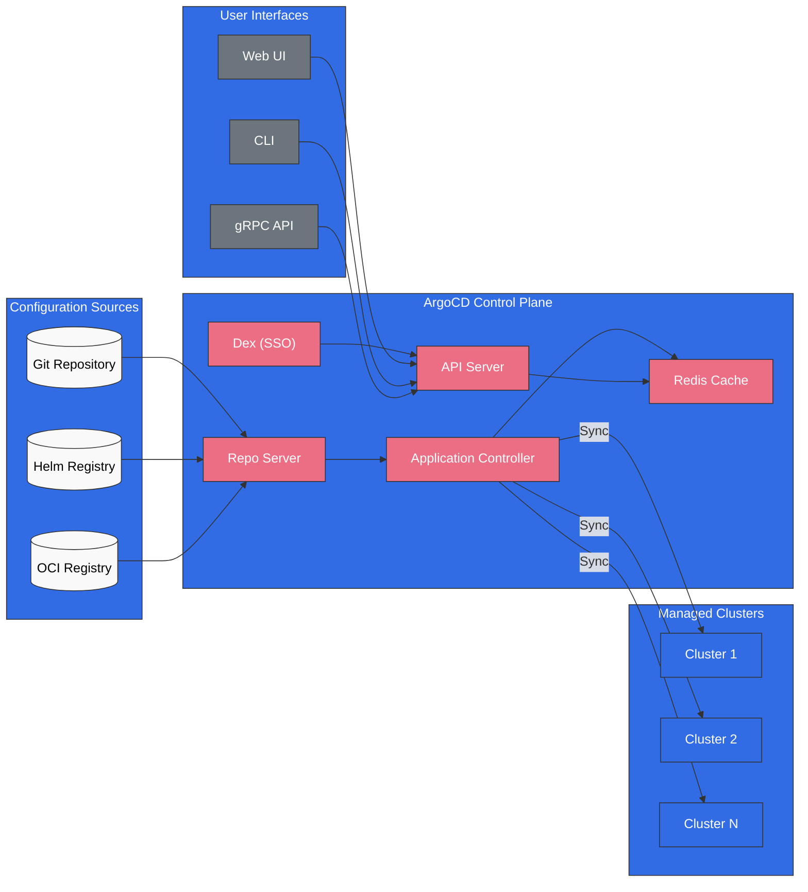
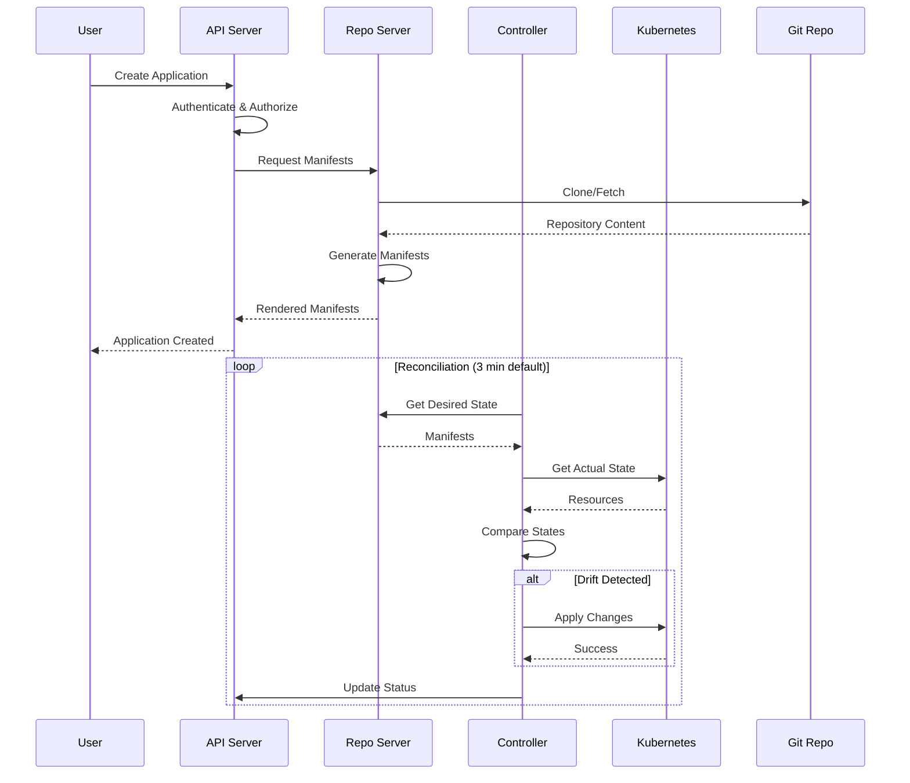

# ArgoCD

> **Versiones compatibles**: ArgoCD v2.9+, Argo Rollouts v1.6+
> **Última actualización**: August 24, 2026

## Tabla de contenido
- [¿Qué es ArgoCD?](#what-is-argocd)
- [Beneficios principales](#key-benefits)
- [Descripción general de la arquitectura](#architecture-overview)
- [Conceptos principales](#core-concepts)
- [Navegación por las subguías](#sub-guide-navigation)
- [Inicio rápido](#quick-start)
- [Compatibilidad de versiones](#version-compatibility)

## ¿Qué es ArgoCD?

ArgoCD es una herramienta de entrega continua declarativa de GitOps para Kubernetes. Automatiza el despliegue de aplicaciones en clústeres de Kubernetes sincronizando el estado deseado definido en repositorios Git con el estado real del clúster.

Como proyecto graduado de CNCF, ArgoCD se ha convertido en el estándar de facto para los despliegues de Kubernetes basados en GitOps, utilizado por miles de organizaciones en todo el mundo.



## Beneficios principales

### GitOps nativo

- **Git como fuente única de la verdad**: todas las configuraciones de aplicaciones se almacenan en Git
- **Despliegues declarativos**: defina el estado deseado; ArgoCD se encarga del resto
- **Registro de auditoría**: historial completo de todos los cambios mediante commits de Git
- **Reversión**: reversión instantánea a cualquier estado anterior

### Gestión de múltiples clústeres

- **Control centralizado**: administre cientos de clústeres desde una única instancia de ArgoCD
- **ApplicationSet**: despliegues de múltiples clústeres basados en plantillas
- **Cluster Generator**: selección dinámica de clústeres según etiquetas

### Listo para empresas

- **RBAC**: control de acceso detallado basado en roles
- **Integración de SSO**: compatibilidad con OIDC, SAML y LDAP
- **Multi-tenancy**: aislamiento basado en proyectos
- **Alta disponibilidad**: despliegue de HA listo para producción

### Experiencia de desarrollo

- **Web UI**: gestión y supervisión visual de aplicaciones
- **CLI**: interfaz de línea de comandos con todas las funciones
- **Notificaciones**: integraciones con Slack, Teams, correo electrónico y webhooks
- **Supervisión de estado**: comprobaciones de estado integradas y personalizadas

## Descripción general de la arquitectura

### Componentes principales

| Componente | Descripción | Réplicas (HA) |
|-----------|-------------|---------------|
| **API Server** | Gestiona todas las solicitudes de API, la autenticación y RBAC | 2+ |
| **Repository Server** | Clona repositorios, genera manifests y almacena en caché los resultados | 2+ |
| **Application Controller** | Supervisa las aplicaciones y reconcilia el estado | 2+ (fragmentado) |
| **Redis** | Capa de caché para el repo server y el controller | 3 (HA) |
| **Dex** | Proveedor de OIDC para la integración de SSO | 2+ |
| **Notification Controller** | Envía notificaciones sobre eventos | 1+ |
| **ApplicationSet Controller** | Gestiona recursos ApplicationSet | 1+ |

### Flujo de datos



## Conceptos principales

### Application

El CRD Application es el recurso principal de ArgoCD. Define:
- **Fuente**: de dónde obtener los manifests (repositorio Git, chart de Helm, OCI)
- **Destino**: dónde desplegar (clúster y namespace)
- **Política de sincronización**: cómo gestionar la sincronización

### Project

Los proyectos proporcionan agrupación lógica y control de acceso:
- Restringen qué repositorios se pueden utilizar
- Limitan los clústeres y namespaces de destino
- Definen recursos permitidos/denegados

### ApplicationSet

ApplicationSet permite gestionar múltiples aplicaciones desde una única definición mediante generadores:
- **List Generator**: lista estática de valores
- **Cluster Generator**: dirige los clústeres registrados
- **Git Generator**: explora directorios/archivos del repositorio
- **Matrix/Merge**: combina múltiples generadores

### Sync

La sincronización hace que el estado del clúster coincida con el estado deseado:
- **Sincronización manual**: activada por el usuario
- **Sincronización automática**: automática ante cambios en Git
- **Self-Heal**: corrige automáticamente la desviación
- **Prune**: elimina recursos huérfanos

## Navegación por las subguías

| Guía | Descripción |
|-------|-------------|
| [Instalación](01-installation.md) | Métodos de instalación, configuración de CLI, configuración de HA, integración de EKS |
| [Applications](02-applications.md) | CRD Application, tipos de fuente, comprobaciones de estado, hooks, App of Apps |
| [Estrategias de sincronización](03-sync-strategies.md) | Políticas de sincronización, waves, ventanas, comparación de diferencias, configuración de reintentos |
| [ApplicationSets](04-applicationsets.md) | Todos los generadores, plantillas, sincronización progresiva, patrones de múltiples clústeres |
| [Gestión de tráfico](05-traffic-management.md) | Argo Rollouts, blue-green, canary, análisis, integración de ingress |
| [Proyectos y RBAC](06-projects-rbac.md) | AppProject, políticas de RBAC, multi-tenancy, tokens JWT |
| [Seguridad](07-security.md) | Integración de SSO, gestión de secretos, TLS, registro de auditoría |
| [Notificaciones](08-notifications.md) | Servicios de notificación, triggers, plantillas, suscripciones |
| [Prácticas recomendadas](09-best-practices.md) | Patrones de repositorio, ajuste de rendimiento, solución de problemas, consejos para EKS |
| [Análisis detallado de experimentos de Rollouts](10-rollouts-experiment.md) | CRD Experiment, validación efímera de ReplicaSet, veredictos de AnalysisRun |

## Inicio rápido

### 1. Instale ArgoCD

```bash
# Create namespace
kubectl create namespace argocd

# Install ArgoCD
kubectl apply -n argocd -f https://raw.githubusercontent.com/argoproj/argo-cd/stable/manifests/install.yaml

# Wait for pods to be ready
kubectl wait --for=condition=Ready pods --all -n argocd --timeout=300s
```

### 2. Acceda a la UI

```bash
# Port forward to access locally
kubectl port-forward svc/argocd-server -n argocd 8080:443
```

### 3. Obtenga la contraseña inicial

```bash
# Retrieve the initial admin password
kubectl -n argocd get secret argocd-initial-admin-secret \
  -o jsonpath="{.data.password}" | base64 -d && echo
```

### 4. Inicie sesión mediante CLI

```bash
# Install CLI (macOS)
brew install argocd

# Login
argocd login localhost:8080

# Change password (recommended)
argocd account update-password
```

### 5. Despliegue su primera aplicación

```bash
# Create application via CLI
argocd app create guestbook \
  --repo https://github.com/argoproj/argocd-example-apps.git \
  --path guestbook \
  --dest-server https://kubernetes.default.svc \
  --dest-namespace default

# Sync the application
argocd app sync guestbook
```

O de forma declarativa:

```yaml
apiVersion: argoproj.io/v1alpha1
kind: Application
metadata:
  name: guestbook
  namespace: argocd
spec:
  project: default
  source:
    repoURL: https://github.com/argoproj/argocd-example-apps.git
    targetRevision: HEAD
    path: guestbook
  destination:
    server: https://kubernetes.default.svc
    namespace: default
  syncPolicy:
    automated:
      prune: true
      selfHeal: true
```

## Compatibilidad de versiones

### Actualización de agosto de 2026: configuración personalizada para la capacidad administrada de Argo CD de EKS

El 21 de agosto de 2026, AWS anunció que Amazon EKS Capability for Argo CD ahora admite configuración personalizada mediante el ConfigMap estándar `argocd-cm` de su clúster. Puede definir comprobaciones de estado personalizadas para sus Custom Resources, personalizar el contenido del banner de la UI de Argo CD y ajustar cómo la capacidad observa y compara los recursos que administra; todo se configura del mismo modo que en Argo CD upstream, mientras AWS aplica los ajustes a la capacidad administrada. Consulte el [anuncio](https://aws.amazon.com/about-aws/whats-new/2026/08/amazon-eks-argo-cd-configuration) y la [guía de configuración](https://docs.aws.amazon.com/eks/latest/userguide/argocd-configure-settings.html) para obtener más información.

### Actualización de agosto de 2026: ArgoCD 3.5 GA y versiones de parche

ArgoCD v3.5.0 alcanzó GA el 7 de agosto de 2026, lo que convierte a 3.5 en la línea de versión estable actual. El 12 de agosto le siguieron parches coordinados para las tres líneas de versiones mantenidas: v3.5.1 / v3.4.7 / v3.3.14. v3.5.1 incluye correcciones de errores como impedir que la sincronización progresiva de ApplicationSet se reconcilie en un bucle cerrado y correcciones de enmascaramiento de Secret en diferencias del lado del servidor, incluida la ocultación de secretos en la anotación `last-applied-configuration`. Consulte las [notas de la versión v3.5.1](https://github.com/argoproj/argo-cd/releases/tag/v3.5.1) para obtener más información.

### Actualización de julio de 2026: versiones de parche de ArgoCD 3.x

ArgoCD v3.4.5 se lanzó el 9 de julio de 2026. Las tablas siguientes se escribieron para la era 2.x; consulte la [página de versiones de ArgoCD](https://github.com/argoproj/argo-cd/releases) para obtener información de compatibilidad actualizada para cada versión.

En ArgoCon Japan, celebrado el 28 de julio de 2026 en Yokohama como evento conjunto de KubeCon + CloudNativeCon Japan, el mantenedor principal de Argo CD compartió una propuesta para la siguiente versión (3.5) ([blog de CNCF](https://www.cncf.io/blog/2026/07/20/argocon-japan-2026-meeting-the-maintainers-enterprise-insights-and-the-road-to-argo-cd-3-5/)).

### Actualización de agosto de 2026: lanzamiento de ArgoCD v3.5.0

[ArgoCD v3.5.0](https://github.com/argoproj/argo-cd/releases/tag/v3.5.0) alcanzó GA el 4 de agosto de 2026, lo que convierte a 3.5 en la línea de versión estable actual. Entre los cambios destacados se incluyen:

- **Migración de Helm 3 → Helm 4**: el renderizado de manifests ahora utiliza Helm 4
- **Verificación de integridad de la fuente (Alpha)**: verificación de firmas opcional para fuentes secas en el hidratador de fuentes, además de compatibilidad de CLI para la configuración de Source Integrity
- **Mejoras de ApplicationSet**: gestión simultánea de aplicaciones y filtrado de repositorios según el estado de archivado
- **Jitter de webhook**: jitter configurable para las actualizaciones de aplicaciones activadas por webhook a fin de suavizar picos de actualización de efecto rebaño
- **UI**: creación de aplicaciones de múltiples fuentes en el panel New App, pestaña ApplicationSet Preview Apps y nodos AppSet en el árbol de recursos
- **Nuevas comprobaciones de estado**: GatewayClass, `BackendTLSPolicy` (Gateway API), VictoriaMetrics, Gardener Shoot y más

Las versiones de parche v3.4.6 y v3.3.13 también se publicaron el 31 de julio de 2026 para las líneas anteriores.

### Compatibilidad con Kubernetes

| Versión de ArgoCD | Versiones de Kubernetes |
|----------------|---------------------|
| 2.13.x | 1.28 - 1.31 |
| 2.12.x | 1.27 - 1.30 |
| 2.11.x | 1.26 - 1.29 |
| 2.10.x | 1.25 - 1.28 |
| 2.9.x | 1.24 - 1.27 |

### Compatibilidad con Amazon EKS

| Versión de EKS | ArgoCD recomendado |
|-------------|-------------------|
| 1.31 | 2.13.x |
| 1.30 | 2.12.x - 2.13.x |
| 1.29 | 2.11.x - 2.12.x |
| 1.28 | 2.10.x - 2.11.x |

### Compatibilidad con Argo Rollouts

| Versión de Rollouts | Versión de ArgoCD | Funcionalidades |
|------------------|----------------|----------|
| 1.7.x | 2.10+ | Mejoras de análisis |
| 1.6.x | 2.9+ | Integración de notificaciones |
| 1.5.x | 2.8+ | Entrega progresiva |

## Próximos pasos

1. **[Guía de instalación](01-installation.md)**: configure ArgoCD para producción
2. **[Guía de Applications](02-applications.md)**: aprenda sobre el CRD Application
3. **[Guía de ApplicationSets](04-applicationsets.md)**: despliegues de múltiples clústeres

## Recursos

- [Documentación oficial de ArgoCD](https://argo-cd.readthedocs.io/)
- [Repositorio de GitHub de ArgoCD](https://github.com/argoproj/argo-cd)
- [Documentación de Argo Rollouts](https://argoproj.github.io/argo-rollouts/)
- [Página del proyecto ArgoCD de CNCF](https://www.cncf.io/projects/argo/)

## Cuestionario

Para comprobar lo que ha aprendido, pruebe el [cuestionario de instalación de ArgoCD](../../quizzes/gitops/argocd/01-installation-quiz.md).
